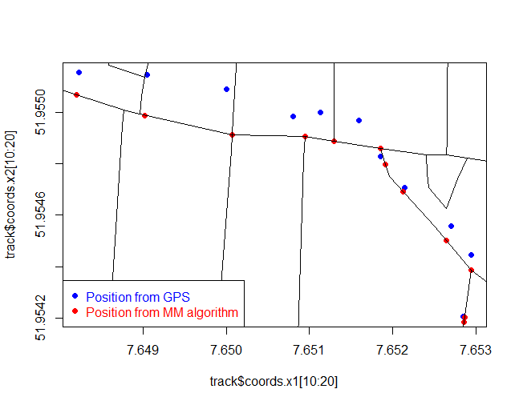

# enviroCaR - Analysis of Car Trajectories

The capital R oviously reveals, that EnviroCaR is the corresponding R package to the project we will work on ((https://envirocar.org/).
 
R is a open-source software for general data analysis. It compiles and runs on a wide variety of platforms and provides a big sample of statistical and graphical methods. Furthermore, R is easily extendable through a massive amount of so-called packages. Currently, there are round about 6000 packages available on the "Comprehensive R Archive Network", short called CRAN. The number of developers and published packages are growing continuously. Additionally, each package has got help pages, several documentations and useful example code chunks [@R].

As mentioned before R packages are usually available on CRAN and can be installed from there relatively straightforward. However, the EnviroCaR package is not on CRAN as yet and needs to be installed from github (https://github.com/enviroCar/enviroCaR). For the installation you can use Hadley`s devtools package to accomplish this easily [@dev].

```{r, eval=FALSE}
library(devtools)
install_github('enviroCaR', 'enviroCar')
``` 

- R
- Trajectories
 - Track
 - Tracks
 - TracksCollection
- EnviroCaR (github)
 - ImportSingleTrack
 - ImportEnviroCar

# Aggregation

\newpage 

# Map Matching
Map matching is the process of matching GPS trajectories to a digital road
network and is done using map matching algorithms.
This is necessary because positions acquired from GPS, as they are in the
enviroCaR project, are affected by several kind of errors resulting in inaccurate
positions on maps.  
Matching the enviroCar trajectories to a digital road network would not only improve
the visual representation, but could also be useful when it comes to analysis or
comparison of trajectories.


One possible way of achieving this is the fuzzyMM package [@mm] which implements
a fuzzy logic based map matching algorithm.  
As can be seen in Figure 1 the raw GPS positions are matched to road segments after the
application of the map matching algorithm.



At the moment fuzzyMM only works for SpatialPointsDataFrame objects which contain the 
GPS positions of the track and GPS data such as HDOP, speed and bearing.
Since all of this is also included in the Track class, it should be no problem to modify
the function to work with the trajectorie classes.


# Conclusion


# References

