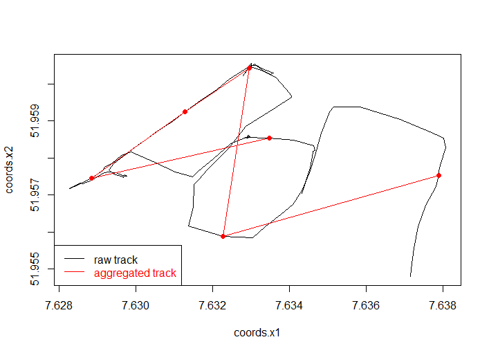

# enviroCaR - Analysis of Car Trajectories

The capital R in the name "enviroCaR" obviously reveals that it is the R package corresponding to the project we will work on (https://envirocar.org/). In general, `enviroCaR` provides basic functions to load and analyse measurements from the enviroCar server [@envirocar]. 
 
R is a open-source software for general data analysis. It compiles and runs on a wide variety of platforms and provides a big sample of statistical and graphical methods. Furthermore, R is easily extendable through a massive amount of so-called packages. Currently, there are round about 6000 packages available on the "Comprehensive R Archive Network", short called CRAN. The number of developers and published packages are growing continuously. Additionally, each package has got help pages, several documentations and useful example code chunks [@R].

As mentioned before R packages are usually available on CRAN and can be installed from there relatively straightforward. However, the EnviroCaR package is not on CRAN as yet and needs to be installed from github (https://github.com/enviroCar/enviroCaR). For the installation you can use the `devtools` package to accomplish this easily [@dev].

```{r, eval = FALSE}
library(devtools)
install_github('enviroCaR', 'enviroCar')
``` 

# Trajectories
For improving the overall handling of trajectories in R a package called `trajectories` was developed by Edzer Pebesma and Benedikt Klus. This package provides useful methods and classes to work with trajectory data [@traj]. 

In general, there are three data classes for the representation of trajectories.

The simplest one is the `Track`, which represents one single track.  The class contains five slots `@sp` to store the geometry like coordinates, `@time` to store the timestamps,
to store the time, `@endtime` to store the end time when having generalised line
geometries with one value per attribute for a set of points, `@data` to store the attributes and `@connections` to keep a record of attribute data between point like speed and distance.

The class `Tracks` embodies a collection of tracks followed by a single person,
animal or object. In general, the class contains two slots: one for storing the tracks
as objects of class `Track` and one for holding a summary record for each track.

The last one is the class `TracksCollection`, which is also a collection of tracks but now in contrast to `Tracks` followed by many persons, animals or objects. Equal to `Tracks` the class has same two slots.
 
# Import enviroCar data
To load data from the enviroCar server you can easily use two provided import functions from the `enviroCaR` package. 
Therefore, `importSingleTrack` allows you to import one single track and stores the loaded track as an object of class `Tracks` with a list of one `Track`. Required arguments for the function are the `serverUrl` and the `trackID`.

```{r, eval = FALSE, warning = FALSE, message= FALSE}
require(enviroCaR)
tracks <- importSingleTrack("https://envirocar.org/api/stable", "52af4fd3e4b0593cce13bfc7")
```

For importing several tracks you can use the function `importEnviroCar`. For this, you can select the tracks either with their Ids or a defined bounding box or a certain time interval.
In the following example we use the track Ids to specify the data that should be retrieved.  
 
```{r, eval = FALSE, warning = FALSE, message= FALSE}
require(sp)
ids <- getTrackIDs("https://envirocar.org/api/stable", bbox(tracks))
trcol <- importEnviroCar("https://envirocar.org/api/stable", ids[4:6])
```
`trcol` is an object of the class `TracksCollection`.  

# Plot 
To plot the `TracksCollection` you can use the `stplot` from the `spacetime` package [@st].
For the plot you can also specify an certain attribute (see the example below). currently, the plot method only works for objects of the class `TracksCollection`. 
```{r, eval = FALSE, warning = FALSE, message= FALSE}
require(spacetime)
stplot(trcol, attr = "speed", lwd = 3, by = "IDs")
```

\begin{figure}[h!]
  \centering
    \includegraphics[width=1\textwidth]{figures/stplot.png}
    \caption{Plot TracksCollection with attribute speed}
    \label{fig:st}
\end{figure}

\newpage

# Aggregation
One function provided by the enviroCaR package is `aggregateTrack`.
This function is used to aggregate measurements of a Track object.  
It is possible to specify the phenomenon for aggregation, the interval size
of measurements that have to be aggregated and a function for aggregation (e.g. mean).  
Aggregation over time is not possible at the moment!
In Figure 1 we can see an example of an aggregated track. The raw track (black) is
aggregated to six points (red).




# Map Matching
Map matching is the process of matching GPS trajectories to a digital road
network and is done using map matching algorithms.
This is necessary because positions acquired from GPS, as they are in the
enviroCaR project, are affected by several kind of errors resulting in inaccurate
positions on maps.  
Matching the enviroCar trajectories to a digital road network would not only improve
the visual representation, but could also be useful when it comes to analysis or
comparison of trajectories.


One possible way of achieving this is the `fuzzyMM` package [@mm] which implements
a fuzzy logic based map matching algorithm.  
As can be seen in Figure 2 the raw GPS positions are matched to road segments after the
application of the map matching algorithm.

\begin{figure}[h!]
  \centering
    \includegraphics[width=1\textwidth]{figures/urban.png}
    \caption{Map Matching}
    \label{fig:mm}
\end{figure}

At the moment fuzzyMM only works for `SpatialPointsDataFrame` objects which contain the 
GPS positions of the track and GPS data such as HDOP, speed and bearing.
Since all of this is also included in the `Track` class, it should be no problem to modify
the function to work with the trajectory classes.


# Conclusion
As can be seen in the previous sections, what we can do with the enviroCar data in R
until now is mostly basics.
We can load enviroCar tracks into R, where they are represented by the classes from the 
trajectories package and we can also do some basic plotting and aggregate measurements of a Track object.


So there are several things that could be done in the future and maybe in the scope of this course. 
This, for example, includes implementing map matching to assign trajectories to road segments.
Other things to think about are aggregation methods, e.g. the aggregation over multiple trajectories
or aggregation over space and/or time.
What may be also important and interesting is comparing trajectories of one driver and also 
comparing trajectories between different drivers.


# References

