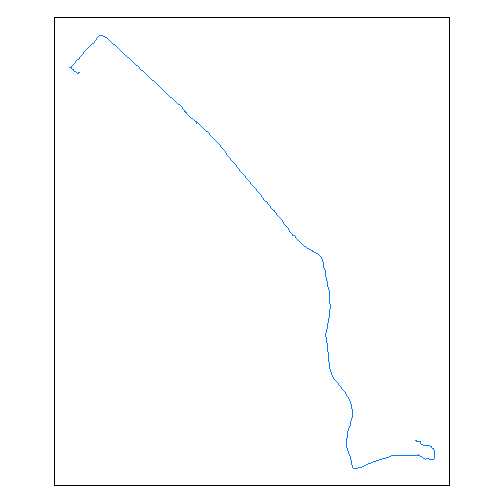
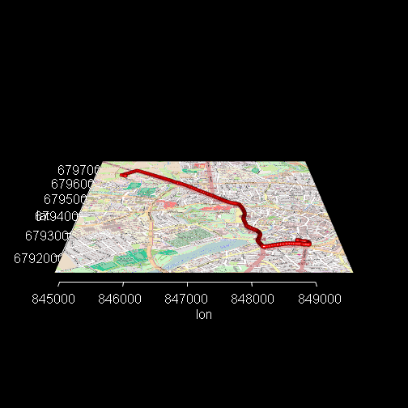

## enviroCaR 
### An R Package

Nikolai Gorte & Simon Schoemaker

--- 

## Import single Track


```r
track <- importSingleTrack("https://envirocar.org/api/stable", "53b5228ee4b01607fa566b78")
```

```
## OGR data source with driver: GeoJSON 
## Source: "{"type":"FeatureCollection","properties":{"id":"53b5228ee4b01607fa566b78","sensor":{"type":"car","properties":{"id":"53b273d6e4b01607fa5364eb","model":"kangoo","fuelType":"gasoline","manufacturer":"Renault","constructionYear":2008,"engineDisplacement":1149}}},"features":[{"type":"Feature","geometry":{"type":"Point","coordinates":[7.595856925472617,51.97629924863577]},"properties":{"id":"53b5228ee4b01607fa566b7a","time":"2014-07-01T06:28:52Z","phenomenons":{"GPS Altitude":{"value":102.70000000000005,"unit":"m"},"GPS PDOP":{"value":2.0,"unit":"precision"},"GPS VDOP":{"value":1.7,"unit":"precision"},"GPS Speed":{"value":1.125,"unit":"km/h"},"GPS HDOP":{"value":0.8,"unit":"precision"},"GPS Bearing":{"value":0.0,"unit":"deg"},"GPS Accuracy":{"value":10.0,"unit":"%"}}}},{"type":"Feature","geometry":{"type":"Point","coordinates":[7.595863714814186,51.97631534188986]},"properties":{"id":"53b5228ee4b01607fa566b7c","time":"2014-07-01T06:28:53Z","phenomenons":{"GPS PDOP":{"value":2.0,"unit":"precision"},"GPS VDOP":{"value":1.7,"unit":"precision"},"GPS Speed":{"value":1.125,"unit":"km/h"},"GPS Altitude":{"value":103.60000000000002,"unit":"m"},"GPS HDOP":{"value":0.8,"unit":"precision"},"GPS Bearing":{"value":0.0,"unit":"deg"},"GPS Accuracy":{"value":10.0,"unit":"%"}}}},{"type":"Feature","geometry":{"type":"Point","coordinates":[7.595881316810846,51.976303230039775]},"properties":{"id":"53b5228ee4b01607fa566b7e","time":"2014-07-01T06:28:54Z","phenomenons":{"GPS PDOP":{"value":2.0,"unit":"precision"},"GPS VDOP":{"value":1.7,"unit":"precision"},"GPS Speed":{"value":1.35,"unit":"km/h"},"GPS HDOP":{"value":0.8,"unit":"precision"},"GPS Bearing":{"value":0.0,"unit":"deg"},"GPS Accuracy":{"value":10.0,"unit":"%"},"GPS Altitude":{"value":100.5,"unit":"m"}}}},{"type":"Feature","geometry":{"type":"Point","coordinates":[7.5958918780088425,51.9763054093346]},"properties":{"id":"53b5228ee4b01607fa566b80","time":"2014-07-01T06:28:55Z","phenomenons":{"GPS VDOP":{"value":1.7,"unit":"precision"},"GPS Speed":{"value":1.35,"unit":"km/h"},"GPS HDOP":{"value":0.8,"unit":"precision"},"GPS Bearing":{"value":0.0,"unit":"deg"},"GPS PDOP":{"value":1.9,"unit":"precision"},"GPS Accuracy":{"value":10.0,"unit":"%"},"GPS Altitude":{"value":98.0,"unit":"m"}}}},{"type":"Feature","geometry":{"type":"Point","coordinates":[7.595903528854251,51.976306079886854]},"properties":{"id":"53b5228ee4b01607fa566b82","time":"2014-07-01T06:28:57Z","phenomenons":{"GPS VDOP":{"value":1.7,"unit":"precision"},"GPS Altitude":{"value":96.79999999999995,"unit":"m"},"GPS Bearing":{"value":121.47000122070312,"unit":"deg"},"GPS Speed":{"value":1.8,"unit":"km/h"},"GPS HDOP":{"value":0.8,"unit":"precision"},"GPS PDOP":{"value":1.9,"unit":"precision"},"GPS Accuracy":{"value":10.0,"unit":"%"}}}},{"type":"Feature","geometry":{"type":"Point","coordinates":[7.595921214669943,51.976283113472164]},"properties":{"id":"53b5228ee4b01607fa566b84","time":"2014-07-01T06:28:59Z","phenomenons":{"GPS VDOP":{"value":1.7,"unit":"precision"},"GPS Altitude":{"value":93.0,"unit":"m"},"GPS Speed":{"value":2.025,"unit":"km/h"},"GPS Bearing":{"value":133.50999450683594,"unit":"deg"},"GPS HDOP":{"value":0.8,"unit":"precision"},"GPS PDOP":{"value":1.9,"unit":"precision"},"GPS Accuracy":{"value":10.0,"unit":"%"}}}},{"type":"Feature","geometry":{"type":"Point","coordinates":[7.595918197184801,51.976287555880845]},"properties":{"id":"53b5228ee4b01607fa566b86","time":"2014-07-01T06:29:00Z","phenomenons":{"GPS Bearing":{"value":139.6699981689453,"unit":"deg"},"GPS PDOP":{"value":1.4,"unit":"precision"},"GPS HDOP":{"value":0.6,"unit":"precision"},"GPS Speed":{"value":2.025,"unit":"km/h"},"GPS Altitude":{"value":98.79999999999995,"unit":"m"},"GPS VDOP":{"value":1.2,"unit":"precision"},"GPS Accuracy":{"value":10.0,"unit":"%"}}}},{"type":"Feature","geometry":{"type":"Point","coordinates":[7.595907049253583,51.97631898801774]},"properties":{"id":"53b5228ee4b01607fa566b88","time":"2014-07-01T06:29:02Z","phenomenons":{"GPS PDOP":{"value":1.4,"unit":"precision"},"GPS Speed":{"value":0.45,"unit":"km/h"},"GPS HDOP":{"value":0.6,"unit":"precision"},"GPS Altitude":{"value":105.0,"unit":"m"},"GPS VDOP":{"value":1.2,"unit":"precision"},"GPS Bearing":{"value":140.5399932861328,"unit":"deg"},"GPS Accuracy":{"value":10.0,"unit":"%"}}}},{"type":"Feature","geometry":{"type":"Point","coordinates":[7.595908725634217,51.976320035755634]},"properties":{"id":"53b5228ee4b01607fa566b8a","time":"2014-07-01T06:29:03Z","phenomenons":{"GPS Speed":{"value":0.225,"unit":"km/h"},"GPS HDOP":{"value":0.6,"unit":"precision"},"GPS VDOP":{"value":1.3,"unit":"precision"},"GPS Bearing":{"value":140.13999938964844,"unit":"deg"},"GPS PDOP":{"value":1.5,"unit":"precision"},"GPS Altitude":{"value":104.79999999999995,"unit":"m"},"GPS Accuracy":{"value":10.0,"unit":"%"}}}},{"type":"Feature","geometry":{"type":"Point","coordinates":[7.595902271568775,51.97631106711924]},"properties":{"id":"53b5228ee4b01607fa566b8c","time":"2014-07-01T06:29:05Z","phenomenons":{"Intake Pressure":{"value":32.0,"unit":"kPa"},"GPS VDOP":{"value":1.8,"unit":"precision"},"Consumption":{"value":1.496064086101348,"unit":"l/h"},"GPS HDOP":{"value":1.0,"unit":"precision"},"GPS Accuracy":{"value":10.0,"unit":"%"},"Intake Temperature":{"value":49.0,"unit":"c"},"GPS Speed":{"value":0.225,"unit":"km/h"},"Long-Term Fuel Trim 1":{"value":52.34375,"unit":"%"},"GPS PDOP":{"value":2.1,"unit":"precision"},"Engine Load":{"value":22.745098114013672,"unit":"%"},"GPS Altitude":{"value":102.39999999999998,"unit":"m"},"CO2":{"value":3.5157506023381675,"unit":"kg/h"},"Throttle Position":{"value":18.0,"unit":"%"},"Speed":{"value":0.0,"unit":"km/h"},"GPS Bearing":{"value":140.11000061035156,"unit":"deg"},"Rpm":{"value":1616.0,"unit":"u/min"},"Calculated MAF":{"value":4.551151621927476,"unit":"g/s"},"Short-Term Fuel Trim 1":{"value":49.21875,"unit":"%"}}}},{"type":"Feature","geometry":{"type":"Point","coordinates":[7.595902271568775,51.97631106711924]},"properties":{"id":"53b5228ee4b01607fa566b8e","time":"2014-07-01T06:29:06Z","phenomenons":{"GPS PDOP":{"value":1.6,"unit":"precision"},"GPS VDOP":{"value":1.4,"unit":"precision"},"GPS Bearing":{"value":139.85000610351562,"unit":"deg"},"GPS Altitude":{"value":102.39999999999998,"unit":"m"},"GPS HDOP":{"value":0.8,"unit":"precision"},"GPS Accuracy":{"value":10.0,"unit":"%"},"GPS Speed":{"value":0.675,"unit":"km/h"}}}},{"type":"Feature","geometry":{"type":"Point","coordinates":[7.595851980149746,51.97626714594662]},"properties":{"id":"53b5228ee4b01607fa566b90","time":"2014-07-01T06:29:08Z","phenomenons":{"Throttle Position":{"value":17.0,"unit":"%"},"GPS VDOP":{"value":1.4,"unit":"precision"},"GPS Altitude":{"value":90.20000000000005,"unit":"m"},"Rpm":{"value":1381.0,"unit":"u/min"},"Calculated MAF":{"value":4.132402019956348,"unit":"g/s"},"GPS HDOP":{"value":0.8,"unit":"precision"},"Consumption":{"value":1.3584118405554355,"unit":"l/h"},"Short-Term Fuel Trim 1":{"value":44.53125,"unit":"%"},"GPS Accuracy":{"value":10.0,"unit":"%"},"Intake Temperature":{"value":49.0,"unit":"c"},"GPS PDOP":{"value":1.7,"unit":"precision"},"Long-Term Fuel Trim 1":{"value":52.34375,"unit":"%"},"Engine Load":{"value":21.960784912109375,"unit":"%"},"GPS Speed":{"value":2.7,"unit":"km/h"},"Speed":{"value":0.0,"unit":"km/h"},"GPS Bearing":{"value":218.67999267578125,"unit":"deg"},"CO2":{"value":3.1922678253052736,"unit":"kg/h"},"Intake Pressure":{"value":34.0,"unit":"kPa"}}}},{"type":"Feature","geometry":{"type":"Point","coordinates":[7.595804957672954,51.97626106906682]},"properties":{"id":"53b5228ee4b01607fa566b92","time":"2014-07-01T06:29:10Z","phenomenons":{"GPS PDOP":{"value":1.7,"unit":"precision"},"GPS VDOP":{"value":1.4,"unit":"precision"},"GPS Speed":{"value":5.175,"unit":"km/h"},"GPS HDOP":{"value":0.8,"unit":"precision"},"GPS Bearing":{"value":265.20001220703125,"unit":"deg"},"GPS Accuracy":{"value":5.0,"unit":"%"},"GPS Altitude":{"value":86.79999999999995,"unit":"m"}}}},{"type":"Feature","geometry":{"type":"Point","coordinates":[7.595731783658266,51.9762795092538]},"properties":{"id":"53b5228ee4b01607fa566b94","time":"2014-07-01T06:29:12Z","phenomenons":{"Engine Load":{"value":20.39215660095215,"unit":"%"},"GPS VDOP":{"value":1.4,"unit":"precision"},"Consumption":{"value":3.9224814534690786,"unit":"l/h"},"GPS Altitude":{"value":85.29999999999995,"unit":"m"},"Calculated MAF":{"value":11.932515454907392,"unit":"g/s"},"GPS HDOP":{"value":0.8,"unit":"precision"},"GPS Accuracy":{"value":10.0,"unit":"%"},"GPS Bearing":{"value":283.94000244140625,"unit":"deg"},"Intake Temperature":{"value":49.0,"unit":"c"},"GPS PDOP":{"value":1.7,"unit":"precision"},"Speed":{"value":7.0,"unit":"km/h"},"Long-Term Fuel Trim 1":{"value":52.34375,"unit":"%"},"Rpm":{"value":2298.0,"unit":"u/min"},"CO2":{"value":9.217831415652334,"unit":"kg/h"},"Intake Pressure":{"value":59.0,"unit":"kPa"},"GPS Speed":{"value":8.775,"unit":"km/h"},"Throttle Position":{"value":15.0,"unit":"%"},"Short-Term Fuel Trim 1":{"value":50.0,"unit":"%"}}}},{"type":"Feature","geometry":{"type":"Point","coordinates":[7.595685012638569,51.976297069340944]},"properties":{"id":"53b5228ee4b01607fa566b96","time":"2014-07-01T06:29:13Z","phenomenons":{"GPS Speed":{"value":10.35,"unit":"km/h"},"GPS Bearing":{"value":288.8599853515625,"unit":"deg"},"GPS PDOP":{"value":2.2,"unit":"precision"},"GPS Altitude":{"value":85.70000000000005,"unit":"m"},"GPS HDOP":{"value":1.0,"unit":"precision"},"GPS Accuracy":{"value":10.0,"unit":"%"},"GPS VDOP":{"value":1.9,"unit":"precision"}}}},{"type":"Feature","geometry":{"type":"Point","coordinates":[7.595550734549761,51.97636341210455]},"properties":{"id":"53b5228ee4b01607fa566b98","time":"2014-07-01T06:29:15Z","phenomenons":{"GPS VDOP":{"value":2.0,"unit":"precision"},"GPS Bearing":{"value":300.3699951171875,"unit":"deg"},"Throttle Position":{"value":17.0,"unit":"%"},"GPS Speed":{"value":17.325,"unit":"km/h"},"GPS Altitude":{"value":84.29999999999995,"unit":"m"},"Intake Pressure":{"value":36.0,"unit":"kPa"},"GPS HDOP":{"value":1.0,"unit":"precision"},"Consumption":{"value":2.3131826281775876,"unit":"l/h"},"Engine Load":{"value":23.921567916870117,"unit":"%"},"GPS Accuracy":{"value":10.0,"unit":"%"},"CO2":{"value":5.435979176217331,"unit":"kg/h"},"Intake Temperature":{"value":49.0,"unit":"c"},"Speed":{"value":22.0,"unit":"km/h"},"Long-Term Fuel Trim 1":{"value":52.34375,"unit":"%"},"GPS PDOP":{"value":2.3,"unit":"precision"},"Calculated MAF":{"value":7.036894320135235,"unit":"g/s"},"Rpm":{"value":2221.0,"unit":"u/min"},"Short-Term Fuel Trim 1":{"value":50.0,"unit":"%"}}}},{"type":"Feature","geometry":{"type":"Point","coordinates":[7.595424419268966,51.97642258834094]},"properties":{"id":"53b5228ee4b01607fa566b9a","time":"2014-07-01T06:29:17Z","phenomenons":{"GPS Speed":{"value":17.1,"unit":"km/h"},"GPS Bearing":{"value":303.7200012207031,"unit":"deg"},"GPS PDOP":{"value":1.8,"unit":"precision"},"GPS HDOP":{"value":0.8,"unit":"precision"},"GPS VDOP":{"value":1.5,"unit":"precision"},"GPS Altitude":{"value":83.89999999999998,"unit":"m"},"GPS Accuracy":{"value":10.0,"unit":"%"}}}},{"type":"Feature","geometry":{"type":"Point","coordinates":[7.595375049859285,51.97645381093025]},"properties":{"id":"53b5228ee4b01607fa566b9c","time":"2014-07-01T06:29:18Z","phenomenons":{"GPS VDOP":{"value":2.0,"unit":"precision"},"Throttle Position":{"value":17.0,"unit":"%"},"GPS Altitude":{"value":83.5,"unit":"m"},"CO2":{"value":3.08858868649027,"unit":"kg/h"},"GPS Bearing":{"value":306.6600036621094,"unit":"deg"},"GPS PDOP":{"value":2.2,"unit":"precision"},"GPS Speed":{"value":15.525,"unit":"km/h"},"Calculated MAF":{"value":3.998189007103805,"unit":"g/s"},"Engine Load":{"value":19.215686798095703,"unit":"%"},"GPS HDOP":{"value":1.0,"unit":"precision"},"GPS Accuracy":{"value":10.0,"unit":"%"},"Short-Term Fuel Trim 1":{"value":43.75,"unit":"%"},"Long-Term Fuel Trim 1":{"value":52.34375,"unit":"%"},"Speed":{"value":23.0,"unit":"km/h"},"Rpm":{"value":1887.0,"unit":"u/min"},"Intake Pressure":{"value":24.0,"unit":"kPa"},"Consumption":{"value":1.314293058080966,"unit":"l/h"},"Intake Temperature":{"value":48.0,"unit":"c"}}}},{"type":"Feature","geometry":{"type":"Point","coordinates":[7.595332469791174,51.97648947592825]},"properties":{"id":"53b5228ee4b01607fa566b9e","time":"2014-07-01T06:29:19Z","phenomenons":{"GPS VDOP":{"value":2.0,"unit":"precision"},"GPS Speed":{"value":15.525,"unit":"km/h"},"GPS Altitude":{"value":84.29999999999995,"unit":"m"},"GPS PDOP":{"value":2.2,"unit":"precision"},"GPS Bearing":{"value":311.94000244140625,"unit":"deg"},"GPS HDOP":{"value":1.0,"unit":"precision"},"GPS Accuracy":{"value":10.0,"unit":"%"}}}},{"type":"Feature","geometry":{"type":"Point","coordinates":[7.595223085954785,51.976563446223736]},"properties":{"id":"53b5228ee4b01607fa566ba0","time":"2014-07-01T06:29:21Z","phenomenons":{"GPS Bearing":{"value":305.44000244140625,"unit":"deg"},"GPS PDOP":{"value":1.8,"unit":"precision"},"CO2":{"value":4.452137379991393,"unit":"kg/h"},"Speed":{"value":21.0,"unit":"km/h"},"Calculated MAF":{"value":5.7633076261200635,"unit":"g/s"},"GPS Speed":{"value":18.0,"unit":"km/h"},"GPS HDOP":{"value":0.8,"unit":"precision"},"Engine Load":{"value":13.72549057006836,"unit":"%"},"GPS Accuracy":{"value":10.0,"unit":"%"},"Rpm":{"value":1871.0,"unit":"u/min"},"Intake Temperature":{"value":49.0,"unit":"c"},"Intake Pressure":{"value":35.0,"unit":"kPa"},"Long-Term Fuel Trim 1":{"value":52.34375,"unit":"%"},"Consumption":{"value":1.8945265446771884,"unit":"l/h"},"Throttle Position":{"value":16.0,"unit":"%"},"Short-Term Fuel Trim 1":{"value":42.1875,"unit":"%"},"GPS VDOP":{"value":1.5,"unit":"precision"},"GPS Altitude":{"value":88.0,"unit":"m"}}}},{"type":"Feature","geometry":{"type":"Point","coordinates":[7.595153348520398,51.97658729273826]},"properties":{"id":"53b5228ee4b01607fa566ba2","time":"2014-07-01T06:29:22Z","phenomenons":{"GPS Bearing":{"value":289.6600036621094,"unit":"deg"},"GPS Altitude":{"value":89.5,"unit":"m"},"GPS Speed":{"value":17.55,"unit":"km/h"},"GPS PDOP":{"value":1.8,"unit":"precision"},"GPS HDOP":{"value":0.8,"unit":"precision"},"GPS VDOP":{"value":1.5,"unit":"precision"},"GPS Accuracy":{"value":10.0,"unit":"%"}}}},{"type":"Feature","geometry":{"type":"Point","coordinates":[7.595039438456297,51.97660397272557]},"properties":{"id":"53b5228ee4b01607fa566ba4","time":"2014-07-01T06:29:24Z","phenomenons":{"Throttle Position":{"value":17.0,"unit":"%"},"GPS VDOP":{"value":1.3,"unit":"precision"},"Short-Term Fuel Trim 1":{"value":39.0625,"unit":"%"},"Intake Pressure":{"value":38.0,"unit":"kPa"},"Rpm":{"value":1815.0,"unit":"u/min"},"Calculated MAF":{"value":6.070021027311611,"unit":"g/s"},"GPS Accuracy":{"value":10.0,"unit":"%"},"Intake Temperature":{"value":49.0,"unit":"c"},"Engine Load":{"value":23.13725471496582,"unit":"%"},"GPS Altitude":{"value":90.10000000000002,"unit":"m"},"Long-Term Fuel Trim 1":{"value":52.34375,"unit":"%"},"GPS HDOP":{"value":0.6,"unit":"precision"},"Consumption":{"value":1.9953500158263069,"unit":"l/h"},"GPS Bearing":{"value":268.3800048828125,"unit":"deg"},"GPS PDOP":{"value":1.5,"unit":"precision"},"Speed":{"value":20.0,"unit":"km/h"},"GPS Speed":{"value":13.950000000000001,"unit":"km/h"},"CO2":{"value":4.689072537191821,"unit":"kg/h"}}}},{"type":"Feature","geometry":{"type":"Point","coordinates":[7.595000462606549,51.97658356279135]},"properties":{"id":"53b5228ee4b01607fa566ba6","time":"2014-07-01T06:29:26Z","phenomenons":{"GPS HDOP":{"value":0.6,"unit":"precision"},"GPS VDOP":{"value":1.3,"unit":"precision"},"GPS Speed":{"value":6.525,"unit":"km/h"},"GPS PDOP":{"value":1.5,"unit":"precision"},"GPS Bearing":{"value":240.22999572753906,"unit":"deg"},"GPS Accuracy":{"value":10.0,"unit":"%"},"GPS Altitude":{"value":92.5,"unit":"m"}}}},{"type":"Feature","geometry":{"type":"Point","coordinates":[7.595169609412551,51.976571031846106]},"properties":{"id":"53b5228ee4b01607fa566ba8","time":"2014-07-01T06:29:28Z","phenomenons":{"GPS Speed":{"value":17.1,"unit":"km/h"},"GPS VDOP":{"value":1.4,"unit":"precision"},"GPS Bearing":{"value":106.7699966430664,"unit":"deg"},"Consumption":{"value":1.711250593535248,"unit":"l/h"},"Calculated MAF":{"value":5.205766909750352,"unit":"g/s"},"GPS HDOP":{"value":0.8,"unit":"precision"},"Engine Load":{"value":25.882352828979492,"unit":"%"},"GPS Accuracy":{"value":10.0,"unit":"%"},"Intake Temperature":{"value":49.0,"unit":"c"},"Speed":{"value":19.0,"unit":"km/h"},"Intake Pressure":{"value":35.0,"unit":"kPa"},"GPS PDOP":{"value":1.6,"unit":"precision"},"Long-Term Fuel Trim 1":{"value":52.34375,"unit":"%"},"Rpm":{"value":1690.0,"unit":"u/min"},"Throttle Position":{"value":18.0,"unit":"%"},"GPS Altitude":{"value":94.89999999999998,"unit":"m"},"CO2":{"value":4.021438894807833,"unit":"kg/h"},"Short-Term Fuel Trim 1":{"value":45.3125,"unit":"%"}}}},{"type":"Feature","geometry":{"type":"Point","coordinates":[7.595333056524396,51.97666930966079]},"properties":{"id":"53b5228ee4b01607fa566baa","time":"2014-07-01T06:29:30Z","phenomenons":{"Short-Term Fuel Trim 1":{"value":46.09375,"unit":"%"},"Rpm":{"value":1725.0,"unit":"u/min"},"GPS VDOP":{"value":1.3,"unit":"precision"},"Engine Load":{"value":25.882352828979492,"unit":"%"},"GPS Accuracy":{"value":10.0,"unit":"%"},"GPS Speed":{"value":24.975,"unit":"km/h"},"Intake Temperature":{"value":49.0,"unit":"c"},"Speed":{"value":19.0,"unit":"km/h"},"Long-Term Fuel Trim 1":{"value":52.34375,"unit":"%"},"Intake Pressure":{"value":37.0,"unit":"kPa"},"GPS HDOP":{"value":0.6,"unit":"precision"},"GPS Bearing":{"value":38.810001373291016,"unit":"deg"},"Calculated MAF":{"value":5.617211716226818,"unit":"g/s"},"Throttle Position":{"value":18.0,"unit":"%"},"GPS Altitude":{"value":96.5,"unit":"m"},"CO2":{"value":4.339278739832797,"unit":"kg/h"},"GPS PDOP":{"value":1.5,"unit":"precision"},"Consumption":{"value":1.8465015914182115,"unit":"l/h"}}}},{"type":"Feature","geometry":{"type":"Point","coordinates":[7.595468508079648,51.976803545840085]},"properties":{"id":"53b5228ee4b01607fa566bac","time":"2014-07-01T06:29:32Z","phenomenons":{"GPS PDOP":{"value":1.4,"unit":"precision"},"Throttle Position":{"value":14.0,"unit":"%"},"GPS VDOP":{"value":1.1,"unit":"precision"},"Rpm":{"value":2392.0,"unit":"u/min"},"GPS Accuracy":{"value":10.0,"unit":"%"},"Intake Temperature":{"value":49.0,"unit":"c"},"Speed":{"value":25.0,"unit":"km/h"},"Consumption":{"value":5.60537996616469,"unit":"l/h"},"Long-Term Fuel Trim 1":{"value":52.34375,"unit":"%"},"Intake Pressure":{"value":81.0,"unit":"kPa"},"GPS HDOP":{"value":0.6,"unit":"precision"},"Engine Load":{"value":59.60784149169922,"unit":"%"},"GPS Altitude":{"value":97.5,"unit":"m"},"GPS Speed":{"value":30.6,"unit":"km/h"},"GPS Bearing":{"value":32.33000183105469,"unit":"deg"},"Calculated MAF":{"value":17.052032972070165,"unit":"g/s"},"Short-Term Fuel Trim 1":{"value":50.0,"unit":"%"},"CO2":{"value":13.172642920487021,"unit":"kg/h"}}}},{"type":"Feature","geometry":{"type":"Point","coordinates":[7.59567579254508,51.9769547553733]},"properties":{"id":"53b5228ee4b01607fa566bae","time":"2014-07-01T06:29:34Z","phenomenons":{"GPS Altitude":{"value":99.79999999999995,"unit":"m"},"GPS PDOP":{"value":1.4,"unit":"precision"},"GPS Speed":{"value":39.15,"unit":"km/h"},"GPS HDOP":{"value":0.6,"unit":"precision"},"GPS VDOP":{"value":1.1,"unit":"precision"},"GPS Bearing":{"value":39.83000183105469,"unit":"deg"},"GPS Accuracy":{"value":5.0,"unit":"%"}}}},{"type":"Feature","geometry":{"type":"Point","coordinates":[7.595805544406176,51.97703476063907]},"properties":{"id":"53b5228ee4b01607fa566bb0","time":"2014-07-01T06:29:35Z","phenomenons":{"CO2":{"value":14.4514808851757,"unit":"kg/h"},"GPS VDOP":{"value":1.3,"unit":"precision"},"Intake Pressure":{"value":98.0,"unit":"kPa"},"GPS HDOP":{"value":0.8,"unit":"precision"},"Intake Temperature":{"value":49.0,"unit":"c"},"GPS Speed":{"value":43.425000000000004,"unit":"km/h"},"Long-Term Fuel Trim 1":{"value":52.34375,"unit":"%"},"Engine Load":{"value":79.60784149169922,"unit":"%"},"Rpm":{"value":2169.0,"unit":"u/min"},"GPS Bearing":{"value":45.290000915527344,"unit":"deg"},"Throttle Position":{"value":45.0,"unit":"%"},"Speed":{"value":35.0,"unit":"km/h"},"GPS Altitude":{"value":99.89999999999998,"unit":"m"},"GPS PDOP":{"value":1.5,"unit":"precision"},"Calculated MAF":{"value":18.70749325224606,"unit":"g/s"},"GPS Accuracy":{"value":5.0,"unit":"%"},"Consumption":{"value":6.149566334117319,"unit":"l/h"},"Short-Term Fuel Trim 1":{"value":50.0,"unit":"%"}}}},{"type":"Feature","geometry":{"type":"Point","coordinates":[7.596077369526029,51.97720252443105]},"properties":{"id":"53b5228ee4b01607fa566bb2","time":"2014-07-01T06:29:37Z","phenomenons":{"GPS PDOP":{"value":1.4,"unit":"precision"},"Consumption":{"value":5.52869064451706,"unit":"l/h"},"GPS VDOP":{"value":1.1,"unit":"precision"},"Engine Load":{"value":78.4313735961914,"unit":"%"},"GPS Bearing":{"value":45.939998626708984,"unit":"deg"},"CO2":{"value":12.992423014615092,"unit":"kg/h"},"GPS Altitude":{"value":99.5,"unit":"m"},"Speed":{"value":45.0,"unit":"km/h"},"Rpm":{"value":1964.0,"unit":"u/min"},"Long-Term Fuel Trim 1":{"value":52.34375,"unit":"%"},"GPS HDOP":{"value":0.6,"unit":"precision"},"Throttle Position":{"value":45.0,"unit":"%"},"Calculated MAF":{"value":16.818737664841272,"unit":"g/s"},"Intake Pressure":{"value":97.0,"unit":"kPa"},"GPS Accuracy":{"value":5.0,"unit":"%"},"Short-Term Fuel Trim 1":{"value":50.0,"unit":"%"},"Intake Temperature":{"value":48.0,"unit":"c"},"GPS Speed":{"value":48.15,"unit":"km/h"}}}},{"type":"Feature","geometry":{"type":"Point","coordinates":[7.59621424600482,51.97729325853288]},"properties":{"id":"53b5228ee4b01607fa566bb4","time":"2014-07-01T06:29:38Z","phenomenons":{"GPS Speed":{"value":48.825,"unit":"km/h"},"GPS PDOP":{"value":1.4,"unit":"precision"},"GPS HDOP":{"value":0.6,"unit":"precision"},"GPS VDOP":{"value":1.1,"unit":"precision"},"GPS Bearing":{"value":43.47999954223633,"unit":"deg"},"GPS Accuracy":{"value":5.0,"unit":"%"},"GPS Altitude":{"value":100.20000000000005,"unit":"m"}}}},{"type":"Feature","geometry":{"type":"Point","coordinates":[7.596480706706643,51.977479085326195]},"properties":{"id":"53b5228ee4b01607fa566bb6","time":"2014-07-01T06:29:40Z","phenomenons":{"GPS Altitude":{"value":100.60000000000002,"unit":"m"},"Consumption":{"value":1.1319845218050288,"unit":"l/h"},"GPS Speed":{"value":48.6,"unit":"km/h"},"GPS Bearing":{"value":43.209999084472656,"unit":"deg"},"Intake Pressure":{"value":18.0,"unit":"kPa"},"GPS HDOP":{"value":0.8,"unit":"precision"},"CO2":{"value":2.660163626241818,"unit":"kg/h"},"Speed":{"value":51.0,"unit":"km/h"},"Calculated MAF":{"value":3.443591247374381,"unit":"g/s"},"Long-Term Fuel Trim 1":{"value":52.34375,"unit":"%"},"Rpm":{"value":2167.0,"unit":"u/min"},"Throttle Position":{"value":15.0,"unit":"%"},"GPS VDOP":{"value":1.2,"unit":"precision"},"GPS PDOP":{"value":1.5,"unit":"precision"},"Engine Load":{"value":12.549019813537598,"unit":"%"},"GPS Accuracy":{"value":5.0,"unit":"%"},"Short-Term Fuel Trim 1":{"value":50.0,"unit":"%"},"Intake Temperature":{"value":48.0,"unit":"c"}}}},{"type":"Feature","geometry":{"type":"Point","coordinates":[7.5967382825911045,51.97764810640365]},"properties":{"id":"53b5228ee4b01607fa566bb8","time":"2014-07-01T06:29:42Z","phenomenons":{"GPS Altitude":{"value":99.79999999999995,"unit":"m"},"GPS Speed":{"value":45.9,"unit":"km/h"},"GPS Bearing":{"value":44.9900016784668,"unit":"deg"},"Throttle Position":{"value":14.0,"unit":"%"},"Engine Load":{"value":12.15686321258545,"unit":"%"},"CO2":{"value":2.543543624168457,"unit":"kg/h"},"Intake Pressure":{"value":18.0,"unit":"kPa"},"GPS HDOP":{"value":0.8,"unit":"precision"},"Long-Term Fuel Trim 1":{"value":52.34375,"unit":"%"},"GPS VDOP":{"value":1.2,"unit":"precision"},"GPS PDOP":{"value":1.5,"unit":"precision"},"Rpm":{"value":2072.0,"unit":"u/min"},"Calculated MAF":{"value":3.292626241144309,"unit":"g/s"},"Speed":{"value":48.0,"unit":"km/h"},"GPS Accuracy":{"value":5.0,"unit":"%"},"Consumption":{"value":1.082358989007854,"unit":"l/h"},"Short-Term Fuel Trim 1":{"value":50.0,"unit":"%"},"Intake Temperature":{"value":48.0,"unit":"c"}}}},{"type":"Feature","geometry":{"type":"Point","coordinates":[7.596982782706618,51.97780979331583]},"properties":{"id":"53b5228ee4b01607fa566bba","time":"2014-07-01T06:29:44Z","phenomenons":{"GPS Speed":{"value":44.1,"unit":"km/h"},"GPS Bearing":{"value":43.849998474121094,"unit":"deg"},"GPS PDOP":{"value":1.8,"unit":"precision"},"GPS VDOP":{"value":1.5,"unit":"precision"},"GPS HDOP":{"value":1.0,"unit":"precision"},"GPS Accuracy":{"value":5.0,"unit":"%"},"GPS Altitude":{"value":99.5,"unit":"m"}}}},{"type":"Feature","geometry":{"type":"Point","coordinates":[7.59710063226521,51.97789214551449]},"properties":{"id":"53b5228ee4b01607fa566bbc","time":"2014-07-01T06:29:45Z","phenomenons":{"Throttle Position":{"value":14.0,"unit":"%"},"CO2":{"value":2.263110028539417,"unit":"kg/h"},"Engine Load":{"value":11.372549057006836,"unit":"%"},"GPS PDOP":{"value":1.8,"unit":"precision"},"Intake Pressure":{"value":17.0,"unit":"kPa"},"GPS Bearing":{"value":43.630001068115234,"unit":"deg"},"GPS HDOP":{"value":1.0,"unit":"precision"},"Consumption":{"value":0.9630255440593262,"unit":"l/h"},"Speed":{"value":45.0,"unit":"km/h"},"Long-Term Fuel Trim 1":{"value":52.34375,"unit":"%"},"Calculated MAF":{"value":2.9296039571571417,"unit":"g/s"},"GPS VDOP":{"value":1.5,"unit":"precision"},"GPS Altitude":{"value":99.70000000000005,"unit":"m"},"Rpm":{"value":1952.0,"unit":"u/min"},"GPS Accuracy":{"value":5.0,"unit":"%"},"Short-Term Fuel Trim 1":{"value":50.0,"unit":"%"},"Intake Temperature":{"value":48.0,"unit":"c"},"GPS Speed":{"value":43.65,"unit":"km/h"}}}},{"type":"Feature","geometry":{"type":"Point","coordinates":[7.597330631688237,51.9780459953472]},"properties":{"id":"53b5228ee4b01607fa566bbe","time":"2014-07-01T06:29:47Z","phenomenons":{"GPS Altitude":{"value":99.60000000000002,"unit":"m"},"GPS PDOP":{"value":1.8,"unit":"precision"},"GPS Bearing":{"value":43.029998779296875,"unit":"deg"},"GPS VDOP":{"value":1.5,"unit":"precision"},"GPS HDOP":{"value":1.0,"unit":"precision"},"GPS Accuracy":{"value":5.0,"unit":"%"},"GPS Speed":{"value":40.725,"unit":"km/h"}}}},{"type":"Feature","geometry":{"type":"Point","coordinates":[7.597523834556341,51.978179728612304]},"properties":{"id":"53b5228ee4b01607fa566bc0","time":"2014-07-01T06:29:49Z","phenomenons":{"Consumption":{"value":0.8457020684737512,"unit":"l/h"},"GPS Bearing":{"value":39.369998931884766,"unit":"deg"},"GPS Speed":{"value":33.975,"unit":"km/h"},"CO2":{"value":1.9873998609133154,"unit":"kg/h"},"GPS PDOP":{"value":1.8,"unit":"precision"},"Rpm":{"value":1827.0,"unit":"u/min"},"GPS HDOP":{"value":1.0,"unit":"precision"},"Calculated MAF":{"value":2.5726961674695237,"unit":"g/s"},"Intake Temperature":{"value":49.0,"unit":"c"},"Long-Term Fuel Trim 1":{"value":52.34375,"unit":"%"},"Throttle Position":{"value":13.0,"unit":"%"},"GPS Altitude":{"value":98.79999999999995,"unit":"m"},"Engine Load":{"value":10.588234901428223,"unit":"%"},"GPS VDOP":{"value":1.5,"unit":"precision"},"GPS Accuracy":{"value":5.0,"unit":"%"},"Speed":{"value":42.0,"unit":"km/h"},"Short-Term Fuel Trim 1":{"value":50.0,"unit":"%"},"Intake Pressure":{"value":16.0,"unit":"kPa"}}}},{"type":"Feature","geometry":{"type":"Point","coordinates":[7.597590638324618,51.97823488153517]},"properties":{"id":"53b5228ee4b01607fa566bc2","time":"2014-07-01T06:29:50Z","phenomenons":{"Throttle Position":{"value":14.0,"unit":"%"},"GPS PDOP":{"value":1.8,"unit":"precision"},"GPS Speed":{"value":28.125,"unit":"km/h"},"Intake Pressure":{"value":21.0,"unit":"kPa"},"Calculated MAF":{"value":2.0699854221019147,"unit":"g/s"},"GPS HDOP":{"value":1.0,"unit":"precision"},"Engine Load":{"value":18.039215087890625,"unit":"%"},"Intake Temperature":{"value":49.0,"unit":"c"},"Consumption":{"value":0.6804499401512938,"unit":"l/h"},"GPS Altitude":{"value":98.89999999999998,"unit":"m"},"GPS Bearing":{"value":37.18000030517578,"unit":"deg"},"Long-Term Fuel Trim 1":{"value":52.34375,"unit":"%"},"CO2":{"value":1.5990573593555404,"unit":"kg/h"},"Speed":{"value":35.0,"unit":"km/h"},"GPS VDOP":{"value":1.5,"unit":"precision"},"Rpm":{"value":1120.0,"unit":"u/min"},"GPS Accuracy":{"value":5.0,"unit":"%"},"Short-Term Fuel Trim 1":{"value":50.0,"unit":"%"}}}},{"type":"Feature","geometry":{"type":"Point","coordinates":[7.5976695120334625,51.978293219581246]},"properties":{"id":"53b5228ee4b01607fa566bc4","time":"2014-07-01T06:29:52Z","phenomenons":{"GPS Bearing":{"value":38.61000061035156,"unit":"deg"},"GPS Altitude":{"value":99.60000000000002,"unit":"m"},"GPS PDOP":{"value":1.8,"unit":"precision"},"GPS VDOP":{"value":1.5,"unit":"precision"},"GPS HDOP":{"value":1.0,"unit":"precision"},"GPS Accuracy":{"value":5.0,"unit":"%"},"GPS Speed":{"value":13.275,"unit":"km/h"}}}},{"type":"Feature","geometry":{"type":"Point","coordinates":[7.597685186192393,51.97831585071981]},"properties":{"id":"53b5228ee4b01607fa566bc6","time":"2014-07-01T06:29:54Z","phenomenons":{"Engine Load":{"value":18.431371688842773,"unit":"%"},"Throttle Position":{"value":14.0,"unit":"%"},"GPS Speed":{"value":3.375,"unit":"km/h"},"Intake Pressure":{"value":33.0,"unit":"kPa"},"Short-Term Fuel Trim 1":{"value":48.4375,"unit":"%"},"GPS Altitude":{"value":100.10000000000002,"unit":"m"},"Intake Temperature":{"value":50.0,"unit":"c"},"GPS PDOP":{"value":1.8,"unit":"precision"},"Rpm":{"value":675.0,"unit":"u/min"},"GPS HDOP":{"value":1.0,"unit":"precision"},"GPS Bearing":{"value":31.420000076293945,"unit":"deg"},"Speed":{"value":19.0,"unit":"km/h"},"Long-Term Fuel Trim 1":{"value":52.34375,"unit":"%"},"Calculated MAF":{"value":1.9543469153676305,"unit":"g/s"},"Consumption":{"value":0.6424370082019331,"unit":"l/h"},"GPS VDOP":{"value":1.5,"unit":"precision"},"GPS Accuracy":{"value":5.0,"unit":"%"},"CO2":{"value":1.5097269692745428,"unit":"kg/h"}}}},{"type":"Feature","geometry":{"type":"Point","coordinates":[7.597681079059839,51.97831626981497]},"properties":{"id":"53b5228ee4b01607fa566bc8","time":"2014-07-01T06:29:55Z","phenomenons":{"Throttle Position":{"value":14.0,"unit":"%"},"Rpm":{"value":736.0,"unit":"u/min"},"Consumption":{"value":0.6368129805207039,"unit":"l/h"},"Intake Pressure":{"value":30.0,"unit":"kPa"},"Intake Temperature":{"value":50.0,"unit":"c"},"CO2":{"value":1.4965105042236542,"unit":"kg/h"},"GPS HDOP":{"value":1.0,"unit":"precision"},"GPS Bearing":{"value":29.260000228881836,"unit":"deg"},"Engine Load":{"value":19.60784339904785,"unit":"%"},"Long-Term Fuel Trim 1":{"value":52.34375,"unit":"%"},"Calculated MAF":{"value":1.937238154492358,"unit":"g/s"},"GPS Speed":{"value":1.35,"unit":"km/h"},"GPS VDOP":{"value":1.5,"unit":"precision"},"Speed":{"value":4.0,"unit":"km/h"},"GPS PDOP":{"value":1.9,"unit":"precision"},"GPS Accuracy":{"value":5.0,"unit":"%"},"Short-Term Fuel Trim 1":{"value":52.34375,"unit":"%"},"GPS Altitude":{"value":100.20000000000005,"unit":"m"}}}},{"type":"Feature","geometry":{"type":"Point","coordinates":[7.59768015705049,51.97831300087273]},"properties":{"id":"53b5228ee4b01607fa566bca","time":"2014-07-01T06:29:56Z","phenomenons":{"GPS Altitude":{"value":100.60000000000002,"unit":"m"},"GPS Speed":{"value":0.45,"unit":"km/h"},"GPS Bearing":{"value":29.639999389648438,"unit":"deg"},"GPS VDOP":{"value":1.5,"unit":"precision"},"GPS HDOP":{"value":1.0,"unit":"precision"},"GPS PDOP":{"value":1.9,"unit":"precision"},"GPS Accuracy":{"value":5.0,"unit":"%"}}}},{"type":"Feature","geometry":{"type":"Point","coordinates":[7.59768015705049,51.97831300087273]},"properties":{"id":"53b5228ee4b01607fa566bcc","time":"2014-07-01T06:29:58Z","phenomenons":{"GPS Altitude":{"value":100.60000000000002,"unit":"m"},"GPS HDOP":{"value":1.2,"unit":"precision"},"GPS PDOP":{"value":2.0,"unit":"precision"},"Throttle Position":{"value":14.0,"unit":"%"},"Intake Temperature":{"value":50.0,"unit":"c"},"Engine Load":{"value":18.039215087890625,"unit":"%"},"Consumption":{"value":0.6657695127871345,"unit":"l/h"},"GPS VDOP":{"value":1.7,"unit":"precision"},"Long-Term Fuel Trim 1":{"value":52.34375,"unit":"%"},"Intake Pressure":{"value":29.0,"unit":"kPa"},"GPS Bearing":{"value":30.75,"unit":"deg"},"CO2":{"value":1.5645583550497661,"unit":"kg/h"},"Speed":{"value":0.0,"unit":"km/h"},"GPS Accuracy":{"value":5.0,"unit":"%"},"Rpm":{"value":796.0,"unit":"u/min"},"Short-Term Fuel Trim 1":{"value":52.34375,"unit":"%"},"GPS Speed":{"value":0.0,"unit":"km/h"},"Calculated MAF":{"value":2.0253263386911953,"unit":"g/s"}}}},{"type":"Feature","geometry":{"type":"Point","coordinates":[7.59768015705049,51.97831300087273]},"properties":{"id":"53b5228ee4b01607fa566bce","time":"2014-07-01T06:30:00Z","phenomenons":{"GPS Altitude":{"value":100.60000000000002,"unit":"m"},"GPS VDOP":{"value":1.5,"unit":"precision"},"GPS HDOP":{"value":1.0,"unit":"precision"},"GPS PDOP":{"value":1.9,"unit":"precision"},"GPS Accuracy":{"value":5.0,"unit":"%"},"GPS Bearing":{"value":30.8799991607666,"unit":"deg"},"GPS Speed":{"value":0.0,"unit":"km/h"}}}},{"type":"Feature","geometry":{"type":"Point","coordinates":[7.59768015705049,51.97831300087273]},"properties":{"id":"53b5228ee4b01607fa566bd0","time":"2014-07-01T06:30:02Z","phenomenons":{"GPS Altitude":{"value":100.60000000000002,"unit":"m"},"GPS VDOP":{"value":1.4,"unit":"precision"},"Throttle Position":{"value":14.0,"unit":"%"},"Rpm":{"value":747.0,"unit":"u/min"},"Short-Term Fuel Trim 1":{"value":48.4375,"unit":"%"},"Consumption":{"value":0.6463305658273993,"unit":"l/h"},"Intake Pressure":{"value":30.0,"unit":"kPa"},"Intake Temperature":{"value":50.0,"unit":"c"},"GPS Bearing":{"value":30.959999084472656,"unit":"deg"},"GPS PDOP":{"value":1.8,"unit":"precision"},"GPS HDOP":{"value":1.0,"unit":"precision"},"Calculated MAF":{"value":1.9661914421274342,"unit":"g/s"},"Engine Load":{"value":18.823530197143555,"unit":"%"},"CO2":{"value":1.5188768296943884,"unit":"kg/h"},"Long-Term Fuel Trim 1":{"value":52.34375,"unit":"%"},"Speed":{"value":0.0,"unit":"km/h"},"GPS Accuracy":{"value":5.0,"unit":"%"},"GPS Speed":{"value":0.0,"unit":"km/h"}}}},{"type":"Feature","geometry":{"type":"Point","coordinates":[7.59768015705049,51.97831300087273]},"properties":{"id":"53b5228ee4b01607fa566bd2","time":"2014-07-01T06:30:03Z","phenomenons":{"GPS Altitude":{"value":100.60000000000002,"unit":"m"},"GPS VDOP":{"value":1.4,"unit":"precision"},"Rpm":{"value":746.0,"unit":"u/min"},"Throttle Position":{"value":14.0,"unit":"%"},"Intake Pressure":{"value":30.0,"unit":"kPa"},"Intake Temperature":{"value":50.0,"unit":"c"},"GPS PDOP":{"value":1.8,"unit":"precision"},"GPS HDOP":{"value":1.0,"unit":"precision"},"GPS Bearing":{"value":30.969999313354492,"unit":"deg"},"Engine Load":{"value":18.823530197143555,"unit":"%"},"Calculated MAF":{"value":1.9635593250696999,"unit":"g/s"},"Long-Term Fuel Trim 1":{"value":52.34375,"unit":"%"},"Consumption":{"value":0.6454653307995178,"unit":"l/h"},"Speed":{"value":0.0,"unit":"km/h"},"GPS Accuracy":{"value":5.0,"unit":"%"},"GPS Speed":{"value":0.0,"unit":"km/h"},"Short-Term Fuel Trim 1":{"value":49.21875,"unit":"%"},"CO2":{"value":1.516843527378867,"unit":"kg/h"}}}},{"type":"Feature","geometry":{"type":"Point","coordinates":[7.59768015705049,51.97831300087273]},"properties":{"id":"53b5228ee4b01607fa566bd4","time":"2014-07-01T06:30:05Z","phenomenons":{"GPS Altitude":{"value":100.60000000000002,"unit":"m"},"GPS VDOP":{"value":1.4,"unit":"precision"},"GPS PDOP":{"value":1.8,"unit":"precision"},"GPS HDOP":{"value":1.0,"unit":"precision"},"GPS Bearing":{"value":30.969999313354492,"unit":"deg"},"GPS Accuracy":{"value":5.0,"unit":"%"},"GPS Speed":{"value":0.0,"unit":"km/h"}}}},{"type":"Feature","geometry":{"type":"Point","coordinates":[7.59768015705049,51.97831300087273]},"properties":{"id":"53b5228ee4b01607fa566bd6","time":"2014-07-01T06:30:07Z","phenomenons":{"GPS Altitude":{"value":100.60000000000002,"unit":"m"},"GPS VDOP":{"value":1.4,"unit":"precision"},"Engine Load":{"value":18.431371688842773,"unit":"%"},"Throttle Position":{"value":14.0,"unit":"%"},"Intake Pressure":{"value":30.0,"unit":"kPa"},"Intake Temperature":{"value":50.0,"unit":"c"},"GPS PDOP":{"value":1.8,"unit":"precision"},"Consumption":{"value":0.6532524460504504,"unit":"l/h"},"Rpm":{"value":755.0,"unit":"u/min"},"GPS HDOP":{"value":1.0,"unit":"precision"},"GPS Bearing":{"value":30.969999313354492,"unit":"deg"},"Calculated MAF":{"value":1.9872483785893076,"unit":"g/s"},"GPS Speed":{"value":0.225,"unit":"km/h"},"CO2":{"value":1.5351432482185585,"unit":"kg/h"},"Speed":{"value":0.0,"unit":"km/h"},"GPS Accuracy":{"value":5.0,"unit":"%"},"Short-Term Fuel Trim 1":{"value":50.0,"unit":"%"},"Long-Term Fuel Trim 1":{"value":50.0,"unit":"%"}}}},{"type":"Feature","geometry":{"type":"Point","coordinates":[7.59768015705049,51.97831300087273]},"properties":{"id":"53b5228ee4b01607fa566bd8","time":"2014-07-01T06:30:08Z","phenomenons":{"GPS Altitude":{"value":100.60000000000002,"unit":"m"},"GPS Speed":{"value":0.45,"unit":"km/h"},"Throttle Position":{"value":14.0,"unit":"%"},"Intake Temperature":{"value":50.0,"unit":"c"},"GPS PDOP":{"value":1.8,"unit":"precision"},"Consumption":{"value":0.6348229399565769,"unit":"l/h"},"Short-Term Fuel Trim 1":{"value":50.78125,"unit":"%"},"GPS HDOP":{"value":1.0,"unit":"precision"},"GPS Bearing":{"value":30.969999313354492,"unit":"deg"},"Engine Load":{"value":18.823530197143555,"unit":"%"},"Intake Pressure":{"value":29.0,"unit":"kPa"},"Rpm":{"value":759.0,"unit":"u/min"},"Calculated MAF":{"value":1.9311842852595698,"unit":"g/s"},"Speed":{"value":0.0,"unit":"km/h"},"GPS VDOP":{"value":1.5,"unit":"precision"},"GPS Accuracy":{"value":5.0,"unit":"%"},"CO2":{"value":1.4918339088979558,"unit":"kg/h"},"Long-Term Fuel Trim 1":{"value":50.0,"unit":"%"}}}},{"type":"Feature","geometry":{"type":"Point","coordinates":[7.59768015705049,51.97831300087273]},"properties":{"id":"53b5228ee4b01607fa566bda","time":"2014-07-01T06:30:09Z","phenomenons":{"GPS Altitude":{"value":100.60000000000002,"unit":"m"},"GPS Speed":{"value":0.45,"unit":"km/h"},"GPS VDOP":{"value":1.4,"unit":"precision"},"GPS PDOP":{"value":1.8,"unit":"precision"},"GPS HDOP":{"value":1.0,"unit":"precision"},"GPS Bearing":{"value":30.969999313354492,"unit":"deg"},"GPS Accuracy":{"value":5.0,"unit":"%"}}}},{"type":"Feature","geometry":{"type":"Point","coordinates":[7.59768015705049,51.97831300087273]},"properties":{"id":"53b5228ee4b01607fa566bdc","time":"2014-07-01T06:30:10Z","phenomenons":{"GPS Altitude":{"value":100.60000000000002,"unit":"m"},"GPS VDOP":{"value":1.4,"unit":"precision"},"GPS PDOP":{"value":1.8,"unit":"precision"},"GPS HDOP":{"value":1.0,"unit":"precision"},"GPS Bearing":{"value":30.969999313354492,"unit":"deg"},"GPS Accuracy":{"value":5.0,"unit":"%"},"GPS Speed":{"value":0.0,"unit":"km/h"}}}},{"type":"Feature","geometry":{"type":"Point","coordinates":[7.59768015705049,51.97831300087273]},"properties":{"id":"53b5228ee4b01607fa566bde","time":"2014-07-01T06:30:12Z","phenomenons":{"GPS Altitude":{"value":100.60000000000002,"unit":"m"},"GPS VDOP":{"value":1.4,"unit":"precision"},"Engine Load":{"value":18.431371688842773,"unit":"%"},"Throttle Position":{"value":14.0,"unit":"%"},"Short-Term Fuel Trim 1":{"value":53.90625,"unit":"%"},"Intake Temperature":{"value":50.0,"unit":"c"},"GPS PDOP":{"value":1.8,"unit":"precision"},"Rpm":{"value":752.0,"unit":"u/min"},"CO2":{"value":1.4780752298962616,"unit":"kg/h"},"GPS HDOP":{"value":1.0,"unit":"precision"},"GPS Bearing":{"value":30.969999313354492,"unit":"deg"},"Intake Pressure":{"value":29.0,"unit":"kPa"},"Speed":{"value":0.0,"unit":"km/h"},"Calculated MAF":{"value":1.913373626502235,"unit":"g/s"},"GPS Accuracy":{"value":5.0,"unit":"%"},"GPS Speed":{"value":0.0,"unit":"km/h"},"Long-Term Fuel Trim 1":{"value":50.0,"unit":"%"},"Consumption":{"value":0.6289681829345793,"unit":"l/h"}}}},{"type":"Feature","geometry":{"type":"Point","coordinates":[7.59768015705049,51.97831300087273]},"properties":{"id":"53b5228ee4b01607fa566be0","time":"2014-07-01T06:30:14Z","phenomenons":{"GPS Altitude":{"value":100.60000000000002,"unit":"m"},"GPS VDOP":{"value":1.4,"unit":"precision"},"Consumption":{"value":0.6122403057288724,"unit":"l/h"},"Throttle Position":{"value":14.0,"unit":"%"},"Intake Temperature":{"value":50.0,"unit":"c"},"GPS PDOP":{"value":1.8,"unit":"precision"},"Short-Term Fuel Trim 1":{"value":50.78125,"unit":"%"},"Rpm":{"value":732.0,"unit":"u/min"},"GPS HDOP":{"value":1.0,"unit":"precision"},"GPS Bearing":{"value":30.969999313354492,"unit":"deg"},"GPS Speed":{"value":0.225,"unit":"km/h"},"Engine Load":{"value":19.60784339904785,"unit":"%"},"Intake Pressure":{"value":29.0,"unit":"kPa"},"CO2":{"value":1.4387647184628503,"unit":"kg/h"},"Speed":{"value":0.0,"unit":"km/h"},"Calculated MAF":{"value":1.8624860300527075,"unit":"g/s"},"GPS Accuracy":{"value":5.0,"unit":"%"},"Long-Term Fuel Trim 1":{"value":50.0,"unit":"%"}}}},{"type":"Feature","geometry":{"type":"Point","coordinates":[7.59768015705049,51.97831300087273]},"properties":{"id":"53b5228ee4b01607fa566be2","time":"2014-07-01T06:30:16Z","phenomenons":{"GPS Altitude":{"value":100.60000000000002,"unit":"m"},"GPS VDOP":{"value":1.4,"unit":"precision"},"GPS Speed":{"value":0.45,"unit":"km/h"},"Consumption":{"value":0.6385434505764668,"unit":"l/h"},"Throttle Position":{"value":14.0,"unit":"%"},"Rpm":{"value":738.0,"unit":"u/min"},"Intake Pressure":{"value":30.0,"unit":"kPa"},"Intake Temperature":{"value":50.0,"unit":"c"},"GPS PDOP":{"value":1.8,"unit":"precision"},"Engine Load":{"value":19.215686798095703,"unit":"%"},"GPS HDOP":{"value":1.0,"unit":"precision"},"GPS Bearing":{"value":30.969999313354492,"unit":"deg"},"CO2":{"value":1.500577108854697,"unit":"kg/h"},"Calculated MAF":{"value":1.9425023886078265,"unit":"g/s"},"Speed":{"value":0.0,"unit":"km/h"},"GPS Accuracy":{"value":5.0,"unit":"%"},"Short-Term Fuel Trim 1":{"value":50.0,"unit":"%"},"Long-Term Fuel Trim 1":{"value":50.0,"unit":"%"}}}},{"type":"Feature","geometry":{"type":"Point","coordinates":[7.59768015705049,51.97831300087273]},"properties":{"id":"53b5228ee4b01607fa566be4","time":"2014-07-01T06:30:17Z","phenomenons":{"GPS Altitude":{"value":100.60000000000002,"unit":"m"},"GPS Speed":{"value":0.45,"unit":"km/h"},"GPS PDOP":{"value":1.8,"unit":"precision"},"GPS VDOP":{"value":1.5,"unit":"precision"},"GPS HDOP":{"value":1.0,"unit":"precision"},"GPS Bearing":{"value":30.969999313354492,"unit":"deg"},"GPS Accuracy":{"value":5.0,"unit":"%"}}}},{"type":"Feature","geometry":{"type":"Point","coordinates":[7.59768015705049,51.97831300087273]},"properties":{"id":"53b5228ee4b01607fa566be6","time":"2014-07-01T06:30:19Z","phenomenons":{"GPS Altitude":{"value":100.60000000000002,"unit":"m"},"GPS Speed":{"value":0.45,"unit":"km/h"},"Engine Load":{"value":18.431371688842773,"unit":"%"},"Throttle Position":{"value":14.0,"unit":"%"},"Intake Temperature":{"value":50.0,"unit":"c"},"GPS HDOP":{"value":1.6,"unit":"precision"},"GPS Bearing":{"value":30.969999313354492,"unit":"deg"},"Consumption":{"value":0.669115088228276,"unit":"l/h"},"Calculated MAF":{"value":2.0355038579811016,"unit":"g/s"},"Rpm":{"value":800.0,"unit":"u/min"},"Intake Pressure":{"value":29.0,"unit":"kPa"},"GPS VDOP":{"value":2.1,"unit":"precision"},"Speed":{"value":0.0,"unit":"km/h"},"CO2":{"value":1.5724204573364486,"unit":"kg/h"},"GPS PDOP":{"value":2.7,"unit":"precision"},"GPS Accuracy":{"value":5.0,"unit":"%"},"Short-Term Fuel Trim 1":{"value":51.5625,"unit":"%"},"Long-Term Fuel Trim 1":{"value":50.0,"unit":"%"}}}},{"type":"Feature","geometry":{"type":"Point","coordinates":[7.59768015705049,51.97831300087273]},"properties":{"id":"53b5228ee4b01607fa566be8","time":"2014-07-01T06:30:20Z","phenomenons":{"GPS Altitude":{"value":100.60000000000002,"unit":"m"},"GPS Speed":{"value":0.45,"unit":"km/h"},"GPS VDOP":{"value":2.3,"unit":"precision"},"GPS HDOP":{"value":1.8,"unit":"precision"},"GPS PDOP":{"value":3.0,"unit":"precision"},"GPS Bearing":{"value":30.969999313354492,"unit":"deg"},"GPS Accuracy":{"value":5.0,"unit":"%"}}}},{"type":"Feature","geometry":{"type":"Point","coordinates":[7.5976918917149305,51.97828789707273]},"properties":{"id":"53b5228ee4b01607fa566bea","time":"2014-07-01T06:30:22Z","phenomenons":{"Engine Load":{"value":30.58823585510254,"unit":"%"},"Consumption":{"value":0.6415140908388595,"unit":"l/h"},"Short-Term Fuel Trim 1":{"value":48.4375,"unit":"%"},"Intake Temperature":{"value":50.0,"unit":"c"},"CO2":{"value":1.5075581134713198,"unit":"kg/h"},"GPS HDOP":{"value":1.6,"unit":"precision"},"Rpm":{"value":767.0,"unit":"u/min"},"Intake Pressure":{"value":29.0,"unit":"kPa"},"GPS PDOP":{"value":2.5,"unit":"precision"},"Throttle Position":{"value":18.0,"unit":"%"},"GPS Speed":{"value":5.175,"unit":"km/h"},"Speed":{"value":0.0,"unit":"km/h"},"GPS Altitude":{"value":101.89999999999998,"unit":"m"},"Calculated MAF":{"value":1.9515393238393806,"unit":"g/s"},"GPS Accuracy":{"value":5.0,"unit":"%"},"GPS VDOP":{"value":1.9,"unit":"precision"},"GPS Bearing":{"value":49.5,"unit":"deg"},"Long-Term Fuel Trim 1":{"value":50.0,"unit":"%"}}}},{"type":"Feature","geometry":{"type":"Point","coordinates":[7.5977257546037436,51.978295063599944]},"properties":{"id":"53b5228ee4b01607fa566bec","time":"2014-07-01T06:30:23Z","phenomenons":{"GPS Bearing":{"value":57.369998931884766,"unit":"deg"},"GPS PDOP":{"value":2.5,"unit":"precision"},"GPS Speed":{"value":7.875,"unit":"km/h"},"GPS HDOP":{"value":1.6,"unit":"precision"},"GPS Accuracy":{"value":5.0,"unit":"%"},"GPS Altitude":{"value":101.60000000000002,"unit":"m"},"GPS VDOP":{"value":1.9,"unit":"precision"}}}},{"type":"Feature","geometry":{"type":"Point","coordinates":[7.597844693809748,51.97831270750612]},"properties":{"id":"53b5228ee4b01607fa566bee","time":"2014-07-01T06:30:25Z","phenomenons":{"Rpm":{"value":2038.0,"unit":"u/min"},"Intake Temperature":{"value":50.0,"unit":"c"},"Intake Pressure":{"value":73.0,"unit":"kPa"},"Consumption":{"value":4.290815867934204,"unit":"l/h"},"GPS HDOP":{"value":1.6,"unit":"precision"},"Engine Load":{"value":47.45098114013672,"unit":"%"},"Throttle Position":{"value":24.0,"unit":"%"},"CO2":{"value":10.083417289645379,"unit":"kg/h"},"GPS PDOP":{"value":2.5,"unit":"precision"},"Speed":{"value":5.0,"unit":"km/h"},"GPS Speed":{"value":15.75,"unit":"km/h"},"Calculated MAF":{"value":13.053019438244842,"unit":"g/s"},"GPS Accuracy":{"value":5.0,"unit":"%"},"GPS Bearing":{"value":78.26000213623047,"unit":"deg"},"GPS Altitude":{"value":101.60000000000002,"unit":"m"},"GPS VDOP":{"value":1.9,"unit":"precision"},"Short-Term Fuel Trim 1":{"value":50.0,"unit":"%"},"Long-Term Fuel Trim 1":{"value":50.0,"unit":"%"}}}},{"type":"Feature","geometry":{"type":"Point","coordinates":[7.597938235849142,51.97830822318792]},"properties":{"id":"53b5228ee4b01607fa566bf0","time":"2014-07-01T06:30:26Z","phenomenons":{"GPS VDOP":{"value":1.4,"unit":"precision"},"GPS Speed":{"value":22.275000000000002,"unit":"km/h"},"GPS Altitude":{"value":102.39999999999998,"unit":"m"},"GPS PDOP":{"value":1.8,"unit":"precision"},"GPS Bearing":{"value":97.66000366210938,"unit":"deg"},"GPS HDOP":{"value":1.0,"unit":"precision"},"GPS Accuracy":{"value":5.0,"unit":"%"}}}},{"type":"Feature","geometry":{"type":"Point","coordinates":[7.598144933581352,51.97824452072382]},"properties":{"id":"53b5228ee4b01607fa566bf2","time":"2014-07-01T06:30:28Z","phenomenons":{"GPS VDOP":{"value":1.4,"unit":"precision"},"Speed":{"value":17.0,"unit":"km/h"},"Intake Temperature":{"value":50.0,"unit":"c"},"GPS PDOP":{"value":1.8,"unit":"precision"},"GPS Bearing":{"value":124.52999877929688,"unit":"deg"},"Engine Load":{"value":76.86274719238281,"unit":"%"},"GPS HDOP":{"value":1.0,"unit":"precision"},"Consumption":{"value":4.6328144332881225,"unit":"l/h"},"GPS Accuracy":{"value":10.0,"unit":"%"},"GPS Speed":{"value":28.35,"unit":"km/h"},"Throttle Position":{"value":40.0,"unit":"%"},"GPS Altitude":{"value":103.29999999999995,"unit":"m"},"Calculated MAF":{"value":14.093407573931907,"unit":"g/s"},"CO2":{"value":10.887113918227088,"unit":"kg/h"},"Intake Pressure":{"value":97.0,"unit":"kPa"},"Rpm":{"value":1656.0,"unit":"u/min"},"Short-Term Fuel Trim 1":{"value":49.21875,"unit":"%"},"Long-Term Fuel Trim 1":{"value":50.0,"unit":"%"}}}},{"type":"Feature","geometry":{"type":"Point","coordinates":[7.598378537222743,51.97813932783902]},"properties":{"id":"53b5228ee4b01607fa566bf4","time":"2014-07-01T06:30:30Z","phenomenons":{"GPS VDOP":{"value":1.4,"unit":"precision"},"Engine Load":{"value":14.509803771972656,"unit":"%"},"Rpm":{"value":2890.0,"unit":"u/min"},"Speed":{"value":32.0,"unit":"km/h"},"Intake Temperature":{"value":50.0,"unit":"c"},"GPS PDOP":{"value":1.8,"unit":"precision"},"GPS HDOP":{"value":1.0,"unit":"precision"},"GPS Bearing":{"value":131.2899932861328,"unit":"deg"},"GPS Accuracy":{"value":10.0,"unit":"%"},"Consumption":{"value":1.8337214357566285,"unit":"l/h"},"Short-Term Fuel Trim 1":{"value":55.46875,"unit":"%"},"Throttle Position":{"value":27.0,"unit":"%"},"GPS Altitude":{"value":104.5,"unit":"m"},"CO2":{"value":4.309245374028077,"unit":"kg/h"},"GPS Speed":{"value":36.675000000000004,"unit":"km/h"},"Intake Pressure":{"value":22.0,"unit":"kPa"},"Calculated MAF":{"value":5.57833341769131,"unit":"g/s"},"Long-Term Fuel Trim 1":{"value":50.0,"unit":"%"}}}},{"type":"Feature","geometry":{"type":"Point","coordinates":[7.598514994606376,51.978054670616984]},"properties":{"id":"53b5228ee4b01607fa566bf6","time":"2014-07-01T06:30:31Z","phenomenons":{"GPS Bearing":{"value":133.88999938964844,"unit":"deg"},"GPS PDOP":{"value":1.8,"unit":"precision"},"GPS VDOP":{"value":1.5,"unit":"precision"},"GPS Altitude":{"value":104.89999999999998,"unit":"m"},"GPS HDOP":{"value":1.0,"unit":"precision"},"GPS Speed":{"value":43.875,"unit":"km/h"},"GPS Accuracy":{"value":5.0,"unit":"%"}}}},{"type":"Feature","geometry":{"type":"Point","coordinates":[7.598805008456111,51.977890972048044]},"properties":{"id":"53b5228ee4b01607fa566bf8","time":"2014-07-01T06:30:33Z","phenomenons":{"GPS VDOP":{"value":1.4,"unit":"precision"},"GPS Altitude":{"value":106.70000000000005,"unit":"m"},"Rpm":{"value":2432.0,"unit":"u/min"},"Intake Temperature":{"value":50.0,"unit":"c"},"GPS Bearing":{"value":134.27000427246094,"unit":"deg"},"GPS PDOP":{"value":1.8,"unit":"precision"},"Speed":{"value":40.0,"unit":"km/h"},"Engine Load":{"value":67.05882263183594,"unit":"%"},"GPS HDOP":{"value":1.0,"unit":"precision"},"Consumption":{"value":6.242613043829046,"unit":"l/h"},"Calculated MAF":{"value":18.990549097081608,"unit":"g/s"},"CO2":{"value":14.670140652998258,"unit":"kg/h"},"Throttle Position":{"value":31.0,"unit":"%"},"GPS Speed":{"value":46.575,"unit":"km/h"},"GPS Accuracy":{"value":5.0,"unit":"%"},"Intake Pressure":{"value":89.0,"unit":"kPa"},"Short-Term Fuel Trim 1":{"value":50.0,"unit":"%"},"Long-Term Fuel Trim 1":{"value":50.0,"unit":"%"}}}},{"type":"Feature","geometry":{"type":"Point","coordinates":[7.598943980410695,51.97780878748745]},"properties":{"id":"53b5228ee4b01607fa566bfa","time":"2014-07-01T06:30:34Z","phenomenons":{"GPS VDOP":{"value":1.4,"unit":"precision"},"GPS Speed":{"value":46.575,"unit":"km/h"},"GPS PDOP":{"value":1.8,"unit":"precision"},"GPS Altitude":{"value":107.20000000000005,"unit":"m"},"GPS Bearing":{"value":134.74000549316406,"unit":"deg"},"GPS HDOP":{"value":1.0,"unit":"precision"},"GPS Accuracy":{"value":5.0,"unit":"%"}}}},{"type":"Feature","geometry":{"type":"Point","coordinates":[7.599215721711516,51.97764756157994]},"properties":{"id":"53b5228ee4b01607fa566bfc","time":"2014-07-01T06:30:36Z","phenomenons":{"Throttle Position":{"value":17.0,"unit":"%"},"GPS VDOP":{"value":1.4,"unit":"precision"},"Calculated MAF":{"value":6.6746979094728545,"unit":"g/s"},"Short-Term Fuel Trim 1":{"value":48.4375,"unit":"%"},"Intake Temperature":{"value":50.0,"unit":"c"},"GPS PDOP":{"value":1.8,"unit":"precision"},"CO2":{"value":5.156183565186536,"unit":"kg/h"},"Intake Pressure":{"value":38.0,"unit":"kPa"},"GPS HDOP":{"value":1.0,"unit":"precision"},"Speed":{"value":46.0,"unit":"km/h"},"GPS Speed":{"value":45.45,"unit":"km/h"},"Engine Load":{"value":17.647058486938477,"unit":"%"},"GPS Bearing":{"value":134.52000427246094,"unit":"deg"},"Consumption":{"value":2.1941206660368238,"unit":"l/h"},"GPS Accuracy":{"value":5.0,"unit":"%"},"Long-Term Fuel Trim 1":{"value":50.0,"unit":"%"},"GPS Altitude":{"value":107.89999999999998,"unit":"m"},"Rpm":{"value":2002.0,"unit":"u/min"}}}},{"type":"Feature","geometry":{"type":"Point","coordinates":[7.599471118301153,51.97750540450215]},"properties":{"id":"53b5228ee4b01607fa566bfe","time":"2014-07-01T06:30:38Z","phenomenons":{"GPS VDOP":{"value":1.4,"unit":"precision"},"Throttle Position":{"value":14.0,"unit":"%"},"GPS Altitude":{"value":108.39999999999998,"unit":"m"},"CO2":{"value":2.252560081878314,"unit":"kg/h"},"Engine Load":{"value":11.372549057006836,"unit":"%"},"Intake Temperature":{"value":50.0,"unit":"c"},"Calculated MAF":{"value":2.9159470137931853,"unit":"g/s"},"GPS PDOP":{"value":1.8,"unit":"precision"},"Intake Pressure":{"value":17.0,"unit":"kPa"},"GPS HDOP":{"value":1.0,"unit":"precision"},"Rpm":{"value":1955.0,"unit":"u/min"},"GPS Bearing":{"value":132.72000122070312,"unit":"deg"},"Speed":{"value":45.0,"unit":"km/h"},"GPS Speed":{"value":41.625,"unit":"km/h"},"Consumption":{"value":0.9585362050546016,"unit":"l/h"},"GPS Accuracy":{"value":5.0,"unit":"%"},"Short-Term Fuel Trim 1":{"value":50.0,"unit":"%"},"Long-Term Fuel Trim 1":{"value":50.0,"unit":"%"}}}},{"type":"Feature","geometry":{"type":"Point","coordinates":[7.5997107569128275,51.97736777365208]},"properties":{"id":"53b5228ee4b01607fa566c00","time":"2014-07-01T06:30:40Z","phenomenons":{"Engine Load":{"value":10.980392456054688,"unit":"%"},"Intake Temperature":{"value":50.0,"unit":"c"},"GPS PDOP":{"value":1.8,"unit":"precision"},"Intake Pressure":{"value":17.0,"unit":"kPa"},"GPS Altitude":{"value":108.89999999999998,"unit":"m"},"GPS HDOP":{"value":1.0,"unit":"precision"},"Calculated MAF":{"value":2.711606992877754,"unit":"g/s"},"Consumption":{"value":0.8913651257234092,"unit":"l/h"},"CO2":{"value":2.0947080454500115,"unit":"kg/h"},"Throttle Position":{"value":13.0,"unit":"%"},"GPS Speed":{"value":40.275,"unit":"km/h"},"GPS VDOP":{"value":1.5,"unit":"precision"},"GPS Bearing":{"value":133.3000030517578,"unit":"deg"},"Rpm":{"value":1818.0,"unit":"u/min"},"GPS Accuracy":{"value":5.0,"unit":"%"},"Speed":{"value":42.0,"unit":"km/h"},"Short-Term Fuel Trim 1":{"value":50.0,"unit":"%"},"Long-Term Fuel Trim 1":{"value":50.0,"unit":"%"}}}},{"type":"Feature","geometry":{"type":"Point","coordinates":[7.5999481324106455,51.977246780879796]},"properties":{"id":"53b5228ee4b01607fa566c02","time":"2014-07-01T06:30:42Z","phenomenons":{"GPS VDOP":{"value":1.4,"unit":"precision"},"Throttle Position":{"value":14.0,"unit":"%"},"Intake Pressure":{"value":25.0,"unit":"kPa"},"Intake Temperature":{"value":50.0,"unit":"c"},"GPS PDOP":{"value":1.8,"unit":"precision"},"GPS HDOP":{"value":1.0,"unit":"precision"},"Calculated MAF":{"value":3.7156719131680864,"unit":"g/s"},"GPS Altitude":{"value":109.29999999999995,"unit":"m"},"GPS Bearing":{"value":129.49000549316406,"unit":"deg"},"Speed":{"value":39.0,"unit":"km/h"},"CO2":{"value":2.8703451020775246,"unit":"kg/h"},"Rpm":{"value":1694.0,"unit":"u/min"},"Engine Load":{"value":11.764705657958984,"unit":"%"},"GPS Speed":{"value":37.800000000000004,"unit":"km/h"},"Consumption":{"value":1.2214234476925636,"unit":"l/h"},"GPS Accuracy":{"value":5.0,"unit":"%"},"Short-Term Fuel Trim 1":{"value":50.0,"unit":"%"},"Long-Term Fuel Trim 1":{"value":50.0,"unit":"%"}}}},{"type":"Feature","geometry":{"type":"Point","coordinates":[7.600064221769571,51.97719007730484]},"properties":{"id":"53b5228ee4b01607fa566c04","time":"2014-07-01T06:30:43Z","phenomenons":{"GPS VDOP":{"value":1.4,"unit":"precision"},"GPS Speed":{"value":36.675000000000004,"unit":"km/h"},"GPS PDOP":{"value":1.8,"unit":"precision"},"GPS Bearing":{"value":128.97999572753906,"unit":"deg"},"GPS HDOP":{"value":1.0,"unit":"precision"},"GPS Altitude":{"value":109.5,"unit":"m"},"GPS Accuracy":{"value":5.0,"unit":"%"}}}},{"type":"Feature","geometry":{"type":"Point","coordinates":[7.60017603635788,51.97713513392955]},"properties":{"id":"53b5228ee4b01607fa566c06","time":"2014-07-01T06:30:44Z","phenomenons":{"GPS VDOP":{"value":1.4,"unit":"precision"},"GPS Speed":{"value":35.775,"unit":"km/h"},"GPS Bearing":{"value":130.25,"unit":"deg"},"GPS Altitude":{"value":110.0,"unit":"m"},"GPS PDOP":{"value":1.8,"unit":"precision"},"GPS HDOP":{"value":1.0,"unit":"precision"},"GPS Accuracy":{"value":5.0,"unit":"%"}}}},{"type":"Feature","geometry":{"type":"Point","coordinates":[7.600392876192927,51.977014392614365]},"properties":{"id":"53b5228ee4b01607fa566c08","time":"2014-07-01T06:30:46Z","phenomenons":{"Rpm":{"value":1613.0,"unit":"u/min"},"GPS VDOP":{"value":1.4,"unit":"precision"},"Consumption":{"value":1.0234576733133018,"unit":"l/h"},"Intake Temperature":{"value":50.0,"unit":"c"},"GPS PDOP":{"value":1.8,"unit":"precision"},"Speed":{"value":37.0,"unit":"km/h"},"GPS HDOP":{"value":1.0,"unit":"precision"},"Engine Load":{"value":20.0,"unit":"%"},"GPS Bearing":{"value":133.25,"unit":"deg"},"Throttle Position":{"value":16.0,"unit":"%"},"CO2":{"value":2.4051255322862595,"unit":"kg/h"},"Intake Pressure":{"value":22.0,"unit":"kPa"},"GPS Accuracy":{"value":5.0,"unit":"%"},"GPS Altitude":{"value":110.60000000000002,"unit":"m"},"Short-Term Fuel Trim 1":{"value":45.3125,"unit":"%"},"GPS Speed":{"value":36.0,"unit":"km/h"},"Long-Term Fuel Trim 1":{"value":50.0,"unit":"%"},"Calculated MAF":{"value":3.1134435303585066,"unit":"g/s"}}}},{"type":"Feature","geometry":{"type":"Point","coordinates":[7.600502176210284,51.97695060633123]},"properties":{"id":"53b5228ee4b01607fa566c0a","time":"2014-07-01T06:30:47Z","phenomenons":{"GPS VDOP":{"value":1.4,"unit":"precision"},"GPS Speed":{"value":36.9,"unit":"km/h"},"GPS Altitude":{"value":110.70000000000005,"unit":"m"},"GPS PDOP":{"value":1.8,"unit":"precision"},"GPS Bearing":{"value":133.07000732421875,"unit":"deg"},"GPS HDOP":{"value":1.0,"unit":"precision"},"GPS Accuracy":{"value":5.0,"unit":"%"}}}},{"type":"Feature","geometry":{"type":"Point","coordinates":[7.600734606385231,51.976816579699516]},"properties":{"id":"53b5228ee4b01607fa566c0c","time":"2014-07-01T06:30:49Z","phenomenons":{"CO2":{"value":4.5403640705589945,"unit":"kg/h"},"GPS VDOP":{"value":1.4,"unit":"precision"},"Throttle Position":{"value":22.0,"unit":"%"},"Calculated MAF":{"value":5.8775173899204285,"unit":"g/s"},"Short-Term Fuel Trim 1":{"value":53.90625,"unit":"%"},"Intake Temperature":{"value":50.0,"unit":"c"},"GPS PDOP":{"value":1.8,"unit":"precision"},"GPS HDOP":{"value":1.0,"unit":"precision"},"Speed":{"value":36.0,"unit":"km/h"},"Rpm":{"value":1595.0,"unit":"u/min"},"GPS Altitude":{"value":110.70000000000005,"unit":"m"},"GPS Bearing":{"value":133.1199951171875,"unit":"deg"},"GPS Speed":{"value":39.6,"unit":"km/h"},"Intake Pressure":{"value":42.0,"unit":"kPa"},"Engine Load":{"value":43.52941131591797,"unit":"%"},"GPS Accuracy":{"value":5.0,"unit":"%"},"Consumption":{"value":1.9320698172591466,"unit":"l/h"},"Long-Term Fuel Trim 1":{"value":50.0,"unit":"%"}}}},{"type":"Feature","geometry":{"type":"Point","coordinates":[7.6008507795631886,51.976746381260455]},"properties":{"id":"53b5228ee4b01607fa566c0e","time":"2014-07-01T06:30:50Z","phenomenons":{"GPS VDOP":{"value":1.4,"unit":"precision"},"Throttle Position":{"value":14.0,"unit":"%"},"Calculated MAF":{"value":8.78679637383402,"unit":"g/s"},"GPS Altitude":{"value":110.79999999999995,"unit":"m"},"Intake Temperature":{"value":50.0,"unit":"c"},"GPS PDOP":{"value":1.8,"unit":"precision"},"Speed":{"value":40.0,"unit":"km/h"},"Engine Load":{"value":26.27450942993164,"unit":"%"},"GPS HDOP":{"value":1.0,"unit":"precision"},"Intake Pressure":{"value":57.0,"unit":"kPa"},"GPS Bearing":{"value":134.6199951171875,"unit":"deg"},"GPS Speed":{"value":40.050000000000004,"unit":"km/h"},"Consumption":{"value":2.8884140935764484,"unit":"l/h"},"CO2":{"value":6.787773119904654,"unit":"kg/h"},"Rpm":{"value":1757.0,"unit":"u/min"},"GPS Accuracy":{"value":5.0,"unit":"%"},"Short-Term Fuel Trim 1":{"value":50.0,"unit":"%"},"Long-Term Fuel Trim 1":{"value":50.0,"unit":"%"}}}},{"type":"Feature","geometry":{"type":"Point","coordinates":[7.601072313264012,51.97660833131522]},"properties":{"id":"53b5228ee4b01607fa566c10","time":"2014-07-01T06:30:52Z","phenomenons":{"GPS Speed":{"value":38.025,"unit":"km/h"},"GPS Bearing":{"value":133.9199981689453,"unit":"deg"},"GPS PDOP":{"value":1.8,"unit":"precision"},"GPS VDOP":{"value":1.5,"unit":"precision"},"GPS HDOP":{"value":1.0,"unit":"precision"},"GPS Accuracy":{"value":5.0,"unit":"%"},"GPS Altitude":{"value":111.20000000000005,"unit":"m"}}}},{"type":"Feature","geometry":{"type":"Point","coordinates":[7.601285548880696,51.97648121975362]},"properties":{"id":"53b5228ee4b01607fa566c12","time":"2014-07-01T06:30:54Z","phenomenons":{"Throttle Position":{"value":14.0,"unit":"%"},"Intake Temperature":{"value":50.0,"unit":"c"},"Consumption":{"value":0.8996713819910707,"unit":"l/h"},"GPS Bearing":{"value":133.4499969482422,"unit":"deg"},"GPS PDOP":{"value":1.8,"unit":"precision"},"Intake Pressure":{"value":18.0,"unit":"kPa"},"Rpm":{"value":1733.0,"unit":"u/min"},"Speed":{"value":40.0,"unit":"km/h"},"GPS HDOP":{"value":1.0,"unit":"precision"},"CO2":{"value":2.114227747679016,"unit":"kg/h"},"Engine Load":{"value":11.764705657958984,"unit":"%"},"GPS Speed":{"value":36.675000000000004,"unit":"km/h"},"GPS VDOP":{"value":1.5,"unit":"precision"},"GPS Altitude":{"value":111.70000000000005,"unit":"m"},"GPS Accuracy":{"value":5.0,"unit":"%"},"Short-Term Fuel Trim 1":{"value":50.0,"unit":"%"},"Long-Term Fuel Trim 1":{"value":50.0,"unit":"%"},"Calculated MAF":{"value":2.736875316632003,"unit":"g/s"}}}},{"type":"Feature","geometry":{"type":"Point","coordinates":[7.601393926888704,51.97641839738935]},"properties":{"id":"53b5228ee4b01607fa566c14","time":"2014-07-01T06:30:55Z","phenomenons":{"GPS VDOP":{"value":1.4,"unit":"precision"},"Throttle Position":{"value":14.0,"unit":"%"},"Consumption":{"value":1.6635585469399552,"unit":"l/h"},"Intake Temperature":{"value":50.0,"unit":"c"},"Engine Load":{"value":13.333333015441895,"unit":"%"},"Rpm":{"value":1648.0,"unit":"u/min"},"GPS HDOP":{"value":1.0,"unit":"precision"},"GPS Bearing":{"value":133.72000122070312,"unit":"deg"},"CO2":{"value":3.909362585308895,"unit":"kg/h"},"GPS Altitude":{"value":111.89999999999998,"unit":"m"},"GPS PDOP":{"value":1.7,"unit":"precision"},"Intake Pressure":{"value":35.0,"unit":"kPa"},"GPS Speed":{"value":36.675000000000004,"unit":"km/h"},"Calculated MAF":{"value":5.060683729670255,"unit":"g/s"},"Speed":{"value":38.0,"unit":"km/h"},"GPS Accuracy":{"value":5.0,"unit":"%"},"Short-Term Fuel Trim 1":{"value":50.0,"unit":"%"},"Long-Term Fuel Trim 1":{"value":50.0,"unit":"%"}}}},{"type":"Feature","geometry":{"type":"Point","coordinates":[7.601600373163819,51.9762950995937]},"properties":{"id":"53b5228ee4b01607fa566c16","time":"2014-07-01T06:30:57Z","phenomenons":{"GPS PDOP":{"value":1.8,"unit":"precision"},"GPS Bearing":{"value":133.80999755859375,"unit":"deg"},"GPS Altitude":{"value":112.0,"unit":"m"},"GPS VDOP":{"value":1.5,"unit":"precision"},"GPS Speed":{"value":34.65,"unit":"km/h"},"GPS HDOP":{"value":1.0,"unit":"precision"},"GPS Accuracy":{"value":5.0,"unit":"%"}}}},{"type":"Feature","geometry":{"type":"Point","coordinates":[7.601786535233259,51.97618852369487]},"properties":{"id":"53b5228ee4b01607fa566c18","time":"2014-07-01T06:30:59Z","phenomenons":{"CO2":{"value":1.7597319591836729,"unit":"kg/h"},"Throttle Position":{"value":14.0,"unit":"%"},"Calculated MAF":{"value":2.2779792613475167,"unit":"g/s"},"Engine Load":{"value":11.372549057006836,"unit":"%"},"GPS PDOP":{"value":1.8,"unit":"precision"},"Intake Pressure":{"value":17.0,"unit":"kPa"},"GPS Bearing":{"value":133.50999450683594,"unit":"deg"},"GPS HDOP":{"value":1.0,"unit":"precision"},"Speed":{"value":36.0,"unit":"km/h"},"Rpm":{"value":1532.0,"unit":"u/min"},"GPS Speed":{"value":30.6,"unit":"km/h"},"Consumption":{"value":0.7488221102909246,"unit":"l/h"},"GPS VDOP":{"value":1.5,"unit":"precision"},"Intake Temperature":{"value":51.0,"unit":"c"},"GPS Accuracy":{"value":5.0,"unit":"%"},"Short-Term Fuel Trim 1":{"value":50.0,"unit":"%"},"Long-Term Fuel Trim 1":{"value":50.0,"unit":"%"},"GPS Altitude":{"value":112.39999999999998,"unit":"m"}}}},{"type":"Feature","geometry":{"type":"Point","coordinates":[7.601872617378831,51.97614330332726]},"properties":{"id":"53b5228ee4b01607fa566c1a","time":"2014-07-01T06:31:00Z","phenomenons":{"GPS VDOP":{"value":1.4,"unit":"precision"},"GPS Bearing":{"value":133.0,"unit":"deg"},"GPS PDOP":{"value":1.8,"unit":"precision"},"GPS HDOP":{"value":1.0,"unit":"precision"},"GPS Speed":{"value":29.025000000000002,"unit":"km/h"},"GPS Altitude":{"value":112.5,"unit":"m"},"GPS Accuracy":{"value":5.0,"unit":"%"}}}},{"type":"Feature","geometry":{"type":"Point","coordinates":[7.60196347720921,51.97608940768987]},"properties":{"id":"53b5228ee4b01607fa566c1c","time":"2014-07-01T06:31:01Z","phenomenons":{"Short-Term Fuel Trim 1":{"value":46.09375,"unit":"%"},"Intake Pressure":{"value":18.0,"unit":"kPa"},"GPS HDOP":{"value":1.6,"unit":"precision"},"Speed":{"value":33.0,"unit":"km/h"},"GPS Altitude":{"value":112.60000000000002,"unit":"m"},"Rpm":{"value":1422.0,"unit":"u/min"},"Consumption":{"value":0.73594112789919,"unit":"l/h"},"GPS PDOP":{"value":2.5,"unit":"precision"},"CO2":{"value":1.7294616505630964,"unit":"kg/h"},"GPS Speed":{"value":30.6,"unit":"km/h"},"Throttle Position":{"value":15.0,"unit":"%"},"Engine Load":{"value":14.901960372924805,"unit":"%"},"Intake Temperature":{"value":51.0,"unit":"c"},"GPS Accuracy":{"value":5.0,"unit":"%"},"Calculated MAF":{"value":2.2387942394966607,"unit":"g/s"},"GPS Bearing":{"value":132.8000030517578,"unit":"deg"},"GPS VDOP":{"value":1.9,"unit":"precision"},"Long-Term Fuel Trim 1":{"value":50.0,"unit":"%"}}}},{"type":"Feature","geometry":{"type":"Point","coordinates":[7.602142682299018,51.97598781902343]},"properties":{"id":"53b5228ee4b01607fa566c1e","time":"2014-07-01T06:31:03Z","phenomenons":{"Consumption":{"value":0.7085115359310767,"unit":"l/h"},"Rpm":{"value":1369.0,"unit":"u/min"},"Throttle Position":{"value":14.0,"unit":"%"},"Engine Load":{"value":12.15686321258545,"unit":"%"},"Speed":{"value":31.0,"unit":"km/h"},"Intake Pressure":{"value":18.0,"unit":"kPa"},"GPS Bearing":{"value":132.1999969482422,"unit":"deg"},"GPS PDOP":{"value":2.9,"unit":"precision"},"CO2":{"value":1.6650021094380305,"unit":"kg/h"},"GPS Speed":{"value":29.7,"unit":"km/h"},"GPS VDOP":{"value":2.3,"unit":"precision"},"GPS HDOP":{"value":1.8,"unit":"precision"},"Calculated MAF":{"value":2.1553511349303296,"unit":"g/s"},"GPS Altitude":{"value":112.29999999999995,"unit":"m"},"Intake Temperature":{"value":51.0,"unit":"c"},"GPS Accuracy":{"value":5.0,"unit":"%"},"Short-Term Fuel Trim 1":{"value":50.0,"unit":"%"},"Long-Term Fuel Trim 1":{"value":50.0,"unit":"%"}}}},{"type":"Feature","geometry":{"type":"Point","coordinates":[7.602227758616209,51.97594373021275]},"properties":{"id":"53b5228ee4b01607fa566c20","time":"2014-07-01T06:31:04Z","phenomenons":{"GPS PDOP":{"value":2.1,"unit":"precision"},"GPS VDOP":{"value":1.8,"unit":"precision"},"GPS Speed":{"value":28.125,"unit":"km/h"},"GPS HDOP":{"value":1.0,"unit":"precision"},"GPS Accuracy":{"value":5.0,"unit":"%"},"GPS Bearing":{"value":131.47000122070312,"unit":"deg"},"GPS Altitude":{"value":112.39999999999998,"unit":"m"}}}},{"type":"Feature","geometry":{"type":"Point","coordinates":[7.602393049746752,51.975858276709914]},"properties":{"id":"53b5228ee4b01607fa566c22","time":"2014-07-01T06:31:06Z","phenomenons":{"Throttle Position":{"value":14.0,"unit":"%"},"CO2":{"value":1.7121643313513388,"unit":"kg/h"},"Speed":{"value":29.0,"unit":"km/h"},"GPS VDOP":{"value":1.8,"unit":"precision"},"Rpm":{"value":1267.0,"unit":"u/min"},"GPS Speed":{"value":26.325,"unit":"km/h"},"GPS HDOP":{"value":1.0,"unit":"precision"},"GPS Altitude":{"value":112.5,"unit":"m"},"Intake Pressure":{"value":20.0,"unit":"kPa"},"GPS PDOP":{"value":2.1,"unit":"precision"},"Consumption":{"value":0.7285805665324846,"unit":"l/h"},"Intake Temperature":{"value":51.0,"unit":"c"},"Engine Load":{"value":12.549019813537598,"unit":"%"},"GPS Accuracy":{"value":5.0,"unit":"%"},"Calculated MAF":{"value":2.216402798439029,"unit":"g/s"},"GPS Bearing":{"value":130.17999267578125,"unit":"deg"},"Short-Term Fuel Trim 1":{"value":50.0,"unit":"%"},"Long-Term Fuel Trim 1":{"value":50.0,"unit":"%"}}}},{"type":"Feature","geometry":{"type":"Point","coordinates":[7.602471839636564,51.97582131251693]},"properties":{"id":"53b5228ee4b01607fa566c24","time":"2014-07-01T06:31:07Z","phenomenons":{"GPS Speed":{"value":24.75,"unit":"km/h"},"GPS Bearing":{"value":127.61000061035156,"unit":"deg"},"GPS PDOP":{"value":2.1,"unit":"precision"},"GPS VDOP":{"value":1.8,"unit":"precision"},"GPS HDOP":{"value":1.0,"unit":"precision"},"GPS Accuracy":{"value":5.0,"unit":"%"},"GPS Altitude":{"value":112.39999999999998,"unit":"m"}}}},{"type":"Feature","geometry":{"type":"Point","coordinates":[7.602548198774457,51.97578321676701]},"properties":{"id":"53b5228ee4b01607fa566c26","time":"2014-07-01T06:31:08Z","phenomenons":{"CO2":{"value":1.8508807233112559,"unit":"kg/h"},"Speed":{"value":27.0,"unit":"km/h"},"GPS VDOP":{"value":1.8,"unit":"precision"},"Engine Load":{"value":16.86274528503418,"unit":"%"},"Rpm":{"value":1191.0,"unit":"u/min"},"Consumption":{"value":0.7876088184303216,"unit":"l/h"},"GPS HDOP":{"value":1.0,"unit":"precision"},"Intake Pressure":{"value":23.0,"unit":"kPa"},"GPS Altitude":{"value":112.60000000000002,"unit":"m"},"GPS PDOP":{"value":2.1,"unit":"precision"},"Calculated MAF":{"value":2.3959716597332408,"unit":"g/s"},"Throttle Position":{"value":15.0,"unit":"%"},"GPS Speed":{"value":24.525000000000002,"unit":"km/h"},"Intake Temperature":{"value":51.0,"unit":"c"},"GPS Accuracy":{"value":5.0,"unit":"%"},"GPS Bearing":{"value":128.52999877929688,"unit":"deg"},"Short-Term Fuel Trim 1":{"value":45.3125,"unit":"%"},"Long-Term Fuel Trim 1":{"value":50.0,"unit":"%"}}}},{"type":"Feature","geometry":{"type":"Point","coordinates":[7.602701922878623,51.975701954215765]},"properties":{"id":"53b5228ee4b01607fa566c28","time":"2014-07-01T06:31:10Z","phenomenons":{"GPS Speed":{"value":25.425,"unit":"km/h"},"GPS Bearing":{"value":131.19000244140625,"unit":"deg"},"GPS PDOP":{"value":2.1,"unit":"precision"},"GPS VDOP":{"value":1.8,"unit":"precision"},"GPS HDOP":{"value":1.0,"unit":"precision"},"GPS Accuracy":{"value":5.0,"unit":"%"},"GPS Altitude":{"value":112.79999999999995,"unit":"m"}}}},{"type":"Feature","geometry":{"type":"Point","coordinates":[7.6028564013540745,51.975615955889225]},"properties":{"id":"53b5228ee4b01607fa566c2a","time":"2014-07-01T06:31:12Z","phenomenons":{"Throttle Position":{"value":17.0,"unit":"%"},"Engine Load":{"value":31.372549057006836,"unit":"%"},"GPS Bearing":{"value":131.44000244140625,"unit":"deg"},"Calculated MAF":{"value":3.9876882392909936,"unit":"g/s"},"Speed":{"value":27.0,"unit":"km/h"},"GPS Altitude":{"value":113.0,"unit":"m"},"GPS PDOP":{"value":1.8,"unit":"precision"},"GPS HDOP":{"value":1.0,"unit":"precision"},"CO2":{"value":3.0804768757158207,"unit":"kg/h"},"GPS Speed":{"value":26.1,"unit":"km/h"},"Consumption":{"value":1.3108412237088598,"unit":"l/h"},"GPS VDOP":{"value":1.5,"unit":"precision"},"Intake Temperature":{"value":51.0,"unit":"c"},"GPS Accuracy":{"value":5.0,"unit":"%"},"Short-Term Fuel Trim 1":{"value":50.0,"unit":"%"},"Intake Pressure":{"value":39.0,"unit":"kPa"},"Long-Term Fuel Trim 1":{"value":50.0,"unit":"%"},"Rpm":{"value":1169.0,"unit":"u/min"}}}},{"type":"Feature","geometry":{"type":"Point","coordinates":[7.603016076609492,51.97551382239908]},"properties":{"id":"53b5228ee4b01607fa566c2c","time":"2014-07-01T06:31:14Z","phenomenons":{"Throttle Position":{"value":17.0,"unit":"%"},"Consumption":{"value":1.493791426741464,"unit":"l/h"},"GPS Speed":{"value":28.8,"unit":"km/h"},"Rpm":{"value":1237.0,"unit":"u/min"},"CO2":{"value":3.510409852842441,"unit":"kg/h"},"GPS PDOP":{"value":1.8,"unit":"precision"},"GPS Altitude":{"value":113.20000000000005,"unit":"m"},"GPS HDOP":{"value":1.0,"unit":"precision"},"Engine Load":{"value":28.627450942993164,"unit":"%"},"Speed":{"value":28.0,"unit":"km/h"},"Calculated MAF":{"value":4.544238002766429,"unit":"g/s"},"Intake Pressure":{"value":42.0,"unit":"kPa"},"GPS VDOP":{"value":1.5,"unit":"precision"},"Intake Temperature":{"value":51.0,"unit":"c"},"GPS Bearing":{"value":136.39999389648438,"unit":"deg"},"GPS Accuracy":{"value":5.0,"unit":"%"},"Long-Term Fuel Trim 1":{"value":50.0,"unit":"%"},"Short-Term Fuel Trim 1":{"value":53.125,"unit":"%"}}}},{"type":"Feature","geometry":{"type":"Point","coordinates":[7.6031786017119884,51.97541365865618]},"properties":{"id":"53b5228ee4b01607fa566c2e","time":"2014-07-01T06:31:16Z","phenomenons":{"GPS Altitude":{"value":113.5,"unit":"m"},"CO2":{"value":2.949733466830073,"unit":"kg/h"},"Short-Term Fuel Trim 1":{"value":46.875,"unit":"%"},"GPS PDOP":{"value":2.6,"unit":"precision"},"Speed":{"value":29.0,"unit":"km/h"},"GPS Speed":{"value":28.575,"unit":"km/h"},"Rpm":{"value":1284.0,"unit":"u/min"},"GPS HDOP":{"value":1.6,"unit":"precision"},"GPS Bearing":{"value":134.00999450683594,"unit":"deg"},"Engine Load":{"value":22.352941513061523,"unit":"%"},"Throttle Position":{"value":16.0,"unit":"%"},"Consumption":{"value":1.2552057305659885,"unit":"l/h"},"Intake Temperature":{"value":51.0,"unit":"c"},"Calculated MAF":{"value":3.818440432859284,"unit":"g/s"},"GPS Accuracy":{"value":5.0,"unit":"%"},"GPS VDOP":{"value":1.9,"unit":"precision"},"Intake Pressure":{"value":34.0,"unit":"kPa"},"Long-Term Fuel Trim 1":{"value":50.0,"unit":"%"}}}},{"type":"Feature","geometry":{"type":"Point","coordinates":[7.603346658870578,51.97530092205852]},"properties":{"id":"53b5228ee4b01607fa566c30","time":"2014-07-01T06:31:18Z","phenomenons":{"GPS Bearing":{"value":135.22000122070312,"unit":"deg"},"GPS Altitude":{"value":113.60000000000002,"unit":"m"},"GPS PDOP":{"value":2.5,"unit":"precision"},"GPS HDOP":{"value":1.6,"unit":"precision"},"GPS Accuracy":{"value":5.0,"unit":"%"},"GPS Speed":{"value":30.375,"unit":"km/h"},"GPS VDOP":{"value":1.9,"unit":"precision"}}}},{"type":"Feature","geometry":{"type":"Point","coordinates":[7.603527959436178,51.9751813961193]},"properties":{"id":"53b5228ee4b01607fa566c32","time":"2014-07-01T06:31:20Z","phenomenons":{"GPS VDOP":{"value":2.0,"unit":"precision"},"GPS Bearing":{"value":133.49000549316406,"unit":"deg"},"GPS PDOP":{"value":2.6,"unit":"precision"},"Intake Pressure":{"value":56.0,"unit":"kPa"},"GPS HDOP":{"value":1.6,"unit":"precision"},"GPS Accuracy":{"value":10.0,"unit":"%"},"Rpm":{"value":1321.0,"unit":"u/min"},"Engine Load":{"value":47.05882263183594,"unit":"%"},"CO2":{"value":4.998384710972639,"unit":"kg/h"},"GPS Altitude":{"value":113.60000000000002,"unit":"m"},"Calculated MAF":{"value":6.470426733122558,"unit":"g/s"},"Throttle Position":{"value":20.0,"unit":"%"},"Intake Temperature":{"value":51.0,"unit":"c"},"Short-Term Fuel Trim 1":{"value":52.34375,"unit":"%"},"GPS Speed":{"value":32.625,"unit":"km/h"},"Speed":{"value":30.0,"unit":"km/h"},"Long-Term Fuel Trim 1":{"value":50.0,"unit":"%"},"Consumption":{"value":2.1269722174351653,"unit":"l/h"}}}},{"type":"Feature","geometry":{"type":"Point","coordinates":[7.603725353255868,51.97507347911596]},"properties":{"id":"53b5228ee4b01607fa566c34","time":"2014-07-01T06:31:22Z","phenomenons":{"Consumption":{"value":1.6618192416907869,"unit":"l/h"},"Short-Term Fuel Trim 1":{"value":48.4375,"unit":"%"},"GPS PDOP":{"value":1.8,"unit":"precision"},"Engine Load":{"value":26.27450942993164,"unit":"%"},"GPS HDOP":{"value":1.0,"unit":"precision"},"GPS Accuracy":{"value":10.0,"unit":"%"},"Speed":{"value":34.0,"unit":"km/h"},"Calculated MAF":{"value":5.055392618160181,"unit":"g/s"},"GPS Altitude":{"value":113.89999999999998,"unit":"m"},"CO2":{"value":3.905275217973349,"unit":"kg/h"},"Rpm":{"value":1482.0,"unit":"u/min"},"Throttle Position":{"value":16.0,"unit":"%"},"GPS Speed":{"value":33.525,"unit":"km/h"},"GPS VDOP":{"value":1.5,"unit":"precision"},"Intake Temperature":{"value":51.0,"unit":"c"},"GPS Bearing":{"value":131.47000122070312,"unit":"deg"},"Intake Pressure":{"value":39.0,"unit":"kPa"},"Long-Term Fuel Trim 1":{"value":50.0,"unit":"%"}}}},{"type":"Feature","geometry":{"type":"Point","coordinates":[7.603840688243508,51.97501442860812]},"properties":{"id":"53b5228ee4b01607fa566c36","time":"2014-07-01T06:31:23Z","phenomenons":{"GPS Altitude":{"value":114.29999999999995,"unit":"m"},"GPS PDOP":{"value":1.8,"unit":"precision"},"GPS Bearing":{"value":133.19000244140625,"unit":"deg"},"GPS Speed":{"value":35.325,"unit":"km/h"},"GPS VDOP":{"value":1.5,"unit":"precision"},"GPS HDOP":{"value":1.0,"unit":"precision"},"GPS Accuracy":{"value":5.0,"unit":"%"}}}},{"type":"Feature","geometry":{"type":"Point","coordinates":[7.604038082063198,51.974899931810796]},"properties":{"id":"53b5228ee4b01607fa566c38","time":"2014-07-01T06:31:25Z","phenomenons":{"CO2":{"value":3.4689233137954907,"unit":"kg/h"},"Short-Term Fuel Trim 1":{"value":48.4375,"unit":"%"},"GPS Speed":{"value":33.300000000000004,"unit":"km/h"},"GPS HDOP":{"value":1.0,"unit":"precision"},"Engine Load":{"value":24.705883026123047,"unit":"%"},"GPS VDOP":{"value":1.6,"unit":"precision"},"GPS Bearing":{"value":132.85000610351562,"unit":"deg"},"Throttle Position":{"value":16.0,"unit":"%"},"Consumption":{"value":1.4761375803385066,"unit":"l/h"},"Speed":{"value":35.0,"unit":"km/h"},"Intake Temperature":{"value":51.0,"unit":"c"},"GPS Altitude":{"value":114.20000000000005,"unit":"m"},"GPS Accuracy":{"value":5.0,"unit":"%"},"GPS PDOP":{"value":1.9,"unit":"precision"},"Calculated MAF":{"value":4.490533530854766,"unit":"g/s"},"Rpm":{"value":1510.0,"unit":"u/min"},"Intake Pressure":{"value":34.0,"unit":"kPa"},"Long-Term Fuel Trim 1":{"value":50.0,"unit":"%"}}}},{"type":"Feature","geometry":{"type":"Point","coordinates":[7.604139000177383,51.97484293486923]},"properties":{"id":"53b5228ee4b01607fa566c3a","time":"2014-07-01T06:31:26Z","phenomenons":{"GPS Altitude":{"value":114.29999999999995,"unit":"m"},"GPS Speed":{"value":34.2,"unit":"km/h"},"GPS Bearing":{"value":132.61000061035156,"unit":"deg"},"GPS HDOP":{"value":1.0,"unit":"precision"},"GPS PDOP":{"value":1.9,"unit":"precision"},"GPS Accuracy":{"value":5.0,"unit":"%"},"GPS VDOP":{"value":1.6,"unit":"precision"}}}},{"type":"Feature","geometry":{"type":"Point","coordinates":[7.604336561635137,51.97473753243685]},"properties":{"id":"53b5228ee4b01607fa566c3c","time":"2014-07-01T06:31:28Z","phenomenons":{"CO2":{"value":2.9607469942969344,"unit":"kg/h"},"Short-Term Fuel Trim 1":{"value":50.78125,"unit":"%"},"GPS HDOP":{"value":1.0,"unit":"precision"},"GPS VDOP":{"value":1.6,"unit":"precision"},"Rpm":{"value":1511.0,"unit":"u/min"},"Engine Load":{"value":19.60784339904785,"unit":"%"},"Intake Pressure":{"value":29.0,"unit":"kPa"},"GPS Altitude":{"value":114.60000000000002,"unit":"m"},"Consumption":{"value":1.2598923379986955,"unit":"l/h"},"Throttle Position":{"value":16.0,"unit":"%"},"GPS Bearing":{"value":133.80999755859375,"unit":"deg"},"Speed":{"value":35.0,"unit":"km/h"},"Calculated MAF":{"value":3.832697483220198,"unit":"g/s"},"Intake Temperature":{"value":51.0,"unit":"c"},"GPS Speed":{"value":32.85,"unit":"km/h"},"GPS PDOP":{"value":1.9,"unit":"precision"},"GPS Accuracy":{"value":5.0,"unit":"%"},"Long-Term Fuel Trim 1":{"value":50.0,"unit":"%"}}}},{"type":"Feature","geometry":{"type":"Point","coordinates":[7.604544600471854,51.97461813222617]},"properties":{"id":"53b5228ee4b01607fa566c3e","time":"2014-07-01T06:31:30Z","phenomenons":{"GPS Speed":{"value":33.975,"unit":"km/h"},"GPS Altitude":{"value":114.5,"unit":"m"},"Intake Pressure":{"value":30.0,"unit":"kPa"},"GPS Bearing":{"value":133.85000610351562,"unit":"deg"},"GPS HDOP":{"value":1.0,"unit":"precision"},"Short-Term Fuel Trim 1":{"value":43.75,"unit":"%"},"GPS VDOP":{"value":1.6,"unit":"precision"},"Speed":{"value":34.0,"unit":"km/h"},"Rpm":{"value":1494.0,"unit":"u/min"},"CO2":{"value":3.0283822151210336,"unit":"kg/h"},"Calculated MAF":{"value":3.920251516418203,"unit":"g/s"},"Consumption":{"value":1.288673283030227,"unit":"l/h"},"Throttle Position":{"value":18.0,"unit":"%"},"Engine Load":{"value":26.66666603088379,"unit":"%"},"Intake Temperature":{"value":51.0,"unit":"c"},"GPS PDOP":{"value":1.9,"unit":"precision"},"GPS Accuracy":{"value":5.0,"unit":"%"},"Long-Term Fuel Trim 1":{"value":50.0,"unit":"%"}}}},{"type":"Feature","geometry":{"type":"Point","coordinates":[7.604742245748639,51.97451029904187]},"properties":{"id":"53b5228ee4b01607fa566c40","time":"2014-07-01T06:31:32Z","phenomenons":{"Calculated MAF":{"value":3.275622920344974,"unit":"g/s"},"GPS Bearing":{"value":133.9600067138672,"unit":"deg"},"Intake Pressure":{"value":25.0,"unit":"kPa"},"GPS HDOP":{"value":1.0,"unit":"precision"},"GPS VDOP":{"value":1.6,"unit":"precision"},"Speed":{"value":34.0,"unit":"km/h"},"GPS Speed":{"value":32.175000000000004,"unit":"km/h"},"Rpm":{"value":1498.0,"unit":"u/min"},"CO2":{"value":2.5304086112512882,"unit":"kg/h"},"Throttle Position":{"value":13.0,"unit":"%"},"Engine Load":{"value":11.764705657958984,"unit":"%"},"Consumption":{"value":1.0767696218090588,"unit":"l/h"},"Intake Temperature":{"value":51.0,"unit":"c"},"GPS Altitude":{"value":114.20000000000005,"unit":"m"},"GPS PDOP":{"value":1.9,"unit":"precision"},"GPS Accuracy":{"value":5.0,"unit":"%"},"Short-Term Fuel Trim 1":{"value":50.0,"unit":"%"},"Long-Term Fuel Trim 1":{"value":50.0,"unit":"%"}}}},{"type":"Feature","geometry":{"type":"Point","coordinates":[7.604909548535943,51.974402172490954]},"properties":{"id":"53b5228ee4b01607fa566c42","time":"2014-07-01T06:31:34Z","phenomenons":{"Speed":{"value":32.0,"unit":"km/h"},"Calculated MAF":{"value":1.9116692802953204,"unit":"g/s"},"CO2":{"value":1.4767586277038223,"unit":"kg/h"},"GPS PDOP":{"value":1.8,"unit":"precision"},"GPS HDOP":{"value":1.0,"unit":"precision"},"GPS Speed":{"value":29.025000000000002,"unit":"km/h"},"Throttle Position":{"value":13.0,"unit":"%"},"GPS Altitude":{"value":113.89999999999998,"unit":"m"},"Engine Load":{"value":10.588234901428223,"unit":"%"},"Consumption":{"value":0.6284079266824776,"unit":"l/h"},"GPS VDOP":{"value":1.5,"unit":"precision"},"Intake Temperature":{"value":51.0,"unit":"c"},"GPS Bearing":{"value":135.97999572753906,"unit":"deg"},"GPS Accuracy":{"value":5.0,"unit":"%"},"Rpm":{"value":1366.0,"unit":"u/min"},"Short-Term Fuel Trim 1":{"value":50.0,"unit":"%"},"Intake Pressure":{"value":16.0,"unit":"kPa"},"Long-Term Fuel Trim 1":{"value":50.0,"unit":"%"}}}},{"type":"Feature","geometry":{"type":"Point","coordinates":[7.604985069483519,51.97435091715306]},"properties":{"id":"53b5228ee4b01607fa566c44","time":"2014-07-01T06:31:35Z","phenomenons":{"GPS Altitude":{"value":113.79999999999995,"unit":"m"},"GPS Speed":{"value":27.675,"unit":"km/h"},"GPS Bearing":{"value":137.44000244140625,"unit":"deg"},"GPS PDOP":{"value":1.8,"unit":"precision"},"GPS VDOP":{"value":1.5,"unit":"precision"},"GPS HDOP":{"value":1.0,"unit":"precision"},"GPS Accuracy":{"value":5.0,"unit":"%"}}}},{"type":"Feature","geometry":{"type":"Point","coordinates":[7.605113480240107,51.97425754275173]},"properties":{"id":"53b5228ee4b01607fa566c46","time":"2014-07-01T06:31:37Z","phenomenons":{"GPS Bearing":{"value":142.6999969482422,"unit":"deg"},"Throttle Position":{"value":14.0,"unit":"%"},"Speed":{"value":29.0,"unit":"km/h"},"GPS PDOP":{"value":1.8,"unit":"precision"},"Intake Pressure":{"value":18.0,"unit":"kPa"},"CO2":{"value":1.50567758326098,"unit":"kg/h"},"Engine Load":{"value":13.333333015441895,"unit":"%"},"GPS HDOP":{"value":1.0,"unit":"precision"},"Consumption":{"value":0.6407138652174382,"unit":"l/h"},"GPS Speed":{"value":23.625,"unit":"km/h"},"GPS Altitude":{"value":113.89999999999998,"unit":"m"},"Rpm":{"value":1238.0,"unit":"u/min"},"Calculated MAF":{"value":1.9491049708135484,"unit":"g/s"},"GPS VDOP":{"value":1.5,"unit":"precision"},"Intake Temperature":{"value":51.0,"unit":"c"},"GPS Accuracy":{"value":5.0,"unit":"%"},"Short-Term Fuel Trim 1":{"value":50.0,"unit":"%"},"Long-Term Fuel Trim 1":{"value":50.0,"unit":"%"}}}},{"type":"Feature","geometry":{"type":"Point","coordinates":[7.60515958070755,51.974220369011164]},"properties":{"id":"53b5228ee4b01607fa566c48","time":"2014-07-01T06:31:38Z","phenomenons":{"GPS Altitude":{"value":113.79999999999995,"unit":"m"},"Short-Term Fuel Trim 1":{"value":46.875,"unit":"%"},"Throttle Position":{"value":14.0,"unit":"%"},"GPS PDOP":{"value":1.8,"unit":"precision"},"GPS Speed":{"value":18.900000000000002,"unit":"km/h"},"Consumption":{"value":0.5895062097717257,"unit":"l/h"},"GPS HDOP":{"value":1.0,"unit":"precision"},"GPS Bearing":{"value":143.6300048828125,"unit":"deg"},"CO2":{"value":1.3853395929635555,"unit":"kg/h"},"Engine Load":{"value":20.0,"unit":"%"},"Intake Pressure":{"value":29.0,"unit":"kPa"},"Calculated MAF":{"value":1.7933270156430705,"unit":"g/s"},"GPS VDOP":{"value":1.5,"unit":"precision"},"Speed":{"value":24.0,"unit":"km/h"},"Intake Temperature":{"value":51.0,"unit":"c"},"Rpm":{"value":707.0,"unit":"u/min"},"GPS Accuracy":{"value":5.0,"unit":"%"},"Long-Term Fuel Trim 1":{"value":50.0,"unit":"%"}}}},{"type":"Feature","geometry":{"type":"Point","coordinates":[7.605192270129919,51.97418948169798]},"properties":{"id":"53b5228ee4b01607fa566c4a","time":"2014-07-01T06:31:39Z","phenomenons":{"GPS Bearing":{"value":146.69000244140625,"unit":"deg"},"GPS Altitude":{"value":113.89999999999998,"unit":"m"},"GPS PDOP":{"value":1.8,"unit":"precision"},"GPS VDOP":{"value":1.5,"unit":"precision"},"GPS Speed":{"value":14.85,"unit":"km/h"},"GPS HDOP":{"value":1.0,"unit":"precision"},"GPS Accuracy":{"value":5.0,"unit":"%"}}}},{"type":"Feature","geometry":{"type":"Point","coordinates":[7.6052233669906855,51.97415285278112]},"properties":{"id":"53b5228ee4b01607fa566c4c","time":"2014-07-01T06:31:41Z","phenomenons":{"GPS PDOP":{"value":2.0,"unit":"precision"},"Throttle Position":{"value":14.0,"unit":"%"},"GPS Bearing":{"value":152.91000366210938,"unit":"deg"},"GPS Altitude":{"value":113.70000000000005,"unit":"m"},"Engine Load":{"value":19.215686798095703,"unit":"%"},"Rpm":{"value":752.0,"unit":"u/min"},"GPS HDOP":{"value":1.0,"unit":"precision"},"Speed":{"value":15.0,"unit":"km/h"},"Calculated MAF":{"value":1.9074708850970146,"unit":"g/s"},"GPS VDOP":{"value":1.6,"unit":"precision"},"Consumption":{"value":0.6270278214262204,"unit":"l/h"},"Intake Pressure":{"value":29.0,"unit":"kPa"},"Intake Temperature":{"value":51.0,"unit":"c"},"GPS Speed":{"value":3.15,"unit":"km/h"},"GPS Accuracy":{"value":5.0,"unit":"%"},"Short-Term Fuel Trim 1":{"value":45.3125,"unit":"%"},"CO2":{"value":1.4735153803516179,"unit":"kg/h"},"Long-Term Fuel Trim 1":{"value":50.0,"unit":"%"}}}},{"type":"Feature","geometry":{"type":"Point","coordinates":[7.605221439152956,51.974156708456576]},"properties":{"id":"53b5228ee4b01607fa566c4e","time":"2014-07-01T06:31:43Z","phenomenons":{"Engine Load":{"value":18.431371688842773,"unit":"%"},"Throttle Position":{"value":14.0,"unit":"%"},"GPS Altitude":{"value":113.70000000000005,"unit":"m"},"GPS PDOP":{"value":1.8,"unit":"precision"},"GPS HDOP":{"value":1.0,"unit":"precision"},"CO2":{"value":1.498988385597058,"unit":"kg/h"},"Consumption":{"value":0.6378673981264077,"unit":"l/h"},"Intake Pressure":{"value":29.0,"unit":"kPa"},"GPS Bearing":{"value":154.13999938964844,"unit":"deg"},"Calculated MAF":{"value":1.940445780717043,"unit":"g/s"},"GPS VDOP":{"value":1.5,"unit":"precision"},"Intake Temperature":{"value":51.0,"unit":"c"},"Speed":{"value":4.0,"unit":"km/h"},"GPS Accuracy":{"value":5.0,"unit":"%"},"Short-Term Fuel Trim 1":{"value":52.34375,"unit":"%"},"GPS Speed":{"value":0.0,"unit":"km/h"},"Rpm":{"value":765.0,"unit":"u/min"},"Long-Term Fuel Trim 1":{"value":50.0,"unit":"%"}}}},{"type":"Feature","geometry":{"type":"Point","coordinates":[7.605221439152956,51.974156708456576]},"properties":{"id":"53b5228ee4b01607fa566c50","time":"2014-07-01T06:31:44Z","phenomenons":{"Short-Term Fuel Trim 1":{"value":46.875,"unit":"%"},"Throttle Position":{"value":14.0,"unit":"%"},"GPS Altitude":{"value":113.70000000000005,"unit":"m"},"Rpm":{"value":740.0,"unit":"u/min"},"GPS PDOP":{"value":1.8,"unit":"precision"},"GPS HDOP":{"value":1.0,"unit":"precision"},"Engine Load":{"value":18.823530197143555,"unit":"%"},"CO2":{"value":1.4500018370481345,"unit":"kg/h"},"Intake Pressure":{"value":29.0,"unit":"kPa"},"Speed":{"value":0.0,"unit":"km/h"},"GPS VDOP":{"value":1.5,"unit":"precision"},"GPS Bearing":{"value":153.72000122070312,"unit":"deg"},"Intake Temperature":{"value":51.0,"unit":"c"},"GPS Accuracy":{"value":5.0,"unit":"%"},"Consumption":{"value":0.6170220583183551,"unit":"l/h"},"GPS Speed":{"value":0.0,"unit":"km/h"},"Calculated MAF":{"value":1.8770325199092959,"unit":"g/s"},"Long-Term Fuel Trim 1":{"value":50.0,"unit":"%"}}}},{"type":"Feature","geometry":{"type":"Point","coordinates":[7.605221439152956,51.974156708456576]},"properties":{"id":"53b5228ee4b01607fa566c52","time":"2014-07-01T06:31:46Z","phenomenons":{"Throttle Position":{"value":14.0,"unit":"%"},"GPS Altitude":{"value":113.70000000000005,"unit":"m"},"Intake Pressure":{"value":30.0,"unit":"kPa"},"GPS PDOP":{"value":1.8,"unit":"precision"},"CO2":{"value":1.5243262555361563,"unit":"kg/h"},"Rpm":{"value":752.0,"unit":"u/min"},"GPS HDOP":{"value":1.0,"unit":"precision"},"Calculated MAF":{"value":1.973245743203808,"unit":"g/s"},"Engine Load":{"value":18.823530197143555,"unit":"%"},"GPS Bearing":{"value":153.47999572753906,"unit":"deg"},"Consumption":{"value":0.6486494704409176,"unit":"l/h"},"Speed":{"value":0.0,"unit":"km/h"},"GPS VDOP":{"value":1.5,"unit":"precision"},"Intake Temperature":{"value":51.0,"unit":"c"},"GPS Accuracy":{"value":5.0,"unit":"%"},"Short-Term Fuel Trim 1":{"value":52.34375,"unit":"%"},"GPS Speed":{"value":0.0,"unit":"km/h"},"Long-Term Fuel Trim 1":{"value":50.0,"unit":"%"}}}},{"type":"Feature","geometry":{"type":"Point","coordinates":[7.605221439152956,51.974156708456576]},"properties":{"id":"53b5228ee4b01607fa566c54","time":"2014-07-01T06:31:47Z","phenomenons":{"GPS Altitude":{"value":113.70000000000005,"unit":"m"},"GPS Bearing":{"value":153.4499969482422,"unit":"deg"},"GPS PDOP":{"value":1.8,"unit":"precision"},"GPS VDOP":{"value":1.5,"unit":"precision"},"GPS HDOP":{"value":1.0,"unit":"precision"},"GPS Accuracy":{"value":5.0,"unit":"%"},"GPS Speed":{"value":0.0,"unit":"km/h"}}}},{"type":"Feature","geometry":{"type":"Point","coordinates":[7.605221439152956,51.974156708456576]},"properties":{"id":"53b5228ee4b01607fa566c56","time":"2014-07-01T06:31:49Z","phenomenons":{"Throttle Position":{"value":14.0,"unit":"%"},"Calculated MAF":{"value":1.9328361894201127,"unit":"g/s"},"GPS Altitude":{"value":113.70000000000005,"unit":"m"},"GPS PDOP":{"value":2.2,"unit":"precision"},"Short-Term Fuel Trim 1":{"value":50.78125,"unit":"%"},"GPS HDOP":{"value":1.0,"unit":"precision"},"Engine Load":{"value":18.823530197143555,"unit":"%"},"Intake Pressure":{"value":29.0,"unit":"kPa"},"Speed":{"value":0.0,"unit":"km/h"},"Rpm":{"value":762.0,"unit":"u/min"},"Intake Temperature":{"value":51.0,"unit":"c"},"GPS Accuracy":{"value":5.0,"unit":"%"},"GPS Speed":{"value":0.0,"unit":"km/h"},"GPS VDOP":{"value":1.9,"unit":"precision"},"CO2":{"value":1.493109999771187,"unit":"kg/h"},"Long-Term Fuel Trim 1":{"value":50.0,"unit":"%"},"GPS Bearing":{"value":153.44000244140625,"unit":"deg"},"Consumption":{"value":0.6353659573494412,"unit":"l/h"}}}},{"type":"Feature","geometry":{"type":"Point","coordinates":[7.605221439152956,51.974156708456576]},"properties":{"id":"53b5228ee4b01607fa566c58","time":"2014-07-01T06:31:50Z","phenomenons":{"GPS Altitude":{"value":113.70000000000005,"unit":"m"},"GPS PDOP":{"value":2.2,"unit":"precision"},"GPS HDOP":{"value":1.0,"unit":"precision"},"GPS Accuracy":{"value":5.0,"unit":"%"},"GPS Speed":{"value":0.0,"unit":"km/h"},"GPS VDOP":{"value":1.9,"unit":"precision"},"GPS Bearing":{"value":153.44000244140625,"unit":"deg"}}}},{"type":"Feature","geometry":{"type":"Point","coordinates":[7.605221439152956,51.974156708456576]},"properties":{"id":"53b5228ee4b01607fa566c5a","time":"2014-07-01T06:31:52Z","phenomenons":{"GPS PDOP":{"value":2.0,"unit":"precision"},"Throttle Position":{"value":14.0,"unit":"%"},"Calculated MAF":{"value":1.8560873236684572,"unit":"g/s"},"GPS Altitude":{"value":113.70000000000005,"unit":"m"},"Short-Term Fuel Trim 1":{"value":48.4375,"unit":"%"},"Rpm":{"value":734.0,"unit":"u/min"},"GPS HDOP":{"value":1.0,"unit":"precision"},"Consumption":{"value":0.6101369095746195,"unit":"l/h"},"GPS VDOP":{"value":1.6,"unit":"precision"},"Engine Load":{"value":18.823530197143555,"unit":"%"},"CO2":{"value":1.433821737500356,"unit":"kg/h"},"Intake Temperature":{"value":52.0,"unit":"c"},"Intake Pressure":{"value":29.0,"unit":"kPa"},"Speed":{"value":0.0,"unit":"km/h"},"GPS Bearing":{"value":153.42999267578125,"unit":"deg"},"GPS Accuracy":{"value":5.0,"unit":"%"},"GPS Speed":{"value":0.0,"unit":"km/h"},"Long-Term Fuel Trim 1":{"value":50.0,"unit":"%"}}}},{"type":"Feature","geometry":{"type":"Point","coordinates":[7.605221439152956,51.974156708456576]},"properties":{"id":"53b5228ee4b01607fa566c5c","time":"2014-07-01T06:31:54Z","phenomenons":{"GPS PDOP":{"value":2.0,"unit":"precision"},"Engine Load":{"value":18.431371688842773,"unit":"%"},"Throttle Position":{"value":14.0,"unit":"%"},"Calculated MAF":{"value":1.9218342860872308,"unit":"g/s"},"GPS Altitude":{"value":113.70000000000005,"unit":"m"},"GPS HDOP":{"value":1.0,"unit":"precision"},"Consumption":{"value":0.631749388660369,"unit":"l/h"},"GPS VDOP":{"value":1.6,"unit":"precision"},"Intake Temperature":{"value":52.0,"unit":"c"},"Intake Pressure":{"value":29.0,"unit":"kPa"},"Rpm":{"value":760.0,"unit":"u/min"},"GPS Bearing":{"value":153.42999267578125,"unit":"deg"},"Speed":{"value":0.0,"unit":"km/h"},"CO2":{"value":1.4846110633518672,"unit":"kg/h"},"GPS Accuracy":{"value":5.0,"unit":"%"},"Short-Term Fuel Trim 1":{"value":51.5625,"unit":"%"},"GPS Speed":{"value":0.0,"unit":"km/h"},"Long-Term Fuel Trim 1":{"value":50.0,"unit":"%"}}}},{"type":"Feature","geometry":{"type":"Point","coordinates":[7.605221439152956,51.974156708456576]},"properties":{"id":"53b5228ee4b01607fa566c5e","time":"2014-07-01T06:31:55Z","phenomenons":{"GPS HDOP":{"value":1.2,"unit":"precision"},"Throttle Position":{"value":14.0,"unit":"%"},"GPS Altitude":{"value":113.70000000000005,"unit":"m"},"Consumption":{"value":0.6450493757900609,"unit":"l/h"},"Engine Load":{"value":18.039215087890625,"unit":"%"},"Intake Temperature":{"value":52.0,"unit":"c"},"GPS PDOP":{"value":2.3,"unit":"precision"},"Intake Pressure":{"value":29.0,"unit":"kPa"},"CO2":{"value":1.5158660331066434,"unit":"kg/h"},"GPS Bearing":{"value":153.42999267578125,"unit":"deg"},"Speed":{"value":0.0,"unit":"km/h"},"Calculated MAF":{"value":1.9622939552680143,"unit":"g/s"},"GPS Accuracy":{"value":5.0,"unit":"%"},"Rpm":{"value":776.0,"unit":"u/min"},"GPS Speed":{"value":0.0,"unit":"km/h"},"GPS VDOP":{"value":1.9,"unit":"precision"},"Short-Term Fuel Trim 1":{"value":50.0,"unit":"%"},"Long-Term Fuel Trim 1":{"value":50.0,"unit":"%"}}}},{"type":"Feature","geometry":{"type":"Point","coordinates":[7.605221439152956,51.974156708456576]},"properties":{"id":"53b5228ee4b01607fa566c60","time":"2014-07-01T06:31:56Z","phenomenons":{"GPS Altitude":{"value":113.70000000000005,"unit":"m"},"GPS Bearing":{"value":153.42999267578125,"unit":"deg"},"GPS PDOP":{"value":2.2,"unit":"precision"},"GPS HDOP":{"value":1.0,"unit":"precision"},"GPS Accuracy":{"value":5.0,"unit":"%"},"GPS Speed":{"value":0.0,"unit":"km/h"},"GPS VDOP":{"value":1.9,"unit":"precision"}}}},{"type":"Feature","geometry":{"type":"Point","coordinates":[7.605221439152956,51.974156708456576]},"properties":{"id":"53b5228ee4b01607fa566c62","time":"2014-07-01T06:31:58Z","phenomenons":{"Throttle Position":{"value":14.0,"unit":"%"},"Short-Term Fuel Trim 1":{"value":46.09375,"unit":"%"},"GPS Altitude":{"value":113.70000000000005,"unit":"m"},"Rpm":{"value":748.0,"unit":"u/min"},"CO2":{"value":1.4611698360357848,"unit":"kg/h"},"GPS HDOP":{"value":0.8,"unit":"precision"},"Calculated MAF":{"value":1.8914895342016425,"unit":"g/s"},"Engine Load":{"value":18.823530197143555,"unit":"%"},"Intake Temperature":{"value":52.0,"unit":"c"},"GPS PDOP":{"value":2.3,"unit":"precision"},"Intake Pressure":{"value":29.0,"unit":"kPa"},"Consumption":{"value":0.6217743983130999,"unit":"l/h"},"GPS VDOP":{"value":2.1,"unit":"precision"},"Speed":{"value":0.0,"unit":"km/h"},"GPS Bearing":{"value":153.42999267578125,"unit":"deg"},"GPS Accuracy":{"value":5.0,"unit":"%"},"GPS Speed":{"value":0.0,"unit":"km/h"},"Long-Term Fuel Trim 1":{"value":50.0,"unit":"%"}}}},{"type":"Feature","geometry":{"type":"Point","coordinates":[7.605221439152956,51.974156708456576]},"properties":{"id":"53b5228ee4b01607fa566c64","time":"2014-07-01T06:31:59Z","phenomenons":{"Throttle Position":{"value":14.0,"unit":"%"},"Rpm":{"value":736.0,"unit":"u/min"},"GPS Altitude":{"value":113.70000000000005,"unit":"m"},"Intake Pressure":{"value":30.0,"unit":"kPa"},"GPS PDOP":{"value":1.8,"unit":"precision"},"GPS HDOP":{"value":0.8,"unit":"precision"},"GPS VDOP":{"value":1.6,"unit":"precision"},"Intake Temperature":{"value":52.0,"unit":"c"},"Engine Load":{"value":19.60784339904785,"unit":"%"},"Consumption":{"value":0.6328959392749978,"unit":"l/h"},"GPS Bearing":{"value":153.42999267578125,"unit":"deg"},"Speed":{"value":0.0,"unit":"km/h"},"CO2":{"value":1.4873054572962447,"unit":"kg/h"},"Calculated MAF":{"value":1.925322188602816,"unit":"g/s"},"GPS Accuracy":{"value":5.0,"unit":"%"},"GPS Speed":{"value":0.0,"unit":"km/h"},"Short-Term Fuel Trim 1":{"value":50.0,"unit":"%"},"Long-Term Fuel Trim 1":{"value":50.0,"unit":"%"}}}},{"type":"Feature","geometry":{"type":"Point","coordinates":[7.605221439152956,51.974156708456576]},"properties":{"id":"53b5228ee4b01607fa566c66","time":"2014-07-01T06:32:00Z","phenomenons":{"GPS Altitude":{"value":113.70000000000005,"unit":"m"},"GPS PDOP":{"value":2.1,"unit":"precision"},"GPS VDOP":{"value":1.8,"unit":"precision"},"GPS Bearing":{"value":153.42999267578125,"unit":"deg"},"GPS HDOP":{"value":0.8,"unit":"precision"},"GPS Accuracy":{"value":5.0,"unit":"%"},"GPS Speed":{"value":0.0,"unit":"km/h"}}}},{"type":"Feature","geometry":{"type":"Point","coordinates":[7.605221439152956,51.974156708456576]},"properties":{"id":"53b5228ee4b01607fa566c68","time":"2014-07-01T06:32:02Z","phenomenons":{"Consumption":{"value":0.6400618806164264,"unit":"l/h"},"Throttle Position":{"value":14.0,"unit":"%"},"GPS Altitude":{"value":113.70000000000005,"unit":"m"},"GPS PDOP":{"value":1.8,"unit":"precision"},"GPS HDOP":{"value":0.8,"unit":"precision"},"Engine Load":{"value":18.039215087890625,"unit":"%"},"GPS VDOP":{"value":1.6,"unit":"precision"},"Intake Temperature":{"value":52.0,"unit":"c"},"Intake Pressure":{"value":29.0,"unit":"kPa"},"Rpm":{"value":770.0,"unit":"u/min"},"CO2":{"value":1.5041454194486021,"unit":"kg/h"},"GPS Bearing":{"value":153.42999267578125,"unit":"deg"},"Speed":{"value":0.0,"unit":"km/h"},"Calculated MAF":{"value":1.9471215793252206,"unit":"g/s"},"GPS Accuracy":{"value":5.0,"unit":"%"},"GPS Speed":{"value":0.0,"unit":"km/h"},"Short-Term Fuel Trim 1":{"value":49.21875,"unit":"%"},"Long-Term Fuel Trim 1":{"value":50.0,"unit":"%"}}}},{"type":"Feature","geometry":{"type":"Point","coordinates":[7.605221439152956,51.974156708456576]},"properties":{"id":"53b5228ee4b01607fa566c6a","time":"2014-07-01T06:32:04Z","phenomenons":{"Short-Term Fuel Trim 1":{"value":46.875,"unit":"%"},"Consumption":{"value":0.6226056475087058,"unit":"l/h"},"Throttle Position":{"value":14.0,"unit":"%"},"Calculated MAF":{"value":1.894018263525442,"unit":"g/s"},"GPS Altitude":{"value":113.70000000000005,"unit":"m"},"Rpm":{"value":749.0,"unit":"u/min"},"GPS PDOP":{"value":1.8,"unit":"precision"},"CO2":{"value":1.4631232716454587,"unit":"kg/h"},"GPS HDOP":{"value":0.8,"unit":"precision"},"GPS VDOP":{"value":1.6,"unit":"precision"},"Engine Load":{"value":18.823530197143555,"unit":"%"},"Intake Temperature":{"value":52.0,"unit":"c"},"Intake Pressure":{"value":29.0,"unit":"kPa"},"Speed":{"value":0.0,"unit":"km/h"},"GPS Bearing":{"value":153.42999267578125,"unit":"deg"},"GPS Accuracy":{"value":5.0,"unit":"%"},"GPS Speed":{"value":0.0,"unit":"km/h"},"Long-Term Fuel Trim 1":{"value":50.0,"unit":"%"}}}},{"type":"Feature","geometry":{"type":"Point","coordinates":[7.605221439152956,51.974156708456576]},"properties":{"id":"53b5228ee4b01607fa566c6c","time":"2014-07-01T06:32:05Z","phenomenons":{"Throttle Position":{"value":14.0,"unit":"%"},"Rpm":{"value":736.0,"unit":"u/min"},"GPS Altitude":{"value":113.70000000000005,"unit":"m"},"Calculated MAF":{"value":1.861144782316055,"unit":"g/s"},"GPS PDOP":{"value":1.8,"unit":"precision"},"GPS HDOP":{"value":0.8,"unit":"precision"},"Consumption":{"value":0.611799407965831,"unit":"l/h"},"GPS VDOP":{"value":1.6,"unit":"precision"},"Intake Temperature":{"value":52.0,"unit":"c"},"Engine Load":{"value":19.60784339904785,"unit":"%"},"Intake Pressure":{"value":29.0,"unit":"kPa"},"GPS Bearing":{"value":153.42999267578125,"unit":"deg"},"Speed":{"value":0.0,"unit":"km/h"},"GPS Accuracy":{"value":5.0,"unit":"%"},"CO2":{"value":1.437728608719703,"unit":"kg/h"},"GPS Speed":{"value":0.0,"unit":"km/h"},"Short-Term Fuel Trim 1":{"value":49.21875,"unit":"%"},"Long-Term Fuel Trim 1":{"value":50.0,"unit":"%"}}}},{"type":"Feature","geometry":{"type":"Point","coordinates":[7.605221439152956,51.974156708456576]},"properties":{"id":"53b5228ee4b01607fa566c6e","time":"2014-07-01T06:32:07Z","phenomenons":{"Engine Load":{"value":18.431371688842773,"unit":"%"},"Throttle Position":{"value":14.0,"unit":"%"},"Calculated MAF":{"value":1.9218342860872308,"unit":"g/s"},"GPS Altitude":{"value":113.70000000000005,"unit":"m"},"Short-Term Fuel Trim 1":{"value":53.90625,"unit":"%"},"GPS PDOP":{"value":2.2,"unit":"precision"},"GPS HDOP":{"value":1.0,"unit":"precision"},"Consumption":{"value":0.631749388660369,"unit":"l/h"},"Intake Temperature":{"value":52.0,"unit":"c"},"Intake Pressure":{"value":29.0,"unit":"kPa"},"Rpm":{"value":760.0,"unit":"u/min"},"GPS Bearing":{"value":153.42999267578125,"unit":"deg"},"Speed":{"value":0.0,"unit":"km/h"},"CO2":{"value":1.4846110633518672,"unit":"kg/h"},"GPS Accuracy":{"value":5.0,"unit":"%"},"GPS Speed":{"value":0.0,"unit":"km/h"},"GPS VDOP":{"value":1.9,"unit":"precision"},"Long-Term Fuel Trim 1":{"value":50.0,"unit":"%"}}}},{"type":"Feature","geometry":{"type":"Point","coordinates":[7.605221439152956,51.974156708456576]},"properties":{"id":"53b5228ee4b01607fa566c70","time":"2014-07-01T06:32:08Z","phenomenons":{"GPS Altitude":{"value":113.70000000000005,"unit":"m"},"GPS PDOP":{"value":1.8,"unit":"precision"},"GPS Bearing":{"value":153.42999267578125,"unit":"deg"},"GPS HDOP":{"value":0.8,"unit":"precision"},"GPS Accuracy":{"value":5.0,"unit":"%"},"GPS Speed":{"value":0.0,"unit":"km/h"},"GPS VDOP":{"value":1.6,"unit":"precision"}}}},{"type":"Feature","geometry":{"type":"Point","coordinates":[7.605221439152956,51.974156708456576]},"properties":{"id":"53b5228ee4b01607fa566c72","time":"2014-07-01T06:32:10Z","phenomenons":{"Engine Load":{"value":18.431371688842773,"unit":"%"},"Throttle Position":{"value":14.0,"unit":"%"},"GPS VDOP":{"value":1.3,"unit":"precision"},"GPS Altitude":{"value":113.70000000000005,"unit":"m"},"Short-Term Fuel Trim 1":{"value":48.4375,"unit":"%"},"Calculated MAF":{"value":1.919305556763432,"unit":"g/s"},"GPS HDOP":{"value":0.8,"unit":"precision"},"Consumption":{"value":0.6309181394647634,"unit":"l/h"},"CO2":{"value":1.4826576277421941,"unit":"kg/h"},"GPS PDOP":{"value":1.6,"unit":"precision"},"Intake Temperature":{"value":52.0,"unit":"c"},"Intake Pressure":{"value":29.0,"unit":"kPa"},"Rpm":{"value":759.0,"unit":"u/min"},"Speed":{"value":0.0,"unit":"km/h"},"GPS Bearing":{"value":153.42999267578125,"unit":"deg"},"GPS Accuracy":{"value":5.0,"unit":"%"},"GPS Speed":{"value":0.0,"unit":"km/h"},"Long-Term Fuel Trim 1":{"value":50.0,"unit":"%"}}}},{"type":"Feature","geometry":{"type":"Point","coordinates":[7.605221439152956,51.974156708456576]},"properties":{"id":"53b5228ee4b01607fa566c74","time":"2014-07-01T06:32:11Z","phenomenons":{"GPS PDOP":{"value":1.6,"unit":"precision"},"GPS Altitude":{"value":113.70000000000005,"unit":"m"},"GPS VDOP":{"value":1.3,"unit":"precision"},"GPS Bearing":{"value":153.42999267578125,"unit":"deg"},"GPS HDOP":{"value":0.8,"unit":"precision"},"GPS Accuracy":{"value":5.0,"unit":"%"},"GPS Speed":{"value":0.0,"unit":"km/h"}}}},{"type":"Feature","geometry":{"type":"Point","coordinates":[7.605221439152956,51.974156708456576]},"properties":{"id":"53b5228ee4b01607fa566c76","time":"2014-07-01T06:32:12Z","phenomenons":{"Throttle Position":{"value":14.0,"unit":"%"},"Consumption":{"value":0.6209431491174943,"unit":"l/h"},"CO2":{"value":1.4592164004261117,"unit":"kg/h"},"Rpm":{"value":747.0,"unit":"u/min"},"GPS Altitude":{"value":113.70000000000005,"unit":"m"},"Short-Term Fuel Trim 1":{"value":48.4375,"unit":"%"},"GPS PDOP":{"value":1.8,"unit":"precision"},"GPS HDOP":{"value":0.8,"unit":"precision"},"Engine Load":{"value":18.823530197143555,"unit":"%"},"Intake Temperature":{"value":52.0,"unit":"c"},"Intake Pressure":{"value":29.0,"unit":"kPa"},"Calculated MAF":{"value":1.888960804877844,"unit":"g/s"},"Speed":{"value":0.0,"unit":"km/h"},"GPS Bearing":{"value":153.42999267578125,"unit":"deg"},"GPS VDOP":{"value":1.5,"unit":"precision"},"GPS Accuracy":{"value":5.0,"unit":"%"},"GPS Speed":{"value":0.0,"unit":"km/h"},"Long-Term Fuel Trim 1":{"value":50.0,"unit":"%"}}}},{"type":"Feature","geometry":{"type":"Point","coordinates":[7.605221439152956,51.974156708456576]},"properties":{"id":"53b5228ee4b01607fa566c78","time":"2014-07-01T06:32:13Z","phenomenons":{"GPS PDOP":{"value":2.0,"unit":"precision"},"GPS VDOP":{"value":1.7,"unit":"precision"},"GPS Altitude":{"value":113.70000000000005,"unit":"m"},"GPS Bearing":{"value":153.42999267578125,"unit":"deg"},"GPS HDOP":{"value":1.0,"unit":"precision"},"GPS Accuracy":{"value":5.0,"unit":"%"},"GPS Speed":{"value":0.0,"unit":"km/h"}}}},{"type":"Feature","geometry":{"type":"Point","coordinates":[7.605221439152956,51.974156708456576]},"properties":{"id":"53b5228ee4b01607fa566c7a","time":"2014-07-01T06:32:15Z","phenomenons":{"Engine Load":{"value":18.431371688842773,"unit":"%"},"Throttle Position":{"value":14.0,"unit":"%"},"Calculated MAF":{"value":1.9218342860872308,"unit":"g/s"},"GPS Altitude":{"value":113.70000000000005,"unit":"m"},"Short-Term Fuel Trim 1":{"value":53.90625,"unit":"%"},"GPS PDOP":{"value":1.8,"unit":"precision"},"GPS HDOP":{"value":0.8,"unit":"precision"},"Consumption":{"value":0.631749388660369,"unit":"l/h"},"Intake Temperature":{"value":52.0,"unit":"c"},"Intake Pressure":{"value":29.0,"unit":"kPa"},"Rpm":{"value":760.0,"unit":"u/min"},"GPS Bearing":{"value":153.42999267578125,"unit":"deg"},"Speed":{"value":0.0,"unit":"km/h"},"GPS VDOP":{"value":1.5,"unit":"precision"},"CO2":{"value":1.4846110633518672,"unit":"kg/h"},"GPS Accuracy":{"value":5.0,"unit":"%"},"GPS Speed":{"value":0.0,"unit":"km/h"},"Long-Term Fuel Trim 1":{"value":50.0,"unit":"%"}}}},{"type":"Feature","geometry":{"type":"Point","coordinates":[7.605221439152956,51.974156708456576]},"properties":{"id":"53b5228ee4b01607fa566c7c","time":"2014-07-01T06:32:16Z","phenomenons":{"GPS Speed":{"value":0.45,"unit":"km/h"},"Consumption":{"value":0.6400618806164264,"unit":"l/h"},"Engine Load":{"value":18.431371688842773,"unit":"%"},"Throttle Position":{"value":14.0,"unit":"%"},"GPS Altitude":{"value":113.70000000000005,"unit":"m"},"GPS HDOP":{"value":0.8,"unit":"precision"},"GPS VDOP":{"value":1.7,"unit":"precision"},"Intake Temperature":{"value":52.0,"unit":"c"},"Intake Pressure":{"value":29.0,"unit":"kPa"},"Rpm":{"value":770.0,"unit":"u/min"},"CO2":{"value":1.5041454194486021,"unit":"kg/h"},"GPS Bearing":{"value":153.42999267578125,"unit":"deg"},"Speed":{"value":0.0,"unit":"km/h"},"Calculated MAF":{"value":1.9471215793252206,"unit":"g/s"},"GPS PDOP":{"value":1.9,"unit":"precision"},"GPS Accuracy":{"value":5.0,"unit":"%"},"Long-Term Fuel Trim 1":{"value":50.0,"unit":"%"},"Short-Term Fuel Trim 1":{"value":53.125,"unit":"%"}}}},{"type":"Feature","geometry":{"type":"Point","coordinates":[7.605221439152956,51.974156708456576]},"properties":{"id":"53b5228ee4b01607fa566c7e","time":"2014-07-01T06:32:18Z","phenomenons":{"GPS VDOP":{"value":1.4,"unit":"precision"},"Rpm":{"value":746.0,"unit":"u/min"},"Throttle Position":{"value":14.0,"unit":"%"},"Short-Term Fuel Trim 1":{"value":46.09375,"unit":"%"},"GPS Altitude":{"value":113.70000000000005,"unit":"m"},"Calculated MAF":{"value":1.8864320755540451,"unit":"g/s"},"CO2":{"value":1.4572629648164381,"unit":"kg/h"},"GPS HDOP":{"value":0.8,"unit":"precision"},"Consumption":{"value":0.6201118999218885,"unit":"l/h"},"Engine Load":{"value":19.215686798095703,"unit":"%"},"GPS PDOP":{"value":1.7,"unit":"precision"},"Intake Temperature":{"value":52.0,"unit":"c"},"Intake Pressure":{"value":29.0,"unit":"kPa"},"Speed":{"value":0.0,"unit":"km/h"},"GPS Bearing":{"value":153.42999267578125,"unit":"deg"},"GPS Accuracy":{"value":5.0,"unit":"%"},"GPS Speed":{"value":0.0,"unit":"km/h"},"Long-Term Fuel Trim 1":{"value":50.0,"unit":"%"}}}},{"type":"Feature","geometry":{"type":"Point","coordinates":[7.605221439152956,51.974156708456576]},"properties":{"id":"53b5228ee4b01607fa566c80","time":"2014-07-01T06:32:19Z","phenomenons":{"GPS PDOP":{"value":1.7,"unit":"precision"},"GPS VDOP":{"value":1.4,"unit":"precision"},"GPS Altitude":{"value":113.70000000000005,"unit":"m"},"GPS Bearing":{"value":153.42999267578125,"unit":"deg"},"GPS HDOP":{"value":0.8,"unit":"precision"},"GPS Accuracy":{"value":5.0,"unit":"%"},"GPS Speed":{"value":0.0,"unit":"km/h"}}}},{"type":"Feature","geometry":{"type":"Point","coordinates":[7.605221439152956,51.974156708456576]},"properties":{"id":"53b5228ee4b01607fa566c82","time":"2014-07-01T06:32:20Z","phenomenons":{"GPS VDOP":{"value":1.4,"unit":"precision"},"Throttle Position":{"value":14.0,"unit":"%"},"GPS Altitude":{"value":113.70000000000005,"unit":"m"},"Intake Pressure":{"value":30.0,"unit":"kPa"},"Consumption":{"value":0.650094198494427,"unit":"l/h"},"Rpm":{"value":756.0,"unit":"u/min"},"GPS HDOP":{"value":0.8,"unit":"precision"},"Engine Load":{"value":18.823530197143555,"unit":"%"},"GPS PDOP":{"value":1.7,"unit":"precision"},"CO2":{"value":1.5277213664619034,"unit":"kg/h"},"Intake Temperature":{"value":52.0,"unit":"c"},"Calculated MAF":{"value":1.977640726336588,"unit":"g/s"},"Speed":{"value":0.0,"unit":"km/h"},"GPS Bearing":{"value":153.42999267578125,"unit":"deg"},"GPS Accuracy":{"value":5.0,"unit":"%"},"GPS Speed":{"value":0.0,"unit":"km/h"},"Long-Term Fuel Trim 1":{"value":50.0,"unit":"%"},"Short-Term Fuel Trim 1":{"value":53.125,"unit":"%"}}}},{"type":"Feature","geometry":{"type":"Point","coordinates":[7.605221439152956,51.974156708456576]},"properties":{"id":"53b5228ee4b01607fa566c84","time":"2014-07-01T06:32:22Z","phenomenons":{"Throttle Position":{"value":14.0,"unit":"%"},"Consumption":{"value":0.6342431362471864,"unit":"l/h"},"GPS Altitude":{"value":113.70000000000005,"unit":"m"},"CO2":{"value":1.490471370180888,"unit":"kg/h"},"GPS HDOP":{"value":1.0,"unit":"precision"},"GPS VDOP":{"value":1.6,"unit":"precision"},"Engine Load":{"value":18.823530197143555,"unit":"%"},"Intake Temperature":{"value":52.0,"unit":"c"},"Intake Pressure":{"value":29.0,"unit":"kPa"},"Calculated MAF":{"value":1.929420474058628,"unit":"g/s"},"GPS Bearing":{"value":153.42999267578125,"unit":"deg"},"Speed":{"value":0.0,"unit":"km/h"},"GPS PDOP":{"value":1.9,"unit":"precision"},"GPS Accuracy":{"value":5.0,"unit":"%"},"GPS Speed":{"value":0.0,"unit":"km/h"},"Long-Term Fuel Trim 1":{"value":50.0,"unit":"%"},"Rpm":{"value":763.0,"unit":"u/min"},"Short-Term Fuel Trim 1":{"value":47.65625,"unit":"%"}}}},{"type":"Feature","geometry":{"type":"Point","coordinates":[7.605221439152956,51.974156708456576]},"properties":{"id":"53b5228ee4b01607fa566c86","time":"2014-07-01T06:32:23Z","phenomenons":{"GPS PDOP":{"value":1.6,"unit":"precision"},"GPS VDOP":{"value":1.4,"unit":"precision"},"GPS Altitude":{"value":113.70000000000005,"unit":"m"},"GPS Bearing":{"value":153.42999267578125,"unit":"deg"},"GPS HDOP":{"value":0.8,"unit":"precision"},"GPS Accuracy":{"value":5.0,"unit":"%"},"GPS Speed":{"value":0.0,"unit":"km/h"}}}},{"type":"Feature","geometry":{"type":"Point","coordinates":[7.605221439152956,51.974156708456576]},"properties":{"id":"53b5228ee4b01607fa566c88","time":"2014-07-01T06:32:25Z","phenomenons":{"Rpm":{"value":728.0,"unit":"u/min"},"Throttle Position":{"value":14.0,"unit":"%"},"GPS Altitude":{"value":113.70000000000005,"unit":"m"},"GPS PDOP":{"value":1.8,"unit":"precision"},"GPS HDOP":{"value":0.8,"unit":"precision"},"Engine Load":{"value":19.215686798095703,"unit":"%"},"GPS VDOP":{"value":1.6,"unit":"precision"},"Intake Temperature":{"value":52.0,"unit":"c"},"Intake Pressure":{"value":29.0,"unit":"kPa"},"Calculated MAF":{"value":1.840914947725663,"unit":"g/s"},"Consumption":{"value":0.6051494144009849,"unit":"l/h"},"CO2":{"value":1.4221011238423147,"unit":"kg/h"},"Speed":{"value":0.0,"unit":"km/h"},"GPS Bearing":{"value":153.42999267578125,"unit":"deg"},"GPS Accuracy":{"value":5.0,"unit":"%"},"GPS Speed":{"value":0.0,"unit":"km/h"},"Short-Term Fuel Trim 1":{"value":49.21875,"unit":"%"},"Long-Term Fuel Trim 1":{"value":50.0,"unit":"%"}}}},{"type":"Feature","geometry":{"type":"Point","coordinates":[7.605221439152956,51.974156708456576]},"properties":{"id":"53b5228ee4b01607fa566c8a","time":"2014-07-01T06:32:26Z","phenomenons":{"GPS VDOP":{"value":1.4,"unit":"precision"},"Throttle Position":{"value":14.0,"unit":"%"},"GPS Altitude":{"value":113.70000000000005,"unit":"m"},"Intake Pressure":{"value":30.0,"unit":"kPa"},"Calculated MAF":{"value":1.9907203607700314,"unit":"g/s"},"GPS HDOP":{"value":0.8,"unit":"precision"},"Engine Load":{"value":19.215686798095703,"unit":"%"},"GPS PDOP":{"value":1.6,"unit":"precision"},"Intake Temperature":{"value":52.0,"unit":"c"},"CO2":{"value":1.5378253437533185,"unit":"kg/h"},"Speed":{"value":0.0,"unit":"km/h"},"Rpm":{"value":761.0,"unit":"u/min"},"Consumption":{"value":0.6543937632992844,"unit":"l/h"},"GPS Bearing":{"value":153.42999267578125,"unit":"deg"},"GPS Accuracy":{"value":5.0,"unit":"%"},"Short-Term Fuel Trim 1":{"value":52.34375,"unit":"%"},"GPS Speed":{"value":0.0,"unit":"km/h"},"Long-Term Fuel Trim 1":{"value":50.0,"unit":"%"}}}},{"type":"Feature","geometry":{"type":"Point","coordinates":[7.605221439152956,51.974156708456576]},"properties":{"id":"53b5228ee4b01607fa566c8c","time":"2014-07-01T06:32:28Z","phenomenons":{"GPS VDOP":{"value":1.4,"unit":"precision"},"Short-Term Fuel Trim 1":{"value":46.875,"unit":"%"},"Throttle Position":{"value":14.0,"unit":"%"},"GPS Altitude":{"value":113.70000000000005,"unit":"m"},"GPS HDOP":{"value":0.8,"unit":"precision"},"GPS PDOP":{"value":1.6,"unit":"precision"},"Rpm":{"value":768.0,"unit":"u/min"},"Intake Temperature":{"value":52.0,"unit":"c"},"Consumption":{"value":0.638399382225215,"unit":"l/h"},"Intake Pressure":{"value":29.0,"unit":"kPa"},"Engine Load":{"value":17.647058486938477,"unit":"%"},"Calculated MAF":{"value":1.9420641206776226,"unit":"g/s"},"Speed":{"value":0.0,"unit":"km/h"},"GPS Bearing":{"value":153.42999267578125,"unit":"deg"},"CO2":{"value":1.5002385482292553,"unit":"kg/h"},"GPS Accuracy":{"value":5.0,"unit":"%"},"GPS Speed":{"value":0.0,"unit":"km/h"},"Long-Term Fuel Trim 1":{"value":50.0,"unit":"%"}}}},{"type":"Feature","geometry":{"type":"Point","coordinates":[7.605221439152956,51.974156708456576]},"properties":{"id":"53b5228ee4b01607fa566c8e","time":"2014-07-01T06:32:30Z","phenomenons":{"GPS VDOP":{"value":1.4,"unit":"precision"},"Throttle Position":{"value":14.0,"unit":"%"},"Short-Term Fuel Trim 1":{"value":46.09375,"unit":"%"},"GPS Altitude":{"value":113.70000000000005,"unit":"m"},"Rpm":{"value":740.0,"unit":"u/min"},"Calculated MAF":{"value":1.871259699611251,"unit":"g/s"},"GPS HDOP":{"value":0.8,"unit":"precision"},"Engine Load":{"value":19.215686798095703,"unit":"%"},"GPS PDOP":{"value":1.6,"unit":"precision"},"Intake Temperature":{"value":52.0,"unit":"c"},"Intake Pressure":{"value":29.0,"unit":"kPa"},"CO2":{"value":1.4455423511583974,"unit":"kg/h"},"Consumption":{"value":0.6151244047482541,"unit":"l/h"},"Speed":{"value":0.0,"unit":"km/h"},"GPS Bearing":{"value":153.42999267578125,"unit":"deg"},"GPS Accuracy":{"value":5.0,"unit":"%"},"GPS Speed":{"value":0.0,"unit":"km/h"},"Long-Term Fuel Trim 1":{"value":50.0,"unit":"%"}}}},{"type":"Feature","geometry":{"type":"Point","coordinates":[7.605221439152956,51.974156708456576]},"properties":{"id":"53b5228ee4b01607fa566c90","time":"2014-07-01T06:32:32Z","phenomenons":{"GPS PDOP":{"value":2.3,"unit":"precision"},"GPS Altitude":{"value":113.70000000000005,"unit":"m"},"GPS Bearing":{"value":153.42999267578125,"unit":"deg"},"GPS HDOP":{"value":1.0,"unit":"precision"},"GPS Accuracy":{"value":5.0,"unit":"%"},"GPS Speed":{"value":0.0,"unit":"km/h"},"GPS VDOP":{"value":1.9,"unit":"precision"}}}},{"type":"Feature","geometry":{"type":"Point","coordinates":[7.605221439152956,51.974156708456576]},"properties":{"id":"53b5228ee4b01607fa566c92","time":"2014-07-01T06:32:34Z","phenomenons":{"Throttle Position":{"value":14.0,"unit":"%"},"GPS Altitude":{"value":113.70000000000005,"unit":"m"},"Intake Pressure":{"value":30.0,"unit":"kPa"},"GPS HDOP":{"value":1.0,"unit":"precision"},"Engine Load":{"value":18.823530197143555,"unit":"%"},"Intake Temperature":{"value":52.0,"unit":"c"},"Consumption":{"value":0.6380554170408264,"unit":"l/h"},"GPS PDOP":{"value":2.4,"unit":"precision"},"CO2":{"value":1.499430230045942,"unit":"kg/h"},"GPS VDOP":{"value":2.1,"unit":"precision"},"GPS Bearing":{"value":153.42999267578125,"unit":"deg"},"Speed":{"value":0.0,"unit":"km/h"},"GPS Accuracy":{"value":5.0,"unit":"%"},"Short-Term Fuel Trim 1":{"value":51.5625,"unit":"%"},"GPS Speed":{"value":0.0,"unit":"km/h"},"Calculated MAF":{"value":1.941017749922947,"unit":"g/s"},"Long-Term Fuel Trim 1":{"value":50.0,"unit":"%"},"Rpm":{"value":742.0,"unit":"u/min"}}}},{"type":"Feature","geometry":{"type":"Point","coordinates":[7.605221439152956,51.974156708456576]},"properties":{"id":"53b5228ee4b01607fa566c94","time":"2014-07-01T06:32:35Z","phenomenons":{"GPS HDOP":{"value":1.2,"unit":"precision"},"Rpm":{"value":779.0,"unit":"u/min"},"GPS VDOP":{"value":2.7,"unit":"precision"},"Throttle Position":{"value":14.0,"unit":"%"},"GPS Altitude":{"value":113.70000000000005,"unit":"m"},"Consumption":{"value":0.6475431233768784,"unit":"l/h"},"Calculated MAF":{"value":1.9698801432394117,"unit":"g/s"},"GPS PDOP":{"value":3.0,"unit":"precision"},"Engine Load":{"value":18.039215087890625,"unit":"%"},"Intake Temperature":{"value":52.0,"unit":"c"},"Intake Pressure":{"value":29.0,"unit":"kPa"},"GPS Bearing":{"value":153.42999267578125,"unit":"deg"},"Speed":{"value":0.0,"unit":"km/h"},"GPS Accuracy":{"value":5.0,"unit":"%"},"Short-Term Fuel Trim 1":{"value":52.34375,"unit":"%"},"GPS Speed":{"value":0.0,"unit":"km/h"},"CO2":{"value":1.5217263399356642,"unit":"kg/h"},"Long-Term Fuel Trim 1":{"value":50.0,"unit":"%"}}}},{"type":"Feature","geometry":{"type":"Point","coordinates":[7.605221439152956,51.974156708456576]},"properties":{"id":"53b5228ee4b01607fa566c96","time":"2014-07-01T06:32:37Z","phenomenons":{"GPS HDOP":{"value":1.2,"unit":"precision"},"GPS VDOP":{"value":2.7,"unit":"precision"},"Rpm":{"value":746.0,"unit":"u/min"},"Throttle Position":{"value":14.0,"unit":"%"},"GPS Altitude":{"value":113.70000000000005,"unit":"m"},"Calculated MAF":{"value":1.8864320755540451,"unit":"g/s"},"CO2":{"value":1.4572629648164381,"unit":"kg/h"},"Consumption":{"value":0.6201118999218885,"unit":"l/h"},"GPS PDOP":{"value":3.0,"unit":"precision"},"Engine Load":{"value":19.215686798095703,"unit":"%"},"Intake Temperature":{"value":52.0,"unit":"c"},"Intake Pressure":{"value":29.0,"unit":"kPa"},"Speed":{"value":0.0,"unit":"km/h"},"GPS Bearing":{"value":153.42999267578125,"unit":"deg"},"GPS Accuracy":{"value":5.0,"unit":"%"},"GPS Speed":{"value":0.0,"unit":"km/h"},"Short-Term Fuel Trim 1":{"value":45.3125,"unit":"%"},"Long-Term Fuel Trim 1":{"value":50.0,"unit":"%"}}}},{"type":"Feature","geometry":{"type":"Point","coordinates":[7.605221439152956,51.974156708456576]},"properties":{"id":"53b5228ee4b01607fa566c98","time":"2014-07-01T06:32:38Z","phenomenons":{"GPS Altitude":{"value":113.70000000000005,"unit":"m"},"GPS PDOP":{"value":1.8,"unit":"precision"},"GPS Bearing":{"value":153.42999267578125,"unit":"deg"},"GPS HDOP":{"value":0.8,"unit":"precision"},"GPS Accuracy":{"value":5.0,"unit":"%"},"GPS Speed":{"value":0.0,"unit":"km/h"},"GPS VDOP":{"value":1.6,"unit":"precision"}}}},{"type":"Feature","geometry":{"type":"Point","coordinates":[7.605221439152956,51.974156708456576]},"properties":{"id":"53b5228ee4b01607fa566c9a","time":"2014-07-01T06:32:40Z","phenomenons":{"GPS VDOP":{"value":1.4,"unit":"precision"},"Throttle Position":{"value":14.0,"unit":"%"},"GPS Altitude":{"value":113.70000000000005,"unit":"m"},"Consumption":{"value":0.6425556282032439,"unit":"l/h"},"Calculated MAF":{"value":1.954707767296618,"unit":"g/s"},"GPS HDOP":{"value":0.8,"unit":"precision"},"Engine Load":{"value":18.039215087890625,"unit":"%"},"CO2":{"value":1.5100057262776232,"unit":"kg/h"},"GPS PDOP":{"value":1.6,"unit":"precision"},"Intake Temperature":{"value":52.0,"unit":"c"},"Intake Pressure":{"value":29.0,"unit":"kPa"},"Rpm":{"value":773.0,"unit":"u/min"},"Speed":{"value":0.0,"unit":"km/h"},"GPS Bearing":{"value":153.42999267578125,"unit":"deg"},"GPS Accuracy":{"value":5.0,"unit":"%"},"Short-Term Fuel Trim 1":{"value":50.0,"unit":"%"},"Long-Term Fuel Trim 1":{"value":50.0,"unit":"%"},"GPS Speed":{"value":0.675,"unit":"km/h"}}}},{"type":"Feature","geometry":{"type":"Point","coordinates":[7.605221439152956,51.974156708456576]},"properties":{"id":"53b5228ee4b01607fa566c9c","time":"2014-07-01T06:32:41Z","phenomenons":{"Rpm":{"value":1697.0,"unit":"u/min"},"Calculated MAF":{"value":7.2507389469605945,"unit":"g/s"},"GPS Altitude":{"value":113.70000000000005,"unit":"m"},"GPS PDOP":{"value":1.8,"unit":"precision"},"Engine Load":{"value":49.80392074584961,"unit":"%"},"GPS HDOP":{"value":0.8,"unit":"precision"},"Short-Term Fuel Trim 1":{"value":43.75,"unit":"%"},"GPS VDOP":{"value":1.6,"unit":"precision"},"Consumption":{"value":2.3834780814553387,"unit":"l/h"},"Intake Temperature":{"value":52.0,"unit":"c"},"GPS Speed":{"value":1.35,"unit":"km/h"},"GPS Bearing":{"value":153.42999267578125,"unit":"deg"},"Speed":{"value":0.0,"unit":"km/h"},"Intake Pressure":{"value":49.0,"unit":"kPa"},"Throttle Position":{"value":23.0,"unit":"%"},"GPS Accuracy":{"value":5.0,"unit":"%"},"Long-Term Fuel Trim 1":{"value":50.0,"unit":"%"},"CO2":{"value":5.601173491420046,"unit":"kg/h"}}}},{"type":"Feature","geometry":{"type":"Point","coordinates":[7.60525731369853,51.974144261330366]},"properties":{"id":"53b5228ee4b01607fa566c9e","time":"2014-07-01T06:32:42Z","phenomenons":{"GPS PDOP":{"value":1.6,"unit":"precision"},"GPS VDOP":{"value":1.4,"unit":"precision"},"GPS Altitude":{"value":113.89999999999998,"unit":"m"},"GPS Bearing":{"value":142.64999389648438,"unit":"deg"},"GPS HDOP":{"value":0.8,"unit":"precision"},"GPS Speed":{"value":7.425,"unit":"km/h"},"GPS Accuracy":{"value":5.0,"unit":"%"}}}},{"type":"Feature","geometry":{"type":"Point","coordinates":[7.605335516855121,51.97409325744957]},"properties":{"id":"53b5228ee4b01607fa566ca0","time":"2014-07-01T06:32:44Z","phenomenons":{"GPS VDOP":{"value":1.4,"unit":"precision"},"GPS Altitude":{"value":113.79999999999995,"unit":"m"},"CO2":{"value":9.239750433755702,"unit":"kg/h"},"GPS HDOP":{"value":0.8,"unit":"precision"},"Consumption":{"value":3.9318086952151923,"unit":"l/h"},"Speed":{"value":12.0,"unit":"km/h"},"GPS PDOP":{"value":1.6,"unit":"precision"},"Intake Temperature":{"value":52.0,"unit":"c"},"Rpm":{"value":2494.0,"unit":"u/min"},"Throttle Position":{"value":16.0,"unit":"%"},"Intake Pressure":{"value":55.0,"unit":"kPa"},"GPS Accuracy":{"value":5.0,"unit":"%"},"GPS Bearing":{"value":136.99000549316406,"unit":"deg"},"Calculated MAF":{"value":11.960889701569215,"unit":"g/s"},"GPS Speed":{"value":13.950000000000001,"unit":"km/h"},"Short-Term Fuel Trim 1":{"value":50.0,"unit":"%"},"Long-Term Fuel Trim 1":{"value":50.0,"unit":"%"},"Engine Load":{"value":12.941176414489746,"unit":"%"}}}},{"type":"Feature","geometry":{"type":"Point","coordinates":[7.605399722233415,51.97404883336276]},"properties":{"id":"53b5228ee4b01607fa566ca2","time":"2014-07-01T06:32:45Z","phenomenons":{"Throttle Position":{"value":38.0,"unit":"%"},"GPS Altitude":{"value":113.79999999999995,"unit":"m"},"Speed":{"value":17.0,"unit":"km/h"},"Rpm":{"value":1584.0,"unit":"u/min"},"GPS HDOP":{"value":0.8,"unit":"precision"},"CO2":{"value":10.34970601914191,"unit":"kg/h"},"Consumption":{"value":4.404130220911451,"unit":"l/h"},"Short-Term Fuel Trim 1":{"value":54.6875,"unit":"%"},"Calculated MAF":{"value":13.397731142864377,"unit":"g/s"},"GPS VDOP":{"value":1.7,"unit":"precision"},"Intake Temperature":{"value":52.0,"unit":"c"},"GPS Speed":{"value":20.925,"unit":"km/h"},"Intake Pressure":{"value":97.0,"unit":"kPa"},"Engine Load":{"value":76.47058868408203,"unit":"%"},"GPS PDOP":{"value":1.9,"unit":"precision"},"GPS Accuracy":{"value":5.0,"unit":"%"},"GPS Bearing":{"value":136.8300018310547,"unit":"deg"},"Long-Term Fuel Trim 1":{"value":50.0,"unit":"%"}}}},{"type":"Feature","geometry":{"type":"Point","coordinates":[7.6055691204965115,51.97394452057779]},"properties":{"id":"53b5228ee4b01607fa566ca4","time":"2014-07-01T06:32:47Z","phenomenons":{"GPS Speed":{"value":27.675,"unit":"km/h"},"CO2":{"value":13.911098705443527,"unit":"kg/h"},"Speed":{"value":29.0,"unit":"km/h"},"Intake Pressure":{"value":76.0,"unit":"kPa"},"GPS HDOP":{"value":0.8,"unit":"precision"},"GPS Bearing":{"value":132.1999969482422,"unit":"deg"},"Engine Load":{"value":13.333333015441895,"unit":"%"},"GPS VDOP":{"value":1.7,"unit":"precision"},"GPS Altitude":{"value":113.89999999999998,"unit":"m"},"Throttle Position":{"value":16.0,"unit":"%"},"Rpm":{"value":2709.0,"unit":"u/min"},"Consumption":{"value":5.9196164704015,"unit":"l/h"},"Intake Temperature":{"value":51.0,"unit":"c"},"GPS PDOP":{"value":1.9,"unit":"precision"},"GPS Accuracy":{"value":5.0,"unit":"%"},"Short-Term Fuel Trim 1":{"value":50.0,"unit":"%"},"Long-Term Fuel Trim 1":{"value":50.0,"unit":"%"},"Calculated MAF":{"value":18.007966604333898,"unit":"g/s"}}}},{"type":"Feature","geometry":{"type":"Point","coordinates":[7.605677163228393,51.973896995186806]},"properties":{"id":"53b5228ee4b01607fa566ca6","time":"2014-07-01T06:32:48Z","phenomenons":{"GPS PDOP":{"value":2.1,"unit":"precision"},"GPS VDOP":{"value":1.8,"unit":"precision"},"GPS Altitude":{"value":114.10000000000002,"unit":"m"},"GPS Speed":{"value":29.925,"unit":"km/h"},"GPS HDOP":{"value":1.0,"unit":"precision"},"GPS Accuracy":{"value":5.0,"unit":"%"},"GPS Bearing":{"value":128.75999450683594,"unit":"deg"}}}},{"type":"Feature","geometry":{"type":"Point","coordinates":[7.6058571226894855,51.97380982339382]},"properties":{"id":"53b5228ee4b01607fa566ca8","time":"2014-07-01T06:32:50Z","phenomenons":{"Rpm":{"value":1151.0,"unit":"u/min"},"GPS Altitude":{"value":114.0,"unit":"m"},"CO2":{"value":1.7109481135942626,"unit":"kg/h"},"GPS VDOP":{"value":1.8,"unit":"precision"},"GPS Bearing":{"value":129.8000030517578,"unit":"deg"},"Speed":{"value":31.0,"unit":"km/h"},"GPS Speed":{"value":26.325,"unit":"km/h"},"GPS HDOP":{"value":1.0,"unit":"precision"},"Engine Load":{"value":15.686274528503418,"unit":"%"},"Throttle Position":{"value":13.0,"unit":"%"},"Calculated MAF":{"value":2.2148284002396648,"unit":"g/s"},"GPS PDOP":{"value":2.1,"unit":"precision"},"Intake Temperature":{"value":51.0,"unit":"c"},"Intake Pressure":{"value":22.0,"unit":"kPa"},"GPS Accuracy":{"value":5.0,"unit":"%"},"Consumption":{"value":0.7280630270613883,"unit":"l/h"},"Short-Term Fuel Trim 1":{"value":50.0,"unit":"%"},"Long-Term Fuel Trim 1":{"value":50.0,"unit":"%"}}}},{"type":"Feature","geometry":{"type":"Point","coordinates":[7.605995759367943,51.973734302446246]},"properties":{"id":"53b5228ee4b01607fa566caa","time":"2014-07-01T06:32:52Z","phenomenons":{"GPS VDOP":{"value":1.4,"unit":"precision"},"Engine Load":{"value":18.431371688842773,"unit":"%"},"Throttle Position":{"value":14.0,"unit":"%"},"Consumption":{"value":0.642036466088018,"unit":"l/h"},"GPS Bearing":{"value":131.67999267578125,"unit":"deg"},"GPS HDOP":{"value":0.8,"unit":"precision"},"Short-Term Fuel Trim 1":{"value":42.96875,"unit":"%"},"GPS PDOP":{"value":1.6,"unit":"precision"},"Intake Pressure":{"value":29.0,"unit":"kPa"},"Calculated MAF":{"value":1.9531284328785916,"unit":"g/s"},"Rpm":{"value":770.0,"unit":"u/min"},"GPS Altitude":{"value":113.89999999999998,"unit":"m"},"Speed":{"value":26.0,"unit":"km/h"},"Intake Temperature":{"value":51.0,"unit":"c"},"CO2":{"value":1.5087856953068424,"unit":"kg/h"},"GPS Speed":{"value":20.25,"unit":"km/h"},"GPS Accuracy":{"value":5.0,"unit":"%"},"Long-Term Fuel Trim 1":{"value":50.0,"unit":"%"}}}},{"type":"Feature","geometry":{"type":"Point","coordinates":[7.606089301407337,51.97366867214441]},"properties":{"id":"53b5228ee4b01607fa566cac","time":"2014-07-01T06:32:54Z","phenomenons":{"Throttle Position":{"value":14.0,"unit":"%"},"Rpm":{"value":738.0,"unit":"u/min"},"GPS PDOP":{"value":1.8,"unit":"precision"},"GPS HDOP":{"value":0.8,"unit":"precision"},"Engine Load":{"value":19.215686798095703,"unit":"%"},"Short-Term Fuel Trim 1":{"value":42.96875,"unit":"%"},"GPS Speed":{"value":13.275,"unit":"km/h"},"GPS VDOP":{"value":1.6,"unit":"precision"},"Calculated MAF":{"value":1.871959459044676,"unit":"g/s"},"Intake Pressure":{"value":29.0,"unit":"kPa"},"GPS Altitude":{"value":113.89999999999998,"unit":"m"},"Intake Temperature":{"value":51.0,"unit":"c"},"GPS Accuracy":{"value":5.0,"unit":"%"},"GPS Bearing":{"value":136.3000030517578,"unit":"deg"},"Speed":{"value":18.0,"unit":"km/h"},"Consumption":{"value":0.6153544311337108,"unit":"l/h"},"CO2":{"value":1.4460829131642203,"unit":"kg/h"},"Long-Term Fuel Trim 1":{"value":50.0,"unit":"%"}}}},{"type":"Feature","geometry":{"type":"Point","coordinates":[7.606114447116852,51.97364868130535]},"properties":{"id":"53b5228ee4b01607fa566cae","time":"2014-07-01T06:32:55Z","phenomenons":{"GPS Bearing":{"value":135.35000610351562,"unit":"deg"},"GPS Altitude":{"value":113.89999999999998,"unit":"m"},"GPS Speed":{"value":8.775,"unit":"km/h"},"GPS PDOP":{"value":1.8,"unit":"precision"},"GPS HDOP":{"value":0.8,"unit":"precision"},"GPS Accuracy":{"value":5.0,"unit":"%"},"GPS VDOP":{"value":1.6,"unit":"precision"}}}},{"type":"Feature","geometry":{"type":"Point","coordinates":[7.606124924495816,51.97363996412605]},"properties":{"id":"53b5228ee4b01607fa566cb0","time":"2014-07-01T06:32:56Z","phenomenons":{"GPS Altitude":{"value":113.79999999999995,"unit":"m"},"Throttle Position":{"value":14.0,"unit":"%"},"Intake Pressure":{"value":30.0,"unit":"kPa"},"GPS Bearing":{"value":136.60000610351562,"unit":"deg"},"GPS PDOP":{"value":1.8,"unit":"precision"},"Consumption":{"value":0.6667633519292944,"unit":"l/h"},"GPS HDOP":{"value":0.8,"unit":"precision"},"Calculated MAF":{"value":2.028349680181574,"unit":"g/s"},"Engine Load":{"value":19.215686798095703,"unit":"%"},"Speed":{"value":10.0,"unit":"km/h"},"GPS VDOP":{"value":1.6,"unit":"precision"},"Rpm":{"value":773.0,"unit":"u/min"},"CO2":{"value":1.5668938770338419,"unit":"kg/h"},"Intake Temperature":{"value":51.0,"unit":"c"},"GPS Accuracy":{"value":5.0,"unit":"%"},"Short-Term Fuel Trim 1":{"value":45.3125,"unit":"%"},"Long-Term Fuel Trim 1":{"value":50.0,"unit":"%"},"GPS Speed":{"value":4.5,"unit":"km/h"}}}},{"type":"Feature","geometry":{"type":"Point","coordinates":[7.606127522885799,51.97363673709333]},"properties":{"id":"53b5228ee4b01607fa566cb2","time":"2014-07-01T06:32:58Z","phenomenons":{"Speed":{"value":3.0,"unit":"km/h"},"Throttle Position":{"value":14.0,"unit":"%"},"GPS VDOP":{"value":1.3,"unit":"precision"},"Intake Pressure":{"value":30.0,"unit":"kPa"},"GPS Altitude":{"value":113.29999999999995,"unit":"m"},"GPS HDOP":{"value":0.8,"unit":"precision"},"CO2":{"value":1.469596456467704,"unit":"kg/h"},"Calculated MAF":{"value":1.9023978242323947,"unit":"g/s"},"Engine Load":{"value":18.823530197143555,"unit":"%"},"GPS Speed":{"value":0.225,"unit":"km/h"},"GPS PDOP":{"value":1.6,"unit":"precision"},"GPS Bearing":{"value":137.5500030517578,"unit":"deg"},"Intake Temperature":{"value":51.0,"unit":"c"},"GPS Accuracy":{"value":5.0,"unit":"%"},"Consumption":{"value":0.6253601942415762,"unit":"l/h"},"Short-Term Fuel Trim 1":{"value":50.0,"unit":"%"},"Long-Term Fuel Trim 1":{"value":50.0,"unit":"%"},"Rpm":{"value":725.0,"unit":"u/min"}}}},{"type":"Feature","geometry":{"type":"Point","coordinates":[7.606127522885799,51.97363673709333]},"properties":{"id":"53b5228ee4b01607fa566cb4","time":"2014-07-01T06:32:59Z","phenomenons":{"GPS Speed":{"value":0.225,"unit":"km/h"},"GPS Bearing":{"value":137.3000030517578,"unit":"deg"},"GPS Altitude":{"value":113.29999999999995,"unit":"m"},"GPS PDOP":{"value":1.8,"unit":"precision"},"GPS HDOP":{"value":0.8,"unit":"precision"},"GPS Accuracy":{"value":5.0,"unit":"%"},"GPS VDOP":{"value":1.6,"unit":"precision"}}}},{"type":"Feature","geometry":{"type":"Point","coordinates":[7.606127522885799,51.97363673709333]},"properties":{"id":"53b5228ee4b01607fa566cb6","time":"2014-07-01T06:33:00Z","phenomenons":{"GPS Speed":{"value":0.45,"unit":"km/h"},"Throttle Position":{"value":14.0,"unit":"%"},"Calculated MAF":{"value":1.9150804763939437,"unit":"g/s"},"GPS Altitude":{"value":113.29999999999995,"unit":"m"},"Rpm":{"value":755.0,"unit":"u/min"},"GPS HDOP":{"value":0.8,"unit":"precision"},"Short-Term Fuel Trim 1":{"value":43.75,"unit":"%"},"Engine Load":{"value":18.823530197143555,"unit":"%"},"GPS PDOP":{"value":2.3,"unit":"precision"},"Intake Pressure":{"value":29.0,"unit":"kPa"},"Consumption":{"value":0.6295292622031866,"unit":"l/h"},"GPS VDOP":{"value":2.1,"unit":"precision"},"Speed":{"value":0.0,"unit":"km/h"},"GPS Bearing":{"value":137.2100067138672,"unit":"deg"},"CO2":{"value":1.4793937661774885,"unit":"kg/h"},"Intake Temperature":{"value":51.0,"unit":"c"},"GPS Accuracy":{"value":5.0,"unit":"%"},"Long-Term Fuel Trim 1":{"value":50.0,"unit":"%"}}}},{"type":"Feature","geometry":{"type":"Point","coordinates":[7.606127522885799,51.97363673709333]},"properties":{"id":"53b5228ee4b01607fa566cb8","time":"2014-07-01T06:33:02Z","phenomenons":{"GPS VDOP":{"value":2.7,"unit":"precision"},"Throttle Position":{"value":14.0,"unit":"%"},"Intake Pressure":{"value":30.0,"unit":"kPa"},"GPS Altitude":{"value":113.29999999999995,"unit":"m"},"GPS PDOP":{"value":3.0,"unit":"precision"},"GPS HDOP":{"value":1.0,"unit":"precision"},"Engine Load":{"value":18.823530197143555,"unit":"%"},"Rpm":{"value":729.0,"unit":"u/min"},"Calculated MAF":{"value":1.9128938122281591,"unit":"g/s"},"GPS Speed":{"value":1.35,"unit":"km/h"},"Speed":{"value":0.0,"unit":"km/h"},"CO2":{"value":1.4777045748482152,"unit":"kg/h"},"GPS Bearing":{"value":137.2100067138672,"unit":"deg"},"Consumption":{"value":0.6288104573822192,"unit":"l/h"},"Intake Temperature":{"value":51.0,"unit":"c"},"GPS Accuracy":{"value":5.0,"unit":"%"},"Short-Term Fuel Trim 1":{"value":49.21875,"unit":"%"},"Long-Term Fuel Trim 1":{"value":50.0,"unit":"%"}}}},{"type":"Feature","geometry":{"type":"Point","coordinates":[7.606127522885799,51.97363673709333]},"properties":{"id":"53b5228ee4b01607fa566cba","time":"2014-07-01T06:33:04Z","phenomenons":{"GPS VDOP":{"value":2.7,"unit":"precision"},"Throttle Position":{"value":14.0,"unit":"%"},"Intake Pressure":{"value":30.0,"unit":"kPa"},"GPS Altitude":{"value":113.29999999999995,"unit":"m"},"Rpm":{"value":758.0,"unit":"u/min"},"GPS PDOP":{"value":3.0,"unit":"precision"},"Engine Load":{"value":19.215686798095703,"unit":"%"},"GPS HDOP":{"value":1.0,"unit":"precision"},"Calculated MAF":{"value":1.9889897251974553,"unit":"g/s"},"GPS Speed":{"value":1.575,"unit":"km/h"},"Speed":{"value":0.0,"unit":"km/h"},"GPS Bearing":{"value":137.2100067138672,"unit":"deg"},"Intake Temperature":{"value":51.0,"unit":"c"},"GPS Accuracy":{"value":5.0,"unit":"%"},"Consumption":{"value":0.6538248651518823,"unit":"l/h"},"Short-Term Fuel Trim 1":{"value":49.21875,"unit":"%"},"Long-Term Fuel Trim 1":{"value":50.0,"unit":"%"},"CO2":{"value":1.5364884331069235,"unit":"kg/h"}}}},{"type":"Feature","geometry":{"type":"Point","coordinates":[7.606127522885799,51.97363673709333]},"properties":{"id":"53b5228ee4b01607fa566cbc","time":"2014-07-01T06:33:05Z","phenomenons":{"GPS VDOP":{"value":2.7,"unit":"precision"},"GPS Speed":{"value":1.8,"unit":"km/h"},"GPS Altitude":{"value":113.29999999999995,"unit":"m"},"GPS Bearing":{"value":133.8800048828125,"unit":"deg"},"GPS PDOP":{"value":3.0,"unit":"precision"},"GPS HDOP":{"value":1.0,"unit":"precision"},"GPS Accuracy":{"value":5.0,"unit":"%"}}}},{"type":"Feature","geometry":{"type":"Point","coordinates":[7.606127522885799,51.97363673709333]},"properties":{"id":"53b5228ee4b01607fa566cbe","time":"2014-07-01T06:33:07Z","phenomenons":{"GPS HDOP":{"value":1.2,"unit":"precision"},"Throttle Position":{"value":14.0,"unit":"%"},"GPS PDOP":{"value":2.6,"unit":"precision"},"GPS Altitude":{"value":113.29999999999995,"unit":"m"},"GPS Bearing":{"value":133.8800048828125,"unit":"deg"},"GPS Accuracy":{"value":10.0,"unit":"%"},"Short-Term Fuel Trim 1":{"value":43.75,"unit":"%"},"Engine Load":{"value":18.823530197143555,"unit":"%"},"GPS VDOP":{"value":2.3,"unit":"precision"},"Intake Pressure":{"value":29.0,"unit":"kPa"},"GPS Speed":{"value":1.125,"unit":"km/h"},"Calculated MAF":{"value":1.884642111206226,"unit":"g/s"},"CO2":{"value":1.4558802228740058,"unit":"kg/h"},"Speed":{"value":0.0,"unit":"km/h"},"Intake Temperature":{"value":51.0,"unit":"c"},"Long-Term Fuel Trim 1":{"value":50.0,"unit":"%"},"Consumption":{"value":0.6195234990953216,"unit":"l/h"},"Rpm":{"value":743.0,"unit":"u/min"}}}},{"type":"Feature","geometry":{"type":"Point","coordinates":[7.606127522885799,51.97363673709333]},"properties":{"id":"53b5228ee4b01607fa566cc0","time":"2014-07-01T06:33:08Z","phenomenons":{"GPS HDOP":{"value":1.2,"unit":"precision"},"Throttle Position":{"value":14.0,"unit":"%"},"Rpm":{"value":747.0,"unit":"u/min"},"GPS VDOP":{"value":2.8,"unit":"precision"},"Short-Term Fuel Trim 1":{"value":48.4375,"unit":"%"},"Intake Pressure":{"value":30.0,"unit":"kPa"},"GPS Altitude":{"value":113.29999999999995,"unit":"m"},"GPS PDOP":{"value":3.0,"unit":"precision"},"GPS Accuracy":{"value":10.0,"unit":"%"},"Engine Load":{"value":18.823530197143555,"unit":"%"},"Intake Temperature":{"value":52.0,"unit":"c"},"Consumption":{"value":0.6423549818456837,"unit":"l/h"},"GPS Bearing":{"value":133.91000366210938,"unit":"deg"},"Speed":{"value":0.0,"unit":"km/h"},"Long-Term Fuel Trim 1":{"value":50.0,"unit":"%"},"Calculated MAF":{"value":1.9540973843563905,"unit":"g/s"},"CO2":{"value":1.5095342073373568,"unit":"kg/h"},"GPS Speed":{"value":0.675,"unit":"km/h"}}}},{"type":"Feature","geometry":{"type":"Point","coordinates":[7.606127522885799,51.97363673709333]},"properties":{"id":"53b5228ee4b01607fa566cc2","time":"2014-07-01T06:33:10Z","phenomenons":{"GPS HDOP":{"value":1.2,"unit":"precision"},"Engine Load":{"value":18.431371688842773,"unit":"%"},"Throttle Position":{"value":14.0,"unit":"%"},"GPS Bearing":{"value":133.9199981689453,"unit":"deg"},"GPS VDOP":{"value":2.8,"unit":"precision"},"GPS Altitude":{"value":113.29999999999995,"unit":"m"},"GPS PDOP":{"value":3.0,"unit":"precision"},"GPS Accuracy":{"value":10.0,"unit":"%"},"GPS Speed":{"value":0.225,"unit":"km/h"},"Rpm":{"value":768.0,"unit":"u/min"},"Intake Temperature":{"value":52.0,"unit":"c"},"Consumption":{"value":0.638399382225215,"unit":"l/h"},"Intake Pressure":{"value":29.0,"unit":"kPa"},"Calculated MAF":{"value":1.9420641206776226,"unit":"g/s"},"Speed":{"value":0.0,"unit":"km/h"},"CO2":{"value":1.5002385482292553,"unit":"kg/h"},"Long-Term Fuel Trim 1":{"value":50.0,"unit":"%"},"Short-Term Fuel Trim 1":{"value":53.125,"unit":"%"}}}},{"type":"Feature","geometry":{"type":"Point","coordinates":[7.606127522885799,51.97363673709333]},"properties":{"id":"53b5228ee4b01607fa566cc4","time":"2014-07-01T06:33:11Z","phenomenons":{"GPS HDOP":{"value":1.2,"unit":"precision"},"GPS Bearing":{"value":133.9199981689453,"unit":"deg"},"GPS VDOP":{"value":2.8,"unit":"precision"},"GPS Altitude":{"value":113.29999999999995,"unit":"m"},"GPS PDOP":{"value":3.0,"unit":"precision"},"GPS Accuracy":{"value":10.0,"unit":"%"},"GPS Speed":{"value":0.675,"unit":"km/h"}}}},{"type":"Feature","geometry":{"type":"Point","coordinates":[7.606127522885799,51.97363673709333]},"properties":{"id":"53b5228ee4b01607fa566cc6","time":"2014-07-01T06:33:13Z","phenomenons":{"GPS HDOP":{"value":1.2,"unit":"precision"},"GPS Speed":{"value":0.45,"unit":"km/h"},"GPS VDOP":{"value":2.7,"unit":"precision"},"Short-Term Fuel Trim 1":{"value":46.875,"unit":"%"},"Throttle Position":{"value":14.0,"unit":"%"},"Calculated MAF":{"value":1.926891744734829,"unit":"g/s"},"GPS Bearing":{"value":133.9199981689453,"unit":"deg"},"Consumption":{"value":0.6334118870515807,"unit":"l/h"},"GPS Altitude":{"value":113.29999999999995,"unit":"m"},"CO2":{"value":1.4885179345712147,"unit":"kg/h"},"GPS PDOP":{"value":3.0,"unit":"precision"},"Engine Load":{"value":19.215686798095703,"unit":"%"},"GPS Accuracy":{"value":10.0,"unit":"%"},"Intake Temperature":{"value":52.0,"unit":"c"},"Intake Pressure":{"value":29.0,"unit":"kPa"},"Speed":{"value":0.0,"unit":"km/h"},"Rpm":{"value":762.0,"unit":"u/min"},"Long-Term Fuel Trim 1":{"value":50.0,"unit":"%"}}}},{"type":"Feature","geometry":{"type":"Point","coordinates":[7.606127522885799,51.97363673709333]},"properties":{"id":"53b5228ee4b01607fa566cc8","time":"2014-07-01T06:33:15Z","phenomenons":{"GPS VDOP":{"value":2.7,"unit":"precision"},"Throttle Position":{"value":14.0,"unit":"%"},"GPS Bearing":{"value":133.9199981689453,"unit":"deg"},"Calculated MAF":{"value":1.9436336768096365,"unit":"g/s"},"CO2":{"value":1.5014510255042257,"unit":"kg/h"},"Consumption":{"value":0.6389153300017981,"unit":"l/h"},"Intake Pressure":{"value":30.0,"unit":"kPa"},"GPS Altitude":{"value":113.29999999999995,"unit":"m"},"Engine Load":{"value":19.215686798095703,"unit":"%"},"GPS Accuracy":{"value":10.0,"unit":"%"},"GPS PDOP":{"value":3.1,"unit":"precision"},"Intake Temperature":{"value":52.0,"unit":"c"},"Speed":{"value":0.0,"unit":"km/h"},"GPS HDOP":{"value":1.4,"unit":"precision"},"Short-Term Fuel Trim 1":{"value":49.21875,"unit":"%"},"Long-Term Fuel Trim 1":{"value":50.0,"unit":"%"},"Rpm":{"value":743.0,"unit":"u/min"},"GPS Speed":{"value":0.675,"unit":"km/h"}}}},{"type":"Feature","geometry":{"type":"Point","coordinates":[7.606127522885799,51.97363673709333]},"properties":{"id":"53b5228ee4b01607fa566cca","time":"2014-07-01T06:33:17Z","phenomenons":{"GPS VDOP":{"value":2.7,"unit":"precision"},"Engine Load":{"value":18.431371688842773,"unit":"%"},"Throttle Position":{"value":14.0,"unit":"%"},"CO2":{"value":1.4650767072551323,"unit":"kg/h"},"Rpm":{"value":750.0,"unit":"u/min"},"GPS Bearing":{"value":133.9199981689453,"unit":"deg"},"GPS Altitude":{"value":113.29999999999995,"unit":"m"},"GPS Accuracy":{"value":10.0,"unit":"%"},"Consumption":{"value":0.6234368967043116,"unit":"l/h"},"GPS PDOP":{"value":3.1,"unit":"precision"},"Intake Temperature":{"value":52.0,"unit":"c"},"Intake Pressure":{"value":29.0,"unit":"kPa"},"Speed":{"value":0.0,"unit":"km/h"},"GPS HDOP":{"value":1.4,"unit":"precision"},"Short-Term Fuel Trim 1":{"value":51.5625,"unit":"%"},"Long-Term Fuel Trim 1":{"value":50.0,"unit":"%"},"Calculated MAF":{"value":1.8965469928492413,"unit":"g/s"},"GPS Speed":{"value":0.675,"unit":"km/h"}}}},{"type":"Feature","geometry":{"type":"Point","coordinates":[7.606127522885799,51.97363673709333]},"properties":{"id":"53b5228ee4b01607fa566ccc","time":"2014-07-01T06:33:19Z","phenomenons":{"GPS VDOP":{"value":2.7,"unit":"precision"},"Engine Load":{"value":18.431371688842773,"unit":"%"},"Throttle Position":{"value":14.0,"unit":"%"},"CO2":{"value":1.5135757982539229,"unit":"kg/h"},"Consumption":{"value":0.6440748077676267,"unit":"l/h"},"GPS Bearing":{"value":133.9199981689453,"unit":"deg"},"Rpm":{"value":749.0,"unit":"u/min"},"Intake Pressure":{"value":30.0,"unit":"kPa"},"GPS Altitude":{"value":113.29999999999995,"unit":"m"},"GPS Accuracy":{"value":10.0,"unit":"%"},"GPS PDOP":{"value":3.1,"unit":"precision"},"Intake Temperature":{"value":52.0,"unit":"c"},"GPS Speed":{"value":1.125,"unit":"km/h"},"Speed":{"value":0.0,"unit":"km/h"},"GPS HDOP":{"value":1.4,"unit":"precision"},"Short-Term Fuel Trim 1":{"value":52.34375,"unit":"%"},"Calculated MAF":{"value":1.9593292381297676,"unit":"g/s"},"Long-Term Fuel Trim 1":{"value":50.0,"unit":"%"}}}},{"type":"Feature","geometry":{"type":"Point","coordinates":[7.606127522885799,51.97363673709333]},"properties":{"id":"53b5228ee4b01607fa566cce","time":"2014-07-01T06:33:21Z","phenomenons":{"GPS VDOP":{"value":2.7,"unit":"precision"},"Engine Load":{"value":18.431371688842773,"unit":"%"},"Throttle Position":{"value":14.0,"unit":"%"},"GPS Bearing":{"value":133.9199981689453,"unit":"deg"},"GPS Altitude":{"value":113.29999999999995,"unit":"m"},"Calculated MAF":{"value":1.919305556763432,"unit":"g/s"},"Consumption":{"value":0.6309181394647634,"unit":"l/h"},"GPS Accuracy":{"value":10.0,"unit":"%"},"CO2":{"value":1.4826576277421941,"unit":"kg/h"},"GPS PDOP":{"value":3.1,"unit":"precision"},"Intake Temperature":{"value":52.0,"unit":"c"},"Intake Pressure":{"value":29.0,"unit":"kPa"},"GPS Speed":{"value":1.125,"unit":"km/h"},"Rpm":{"value":759.0,"unit":"u/min"},"Speed":{"value":0.0,"unit":"km/h"},"GPS HDOP":{"value":1.4,"unit":"precision"},"Short-Term Fuel Trim 1":{"value":49.21875,"unit":"%"},"Long-Term Fuel Trim 1":{"value":50.0,"unit":"%"}}}},{"type":"Feature","geometry":{"type":"Point","coordinates":[7.606127522885799,51.97363673709333]},"properties":{"id":"53b5228ee4b01607fa566cd0","time":"2014-07-01T06:33:22Z","phenomenons":{"GPS HDOP":{"value":1.2,"unit":"precision"},"GPS VDOP":{"value":2.3,"unit":"precision"},"GPS PDOP":{"value":2.6,"unit":"precision"},"GPS Bearing":{"value":133.9199981689453,"unit":"deg"},"GPS Speed":{"value":0.9,"unit":"km/h"},"GPS Altitude":{"value":113.29999999999995,"unit":"m"},"GPS Accuracy":{"value":10.0,"unit":"%"}}}},{"type":"Feature","geometry":{"type":"Point","coordinates":[7.606127522885799,51.97363673709333]},"properties":{"id":"53b5228ee4b01607fa566cd2","time":"2014-07-01T06:33:23Z","phenomenons":{"GPS HDOP":{"value":1.2,"unit":"precision"},"Throttle Position":{"value":14.0,"unit":"%"},"GPS PDOP":{"value":2.6,"unit":"precision"},"Short-Term Fuel Trim 1":{"value":46.09375,"unit":"%"},"GPS Bearing":{"value":133.9199981689453,"unit":"deg"},"GPS Altitude":{"value":113.29999999999995,"unit":"m"},"Consumption":{"value":0.6267618934867345,"unit":"l/h"},"Engine Load":{"value":19.215686798095703,"unit":"%"},"GPS Accuracy":{"value":10.0,"unit":"%"},"Rpm":{"value":754.0,"unit":"u/min"},"CO2":{"value":1.4728904496938262,"unit":"kg/h"},"Intake Temperature":{"value":52.0,"unit":"c"},"GPS VDOP":{"value":2.3,"unit":"precision"},"Intake Pressure":{"value":29.0,"unit":"kPa"},"GPS Speed":{"value":1.125,"unit":"km/h"},"Speed":{"value":0.0,"unit":"km/h"},"Calculated MAF":{"value":1.9066619101444369,"unit":"g/s"},"Long-Term Fuel Trim 1":{"value":50.0,"unit":"%"}}}},{"type":"Feature","geometry":{"type":"Point","coordinates":[7.606127522885799,51.97363673709333]},"properties":{"id":"53b5228ee4b01607fa566cd4","time":"2014-07-01T06:33:25Z","phenomenons":{"Consumption":{"value":0.6292556410735519,"unit":"l/h"},"Engine Load":{"value":18.431371688842773,"unit":"%"},"Throttle Position":{"value":14.0,"unit":"%"},"GPS PDOP":{"value":2.6,"unit":"precision"},"GPS Bearing":{"value":133.9199981689453,"unit":"deg"},"GPS Altitude":{"value":113.29999999999995,"unit":"m"},"Rpm":{"value":757.0,"unit":"u/min"},"GPS HDOP":{"value":1.0,"unit":"precision"},"GPS Accuracy":{"value":10.0,"unit":"%"},"CO2":{"value":1.478750756522847,"unit":"kg/h"},"GPS Speed":{"value":0.225,"unit":"km/h"},"Intake Temperature":{"value":52.0,"unit":"c"},"GPS VDOP":{"value":2.3,"unit":"precision"},"Intake Pressure":{"value":29.0,"unit":"kPa"},"Calculated MAF":{"value":1.914248098115834,"unit":"g/s"},"Speed":{"value":0.0,"unit":"km/h"},"Short-Term Fuel Trim 1":{"value":51.5625,"unit":"%"},"Long-Term Fuel Trim 1":{"value":50.0,"unit":"%"}}}},{"type":"Feature","geometry":{"type":"Point","coordinates":[7.606127522885799,51.97363673709333]},"properties":{"id":"53b5228ee4b01607fa566cd6","time":"2014-07-01T06:33:27Z","phenomenons":{"Throttle Position":{"value":14.0,"unit":"%"},"Rpm":{"value":747.0,"unit":"u/min"},"GPS Bearing":{"value":133.9199981689453,"unit":"deg"},"Intake Pressure":{"value":30.0,"unit":"kPa"},"GPS Altitude":{"value":113.29999999999995,"unit":"m"},"GPS HDOP":{"value":0.8,"unit":"precision"},"Engine Load":{"value":19.215686798095703,"unit":"%"},"GPS Accuracy":{"value":10.0,"unit":"%"},"Intake Temperature":{"value":52.0,"unit":"c"},"GPS PDOP":{"value":2.3,"unit":"precision"},"Consumption":{"value":0.6423549818456837,"unit":"l/h"},"GPS VDOP":{"value":2.1,"unit":"precision"},"GPS Speed":{"value":0.9,"unit":"km/h"},"Speed":{"value":0.0,"unit":"km/h"},"Short-Term Fuel Trim 1":{"value":50.0,"unit":"%"},"Long-Term Fuel Trim 1":{"value":50.0,"unit":"%"},"Calculated MAF":{"value":1.9540973843563905,"unit":"g/s"},"CO2":{"value":1.5095342073373568,"unit":"kg/h"}}}},{"type":"Feature","geometry":{"type":"Point","coordinates":[7.606139425188303,51.97353665716946]},"properties":{"id":"53b5228ee4b01607fa566cd8","time":"2014-07-01T06:33:29Z","phenomenons":{"GPS Bearing":{"value":137.77999877929688,"unit":"deg"},"Engine Load":{"value":18.431371688842773,"unit":"%"},"Throttle Position":{"value":14.0,"unit":"%"},"Short-Term Fuel Trim 1":{"value":48.4375,"unit":"%"},"GPS Speed":{"value":2.025,"unit":"km/h"},"Rpm":{"value":751.0,"unit":"u/min"},"GPS HDOP":{"value":1.0,"unit":"precision"},"GPS Accuracy":{"value":10.0,"unit":"%"},"Intake Temperature":{"value":52.0,"unit":"c"},"Calculated MAF":{"value":1.8990757221730397,"unit":"g/s"},"GPS PDOP":{"value":2.3,"unit":"precision"},"Intake Pressure":{"value":29.0,"unit":"kPa"},"GPS VDOP":{"value":2.1,"unit":"precision"},"Speed":{"value":0.0,"unit":"km/h"},"CO2":{"value":1.4670301428648052,"unit":"kg/h"},"Consumption":{"value":0.6242681458999171,"unit":"l/h"},"Long-Term Fuel Trim 1":{"value":50.0,"unit":"%"},"GPS Altitude":{"value":112.39999999999998,"unit":"m"}}}},{"type":"Feature","geometry":{"type":"Point","coordinates":[7.606128444895148,51.97357580065727]},"properties":{"id":"53b5228ee4b01607fa566cda","time":"2014-07-01T06:33:31Z","phenomenons":{"GPS Speed":{"value":0.45,"unit":"km/h"},"Engine Load":{"value":18.431371688842773,"unit":"%"},"Throttle Position":{"value":14.0,"unit":"%"},"Short-Term Fuel Trim 1":{"value":48.4375,"unit":"%"},"GPS Altitude":{"value":112.20000000000005,"unit":"m"},"Rpm":{"value":755.0,"unit":"u/min"},"GPS HDOP":{"value":1.0,"unit":"precision"},"Calculated MAF":{"value":1.9091906394682354,"unit":"g/s"},"GPS Accuracy":{"value":10.0,"unit":"%"},"CO2":{"value":1.4748438853034995,"unit":"kg/h"},"Intake Temperature":{"value":52.0,"unit":"c"},"GPS Bearing":{"value":137.92999267578125,"unit":"deg"},"Intake Pressure":{"value":29.0,"unit":"kPa"},"Consumption":{"value":0.6275931426823402,"unit":"l/h"},"GPS PDOP":{"value":2.4,"unit":"precision"},"GPS VDOP":{"value":2.1,"unit":"precision"},"Speed":{"value":0.0,"unit":"km/h"},"Long-Term Fuel Trim 1":{"value":50.0,"unit":"%"}}}},{"type":"Feature","geometry":{"type":"Point","coordinates":[7.606128444895148,51.97357580065727]},"properties":{"id":"53b5228ee4b01607fa566cdc","time":"2014-07-01T06:33:33Z","phenomenons":{"GPS HDOP":{"value":1.2,"unit":"precision"},"Throttle Position":{"value":14.0,"unit":"%"},"GPS Altitude":{"value":112.20000000000005,"unit":"m"},"Rpm":{"value":755.0,"unit":"u/min"},"Engine Load":{"value":19.215686798095703,"unit":"%"},"GPS Bearing":{"value":137.86000061035156,"unit":"deg"},"Calculated MAF":{"value":1.9091906394682354,"unit":"g/s"},"GPS Accuracy":{"value":10.0,"unit":"%"},"CO2":{"value":1.4748438853034995,"unit":"kg/h"},"Intake Temperature":{"value":52.0,"unit":"c"},"Intake Pressure":{"value":29.0,"unit":"kPa"},"Consumption":{"value":0.6275931426823402,"unit":"l/h"},"Speed":{"value":0.0,"unit":"km/h"},"GPS VDOP":{"value":1.5,"unit":"precision"},"GPS PDOP":{"value":1.9,"unit":"precision"},"Short-Term Fuel Trim 1":{"value":49.21875,"unit":"%"},"Long-Term Fuel Trim 1":{"value":50.0,"unit":"%"},"GPS Speed":{"value":0.675,"unit":"km/h"}}}},{"type":"Feature","geometry":{"type":"Point","coordinates":[7.606128444895148,51.97357580065727]},"properties":{"id":"53b5228ee4b01607fa566cde","time":"2014-07-01T06:33:34Z","phenomenons":{"GPS HDOP":{"value":1.2,"unit":"precision"},"GPS Bearing":{"value":137.85000610351562,"unit":"deg"},"GPS Speed":{"value":0.45,"unit":"km/h"},"GPS PDOP":{"value":2.0,"unit":"precision"},"GPS Altitude":{"value":112.20000000000005,"unit":"m"},"GPS VDOP":{"value":1.5,"unit":"precision"},"GPS Accuracy":{"value":10.0,"unit":"%"}}}},{"type":"Feature","geometry":{"type":"Point","coordinates":[7.606128444895148,51.97357580065727]},"properties":{"id":"53b5228ee4b01607fa566ce0","time":"2014-07-01T06:33:35Z","phenomenons":{"GPS HDOP":{"value":1.2,"unit":"precision"},"GPS Speed":{"value":0.45,"unit":"km/h"},"GPS Bearing":{"value":137.85000610351562,"unit":"deg"},"Engine Load":{"value":18.431371688842773,"unit":"%"},"Throttle Position":{"value":14.0,"unit":"%"},"GPS Altitude":{"value":112.20000000000005,"unit":"m"},"Consumption":{"value":0.6325806378559746,"unit":"l/h"},"CO2":{"value":1.4865644989615405,"unit":"kg/h"},"GPS Accuracy":{"value":10.0,"unit":"%"},"GPS VDOP":{"value":1.6,"unit":"precision"},"Calculated MAF":{"value":1.9243630154110294,"unit":"g/s"},"Intake Temperature":{"value":52.0,"unit":"c"},"Intake Pressure":{"value":29.0,"unit":"kPa"},"GPS PDOP":{"value":2.1,"unit":"precision"},"Speed":{"value":0.0,"unit":"km/h"},"Rpm":{"value":761.0,"unit":"u/min"},"Short-Term Fuel Trim 1":{"value":49.21875,"unit":"%"},"Long-Term Fuel Trim 1":{"value":50.0,"unit":"%"}}}},{"type":"Feature","geometry":{"type":"Point","coordinates":[7.606128444895148,51.97357580065727]},"properties":{"id":"53b5228ee4b01607fa566ce2","time":"2014-07-01T06:33:37Z","phenomenons":{"GPS HDOP":{"value":1.2,"unit":"precision"},"GPS Speed":{"value":0.45,"unit":"km/h"},"GPS PDOP":{"value":2.1,"unit":"precision"},"GPS Altitude":{"value":112.20000000000005,"unit":"m"},"GPS Bearing":{"value":137.83999633789062,"unit":"deg"},"GPS Accuracy":{"value":10.0,"unit":"%"},"GPS VDOP":{"value":1.6,"unit":"precision"}}}},{"type":"Feature","geometry":{"type":"Point","coordinates":[7.606128444895148,51.97357580065727]},"properties":{"id":"53b5228ee4b01607fa566ce4","time":"2014-07-01T06:33:38Z","phenomenons":{"GPS HDOP":{"value":1.2,"unit":"precision"},"GPS Speed":{"value":0.45,"unit":"km/h"},"Engine Load":{"value":18.431371688842773,"unit":"%"},"Throttle Position":{"value":14.0,"unit":"%"},"Consumption":{"value":0.6342431362471864,"unit":"l/h"},"GPS Altitude":{"value":112.20000000000005,"unit":"m"},"CO2":{"value":1.490471370180888,"unit":"kg/h"},"GPS Bearing":{"value":137.83999633789062,"unit":"deg"},"GPS Accuracy":{"value":10.0,"unit":"%"},"GPS VDOP":{"value":1.6,"unit":"precision"},"Intake Temperature":{"value":52.0,"unit":"c"},"Intake Pressure":{"value":29.0,"unit":"kPa"},"Calculated MAF":{"value":1.929420474058628,"unit":"g/s"},"GPS PDOP":{"value":2.1,"unit":"precision"},"Speed":{"value":0.0,"unit":"km/h"},"Long-Term Fuel Trim 1":{"value":50.0,"unit":"%"},"Rpm":{"value":763.0,"unit":"u/min"},"Short-Term Fuel Trim 1":{"value":53.125,"unit":"%"}}}},{"type":"Feature","geometry":{"type":"Point","coordinates":[7.606128444895148,51.97357580065727]},"properties":{"id":"53b5228ee4b01607fa566ce6","time":"2014-07-01T06:33:40Z","phenomenons":{"GPS HDOP":{"value":1.2,"unit":"precision"},"GPS Speed":{"value":0.45,"unit":"km/h"},"Engine Load":{"value":18.431371688842773,"unit":"%"},"Throttle Position":{"value":14.0,"unit":"%"},"Calculated MAF":{"value":1.9218342860872308,"unit":"g/s"},"GPS Altitude":{"value":112.20000000000005,"unit":"m"},"GPS Bearing":{"value":137.83999633789062,"unit":"deg"},"GPS Accuracy":{"value":10.0,"unit":"%"},"Consumption":{"value":0.631749388660369,"unit":"l/h"},"GPS VDOP":{"value":1.6,"unit":"precision"},"Intake Temperature":{"value":52.0,"unit":"c"},"Intake Pressure":{"value":29.0,"unit":"kPa"},"Rpm":{"value":760.0,"unit":"u/min"},"GPS PDOP":{"value":2.1,"unit":"precision"},"Speed":{"value":0.0,"unit":"km/h"},"CO2":{"value":1.4846110633518672,"unit":"kg/h"},"Short-Term Fuel Trim 1":{"value":49.21875,"unit":"%"},"Long-Term Fuel Trim 1":{"value":50.0,"unit":"%"}}}},{"type":"Feature","geometry":{"type":"Point","coordinates":[7.606128444895148,51.97357580065727]},"properties":{"id":"53b5228ee4b01607fa566ce8","time":"2014-07-01T06:33:41Z","phenomenons":{"Consumption":{"value":0.6226056475087058,"unit":"l/h"},"Throttle Position":{"value":14.0,"unit":"%"},"Calculated MAF":{"value":1.894018263525442,"unit":"g/s"},"Rpm":{"value":749.0,"unit":"u/min"},"GPS Altitude":{"value":112.20000000000005,"unit":"m"},"CO2":{"value":1.4631232716454587,"unit":"kg/h"},"GPS HDOP":{"value":0.8,"unit":"precision"},"GPS Bearing":{"value":137.83999633789062,"unit":"deg"},"Engine Load":{"value":19.215686798095703,"unit":"%"},"GPS Accuracy":{"value":10.0,"unit":"%"},"Intake Temperature":{"value":52.0,"unit":"c"},"Intake Pressure":{"value":29.0,"unit":"kPa"},"Speed":{"value":0.0,"unit":"km/h"},"GPS VDOP":{"value":1.2,"unit":"precision"},"GPS PDOP":{"value":1.5,"unit":"precision"},"Short-Term Fuel Trim 1":{"value":50.0,"unit":"%"},"Long-Term Fuel Trim 1":{"value":50.0,"unit":"%"},"GPS Speed":{"value":0.675,"unit":"km/h"}}}},{"type":"Feature","geometry":{"type":"Point","coordinates":[7.606128444895148,51.97357580065727]},"properties":{"id":"53b5228ee4b01607fa566cea","time":"2014-07-01T06:33:43Z","phenomenons":{"GPS Altitude":{"value":112.20000000000005,"unit":"m"},"GPS Bearing":{"value":137.83999633789062,"unit":"deg"},"GPS HDOP":{"value":0.8,"unit":"precision"},"GPS VDOP":{"value":1.2,"unit":"precision"},"GPS PDOP":{"value":1.5,"unit":"precision"},"GPS Accuracy":{"value":10.0,"unit":"%"},"GPS Speed":{"value":0.675,"unit":"km/h"}}}},{"type":"Feature","geometry":{"type":"Point","coordinates":[7.606128444895148,51.97357580065727]},"properties":{"id":"53b5228ee4b01607fa566cec","time":"2014-07-01T06:33:44Z","phenomenons":{"Short-Term Fuel Trim 1":{"value":46.875,"unit":"%"},"Throttle Position":{"value":14.0,"unit":"%"},"GPS PDOP":{"value":1.3,"unit":"precision"},"GPS Altitude":{"value":112.20000000000005,"unit":"m"},"GPS HDOP":{"value":0.8,"unit":"precision"},"GPS Bearing":{"value":137.83999633789062,"unit":"deg"},"Calculated MAF":{"value":1.9041331808206379,"unit":"g/s"},"Engine Load":{"value":19.215686798095703,"unit":"%"},"GPS Accuracy":{"value":10.0,"unit":"%"},"Rpm":{"value":753.0,"unit":"u/min"},"CO2":{"value":1.4709370140841527,"unit":"kg/h"},"Intake Temperature":{"value":52.0,"unit":"c"},"GPS VDOP":{"value":1.0,"unit":"precision"},"Intake Pressure":{"value":29.0,"unit":"kPa"},"Consumption":{"value":0.6259306442911288,"unit":"l/h"},"GPS Speed":{"value":0.9,"unit":"km/h"},"Speed":{"value":0.0,"unit":"km/h"},"Long-Term Fuel Trim 1":{"value":50.0,"unit":"%"}}}},{"type":"Feature","geometry":{"type":"Point","coordinates":[7.606128444895148,51.97357580065727]},"properties":{"id":"53b5228ee4b01607fa566cee","time":"2014-07-01T06:33:45Z","phenomenons":{"GPS Speed":{"value":0.45,"unit":"km/h"},"GPS PDOP":{"value":1.6,"unit":"precision"},"GPS VDOP":{"value":1.3,"unit":"precision"},"GPS Altitude":{"value":112.20000000000005,"unit":"m"},"GPS Bearing":{"value":137.83999633789062,"unit":"deg"},"GPS HDOP":{"value":1.0,"unit":"precision"},"GPS Accuracy":{"value":10.0,"unit":"%"}}}},{"type":"Feature","geometry":{"type":"Point","coordinates":[7.606142442673445,51.97367374319583]},"properties":{"id":"53b5228ee4b01607fa566cf0","time":"2014-07-01T06:33:47Z","phenomenons":{"Engine Load":{"value":18.431371688842773,"unit":"%"},"Throttle Position":{"value":14.0,"unit":"%"},"Consumption":{"value":0.6209431491174943,"unit":"l/h"},"GPS VDOP":{"value":1.1,"unit":"precision"},"CO2":{"value":1.4592164004261117,"unit":"kg/h"},"Rpm":{"value":747.0,"unit":"u/min"},"GPS HDOP":{"value":0.8,"unit":"precision"},"GPS Bearing":{"value":137.83999633789062,"unit":"deg"},"GPS Accuracy":{"value":10.0,"unit":"%"},"Intake Temperature":{"value":52.0,"unit":"c"},"Intake Pressure":{"value":29.0,"unit":"kPa"},"Calculated MAF":{"value":1.888960804877844,"unit":"g/s"},"GPS Altitude":{"value":111.29999999999995,"unit":"m"},"GPS Speed":{"value":0.9,"unit":"km/h"},"Speed":{"value":0.0,"unit":"km/h"},"GPS PDOP":{"value":1.5,"unit":"precision"},"Long-Term Fuel Trim 1":{"value":50.0,"unit":"%"},"Short-Term Fuel Trim 1":{"value":47.65625,"unit":"%"}}}},{"type":"Feature","geometry":{"type":"Point","coordinates":[7.606152417138219,51.97367487475276]},"properties":{"id":"53b5228ee4b01607fa566cf2","time":"2014-07-01T06:33:48Z","phenomenons":{"Engine Load":{"value":18.431371688842773,"unit":"%"},"Throttle Position":{"value":14.0,"unit":"%"},"GPS PDOP":{"value":1.3,"unit":"precision"},"Rpm":{"value":755.0,"unit":"u/min"},"GPS HDOP":{"value":0.8,"unit":"precision"},"GPS Bearing":{"value":137.83999633789062,"unit":"deg"},"Calculated MAF":{"value":1.9091906394682354,"unit":"g/s"},"GPS Accuracy":{"value":10.0,"unit":"%"},"CO2":{"value":1.4748438853034995,"unit":"kg/h"},"Intake Temperature":{"value":52.0,"unit":"c"},"GPS VDOP":{"value":1.0,"unit":"precision"},"Intake Pressure":{"value":29.0,"unit":"kPa"},"Consumption":{"value":0.6275931426823402,"unit":"l/h"},"GPS Speed":{"value":1.125,"unit":"km/h"},"Speed":{"value":0.0,"unit":"km/h"},"Short-Term Fuel Trim 1":{"value":52.34375,"unit":"%"},"GPS Altitude":{"value":111.20000000000005,"unit":"m"},"Long-Term Fuel Trim 1":{"value":50.0,"unit":"%"}}}},{"type":"Feature","geometry":{"type":"Point","coordinates":[7.606157111003995,51.973682418465614]},"properties":{"id":"53b5228ee4b01607fa566cf4","time":"2014-07-01T06:33:50Z","phenomenons":{"GPS Bearing":{"value":137.85000610351562,"unit":"deg"},"Engine Load":{"value":18.431371688842773,"unit":"%"},"Throttle Position":{"value":14.0,"unit":"%"},"GPS PDOP":{"value":1.3,"unit":"precision"},"GPS Altitude":{"value":111.10000000000002,"unit":"m"},"Rpm":{"value":741.0,"unit":"u/min"},"Short-Term Fuel Trim 1":{"value":50.78125,"unit":"%"},"GPS HDOP":{"value":0.8,"unit":"precision"},"Consumption":{"value":0.6159556539438599,"unit":"l/h"},"GPS Accuracy":{"value":10.0,"unit":"%"},"Calculated MAF":{"value":1.8737884289350504,"unit":"g/s"},"CO2":{"value":1.4474957867680707,"unit":"kg/h"},"Intake Temperature":{"value":52.0,"unit":"c"},"GPS VDOP":{"value":1.0,"unit":"precision"},"Intake Pressure":{"value":29.0,"unit":"kPa"},"GPS Speed":{"value":0.9,"unit":"km/h"},"Speed":{"value":0.0,"unit":"km/h"},"Long-Term Fuel Trim 1":{"value":50.0,"unit":"%"}}}},{"type":"Feature","geometry":{"type":"Point","coordinates":[7.606157111003995,51.973682418465614]},"properties":{"id":"53b5228ee4b01607fa566cf6","time":"2014-07-01T06:33:52Z","phenomenons":{"GPS PDOP":{"value":1.4,"unit":"precision"},"GPS Speed":{"value":0.45,"unit":"km/h"},"GPS Bearing":{"value":137.85000610351562,"unit":"deg"},"Throttle Position":{"value":14.0,"unit":"%"},"GPS VDOP":{"value":1.1,"unit":"precision"},"GPS Altitude":{"value":111.10000000000002,"unit":"m"},"Intake Pressure":{"value":30.0,"unit":"kPa"},"CO2":{"value":1.5216589800870546,"unit":"kg/h"},"GPS HDOP":{"value":0.8,"unit":"precision"},"Consumption":{"value":0.6475144596115125,"unit":"l/h"},"Rpm":{"value":753.0,"unit":"u/min"},"Engine Load":{"value":18.823530197143555,"unit":"%"},"Intake Temperature":{"value":52.0,"unit":"c"},"Speed":{"value":0.0,"unit":"km/h"},"Calculated MAF":{"value":1.969792945676522,"unit":"g/s"},"GPS Accuracy":{"value":5.0,"unit":"%"},"Short-Term Fuel Trim 1":{"value":49.21875,"unit":"%"},"Long-Term Fuel Trim 1":{"value":50.0,"unit":"%"}}}},{"type":"Feature","geometry":{"type":"Point","coordinates":[7.606157111003995,51.973682418465614]},"properties":{"id":"53b5228ee4b01607fa566cf8","time":"2014-07-01T06:33:54Z","phenomenons":{"Throttle Position":{"value":14.0,"unit":"%"},"GPS Altitude":{"value":111.10000000000002,"unit":"m"},"GPS VDOP":{"value":1.3,"unit":"precision"},"Consumption":{"value":0.6508681201593013,"unit":"l/h"},"Rpm":{"value":783.0,"unit":"u/min"},"GPS HDOP":{"value":0.8,"unit":"precision"},"GPS Bearing":{"value":137.83999633789062,"unit":"deg"},"CO2":{"value":1.5295400823743581,"unit":"kg/h"},"Engine Load":{"value":18.823530197143555,"unit":"%"},"GPS PDOP":{"value":1.6,"unit":"precision"},"Intake Temperature":{"value":52.0,"unit":"c"},"Intake Pressure":{"value":29.0,"unit":"kPa"},"Calculated MAF":{"value":1.979995060534608,"unit":"g/s"},"GPS Speed":{"value":0.9,"unit":"km/h"},"Speed":{"value":0.0,"unit":"km/h"},"GPS Accuracy":{"value":5.0,"unit":"%"},"Short-Term Fuel Trim 1":{"value":45.3125,"unit":"%"},"Long-Term Fuel Trim 1":{"value":50.0,"unit":"%"}}}},{"type":"Feature","geometry":{"type":"Point","coordinates":[7.606157111003995,51.973682418465614]},"properties":{"id":"53b5228ee4b01607fa566cfa","time":"2014-07-01T06:33:55Z","phenomenons":{"GPS PDOP":{"value":1.4,"unit":"precision"},"GPS Altitude":{"value":111.10000000000002,"unit":"m"},"GPS Speed":{"value":0.9,"unit":"km/h"},"GPS Bearing":{"value":137.83999633789062,"unit":"deg"},"GPS HDOP":{"value":0.8,"unit":"precision"},"GPS VDOP":{"value":1.2,"unit":"precision"},"GPS Accuracy":{"value":5.0,"unit":"%"}}}},{"type":"Feature","geometry":{"type":"Point","coordinates":[7.606157111003995,51.973682418465614]},"properties":{"id":"53b5228ee4b01607fa566cfc","time":"2014-07-01T06:33:57Z","phenomenons":{"GPS PDOP":{"value":1.4,"unit":"precision"},"GPS Speed":{"value":0.45,"unit":"km/h"},"Engine Load":{"value":18.431371688842773,"unit":"%"},"Throttle Position":{"value":14.0,"unit":"%"},"GPS VDOP":{"value":1.1,"unit":"precision"},"GPS Altitude":{"value":111.10000000000002,"unit":"m"},"Rpm":{"value":748.0,"unit":"u/min"},"CO2":{"value":1.4611698360357848,"unit":"kg/h"},"GPS HDOP":{"value":0.8,"unit":"precision"},"GPS Bearing":{"value":137.83999633789062,"unit":"deg"},"Calculated MAF":{"value":1.8914895342016425,"unit":"g/s"},"Intake Temperature":{"value":52.0,"unit":"c"},"Intake Pressure":{"value":29.0,"unit":"kPa"},"Consumption":{"value":0.6217743983130999,"unit":"l/h"},"Speed":{"value":0.0,"unit":"km/h"},"GPS Accuracy":{"value":5.0,"unit":"%"},"Short-Term Fuel Trim 1":{"value":50.0,"unit":"%"},"Long-Term Fuel Trim 1":{"value":50.0,"unit":"%"}}}},{"type":"Feature","geometry":{"type":"Point","coordinates":[7.606157111003995,51.973682418465614]},"properties":{"id":"53b5228ee4b01607fa566cfe","time":"2014-07-01T06:33:58Z","phenomenons":{"GPS PDOP":{"value":1.4,"unit":"precision"},"GPS Altitude":{"value":111.10000000000002,"unit":"m"},"GPS VDOP":{"value":1.1,"unit":"precision"},"GPS Speed":{"value":0.9,"unit":"km/h"},"GPS Bearing":{"value":137.83999633789062,"unit":"deg"},"GPS HDOP":{"value":0.8,"unit":"precision"},"GPS Accuracy":{"value":5.0,"unit":"%"}}}},{"type":"Feature","geometry":{"type":"Point","coordinates":[7.606157111003995,51.973682418465614]},"properties":{"id":"53b5228ee4b01607fa566d00","time":"2014-07-01T06:33:59Z","phenomenons":{"GPS PDOP":{"value":1.4,"unit":"precision"},"Engine Load":{"value":18.431371688842773,"unit":"%"},"Consumption":{"value":0.6276218064477062,"unit":"l/h"},"Throttle Position":{"value":14.0,"unit":"%"},"CO2":{"value":1.4749112451521096,"unit":"kg/h"},"GPS VDOP":{"value":1.1,"unit":"precision"},"GPS Altitude":{"value":111.10000000000002,"unit":"m"},"Rpm":{"value":782.0,"unit":"u/min"},"Intake Pressure":{"value":28.0,"unit":"kPa"},"GPS Bearing":{"value":137.83999633789062,"unit":"deg"},"Short-Term Fuel Trim 1":{"value":42.96875,"unit":"%"},"Intake Temperature":{"value":52.0,"unit":"c"},"GPS HDOP":{"value":0.6,"unit":"precision"},"GPS Speed":{"value":1.125,"unit":"km/h"},"Speed":{"value":0.0,"unit":"km/h"},"GPS Accuracy":{"value":5.0,"unit":"%"},"Long-Term Fuel Trim 1":{"value":50.0,"unit":"%"},"Calculated MAF":{"value":1.9092778370311259,"unit":"g/s"}}}},{"type":"Feature","geometry":{"type":"Point","coordinates":[7.606157111003995,51.973682418465614]},"properties":{"id":"53b5228ee4b01607fa566d02","time":"2014-07-01T06:34:00Z","phenomenons":{"GPS PDOP":{"value":1.4,"unit":"precision"},"GPS HDOP":{"value":0.6,"unit":"precision"},"GPS Speed":{"value":1.125,"unit":"km/h"},"GPS Altitude":{"value":111.10000000000002,"unit":"m"},"GPS VDOP":{"value":1.1,"unit":"precision"},"GPS Bearing":{"value":137.83999633789062,"unit":"deg"},"GPS Accuracy":{"value":5.0,"unit":"%"}}}},{"type":"Feature","geometry":{"type":"Point","coordinates":[7.606203965842724,51.973642646335065]},"properties":{"id":"53b5228ee4b01607fa566d04","time":"2014-07-01T06:34:02Z","phenomenons":{"GPS Bearing":{"value":125.5999984741211,"unit":"deg"},"GPS VDOP":{"value":1.1,"unit":"precision"},"GPS PDOP":{"value":1.3,"unit":"precision"},"Calculated MAF":{"value":8.972280431090368,"unit":"g/s"},"CO2":{"value":6.93105898251605,"unit":"kg/h"},"Rpm":{"value":1744.0,"unit":"u/min"},"Intake Temperature":{"value":52.0,"unit":"c"},"Consumption":{"value":2.9493868010706596,"unit":"l/h"},"GPS HDOP":{"value":0.6,"unit":"precision"},"Intake Pressure":{"value":59.0,"unit":"kPa"},"GPS Altitude":{"value":111.29999999999995,"unit":"m"},"Throttle Position":{"value":27.0,"unit":"%"},"Speed":{"value":0.0,"unit":"km/h"},"Engine Load":{"value":55.686275482177734,"unit":"%"},"GPS Accuracy":{"value":5.0,"unit":"%"},"Short-Term Fuel Trim 1":{"value":51.5625,"unit":"%"},"GPS Speed":{"value":9.450000000000001,"unit":"km/h"},"Long-Term Fuel Trim 1":{"value":50.0,"unit":"%"}}}},{"type":"Feature","geometry":{"type":"Point","coordinates":[7.6063260063529015,51.97358099743724]},"properties":{"id":"53b5228ee4b01607fa566d06","time":"2014-07-01T06:34:04Z","phenomenons":{"GPS VDOP":{"value":1.1,"unit":"precision"},"GPS PDOP":{"value":1.3,"unit":"precision"},"Intake Pressure":{"value":60.0,"unit":"kPa"},"Consumption":{"value":4.239370897589319,"unit":"l/h"},"Speed":{"value":12.0,"unit":"km/h"},"CO2":{"value":9.962521609334901,"unit":"kg/h"},"Engine Load":{"value":28.627450942993164,"unit":"%"},"Intake Temperature":{"value":52.0,"unit":"c"},"GPS HDOP":{"value":0.6,"unit":"precision"},"GPS Speed":{"value":18.675,"unit":"km/h"},"Throttle Position":{"value":15.0,"unit":"%"},"GPS Accuracy":{"value":5.0,"unit":"%"},"Rpm":{"value":2465.0,"unit":"u/min"},"GPS Altitude":{"value":111.20000000000005,"unit":"m"},"Calculated MAF":{"value":12.89651955137484,"unit":"g/s"},"Short-Term Fuel Trim 1":{"value":50.0,"unit":"%"},"Long-Term Fuel Trim 1":{"value":50.0,"unit":"%"},"GPS Bearing":{"value":130.41000366210938,"unit":"deg"}}}},{"type":"Feature","geometry":{"type":"Point","coordinates":[7.606414770707488,51.97352500632405]},"properties":{"id":"53b5228ee4b01607fa566d08","time":"2014-07-01T06:34:05Z","phenomenons":{"GPS Bearing":{"value":130.92999267578125,"unit":"deg"},"GPS VDOP":{"value":1.1,"unit":"precision"},"GPS PDOP":{"value":1.3,"unit":"precision"},"CO2":{"value":11.774097377836949,"unit":"kg/h"},"Throttle Position":{"value":47.0,"unit":"%"},"Speed":{"value":19.0,"unit":"km/h"},"Intake Temperature":{"value":52.0,"unit":"c"},"Engine Load":{"value":78.03921508789062,"unit":"%"},"GPS HDOP":{"value":0.6,"unit":"precision"},"Calculated MAF":{"value":15.241610807728287,"unit":"g/s"},"GPS Altitude":{"value":111.0,"unit":"m"},"GPS Speed":{"value":26.55,"unit":"km/h"},"Consumption":{"value":5.010254203334871,"unit":"l/h"},"Intake Pressure":{"value":97.0,"unit":"kPa"},"GPS Accuracy":{"value":5.0,"unit":"%"},"Rpm":{"value":1802.0,"unit":"u/min"},"Short-Term Fuel Trim 1":{"value":50.0,"unit":"%"},"Long-Term Fuel Trim 1":{"value":50.0,"unit":"%"}}}},{"type":"Feature","geometry":{"type":"Point","coordinates":[7.606503535062075,51.97346633300185]},"properties":{"id":"53b5228ee4b01607fa566d0a","time":"2014-07-01T06:34:06Z","phenomenons":{"GPS Bearing":{"value":134.5399932861328,"unit":"deg"},"GPS HDOP":{"value":0.6,"unit":"precision"},"GPS Altitude":{"value":110.79999999999995,"unit":"m"},"GPS PDOP":{"value":1.3,"unit":"precision"},"GPS VDOP":{"value":1.1,"unit":"precision"},"GPS Speed":{"value":29.925,"unit":"km/h"},"GPS Accuracy":{"value":5.0,"unit":"%"}}}},{"type":"Feature","geometry":{"type":"Point","coordinates":[7.606715261936188,51.973343873396516]},"properties":{"id":"53b5228ee4b01607fa566d0c","time":"2014-07-01T06:34:08Z","phenomenons":{"GPS VDOP":{"value":1.1,"unit":"precision"},"GPS PDOP":{"value":1.3,"unit":"precision"},"CO2":{"value":14.744478139653767,"unit":"kg/h"},"GPS Speed":{"value":36.225,"unit":"km/h"},"Intake Pressure":{"value":77.0,"unit":"kPa"},"Calculated MAF":{"value":19.086779237165274,"unit":"g/s"},"GPS HDOP":{"value":0.6,"unit":"precision"},"GPS Altitude":{"value":110.70000000000005,"unit":"m"},"Throttle Position":{"value":16.0,"unit":"%"},"Consumption":{"value":6.274246016873943,"unit":"l/h"},"Intake Temperature":{"value":51.0,"unit":"c"},"GPS Accuracy":{"value":5.0,"unit":"%"},"GPS Bearing":{"value":134.83999633789062,"unit":"deg"},"Speed":{"value":30.0,"unit":"km/h"},"Short-Term Fuel Trim 1":{"value":50.0,"unit":"%"},"Long-Term Fuel Trim 1":{"value":50.0,"unit":"%"},"Engine Load":{"value":12.941176414489746,"unit":"%"},"Rpm":{"value":2834.0,"unit":"u/min"}}}},{"type":"Feature","geometry":{"type":"Point","coordinates":[7.606959929689765,51.97319651953876]},"properties":{"id":"53b5228ee4b01607fa566d0e","time":"2014-07-01T06:34:10Z","phenomenons":{"CO2":{"value":14.373058750173172,"unit":"kg/h"},"GPS VDOP":{"value":1.4,"unit":"precision"},"Calculated MAF":{"value":18.605975520392608,"unit":"g/s"},"GPS HDOP":{"value":0.8,"unit":"precision"},"Throttle Position":{"value":47.0,"unit":"%"},"GPS Speed":{"value":40.95,"unit":"km/h"},"GPS PDOP":{"value":1.7,"unit":"precision"},"Consumption":{"value":6.1161952128396475,"unit":"l/h"},"Rpm":{"value":2193.0,"unit":"u/min"},"Engine Load":{"value":79.60784149169922,"unit":"%"},"GPS Bearing":{"value":135.1999969482422,"unit":"deg"},"GPS Altitude":{"value":110.5,"unit":"m"},"Speed":{"value":35.0,"unit":"km/h"},"Intake Temperature":{"value":51.0,"unit":"c"},"Intake Pressure":{"value":97.0,"unit":"kPa"},"GPS Accuracy":{"value":5.0,"unit":"%"},"Long-Term Fuel Trim 1":{"value":50.0,"unit":"%"},"Short-Term Fuel Trim 1":{"value":53.125,"unit":"%"}}}},{"type":"Feature","geometry":{"type":"Point","coordinates":[7.607207028195262,51.97304975241423]},"properties":{"id":"53b5228ee4b01607fa566d10","time":"2014-07-01T06:34:12Z","phenomenons":{"Engine Load":{"value":64.31372833251953,"unit":"%"},"Short-Term Fuel Trim 1":{"value":46.875,"unit":"%"},"GPS Altitude":{"value":110.79999999999995,"unit":"m"},"Intake Pressure":{"value":21.0,"unit":"kPa"},"GPS HDOP":{"value":0.8,"unit":"precision"},"Speed":{"value":45.0,"unit":"km/h"},"Calculated MAF":{"value":5.135686926327783,"unit":"g/s"},"GPS Speed":{"value":42.75,"unit":"km/h"},"Rpm":{"value":2796.0,"unit":"u/min"},"GPS Bearing":{"value":133.16000366210938,"unit":"deg"},"CO2":{"value":3.967302323584262,"unit":"kg/h"},"Throttle Position":{"value":36.0,"unit":"%"},"GPS VDOP":{"value":1.2,"unit":"precision"},"Intake Temperature":{"value":51.0,"unit":"c"},"GPS PDOP":{"value":1.5,"unit":"precision"},"GPS Accuracy":{"value":5.0,"unit":"%"},"Consumption":{"value":1.6882137547167073,"unit":"l/h"},"Long-Term Fuel Trim 1":{"value":50.0,"unit":"%"}}}},{"type":"Feature","geometry":{"type":"Point","coordinates":[7.607438787817955,51.9729008898139]},"properties":{"id":"53b5228ee4b01607fa566d12","time":"2014-07-01T06:34:14Z","phenomenons":{"Calculated MAF":{"value":17.79148685192125,"unit":"g/s"},"Engine Load":{"value":78.82353210449219,"unit":"%"},"Speed":{"value":47.0,"unit":"km/h"},"Short-Term Fuel Trim 1":{"value":50.78125,"unit":"%"},"GPS HDOP":{"value":0.8,"unit":"precision"},"GPS Speed":{"value":41.175000000000004,"unit":"km/h"},"Consumption":{"value":5.848454793125737,"unit":"l/h"},"GPS Bearing":{"value":133.88999938964844,"unit":"deg"},"CO2":{"value":13.743868763845482,"unit":"kg/h"},"Throttle Position":{"value":49.0,"unit":"%"},"GPS VDOP":{"value":1.2,"unit":"precision"},"GPS PDOP":{"value":1.5,"unit":"precision"},"Intake Temperature":{"value":51.0,"unit":"c"},"Intake Pressure":{"value":97.0,"unit":"kPa"},"GPS Altitude":{"value":110.60000000000002,"unit":"m"},"GPS Accuracy":{"value":5.0,"unit":"%"},"Long-Term Fuel Trim 1":{"value":50.0,"unit":"%"},"Rpm":{"value":2097.0,"unit":"u/min"}}}},{"type":"Feature","geometry":{"type":"Point","coordinates":[7.607690496370196,51.9727367721498]},"properties":{"id":"53b5228ee4b01607fa566d14","time":"2014-07-01T06:34:16Z","phenomenons":{"GPS PDOP":{"value":1.4,"unit":"precision"},"Rpm":{"value":2207.0,"unit":"u/min"},"Engine Load":{"value":30.980392456054688,"unit":"%"},"GPS VDOP":{"value":1.1,"unit":"precision"},"CO2":{"value":3.280679832061283,"unit":"kg/h"},"GPS HDOP":{"value":0.8,"unit":"precision"},"GPS Speed":{"value":45.45,"unit":"km/h"},"Speed":{"value":53.0,"unit":"km/h"},"GPS Bearing":{"value":135.8699951171875,"unit":"deg"},"Consumption":{"value":1.3960339710899077,"unit":"l/h"},"Calculated MAF":{"value":4.246851676219756,"unit":"g/s"},"Throttle Position":{"value":35.0,"unit":"%"},"Intake Temperature":{"value":51.0,"unit":"c"},"Intake Pressure":{"value":22.0,"unit":"kPa"},"GPS Altitude":{"value":110.60000000000002,"unit":"m"},"GPS Accuracy":{"value":5.0,"unit":"%"},"Short-Term Fuel Trim 1":{"value":50.0,"unit":"%"},"Long-Term Fuel Trim 1":{"value":50.0,"unit":"%"}}}},{"type":"Feature","geometry":{"type":"Point","coordinates":[7.607828127220273,51.972648510709405]},"properties":{"id":"53b5228ee4b01607fa566d16","time":"2014-07-01T06:34:17Z","phenomenons":{"GPS PDOP":{"value":1.7,"unit":"precision"},"GPS Altitude":{"value":110.79999999999995,"unit":"m"},"GPS Bearing":{"value":136.7100067138672,"unit":"deg"},"GPS VDOP":{"value":1.2,"unit":"precision"},"GPS HDOP":{"value":1.0,"unit":"precision"},"GPS Accuracy":{"value":5.0,"unit":"%"},"GPS Speed":{"value":47.25,"unit":"km/h"}}}},{"type":"Feature","geometry":{"type":"Point","coordinates":[7.608097773045301,51.97245279327035]},"properties":{"id":"53b5228fe4b01607fa566d18","time":"2014-07-01T06:34:19Z","phenomenons":{"Intake Pressure":{"value":66.0,"unit":"kPa"},"GPS VDOP":{"value":1.3,"unit":"precision"},"GPS PDOP":{"value":1.8,"unit":"precision"},"Engine Load":{"value":43.13725662231445,"unit":"%"},"GPS HDOP":{"value":1.0,"unit":"precision"},"Speed":{"value":53.0,"unit":"km/h"},"GPS Accuracy":{"value":10.0,"unit":"%"},"Rpm":{"value":1870.0,"unit":"u/min"},"Short-Term Fuel Trim 1":{"value":43.75,"unit":"%"},"GPS Bearing":{"value":140.1199951171875,"unit":"deg"},"Throttle Position":{"value":21.0,"unit":"%"},"Calculated MAF":{"value":10.795123653644236,"unit":"g/s"},"GPS Altitude":{"value":110.89999999999998,"unit":"m"},"GPS Speed":{"value":51.525,"unit":"km/h"},"Intake Temperature":{"value":51.0,"unit":"c"},"CO2":{"value":8.339199754356045,"unit":"kg/h"},"Long-Term Fuel Trim 1":{"value":50.0,"unit":"%"},"Consumption":{"value":3.5485956401515084,"unit":"l/h"}}}},{"type":"Feature","geometry":{"type":"Point","coordinates":[7.608239762485027,51.9723456306383]},"properties":{"id":"53b5228fe4b01607fa566d1a","time":"2014-07-01T06:34:20Z","phenomenons":{"GPS HDOP":{"value":1.2,"unit":"precision"},"GPS VDOP":{"value":1.4,"unit":"precision"},"Intake Pressure":{"value":40.0,"unit":"kPa"},"Short-Term Fuel Trim 1":{"value":48.4375,"unit":"%"},"GPS Accuracy":{"value":10.0,"unit":"%"},"Engine Load":{"value":24.3137264251709,"unit":"%"},"Consumption":{"value":2.1633149891832733,"unit":"l/h"},"GPS Altitude":{"value":110.89999999999998,"unit":"m"},"GPS Bearing":{"value":140.3800048828125,"unit":"deg"},"Throttle Position":{"value":18.0,"unit":"%"},"CO2":{"value":5.083790224580692,"unit":"kg/h"},"Rpm":{"value":1881.0,"unit":"u/min"},"Speed":{"value":55.0,"unit":"km/h"},"Intake Temperature":{"value":51.0,"unit":"c"},"GPS PDOP":{"value":1.9,"unit":"precision"},"Calculated MAF":{"value":6.580984473344616,"unit":"g/s"},"Long-Term Fuel Trim 1":{"value":50.0,"unit":"%"},"GPS Speed":{"value":53.1,"unit":"km/h"}}}},{"type":"Feature","geometry":{"type":"Point","coordinates":[7.608388708904386,51.972237126901746]},"properties":{"id":"53b5228fe4b01607fa566d1c","time":"2014-07-01T06:34:21Z","phenomenons":{"GPS Speed":{"value":54.675000000000004,"unit":"km/h"},"GPS PDOP":{"value":1.6,"unit":"precision"},"GPS VDOP":{"value":1.1,"unit":"precision"},"GPS Bearing":{"value":140.02999877929688,"unit":"deg"},"GPS HDOP":{"value":1.0,"unit":"precision"},"GPS Altitude":{"value":111.20000000000005,"unit":"m"},"GPS Accuracy":{"value":10.0,"unit":"%"}}}},{"type":"Feature","geometry":{"type":"Point","coordinates":[7.60867771692574,51.97201978415251]},"properties":{"id":"53b5228fe4b01607fa566d1e","time":"2014-07-01T06:34:23Z","phenomenons":{"Engine Load":{"value":34.117645263671875,"unit":"%"},"Consumption":{"value":2.372918474977346,"unit":"l/h"},"GPS Altitude":{"value":111.60000000000002,"unit":"m"},"Short-Term Fuel Trim 1":{"value":46.875,"unit":"%"},"GPS VDOP":{"value":1.1,"unit":"precision"},"Calculated MAF":{"value":7.218615744087335,"unit":"g/s"},"Intake Pressure":{"value":45.0,"unit":"kPa"},"GPS HDOP":{"value":1.0,"unit":"precision"},"Speed":{"value":53.0,"unit":"km/h"},"GPS Accuracy":{"value":10.0,"unit":"%"},"CO2":{"value":5.576358416196764,"unit":"kg/h"},"GPS PDOP":{"value":1.6,"unit":"precision"},"Rpm":{"value":1834.0,"unit":"u/min"},"GPS Speed":{"value":54.9,"unit":"km/h"},"Throttle Position":{"value":20.0,"unit":"%"},"Intake Temperature":{"value":51.0,"unit":"c"},"GPS Bearing":{"value":141.24000549316406,"unit":"deg"},"Long-Term Fuel Trim 1":{"value":50.0,"unit":"%"}}}},{"type":"Feature","geometry":{"type":"Point","coordinates":[7.608828004449606,51.97190432343632]},"properties":{"id":"53b5228fe4b01607fa566d20","time":"2014-07-01T06:34:24Z","phenomenons":{"GPS HDOP":{"value":1.2,"unit":"precision"},"GPS VDOP":{"value":1.4,"unit":"precision"},"GPS Altitude":{"value":111.60000000000002,"unit":"m"},"Intake Pressure":{"value":46.0,"unit":"kPa"},"GPS Speed":{"value":56.25,"unit":"km/h"},"Calculated MAF":{"value":7.31063057218354,"unit":"g/s"},"Rpm":{"value":1817.0,"unit":"u/min"},"Speed":{"value":53.0,"unit":"km/h"},"GPS Accuracy":{"value":10.0,"unit":"%"},"CO2":{"value":5.647439587332581,"unit":"kg/h"},"Throttle Position":{"value":21.0,"unit":"%"},"GPS Bearing":{"value":140.22000122070312,"unit":"deg"},"Intake Temperature":{"value":51.0,"unit":"c"},"Engine Load":{"value":37.64706039428711,"unit":"%"},"GPS PDOP":{"value":1.9,"unit":"precision"},"Short-Term Fuel Trim 1":{"value":45.3125,"unit":"%"},"Long-Term Fuel Trim 1":{"value":50.0,"unit":"%"},"Consumption":{"value":2.4031657818436516,"unit":"l/h"}}}},{"type":"Feature","geometry":{"type":"Point","coordinates":[7.609114665538073,51.971688866615295]},"properties":{"id":"53b5228fe4b01607fa566d22","time":"2014-07-01T06:34:26Z","phenomenons":{"CO2":{"value":6.618657034011512,"unit":"kg/h"},"Rpm":{"value":1814.0,"unit":"u/min"},"Engine Load":{"value":40.0,"unit":"%"},"Consumption":{"value":2.816449801707026,"unit":"l/h"},"Speed":{"value":52.0,"unit":"km/h"},"GPS HDOP":{"value":1.0,"unit":"precision"},"GPS Accuracy":{"value":10.0,"unit":"%"},"Calculated MAF":{"value":8.567875000942916,"unit":"g/s"},"GPS PDOP":{"value":1.7,"unit":"precision"},"GPS Bearing":{"value":138.25999450683594,"unit":"deg"},"Throttle Position":{"value":21.0,"unit":"%"},"GPS Altitude":{"value":111.29999999999995,"unit":"m"},"GPS Speed":{"value":54.45,"unit":"km/h"},"GPS VDOP":{"value":1.2,"unit":"precision"},"Intake Temperature":{"value":51.0,"unit":"c"},"Short-Term Fuel Trim 1":{"value":50.0,"unit":"%"},"Intake Pressure":{"value":54.0,"unit":"kPa"},"Long-Term Fuel Trim 1":{"value":50.0,"unit":"%"}}}},{"type":"Feature","geometry":{"type":"Point","coordinates":[7.609257576987147,51.97157864458859]},"properties":{"id":"53b5228fe4b01607fa566d24","time":"2014-07-01T06:34:27Z","phenomenons":{"GPS PDOP":{"value":1.7,"unit":"precision"},"GPS VDOP":{"value":1.4,"unit":"precision"},"GPS Bearing":{"value":139.41000366210938,"unit":"deg"},"GPS Altitude":{"value":111.10000000000002,"unit":"m"},"GPS HDOP":{"value":0.8,"unit":"precision"},"GPS Speed":{"value":55.125,"unit":"km/h"},"GPS Accuracy":{"value":10.0,"unit":"%"}}}},{"type":"Feature","geometry":{"type":"Point","coordinates":[7.609567455947399,51.97133623994887]},"properties":{"id":"53b5228fe4b01607fa566d26","time":"2014-07-01T06:34:29Z","phenomenons":{"GPS PDOP":{"value":2.0,"unit":"precision"},"GPS VDOP":{"value":1.8,"unit":"precision"},"GPS Speed":{"value":57.15,"unit":"km/h"},"Short-Term Fuel Trim 1":{"value":44.53125,"unit":"%"},"GPS HDOP":{"value":1.0,"unit":"precision"},"Speed":{"value":53.0,"unit":"km/h"},"GPS Accuracy":{"value":10.0,"unit":"%"},"Calculated MAF":{"value":8.45093220135677,"unit":"g/s"},"Rpm":{"value":1823.0,"unit":"u/min"},"GPS Bearing":{"value":138.7899932861328,"unit":"deg"},"CO2":{"value":6.52831908172198,"unit":"kg/h"},"GPS Altitude":{"value":111.5,"unit":"m"},"Intake Pressure":{"value":53.0,"unit":"kPa"},"Consumption":{"value":2.7780081198816937,"unit":"l/h"},"Engine Load":{"value":39.60784149169922,"unit":"%"},"Throttle Position":{"value":20.0,"unit":"%"},"Intake Temperature":{"value":51.0,"unit":"c"},"Long-Term Fuel Trim 1":{"value":50.0,"unit":"%"}}}},{"type":"Feature","geometry":{"type":"Point","coordinates":[7.609862498939037,51.97111445479095]},"properties":{"id":"53b5228fe4b01607fa566d28","time":"2014-07-01T06:34:31Z","phenomenons":{"GPS PDOP":{"value":2.0,"unit":"precision"},"GPS Speed":{"value":55.575,"unit":"km/h"},"Rpm":{"value":1848.0,"unit":"u/min"},"GPS Bearing":{"value":138.47000122070312,"unit":"deg"},"Consumption":{"value":2.337898304099818,"unit":"l/h"},"Calculated MAF":{"value":7.112081465930321,"unit":"g/s"},"GPS VDOP":{"value":1.8,"unit":"precision"},"GPS HDOP":{"value":1.0,"unit":"precision"},"Speed":{"value":53.0,"unit":"km/h"},"GPS Accuracy":{"value":10.0,"unit":"%"},"Intake Pressure":{"value":44.0,"unit":"kPa"},"GPS Altitude":{"value":111.89999999999998,"unit":"m"},"Throttle Position":{"value":19.0,"unit":"%"},"Engine Load":{"value":32.156864166259766,"unit":"%"},"Intake Temperature":{"value":51.0,"unit":"c"},"Short-Term Fuel Trim 1":{"value":45.3125,"unit":"%"},"CO2":{"value":5.494061014634572,"unit":"kg/h"},"Long-Term Fuel Trim 1":{"value":50.0,"unit":"%"}}}},{"type":"Feature","geometry":{"type":"Point","coordinates":[7.610151674598455,51.97091077454388]},"properties":{"id":"53b5228fe4b01607fa566d2a","time":"2014-07-01T06:34:33Z","phenomenons":{"GPS Altitude":{"value":112.20000000000005,"unit":"m"},"GPS Bearing":{"value":137.83999633789062,"unit":"deg"},"GPS HDOP":{"value":1.0,"unit":"precision"},"Consumption":{"value":2.4864896366901843,"unit":"l/h"},"Speed":{"value":53.0,"unit":"km/h"},"Calculated MAF":{"value":7.564108682281264,"unit":"g/s"},"Intake Pressure":{"value":47.0,"unit":"kPa"},"Short-Term Fuel Trim 1":{"value":43.75,"unit":"%"},"Rpm":{"value":1840.0,"unit":"u/min"},"GPS PDOP":{"value":2.4,"unit":"precision"},"Throttle Position":{"value":21.0,"unit":"%"},"GPS VDOP":{"value":2.1,"unit":"precision"},"Engine Load":{"value":39.60784149169922,"unit":"%"},"CO2":{"value":5.843250646221933,"unit":"kg/h"},"Intake Temperature":{"value":51.0,"unit":"c"},"GPS Speed":{"value":54.225,"unit":"km/h"},"GPS Accuracy":{"value":5.0,"unit":"%"},"Long-Term Fuel Trim 1":{"value":50.0,"unit":"%"}}}},{"type":"Feature","geometry":{"type":"Point","coordinates":[7.610437413677573,51.97069292888045]},"properties":{"id":"53b5228fe4b01607fa566d2c","time":"2014-07-01T06:34:35Z","phenomenons":{"GPS HDOP":{"value":1.2,"unit":"precision"},"GPS PDOP":{"value":2.0,"unit":"precision"},"GPS Speed":{"value":55.35,"unit":"km/h"},"Short-Term Fuel Trim 1":{"value":50.78125,"unit":"%"},"GPS Altitude":{"value":112.0,"unit":"m"},"Engine Load":{"value":43.92156982421875,"unit":"%"},"Rpm":{"value":1888.0,"unit":"u/min"},"Consumption":{"value":3.2027642646877084,"unit":"l/h"},"Calculated MAF":{"value":9.743075790202065,"unit":"g/s"},"CO2":{"value":7.526496022016115,"unit":"kg/h"},"Intake Pressure":{"value":59.0,"unit":"kPa"},"Throttle Position":{"value":21.0,"unit":"%"},"Speed":{"value":54.0,"unit":"km/h"},"GPS VDOP":{"value":1.5,"unit":"precision"},"GPS Bearing":{"value":139.94000244140625,"unit":"deg"},"Intake Temperature":{"value":51.0,"unit":"c"},"GPS Accuracy":{"value":5.0,"unit":"%"},"Long-Term Fuel Trim 1":{"value":50.0,"unit":"%"}}}},{"type":"Feature","geometry":{"type":"Point","coordinates":[7.6105857733637094,51.97058056946844]},"properties":{"id":"53b5228fe4b01607fa566d2e","time":"2014-07-01T06:34:36Z","phenomenons":{"GPS HDOP":{"value":1.2,"unit":"precision"},"GPS PDOP":{"value":2.0,"unit":"precision"},"Calculated MAF":{"value":7.323750557178248,"unit":"g/s"},"Consumption":{"value":2.4074786107694557,"unit":"l/h"},"Engine Load":{"value":32.54901885986328,"unit":"%"},"Intake Pressure":{"value":44.0,"unit":"kPa"},"CO2":{"value":5.657574735308221,"unit":"kg/h"},"GPS Speed":{"value":56.475,"unit":"km/h"},"GPS Bearing":{"value":139.64999389648438,"unit":"deg"},"Rpm":{"value":1903.0,"unit":"u/min"},"Throttle Position":{"value":20.0,"unit":"%"},"GPS VDOP":{"value":1.5,"unit":"precision"},"Speed":{"value":55.0,"unit":"km/h"},"Intake Temperature":{"value":51.0,"unit":"c"},"GPS Altitude":{"value":111.70000000000005,"unit":"m"},"GPS Accuracy":{"value":5.0,"unit":"%"},"Long-Term Fuel Trim 1":{"value":50.0,"unit":"%"},"Short-Term Fuel Trim 1":{"value":47.65625,"unit":"%"}}}},{"type":"Feature","geometry":{"type":"Point","coordinates":[7.6108737755566835,51.97036238852888]},"properties":{"id":"53b5228fe4b01607fa566d30","time":"2014-07-01T06:34:38Z","phenomenons":{"GPS Bearing":{"value":141.80999755859375,"unit":"deg"},"GPS Speed":{"value":54.9,"unit":"km/h"},"GPS Altitude":{"value":111.79999999999995,"unit":"m"},"GPS HDOP":{"value":2.0,"unit":"precision"},"GPS VDOP":{"value":3.7,"unit":"precision"},"GPS Accuracy":{"value":5.0,"unit":"%"},"GPS PDOP":{"value":4.3,"unit":"precision"}}}},{"type":"Feature","geometry":{"type":"Point","coordinates":[7.611008556559682,51.97024961002171]},"properties":{"id":"53b5228fe4b01607fa566d32","time":"2014-07-01T06:34:39Z","phenomenons":{"GPS PDOP":{"value":2.0,"unit":"precision"},"GPS Speed":{"value":55.575,"unit":"km/h"},"CO2":{"value":5.77399380172173,"unit":"kg/h"},"GPS VDOP":{"value":1.8,"unit":"precision"},"Intake Pressure":{"value":45.0,"unit":"kPa"},"Calculated MAF":{"value":7.474455451484104,"unit":"g/s"},"GPS HDOP":{"value":0.8,"unit":"precision"},"GPS Bearing":{"value":142.60000610351562,"unit":"deg"},"GPS Altitude":{"value":111.89999999999998,"unit":"m"},"Engine Load":{"value":36.86274337768555,"unit":"%"},"Consumption":{"value":2.4570186390305233,"unit":"l/h"},"Rpm":{"value":1899.0,"unit":"u/min"},"Throttle Position":{"value":20.0,"unit":"%"},"Speed":{"value":55.0,"unit":"km/h"},"Intake Temperature":{"value":51.0,"unit":"c"},"GPS Accuracy":{"value":5.0,"unit":"%"},"Short-Term Fuel Trim 1":{"value":51.5625,"unit":"%"},"Long-Term Fuel Trim 1":{"value":50.0,"unit":"%"}}}},{"type":"Feature","geometry":{"type":"Point","coordinates":[7.611314496025443,51.970027782954276]},"properties":{"id":"53b5228fe4b01607fa566d34","time":"2014-07-01T06:34:41Z","phenomenons":{"Speed":{"value":56.0,"unit":"km/h"},"GPS PDOP":{"value":2.0,"unit":"precision"},"Short-Term Fuel Trim 1":{"value":46.09375,"unit":"%"},"Consumption":{"value":2.7602105125145426,"unit":"l/h"},"GPS Altitude":{"value":112.20000000000005,"unit":"m"},"Intake Pressure":{"value":50.0,"unit":"kPa"},"Engine Load":{"value":31.764705657958984,"unit":"%"},"GPS HDOP":{"value":1.0,"unit":"precision"},"GPS Accuracy":{"value":10.0,"unit":"%"},"GPS VDOP":{"value":1.7,"unit":"precision"},"Rpm":{"value":1920.0,"unit":"u/min"},"Throttle Position":{"value":18.0,"unit":"%"},"Calculated MAF":{"value":8.396790396611948,"unit":"g/s"},"GPS Speed":{"value":57.825,"unit":"km/h"},"Intake Temperature":{"value":51.0,"unit":"c"},"GPS Bearing":{"value":139.75,"unit":"deg"},"CO2":{"value":6.486494704409176,"unit":"kg/h"},"Long-Term Fuel Trim 1":{"value":50.0,"unit":"%"}}}},{"type":"Feature","geometry":{"type":"Point","coordinates":[7.611600821837783,51.96981546934694]},"properties":{"id":"53b5228fe4b01607fa566d36","time":"2014-07-01T06:34:43Z","phenomenons":{"Speed":{"value":56.0,"unit":"km/h"},"Engine Load":{"value":21.176469802856445,"unit":"%"},"Calculated MAF":{"value":5.230413217989562,"unit":"g/s"},"GPS PDOP":{"value":1.8,"unit":"precision"},"GPS Altitude":{"value":112.20000000000005,"unit":"m"},"GPS HDOP":{"value":1.0,"unit":"precision"},"GPS Bearing":{"value":139.64999389648438,"unit":"deg"},"CO2":{"value":4.040478091968378,"unit":"kg/h"},"Intake Pressure":{"value":31.0,"unit":"kPa"},"Rpm":{"value":1929.0,"unit":"u/min"},"Throttle Position":{"value":18.0,"unit":"%"},"GPS VDOP":{"value":1.5,"unit":"precision"},"Intake Temperature":{"value":51.0,"unit":"c"},"GPS Speed":{"value":54.225,"unit":"km/h"},"GPS Accuracy":{"value":5.0,"unit":"%"},"Consumption":{"value":1.719352379561012,"unit":"l/h"},"Short-Term Fuel Trim 1":{"value":50.0,"unit":"%"},"Long-Term Fuel Trim 1":{"value":50.0,"unit":"%"}}}},{"type":"Feature","geometry":{"type":"Point","coordinates":[7.611739207059145,51.969715263694525]},"properties":{"id":"53b5228fe4b01607fa566d38","time":"2014-07-01T06:34:44Z","phenomenons":{"GPS Bearing":{"value":140.1999969482422,"unit":"deg"},"GPS Speed":{"value":53.550000000000004,"unit":"km/h"},"GPS PDOP":{"value":1.8,"unit":"precision"},"GPS VDOP":{"value":1.5,"unit":"precision"},"GPS HDOP":{"value":1.0,"unit":"precision"},"GPS Accuracy":{"value":5.0,"unit":"%"},"GPS Altitude":{"value":111.89999999999998,"unit":"m"}}}},{"type":"Feature","geometry":{"type":"Point","coordinates":[7.612016145139933,51.96951891761273]},"properties":{"id":"53b5228fe4b01607fa566d3a","time":"2014-07-01T06:34:46Z","phenomenons":{"CO2":{"value":5.666493665526781,"unit":"kg/h"},"Short-Term Fuel Trim 1":{"value":46.09375,"unit":"%"},"GPS PDOP":{"value":1.8,"unit":"precision"},"Engine Load":{"value":32.94117736816406,"unit":"%"},"GPS HDOP":{"value":1.0,"unit":"precision"},"GPS Accuracy":{"value":10.0,"unit":"%"},"Intake Pressure":{"value":44.0,"unit":"kPa"},"Rpm":{"value":1906.0,"unit":"u/min"},"Throttle Position":{"value":19.0,"unit":"%"},"Consumption":{"value":2.4112739002241623,"unit":"l/h"},"GPS Bearing":{"value":139.2899932861328,"unit":"deg"},"GPS Altitude":{"value":111.29999999999995,"unit":"m"},"Calculated MAF":{"value":7.335296143973588,"unit":"g/s"},"GPS VDOP":{"value":1.5,"unit":"precision"},"Speed":{"value":55.0,"unit":"km/h"},"Intake Temperature":{"value":51.0,"unit":"c"},"GPS Speed":{"value":52.875,"unit":"km/h"},"Long-Term Fuel Trim 1":{"value":50.0,"unit":"%"}}}},{"type":"Feature","geometry":{"type":"Point","coordinates":[7.6121587213128805,51.96941745467484]},"properties":{"id":"53b5228fe4b01607fa566d3c","time":"2014-07-01T06:34:47Z","phenomenons":{"Short-Term Fuel Trim 1":{"value":46.875,"unit":"%"},"Calculated MAF":{"value":7.323750557178248,"unit":"g/s"},"Consumption":{"value":2.4074786107694557,"unit":"l/h"},"Engine Load":{"value":32.54901885986328,"unit":"%"},"GPS HDOP":{"value":1.0,"unit":"precision"},"Intake Pressure":{"value":44.0,"unit":"kPa"},"GPS Bearing":{"value":138.7100067138672,"unit":"deg"},"CO2":{"value":5.657574735308221,"unit":"kg/h"},"Throttle Position":{"value":19.0,"unit":"%"},"GPS VDOP":{"value":1.6,"unit":"precision"},"GPS Altitude":{"value":111.29999999999995,"unit":"m"},"Rpm":{"value":1903.0,"unit":"u/min"},"Speed":{"value":55.0,"unit":"km/h"},"Intake Temperature":{"value":51.0,"unit":"c"},"GPS Speed":{"value":52.875,"unit":"km/h"},"GPS PDOP":{"value":1.9,"unit":"precision"},"GPS Accuracy":{"value":5.0,"unit":"%"},"Long-Term Fuel Trim 1":{"value":50.0,"unit":"%"}}}},{"type":"Feature","geometry":{"type":"Point","coordinates":[7.612294172868133,51.96931900922209]},"properties":{"id":"53b5228fe4b01607fa566d3e","time":"2014-07-01T06:34:48Z","phenomenons":{"GPS Altitude":{"value":111.60000000000002,"unit":"m"},"GPS Bearing":{"value":138.77999877929688,"unit":"deg"},"GPS PDOP":{"value":1.8,"unit":"precision"},"GPS VDOP":{"value":1.5,"unit":"precision"},"GPS HDOP":{"value":1.0,"unit":"precision"},"GPS Speed":{"value":52.2,"unit":"km/h"},"GPS Accuracy":{"value":5.0,"unit":"%"}}}},{"type":"Feature","geometry":{"type":"Point","coordinates":[7.612585863098502,51.96912756655365]},"properties":{"id":"53b5228fe4b01607fa566d40","time":"2014-07-01T06:34:50Z","phenomenons":{"GPS Altitude":{"value":111.60000000000002,"unit":"m"},"Throttle Position":{"value":14.0,"unit":"%"},"GPS PDOP":{"value":1.8,"unit":"precision"},"GPS Speed":{"value":51.975,"unit":"km/h"},"GPS HDOP":{"value":1.0,"unit":"precision"},"GPS Accuracy":{"value":10.0,"unit":"%"},"CO2":{"value":3.7170993038923124,"unit":"kg/h"},"Intake Pressure":{"value":29.0,"unit":"kPa"},"Consumption":{"value":1.5817443846350265,"unit":"l/h"},"Engine Load":{"value":15.686274528503418,"unit":"%"},"Rpm":{"value":1897.0,"unit":"u/min"},"GPS Bearing":{"value":136.75999450683594,"unit":"deg"},"GPS VDOP":{"value":1.5,"unit":"precision"},"Speed":{"value":55.0,"unit":"km/h"},"Intake Temperature":{"value":51.0,"unit":"c"},"Calculated MAF":{"value":4.811798230091803,"unit":"g/s"},"Short-Term Fuel Trim 1":{"value":50.0,"unit":"%"},"Long-Term Fuel Trim 1":{"value":50.0,"unit":"%"}}}},{"type":"Feature","geometry":{"type":"Point","coordinates":[7.6128428522497416,51.96893675252795]},"properties":{"id":"53b5228fe4b01607fa566d42","time":"2014-07-01T06:34:52Z","phenomenons":{"GPS PDOP":{"value":1.8,"unit":"precision"},"Rpm":{"value":1810.0,"unit":"u/min"},"GPS HDOP":{"value":1.0,"unit":"precision"},"CO2":{"value":1.9567592358301014,"unit":"kg/h"},"Speed":{"value":53.0,"unit":"km/h"},"GPS Speed":{"value":49.725,"unit":"km/h"},"Consumption":{"value":0.8326635046085538,"unit":"l/h"},"Calculated MAF":{"value":2.5330317696446043,"unit":"g/s"},"Throttle Position":{"value":13.0,"unit":"%"},"Engine Load":{"value":10.196078300476074,"unit":"%"},"GPS Bearing":{"value":139.6300048828125,"unit":"deg"},"GPS Altitude":{"value":111.79999999999995,"unit":"m"},"GPS VDOP":{"value":1.5,"unit":"precision"},"Intake Temperature":{"value":51.0,"unit":"c"},"GPS Accuracy":{"value":5.0,"unit":"%"},"Short-Term Fuel Trim 1":{"value":50.0,"unit":"%"},"Intake Pressure":{"value":16.0,"unit":"kPa"},"Long-Term Fuel Trim 1":{"value":50.0,"unit":"%"}}}},{"type":"Feature","geometry":{"type":"Point","coordinates":[7.612965311855078,51.96883663069457]},"properties":{"id":"53b5228fe4b01607fa566d44","time":"2014-07-01T06:34:53Z","phenomenons":{"Throttle Position":{"value":17.0,"unit":"%"},"Engine Load":{"value":21.176469802856445,"unit":"%"},"Short-Term Fuel Trim 1":{"value":46.875,"unit":"%"},"GPS PDOP":{"value":1.8,"unit":"precision"},"GPS Speed":{"value":49.050000000000004,"unit":"km/h"},"Intake Pressure":{"value":18.0,"unit":"kPa"},"GPS HDOP":{"value":1.0,"unit":"precision"},"Consumption":{"value":0.8839574166327825,"unit":"l/h"},"Calculated MAF":{"value":2.689072124514977,"unit":"g/s"},"GPS Altitude":{"value":111.79999999999995,"unit":"m"},"GPS VDOP":{"value":1.5,"unit":"precision"},"CO2":{"value":2.077299929087039,"unit":"kg/h"},"Intake Temperature":{"value":51.0,"unit":"c"},"GPS Accuracy":{"value":5.0,"unit":"%"},"Speed":{"value":50.0,"unit":"km/h"},"GPS Bearing":{"value":140.97999572753906,"unit":"deg"},"Long-Term Fuel Trim 1":{"value":50.0,"unit":"%"},"Rpm":{"value":1708.0,"unit":"u/min"}}}},{"type":"Feature","geometry":{"type":"Point","coordinates":[7.613088693469763,51.968740029260516]},"properties":{"id":"53b5228fe4b01607fa566d46","time":"2014-07-01T06:34:54Z","phenomenons":{"GPS Bearing":{"value":140.25999450683594,"unit":"deg"},"GPS Altitude":{"value":111.79999999999995,"unit":"m"},"GPS HDOP":{"value":0.8,"unit":"precision"},"GPS VDOP":{"value":1.2,"unit":"precision"},"GPS PDOP":{"value":1.5,"unit":"precision"},"GPS Accuracy":{"value":5.0,"unit":"%"},"GPS Speed":{"value":48.15,"unit":"km/h"}}}},{"type":"Feature","geometry":{"type":"Point","coordinates":[7.6133273262530565,51.96854037232697]},"properties":{"id":"53b5228fe4b01607fa566d48","time":"2014-07-01T06:34:56Z","phenomenons":{"Throttle Position":{"value":17.0,"unit":"%"},"GPS Speed":{"value":48.6,"unit":"km/h"},"Engine Load":{"value":23.52941131591797,"unit":"%"},"CO2":{"value":3.9635185350066906,"unit":"kg/h"},"GPS HDOP":{"value":1.0,"unit":"precision"},"GPS VDOP":{"value":1.6,"unit":"precision"},"Intake Pressure":{"value":35.0,"unit":"kPa"},"GPS Bearing":{"value":141.64999389648438,"unit":"deg"},"Rpm":{"value":1676.0,"unit":"u/min"},"GPS Altitude":{"value":112.29999999999995,"unit":"m"},"Consumption":{"value":1.6866036319177407,"unit":"l/h"},"Calculated MAF":{"value":5.130788798596426,"unit":"g/s"},"Intake Temperature":{"value":51.0,"unit":"c"},"Speed":{"value":48.0,"unit":"km/h"},"GPS PDOP":{"value":1.9,"unit":"precision"},"GPS Accuracy":{"value":5.0,"unit":"%"},"Long-Term Fuel Trim 1":{"value":50.0,"unit":"%"},"Short-Term Fuel Trim 1":{"value":47.65625,"unit":"%"}}}},{"type":"Feature","geometry":{"type":"Point","coordinates":[7.613578112795949,51.96835680864751]},"properties":{"id":"53b5228fe4b01607fa566d4a","time":"2014-07-01T06:34:58Z","phenomenons":{"Throttle Position":{"value":14.0,"unit":"%"},"Consumption":{"value":1.6286392111549353,"unit":"l/h"},"GPS VDOP":{"value":1.3,"unit":"precision"},"Engine Load":{"value":23.52941131591797,"unit":"%"},"Calculated MAF":{"value":4.954456200267576,"unit":"g/s"},"GPS HDOP":{"value":0.8,"unit":"precision"},"GPS Altitude":{"value":113.10000000000002,"unit":"m"},"CO2":{"value":3.827302146214098,"unit":"kg/h"},"GPS PDOP":{"value":1.6,"unit":"precision"},"Rpm":{"value":1666.0,"unit":"u/min"},"GPS Speed":{"value":47.025,"unit":"km/h"},"GPS Bearing":{"value":140.52999877929688,"unit":"deg"},"Intake Temperature":{"value":51.0,"unit":"c"},"Speed":{"value":48.0,"unit":"km/h"},"GPS Accuracy":{"value":5.0,"unit":"%"},"Short-Term Fuel Trim 1":{"value":50.0,"unit":"%"},"Intake Pressure":{"value":34.0,"unit":"kPa"},"Long-Term Fuel Trim 1":{"value":50.0,"unit":"%"}}}},{"type":"Feature","geometry":{"type":"Point","coordinates":[7.613813057541847,51.968190260231495]},"properties":{"id":"53b5228fe4b01607fa566d4c","time":"2014-07-01T06:35:00Z","phenomenons":{"Rpm":{"value":1609.0,"unit":"u/min"},"Consumption":{"value":0.7864587307167739,"unit":"l/h"},"CO2":{"value":1.8481780171844187,"unit":"kg/h"},"Speed":{"value":47.0,"unit":"km/h"},"GPS PDOP":{"value":2.2,"unit":"precision"},"Intake Pressure":{"value":17.0,"unit":"kPa"},"Engine Load":{"value":13.333333015441895,"unit":"%"},"GPS HDOP":{"value":1.0,"unit":"precision"},"GPS Speed":{"value":42.300000000000004,"unit":"km/h"},"Calculated MAF":{"value":2.3924729970679857,"unit":"g/s"},"GPS Altitude":{"value":113.39999999999998,"unit":"m"},"Throttle Position":{"value":13.0,"unit":"%"},"GPS Bearing":{"value":139.69000244140625,"unit":"deg"},"Intake Temperature":{"value":51.0,"unit":"c"},"GPS Accuracy":{"value":5.0,"unit":"%"},"GPS VDOP":{"value":1.9,"unit":"precision"},"Short-Term Fuel Trim 1":{"value":50.0,"unit":"%"},"Long-Term Fuel Trim 1":{"value":50.0,"unit":"%"}}}},{"type":"Feature","geometry":{"type":"Point","coordinates":[7.613910287618637,51.96811746340245]},"properties":{"id":"53b5228fe4b01607fa566d4e","time":"2014-07-01T06:35:01Z","phenomenons":{"GPS Speed":{"value":37.35,"unit":"km/h"},"GPS Altitude":{"value":113.29999999999995,"unit":"m"},"GPS Bearing":{"value":139.97000122070312,"unit":"deg"},"GPS HDOP":{"value":1.0,"unit":"precision"},"GPS PDOP":{"value":1.9,"unit":"precision"},"GPS Accuracy":{"value":5.0,"unit":"%"},"GPS VDOP":{"value":1.6,"unit":"precision"}}}},{"type":"Feature","geometry":{"type":"Point","coordinates":[7.614049259573221,51.968008037656546]},"properties":{"id":"53b5228fe4b01607fa566d50","time":"2014-07-01T06:35:03Z","phenomenons":{"Rpm":{"value":728.0,"unit":"u/min"},"CO2":{"value":1.4264882937446512,"unit":"kg/h"},"GPS Speed":{"value":25.425,"unit":"km/h"},"GPS Altitude":{"value":113.29999999999995,"unit":"m"},"GPS HDOP":{"value":1.0,"unit":"precision"},"Consumption":{"value":0.6070162952104898,"unit":"l/h"},"Engine Load":{"value":18.039215087890625,"unit":"%"},"GPS VDOP":{"value":1.7,"unit":"precision"},"Calculated MAF":{"value":1.8465941547215776,"unit":"g/s"},"Intake Pressure":{"value":29.0,"unit":"kPa"},"Throttle Position":{"value":13.0,"unit":"%"},"GPS PDOP":{"value":2.1,"unit":"precision"},"GPS Bearing":{"value":140.67999267578125,"unit":"deg"},"Intake Temperature":{"value":51.0,"unit":"c"},"GPS Accuracy":{"value":5.0,"unit":"%"},"Speed":{"value":42.0,"unit":"km/h"},"Short-Term Fuel Trim 1":{"value":45.3125,"unit":"%"},"Long-Term Fuel Trim 1":{"value":50.0,"unit":"%"}}}},{"type":"Feature","geometry":{"type":"Point","coordinates":[7.614144394174218,51.96793746203184]},"properties":{"id":"53b5228fe4b01607fa566d52","time":"2014-07-01T06:35:05Z","phenomenons":{"GPS Altitude":{"value":113.5,"unit":"m"},"GPS Speed":{"value":17.1,"unit":"km/h"},"Throttle Position":{"value":14.0,"unit":"%"},"Consumption":{"value":0.6508681201593013,"unit":"l/h"},"Rpm":{"value":783.0,"unit":"u/min"},"Engine Load":{"value":19.215686798095703,"unit":"%"},"GPS Bearing":{"value":138.8300018310547,"unit":"deg"},"GPS HDOP":{"value":1.0,"unit":"precision"},"CO2":{"value":1.5295400823743581,"unit":"kg/h"},"Short-Term Fuel Trim 1":{"value":43.75,"unit":"%"},"Speed":{"value":28.0,"unit":"km/h"},"GPS VDOP":{"value":1.7,"unit":"precision"},"Intake Temperature":{"value":52.0,"unit":"c"},"Intake Pressure":{"value":29.0,"unit":"kPa"},"GPS PDOP":{"value":2.1,"unit":"precision"},"Calculated MAF":{"value":1.979995060534608,"unit":"g/s"},"GPS Accuracy":{"value":5.0,"unit":"%"},"Long-Term Fuel Trim 1":{"value":50.0,"unit":"%"}}}},{"type":"Feature","geometry":{"type":"Point","coordinates":[7.614174736663699,51.96791298687458]},"properties":{"id":"53b5228fe4b01607fa566d54","time":"2014-07-01T06:35:06Z","phenomenons":{"GPS Altitude":{"value":113.5,"unit":"m"},"CO2":{"value":1.4569935254220003,"unit":"kg/h"},"Engine Load":{"value":18.431371688842773,"unit":"%"},"Consumption":{"value":0.6199972448604256,"unit":"l/h"},"Throttle Position":{"value":14.0,"unit":"%"},"Intake Pressure":{"value":30.0,"unit":"kPa"},"GPS HDOP":{"value":1.0,"unit":"precision"},"Speed":{"value":19.0,"unit":"km/h"},"GPS VDOP":{"value":1.7,"unit":"precision"},"Intake Temperature":{"value":52.0,"unit":"c"},"GPS PDOP":{"value":2.1,"unit":"precision"},"Calculated MAF":{"value":1.8860832853024867,"unit":"g/s"},"Rpm":{"value":721.0,"unit":"u/min"},"GPS Accuracy":{"value":5.0,"unit":"%"},"GPS Speed":{"value":13.05,"unit":"km/h"},"GPS Bearing":{"value":139.75,"unit":"deg"},"Short-Term Fuel Trim 1":{"value":49.21875,"unit":"%"},"Long-Term Fuel Trim 1":{"value":50.0,"unit":"%"}}}},{"type":"Feature","geometry":{"type":"Point","coordinates":[7.6141937635838985,51.96789672598243]},"properties":{"id":"53b5228fe4b01607fa566d56","time":"2014-07-01T06:35:07Z","phenomenons":{"GPS VDOP":{"value":1.7,"unit":"precision"},"GPS Altitude":{"value":113.70000000000005,"unit":"m"},"GPS PDOP":{"value":2.1,"unit":"precision"},"GPS Speed":{"value":8.775,"unit":"km/h"},"GPS Bearing":{"value":139.94000244140625,"unit":"deg"},"GPS HDOP":{"value":1.0,"unit":"precision"},"GPS Accuracy":{"value":5.0,"unit":"%"}}}},{"type":"Feature","geometry":{"type":"Point","coordinates":[7.61420164257288,51.96788788307458]},"properties":{"id":"53b5228fe4b01607fa566d58","time":"2014-07-01T06:35:08Z","phenomenons":{"Throttle Position":{"value":14.0,"unit":"%"},"Speed":{"value":11.0,"unit":"km/h"},"GPS HDOP":{"value":2.4,"unit":"precision"},"Consumption":{"value":0.6433868773988495,"unit":"l/h"},"GPS VDOP":{"value":2.9,"unit":"precision"},"CO2":{"value":1.5119591618872963,"unit":"kg/h"},"GPS Bearing":{"value":139.74000549316406,"unit":"deg"},"GPS PDOP":{"value":3.8,"unit":"precision"},"Engine Load":{"value":18.823530197143555,"unit":"%"},"Intake Temperature":{"value":52.0,"unit":"c"},"Rpm":{"value":774.0,"unit":"u/min"},"Intake Pressure":{"value":29.0,"unit":"kPa"},"Calculated MAF":{"value":1.9572364966204168,"unit":"g/s"},"GPS Altitude":{"value":113.60000000000002,"unit":"m"},"GPS Accuracy":{"value":5.0,"unit":"%"},"Long-Term Fuel Trim 1":{"value":50.0,"unit":"%"},"Short-Term Fuel Trim 1":{"value":47.65625,"unit":"%"},"GPS Speed":{"value":4.7250000000000005,"unit":"km/h"}}}},{"type":"Feature","geometry":{"type":"Point","coordinates":[7.614199463278055,51.96787983644754]},"properties":{"id":"53b5228fe4b01607fa566d5a","time":"2014-07-01T06:35:10Z","phenomenons":{"GPS Speed":{"value":0.45,"unit":"km/h"},"Speed":{"value":3.0,"unit":"km/h"},"Rpm":{"value":746.0,"unit":"u/min"},"Calculated MAF":{"value":1.8864320755540451,"unit":"g/s"},"CO2":{"value":1.4572629648164381,"unit":"kg/h"},"Short-Term Fuel Trim 1":{"value":50.78125,"unit":"%"},"Consumption":{"value":0.6201118999218885,"unit":"l/h"},"GPS HDOP":{"value":1.0,"unit":"precision"},"Engine Load":{"value":18.823530197143555,"unit":"%"},"GPS VDOP":{"value":1.7,"unit":"precision"},"Intake Temperature":{"value":52.0,"unit":"c"},"GPS Bearing":{"value":139.35000610351562,"unit":"deg"},"Intake Pressure":{"value":29.0,"unit":"kPa"},"Throttle Position":{"value":13.0,"unit":"%"},"GPS PDOP":{"value":2.1,"unit":"precision"},"GPS Altitude":{"value":112.89999999999998,"unit":"m"},"GPS Accuracy":{"value":5.0,"unit":"%"},"Long-Term Fuel Trim 1":{"value":50.0,"unit":"%"}}}},{"type":"Feature","geometry":{"type":"Point","coordinates":[7.614199463278055,51.96787983644754]},"properties":{"id":"53b5228fe4b01607fa566d5c","time":"2014-07-01T06:35:12Z","phenomenons":{"GPS HDOP":{"value":1.2,"unit":"precision"},"Throttle Position":{"value":14.0,"unit":"%"},"CO2":{"value":1.4357751731100297,"unit":"kg/h"},"Consumption":{"value":0.6109681587702254,"unit":"l/h"},"Calculated MAF":{"value":1.8586160529922564,"unit":"g/s"},"Rpm":{"value":735.0,"unit":"u/min"},"Engine Load":{"value":19.215686798095703,"unit":"%"},"GPS Bearing":{"value":139.38999938964844,"unit":"deg"},"Intake Temperature":{"value":52.0,"unit":"c"},"Intake Pressure":{"value":29.0,"unit":"kPa"},"GPS PDOP":{"value":2.4,"unit":"precision"},"GPS VDOP":{"value":2.1,"unit":"precision"},"Speed":{"value":0.0,"unit":"km/h"},"GPS Altitude":{"value":112.89999999999998,"unit":"m"},"GPS Accuracy":{"value":5.0,"unit":"%"},"GPS Speed":{"value":0.0,"unit":"km/h"},"Short-Term Fuel Trim 1":{"value":49.21875,"unit":"%"},"Long-Term Fuel Trim 1":{"value":50.0,"unit":"%"}}}},{"type":"Feature","geometry":{"type":"Point","coordinates":[7.614199463278055,51.96787983644754]},"properties":{"id":"53b5228fe4b01607fa566d5e","time":"2014-07-01T06:35:13Z","phenomenons":{"GPS HDOP":{"value":1.2,"unit":"precision"},"GPS Bearing":{"value":139.39999389648438,"unit":"deg"},"GPS PDOP":{"value":2.4,"unit":"precision"},"GPS VDOP":{"value":2.1,"unit":"precision"},"GPS Altitude":{"value":112.89999999999998,"unit":"m"},"GPS Accuracy":{"value":5.0,"unit":"%"},"GPS Speed":{"value":0.0,"unit":"km/h"}}}},{"type":"Feature","geometry":{"type":"Point","coordinates":[7.614199463278055,51.96787983644754]},"properties":{"id":"53b5228fe4b01607fa566d60","time":"2014-07-01T06:35:15Z","phenomenons":{"GPS HDOP":{"value":1.2,"unit":"precision"},"Throttle Position":{"value":14.0,"unit":"%"},"Intake Pressure":{"value":30.0,"unit":"kPa"},"Calculated MAF":{"value":2.003799995203474,"unit":"g/s"},"Engine Load":{"value":18.823530197143555,"unit":"%"},"Intake Temperature":{"value":52.0,"unit":"c"},"GPS Bearing":{"value":139.39999389648438,"unit":"deg"},"GPS PDOP":{"value":2.4,"unit":"precision"},"GPS VDOP":{"value":2.1,"unit":"precision"},"GPS Altitude":{"value":112.89999999999998,"unit":"m"},"Speed":{"value":0.0,"unit":"km/h"},"Consumption":{"value":0.6586933281041416,"unit":"l/h"},"GPS Accuracy":{"value":5.0,"unit":"%"},"CO2":{"value":1.547929321044733,"unit":"kg/h"},"GPS Speed":{"value":0.0,"unit":"km/h"},"Short-Term Fuel Trim 1":{"value":50.0,"unit":"%"},"Long-Term Fuel Trim 1":{"value":50.0,"unit":"%"},"Rpm":{"value":766.0,"unit":"u/min"}}}},{"type":"Feature","geometry":{"type":"Point","coordinates":[7.614199463278055,51.96787983644754]},"properties":{"id":"53b5228fe4b01607fa566d62","time":"2014-07-01T06:35:16Z","phenomenons":{"GPS HDOP":{"value":1.2,"unit":"precision"},"GPS Bearing":{"value":139.39999389648438,"unit":"deg"},"GPS PDOP":{"value":2.4,"unit":"precision"},"GPS VDOP":{"value":2.1,"unit":"precision"},"GPS Altitude":{"value":112.89999999999998,"unit":"m"},"GPS Accuracy":{"value":5.0,"unit":"%"},"GPS Speed":{"value":0.0,"unit":"km/h"}}}},{"type":"Feature","geometry":{"type":"Point","coordinates":[7.614199463278055,51.96787983644754]},"properties":{"id":"53b5228fe4b01607fa566d64","time":"2014-07-01T06:35:18Z","phenomenons":{"GPS HDOP":{"value":1.2,"unit":"precision"},"GPS Bearing":{"value":139.39999389648438,"unit":"deg"},"GPS PDOP":{"value":2.4,"unit":"precision"},"GPS VDOP":{"value":2.1,"unit":"precision"},"GPS Altitude":{"value":112.89999999999998,"unit":"m"},"GPS Accuracy":{"value":5.0,"unit":"%"},"GPS Speed":{"value":0.0,"unit":"km/h"}}}},{"type":"Feature","geometry":{"type":"Point","coordinates":[7.614199463278055,51.96787983644754]},"properties":{"id":"53b5228fe4b01607fa566d66","time":"2014-07-01T06:35:19Z","phenomenons":{"GPS HDOP":{"value":1.2,"unit":"precision"},"Throttle Position":{"value":14.0,"unit":"%"},"Consumption":{"value":0.6176181523350712,"unit":"l/h"},"Engine Load":{"value":19.215686798095703,"unit":"%"},"Intake Temperature":{"value":52.0,"unit":"c"},"GPS Bearing":{"value":139.39999389648438,"unit":"deg"},"Intake Pressure":{"value":29.0,"unit":"kPa"},"GPS PDOP":{"value":2.4,"unit":"precision"},"GPS VDOP":{"value":2.1,"unit":"precision"},"GPS Altitude":{"value":112.89999999999998,"unit":"m"},"Speed":{"value":0.0,"unit":"km/h"},"CO2":{"value":1.4514026579874175,"unit":"kg/h"},"Calculated MAF":{"value":1.878845887582648,"unit":"g/s"},"GPS Accuracy":{"value":5.0,"unit":"%"},"GPS Speed":{"value":0.0,"unit":"km/h"},"Short-Term Fuel Trim 1":{"value":45.3125,"unit":"%"},"Long-Term Fuel Trim 1":{"value":50.0,"unit":"%"},"Rpm":{"value":743.0,"unit":"u/min"}}}},{"type":"Feature","geometry":{"type":"Point","coordinates":[7.614199463278055,51.96787983644754]},"properties":{"id":"53b5228fe4b01607fa566d68","time":"2014-07-01T06:35:21Z","phenomenons":{"GPS HDOP":{"value":1.2,"unit":"precision"},"Short-Term Fuel Trim 1":{"value":46.875,"unit":"%"},"Throttle Position":{"value":14.0,"unit":"%"},"Consumption":{"value":0.6433868773988495,"unit":"l/h"},"CO2":{"value":1.5119591618872963,"unit":"kg/h"},"Engine Load":{"value":18.039215087890625,"unit":"%"},"Intake Temperature":{"value":52.0,"unit":"c"},"GPS Bearing":{"value":139.39999389648438,"unit":"deg"},"Rpm":{"value":774.0,"unit":"u/min"},"Intake Pressure":{"value":29.0,"unit":"kPa"},"GPS PDOP":{"value":2.4,"unit":"precision"},"Calculated MAF":{"value":1.9572364966204168,"unit":"g/s"},"GPS VDOP":{"value":2.1,"unit":"precision"},"Speed":{"value":0.0,"unit":"km/h"},"GPS Altitude":{"value":112.89999999999998,"unit":"m"},"GPS Accuracy":{"value":5.0,"unit":"%"},"GPS Speed":{"value":0.0,"unit":"km/h"},"Long-Term Fuel Trim 1":{"value":50.0,"unit":"%"}}}},{"type":"Feature","geometry":{"type":"Point","coordinates":[7.614199463278055,51.96787983644754]},"properties":{"id":"53b5228fe4b01607fa566d6a","time":"2014-07-01T06:35:23Z","phenomenons":{"GPS Speed":{"value":0.45,"unit":"km/h"},"GPS HDOP":{"value":1.0,"unit":"precision"},"Calculated MAF":{"value":2.446327626868297,"unit":"g/s"},"Engine Load":{"value":18.823530197143555,"unit":"%"},"GPS VDOP":{"value":1.7,"unit":"precision"},"Intake Temperature":{"value":52.0,"unit":"c"},"GPS Bearing":{"value":139.39999389648438,"unit":"deg"},"Intake Pressure":{"value":31.0,"unit":"kPa"},"GPS PDOP":{"value":2.1,"unit":"precision"},"Rpm":{"value":905.0,"unit":"u/min"},"Throttle Position":{"value":16.0,"unit":"%"},"GPS Altitude":{"value":112.89999999999998,"unit":"m"},"Speed":{"value":0.0,"unit":"km/h"},"CO2":{"value":1.889780552737597,"unit":"kg/h"},"GPS Accuracy":{"value":5.0,"unit":"%"},"Short-Term Fuel Trim 1":{"value":52.34375,"unit":"%"},"Long-Term Fuel Trim 1":{"value":50.0,"unit":"%"},"Consumption":{"value":0.8041619373351476,"unit":"l/h"}}}},{"type":"Feature","geometry":{"type":"Point","coordinates":[7.614214299246669,51.96785733103752]},"properties":{"id":"53b5228fe4b01607fa566d6c","time":"2014-07-01T06:35:25Z","phenomenons":{"Engine Load":{"value":50.588233947753906,"unit":"%"},"Intake Pressure":{"value":45.0,"unit":"kPa"},"Consumption":{"value":2.128284578404374,"unit":"l/h"},"GPS Altitude":{"value":112.0,"unit":"m"},"GPS HDOP":{"value":1.0,"unit":"precision"},"GPS VDOP":{"value":1.7,"unit":"precision"},"Intake Temperature":{"value":52.0,"unit":"c"},"Short-Term Fuel Trim 1":{"value":55.46875,"unit":"%"},"GPS PDOP":{"value":2.1,"unit":"precision"},"Speed":{"value":0.0,"unit":"km/h"},"GPS Speed":{"value":7.425,"unit":"km/h"},"CO2":{"value":5.00146875925028,"unit":"kg/h"},"Throttle Position":{"value":23.0,"unit":"%"},"GPS Bearing":{"value":139.97000122070312,"unit":"deg"},"GPS Accuracy":{"value":5.0,"unit":"%"},"Calculated MAF":{"value":6.474419044554305,"unit":"g/s"},"Long-Term Fuel Trim 1":{"value":50.0,"unit":"%"},"Rpm":{"value":1650.0,"unit":"u/min"}}}},{"type":"Feature","geometry":{"type":"Point","coordinates":[7.614238103851676,51.96783373598009]},"properties":{"id":"53b5228fe4b01607fa566d6e","time":"2014-07-01T06:35:26Z","phenomenons":{"GPS VDOP":{"value":1.7,"unit":"precision"},"GPS Bearing":{"value":142.00999450683594,"unit":"deg"},"GPS PDOP":{"value":2.1,"unit":"precision"},"GPS Speed":{"value":10.8,"unit":"km/h"},"GPS Altitude":{"value":112.0,"unit":"m"},"GPS HDOP":{"value":1.0,"unit":"precision"},"GPS Accuracy":{"value":5.0,"unit":"%"}}}},{"type":"Feature","geometry":{"type":"Point","coordinates":[7.61430281214416,51.9677790440619]},"properties":{"id":"53b5228fe4b01607fa566d70","time":"2014-07-01T06:35:28Z","phenomenons":{"Intake Pressure":{"value":46.0,"unit":"kPa"},"Throttle Position":{"value":14.0,"unit":"%"},"Calculated MAF":{"value":9.478200690975944,"unit":"g/s"},"GPS Altitude":{"value":112.0,"unit":"m"},"Speed":{"value":12.0,"unit":"km/h"},"GPS HDOP":{"value":1.0,"unit":"precision"},"CO2":{"value":7.3218808241479705,"unit":"kg/h"},"GPS VDOP":{"value":1.7,"unit":"precision"},"Intake Temperature":{"value":52.0,"unit":"c"},"Consumption":{"value":3.1156939677225406,"unit":"l/h"},"GPS PDOP":{"value":2.1,"unit":"precision"},"GPS Bearing":{"value":142.39999389648438,"unit":"deg"},"Rpm":{"value":2363.0,"unit":"u/min"},"GPS Accuracy":{"value":5.0,"unit":"%"},"GPS Speed":{"value":13.950000000000001,"unit":"km/h"},"Short-Term Fuel Trim 1":{"value":50.0,"unit":"%"},"Long-Term Fuel Trim 1":{"value":50.0,"unit":"%"},"Engine Load":{"value":12.941176414489746,"unit":"%"}}}},{"type":"Feature","geometry":{"type":"Point","coordinates":[7.614349499344826,51.96774719282985]},"properties":{"id":"53b5228fe4b01607fa566d72","time":"2014-07-01T06:35:29Z","phenomenons":{"GPS Altitude":{"value":112.10000000000002,"unit":"m"},"Speed":{"value":17.0,"unit":"km/h"},"Engine Load":{"value":26.27450942993164,"unit":"%"},"Short-Term Fuel Trim 1":{"value":44.53125,"unit":"%"},"Consumption":{"value":1.5994381074069233,"unit":"l/h"},"Intake Pressure":{"value":36.0,"unit":"kPa"},"GPS HDOP":{"value":1.0,"unit":"precision"},"GPS Bearing":{"value":138.3000030517578,"unit":"deg"},"GPS VDOP":{"value":1.7,"unit":"precision"},"Intake Temperature":{"value":52.0,"unit":"c"},"GPS PDOP":{"value":2.1,"unit":"precision"},"Throttle Position":{"value":18.0,"unit":"%"},"GPS Speed":{"value":15.75,"unit":"km/h"},"GPS Accuracy":{"value":5.0,"unit":"%"},"Calculated MAF":{"value":4.865624009240811,"unit":"g/s"},"CO2":{"value":3.75867955240627,"unit":"kg/h"},"Long-Term Fuel Trim 1":{"value":50.0,"unit":"%"},"Rpm":{"value":1550.0,"unit":"u/min"}}}},{"type":"Feature","geometry":{"type":"Point","coordinates":[7.614445220679045,51.96767515037209]},"properties":{"id":"53b5228fe4b01607fa566d74","time":"2014-07-01T06:35:31Z","phenomenons":{"GPS Bearing":{"value":142.74000549316406,"unit":"deg"},"Consumption":{"value":1.7624776048071134,"unit":"l/h"},"Intake Pressure":{"value":36.0,"unit":"kPa"},"GPS HDOP":{"value":1.0,"unit":"precision"},"Engine Load":{"value":23.921567916870117,"unit":"%"},"GPS Altitude":{"value":112.5,"unit":"m"},"Speed":{"value":19.0,"unit":"km/h"},"GPS VDOP":{"value":1.7,"unit":"precision"},"Intake Temperature":{"value":52.0,"unit":"c"},"GPS PDOP":{"value":2.1,"unit":"precision"},"CO2":{"value":4.141822371296716,"unit":"kg/h"},"Throttle Position":{"value":18.0,"unit":"%"},"Calculated MAF":{"value":5.361603746956972,"unit":"g/s"},"GPS Speed":{"value":18.45,"unit":"km/h"},"GPS Accuracy":{"value":5.0,"unit":"%"},"Short-Term Fuel Trim 1":{"value":52.34375,"unit":"%"},"Long-Term Fuel Trim 1":{"value":50.0,"unit":"%"},"Rpm":{"value":1708.0,"unit":"u/min"}}}},{"type":"Feature","geometry":{"type":"Point","coordinates":[7.6144971046596766,51.96763407904655]},"properties":{"id":"53b5228fe4b01607fa566d76","time":"2014-07-01T06:35:32Z","phenomenons":{"GPS VDOP":{"value":1.7,"unit":"precision"},"GPS PDOP":{"value":2.1,"unit":"precision"},"GPS Bearing":{"value":143.35000610351562,"unit":"deg"},"GPS Speed":{"value":20.025000000000002,"unit":"km/h"},"GPS HDOP":{"value":1.0,"unit":"precision"},"GPS Accuracy":{"value":5.0,"unit":"%"},"GPS Altitude":{"value":112.70000000000005,"unit":"m"}}}},{"type":"Feature","geometry":{"type":"Point","coordinates":[7.614589054137468,51.96755960583687]},"properties":{"id":"53b5228fe4b01607fa566d78","time":"2014-07-01T06:35:34Z","phenomenons":{"Consumption":{"value":0.9357113637424298,"unit":"l/h"},"Engine Load":{"value":11.372549057006836,"unit":"%"},"Intake Pressure":{"value":18.0,"unit":"kPa"},"Speed":{"value":21.0,"unit":"km/h"},"GPS Altitude":{"value":113.20000000000005,"unit":"m"},"GPS HDOP":{"value":1.0,"unit":"precision"},"Calculated MAF":{"value":2.84651194445145,"unit":"g/s"},"GPS Speed":{"value":18.225,"unit":"km/h"},"GPS VDOP":{"value":1.7,"unit":"precision"},"Throttle Position":{"value":13.0,"unit":"%"},"GPS PDOP":{"value":2.1,"unit":"precision"},"CO2":{"value":2.19892170479471,"unit":"kg/h"},"Rpm":{"value":1808.0,"unit":"u/min"},"Intake Temperature":{"value":51.0,"unit":"c"},"GPS Bearing":{"value":147.05999755859375,"unit":"deg"},"GPS Accuracy":{"value":5.0,"unit":"%"},"Short-Term Fuel Trim 1":{"value":50.0,"unit":"%"},"Long-Term Fuel Trim 1":{"value":50.0,"unit":"%"}}}},{"type":"Feature","geometry":{"type":"Point","coordinates":[7.614614954218268,51.967526664957404]},"properties":{"id":"53b5228fe4b01607fa566d7a","time":"2014-07-01T06:35:35Z","phenomenons":{"Rpm":{"value":1220.0,"unit":"u/min"},"Throttle Position":{"value":14.0,"unit":"%"},"GPS HDOP":{"value":2.4,"unit":"precision"},"Intake Pressure":{"value":21.0,"unit":"kPa"},"CO2":{"value":1.725759321373631,"unit":"kg/h"},"Calculated MAF":{"value":2.234001561232071,"unit":"g/s"},"GPS VDOP":{"value":2.9,"unit":"precision"},"GPS Altitude":{"value":113.20000000000005,"unit":"m"},"GPS Speed":{"value":14.85,"unit":"km/h"},"GPS Accuracy":{"value":10.0,"unit":"%"},"GPS PDOP":{"value":3.8,"unit":"precision"},"Intake Temperature":{"value":52.0,"unit":"c"},"Consumption":{"value":0.7343656686696303,"unit":"l/h"},"Engine Load":{"value":14.901960372924805,"unit":"%"},"GPS Bearing":{"value":150.5,"unit":"deg"},"Speed":{"value":18.0,"unit":"km/h"},"Short-Term Fuel Trim 1":{"value":50.0,"unit":"%"},"Long-Term Fuel Trim 1":{"value":50.0,"unit":"%"}}}},{"type":"Feature","geometry":{"type":"Point","coordinates":[7.61465216986835,51.96750068105757]},"properties":{"id":"53b5228fe4b01607fa566d7c","time":"2014-07-01T06:35:37Z","phenomenons":{"GPS HDOP":{"value":1.2,"unit":"precision"},"GPS Bearing":{"value":150.14999389648438,"unit":"deg"},"GPS Altitude":{"value":113.39999999999998,"unit":"m"},"GPS PDOP":{"value":2.3,"unit":"precision"},"GPS VDOP":{"value":1.8,"unit":"precision"},"GPS Speed":{"value":5.4,"unit":"km/h"},"GPS Accuracy":{"value":10.0,"unit":"%"}}}},{"type":"Feature","geometry":{"type":"Point","coordinates":[7.6146673411130905,51.96749217342585]},"properties":{"id":"53b5228fe4b01607fa566d7e","time":"2014-07-01T06:35:39Z","phenomenons":{"GPS Altitude":{"value":113.5,"unit":"m"},"GPS PDOP":{"value":2.0,"unit":"precision"},"Engine Load":{"value":18.431371688842773,"unit":"%"},"Speed":{"value":8.0,"unit":"km/h"},"Consumption":{"value":0.6442181265944553,"unit":"l/h"},"Short-Term Fuel Trim 1":{"value":42.96875,"unit":"%"},"GPS HDOP":{"value":1.0,"unit":"precision"},"GPS VDOP":{"value":1.7,"unit":"precision"},"Intake Temperature":{"value":52.0,"unit":"c"},"Intake Pressure":{"value":29.0,"unit":"kPa"},"GPS Bearing":{"value":134.9199981689453,"unit":"deg"},"Throttle Position":{"value":13.0,"unit":"%"},"Calculated MAF":{"value":1.9597652259442155,"unit":"g/s"},"GPS Speed":{"value":2.7,"unit":"km/h"},"CO2":{"value":1.51391259749697,"unit":"kg/h"},"Rpm":{"value":775.0,"unit":"u/min"},"GPS Accuracy":{"value":5.0,"unit":"%"},"Long-Term Fuel Trim 1":{"value":50.0,"unit":"%"}}}},{"type":"Feature","geometry":{"type":"Point","coordinates":[7.6146673411130905,51.96749217342585]},"properties":{"id":"53b5228fe4b01607fa566d80","time":"2014-07-01T06:35:41Z","phenomenons":{"GPS Altitude":{"value":113.5,"unit":"m"},"GPS PDOP":{"value":2.0,"unit":"precision"},"Rpm":{"value":746.0,"unit":"u/min"},"Throttle Position":{"value":14.0,"unit":"%"},"Consumption":{"value":0.662878237847536,"unit":"l/h"},"GPS HDOP":{"value":1.0,"unit":"precision"},"Calculated MAF":{"value":2.0165308393853585,"unit":"g/s"},"CO2":{"value":1.5577638589417095,"unit":"kg/h"},"Engine Load":{"value":18.823530197143555,"unit":"%"},"GPS VDOP":{"value":1.7,"unit":"precision"},"Intake Temperature":{"value":52.0,"unit":"c"},"Intake Pressure":{"value":31.0,"unit":"kPa"},"GPS Bearing":{"value":134.9199981689453,"unit":"deg"},"Speed":{"value":0.0,"unit":"km/h"},"GPS Accuracy":{"value":5.0,"unit":"%"},"Long-Term Fuel Trim 1":{"value":50.0,"unit":"%"},"Short-Term Fuel Trim 1":{"value":47.65625,"unit":"%"},"GPS Speed":{"value":0.675,"unit":"km/h"}}}},{"type":"Feature","geometry":{"type":"Point","coordinates":[7.6146673411130905,51.96749217342585]},"properties":{"id":"53b5228fe4b01607fa566d82","time":"2014-07-01T06:35:42Z","phenomenons":{"GPS VDOP":{"value":2.0,"unit":"precision"},"GPS Altitude":{"value":113.5,"unit":"m"},"GPS Bearing":{"value":137.77999877929688,"unit":"deg"},"Throttle Position":{"value":14.0,"unit":"%"},"Consumption":{"value":0.6425556282032439,"unit":"l/h"},"Calculated MAF":{"value":1.954707767296618,"unit":"g/s"},"GPS HDOP":{"value":1.0,"unit":"precision"},"CO2":{"value":1.5100057262776232,"unit":"kg/h"},"Engine Load":{"value":18.823530197143555,"unit":"%"},"GPS Speed":{"value":0.225,"unit":"km/h"},"Intake Temperature":{"value":52.0,"unit":"c"},"Rpm":{"value":773.0,"unit":"u/min"},"GPS PDOP":{"value":2.3,"unit":"precision"},"Intake Pressure":{"value":29.0,"unit":"kPa"},"Speed":{"value":0.0,"unit":"km/h"},"GPS Accuracy":{"value":5.0,"unit":"%"},"Short-Term Fuel Trim 1":{"value":50.0,"unit":"%"},"Long-Term Fuel Trim 1":{"value":50.0,"unit":"%"}}}},{"type":"Feature","geometry":{"type":"Point","coordinates":[7.6146673411130905,51.96749217342585]},"properties":{"id":"53b5228fe4b01607fa566d84","time":"2014-07-01T06:35:43Z","phenomenons":{"GPS Altitude":{"value":113.5,"unit":"m"},"GPS VDOP":{"value":2.0,"unit":"precision"},"GPS PDOP":{"value":2.3,"unit":"precision"},"GPS Bearing":{"value":138.66000366210938,"unit":"deg"},"GPS HDOP":{"value":1.0,"unit":"precision"},"GPS Accuracy":{"value":5.0,"unit":"%"},"GPS Speed":{"value":0.0,"unit":"km/h"}}}},{"type":"Feature","geometry":{"type":"Point","coordinates":[7.6146673411130905,51.96749217342585]},"properties":{"id":"53b5228fe4b01607fa566d86","time":"2014-07-01T06:35:44Z","phenomenons":{"GPS Altitude":{"value":113.5,"unit":"m"},"GPS HDOP":{"value":1.2,"unit":"precision"},"Short-Term Fuel Trim 1":{"value":46.875,"unit":"%"},"Throttle Position":{"value":14.0,"unit":"%"},"GPS PDOP":{"value":2.8,"unit":"precision"},"Rpm":{"value":740.0,"unit":"u/min"},"Calculated MAF":{"value":1.871259699611251,"unit":"g/s"},"Engine Load":{"value":19.215686798095703,"unit":"%"},"GPS Bearing":{"value":138.97999572753906,"unit":"deg"},"Intake Temperature":{"value":52.0,"unit":"c"},"Intake Pressure":{"value":29.0,"unit":"kPa"},"GPS VDOP":{"value":2.4,"unit":"precision"},"CO2":{"value":1.4455423511583974,"unit":"kg/h"},"Consumption":{"value":0.6151244047482541,"unit":"l/h"},"Speed":{"value":0.0,"unit":"km/h"},"GPS Accuracy":{"value":5.0,"unit":"%"},"GPS Speed":{"value":0.0,"unit":"km/h"},"Long-Term Fuel Trim 1":{"value":50.0,"unit":"%"}}}},{"type":"Feature","geometry":{"type":"Point","coordinates":[7.6146673411130905,51.96749217342585]},"properties":{"id":"53b5228fe4b01607fa566d88","time":"2014-07-01T06:35:45Z","phenomenons":{"GPS Altitude":{"value":113.5,"unit":"m"},"GPS VDOP":{"value":2.0,"unit":"precision"},"GPS PDOP":{"value":2.3,"unit":"precision"},"GPS Bearing":{"value":139.11000061035156,"unit":"deg"},"GPS HDOP":{"value":1.0,"unit":"precision"},"GPS Accuracy":{"value":5.0,"unit":"%"},"GPS Speed":{"value":0.0,"unit":"km/h"}}}},{"type":"Feature","geometry":{"type":"Point","coordinates":[7.6146673411130905,51.96749217342585]},"properties":{"id":"53b5228fe4b01607fa566d8a","time":"2014-07-01T06:35:46Z","phenomenons":{"GPS Altitude":{"value":113.5,"unit":"m"},"GPS HDOP":{"value":1.2,"unit":"precision"},"Consumption":{"value":0.6226056475087058,"unit":"l/h"},"Throttle Position":{"value":14.0,"unit":"%"},"GPS PDOP":{"value":2.8,"unit":"precision"},"Calculated MAF":{"value":1.894018263525442,"unit":"g/s"},"Rpm":{"value":749.0,"unit":"u/min"},"CO2":{"value":1.4631232716454587,"unit":"kg/h"},"Short-Term Fuel Trim 1":{"value":50.78125,"unit":"%"},"Intake Temperature":{"value":52.0,"unit":"c"},"Engine Load":{"value":19.60784339904785,"unit":"%"},"Intake Pressure":{"value":29.0,"unit":"kPa"},"GPS Bearing":{"value":139.1699981689453,"unit":"deg"},"GPS VDOP":{"value":2.4,"unit":"precision"},"Speed":{"value":0.0,"unit":"km/h"},"GPS Accuracy":{"value":5.0,"unit":"%"},"GPS Speed":{"value":0.0,"unit":"km/h"},"Long-Term Fuel Trim 1":{"value":50.0,"unit":"%"}}}},{"type":"Feature","geometry":{"type":"Point","coordinates":[7.6146673411130905,51.96749217342585]},"properties":{"id":"53b5228fe4b01607fa566d8c","time":"2014-07-01T06:35:48Z","phenomenons":{"GPS VDOP":{"value":2.0,"unit":"precision"},"GPS Altitude":{"value":113.5,"unit":"m"},"Engine Load":{"value":18.431371688842773,"unit":"%"},"Throttle Position":{"value":14.0,"unit":"%"},"Calculated MAF":{"value":1.926891744734829,"unit":"g/s"},"Consumption":{"value":0.6334118870515807,"unit":"l/h"},"CO2":{"value":1.4885179345712147,"unit":"kg/h"},"GPS Bearing":{"value":139.1999969482422,"unit":"deg"},"GPS HDOP":{"value":1.0,"unit":"precision"},"Intake Temperature":{"value":52.0,"unit":"c"},"GPS PDOP":{"value":2.3,"unit":"precision"},"Intake Pressure":{"value":29.0,"unit":"kPa"},"Speed":{"value":0.0,"unit":"km/h"},"Rpm":{"value":762.0,"unit":"u/min"},"GPS Accuracy":{"value":5.0,"unit":"%"},"GPS Speed":{"value":0.0,"unit":"km/h"},"Long-Term Fuel Trim 1":{"value":50.0,"unit":"%"},"Short-Term Fuel Trim 1":{"value":53.125,"unit":"%"}}}},{"type":"Feature","geometry":{"type":"Point","coordinates":[7.6146673411130905,51.96749217342585]},"properties":{"id":"53b5228fe4b01607fa566d8e","time":"2014-07-01T06:35:49Z","phenomenons":{"GPS Altitude":{"value":113.5,"unit":"m"},"GPS VDOP":{"value":2.0,"unit":"precision"},"GPS PDOP":{"value":2.3,"unit":"precision"},"GPS Bearing":{"value":139.1999969482422,"unit":"deg"},"GPS HDOP":{"value":1.0,"unit":"precision"},"GPS Accuracy":{"value":5.0,"unit":"%"},"GPS Speed":{"value":0.0,"unit":"km/h"}}}},{"type":"Feature","geometry":{"type":"Point","coordinates":[7.6146673411130905,51.96749217342585]},"properties":{"id":"53b5228fe4b01607fa566d90","time":"2014-07-01T06:35:50Z","phenomenons":{"GPS Altitude":{"value":113.5,"unit":"m"},"GPS VDOP":{"value":1.4,"unit":"precision"},"Consumption":{"value":0.6292556410735519,"unit":"l/h"},"Engine Load":{"value":18.431371688842773,"unit":"%"},"Throttle Position":{"value":14.0,"unit":"%"},"Rpm":{"value":757.0,"unit":"u/min"},"GPS HDOP":{"value":0.8,"unit":"precision"},"GPS Bearing":{"value":139.1999969482422,"unit":"deg"},"CO2":{"value":1.478750756522847,"unit":"kg/h"},"GPS PDOP":{"value":1.7,"unit":"precision"},"Intake Temperature":{"value":52.0,"unit":"c"},"Intake Pressure":{"value":29.0,"unit":"kPa"},"Calculated MAF":{"value":1.914248098115834,"unit":"g/s"},"Speed":{"value":0.0,"unit":"km/h"},"GPS Accuracy":{"value":5.0,"unit":"%"},"GPS Speed":{"value":0.0,"unit":"km/h"},"Short-Term Fuel Trim 1":{"value":50.0,"unit":"%"},"Long-Term Fuel Trim 1":{"value":50.0,"unit":"%"}}}},{"type":"Feature","geometry":{"type":"Point","coordinates":[7.6146673411130905,51.96749217342585]},"properties":{"id":"53b5228fe4b01607fa566d92","time":"2014-07-01T06:35:52Z","phenomenons":{"GPS Altitude":{"value":113.5,"unit":"m"},"Throttle Position":{"value":14.0,"unit":"%"},"Rpm":{"value":741.0,"unit":"u/min"},"Intake Pressure":{"value":30.0,"unit":"kPa"},"GPS HDOP":{"value":0.8,"unit":"precision"},"GPS Bearing":{"value":139.1999969482422,"unit":"deg"},"Engine Load":{"value":18.823530197143555,"unit":"%"},"Intake Temperature":{"value":52.0,"unit":"c"},"Consumption":{"value":0.637195504079855,"unit":"l/h"},"CO2":{"value":1.4974094345876594,"unit":"kg/h"},"Speed":{"value":0.0,"unit":"km/h"},"GPS VDOP":{"value":1.2,"unit":"precision"},"GPS PDOP":{"value":1.5,"unit":"precision"},"GPS Accuracy":{"value":5.0,"unit":"%"},"GPS Speed":{"value":0.0,"unit":"km/h"},"Short-Term Fuel Trim 1":{"value":50.0,"unit":"%"},"Long-Term Fuel Trim 1":{"value":50.0,"unit":"%"},"Calculated MAF":{"value":1.938401823036259,"unit":"g/s"}}}},{"type":"Feature","geometry":{"type":"Point","coordinates":[7.6146673411130905,51.96749217342585]},"properties":{"id":"53b5228fe4b01607fa566d94","time":"2014-07-01T06:35:54Z","phenomenons":{"GPS Altitude":{"value":113.5,"unit":"m"},"GPS VDOP":{"value":1.4,"unit":"precision"},"Throttle Position":{"value":14.0,"unit":"%"},"Intake Pressure":{"value":30.0,"unit":"kPa"},"GPS HDOP":{"value":0.8,"unit":"precision"},"GPS Bearing":{"value":139.1999969482422,"unit":"deg"},"Consumption":{"value":0.6604131540260845,"unit":"l/h"},"Engine Load":{"value":18.039215087890625,"unit":"%"},"GPS PDOP":{"value":1.7,"unit":"precision"},"Rpm":{"value":768.0,"unit":"u/min"},"Intake Temperature":{"value":52.0,"unit":"c"},"CO2":{"value":1.5519709119612985,"unit":"kg/h"},"Calculated MAF":{"value":2.009031848976851,"unit":"g/s"},"Speed":{"value":0.0,"unit":"km/h"},"GPS Accuracy":{"value":5.0,"unit":"%"},"GPS Speed":{"value":0.0,"unit":"km/h"},"Short-Term Fuel Trim 1":{"value":49.21875,"unit":"%"},"Long-Term Fuel Trim 1":{"value":50.0,"unit":"%"}}}},{"type":"Feature","geometry":{"type":"Point","coordinates":[7.6146673411130905,51.96749217342585]},"properties":{"id":"53b5228fe4b01607fa566d96","time":"2014-07-01T06:35:55Z","phenomenons":{"GPS Speed":{"value":0.225,"unit":"km/h"},"GPS Altitude":{"value":113.5,"unit":"m"},"GPS PDOP":{"value":1.7,"unit":"precision"},"GPS VDOP":{"value":1.4,"unit":"precision"},"GPS Bearing":{"value":139.1999969482422,"unit":"deg"},"GPS HDOP":{"value":0.8,"unit":"precision"},"GPS Accuracy":{"value":5.0,"unit":"%"}}}},{"type":"Feature","geometry":{"type":"Point","coordinates":[7.6146673411130905,51.96749217342585]},"properties":{"id":"53b5228fe4b01607fa566d98","time":"2014-07-01T06:35:57Z","phenomenons":{"GPS Altitude":{"value":113.5,"unit":"m"},"GPS VDOP":{"value":1.4,"unit":"precision"},"Engine Load":{"value":18.431371688842773,"unit":"%"},"Throttle Position":{"value":14.0,"unit":"%"},"Short-Term Fuel Trim 1":{"value":50.78125,"unit":"%"},"GPS HDOP":{"value":0.8,"unit":"precision"},"Consumption":{"value":0.6267618934867345,"unit":"l/h"},"GPS Bearing":{"value":139.1999969482422,"unit":"deg"},"Rpm":{"value":754.0,"unit":"u/min"},"GPS PDOP":{"value":1.7,"unit":"precision"},"CO2":{"value":1.4728904496938262,"unit":"kg/h"},"Intake Temperature":{"value":52.0,"unit":"c"},"Intake Pressure":{"value":29.0,"unit":"kPa"},"Speed":{"value":0.0,"unit":"km/h"},"Calculated MAF":{"value":1.9066619101444369,"unit":"g/s"},"GPS Accuracy":{"value":5.0,"unit":"%"},"GPS Speed":{"value":0.0,"unit":"km/h"},"Long-Term Fuel Trim 1":{"value":50.0,"unit":"%"}}}},{"type":"Feature","geometry":{"type":"Point","coordinates":[7.6146673411130905,51.96749217342585]},"properties":{"id":"53b5228fe4b01607fa566d9a","time":"2014-07-01T06:35:58Z","phenomenons":{"GPS Altitude":{"value":113.5,"unit":"m"},"GPS PDOP":{"value":2.1,"unit":"precision"},"GPS VDOP":{"value":1.8,"unit":"precision"},"GPS Bearing":{"value":139.1999969482422,"unit":"deg"},"GPS HDOP":{"value":0.8,"unit":"precision"},"GPS Accuracy":{"value":5.0,"unit":"%"},"GPS Speed":{"value":0.0,"unit":"km/h"}}}},{"type":"Feature","geometry":{"type":"Point","coordinates":[7.6146673411130905,51.96749217342585]},"properties":{"id":"53b5228fe4b01607fa566d9c","time":"2014-07-01T06:36:00Z","phenomenons":{"GPS Altitude":{"value":113.5,"unit":"m"},"GPS VDOP":{"value":1.4,"unit":"precision"},"Throttle Position":{"value":14.0,"unit":"%"},"Rpm":{"value":745.0,"unit":"u/min"},"GPS HDOP":{"value":0.8,"unit":"precision"},"GPS Bearing":{"value":139.1999969482422,"unit":"deg"},"Engine Load":{"value":19.215686798095703,"unit":"%"},"Short-Term Fuel Trim 1":{"value":44.53125,"unit":"%"},"Calculated MAF":{"value":1.8839033462302461,"unit":"g/s"},"CO2":{"value":1.4553095292067646,"unit":"kg/h"},"GPS PDOP":{"value":1.7,"unit":"precision"},"Intake Temperature":{"value":52.0,"unit":"c"},"Intake Pressure":{"value":29.0,"unit":"kPa"},"Speed":{"value":0.0,"unit":"km/h"},"Consumption":{"value":0.6192806507262828,"unit":"l/h"},"GPS Accuracy":{"value":5.0,"unit":"%"},"GPS Speed":{"value":0.0,"unit":"km/h"},"Long-Term Fuel Trim 1":{"value":50.0,"unit":"%"}}}},{"type":"Feature","geometry":{"type":"Point","coordinates":[7.6146673411130905,51.96749217342585]},"properties":{"id":"53b5228fe4b01607fa566d9e","time":"2014-07-01T06:36:02Z","phenomenons":{"GPS Altitude":{"value":113.5,"unit":"m"},"Throttle Position":{"value":14.0,"unit":"%"},"Calculated MAF":{"value":1.9218342860872308,"unit":"g/s"},"GPS VDOP":{"value":1.8,"unit":"precision"},"GPS HDOP":{"value":0.8,"unit":"precision"},"GPS Bearing":{"value":139.1999969482422,"unit":"deg"},"Consumption":{"value":0.631749388660369,"unit":"l/h"},"Engine Load":{"value":18.823530197143555,"unit":"%"},"Intake Temperature":{"value":52.0,"unit":"c"},"Intake Pressure":{"value":29.0,"unit":"kPa"},"Rpm":{"value":760.0,"unit":"u/min"},"GPS PDOP":{"value":2.1,"unit":"precision"},"Speed":{"value":0.0,"unit":"km/h"},"CO2":{"value":1.4846110633518672,"unit":"kg/h"},"GPS Accuracy":{"value":5.0,"unit":"%"},"Short-Term Fuel Trim 1":{"value":51.5625,"unit":"%"},"GPS Speed":{"value":0.0,"unit":"km/h"},"Long-Term Fuel Trim 1":{"value":50.0,"unit":"%"}}}},{"type":"Feature","geometry":{"type":"Point","coordinates":[7.6146673411130905,51.96749217342585]},"properties":{"id":"53b5228fe4b01607fa566da0","time":"2014-07-01T06:36:04Z","phenomenons":{"GPS Altitude":{"value":113.5,"unit":"m"},"Throttle Position":{"value":14.0,"unit":"%"},"Short-Term Fuel Trim 1":{"value":48.4375,"unit":"%"},"GPS VDOP":{"value":1.8,"unit":"precision"},"GPS HDOP":{"value":0.8,"unit":"precision"},"GPS Bearing":{"value":139.1999969482422,"unit":"deg"},"Engine Load":{"value":18.039215087890625,"unit":"%"},"Rpm":{"value":768.0,"unit":"u/min"},"Intake Temperature":{"value":52.0,"unit":"c"},"Consumption":{"value":0.638399382225215,"unit":"l/h"},"Intake Pressure":{"value":29.0,"unit":"kPa"},"GPS PDOP":{"value":2.1,"unit":"precision"},"Calculated MAF":{"value":1.9420641206776226,"unit":"g/s"},"Speed":{"value":0.0,"unit":"km/h"},"CO2":{"value":1.5002385482292553,"unit":"kg/h"},"GPS Accuracy":{"value":5.0,"unit":"%"},"GPS Speed":{"value":0.0,"unit":"km/h"},"Long-Term Fuel Trim 1":{"value":50.0,"unit":"%"}}}},{"type":"Feature","geometry":{"type":"Point","coordinates":[7.6146673411130905,51.96749217342585]},"properties":{"id":"53b5228fe4b01607fa566da2","time":"2014-07-01T06:36:05Z","phenomenons":{"GPS VDOP":{"value":2.0,"unit":"precision"},"GPS Altitude":{"value":113.5,"unit":"m"},"Engine Load":{"value":18.431371688842773,"unit":"%"},"Throttle Position":{"value":14.0,"unit":"%"},"Calculated MAF":{"value":1.926891744734829,"unit":"g/s"},"Short-Term Fuel Trim 1":{"value":48.4375,"unit":"%"},"Consumption":{"value":0.6334118870515807,"unit":"l/h"},"CO2":{"value":1.4885179345712147,"unit":"kg/h"},"GPS Bearing":{"value":139.1999969482422,"unit":"deg"},"GPS HDOP":{"value":1.0,"unit":"precision"},"Intake Temperature":{"value":52.0,"unit":"c"},"GPS PDOP":{"value":2.3,"unit":"precision"},"Intake Pressure":{"value":29.0,"unit":"kPa"},"Speed":{"value":0.0,"unit":"km/h"},"Rpm":{"value":762.0,"unit":"u/min"},"GPS Accuracy":{"value":5.0,"unit":"%"},"GPS Speed":{"value":0.0,"unit":"km/h"},"Long-Term Fuel Trim 1":{"value":50.0,"unit":"%"}}}},{"type":"Feature","geometry":{"type":"Point","coordinates":[7.6146673411130905,51.96749217342585]},"properties":{"id":"53b5228fe4b01607fa566da4","time":"2014-07-01T06:36:07Z","phenomenons":{"GPS Altitude":{"value":113.5,"unit":"m"},"Throttle Position":{"value":14.0,"unit":"%"},"GPS PDOP":{"value":2.6,"unit":"precision"},"Rpm":{"value":745.0,"unit":"u/min"},"Short-Term Fuel Trim 1":{"value":48.4375,"unit":"%"},"GPS Bearing":{"value":139.1999969482422,"unit":"deg"},"Engine Load":{"value":19.215686798095703,"unit":"%"},"Calculated MAF":{"value":1.8839033462302461,"unit":"g/s"},"CO2":{"value":1.4553095292067646,"unit":"kg/h"},"GPS HDOP":{"value":1.0,"unit":"precision"},"Intake Temperature":{"value":52.0,"unit":"c"},"GPS VDOP":{"value":2.3,"unit":"precision"},"Intake Pressure":{"value":29.0,"unit":"kPa"},"Speed":{"value":0.0,"unit":"km/h"},"Consumption":{"value":0.6192806507262828,"unit":"l/h"},"GPS Accuracy":{"value":5.0,"unit":"%"},"GPS Speed":{"value":0.0,"unit":"km/h"},"Long-Term Fuel Trim 1":{"value":50.0,"unit":"%"}}}},{"type":"Feature","geometry":{"type":"Point","coordinates":[7.6146673411130905,51.96749217342585]},"properties":{"id":"53b5228fe4b01607fa566da6","time":"2014-07-01T06:36:08Z","phenomenons":{"GPS Altitude":{"value":113.5,"unit":"m"},"GPS PDOP":{"value":2.1,"unit":"precision"},"GPS VDOP":{"value":1.8,"unit":"precision"},"GPS Bearing":{"value":139.1999969482422,"unit":"deg"},"GPS HDOP":{"value":0.8,"unit":"precision"},"GPS Accuracy":{"value":5.0,"unit":"%"},"GPS Speed":{"value":0.0,"unit":"km/h"}}}},{"type":"Feature","geometry":{"type":"Point","coordinates":[7.6146673411130905,51.96749217342585]},"properties":{"id":"53b5228fe4b01607fa566da8","time":"2014-07-01T06:36:10Z","phenomenons":{"GPS VDOP":{"value":2.0,"unit":"precision"},"GPS Altitude":{"value":113.5,"unit":"m"},"Throttle Position":{"value":14.0,"unit":"%"},"Consumption":{"value":0.6342431362471864,"unit":"l/h"},"CO2":{"value":1.490471370180888,"unit":"kg/h"},"GPS Bearing":{"value":139.1999969482422,"unit":"deg"},"GPS HDOP":{"value":1.0,"unit":"precision"},"Engine Load":{"value":18.039215087890625,"unit":"%"},"Intake Temperature":{"value":52.0,"unit":"c"},"GPS PDOP":{"value":2.3,"unit":"precision"},"Intake Pressure":{"value":29.0,"unit":"kPa"},"Calculated MAF":{"value":1.929420474058628,"unit":"g/s"},"Speed":{"value":0.0,"unit":"km/h"},"GPS Accuracy":{"value":5.0,"unit":"%"},"Short-Term Fuel Trim 1":{"value":51.5625,"unit":"%"},"GPS Speed":{"value":0.0,"unit":"km/h"},"Long-Term Fuel Trim 1":{"value":50.0,"unit":"%"},"Rpm":{"value":763.0,"unit":"u/min"}}}},{"type":"Feature","geometry":{"type":"Point","coordinates":[7.6146673411130905,51.96749217342585]},"properties":{"id":"53b5228fe4b01607fa566daa","time":"2014-07-01T06:36:11Z","phenomenons":{"GPS VDOP":{"value":2.0,"unit":"precision"},"GPS Altitude":{"value":113.5,"unit":"m"},"Short-Term Fuel Trim 1":{"value":46.875,"unit":"%"},"Throttle Position":{"value":14.0,"unit":"%"},"Consumption":{"value":0.6267618934867345,"unit":"l/h"},"GPS Bearing":{"value":139.1999969482422,"unit":"deg"},"Engine Load":{"value":19.215686798095703,"unit":"%"},"GPS HDOP":{"value":1.0,"unit":"precision"},"Rpm":{"value":754.0,"unit":"u/min"},"CO2":{"value":1.4728904496938262,"unit":"kg/h"},"Intake Temperature":{"value":52.0,"unit":"c"},"GPS PDOP":{"value":2.3,"unit":"precision"},"Intake Pressure":{"value":29.0,"unit":"kPa"},"Speed":{"value":0.0,"unit":"km/h"},"Calculated MAF":{"value":1.9066619101444369,"unit":"g/s"},"GPS Accuracy":{"value":5.0,"unit":"%"},"GPS Speed":{"value":0.0,"unit":"km/h"},"Long-Term Fuel Trim 1":{"value":50.0,"unit":"%"}}}},{"type":"Feature","geometry":{"type":"Point","coordinates":[7.6146673411130905,51.96749217342585]},"properties":{"id":"53b5228fe4b01607fa566dac","time":"2014-07-01T06:36:12Z","phenomenons":{"GPS Altitude":{"value":113.5,"unit":"m"},"GPS PDOP":{"value":1.7,"unit":"precision"},"GPS VDOP":{"value":1.4,"unit":"precision"},"GPS Bearing":{"value":139.1999969482422,"unit":"deg"},"GPS HDOP":{"value":0.8,"unit":"precision"},"GPS Accuracy":{"value":5.0,"unit":"%"},"GPS Speed":{"value":0.0,"unit":"km/h"}}}},{"type":"Feature","geometry":{"type":"Point","coordinates":[7.6146673411130905,51.96749217342585]},"properties":{"id":"53b5228fe4b01607fa566dae","time":"2014-07-01T06:36:14Z","phenomenons":{"GPS Altitude":{"value":113.5,"unit":"m"},"GPS VDOP":{"value":1.4,"unit":"precision"},"Engine Load":{"value":18.431371688842773,"unit":"%"},"Throttle Position":{"value":14.0,"unit":"%"},"Intake Pressure":{"value":30.0,"unit":"kPa"},"CO2":{"value":1.503471820962508,"unit":"kg/h"},"GPS HDOP":{"value":0.8,"unit":"precision"},"GPS Bearing":{"value":139.1999969482422,"unit":"deg"},"GPS PDOP":{"value":1.7,"unit":"precision"},"Intake Temperature":{"value":52.0,"unit":"c"},"Calculated MAF":{"value":1.9462496036963246,"unit":"g/s"},"Consumption":{"value":0.6397752429627693,"unit":"l/h"},"Speed":{"value":0.0,"unit":"km/h"},"Rpm":{"value":744.0,"unit":"u/min"},"GPS Accuracy":{"value":5.0,"unit":"%"},"Short-Term Fuel Trim 1":{"value":51.5625,"unit":"%"},"GPS Speed":{"value":0.0,"unit":"km/h"},"Long-Term Fuel Trim 1":{"value":50.0,"unit":"%"}}}},{"type":"Feature","geometry":{"type":"Point","coordinates":[7.6146673411130905,51.96749217342585]},"properties":{"id":"53b5228fe4b01607fa566db0","time":"2014-07-01T06:36:15Z","phenomenons":{"GPS Altitude":{"value":113.5,"unit":"m"},"GPS VDOP":{"value":1.4,"unit":"precision"},"Engine Load":{"value":18.431371688842773,"unit":"%"},"Throttle Position":{"value":14.0,"unit":"%"},"Calculated MAF":{"value":1.919305556763432,"unit":"g/s"},"Short-Term Fuel Trim 1":{"value":50.78125,"unit":"%"},"GPS HDOP":{"value":0.8,"unit":"precision"},"GPS Bearing":{"value":139.1999969482422,"unit":"deg"},"Consumption":{"value":0.6309181394647634,"unit":"l/h"},"CO2":{"value":1.4826576277421941,"unit":"kg/h"},"GPS PDOP":{"value":1.7,"unit":"precision"},"Intake Temperature":{"value":52.0,"unit":"c"},"Intake Pressure":{"value":29.0,"unit":"kPa"},"Rpm":{"value":759.0,"unit":"u/min"},"Speed":{"value":0.0,"unit":"km/h"},"GPS Accuracy":{"value":5.0,"unit":"%"},"GPS Speed":{"value":0.0,"unit":"km/h"},"Long-Term Fuel Trim 1":{"value":50.0,"unit":"%"}}}},{"type":"Feature","geometry":{"type":"Point","coordinates":[7.6146673411130905,51.96749217342585]},"properties":{"id":"53b5228fe4b01607fa566db2","time":"2014-07-01T06:36:17Z","phenomenons":{"GPS Altitude":{"value":113.5,"unit":"m"},"Throttle Position":{"value":14.0,"unit":"%"},"GPS HDOP":{"value":0.8,"unit":"precision"},"GPS Bearing":{"value":139.1999969482422,"unit":"deg"},"Calculated MAF":{"value":1.9041331808206379,"unit":"g/s"},"Engine Load":{"value":18.039215087890625,"unit":"%"},"Rpm":{"value":753.0,"unit":"u/min"},"CO2":{"value":1.4709370140841527,"unit":"kg/h"},"Intake Temperature":{"value":52.0,"unit":"c"},"Intake Pressure":{"value":29.0,"unit":"kPa"},"Consumption":{"value":0.6259306442911288,"unit":"l/h"},"Speed":{"value":0.0,"unit":"km/h"},"GPS VDOP":{"value":1.2,"unit":"precision"},"GPS PDOP":{"value":1.5,"unit":"precision"},"GPS Accuracy":{"value":5.0,"unit":"%"},"GPS Speed":{"value":0.0,"unit":"km/h"},"Short-Term Fuel Trim 1":{"value":50.0,"unit":"%"},"Long-Term Fuel Trim 1":{"value":50.0,"unit":"%"}}}},{"type":"Feature","geometry":{"type":"Point","coordinates":[7.6146673411130905,51.96749217342585]},"properties":{"id":"53b5228fe4b01607fa566db4","time":"2014-07-01T06:36:19Z","phenomenons":{"GPS Speed":{"value":0.225,"unit":"km/h"},"GPS Altitude":{"value":113.5,"unit":"m"},"GPS Bearing":{"value":139.1999969482422,"unit":"deg"},"GPS HDOP":{"value":0.8,"unit":"precision"},"GPS VDOP":{"value":1.2,"unit":"precision"},"GPS PDOP":{"value":1.5,"unit":"precision"},"GPS Accuracy":{"value":5.0,"unit":"%"}}}},{"type":"Feature","geometry":{"type":"Point","coordinates":[7.6146673411130905,51.96749217342585]},"properties":{"id":"53b5228fe4b01607fa566db6","time":"2014-07-01T06:36:20Z","phenomenons":{"GPS Altitude":{"value":113.5,"unit":"m"},"Engine Load":{"value":18.431371688842773,"unit":"%"},"Throttle Position":{"value":14.0,"unit":"%"},"GPS HDOP":{"value":0.8,"unit":"precision"},"Consumption":{"value":0.6267618934867345,"unit":"l/h"},"GPS Bearing":{"value":139.1999969482422,"unit":"deg"},"Rpm":{"value":754.0,"unit":"u/min"},"CO2":{"value":1.4728904496938262,"unit":"kg/h"},"Intake Temperature":{"value":52.0,"unit":"c"},"Intake Pressure":{"value":29.0,"unit":"kPa"},"Speed":{"value":0.0,"unit":"km/h"},"GPS VDOP":{"value":1.2,"unit":"precision"},"Calculated MAF":{"value":1.9066619101444369,"unit":"g/s"},"GPS PDOP":{"value":1.5,"unit":"precision"},"GPS Accuracy":{"value":5.0,"unit":"%"},"GPS Speed":{"value":0.0,"unit":"km/h"},"Long-Term Fuel Trim 1":{"value":50.0,"unit":"%"},"Short-Term Fuel Trim 1":{"value":47.65625,"unit":"%"}}}},{"type":"Feature","geometry":{"type":"Point","coordinates":[7.6146673411130905,51.96749217342585]},"properties":{"id":"53b5228fe4b01607fa566db8","time":"2014-07-01T06:36:22Z","phenomenons":{"GPS Altitude":{"value":113.5,"unit":"m"},"Throttle Position":{"value":14.0,"unit":"%"},"Consumption":{"value":0.6342431362471864,"unit":"l/h"},"CO2":{"value":1.490471370180888,"unit":"kg/h"},"GPS HDOP":{"value":0.8,"unit":"precision"},"GPS Bearing":{"value":139.1999969482422,"unit":"deg"},"Engine Load":{"value":18.039215087890625,"unit":"%"},"Intake Temperature":{"value":52.0,"unit":"c"},"Intake Pressure":{"value":29.0,"unit":"kPa"},"Calculated MAF":{"value":1.929420474058628,"unit":"g/s"},"Speed":{"value":0.0,"unit":"km/h"},"GPS VDOP":{"value":1.2,"unit":"precision"},"GPS PDOP":{"value":1.5,"unit":"precision"},"GPS Accuracy":{"value":5.0,"unit":"%"},"GPS Speed":{"value":0.0,"unit":"km/h"},"Long-Term Fuel Trim 1":{"value":50.0,"unit":"%"},"Rpm":{"value":763.0,"unit":"u/min"},"Short-Term Fuel Trim 1":{"value":53.125,"unit":"%"}}}},{"type":"Feature","geometry":{"type":"Point","coordinates":[7.6146673411130905,51.96749217342585]},"properties":{"id":"53b5228fe4b01607fa566dba","time":"2014-07-01T06:36:23Z","phenomenons":{"GPS Altitude":{"value":113.5,"unit":"m"},"GPS Bearing":{"value":139.1999969482422,"unit":"deg"},"GPS HDOP":{"value":0.8,"unit":"precision"},"GPS VDOP":{"value":1.2,"unit":"precision"},"GPS PDOP":{"value":1.5,"unit":"precision"},"GPS Accuracy":{"value":5.0,"unit":"%"},"GPS Speed":{"value":0.0,"unit":"km/h"}}}},{"type":"Feature","geometry":{"type":"Point","coordinates":[7.6146673411130905,51.96749217342585]},"properties":{"id":"53b5228fe4b01607fa566dbc","time":"2014-07-01T06:36:25Z","phenomenons":{"GPS Altitude":{"value":113.5,"unit":"m"},"Throttle Position":{"value":14.0,"unit":"%"},"Short-Term Fuel Trim 1":{"value":48.4375,"unit":"%"},"Calculated MAF":{"value":1.911719368792035,"unit":"g/s"},"Rpm":{"value":756.0,"unit":"u/min"},"GPS HDOP":{"value":0.8,"unit":"precision"},"GPS Bearing":{"value":139.1999969482422,"unit":"deg"},"Engine Load":{"value":18.823530197143555,"unit":"%"},"Intake Temperature":{"value":52.0,"unit":"c"},"Intake Pressure":{"value":29.0,"unit":"kPa"},"Consumption":{"value":0.6284243918779461,"unit":"l/h"},"Speed":{"value":0.0,"unit":"km/h"},"CO2":{"value":1.4767973209131733,"unit":"kg/h"},"GPS VDOP":{"value":1.2,"unit":"precision"},"GPS PDOP":{"value":1.5,"unit":"precision"},"GPS Accuracy":{"value":5.0,"unit":"%"},"GPS Speed":{"value":0.0,"unit":"km/h"},"Long-Term Fuel Trim 1":{"value":50.0,"unit":"%"}}}},{"type":"Feature","geometry":{"type":"Point","coordinates":[7.6146673411130905,51.96749217342585]},"properties":{"id":"53b5228fe4b01607fa566dbe","time":"2014-07-01T06:36:27Z","phenomenons":{"GPS Altitude":{"value":113.5,"unit":"m"},"GPS VDOP":{"value":1.4,"unit":"precision"},"Short-Term Fuel Trim 1":{"value":46.875,"unit":"%"},"Throttle Position":{"value":14.0,"unit":"%"},"GPS HDOP":{"value":0.8,"unit":"precision"},"Consumption":{"value":0.6267618934867345,"unit":"l/h"},"GPS Bearing":{"value":139.1999969482422,"unit":"deg"},"Engine Load":{"value":18.039215087890625,"unit":"%"},"Rpm":{"value":754.0,"unit":"u/min"},"GPS PDOP":{"value":1.7,"unit":"precision"},"CO2":{"value":1.4728904496938262,"unit":"kg/h"},"Intake Temperature":{"value":52.0,"unit":"c"},"Intake Pressure":{"value":29.0,"unit":"kPa"},"Speed":{"value":0.0,"unit":"km/h"},"Calculated MAF":{"value":1.9066619101444369,"unit":"g/s"},"GPS Accuracy":{"value":5.0,"unit":"%"},"GPS Speed":{"value":0.0,"unit":"km/h"},"Long-Term Fuel Trim 1":{"value":50.0,"unit":"%"}}}},{"type":"Feature","geometry":{"type":"Point","coordinates":[7.6146673411130905,51.96749217342585]},"properties":{"id":"53b5228fe4b01607fa566dc0","time":"2014-07-01T06:36:29Z","phenomenons":{"GPS Altitude":{"value":113.5,"unit":"m"},"Consumption":{"value":0.6300868902691575,"unit":"l/h"},"GPS VDOP":{"value":1.4,"unit":"precision"},"Engine Load":{"value":18.431371688842773,"unit":"%"},"Throttle Position":{"value":14.0,"unit":"%"},"Short-Term Fuel Trim 1":{"value":53.90625,"unit":"%"},"Rpm":{"value":758.0,"unit":"u/min"},"GPS HDOP":{"value":0.8,"unit":"precision"},"GPS Bearing":{"value":139.1999969482422,"unit":"deg"},"Calculated MAF":{"value":1.9167768274396328,"unit":"g/s"},"CO2":{"value":1.4807041921325204,"unit":"kg/h"},"GPS PDOP":{"value":1.7,"unit":"precision"},"Intake Temperature":{"value":52.0,"unit":"c"},"Intake Pressure":{"value":29.0,"unit":"kPa"},"Speed":{"value":0.0,"unit":"km/h"},"GPS Accuracy":{"value":5.0,"unit":"%"},"GPS Speed":{"value":0.0,"unit":"km/h"},"Long-Term Fuel Trim 1":{"value":50.0,"unit":"%"}}}},{"type":"Feature","geometry":{"type":"Point","coordinates":[7.614708999171853,51.96752448566258]},"properties":{"id":"53b5228fe4b01607fa566dc2","time":"2014-07-01T06:36:31Z","phenomenons":{"Short-Term Fuel Trim 1":{"value":46.875,"unit":"%"},"Calculated MAF":{"value":2.1189007782177725,"unit":"g/s"},"GPS Bearing":{"value":143.19000244140625,"unit":"deg"},"Intake Pressure":{"value":30.0,"unit":"kPa"},"CO2":{"value":1.6368443212091817,"unit":"kg/h"},"GPS HDOP":{"value":1.0,"unit":"precision"},"Throttle Position":{"value":19.0,"unit":"%"},"GPS VDOP":{"value":1.7,"unit":"precision"},"GPS Altitude":{"value":117.0,"unit":"m"},"Intake Temperature":{"value":52.0,"unit":"c"},"Rpm":{"value":810.0,"unit":"u/min"},"GPS PDOP":{"value":2.1,"unit":"precision"},"Consumption":{"value":0.6965294983868858,"unit":"l/h"},"Speed":{"value":0.0,"unit":"km/h"},"Engine Load":{"value":27.843137741088867,"unit":"%"},"GPS Speed":{"value":6.075,"unit":"km/h"},"GPS Accuracy":{"value":5.0,"unit":"%"},"Long-Term Fuel Trim 1":{"value":50.0,"unit":"%"}}}},{"type":"Feature","geometry":{"type":"Point","coordinates":[7.614731881767511,51.967501854524016]},"properties":{"id":"53b5228fe4b01607fa566dc4","time":"2014-07-01T06:36:32Z","phenomenons":{"GPS VDOP":{"value":1.4,"unit":"precision"},"GPS Speed":{"value":10.35,"unit":"km/h"},"Rpm":{"value":2409.0,"unit":"u/min"},"Engine Load":{"value":64.70587921142578,"unit":"%"},"CO2":{"value":13.468399649909971,"unit":"kg/h"},"GPS Bearing":{"value":145.9199981689453,"unit":"deg"},"GPS HDOP":{"value":0.8,"unit":"precision"},"Calculated MAF":{"value":17.434891107090902,"unit":"g/s"},"GPS PDOP":{"value":1.7,"unit":"precision"},"GPS Altitude":{"value":117.0,"unit":"m"},"Intake Temperature":{"value":52.0,"unit":"c"},"Consumption":{"value":5.731233893578711,"unit":"l/h"},"Throttle Position":{"value":27.0,"unit":"%"},"Speed":{"value":0.0,"unit":"km/h"},"Intake Pressure":{"value":83.0,"unit":"kPa"},"GPS Accuracy":{"value":5.0,"unit":"%"},"Short-Term Fuel Trim 1":{"value":50.0,"unit":"%"},"Long-Term Fuel Trim 1":{"value":50.0,"unit":"%"}}}},{"type":"Feature","geometry":{"type":"Point","coordinates":[7.614805977791548,51.96743182372302]},"properties":{"id":"53b5228fe4b01607fa566dc6","time":"2014-07-01T06:36:34Z","phenomenons":{"GPS Speed":{"value":17.325,"unit":"km/h"},"Calculated MAF":{"value":5.053098769453495,"unit":"g/s"},"GPS HDOP":{"value":0.8,"unit":"precision"},"GPS Altitude":{"value":117.10000000000002,"unit":"m"},"Speed":{"value":19.0,"unit":"km/h"},"Engine Load":{"value":32.156864166259766,"unit":"%"},"Intake Temperature":{"value":52.0,"unit":"c"},"CO2":{"value":3.9035032269165475,"unit":"kg/h"},"GPS VDOP":{"value":1.2,"unit":"precision"},"GPS Bearing":{"value":147.57000732421875,"unit":"deg"},"GPS PDOP":{"value":1.5,"unit":"precision"},"Rpm":{"value":3050.0,"unit":"u/min"},"GPS Accuracy":{"value":5.0,"unit":"%"},"Throttle Position":{"value":29.0,"unit":"%"},"Short-Term Fuel Trim 1":{"value":50.0,"unit":"%"},"Long-Term Fuel Trim 1":{"value":50.0,"unit":"%"},"Consumption":{"value":1.6610652029432116,"unit":"l/h"},"Intake Pressure":{"value":19.0,"unit":"kPa"}}}},{"type":"Feature","geometry":{"type":"Point","coordinates":[7.614866076037288,51.96738253813237]},"properties":{"id":"53b5228fe4b01607fa566dc8","time":"2014-07-01T06:36:35Z","phenomenons":{"GPS Bearing":{"value":144.02000427246094,"unit":"deg"},"GPS HDOP":{"value":0.8,"unit":"precision"},"GPS Speed":{"value":22.95,"unit":"km/h"},"GPS VDOP":{"value":1.2,"unit":"precision"},"GPS PDOP":{"value":1.5,"unit":"precision"},"GPS Accuracy":{"value":5.0,"unit":"%"},"GPS Altitude":{"value":117.10000000000002,"unit":"m"}}}},{"type":"Feature","geometry":{"type":"Point","coordinates":[7.6150325406342745,51.96727181319147]},"properties":{"id":"53b5228fe4b01607fa566dca","time":"2014-07-01T06:36:37Z","phenomenons":{"GPS PDOP":{"value":1.4,"unit":"precision"},"CO2":{"value":14.307231844643221,"unit":"kg/h"},"GPS VDOP":{"value":1.1,"unit":"precision"},"GPS Altitude":{"value":116.79999999999995,"unit":"m"},"Intake Pressure":{"value":90.0,"unit":"kPa"},"GPS HDOP":{"value":0.8,"unit":"precision"},"GPS Speed":{"value":29.025000000000002,"unit":"km/h"},"Speed":{"value":25.0,"unit":"km/h"},"Intake Temperature":{"value":52.0,"unit":"c"},"Calculated MAF":{"value":18.520762357755345,"unit":"g/s"},"GPS Bearing":{"value":136.1699981689453,"unit":"deg"},"Engine Load":{"value":21.568628311157227,"unit":"%"},"Throttle Position":{"value":15.0,"unit":"%"},"Consumption":{"value":6.088183763677966,"unit":"l/h"},"Rpm":{"value":2360.0,"unit":"u/min"},"GPS Accuracy":{"value":5.0,"unit":"%"},"Short-Term Fuel Trim 1":{"value":50.0,"unit":"%"},"Long-Term Fuel Trim 1":{"value":50.0,"unit":"%"}}}},{"type":"Feature","geometry":{"type":"Point","coordinates":[7.615127842873335,51.96721297223121]},"properties":{"id":"53b5228fe4b01607fa566dcc","time":"2014-07-01T06:36:38Z","phenomenons":{"GPS PDOP":{"value":1.4,"unit":"precision"},"Short-Term Fuel Trim 1":{"value":46.875,"unit":"%"},"GPS Bearing":{"value":131.94000244140625,"unit":"deg"},"GPS VDOP":{"value":1.1,"unit":"precision"},"Intake Pressure":{"value":65.0,"unit":"kPa"},"Speed":{"value":31.0,"unit":"km/h"},"Rpm":{"value":1879.0,"unit":"u/min"},"GPS HDOP":{"value":0.8,"unit":"precision"},"GPS Speed":{"value":31.5,"unit":"km/h"},"GPS Altitude":{"value":116.20000000000005,"unit":"m"},"Consumption":{"value":3.5116490723537885,"unit":"l/h"},"CO2":{"value":8.252375320031403,"unit":"kg/h"},"Calculated MAF":{"value":10.68272911552292,"unit":"g/s"},"Throttle Position":{"value":23.0,"unit":"%"},"Intake Temperature":{"value":51.0,"unit":"c"},"Engine Load":{"value":47.843135833740234,"unit":"%"},"GPS Accuracy":{"value":5.0,"unit":"%"},"Long-Term Fuel Trim 1":{"value":50.0,"unit":"%"}}}},{"type":"Feature","geometry":{"type":"Point","coordinates":[7.6153335347771645,51.96709478739649]},"properties":{"id":"53b5228fe4b01607fa566dce","time":"2014-07-01T06:36:40Z","phenomenons":{"Short-Term Fuel Trim 1":{"value":46.875,"unit":"%"},"GPS Speed":{"value":34.425000000000004,"unit":"km/h"},"Engine Load":{"value":48.235294342041016,"unit":"%"},"GPS Altitude":{"value":116.0,"unit":"m"},"GPS HDOP":{"value":0.8,"unit":"precision"},"Speed":{"value":36.0,"unit":"km/h"},"GPS Bearing":{"value":131.8800048828125,"unit":"deg"},"Calculated MAF":{"value":11.21898663553988,"unit":"g/s"},"Consumption":{"value":3.687928766647817,"unit":"l/h"},"Rpm":{"value":2174.0,"unit":"u/min"},"Intake Pressure":{"value":59.0,"unit":"kPa"},"Throttle Position":{"value":25.0,"unit":"%"},"CO2":{"value":8.666632601622371,"unit":"kg/h"},"GPS VDOP":{"value":1.2,"unit":"precision"},"Intake Temperature":{"value":51.0,"unit":"c"},"GPS PDOP":{"value":1.5,"unit":"precision"},"GPS Accuracy":{"value":5.0,"unit":"%"},"Long-Term Fuel Trim 1":{"value":50.0,"unit":"%"}}}},{"type":"Feature","geometry":{"type":"Point","coordinates":[7.615567222237587,51.9669785303995]},"properties":{"id":"53b5228fe4b01607fa566dd0","time":"2014-07-01T06:36:42Z","phenomenons":{"GPS Bearing":{"value":128.77000427246094,"unit":"deg"},"GPS Altitude":{"value":115.89999999999998,"unit":"m"},"GPS VDOP":{"value":2.4,"unit":"precision"},"GPS HDOP":{"value":2.4,"unit":"precision"},"GPS PDOP":{"value":3.4,"unit":"precision"},"GPS Speed":{"value":36.225,"unit":"km/h"},"GPS Accuracy":{"value":5.0,"unit":"%"}}}},{"type":"Feature","geometry":{"type":"Point","coordinates":[7.615682557225227,51.96692237164825]},"properties":{"id":"53b5228fe4b01607fa566dd2","time":"2014-07-01T06:36:43Z","phenomenons":{"GPS Speed":{"value":35.775,"unit":"km/h"},"GPS VDOP":{"value":2.4,"unit":"precision"},"GPS HDOP":{"value":2.4,"unit":"precision"},"GPS PDOP":{"value":3.4,"unit":"precision"},"GPS Altitude":{"value":115.79999999999995,"unit":"m"},"GPS Accuracy":{"value":5.0,"unit":"%"},"GPS Bearing":{"value":128.52999877929688,"unit":"deg"}}}},{"type":"Feature","geometry":{"type":"Point","coordinates":[7.6159237045794725,51.96682887151837]},"properties":{"id":"53b5228fe4b01607fa566dd4","time":"2014-07-01T06:36:45Z","phenomenons":{"GPS Bearing":{"value":125.05999755859375,"unit":"deg"},"Throttle Position":{"value":14.0,"unit":"%"},"GPS Speed":{"value":34.425000000000004,"unit":"km/h"},"Engine Load":{"value":11.372549057006836,"unit":"%"},"Rpm":{"value":2024.0,"unit":"u/min"},"Intake Pressure":{"value":18.0,"unit":"kPa"},"Consumption":{"value":1.047499889499269,"unit":"l/h"},"GPS Altitude":{"value":116.0,"unit":"m"},"GPS HDOP":{"value":1.0,"unit":"precision"},"Calculated MAF":{"value":3.1865819555142347,"unit":"g/s"},"CO2":{"value":2.4616247403232823,"unit":"kg/h"},"GPS VDOP":{"value":1.5,"unit":"precision"},"Speed":{"value":35.0,"unit":"km/h"},"Intake Temperature":{"value":51.0,"unit":"c"},"GPS PDOP":{"value":1.9,"unit":"precision"},"GPS Accuracy":{"value":5.0,"unit":"%"},"Short-Term Fuel Trim 1":{"value":50.0,"unit":"%"},"Long-Term Fuel Trim 1":{"value":50.0,"unit":"%"}}}},{"type":"Feature","geometry":{"type":"Point","coordinates":[7.616132413968444,51.96674392092973]},"properties":{"id":"53b5228fe4b01607fa566dd6","time":"2014-07-01T06:36:47Z","phenomenons":{"GPS HDOP":{"value":1.2,"unit":"precision"},"Throttle Position":{"value":14.0,"unit":"%"},"Rpm":{"value":1731.0,"unit":"u/min"},"Speed":{"value":31.0,"unit":"km/h"},"CO2":{"value":1.9883133298609248,"unit":"kg/h"},"GPS Altitude":{"value":116.0,"unit":"m"},"Intake Pressure":{"value":17.0,"unit":"kPa"},"Engine Load":{"value":13.333333015441895,"unit":"%"},"GPS Accuracy":{"value":10.0,"unit":"%"},"GPS Bearing":{"value":126.30999755859375,"unit":"deg"},"GPS VDOP":{"value":1.7,"unit":"precision"},"GPS Speed":{"value":29.7,"unit":"km/h"},"Calculated MAF":{"value":2.573878656261456,"unit":"g/s"},"GPS PDOP":{"value":2.1,"unit":"precision"},"Consumption":{"value":0.8460907786642233,"unit":"l/h"},"Intake Temperature":{"value":51.0,"unit":"c"},"Short-Term Fuel Trim 1":{"value":50.0,"unit":"%"},"Long-Term Fuel Trim 1":{"value":50.0,"unit":"%"}}}},{"type":"Feature","geometry":{"type":"Point","coordinates":[7.616297286003828,51.966678709723055]},"properties":{"id":"53b5228fe4b01607fa566dd8","time":"2014-07-01T06:36:49Z","phenomenons":{"GPS VDOP":{"value":1.4,"unit":"precision"},"GPS Bearing":{"value":128.72000122070312,"unit":"deg"},"Rpm":{"value":738.0,"unit":"u/min"},"GPS HDOP":{"value":0.8,"unit":"precision"},"GPS PDOP":{"value":1.7,"unit":"precision"},"GPS Altitude":{"value":116.20000000000005,"unit":"m"},"Calculated MAF":{"value":1.871959459044676,"unit":"g/s"},"Intake Pressure":{"value":29.0,"unit":"kPa"},"Speed":{"value":22.0,"unit":"km/h"},"Engine Load":{"value":17.647058486938477,"unit":"%"},"Throttle Position":{"value":13.0,"unit":"%"},"Intake Temperature":{"value":51.0,"unit":"c"},"GPS Accuracy":{"value":5.0,"unit":"%"},"Consumption":{"value":0.6153544311337108,"unit":"l/h"},"Short-Term Fuel Trim 1":{"value":45.3125,"unit":"%"},"CO2":{"value":1.4460829131642203,"unit":"kg/h"},"Long-Term Fuel Trim 1":{"value":50.0,"unit":"%"},"GPS Speed":{"value":22.5,"unit":"km/h"}}}},{"type":"Feature","geometry":{"type":"Point","coordinates":[7.616343721747398,51.96666487958282]},"properties":{"id":"53b5228fe4b01607fa566dda","time":"2014-07-01T06:36:50Z","phenomenons":{"GPS Bearing":{"value":128.44000244140625,"unit":"deg"},"GPS Speed":{"value":17.1,"unit":"km/h"},"GPS PDOP":{"value":1.7,"unit":"precision"},"GPS VDOP":{"value":1.4,"unit":"precision"},"GPS Altitude":{"value":116.10000000000002,"unit":"m"},"GPS HDOP":{"value":0.8,"unit":"precision"},"GPS Accuracy":{"value":5.0,"unit":"%"}}}},{"type":"Feature","geometry":{"type":"Point","coordinates":[7.6164535246789455,51.96662364061922]},"properties":{"id":"53b5228fe4b01607fa566ddc","time":"2014-07-01T06:36:52Z","phenomenons":{"GPS Altitude":{"value":115.89999999999998,"unit":"m"},"GPS Bearing":{"value":125.4800033569336,"unit":"deg"},"Speed":{"value":11.0,"unit":"km/h"},"Rpm":{"value":740.0,"unit":"u/min"},"Engine Load":{"value":32.54901885986328,"unit":"%"},"GPS Speed":{"value":18.0,"unit":"km/h"},"GPS HDOP":{"value":0.8,"unit":"precision"},"Throttle Position":{"value":19.0,"unit":"%"},"CO2":{"value":1.4500018370481345,"unit":"kg/h"},"Intake Pressure":{"value":29.0,"unit":"kPa"},"GPS VDOP":{"value":1.2,"unit":"precision"},"GPS PDOP":{"value":1.5,"unit":"precision"},"Intake Temperature":{"value":51.0,"unit":"c"},"GPS Accuracy":{"value":5.0,"unit":"%"},"Consumption":{"value":0.6170220583183551,"unit":"l/h"},"Calculated MAF":{"value":1.8770325199092959,"unit":"g/s"},"Long-Term Fuel Trim 1":{"value":50.0,"unit":"%"},"Short-Term Fuel Trim 1":{"value":47.65625,"unit":"%"}}}},{"type":"Feature","geometry":{"type":"Point","coordinates":[7.616597693413496,51.96658303029835]},"properties":{"id":"53b5228fe4b01607fa566dde","time":"2014-07-01T06:36:54Z","phenomenons":{"GPS Altitude":{"value":115.89999999999998,"unit":"m"},"Speed":{"value":14.0,"unit":"km/h"},"Rpm":{"value":2051.0,"unit":"u/min"},"GPS HDOP":{"value":0.8,"unit":"precision"},"Intake Pressure":{"value":80.0,"unit":"kPa"},"Consumption":{"value":4.717659800972772,"unit":"l/h"},"GPS Speed":{"value":21.6,"unit":"km/h"},"GPS Bearing":{"value":122.18000030517578,"unit":"deg"},"Calculated MAF":{"value":14.35151425287592,"unit":"g/s"},"Engine Load":{"value":69.4117660522461,"unit":"%"},"CO2":{"value":11.086500532286015,"unit":"kg/h"},"GPS VDOP":{"value":1.2,"unit":"precision"},"Intake Temperature":{"value":51.0,"unit":"c"},"GPS PDOP":{"value":1.5,"unit":"precision"},"GPS Accuracy":{"value":5.0,"unit":"%"},"Throttle Position":{"value":29.0,"unit":"%"},"Long-Term Fuel Trim 1":{"value":50.0,"unit":"%"},"Short-Term Fuel Trim 1":{"value":53.125,"unit":"%"}}}},{"type":"Feature","geometry":{"type":"Point","coordinates":[7.616669526323676,51.9665556633845]},"properties":{"id":"53b5228fe4b01607fa566de0","time":"2014-07-01T06:36:55Z","phenomenons":{"Calculated MAF":{"value":4.198395198305974,"unit":"g/s"},"CO2":{"value":3.243247352204588,"unit":"kg/h"},"Throttle Position":{"value":14.0,"unit":"%"},"GPS Altitude":{"value":115.89999999999998,"unit":"m"},"Rpm":{"value":2400.0,"unit":"u/min"},"GPS HDOP":{"value":0.8,"unit":"precision"},"Engine Load":{"value":13.72549057006836,"unit":"%"},"Consumption":{"value":1.3801052562572713,"unit":"l/h"},"GPS Bearing":{"value":125.75,"unit":"deg"},"Intake Pressure":{"value":20.0,"unit":"kPa"},"Speed":{"value":26.0,"unit":"km/h"},"GPS VDOP":{"value":1.2,"unit":"precision"},"Intake Temperature":{"value":51.0,"unit":"c"},"GPS PDOP":{"value":1.5,"unit":"precision"},"GPS Accuracy":{"value":5.0,"unit":"%"},"Short-Term Fuel Trim 1":{"value":50.0,"unit":"%"},"Long-Term Fuel Trim 1":{"value":50.0,"unit":"%"},"GPS Speed":{"value":22.5,"unit":"km/h"}}}},{"type":"Feature","geometry":{"type":"Point","coordinates":[7.61674202978611,51.96652833838016]},"properties":{"id":"53b5228fe4b01607fa566de2","time":"2014-07-01T06:36:56Z","phenomenons":{"GPS Speed":{"value":22.725,"unit":"km/h"},"GPS Bearing":{"value":127.4800033569336,"unit":"deg"},"GPS Altitude":{"value":116.0,"unit":"m"},"GPS HDOP":{"value":0.8,"unit":"precision"},"GPS VDOP":{"value":1.2,"unit":"precision"},"GPS PDOP":{"value":1.5,"unit":"precision"},"GPS Accuracy":{"value":5.0,"unit":"%"}}}},{"type":"Feature","geometry":{"type":"Point","coordinates":[7.616899190470576,51.966457050293684]},"properties":{"id":"53b5228fe4b01607fa566de4","time":"2014-07-01T06:36:58Z","phenomenons":{"Rpm":{"value":1609.0,"unit":"u/min"},"Speed":{"value":27.0,"unit":"km/h"},"GPS Altitude":{"value":116.39999999999998,"unit":"m"},"GPS HDOP":{"value":0.8,"unit":"precision"},"Consumption":{"value":1.7117042962659195,"unit":"l/h"},"Calculated MAF":{"value":5.207147111265615,"unit":"g/s"},"CO2":{"value":4.0225050962249105,"unit":"kg/h"},"Short-Term Fuel Trim 1":{"value":43.75,"unit":"%"},"Throttle Position":{"value":26.0,"unit":"%"},"GPS Speed":{"value":26.775000000000002,"unit":"km/h"},"Intake Pressure":{"value":37.0,"unit":"kPa"},"GPS VDOP":{"value":1.2,"unit":"precision"},"Intake Temperature":{"value":51.0,"unit":"c"},"GPS PDOP":{"value":1.5,"unit":"precision"},"GPS Bearing":{"value":129.25,"unit":"deg"},"Engine Load":{"value":43.52941131591797,"unit":"%"},"GPS Accuracy":{"value":5.0,"unit":"%"},"Long-Term Fuel Trim 1":{"value":50.0,"unit":"%"}}}},{"type":"Feature","geometry":{"type":"Point","coordinates":[7.616993570700288,51.96640830952674]},"properties":{"id":"53b5228fe4b01607fa566de6","time":"2014-07-01T06:36:59Z","phenomenons":{"Consumption":{"value":2.886202621533696,"unit":"l/h"},"Short-Term Fuel Trim 1":{"value":46.875,"unit":"%"},"Speed":{"value":31.0,"unit":"km/h"},"Rpm":{"value":1894.0,"unit":"u/min"},"GPS HDOP":{"value":0.8,"unit":"precision"},"CO2":{"value":6.782576160604186,"unit":"kg/h"},"GPS Speed":{"value":29.25,"unit":"km/h"},"GPS Altitude":{"value":116.60000000000002,"unit":"m"},"Throttle Position":{"value":19.0,"unit":"%"},"Engine Load":{"value":29.019607543945312,"unit":"%"},"Intake Pressure":{"value":53.0,"unit":"kPa"},"GPS Bearing":{"value":129.8800048828125,"unit":"deg"},"Calculated MAF":{"value":8.78006889159063,"unit":"g/s"},"GPS VDOP":{"value":1.2,"unit":"precision"},"Intake Temperature":{"value":51.0,"unit":"c"},"GPS PDOP":{"value":1.5,"unit":"precision"},"GPS Accuracy":{"value":5.0,"unit":"%"},"Long-Term Fuel Trim 1":{"value":50.0,"unit":"%"}}}},{"type":"Feature","geometry":{"type":"Point","coordinates":[7.6170755457133055,51.96635349188]},"properties":{"id":"53b5228fe4b01607fa566de8","time":"2014-07-01T06:37:00Z","phenomenons":{"GPS Speed":{"value":29.475,"unit":"km/h"},"GPS Bearing":{"value":134.02999877929688,"unit":"deg"},"GPS HDOP":{"value":0.8,"unit":"precision"},"GPS VDOP":{"value":1.2,"unit":"precision"},"GPS PDOP":{"value":1.5,"unit":"precision"},"GPS Accuracy":{"value":5.0,"unit":"%"},"GPS Altitude":{"value":116.70000000000005,"unit":"m"}}}},{"type":"Feature","geometry":{"type":"Point","coordinates":[7.617204459384084,51.96619754657149]},"properties":{"id":"53b5228fe4b01607fa566dea","time":"2014-07-01T06:37:02Z","phenomenons":{"GPS VDOP":{"value":1.4,"unit":"precision"},"Rpm":{"value":2063.0,"unit":"u/min"},"GPS Speed":{"value":35.775,"unit":"km/h"},"Short-Term Fuel Trim 1":{"value":48.4375,"unit":"%"},"GPS HDOP":{"value":0.8,"unit":"precision"},"Throttle Position":{"value":30.0,"unit":"%"},"Calculated MAF":{"value":10.46572456371048,"unit":"g/s"},"Consumption":{"value":3.4403148819209908,"unit":"l/h"},"GPS Accuracy":{"value":10.0,"unit":"%"},"GPS Altitude":{"value":116.60000000000002,"unit":"m"},"GPS PDOP":{"value":1.7,"unit":"precision"},"Speed":{"value":34.0,"unit":"km/h"},"Engine Load":{"value":68.62744903564453,"unit":"%"},"Intake Temperature":{"value":51.0,"unit":"c"},"Intake Pressure":{"value":58.0,"unit":"kPa"},"GPS Bearing":{"value":150.25,"unit":"deg"},"CO2":{"value":8.08473997251433,"unit":"kg/h"},"Long-Term Fuel Trim 1":{"value":50.0,"unit":"%"}}}},{"type":"Feature","geometry":{"type":"Point","coordinates":[7.617291295900941,51.96595635730773]},"properties":{"id":"53b5228fe4b01607fa566dec","time":"2014-07-01T06:37:04Z","phenomenons":{"Speed":{"value":41.0,"unit":"km/h"},"GPS VDOP":{"value":1.4,"unit":"precision"},"Engine Load":{"value":14.509803771972656,"unit":"%"},"Rpm":{"value":2610.0,"unit":"u/min"},"Calculated MAF":{"value":4.794042517065634,"unit":"g/s"},"Intake Pressure":{"value":21.0,"unit":"kPa"},"CO2":{"value":3.7033830702986132,"unit":"kg/h"},"GPS HDOP":{"value":0.8,"unit":"precision"},"GPS PDOP":{"value":1.7,"unit":"precision"},"Throttle Position":{"value":21.0,"unit":"%"},"Consumption":{"value":1.5759076894887716,"unit":"l/h"},"GPS Altitude":{"value":115.29999999999995,"unit":"m"},"GPS Bearing":{"value":163.22999572753906,"unit":"deg"},"Intake Temperature":{"value":51.0,"unit":"c"},"GPS Accuracy":{"value":5.0,"unit":"%"},"Short-Term Fuel Trim 1":{"value":50.0,"unit":"%"},"GPS Speed":{"value":44.775,"unit":"km/h"},"Long-Term Fuel Trim 1":{"value":50.0,"unit":"%"}}}},{"type":"Feature","geometry":{"type":"Point","coordinates":[7.6173376478254795,51.96583368815482]},"properties":{"id":"53b5228fe4b01607fa566dee","time":"2014-07-01T06:37:05Z","phenomenons":{"GPS VDOP":{"value":2.0,"unit":"precision"},"GPS Bearing":{"value":164.00999450683594,"unit":"deg"},"GPS Speed":{"value":46.575,"unit":"km/h"},"GPS PDOP":{"value":2.3,"unit":"precision"},"GPS Altitude":{"value":114.79999999999995,"unit":"m"},"GPS HDOP":{"value":1.0,"unit":"precision"},"GPS Accuracy":{"value":5.0,"unit":"%"}}}},{"type":"Feature","geometry":{"type":"Point","coordinates":[7.617437560111284,51.96561701595783]},"properties":{"id":"53b5228fe4b01607fa566df0","time":"2014-07-01T06:37:07Z","phenomenons":{"Throttle Position":{"value":17.0,"unit":"%"},"GPS VDOP":{"value":1.4,"unit":"precision"},"Calculated MAF":{"value":5.8976956548203185,"unit":"g/s"},"GPS Altitude":{"value":114.5,"unit":"m"},"Consumption":{"value":1.9387028587274027,"unit":"l/h"},"GPS HDOP":{"value":0.8,"unit":"precision"},"Rpm":{"value":1873.0,"unit":"u/min"},"Intake Pressure":{"value":36.0,"unit":"kPa"},"GPS PDOP":{"value":1.7,"unit":"precision"},"Engine Load":{"value":19.60784339904785,"unit":"%"},"GPS Speed":{"value":43.2,"unit":"km/h"},"Speed":{"value":43.0,"unit":"km/h"},"GPS Bearing":{"value":163.27000427246094,"unit":"deg"},"Intake Temperature":{"value":51.0,"unit":"c"},"CO2":{"value":4.555951718009396,"unit":"kg/h"},"GPS Accuracy":{"value":5.0,"unit":"%"},"Short-Term Fuel Trim 1":{"value":52.34375,"unit":"%"},"Long-Term Fuel Trim 1":{"value":50.0,"unit":"%"}}}},{"type":"Feature","geometry":{"type":"Point","coordinates":[7.617480894550681,51.965512074530125]},"properties":{"id":"53b5228fe4b01607fa566df2","time":"2014-07-01T06:37:08Z","phenomenons":{"Throttle Position":{"value":17.0,"unit":"%"},"GPS VDOP":{"value":1.4,"unit":"precision"},"GPS Altitude":{"value":114.29999999999995,"unit":"m"},"Speed":{"value":44.0,"unit":"km/h"},"Rpm":{"value":1902.0,"unit":"u/min"},"GPS HDOP":{"value":0.8,"unit":"precision"},"GPS Speed":{"value":42.300000000000004,"unit":"km/h"},"GPS PDOP":{"value":1.7,"unit":"precision"},"GPS Bearing":{"value":163.75999450683594,"unit":"deg"},"Consumption":{"value":1.5859134525966372,"unit":"l/h"},"Engine Load":{"value":19.60784339904785,"unit":"%"},"Intake Pressure":{"value":29.0,"unit":"kPa"},"CO2":{"value":3.7268966136020976,"unit":"kg/h"},"Calculated MAF":{"value":4.824480882253353,"unit":"g/s"},"Intake Temperature":{"value":51.0,"unit":"c"},"GPS Accuracy":{"value":5.0,"unit":"%"},"Short-Term Fuel Trim 1":{"value":51.5625,"unit":"%"},"Long-Term Fuel Trim 1":{"value":50.0,"unit":"%"}}}},{"type":"Feature","geometry":{"type":"Point","coordinates":[7.617520624771714,51.965405833907425]},"properties":{"id":"53b5228fe4b01607fa566df4","time":"2014-07-01T06:37:09Z","phenomenons":{"GPS PDOP":{"value":1.7,"unit":"precision"},"GPS VDOP":{"value":1.4,"unit":"precision"},"GPS Speed":{"value":42.75,"unit":"km/h"},"GPS Altitude":{"value":114.0,"unit":"m"},"GPS Bearing":{"value":165.4499969482422,"unit":"deg"},"GPS HDOP":{"value":0.8,"unit":"precision"},"GPS Accuracy":{"value":5.0,"unit":"%"}}}},{"type":"Feature","geometry":{"type":"Point","coordinates":[7.617598408833146,51.96518555749208]},"properties":{"id":"53b5228fe4b01607fa566df6","time":"2014-07-01T06:37:11Z","phenomenons":{"GPS VDOP":{"value":1.4,"unit":"precision"},"Engine Load":{"value":30.980392456054688,"unit":"%"},"Calculated MAF":{"value":5.721712922757991,"unit":"g/s"},"Speed":{"value":44.0,"unit":"km/h"},"Consumption":{"value":1.8808534467359512,"unit":"l/h"},"GPS Speed":{"value":45.225,"unit":"km/h"},"GPS HDOP":{"value":0.8,"unit":"precision"},"Short-Term Fuel Trim 1":{"value":44.53125,"unit":"%"},"CO2":{"value":4.420005599829485,"unit":"kg/h"},"GPS PDOP":{"value":1.7,"unit":"precision"},"GPS Altitude":{"value":113.39999999999998,"unit":"m"},"Rpm":{"value":1924.0,"unit":"u/min"},"Throttle Position":{"value":20.0,"unit":"%"},"Intake Temperature":{"value":51.0,"unit":"c"},"GPS Accuracy":{"value":5.0,"unit":"%"},"GPS Bearing":{"value":166.5800018310547,"unit":"deg"},"Intake Pressure":{"value":34.0,"unit":"kPa"},"Long-Term Fuel Trim 1":{"value":50.0,"unit":"%"}}}},{"type":"Feature","geometry":{"type":"Point","coordinates":[7.617662698030472,51.964948810637]},"properties":{"id":"53b5228fe4b01607fa566df8","time":"2014-07-01T06:37:13Z","phenomenons":{"Intake Pressure":{"value":46.0,"unit":"kPa"},"Short-Term Fuel Trim 1":{"value":46.875,"unit":"%"},"Rpm":{"value":1996.0,"unit":"u/min"},"Consumption":{"value":2.6399113376774506,"unit":"l/h"},"GPS Altitude":{"value":112.20000000000005,"unit":"m"},"GPS HDOP":{"value":0.8,"unit":"precision"},"Speed":{"value":45.0,"unit":"km/h"},"GPS Speed":{"value":47.925000000000004,"unit":"km/h"},"Calculated MAF":{"value":8.030830281826278,"unit":"g/s"},"Throttle Position":{"value":21.0,"unit":"%"},"CO2":{"value":6.203791643542009,"unit":"kg/h"},"GPS VDOP":{"value":1.2,"unit":"precision"},"Intake Temperature":{"value":51.0,"unit":"c"},"Engine Load":{"value":36.07843017578125,"unit":"%"},"GPS PDOP":{"value":1.5,"unit":"precision"},"GPS Accuracy":{"value":5.0,"unit":"%"},"GPS Bearing":{"value":170.41000366210938,"unit":"deg"},"Long-Term Fuel Trim 1":{"value":50.0,"unit":"%"}}}},{"type":"Feature","geometry":{"type":"Point","coordinates":[7.617695219814777,51.96482878178358]},"properties":{"id":"53b5228fe4b01607fa566dfa","time":"2014-07-01T06:37:14Z","phenomenons":{"Short-Term Fuel Trim 1":{"value":46.875,"unit":"%"},"Calculated MAF":{"value":5.235398812287551,"unit":"g/s"},"Speed":{"value":47.0,"unit":"km/h"},"GPS HDOP":{"value":0.8,"unit":"precision"},"Engine Load":{"value":19.60784339904785,"unit":"%"},"Consumption":{"value":1.7209912545528179,"unit":"l/h"},"Intake Pressure":{"value":29.0,"unit":"kPa"},"GPS Altitude":{"value":111.5,"unit":"m"},"Throttle Position":{"value":18.0,"unit":"%"},"GPS VDOP":{"value":1.2,"unit":"precision"},"Rpm":{"value":2064.0,"unit":"u/min"},"GPS Bearing":{"value":170.42999267578125,"unit":"deg"},"Intake Temperature":{"value":51.0,"unit":"c"},"GPS PDOP":{"value":1.5,"unit":"precision"},"CO2":{"value":4.0443294481991225,"unit":"kg/h"},"GPS Accuracy":{"value":5.0,"unit":"%"},"Long-Term Fuel Trim 1":{"value":50.0,"unit":"%"},"GPS Speed":{"value":48.15,"unit":"km/h"}}}},{"type":"Feature","geometry":{"type":"Point","coordinates":[7.617731345817447,51.964708836749196]},"properties":{"id":"53b5228fe4b01607fa566dfc","time":"2014-07-01T06:37:15Z","phenomenons":{"GPS Speed":{"value":47.925000000000004,"unit":"km/h"},"GPS HDOP":{"value":0.8,"unit":"precision"},"GPS VDOP":{"value":1.2,"unit":"precision"},"GPS Bearing":{"value":169.22999572753906,"unit":"deg"},"GPS PDOP":{"value":1.5,"unit":"precision"},"GPS Accuracy":{"value":5.0,"unit":"%"},"GPS Altitude":{"value":111.20000000000005,"unit":"m"}}}},{"type":"Feature","geometry":{"type":"Point","coordinates":[7.6177906058728695,51.96446266025305]},"properties":{"id":"53b5228fe4b01607fa566dfe","time":"2014-07-01T06:37:17Z","phenomenons":{"GPS Speed":{"value":48.825,"unit":"km/h"},"Short-Term Fuel Trim 1":{"value":46.875,"unit":"%"},"GPS Bearing":{"value":171.49000549316406,"unit":"deg"},"Speed":{"value":47.0,"unit":"km/h"},"Intake Pressure":{"value":28.0,"unit":"kPa"},"GPS HDOP":{"value":0.8,"unit":"precision"},"Engine Load":{"value":19.60784339904785,"unit":"%"},"Throttle Position":{"value":18.0,"unit":"%"},"GPS VDOP":{"value":1.2,"unit":"precision"},"GPS Altitude":{"value":110.5,"unit":"m"},"Calculated MAF":{"value":5.035275307834965,"unit":"g/s"},"GPS PDOP":{"value":1.5,"unit":"precision"},"Intake Temperature":{"value":51.0,"unit":"c"},"GPS Accuracy":{"value":5.0,"unit":"%"},"Rpm":{"value":2056.0,"unit":"u/min"},"Long-Term Fuel Trim 1":{"value":50.0,"unit":"%"},"Consumption":{"value":1.6552062373378873,"unit":"l/h"},"CO2":{"value":3.8897346577440355,"unit":"kg/h"}}}},{"type":"Feature","geometry":{"type":"Point","coordinates":[7.617810890078545,51.96433923672885]},"properties":{"id":"53b5228fe4b01607fa566e00","time":"2014-07-01T06:37:18Z","phenomenons":{"Engine Load":{"value":20.39215660095215,"unit":"%"},"Rpm":{"value":2042.0,"unit":"u/min"},"Speed":{"value":47.0,"unit":"km/h"},"GPS HDOP":{"value":0.8,"unit":"precision"},"Consumption":{"value":1.7026473555217312,"unit":"l/h"},"CO2":{"value":4.001221285476069,"unit":"kg/h"},"Intake Pressure":{"value":29.0,"unit":"kPa"},"Throttle Position":{"value":18.0,"unit":"%"},"GPS VDOP":{"value":1.2,"unit":"precision"},"GPS Bearing":{"value":172.86000061035156,"unit":"deg"},"GPS PDOP":{"value":1.5,"unit":"precision"},"GPS Altitude":{"value":110.29999999999995,"unit":"m"},"Intake Temperature":{"value":51.0,"unit":"c"},"GPS Accuracy":{"value":5.0,"unit":"%"},"Calculated MAF":{"value":5.179595142776733,"unit":"g/s"},"Long-Term Fuel Trim 1":{"value":50.0,"unit":"%"},"Short-Term Fuel Trim 1":{"value":47.65625,"unit":"%"},"GPS Speed":{"value":48.15,"unit":"km/h"}}}},{"type":"Feature","geometry":{"type":"Point","coordinates":[7.617833353579044,51.96422717068344]},"properties":{"id":"53b5228fe4b01607fa566e02","time":"2014-07-01T06:37:19Z","phenomenons":{"GPS Bearing":{"value":172.80999755859375,"unit":"deg"},"GPS Altitude":{"value":110.0,"unit":"m"},"GPS Speed":{"value":45.225,"unit":"km/h"},"GPS HDOP":{"value":0.8,"unit":"precision"},"GPS VDOP":{"value":1.2,"unit":"precision"},"GPS PDOP":{"value":1.5,"unit":"precision"},"GPS Accuracy":{"value":5.0,"unit":"%"}}}},{"type":"Feature","geometry":{"type":"Point","coordinates":[7.617852967232466,51.96411481127143]},"properties":{"id":"53b5228fe4b01607fa566e04","time":"2014-07-01T06:37:20Z","phenomenons":{"Consumption":{"value":1.928955865355085,"unit":"l/h"},"Throttle Position":{"value":17.0,"unit":"%"},"GPS Altitude":{"value":109.79999999999995,"unit":"m"},"Intake Pressure":{"value":33.0,"unit":"kPa"},"Calculated MAF":{"value":5.868044488732281,"unit":"g/s"},"Speed":{"value":47.0,"unit":"km/h"},"GPS HDOP":{"value":0.8,"unit":"precision"},"CO2":{"value":4.53304628358445,"unit":"kg/h"},"Engine Load":{"value":20.0,"unit":"%"},"GPS Bearing":{"value":173.7899932861328,"unit":"deg"},"GPS VDOP":{"value":1.2,"unit":"precision"},"Intake Temperature":{"value":51.0,"unit":"c"},"GPS PDOP":{"value":1.5,"unit":"precision"},"Rpm":{"value":2033.0,"unit":"u/min"},"GPS Accuracy":{"value":5.0,"unit":"%"},"GPS Speed":{"value":44.775,"unit":"km/h"},"Long-Term Fuel Trim 1":{"value":50.0,"unit":"%"},"Short-Term Fuel Trim 1":{"value":47.65625,"unit":"%"}}}},{"type":"Feature","geometry":{"type":"Point","coordinates":[7.617871826514602,51.96388766169548]},"properties":{"id":"53b5228fe4b01607fa566e06","time":"2014-07-01T06:37:22Z","phenomenons":{"Consumption":{"value":1.403567045613645,"unit":"l/h"},"Rpm":{"value":2034.0,"unit":"u/min"},"Speed":{"value":47.0,"unit":"km/h"},"GPS HDOP":{"value":0.8,"unit":"precision"},"GPS Bearing":{"value":178.4499969482422,"unit":"deg"},"Calculated MAF":{"value":4.269767916677176,"unit":"g/s"},"Engine Load":{"value":14.117647171020508,"unit":"%"},"GPS Speed":{"value":45.0,"unit":"km/h"},"GPS Altitude":{"value":109.60000000000002,"unit":"m"},"CO2":{"value":3.298382557192066,"unit":"kg/h"},"Throttle Position":{"value":16.0,"unit":"%"},"GPS VDOP":{"value":1.2,"unit":"precision"},"Intake Temperature":{"value":51.0,"unit":"c"},"GPS PDOP":{"value":1.5,"unit":"precision"},"GPS Accuracy":{"value":5.0,"unit":"%"},"Intake Pressure":{"value":24.0,"unit":"kPa"},"Short-Term Fuel Trim 1":{"value":50.0,"unit":"%"},"Long-Term Fuel Trim 1":{"value":50.0,"unit":"%"}}}},{"type":"Feature","geometry":{"type":"Point","coordinates":[7.617878867313266,51.963777146302164]},"properties":{"id":"53b5228fe4b01607fa566e08","time":"2014-07-01T06:37:23Z","phenomenons":{"GPS Bearing":{"value":178.60000610351562,"unit":"deg"},"GPS Altitude":{"value":109.70000000000005,"unit":"m"},"GPS PDOP":{"value":1.7,"unit":"precision"},"GPS VDOP":{"value":1.4,"unit":"precision"},"GPS Speed":{"value":44.325,"unit":"km/h"},"GPS HDOP":{"value":0.8,"unit":"precision"},"GPS Accuracy":{"value":5.0,"unit":"%"}}}},{"type":"Feature","geometry":{"type":"Point","coordinates":[7.617877861484885,51.96355439722538]},"properties":{"id":"53b5228fe4b01607fa566e0a","time":"2014-07-01T06:37:25Z","phenomenons":{"GPS VDOP":{"value":1.4,"unit":"precision"},"Rpm":{"value":1967.0,"unit":"u/min"},"Throttle Position":{"value":14.0,"unit":"%"},"Intake Pressure":{"value":17.0,"unit":"kPa"},"GPS HDOP":{"value":0.8,"unit":"precision"},"Speed":{"value":46.0,"unit":"km/h"},"GPS Altitude":{"value":109.5,"unit":"m"},"Calculated MAF":{"value":2.9247945215865307,"unit":"g/s"},"CO2":{"value":2.259394754382692,"unit":"kg/h"},"GPS PDOP":{"value":1.7,"unit":"precision"},"Consumption":{"value":0.9614445763330605,"unit":"l/h"},"GPS Bearing":{"value":178.2899932861328,"unit":"deg"},"Engine Load":{"value":10.588234901428223,"unit":"%"},"Intake Temperature":{"value":51.0,"unit":"c"},"GPS Accuracy":{"value":5.0,"unit":"%"},"Short-Term Fuel Trim 1":{"value":50.0,"unit":"%"},"Long-Term Fuel Trim 1":{"value":50.0,"unit":"%"},"GPS Speed":{"value":43.65,"unit":"km/h"}}}},{"type":"Feature","geometry":{"type":"Point","coordinates":[7.617870485410094,51.96344321127981]},"properties":{"id":"53b5228fe4b01607fa566e0c","time":"2014-07-01T06:37:26Z","phenomenons":{"GPS PDOP":{"value":1.7,"unit":"precision"},"GPS Speed":{"value":43.425000000000004,"unit":"km/h"},"GPS VDOP":{"value":1.4,"unit":"precision"},"GPS Bearing":{"value":180.49000549316406,"unit":"deg"},"GPS HDOP":{"value":0.8,"unit":"precision"},"GPS Accuracy":{"value":5.0,"unit":"%"},"GPS Altitude":{"value":109.29999999999995,"unit":"m"}}}},{"type":"Feature","geometry":{"type":"Point","coordinates":[7.6178306713700294,51.96322415024042]},"properties":{"id":"53b5228fe4b01607fa566e0e","time":"2014-07-01T06:37:28Z","phenomenons":{"Throttle Position":{"value":17.0,"unit":"%"},"GPS Bearing":{"value":188.35000610351562,"unit":"deg"},"CO2":{"value":3.587031571538274,"unit":"kg/h"},"GPS Altitude":{"value":109.20000000000005,"unit":"m"},"Intake Pressure":{"value":28.0,"unit":"kPa"},"Rpm":{"value":1896.0,"unit":"u/min"},"GPS HDOP":{"value":0.8,"unit":"precision"},"Engine Load":{"value":19.215686798095703,"unit":"%"},"Consumption":{"value":1.526396413420542,"unit":"l/h"},"Calculated MAF":{"value":4.643425089326407,"unit":"g/s"},"Short-Term Fuel Trim 1":{"value":43.75,"unit":"%"},"GPS Speed":{"value":43.425000000000004,"unit":"km/h"},"Speed":{"value":43.0,"unit":"km/h"},"GPS VDOP":{"value":1.2,"unit":"precision"},"Intake Temperature":{"value":51.0,"unit":"c"},"GPS PDOP":{"value":1.5,"unit":"precision"},"GPS Accuracy":{"value":5.0,"unit":"%"},"Long-Term Fuel Trim 1":{"value":50.0,"unit":"%"}}}},{"type":"Feature","geometry":{"type":"Point","coordinates":[7.617803430184722,51.96311987936497]},"properties":{"id":"53b5228fe4b01607fa566e10","time":"2014-07-01T06:37:29Z","phenomenons":{"CO2":{"value":2.4783815183096722,"unit":"kg/h"},"GPS HDOP":{"value":0.8,"unit":"precision"},"Consumption":{"value":1.0546304333232648,"unit":"l/h"},"GPS Bearing":{"value":190.39999389648438,"unit":"deg"},"Intake Pressure":{"value":20.0,"unit":"kPa"},"Calculated MAF":{"value":3.208273664038815,"unit":"g/s"},"Throttle Position":{"value":13.0,"unit":"%"},"GPS Altitude":{"value":109.10000000000002,"unit":"m"},"Rpm":{"value":1834.0,"unit":"u/min"},"Engine Load":{"value":10.196078300476074,"unit":"%"},"Speed":{"value":43.0,"unit":"km/h"},"GPS VDOP":{"value":1.2,"unit":"precision"},"Intake Temperature":{"value":51.0,"unit":"c"},"GPS PDOP":{"value":1.5,"unit":"precision"},"GPS Speed":{"value":42.075,"unit":"km/h"},"GPS Accuracy":{"value":5.0,"unit":"%"},"Short-Term Fuel Trim 1":{"value":50.0,"unit":"%"},"Long-Term Fuel Trim 1":{"value":50.0,"unit":"%"}}}},{"type":"Feature","geometry":{"type":"Point","coordinates":[7.6177367102354765,51.9629249162972]},"properties":{"id":"53b5228fe4b01607fa566e12","time":"2014-07-01T06:37:31Z","phenomenons":{"Consumption":{"value":0.8348486712642945,"unit":"l/h"},"GPS Speed":{"value":39.15,"unit":"km/h"},"Engine Load":{"value":11.372549057006836,"unit":"%"},"Speed":{"value":40.0,"unit":"km/h"},"Intake Pressure":{"value":17.0,"unit":"kPa"},"GPS HDOP":{"value":0.8,"unit":"precision"},"GPS Altitude":{"value":108.89999999999998,"unit":"m"},"GPS Bearing":{"value":193.3800048828125,"unit":"deg"},"CO2":{"value":1.9618943774710922,"unit":"kg/h"},"Throttle Position":{"value":13.0,"unit":"%"},"GPS VDOP":{"value":1.2,"unit":"precision"},"Calculated MAF":{"value":2.539679228708589,"unit":"g/s"},"Intake Temperature":{"value":51.0,"unit":"c"},"GPS PDOP":{"value":1.5,"unit":"precision"},"GPS Accuracy":{"value":5.0,"unit":"%"},"Short-Term Fuel Trim 1":{"value":50.0,"unit":"%"},"Long-Term Fuel Trim 1":{"value":50.0,"unit":"%"},"Rpm":{"value":1708.0,"unit":"u/min"}}}},{"type":"Feature","geometry":{"type":"Point","coordinates":[7.6176978182047606,51.962839756160975]},"properties":{"id":"53b5228fe4b01607fa566e14","time":"2014-07-01T06:37:32Z","phenomenons":{"GPS Altitude":{"value":108.60000000000002,"unit":"m"},"GPS Bearing":{"value":195.07000732421875,"unit":"deg"},"GPS HDOP":{"value":0.8,"unit":"precision"},"GPS VDOP":{"value":1.2,"unit":"precision"},"GPS Speed":{"value":35.550000000000004,"unit":"km/h"},"GPS PDOP":{"value":1.5,"unit":"precision"},"GPS Accuracy":{"value":5.0,"unit":"%"}}}},{"type":"Feature","geometry":{"type":"Point","coordinates":[7.617643754929304,51.96272224187851]},"properties":{"id":"53b5228fe4b01607fa566e16","time":"2014-07-01T06:37:34Z","phenomenons":{"GPS Altitude":{"value":108.10000000000002,"unit":"m"},"GPS Bearing":{"value":195.1699981689453,"unit":"deg"},"GPS VDOP":{"value":1.1,"unit":"precision"},"Rpm":{"value":847.0,"unit":"u/min"},"GPS HDOP":{"value":0.8,"unit":"precision"},"Consumption":{"value":0.6312334408837863,"unit":"l/h"},"Intake Temperature":{"value":52.0,"unit":"c"},"Engine Load":{"value":19.60784339904785,"unit":"%"},"Intake Pressure":{"value":26.0,"unit":"kPa"},"Throttle Position":{"value":13.0,"unit":"%"},"CO2":{"value":1.483398586076898,"unit":"kg/h"},"Speed":{"value":35.0,"unit":"km/h"},"GPS PDOP":{"value":1.5,"unit":"precision"},"GPS Accuracy":{"value":5.0,"unit":"%"},"Calculated MAF":{"value":1.920264729955218,"unit":"g/s"},"GPS Speed":{"value":23.175,"unit":"km/h"},"Long-Term Fuel Trim 1":{"value":50.0,"unit":"%"},"Short-Term Fuel Trim 1":{"value":47.65625,"unit":"%"}}}},{"type":"Feature","geometry":{"type":"Point","coordinates":[7.61765381321311,51.962680290453136]},"properties":{"id":"53b5228fe4b01607fa566e18","time":"2014-07-01T06:37:35Z","phenomenons":{"GPS PDOP":{"value":1.4,"unit":"precision"},"Rpm":{"value":647.0,"unit":"u/min"},"GPS Bearing":{"value":185.08999633789062,"unit":"deg"},"Engine Load":{"value":18.431371688842773,"unit":"%"},"Short-Term Fuel Trim 1":{"value":46.09375,"unit":"%"},"Consumption":{"value":0.6676364228982448,"unit":"l/h"},"GPS VDOP":{"value":1.1,"unit":"precision"},"GPS Speed":{"value":18.900000000000002,"unit":"km/h"},"GPS HDOP":{"value":0.8,"unit":"precision"},"Intake Pressure":{"value":36.0,"unit":"kPa"},"GPS Altitude":{"value":107.70000000000005,"unit":"m"},"Intake Temperature":{"value":52.0,"unit":"c"},"Speed":{"value":22.0,"unit":"km/h"},"Throttle Position":{"value":13.0,"unit":"%"},"Calculated MAF":{"value":2.031005634825035,"unit":"g/s"},"CO2":{"value":1.5689455938108752,"unit":"kg/h"},"GPS Accuracy":{"value":5.0,"unit":"%"},"Long-Term Fuel Trim 1":{"value":50.0,"unit":"%"}}}},{"type":"Feature","geometry":{"type":"Point","coordinates":[7.6176543161273,51.96264391299337]},"properties":{"id":"53b5228fe4b01607fa566e1a","time":"2014-07-01T06:37:36Z","phenomenons":{"GPS PDOP":{"value":1.4,"unit":"precision"},"GPS Altitude":{"value":107.29999999999995,"unit":"m"},"GPS Bearing":{"value":182.94000244140625,"unit":"deg"},"GPS VDOP":{"value":1.1,"unit":"precision"},"GPS Speed":{"value":15.975,"unit":"km/h"},"GPS HDOP":{"value":0.8,"unit":"precision"},"GPS Accuracy":{"value":5.0,"unit":"%"}}}},{"type":"Feature","geometry":{"type":"Point","coordinates":[7.617644676938653,51.96257631294429]},"properties":{"id":"53b5228fe4b01607fa566e1c","time":"2014-07-01T06:37:38Z","phenomenons":{"GPS PDOP":{"value":1.4,"unit":"precision"},"GPS VDOP":{"value":1.1,"unit":"precision"},"Rpm":{"value":782.0,"unit":"u/min"},"GPS HDOP":{"value":0.8,"unit":"precision"},"GPS Bearing":{"value":188.58999633789062,"unit":"deg"},"Engine Load":{"value":18.039215087890625,"unit":"%"},"Intake Temperature":{"value":52.0,"unit":"c"},"CO2":{"value":1.5275866467646846,"unit":"kg/h"},"Intake Pressure":{"value":29.0,"unit":"kPa"},"Throttle Position":{"value":13.0,"unit":"%"},"Consumption":{"value":0.6500368709636956,"unit":"l/h"},"Calculated MAF":{"value":1.9774663312108087,"unit":"g/s"},"GPS Speed":{"value":11.700000000000001,"unit":"km/h"},"GPS Accuracy":{"value":5.0,"unit":"%"},"Speed":{"value":18.0,"unit":"km/h"},"Short-Term Fuel Trim 1":{"value":45.3125,"unit":"%"},"Long-Term Fuel Trim 1":{"value":50.0,"unit":"%"},"GPS Altitude":{"value":107.10000000000002,"unit":"m"}}}},{"type":"Feature","geometry":{"type":"Point","coordinates":[7.617643000558019,51.96253888774663]},"properties":{"id":"53b5228fe4b01607fa566e1e","time":"2014-07-01T06:37:40Z","phenomenons":{"GPS PDOP":{"value":1.4,"unit":"precision"},"Calculated MAF":{"value":1.8485011356970602,"unit":"g/s"},"GPS VDOP":{"value":1.1,"unit":"precision"},"Speed":{"value":11.0,"unit":"km/h"},"Rpm":{"value":731.0,"unit":"u/min"},"GPS HDOP":{"value":0.8,"unit":"precision"},"Engine Load":{"value":19.215686798095703,"unit":"%"},"GPS Altitude":{"value":107.20000000000005,"unit":"m"},"Throttle Position":{"value":19.0,"unit":"%"},"Intake Temperature":{"value":52.0,"unit":"c"},"Intake Pressure":{"value":29.0,"unit":"kPa"},"Consumption":{"value":0.6076431619878023,"unit":"l/h"},"GPS Speed":{"value":8.775,"unit":"km/h"},"GPS Bearing":{"value":185.32000732421875,"unit":"deg"},"CO2":{"value":1.4279614306713355,"unit":"kg/h"},"GPS Accuracy":{"value":5.0,"unit":"%"},"Long-Term Fuel Trim 1":{"value":50.0,"unit":"%"},"Short-Term Fuel Trim 1":{"value":47.65625,"unit":"%"}}}},{"type":"Feature","geometry":{"type":"Point","coordinates":[7.6176156755536795,51.962472461164]},"properties":{"id":"53b5228fe4b01607fa566e20","time":"2014-07-01T06:37:42Z","phenomenons":{"GPS PDOP":{"value":1.4,"unit":"precision"},"Engine Load":{"value":50.588233947753906,"unit":"%"},"GPS Altitude":{"value":107.29999999999995,"unit":"m"},"Rpm":{"value":1691.0,"unit":"u/min"},"GPS VDOP":{"value":1.1,"unit":"precision"},"GPS HDOP":{"value":0.8,"unit":"precision"},"GPS Bearing":{"value":191.39999389648438,"unit":"deg"},"Calculated MAF":{"value":10.32157551924435,"unit":"g/s"},"CO2":{"value":7.973385279898388,"unit":"kg/h"},"Intake Temperature":{"value":52.0,"unit":"c"},"Speed":{"value":7.0,"unit":"km/h"},"Intake Pressure":{"value":70.0,"unit":"kPa"},"Throttle Position":{"value":15.0,"unit":"%"},"GPS Accuracy":{"value":5.0,"unit":"%"},"GPS Speed":{"value":14.625,"unit":"km/h"},"Consumption":{"value":3.39292990633974,"unit":"l/h"},"Short-Term Fuel Trim 1":{"value":50.0,"unit":"%"},"Long-Term Fuel Trim 1":{"value":50.0,"unit":"%"}}}},{"type":"Feature","geometry":{"type":"Point","coordinates":[7.6175744365900755,51.962373345158994]},"properties":{"id":"53b5228fe4b01607fa566e22","time":"2014-07-01T06:37:44Z","phenomenons":{"GPS PDOP":{"value":1.4,"unit":"precision"},"GPS VDOP":{"value":1.1,"unit":"precision"},"GPS HDOP":{"value":0.8,"unit":"precision"},"CO2":{"value":5.863540101753781,"unit":"kg/h"},"GPS Bearing":{"value":192.3699951171875,"unit":"deg"},"Throttle Position":{"value":44.0,"unit":"%"},"Engine Load":{"value":76.07843017578125,"unit":"%"},"Rpm":{"value":1404.0,"unit":"u/min"},"Speed":{"value":16.0,"unit":"km/h"},"Intake Temperature":{"value":52.0,"unit":"c"},"Short-Term Fuel Trim 1":{"value":55.46875,"unit":"%"},"Consumption":{"value":2.4951234475548003,"unit":"l/h"},"GPS Altitude":{"value":107.60000000000002,"unit":"m"},"Intake Pressure":{"value":62.0,"unit":"kPa"},"GPS Accuracy":{"value":5.0,"unit":"%"},"Long-Term Fuel Trim 1":{"value":50.0,"unit":"%"},"Calculated MAF":{"value":7.590373454415665,"unit":"g/s"},"GPS Speed":{"value":22.5,"unit":"km/h"}}}},{"type":"Feature","geometry":{"type":"Point","coordinates":[7.617552811279893,51.96230377536267]},"properties":{"id":"53b5228fe4b01607fa566e24","time":"2014-07-01T06:37:45Z","phenomenons":{"GPS PDOP":{"value":1.4,"unit":"precision"},"GPS Altitude":{"value":107.5,"unit":"m"},"GPS VDOP":{"value":1.1,"unit":"precision"},"CO2":{"value":4.303081848867693,"unit":"kg/h"},"GPS HDOP":{"value":0.8,"unit":"precision"},"Engine Load":{"value":13.72549057006836,"unit":"%"},"Consumption":{"value":1.8310986590926355,"unit":"l/h"},"GPS Speed":{"value":27.0,"unit":"km/h"},"Intake Temperature":{"value":52.0,"unit":"c"},"Intake Pressure":{"value":26.0,"unit":"kPa"},"Speed":{"value":26.0,"unit":"km/h"},"GPS Bearing":{"value":189.8000030517578,"unit":"deg"},"Throttle Position":{"value":23.0,"unit":"%"},"GPS Accuracy":{"value":5.0,"unit":"%"},"Calculated MAF":{"value":5.570354712514722,"unit":"g/s"},"Rpm":{"value":2457.0,"unit":"u/min"},"Short-Term Fuel Trim 1":{"value":50.0,"unit":"%"},"Long-Term Fuel Trim 1":{"value":50.0,"unit":"%"}}}},{"type":"Feature","geometry":{"type":"Point","coordinates":[7.617522133514285,51.962139615789056]},"properties":{"id":"53b5228fe4b01607fa566e26","time":"2014-07-01T06:37:47Z","phenomenons":{"GPS Speed":{"value":33.975,"unit":"km/h"},"GPS Altitude":{"value":107.29999999999995,"unit":"m"},"GPS HDOP":{"value":0.8,"unit":"precision"},"GPS VDOP":{"value":1.2,"unit":"precision"},"GPS Bearing":{"value":184.47000122070312,"unit":"deg"},"GPS PDOP":{"value":1.5,"unit":"precision"},"GPS Accuracy":{"value":5.0,"unit":"%"}}}},{"type":"Feature","geometry":{"type":"Point","coordinates":[7.61754484847188,51.96193668991327]},"properties":{"id":"53b5228fe4b01607fa566e28","time":"2014-07-01T06:37:49Z","phenomenons":{"GPS Altitude":{"value":107.29999999999995,"unit":"m"},"Throttle Position":{"value":48.0,"unit":"%"},"Engine Load":{"value":78.4313735961914,"unit":"%"},"Short-Term Fuel Trim 1":{"value":53.90625,"unit":"%"},"Speed":{"value":31.0,"unit":"km/h"},"Intake Pressure":{"value":98.0,"unit":"kPa"},"Consumption":{"value":5.3709016991663034,"unit":"l/h"},"GPS HDOP":{"value":0.8,"unit":"precision"},"Rpm":{"value":1912.0,"unit":"u/min"},"GPS Bearing":{"value":174.16000366210938,"unit":"deg"},"GPS Speed":{"value":41.175000000000004,"unit":"km/h"},"Intake Temperature":{"value":52.0,"unit":"c"},"Calculated MAF":{"value":16.33873054400549,"unit":"g/s"},"CO2":{"value":12.621618993040814,"unit":"kg/h"},"GPS VDOP":{"value":1.2,"unit":"precision"},"GPS PDOP":{"value":1.5,"unit":"precision"},"GPS Accuracy":{"value":5.0,"unit":"%"},"Long-Term Fuel Trim 1":{"value":50.0,"unit":"%"}}}},{"type":"Feature","geometry":{"type":"Point","coordinates":[7.617567479610443,51.9618247076869]},"properties":{"id":"53b5228fe4b01607fa566e2a","time":"2014-07-01T06:37:50Z","phenomenons":{"GPS Altitude":{"value":107.29999999999995,"unit":"m"},"Intake Pressure":{"value":45.0,"unit":"kPa"},"Speed":{"value":40.0,"unit":"km/h"},"GPS Speed":{"value":44.325,"unit":"km/h"},"GPS HDOP":{"value":0.8,"unit":"precision"},"Engine Load":{"value":14.117647171020508,"unit":"%"},"Calculated MAF":{"value":9.847860737026451,"unit":"g/s"},"Consumption":{"value":3.2372093917084626,"unit":"l/h"},"GPS Bearing":{"value":171.32000732421875,"unit":"deg"},"Throttle Position":{"value":21.0,"unit":"%"},"Rpm":{"value":2502.0,"unit":"u/min"},"CO2":{"value":7.607442070514887,"unit":"kg/h"},"GPS VDOP":{"value":1.2,"unit":"precision"},"Intake Temperature":{"value":51.0,"unit":"c"},"GPS PDOP":{"value":1.5,"unit":"precision"},"GPS Accuracy":{"value":5.0,"unit":"%"},"Short-Term Fuel Trim 1":{"value":50.0,"unit":"%"},"Long-Term Fuel Trim 1":{"value":50.0,"unit":"%"}}}},{"type":"Feature","geometry":{"type":"Point","coordinates":[7.61762548238039,51.96158301550895]},"properties":{"id":"53b5228fe4b01607fa566e2c","time":"2014-07-01T06:37:52Z","phenomenons":{"GPS VDOP":{"value":2.0,"unit":"precision"},"Speed":{"value":44.0,"unit":"km/h"},"GPS PDOP":{"value":2.2,"unit":"precision"},"GPS HDOP":{"value":1.0,"unit":"precision"},"GPS Altitude":{"value":107.0,"unit":"m"},"Rpm":{"value":1993.0,"unit":"u/min"},"Throttle Position":{"value":26.0,"unit":"%"},"CO2":{"value":13.062246278657147,"unit":"kg/h"},"Engine Load":{"value":69.01960754394531,"unit":"%"},"Consumption":{"value":5.558402671768999,"unit":"l/h"},"GPS Speed":{"value":49.275,"unit":"km/h"},"Intake Temperature":{"value":51.0,"unit":"c"},"Calculated MAF":{"value":16.90912412774394,"unit":"g/s"},"Intake Pressure":{"value":97.0,"unit":"kPa"},"GPS Accuracy":{"value":5.0,"unit":"%"},"GPS Bearing":{"value":172.14999389648438,"unit":"deg"},"Short-Term Fuel Trim 1":{"value":49.21875,"unit":"%"},"Long-Term Fuel Trim 1":{"value":50.0,"unit":"%"}}}},{"type":"Feature","geometry":{"type":"Point","coordinates":[7.617683317512274,51.96133189368993]},"properties":{"id":"53b5228fe4b01607fa566e2e","time":"2014-07-01T06:37:54Z","phenomenons":{"GPS VDOP":{"value":2.0,"unit":"precision"},"Short-Term Fuel Trim 1":{"value":48.4375,"unit":"%"},"GPS PDOP":{"value":2.2,"unit":"precision"},"GPS Speed":{"value":50.4,"unit":"km/h"},"GPS HDOP":{"value":1.0,"unit":"precision"},"Engine Load":{"value":35.686275482177734,"unit":"%"},"Intake Pressure":{"value":44.0,"unit":"kPa"},"CO2":{"value":6.528656919987836,"unit":"kg/h"},"Calculated MAF":{"value":8.451369534189928,"unit":"g/s"},"Throttle Position":{"value":21.0,"unit":"%"},"GPS Altitude":{"value":106.79999999999995,"unit":"m"},"GPS Bearing":{"value":172.44000244140625,"unit":"deg"},"Intake Temperature":{"value":51.0,"unit":"c"},"Rpm":{"value":2196.0,"unit":"u/min"},"Consumption":{"value":2.7781518808458876,"unit":"l/h"},"GPS Accuracy":{"value":5.0,"unit":"%"},"Speed":{"value":50.0,"unit":"km/h"},"Long-Term Fuel Trim 1":{"value":50.0,"unit":"%"}}}},{"type":"Feature","geometry":{"type":"Point","coordinates":[7.617732686921954,51.96107247378677]},"properties":{"id":"53b5228fe4b01607fa566e30","time":"2014-07-01T06:37:56Z","phenomenons":{"GPS PDOP":{"value":3.5,"unit":"precision"},"GPS Altitude":{"value":106.70000000000005,"unit":"m"},"GPS Speed":{"value":51.975,"unit":"km/h"},"GPS VDOP":{"value":2.9,"unit":"precision"},"Speed":{"value":52.0,"unit":"km/h"},"CO2":{"value":2.8320306150063144,"unit":"kg/h"},"GPS Bearing":{"value":172.42999267578125,"unit":"deg"},"Calculated MAF":{"value":3.6660736737874293,"unit":"g/s"},"GPS HDOP":{"value":1.8,"unit":"precision"},"Rpm":{"value":2206.0,"unit":"u/min"},"Throttle Position":{"value":15.0,"unit":"%"},"Intake Temperature":{"value":51.0,"unit":"c"},"Consumption":{"value":1.2051194106409848,"unit":"l/h"},"GPS Accuracy":{"value":5.0,"unit":"%"},"Short-Term Fuel Trim 1":{"value":50.0,"unit":"%"},"Long-Term Fuel Trim 1":{"value":50.0,"unit":"%"},"Engine Load":{"value":12.941176414489746,"unit":"%"},"Intake Pressure":{"value":19.0,"unit":"kPa"}}}},{"type":"Feature","geometry":{"type":"Point","coordinates":[7.61777744628489,51.960827889852226]},"properties":{"id":"53b5228fe4b01607fa566e32","time":"2014-07-01T06:37:58Z","phenomenons":{"Throttle Position":{"value":17.0,"unit":"%"},"GPS PDOP":{"value":3.5,"unit":"precision"},"Short-Term Fuel Trim 1":{"value":46.875,"unit":"%"},"Engine Load":{"value":16.078432083129883,"unit":"%"},"Speed":{"value":49.0,"unit":"km/h"},"GPS Bearing":{"value":174.32000732421875,"unit":"deg"},"GPS VDOP":{"value":2.9,"unit":"precision"},"GPS Altitude":{"value":106.5,"unit":"m"},"GPS Speed":{"value":47.925000000000004,"unit":"km/h"},"Rpm":{"value":2132.0,"unit":"u/min"},"Calculated MAF":{"value":4.1025318412779885,"unit":"g/s"},"CO2":{"value":3.1691932043292503,"unit":"kg/h"},"GPS HDOP":{"value":1.8,"unit":"precision"},"Consumption":{"value":1.348592852906064,"unit":"l/h"},"Intake Temperature":{"value":51.0,"unit":"c"},"Intake Pressure":{"value":22.0,"unit":"kPa"},"GPS Accuracy":{"value":5.0,"unit":"%"},"Long-Term Fuel Trim 1":{"value":50.0,"unit":"%"}}}},{"type":"Feature","geometry":{"type":"Point","coordinates":[7.61780921369791,51.96059856098145]},"properties":{"id":"53b5228fe4b01607fa566e34","time":"2014-07-01T06:38:00Z","phenomenons":{"GPS PDOP":{"value":3.5,"unit":"precision"},"Throttle Position":{"value":14.0,"unit":"%"},"Engine Load":{"value":10.980392456054688,"unit":"%"},"Consumption":{"value":1.444970203301363,"unit":"l/h"},"GPS VDOP":{"value":2.9,"unit":"precision"},"CO2":{"value":3.395679977758203,"unit":"kg/h"},"GPS Altitude":{"value":106.39999999999998,"unit":"m"},"GPS Speed":{"value":45.675000000000004,"unit":"km/h"},"GPS Bearing":{"value":173.9499969482422,"unit":"deg"},"GPS HDOP":{"value":1.8,"unit":"precision"},"Calculated MAF":{"value":4.395719772626355,"unit":"g/s"},"Intake Temperature":{"value":51.0,"unit":"c"},"Speed":{"value":48.0,"unit":"km/h"},"GPS Accuracy":{"value":5.0,"unit":"%"},"Intake Pressure":{"value":24.0,"unit":"kPa"},"Rpm":{"value":2094.0,"unit":"u/min"},"Short-Term Fuel Trim 1":{"value":50.0,"unit":"%"},"Long-Term Fuel Trim 1":{"value":50.0,"unit":"%"}}}},{"type":"Feature","geometry":{"type":"Point","coordinates":[7.617846429347992,51.960367346182466]},"properties":{"id":"53b5228fe4b01607fa566e36","time":"2014-07-01T06:38:02Z","phenomenons":{"Throttle Position":{"value":17.0,"unit":"%"},"GPS PDOP":{"value":3.5,"unit":"precision"},"Speed":{"value":47.0,"unit":"km/h"},"Rpm":{"value":2007.0,"unit":"u/min"},"GPS VDOP":{"value":2.9,"unit":"precision"},"Intake Pressure":{"value":23.0,"unit":"kPa"},"GPS Altitude":{"value":106.5,"unit":"m"},"GPS Speed":{"value":46.35,"unit":"km/h"},"Consumption":{"value":1.3272299736269146,"unit":"l/h"},"GPS HDOP":{"value":1.8,"unit":"precision"},"Engine Load":{"value":16.47058868408203,"unit":"%"},"CO2":{"value":3.1189904380232494,"unit":"kg/h"},"Calculated MAF":{"value":4.037544182270876,"unit":"g/s"},"Intake Temperature":{"value":51.0,"unit":"c"},"GPS Accuracy":{"value":5.0,"unit":"%"},"Short-Term Fuel Trim 1":{"value":45.3125,"unit":"%"},"Long-Term Fuel Trim 1":{"value":50.0,"unit":"%"},"GPS Bearing":{"value":173.08999633789062,"unit":"deg"}}}},{"type":"Feature","geometry":{"type":"Point","coordinates":[7.617875766009092,51.96025289129466]},"properties":{"id":"53b5228fe4b01607fa566e38","time":"2014-07-01T06:38:03Z","phenomenons":{"GPS PDOP":{"value":3.5,"unit":"precision"},"GPS HDOP":{"value":1.8,"unit":"precision"},"GPS VDOP":{"value":2.9,"unit":"precision"},"GPS Accuracy":{"value":5.0,"unit":"%"},"GPS Bearing":{"value":170.89999389648438,"unit":"deg"},"GPS Altitude":{"value":106.5,"unit":"m"},"GPS Speed":{"value":46.35,"unit":"km/h"}}}},{"type":"Feature","geometry":{"type":"Point","coordinates":[7.617969224229455,51.96002641227096]},"properties":{"id":"53b5228fe4b01607fa566e3a","time":"2014-07-01T06:38:05Z","phenomenons":{"Engine Load":{"value":20.39215660095215,"unit":"%"},"Throttle Position":{"value":17.0,"unit":"%"},"Short-Term Fuel Trim 1":{"value":46.875,"unit":"%"},"GPS Altitude":{"value":106.60000000000002,"unit":"m"},"Intake Pressure":{"value":28.0,"unit":"kPa"},"Calculated MAF":{"value":4.8491464540433995,"unit":"g/s"},"Speed":{"value":46.0,"unit":"km/h"},"GPS Accuracy":{"value":10.0,"unit":"%"},"Rpm":{"value":1980.0,"unit":"u/min"},"GPS VDOP":{"value":3.1,"unit":"precision"},"GPS PDOP":{"value":3.8,"unit":"precision"},"CO2":{"value":3.7459506917962986,"unit":"kg/h"},"GPS Bearing":{"value":163.0,"unit":"deg"},"Consumption":{"value":1.5940215709771484,"unit":"l/h"},"GPS HDOP":{"value":2.0,"unit":"precision"},"Intake Temperature":{"value":51.0,"unit":"c"},"GPS Speed":{"value":46.800000000000004,"unit":"km/h"},"Long-Term Fuel Trim 1":{"value":50.0,"unit":"%"}}}},{"type":"Feature","geometry":{"type":"Point","coordinates":[7.618176257237792,51.95983140729368]},"properties":{"id":"53b5228fe4b01607fa566e3c","time":"2014-07-01T06:38:07Z","phenomenons":{"GPS PDOP":{"value":3.5,"unit":"precision"},"Intake Pressure":{"value":41.0,"unit":"kPa"},"GPS VDOP":{"value":2.9,"unit":"precision"},"CO2":{"value":5.490682631976026,"unit":"kg/h"},"Engine Load":{"value":27.45098114013672,"unit":"%"},"Rpm":{"value":1982.0,"unit":"u/min"},"Throttle Position":{"value":19.0,"unit":"%"},"Consumption":{"value":2.3364606944578834,"unit":"l/h"},"Speed":{"value":45.0,"unit":"km/h"},"GPS Speed":{"value":46.125,"unit":"km/h"},"GPS Altitude":{"value":106.79999999999995,"unit":"m"},"GPS HDOP":{"value":1.8,"unit":"precision"},"GPS Bearing":{"value":146.52999877929688,"unit":"deg"},"Calculated MAF":{"value":7.107708137598752,"unit":"g/s"},"Intake Temperature":{"value":51.0,"unit":"c"},"GPS Accuracy":{"value":5.0,"unit":"%"},"Short-Term Fuel Trim 1":{"value":45.3125,"unit":"%"},"Long-Term Fuel Trim 1":{"value":50.0,"unit":"%"}}}},{"type":"Feature","geometry":{"type":"Point","coordinates":[7.618288407102227,51.95972755551338]},"properties":{"id":"53b5228fe4b01607fa566e3e","time":"2014-07-01T06:38:08Z","phenomenons":{"GPS PDOP":{"value":3.5,"unit":"precision"},"Rpm":{"value":1997.0,"unit":"u/min"},"Consumption":{"value":2.41156142215255,"unit":"l/h"},"Engine Load":{"value":32.54901885986328,"unit":"%"},"GPS VDOP":{"value":2.9,"unit":"precision"},"Speed":{"value":46.0,"unit":"km/h"},"GPS Speed":{"value":48.375,"unit":"km/h"},"GPS Altitude":{"value":107.0,"unit":"m"},"Calculated MAF":{"value":7.336170809639903,"unit":"g/s"},"GPS Bearing":{"value":147.22000122070312,"unit":"deg"},"CO2":{"value":5.667169342058493,"unit":"kg/h"},"GPS HDOP":{"value":1.8,"unit":"precision"},"Intake Pressure":{"value":42.0,"unit":"kPa"},"Throttle Position":{"value":20.0,"unit":"%"},"Intake Temperature":{"value":51.0,"unit":"c"},"GPS Accuracy":{"value":5.0,"unit":"%"},"Short-Term Fuel Trim 1":{"value":49.21875,"unit":"%"},"Long-Term Fuel Trim 1":{"value":50.0,"unit":"%"}}}},{"type":"Feature","geometry":{"type":"Point","coordinates":[7.618516813963652,51.9595402199775]},"properties":{"id":"53b5228fe4b01607fa566e40","time":"2014-07-01T06:38:10Z","phenomenons":{"Calculated MAF":{"value":12.216630294537337,"unit":"g/s"},"GPS PDOP":{"value":1.8,"unit":"precision"},"Speed":{"value":47.0,"unit":"km/h"},"GPS HDOP":{"value":0.8,"unit":"precision"},"GPS Speed":{"value":47.475,"unit":"km/h"},"GPS Altitude":{"value":107.0,"unit":"m"},"Intake Pressure":{"value":68.0,"unit":"kPa"},"Engine Load":{"value":52.54901885986328,"unit":"%"},"Throttle Position":{"value":25.0,"unit":"%"},"Consumption":{"value":4.015876278165951,"unit":"l/h"},"GPS VDOP":{"value":1.5,"unit":"precision"},"CO2":{"value":9.437309253689985,"unit":"kg/h"},"Intake Temperature":{"value":51.0,"unit":"c"},"Rpm":{"value":2054.0,"unit":"u/min"},"GPS Accuracy":{"value":5.0,"unit":"%"},"GPS Bearing":{"value":141.14999389648438,"unit":"deg"},"Short-Term Fuel Trim 1":{"value":50.0,"unit":"%"},"Long-Term Fuel Trim 1":{"value":50.0,"unit":"%"}}}},{"type":"Feature","geometry":{"type":"Point","coordinates":[7.618770701810718,51.95936063770205]},"properties":{"id":"53b5228fe4b01607fa566e42","time":"2014-07-01T06:38:12Z","phenomenons":{"GPS PDOP":{"value":1.8,"unit":"precision"},"GPS Bearing":{"value":142.69000244140625,"unit":"deg"},"GPS HDOP":{"value":0.8,"unit":"precision"},"GPS VDOP":{"value":1.5,"unit":"precision"},"GPS Accuracy":{"value":5.0,"unit":"%"},"GPS Altitude":{"value":106.5,"unit":"m"},"GPS Speed":{"value":48.375,"unit":"km/h"}}}},{"type":"Feature","geometry":{"type":"Point","coordinates":[7.619006652384996,51.95917719975114]},"properties":{"id":"53b5228fe4b01607fa566e44","time":"2014-07-01T06:38:14Z","phenomenons":{"Intake Pressure":{"value":46.0,"unit":"kPa"},"Calculated MAF":{"value":8.698724984623452,"unit":"g/s"},"GPS PDOP":{"value":1.8,"unit":"precision"},"GPS HDOP":{"value":0.8,"unit":"precision"},"GPS Altitude":{"value":106.29999999999995,"unit":"m"},"GPS Speed":{"value":46.35,"unit":"km/h"},"GPS Bearing":{"value":142.5800018310547,"unit":"deg"},"Consumption":{"value":2.859463082193711,"unit":"l/h"},"Rpm":{"value":2162.0,"unit":"u/min"},"Throttle Position":{"value":15.0,"unit":"%"},"GPS VDOP":{"value":1.5,"unit":"precision"},"CO2":{"value":6.719738243155221,"unit":"kg/h"},"Intake Temperature":{"value":51.0,"unit":"c"},"GPS Accuracy":{"value":5.0,"unit":"%"},"Speed":{"value":50.0,"unit":"km/h"},"Short-Term Fuel Trim 1":{"value":50.0,"unit":"%"},"Long-Term Fuel Trim 1":{"value":50.0,"unit":"%"},"Engine Load":{"value":12.941176414489746,"unit":"%"}}}},{"type":"Feature","geometry":{"type":"Point","coordinates":[7.619119891896844,51.95908893831074]},"properties":{"id":"53b5228fe4b01607fa566e46","time":"2014-07-01T06:38:15Z","phenomenons":{"Throttle Position":{"value":17.0,"unit":"%"},"GPS Altitude":{"value":106.10000000000002,"unit":"m"},"Rpm":{"value":2071.0,"unit":"u/min"},"Short-Term Fuel Trim 1":{"value":46.09375,"unit":"%"},"Consumption":{"value":1.131370036009737,"unit":"l/h"},"GPS PDOP":{"value":1.8,"unit":"precision"},"GPS HDOP":{"value":0.8,"unit":"precision"},"CO2":{"value":2.658719584622882,"unit":"kg/h"},"GPS Speed":{"value":45.45,"unit":"km/h"},"GPS Bearing":{"value":142.50999450683594,"unit":"deg"},"Calculated MAF":{"value":3.4417219303779536,"unit":"g/s"},"GPS VDOP":{"value":1.5,"unit":"precision"},"Engine Load":{"value":17.254901885986328,"unit":"%"},"Intake Temperature":{"value":51.0,"unit":"c"},"Speed":{"value":48.0,"unit":"km/h"},"GPS Accuracy":{"value":5.0,"unit":"%"},"Long-Term Fuel Trim 1":{"value":50.0,"unit":"%"},"Intake Pressure":{"value":19.0,"unit":"kPa"}}}},{"type":"Feature","geometry":{"type":"Point","coordinates":[7.619337569922209,51.95890784729272]},"properties":{"id":"53b5228fe4b01607fa566e48","time":"2014-07-01T06:38:17Z","phenomenons":{"Throttle Position":{"value":14.0,"unit":"%"},"Rpm":{"value":1998.0,"unit":"u/min"},"Engine Load":{"value":10.980392456054688,"unit":"%"},"CO2":{"value":3.1050039338168673,"unit":"kg/h"},"Calculated MAF":{"value":4.019438602978182,"unit":"g/s"},"GPS PDOP":{"value":1.8,"unit":"precision"},"GPS HDOP":{"value":0.8,"unit":"precision"},"Speed":{"value":46.0,"unit":"km/h"},"Intake Pressure":{"value":23.0,"unit":"kPa"},"GPS Bearing":{"value":144.3699951171875,"unit":"deg"},"GPS Altitude":{"value":105.70000000000005,"unit":"m"},"Consumption":{"value":1.3212782697093053,"unit":"l/h"},"GPS VDOP":{"value":1.5,"unit":"precision"},"Intake Temperature":{"value":51.0,"unit":"c"},"GPS Accuracy":{"value":5.0,"unit":"%"},"Short-Term Fuel Trim 1":{"value":50.0,"unit":"%"},"GPS Speed":{"value":44.775,"unit":"km/h"},"Long-Term Fuel Trim 1":{"value":50.0,"unit":"%"}}}},{"type":"Feature","geometry":{"type":"Point","coordinates":[7.619435470551252,51.958820382133126]},"properties":{"id":"53b5228fe4b01607fa566e4a","time":"2014-07-01T06:38:18Z","phenomenons":{"GPS Altitude":{"value":105.79999999999995,"unit":"m"},"GPS PDOP":{"value":1.8,"unit":"precision"},"GPS HDOP":{"value":0.8,"unit":"precision"},"GPS VDOP":{"value":1.5,"unit":"precision"},"GPS Speed":{"value":42.525,"unit":"km/h"},"GPS Accuracy":{"value":5.0,"unit":"%"},"GPS Bearing":{"value":146.8000030517578,"unit":"deg"}}}},{"type":"Feature","geometry":{"type":"Point","coordinates":[7.619587015360594,51.95864918176085]},"properties":{"id":"53b5228fe4b01607fa566e4c","time":"2014-07-01T06:38:20Z","phenomenons":{"GPS Altitude":{"value":105.89999999999998,"unit":"m"},"Speed":{"value":44.0,"unit":"km/h"},"GPS PDOP":{"value":1.8,"unit":"precision"},"GPS Speed":{"value":38.25,"unit":"km/h"},"CO2":{"value":2.0237863477756624,"unit":"kg/h"},"GPS HDOP":{"value":0.8,"unit":"precision"},"Rpm":{"value":1872.0,"unit":"u/min"},"Consumption":{"value":0.8611856799045372,"unit":"l/h"},"Throttle Position":{"value":13.0,"unit":"%"},"Engine Load":{"value":10.588234901428223,"unit":"%"},"GPS VDOP":{"value":1.5,"unit":"precision"},"Intake Temperature":{"value":51.0,"unit":"c"},"GPS Bearing":{"value":154.41000366210938,"unit":"deg"},"GPS Accuracy":{"value":5.0,"unit":"%"},"Calculated MAF":{"value":2.6197986037429275,"unit":"g/s"},"Short-Term Fuel Trim 1":{"value":50.0,"unit":"%"},"Intake Pressure":{"value":16.0,"unit":"kPa"},"Long-Term Fuel Trim 1":{"value":50.0,"unit":"%"}}}},{"type":"Feature","geometry":{"type":"Point","coordinates":[7.619688352569938,51.95848929695785]},"properties":{"id":"53b5228fe4b01607fa566e4e","time":"2014-07-01T06:38:22Z","phenomenons":{"GPS Altitude":{"value":105.89999999999998,"unit":"m"},"GPS Speed":{"value":33.075,"unit":"km/h"},"GPS PDOP":{"value":1.8,"unit":"precision"},"Speed":{"value":40.0,"unit":"km/h"},"GPS HDOP":{"value":0.8,"unit":"precision"},"Calculated MAF":{"value":2.0358718049118716,"unit":"g/s"},"Engine Load":{"value":18.823530197143555,"unit":"%"},"Consumption":{"value":0.6692360405134217,"unit":"l/h"},"Throttle Position":{"value":13.0,"unit":"%"},"CO2":{"value":1.5727046952065409,"unit":"kg/h"},"Rpm":{"value":1058.0,"unit":"u/min"},"GPS VDOP":{"value":1.5,"unit":"precision"},"Intake Temperature":{"value":51.0,"unit":"c"},"Intake Pressure":{"value":22.0,"unit":"kPa"},"GPS Accuracy":{"value":5.0,"unit":"%"},"Short-Term Fuel Trim 1":{"value":50.0,"unit":"%"},"Long-Term Fuel Trim 1":{"value":50.0,"unit":"%"},"GPS Bearing":{"value":160.7899932861328,"unit":"deg"}}}},{"type":"Feature","geometry":{"type":"Point","coordinates":[7.6197131630033255,51.95842261891812]},"properties":{"id":"53b5228fe4b01607fa566e50","time":"2014-07-01T06:38:23Z","phenomenons":{"Calculated MAF":{"value":1.9284628610885441,"unit":"g/s"},"Consumption":{"value":0.6339283477075066,"unit":"l/h"},"GPS Bearing":{"value":163.0500030517578,"unit":"deg"},"Rpm":{"value":689.0,"unit":"u/min"},"Intake Pressure":{"value":32.0,"unit":"kPa"},"Speed":{"value":32.0,"unit":"km/h"},"CO2":{"value":1.4897316171126407,"unit":"kg/h"},"GPS PDOP":{"value":1.8,"unit":"precision"},"GPS HDOP":{"value":0.8,"unit":"precision"},"Engine Load":{"value":19.215686798095703,"unit":"%"},"GPS Speed":{"value":28.575,"unit":"km/h"},"Short-Term Fuel Trim 1":{"value":44.53125,"unit":"%"},"GPS Altitude":{"value":105.79999999999995,"unit":"m"},"Throttle Position":{"value":13.0,"unit":"%"},"GPS VDOP":{"value":1.5,"unit":"precision"},"Intake Temperature":{"value":51.0,"unit":"c"},"GPS Accuracy":{"value":5.0,"unit":"%"},"Long-Term Fuel Trim 1":{"value":50.0,"unit":"%"}}}},{"type":"Feature","geometry":{"type":"Point","coordinates":[7.619730681180954,51.958376225084066]},"properties":{"id":"53b5228fe4b01607fa566e52","time":"2014-07-01T06:38:24Z","phenomenons":{"GPS Altitude":{"value":105.20000000000005,"unit":"m"},"GPS VDOP":{"value":1.7,"unit":"precision"},"GPS Speed":{"value":22.275000000000002,"unit":"km/h"},"GPS Bearing":{"value":163.6999969482422,"unit":"deg"},"GPS PDOP":{"value":2.1,"unit":"precision"},"GPS HDOP":{"value":1.0,"unit":"precision"},"GPS Accuracy":{"value":5.0,"unit":"%"}}}},{"type":"Feature","geometry":{"type":"Point","coordinates":[7.619745768606663,51.95833511184901]},"properties":{"id":"53b5228fe4b01607fa566e54","time":"2014-07-01T06:38:25Z","phenomenons":{"GPS Altitude":{"value":105.10000000000002,"unit":"m"},"Short-Term Fuel Trim 1":{"value":46.875,"unit":"%"},"Throttle Position":{"value":14.0,"unit":"%"},"Calculated MAF":{"value":1.8339115025600286,"unit":"g/s"},"GPS PDOP":{"value":1.8,"unit":"precision"},"Speed":{"value":21.0,"unit":"km/h"},"GPS HDOP":{"value":0.8,"unit":"precision"},"CO2":{"value":1.4166909840348667,"unit":"kg/h"},"Engine Load":{"value":18.039215087890625,"unit":"%"},"GPS Bearing":{"value":166.4499969482422,"unit":"deg"},"Intake Pressure":{"value":29.0,"unit":"kPa"},"GPS Speed":{"value":18.675,"unit":"km/h"},"GPS VDOP":{"value":1.5,"unit":"precision"},"Intake Temperature":{"value":51.0,"unit":"c"},"GPS Accuracy":{"value":5.0,"unit":"%"},"Consumption":{"value":0.6028472272488794,"unit":"l/h"},"Rpm":{"value":723.0,"unit":"u/min"},"Long-Term Fuel Trim 1":{"value":50.0,"unit":"%"}}}},{"type":"Feature","geometry":{"type":"Point","coordinates":[7.619763119146228,51.95829404052347]},"properties":{"id":"53b5228fe4b01607fa566e56","time":"2014-07-01T06:38:26Z","phenomenons":{"GPS PDOP":{"value":2.0,"unit":"precision"},"GPS VDOP":{"value":1.8,"unit":"precision"},"GPS HDOP":{"value":0.8,"unit":"precision"},"GPS Altitude":{"value":105.29999999999995,"unit":"m"},"GPS Accuracy":{"value":5.0,"unit":"%"},"GPS Speed":{"value":16.875,"unit":"km/h"},"GPS Bearing":{"value":165.5399932861328,"unit":"deg"}}}},{"type":"Feature","geometry":{"type":"Point","coordinates":[7.6197826489806175,51.95824039634317]},"properties":{"id":"53b5228fe4b01607fa566e58","time":"2014-07-01T06:38:28Z","phenomenons":{"GPS PDOP":{"value":2.0,"unit":"precision"},"Throttle Position":{"value":14.0,"unit":"%"},"Consumption":{"value":0.6176181523350712,"unit":"l/h"},"Short-Term Fuel Trim 1":{"value":48.4375,"unit":"%"},"GPS VDOP":{"value":1.8,"unit":"precision"},"GPS HDOP":{"value":0.8,"unit":"precision"},"Engine Load":{"value":19.215686798095703,"unit":"%"},"Speed":{"value":16.0,"unit":"km/h"},"Intake Temperature":{"value":52.0,"unit":"c"},"GPS Speed":{"value":11.025,"unit":"km/h"},"Intake Pressure":{"value":29.0,"unit":"kPa"},"Calculated MAF":{"value":1.878845887582648,"unit":"g/s"},"GPS Altitude":{"value":105.5,"unit":"m"},"CO2":{"value":1.4514026579874175,"unit":"kg/h"},"GPS Accuracy":{"value":5.0,"unit":"%"},"Long-Term Fuel Trim 1":{"value":50.0,"unit":"%"},"GPS Bearing":{"value":167.4499969482422,"unit":"deg"},"Rpm":{"value":743.0,"unit":"u/min"}}}},{"type":"Feature","geometry":{"type":"Point","coordinates":[7.619796395301819,51.95818578824401]},"properties":{"id":"53b5228fe4b01607fa566e5a","time":"2014-07-01T06:38:30Z","phenomenons":{"GPS VDOP":{"value":2.0,"unit":"precision"},"Consumption":{"value":1.4463736003540026,"unit":"l/h"},"Short-Term Fuel Trim 1":{"value":46.09375,"unit":"%"},"Engine Load":{"value":45.490196228027344,"unit":"%"},"GPS PDOP":{"value":2.2,"unit":"precision"},"CO2":{"value":3.3989779608319064,"unit":"kg/h"},"Speed":{"value":10.0,"unit":"km/h"},"GPS HDOP":{"value":1.0,"unit":"precision"},"GPS Speed":{"value":13.275,"unit":"km/h"},"Intake Temperature":{"value":52.0,"unit":"c"},"GPS Bearing":{"value":167.8000030517578,"unit":"deg"},"Calculated MAF":{"value":4.399989023410239,"unit":"g/s"},"Throttle Position":{"value":20.0,"unit":"%"},"GPS Altitude":{"value":105.39999999999998,"unit":"m"},"GPS Accuracy":{"value":5.0,"unit":"%"},"Intake Pressure":{"value":58.0,"unit":"kPa"},"Long-Term Fuel Trim 1":{"value":50.0,"unit":"%"},"Rpm":{"value":870.0,"unit":"u/min"}}}},{"type":"Feature","geometry":{"type":"Point","coordinates":[7.619820199906826,51.95809677243233]},"properties":{"id":"53b5228fe4b01607fa566e5c","time":"2014-07-01T06:38:32Z","phenomenons":{"GPS VDOP":{"value":2.0,"unit":"precision"},"Short-Term Fuel Trim 1":{"value":61.71875,"unit":"%"},"Engine Load":{"value":56.86274337768555,"unit":"%"},"Calculated MAF":{"value":8.126551268623938,"unit":"g/s"},"Speed":{"value":14.0,"unit":"km/h"},"CO2":{"value":6.277735810853174,"unit":"kg/h"},"GPS PDOP":{"value":2.2,"unit":"precision"},"Consumption":{"value":2.6713769407885843,"unit":"l/h"},"GPS HDOP":{"value":1.0,"unit":"precision"},"Intake Pressure":{"value":67.0,"unit":"kPa"},"Intake Temperature":{"value":52.0,"unit":"c"},"GPS Bearing":{"value":169.6999969482422,"unit":"deg"},"Throttle Position":{"value":27.0,"unit":"%"},"GPS Speed":{"value":20.025000000000002,"unit":"km/h"},"Rpm":{"value":1391.0,"unit":"u/min"},"GPS Altitude":{"value":105.29999999999995,"unit":"m"},"GPS Accuracy":{"value":5.0,"unit":"%"},"Long-Term Fuel Trim 1":{"value":50.0,"unit":"%"}}}},{"type":"Feature","geometry":{"type":"Point","coordinates":[7.6198439206928015,51.9579780427739]},"properties":{"id":"53b5228fe4b01607fa566e5e","time":"2014-07-01T06:38:34Z","phenomenons":{"GPS VDOP":{"value":2.0,"unit":"precision"},"Short-Term Fuel Trim 1":{"value":46.875,"unit":"%"},"Intake Pressure":{"value":40.0,"unit":"kPa"},"Engine Load":{"value":45.490196228027344,"unit":"%"},"GPS PDOP":{"value":2.2,"unit":"precision"},"GPS HDOP":{"value":1.0,"unit":"precision"},"Calculated MAF":{"value":6.902559078342341,"unit":"g/s"},"Intake Temperature":{"value":52.0,"unit":"c"},"GPS Speed":{"value":25.2,"unit":"km/h"},"Speed":{"value":22.0,"unit":"km/h"},"GPS Bearing":{"value":174.80999755859375,"unit":"deg"},"Throttle Position":{"value":27.0,"unit":"%"},"Rpm":{"value":1979.0,"unit":"u/min"},"GPS Altitude":{"value":105.39999999999998,"unit":"m"},"Consumption":{"value":2.2690236663500367,"unit":"l/h"},"GPS Accuracy":{"value":5.0,"unit":"%"},"Long-Term Fuel Trim 1":{"value":50.0,"unit":"%"},"CO2":{"value":5.332205615922587,"unit":"kg/h"}}}},{"type":"Feature","geometry":{"type":"Point","coordinates":[7.619848363101482,51.95791228674352]},"properties":{"id":"53b5228fe4b01607fa566e60","time":"2014-07-01T06:38:35Z","phenomenons":{"GPS VDOP":{"value":2.0,"unit":"precision"},"GPS Altitude":{"value":105.39999999999998,"unit":"m"},"GPS PDOP":{"value":2.2,"unit":"precision"},"GPS Bearing":{"value":178.3300018310547,"unit":"deg"},"GPS HDOP":{"value":1.0,"unit":"precision"},"GPS Accuracy":{"value":5.0,"unit":"%"},"GPS Speed":{"value":26.1,"unit":"km/h"}}}},{"type":"Feature","geometry":{"type":"Point","coordinates":[7.619837215170264,51.95778090041131]},"properties":{"id":"53b5228fe4b01607fa566e62","time":"2014-07-01T06:38:37Z","phenomenons":{"Engine Load":{"value":31.372549057006836,"unit":"%"},"Speed":{"value":27.0,"unit":"km/h"},"GPS PDOP":{"value":2.2,"unit":"precision"},"Intake Pressure":{"value":21.0,"unit":"kPa"},"GPS HDOP":{"value":1.0,"unit":"precision"},"Calculated MAF":{"value":4.333006244351659,"unit":"g/s"},"CO2":{"value":3.3472339704346474,"unit":"kg/h"},"Throttle Position":{"value":27.0,"unit":"%"},"GPS Speed":{"value":26.55,"unit":"km/h"},"Consumption":{"value":1.42435488103602,"unit":"l/h"},"GPS Bearing":{"value":187.1999969482422,"unit":"deg"},"Rpm":{"value":2359.0,"unit":"u/min"},"Intake Temperature":{"value":51.0,"unit":"c"},"GPS Altitude":{"value":105.29999999999995,"unit":"m"},"GPS Accuracy":{"value":5.0,"unit":"%"},"GPS VDOP":{"value":1.9,"unit":"precision"},"Short-Term Fuel Trim 1":{"value":50.0,"unit":"%"},"Long-Term Fuel Trim 1":{"value":50.0,"unit":"%"}}}},{"type":"Feature","geometry":{"type":"Point","coordinates":[7.619816092774272,51.957715563476086]},"properties":{"id":"53b5228fe4b01607fa566e64","time":"2014-07-01T06:38:38Z","phenomenons":{"GPS Bearing":{"value":191.08999633789062,"unit":"deg"},"Speed":{"value":29.0,"unit":"km/h"},"GPS PDOP":{"value":2.2,"unit":"precision"},"GPS Speed":{"value":26.325,"unit":"km/h"},"GPS HDOP":{"value":1.0,"unit":"precision"},"Rpm":{"value":1752.0,"unit":"u/min"},"CO2":{"value":6.51081905955071,"unit":"kg/h"},"Throttle Position":{"value":25.0,"unit":"%"},"Calculated MAF":{"value":8.428278360599242,"unit":"g/s"},"Engine Load":{"value":50.98039245605469,"unit":"%"},"Intake Pressure":{"value":55.0,"unit":"kPa"},"Intake Temperature":{"value":51.0,"unit":"c"},"GPS Altitude":{"value":105.29999999999995,"unit":"m"},"GPS Accuracy":{"value":5.0,"unit":"%"},"GPS VDOP":{"value":1.9,"unit":"precision"},"Consumption":{"value":2.770561301936472,"unit":"l/h"},"Short-Term Fuel Trim 1":{"value":50.0,"unit":"%"},"Long-Term Fuel Trim 1":{"value":50.0,"unit":"%"}}}},{"type":"Feature","geometry":{"type":"Point","coordinates":[7.619750797748566,51.957567664794624]},"properties":{"id":"53b5228fe4b01607fa566e66","time":"2014-07-01T06:38:40Z","phenomenons":{"GPS Altitude":{"value":105.10000000000002,"unit":"m"},"GPS Bearing":{"value":196.02999877929688,"unit":"deg"},"Throttle Position":{"value":22.0,"unit":"%"},"Speed":{"value":32.0,"unit":"km/h"},"GPS PDOP":{"value":2.2,"unit":"precision"},"CO2":{"value":5.041019900123493,"unit":"kg/h"},"Consumption":{"value":2.14511485111638,"unit":"l/h"},"GPS HDOP":{"value":1.0,"unit":"precision"},"Rpm":{"value":1913.0,"unit":"u/min"},"Short-Term Fuel Trim 1":{"value":43.75,"unit":"%"},"Engine Load":{"value":39.2156867980957,"unit":"%"},"GPS Speed":{"value":31.05,"unit":"km/h"},"Intake Temperature":{"value":51.0,"unit":"c"},"Calculated MAF":{"value":6.525618136666955,"unit":"g/s"},"GPS Accuracy":{"value":5.0,"unit":"%"},"GPS VDOP":{"value":1.9,"unit":"precision"},"Intake Pressure":{"value":39.0,"unit":"kPa"},"Long-Term Fuel Trim 1":{"value":50.0,"unit":"%"}}}},{"type":"Feature","geometry":{"type":"Point","coordinates":[7.619669493287802,51.957402122206986]},"properties":{"id":"53b5228fe4b01607fa566e68","time":"2014-07-01T06:38:42Z","phenomenons":{"GPS Altitude":{"value":105.10000000000002,"unit":"m"},"Intake Pressure":{"value":56.0,"unit":"kPa"},"GPS HDOP":{"value":1.0,"unit":"precision"},"GPS VDOP":{"value":1.6,"unit":"precision"},"Rpm":{"value":2019.0,"unit":"u/min"},"Speed":{"value":34.0,"unit":"km/h"},"CO2":{"value":7.639469138117907,"unit":"kg/h"},"Consumption":{"value":3.250837931114003,"unit":"l/h"},"Engine Load":{"value":42.35293960571289,"unit":"%"},"Calculated MAF":{"value":9.889319889609723,"unit":"g/s"},"GPS Bearing":{"value":196.27999877929688,"unit":"deg"},"Throttle Position":{"value":23.0,"unit":"%"},"GPS Speed":{"value":34.65,"unit":"km/h"},"Intake Temperature":{"value":51.0,"unit":"c"},"GPS PDOP":{"value":1.9,"unit":"precision"},"GPS Accuracy":{"value":5.0,"unit":"%"},"Short-Term Fuel Trim 1":{"value":52.34375,"unit":"%"},"Long-Term Fuel Trim 1":{"value":50.0,"unit":"%"}}}},{"type":"Feature","geometry":{"type":"Point","coordinates":[7.619636049494147,51.95730929262936]},"properties":{"id":"53b5228fe4b01607fa566e6a","time":"2014-07-01T06:38:43Z","phenomenons":{"GPS Bearing":{"value":192.89999389648438,"unit":"deg"},"GPS Altitude":{"value":105.20000000000005,"unit":"m"},"GPS Speed":{"value":37.125,"unit":"km/h"},"GPS HDOP":{"value":1.0,"unit":"precision"},"GPS PDOP":{"value":1.9,"unit":"precision"},"GPS Accuracy":{"value":5.0,"unit":"%"},"GPS VDOP":{"value":1.6,"unit":"precision"}}}},{"type":"Feature","geometry":{"type":"Point","coordinates":[7.6195623725652695,51.95711977779865]},"properties":{"id":"53b5228fe4b01607fa566e6c","time":"2014-07-01T06:38:45Z","phenomenons":{"Calculated MAF":{"value":9.360584494323064,"unit":"g/s"},"GPS Speed":{"value":39.375,"unit":"km/h"},"CO2":{"value":7.231022674699641,"unit":"kg/h"},"Consumption":{"value":3.0770309254041024,"unit":"l/h"},"Engine Load":{"value":13.333333015441895,"unit":"%"},"GPS HDOP":{"value":1.0,"unit":"precision"},"Intake Pressure":{"value":47.0,"unit":"kPa"},"GPS VDOP":{"value":1.6,"unit":"precision"},"GPS Bearing":{"value":192.39999389648438,"unit":"deg"},"Rpm":{"value":2277.0,"unit":"u/min"},"Throttle Position":{"value":15.0,"unit":"%"},"Speed":{"value":38.0,"unit":"km/h"},"Intake Temperature":{"value":51.0,"unit":"c"},"GPS Altitude":{"value":105.5,"unit":"m"},"GPS PDOP":{"value":1.9,"unit":"precision"},"GPS Accuracy":{"value":5.0,"unit":"%"},"Short-Term Fuel Trim 1":{"value":50.0,"unit":"%"},"Long-Term Fuel Trim 1":{"value":50.0,"unit":"%"}}}},{"type":"Feature","geometry":{"type":"Point","coordinates":[7.619527168571949,51.957019488327205]},"properties":{"id":"53b5228fe4b01607fa566e6e","time":"2014-07-01T06:38:46Z","phenomenons":{"CO2":{"value":7.8754153829907905,"unit":"kg/h"},"Intake Pressure":{"value":66.0,"unit":"kPa"},"Rpm":{"value":1766.0,"unit":"u/min"},"Speed":{"value":40.0,"unit":"km/h"},"GPS HDOP":{"value":1.0,"unit":"precision"},"Calculated MAF":{"value":10.194753140286481,"unit":"g/s"},"GPS Speed":{"value":40.5,"unit":"km/h"},"GPS Bearing":{"value":191.9499969482422,"unit":"deg"},"GPS VDOP":{"value":1.6,"unit":"precision"},"Consumption":{"value":3.351240588506719,"unit":"l/h"},"Throttle Position":{"value":20.0,"unit":"%"},"Intake Temperature":{"value":51.0,"unit":"c"},"GPS Altitude":{"value":105.29999999999995,"unit":"m"},"GPS PDOP":{"value":1.9,"unit":"precision"},"GPS Accuracy":{"value":5.0,"unit":"%"},"Short-Term Fuel Trim 1":{"value":45.3125,"unit":"%"},"Long-Term Fuel Trim 1":{"value":50.0,"unit":"%"},"Engine Load":{"value":38.431373596191406,"unit":"%"}}}},{"type":"Feature","geometry":{"type":"Point","coordinates":[7.619447875767946,51.95680759381503]},"properties":{"id":"53b5228fe4b01607fa566e70","time":"2014-07-01T06:38:48Z","phenomenons":{"GPS Altitude":{"value":105.60000000000002,"unit":"m"},"Rpm":{"value":1817.0,"unit":"u/min"},"CO2":{"value":1.9643268129852451,"unit":"kg/h"},"GPS HDOP":{"value":1.0,"unit":"precision"},"Consumption":{"value":0.8358837502064873,"unit":"l/h"},"GPS VDOP":{"value":1.6,"unit":"precision"},"GPS Bearing":{"value":191.8699951171875,"unit":"deg"},"Calculated MAF":{"value":2.542828025107318,"unit":"g/s"},"Throttle Position":{"value":13.0,"unit":"%"},"Engine Load":{"value":10.588234901428223,"unit":"%"},"Intake Temperature":{"value":51.0,"unit":"c"},"GPS Speed":{"value":42.075,"unit":"km/h"},"GPS Accuracy":{"value":5.0,"unit":"%"},"GPS PDOP":{"value":1.9,"unit":"precision"},"Speed":{"value":42.0,"unit":"km/h"},"Short-Term Fuel Trim 1":{"value":50.0,"unit":"%"},"Intake Pressure":{"value":16.0,"unit":"kPa"},"Long-Term Fuel Trim 1":{"value":50.0,"unit":"%"}}}},{"type":"Feature","geometry":{"type":"Point","coordinates":[7.619410576298833,51.956708477810025]},"properties":{"id":"53b5228fe4b01607fa566e72","time":"2014-07-01T06:38:49Z","phenomenons":{"GPS Bearing":{"value":193.2899932861328,"unit":"deg"},"GPS Altitude":{"value":105.70000000000005,"unit":"m"},"GPS PDOP":{"value":2.2,"unit":"precision"},"GPS HDOP":{"value":1.0,"unit":"precision"},"GPS Accuracy":{"value":5.0,"unit":"%"},"GPS Speed":{"value":40.5,"unit":"km/h"},"GPS VDOP":{"value":1.9,"unit":"precision"}}}},{"type":"Feature","geometry":{"type":"Point","coordinates":[7.619375456124544,51.95661070290953]},"properties":{"id":"53b5228fe4b01607fa566e74","time":"2014-07-01T06:38:50Z","phenomenons":{"GPS Speed":{"value":39.375,"unit":"km/h"},"GPS Bearing":{"value":191.61000061035156,"unit":"deg"},"Engine Load":{"value":10.980392456054688,"unit":"%"},"Rpm":{"value":1687.0,"unit":"u/min"},"Calculated MAF":{"value":2.3608975665140597,"unit":"g/s"},"GPS HDOP":{"value":1.0,"unit":"precision"},"GPS VDOP":{"value":1.6,"unit":"precision"},"CO2":{"value":1.8237860943897137,"unit":"kg/h"},"Speed":{"value":39.0,"unit":"km/h"},"Throttle Position":{"value":13.0,"unit":"%"},"GPS Altitude":{"value":105.70000000000005,"unit":"m"},"Consumption":{"value":0.7760791891020058,"unit":"l/h"},"Intake Temperature":{"value":51.0,"unit":"c"},"GPS PDOP":{"value":1.9,"unit":"precision"},"GPS Accuracy":{"value":5.0,"unit":"%"},"Short-Term Fuel Trim 1":{"value":50.0,"unit":"%"},"Intake Pressure":{"value":16.0,"unit":"kPa"},"Long-Term Fuel Trim 1":{"value":50.0,"unit":"%"}}}},{"type":"Feature","geometry":{"type":"Point","coordinates":[7.6193462032824755,51.95651921443641]},"properties":{"id":"53b5228fe4b01607fa566e76","time":"2014-07-01T06:38:51Z","phenomenons":{"GPS Altitude":{"value":105.70000000000005,"unit":"m"},"GPS Speed":{"value":37.800000000000004,"unit":"km/h"},"GPS HDOP":{"value":1.0,"unit":"precision"},"GPS PDOP":{"value":1.9,"unit":"precision"},"GPS Accuracy":{"value":5.0,"unit":"%"},"GPS Bearing":{"value":189.22999572753906,"unit":"deg"},"GPS VDOP":{"value":1.6,"unit":"precision"}}}},{"type":"Feature","geometry":{"type":"Point","coordinates":[7.61930538341403,51.9563394645229]},"properties":{"id":"53b5228fe4b01607fa566e78","time":"2014-07-01T06:38:53Z","phenomenons":{"GPS PDOP":{"value":3.5,"unit":"precision"},"Engine Load":{"value":14.509803771972656,"unit":"%"},"Calculated MAF":{"value":2.1873638983174124,"unit":"g/s"},"GPS Bearing":{"value":185.89999389648438,"unit":"deg"},"GPS Speed":{"value":35.325,"unit":"km/h"},"GPS VDOP":{"value":2.9,"unit":"precision"},"Speed":{"value":36.0,"unit":"km/h"},"Rpm":{"value":1563.0,"unit":"u/min"},"GPS HDOP":{"value":1.8,"unit":"precision"},"Throttle Position":{"value":16.0,"unit":"%"},"GPS Altitude":{"value":105.70000000000005,"unit":"m"},"CO2":{"value":1.68973187049859,"unit":"kg/h"},"Intake Temperature":{"value":51.0,"unit":"c"},"GPS Accuracy":{"value":5.0,"unit":"%"},"Consumption":{"value":0.7190348385100382,"unit":"l/h"},"Short-Term Fuel Trim 1":{"value":50.0,"unit":"%"},"Intake Pressure":{"value":16.0,"unit":"kPa"},"Long-Term Fuel Trim 1":{"value":50.0,"unit":"%"}}}},{"type":"Feature","geometry":{"type":"Point","coordinates":[7.619307059794664,51.95624927524477]},"properties":{"id":"53b5228fe4b01607fa566e7a","time":"2014-07-01T06:38:54Z","phenomenons":{"GPS HDOP":{"value":1.2,"unit":"precision"},"GPS PDOP":{"value":2.0,"unit":"precision"},"GPS Altitude":{"value":105.79999999999995,"unit":"m"},"GPS VDOP":{"value":1.5,"unit":"precision"},"GPS Speed":{"value":35.550000000000004,"unit":"km/h"},"GPS Accuracy":{"value":5.0,"unit":"%"},"GPS Bearing":{"value":181.22999572753906,"unit":"deg"}}}},{"type":"Feature","geometry":{"type":"Point","coordinates":[7.6193232368677855,51.956160720437765]},"properties":{"id":"53b5228fe4b01607fa566e7c","time":"2014-07-01T06:38:55Z","phenomenons":{"GPS VDOP":{"value":1.3,"unit":"precision"},"Consumption":{"value":1.5094901240313907,"unit":"l/h"},"Engine Load":{"value":42.74509811401367,"unit":"%"},"GPS Altitude":{"value":106.20000000000005,"unit":"m"},"GPS Bearing":{"value":176.39999389648438,"unit":"deg"},"GPS Speed":{"value":35.325,"unit":"km/h"},"GPS HDOP":{"value":0.8,"unit":"precision"},"Calculated MAF":{"value":4.59199474814716,"unit":"g/s"},"Throttle Position":{"value":24.0,"unit":"%"},"CO2":{"value":3.5473017914737683,"unit":"kg/h"},"GPS PDOP":{"value":1.7,"unit":"precision"},"Intake Pressure":{"value":35.0,"unit":"kPa"},"Speed":{"value":34.0,"unit":"km/h"},"Rpm":{"value":1500.0,"unit":"u/min"},"Short-Term Fuel Trim 1":{"value":42.1875,"unit":"%"},"Intake Temperature":{"value":51.0,"unit":"c"},"GPS Accuracy":{"value":5.0,"unit":"%"},"Long-Term Fuel Trim 1":{"value":50.0,"unit":"%"}}}},{"type":"Feature","geometry":{"type":"Point","coordinates":[7.619397835806012,51.95597510319203]},"properties":{"id":"53b5228fe4b01607fa566e7e","time":"2014-07-01T06:38:57Z","phenomenons":{"GPS Speed":{"value":39.15,"unit":"km/h"},"Calculated MAF":{"value":12.268585435116373,"unit":"g/s"},"GPS VDOP":{"value":1.3,"unit":"precision"},"GPS HDOP":{"value":0.8,"unit":"precision"},"Throttle Position":{"value":30.0,"unit":"%"},"Speed":{"value":36.0,"unit":"km/h"},"GPS Altitude":{"value":106.5,"unit":"m"},"GPS PDOP":{"value":1.7,"unit":"precision"},"Short-Term Fuel Trim 1":{"value":54.6875,"unit":"%"},"GPS Bearing":{"value":163.11000061035156,"unit":"deg"},"Engine Load":{"value":68.62744903564453,"unit":"%"},"Rpm":{"value":1631.0,"unit":"u/min"},"Consumption":{"value":4.032955080712135,"unit":"l/h"},"Intake Temperature":{"value":51.0,"unit":"c"},"GPS Accuracy":{"value":5.0,"unit":"%"},"CO2":{"value":9.477444439673517,"unit":"kg/h"},"Intake Pressure":{"value":86.0,"unit":"kPa"},"Long-Term Fuel Trim 1":{"value":50.0,"unit":"%"}}}},{"type":"Feature","geometry":{"type":"Point","coordinates":[7.619510740041733,51.95576790254563]},"properties":{"id":"53b5228fe4b01607fa566e80","time":"2014-07-01T06:38:59Z","phenomenons":{"Short-Term Fuel Trim 1":{"value":46.875,"unit":"%"},"Consumption":{"value":2.1431309498105104,"unit":"l/h"},"GPS Bearing":{"value":161.8300018310547,"unit":"deg"},"Calculated MAF":{"value":6.51958294356939,"unit":"g/s"},"Intake Pressure":{"value":41.0,"unit":"kPa"},"GPS HDOP":{"value":1.0,"unit":"precision"},"Engine Load":{"value":24.705883026123047,"unit":"%"},"GPS VDOP":{"value":1.6,"unit":"precision"},"GPS Altitude":{"value":107.0,"unit":"m"},"GPS Speed":{"value":42.300000000000004,"unit":"km/h"},"CO2":{"value":5.0363577320547,"unit":"kg/h"},"Throttle Position":{"value":18.0,"unit":"%"},"Intake Temperature":{"value":51.0,"unit":"c"},"Rpm":{"value":1818.0,"unit":"u/min"},"GPS PDOP":{"value":1.9,"unit":"precision"},"GPS Accuracy":{"value":5.0,"unit":"%"},"Speed":{"value":42.0,"unit":"km/h"},"Long-Term Fuel Trim 1":{"value":50.0,"unit":"%"}}}},{"type":"Feature","geometry":{"type":"Point","coordinates":[7.619560360908508,51.95567167829722]},"properties":{"id":"53b5228fe4b01607fa566e82","time":"2014-07-01T06:39:00Z","phenomenons":{"GPS Altitude":{"value":107.5,"unit":"m"},"GPS Speed":{"value":40.050000000000004,"unit":"km/h"},"GPS Bearing":{"value":163.13999938964844,"unit":"deg"},"GPS HDOP":{"value":1.0,"unit":"precision"},"GPS PDOP":{"value":1.9,"unit":"precision"},"GPS Accuracy":{"value":5.0,"unit":"%"},"GPS VDOP":{"value":1.6,"unit":"precision"}}}},{"type":"Feature","geometry":{"type":"Point","coordinates":[7.619641413912177,51.955523737706244]},"properties":{"id":"53b5228fe4b01607fa566e84","time":"2014-07-01T06:39:02Z","phenomenons":{"Speed":{"value":41.0,"unit":"km/h"},"GPS Altitude":{"value":108.10000000000002,"unit":"m"},"CO2":{"value":1.9520295001081363,"unit":"kg/h"},"GPS Bearing":{"value":164.1300048828125,"unit":"deg"},"Rpm":{"value":1605.0,"unit":"u/min"},"Intake Pressure":{"value":18.0,"unit":"kPa"},"Engine Load":{"value":13.333333015441895,"unit":"%"},"GPS HDOP":{"value":1.0,"unit":"precision"},"GPS VDOP":{"value":1.6,"unit":"precision"},"Consumption":{"value":0.8306508511098452,"unit":"l/h"},"Throttle Position":{"value":13.0,"unit":"%"},"GPS Speed":{"value":30.150000000000002,"unit":"km/h"},"Intake Temperature":{"value":51.0,"unit":"c"},"GPS PDOP":{"value":1.9,"unit":"precision"},"GPS Accuracy":{"value":5.0,"unit":"%"},"Short-Term Fuel Trim 1":{"value":50.0,"unit":"%"},"Long-Term Fuel Trim 1":{"value":50.0,"unit":"%"},"Calculated MAF":{"value":2.526909109980408,"unit":"g/s"}}}},{"type":"Feature","geometry":{"type":"Point","coordinates":[7.619685418903828,51.955425292253494]},"properties":{"id":"53b5228fe4b01607fa566e86","time":"2014-07-01T06:39:04Z","phenomenons":{"GPS Altitude":{"value":108.5,"unit":"m"},"Engine Load":{"value":18.431371688842773,"unit":"%"},"Intake Pressure":{"value":30.0,"unit":"kPa"},"GPS HDOP":{"value":1.0,"unit":"precision"},"GPS Speed":{"value":19.575,"unit":"km/h"},"CO2":{"value":1.5547316994630742,"unit":"kg/h"},"Consumption":{"value":0.6615879572183294,"unit":"l/h"},"GPS VDOP":{"value":1.6,"unit":"precision"},"Rpm":{"value":767.0,"unit":"u/min"},"Throttle Position":{"value":13.0,"unit":"%"},"Calculated MAF":{"value":2.0126056981879263,"unit":"g/s"},"GPS Bearing":{"value":162.60000610351562,"unit":"deg"},"Intake Temperature":{"value":51.0,"unit":"c"},"GPS PDOP":{"value":1.9,"unit":"precision"},"GPS Accuracy":{"value":5.0,"unit":"%"},"Speed":{"value":30.0,"unit":"km/h"},"Short-Term Fuel Trim 1":{"value":45.3125,"unit":"%"},"Long-Term Fuel Trim 1":{"value":50.0,"unit":"%"}}}},{"type":"Feature","geometry":{"type":"Point","coordinates":[7.619708469137549,51.955386945046484]},"properties":{"id":"53b5228fe4b01607fa566e88","time":"2014-07-01T06:39:05Z","phenomenons":{"CO2":{"value":1.5805425429743696,"unit":"kg/h"},"Throttle Position":{"value":14.0,"unit":"%"},"GPS Altitude":{"value":109.0,"unit":"m"},"Short-Term Fuel Trim 1":{"value":46.09375,"unit":"%"},"Consumption":{"value":0.6725712948827104,"unit":"l/h"},"Intake Pressure":{"value":32.0,"unit":"kPa"},"Rpm":{"value":731.0,"unit":"u/min"},"GPS HDOP":{"value":1.0,"unit":"precision"},"GPS VDOP":{"value":1.6,"unit":"precision"},"Engine Load":{"value":19.60784339904785,"unit":"%"},"GPS Bearing":{"value":164.16000366210938,"unit":"deg"},"Speed":{"value":22.0,"unit":"km/h"},"Calculated MAF":{"value":2.046017926641112,"unit":"g/s"},"GPS Speed":{"value":16.650000000000002,"unit":"km/h"},"Intake Temperature":{"value":51.0,"unit":"c"},"GPS PDOP":{"value":1.9,"unit":"precision"},"GPS Accuracy":{"value":5.0,"unit":"%"},"Long-Term Fuel Trim 1":{"value":50.0,"unit":"%"}}}},{"type":"Feature","geometry":{"type":"Point","coordinates":[7.619725735858083,51.955353962257504]},"properties":{"id":"53b5228fe4b01607fa566e8a","time":"2014-07-01T06:39:06Z","phenomenons":{"GPS Bearing":{"value":165.02999877929688,"unit":"deg"},"GPS Speed":{"value":14.4,"unit":"km/h"},"GPS HDOP":{"value":1.0,"unit":"precision"},"GPS PDOP":{"value":1.9,"unit":"precision"},"GPS Accuracy":{"value":5.0,"unit":"%"},"GPS Altitude":{"value":109.29999999999995,"unit":"m"},"GPS VDOP":{"value":1.6,"unit":"precision"}}}},{"type":"Feature","geometry":{"type":"Point","coordinates":[7.6197632029652596,51.955272196792066]},"properties":{"id":"53b5228fe4b01607fa566e8c","time":"2014-07-01T06:39:08Z","phenomenons":{"Engine Load":{"value":37.25490188598633,"unit":"%"},"GPS Altitude":{"value":109.79999999999995,"unit":"m"},"Intake Pressure":{"value":32.0,"unit":"kPa"},"Speed":{"value":14.0,"unit":"km/h"},"GPS Speed":{"value":18.0,"unit":"km/h"},"CO2":{"value":1.7405427456831288,"unit":"kg/h"},"GPS HDOP":{"value":1.0,"unit":"precision"},"GPS VDOP":{"value":1.6,"unit":"precision"},"Rpm":{"value":805.0,"unit":"u/min"},"Calculated MAF":{"value":2.253138756424206,"unit":"g/s"},"Consumption":{"value":0.7406564875247357,"unit":"l/h"},"Throttle Position":{"value":20.0,"unit":"%"},"GPS Bearing":{"value":167.8800048828125,"unit":"deg"},"Intake Temperature":{"value":51.0,"unit":"c"},"GPS PDOP":{"value":1.9,"unit":"precision"},"GPS Accuracy":{"value":5.0,"unit":"%"},"Short-Term Fuel Trim 1":{"value":45.3125,"unit":"%"},"Long-Term Fuel Trim 1":{"value":50.0,"unit":"%"}}}},{"type":"Feature","geometry":{"type":"Point","coordinates":[7.61979890987277,51.955167297273874]},"properties":{"id":"53b5228fe4b01607fa566e8e","time":"2014-07-01T06:39:10Z","phenomenons":{"Intake Pressure":{"value":51.0,"unit":"kPa"},"Rpm":{"value":1731.0,"unit":"u/min"},"GPS Bearing":{"value":167.88999938964844,"unit":"deg"},"GPS HDOP":{"value":1.0,"unit":"precision"},"Consumption":{"value":2.538272335992671,"unit":"l/h"},"GPS Speed":{"value":21.6,"unit":"km/h"},"Throttle Position":{"value":19.0,"unit":"%"},"GPS VDOP":{"value":1.6,"unit":"precision"},"CO2":{"value":5.964939989582778,"unit":"kg/h"},"Engine Load":{"value":29.41176414489746,"unit":"%"},"GPS Altitude":{"value":110.29999999999995,"unit":"m"},"Intake Temperature":{"value":51.0,"unit":"c"},"GPS PDOP":{"value":1.9,"unit":"precision"},"GPS Accuracy":{"value":5.0,"unit":"%"},"Speed":{"value":18.0,"unit":"km/h"},"Short-Term Fuel Trim 1":{"value":50.0,"unit":"%"},"Long-Term Fuel Trim 1":{"value":50.0,"unit":"%"},"Calculated MAF":{"value":7.721635968784371,"unit":"g/s"}}}},{"type":"Feature","geometry":{"type":"Point","coordinates":[7.619826905429363,51.95505950599909]},"properties":{"id":"53b5228fe4b01607fa566e90","time":"2014-07-01T06:39:12Z","phenomenons":{"GPS Altitude":{"value":109.70000000000005,"unit":"m"},"Rpm":{"value":1938.0,"unit":"u/min"},"GPS Speed":{"value":22.725,"unit":"km/h"},"GPS HDOP":{"value":1.0,"unit":"precision"},"GPS Bearing":{"value":167.02000427246094,"unit":"deg"},"GPS VDOP":{"value":1.6,"unit":"precision"},"CO2":{"value":5.106898361965149,"unit":"kg/h"},"Speed":{"value":22.0,"unit":"km/h"},"Engine Load":{"value":28.235294342041016,"unit":"%"},"Intake Temperature":{"value":51.0,"unit":"c"},"Throttle Position":{"value":23.0,"unit":"%"},"Consumption":{"value":2.1731482391341057,"unit":"l/h"},"GPS Accuracy":{"value":5.0,"unit":"%"},"GPS PDOP":{"value":1.9,"unit":"precision"},"Calculated MAF":{"value":6.610898039132544,"unit":"g/s"},"Intake Pressure":{"value":39.0,"unit":"kPa"},"Long-Term Fuel Trim 1":{"value":50.0,"unit":"%"},"Short-Term Fuel Trim 1":{"value":47.65625,"unit":"%"}}}},{"type":"Feature","geometry":{"type":"Point","coordinates":[7.619848698377609,51.95500250905752]},"properties":{"id":"53b5228fe4b01607fa566e92","time":"2014-07-01T06:39:13Z","phenomenons":{"GPS Bearing":{"value":162.8000030517578,"unit":"deg"},"GPS Altitude":{"value":109.89999999999998,"unit":"m"},"GPS HDOP":{"value":1.0,"unit":"precision"},"GPS PDOP":{"value":1.9,"unit":"precision"},"GPS Accuracy":{"value":5.0,"unit":"%"},"GPS Speed":{"value":23.175,"unit":"km/h"},"GPS VDOP":{"value":1.6,"unit":"precision"}}}},{"type":"Feature","geometry":{"type":"Point","coordinates":[7.619996890425682,51.954913032241166]},"properties":{"id":"53b5228fe4b01607fa566e94","time":"2014-07-01T06:39:15Z","phenomenons":{"GPS Altitude":{"value":109.70000000000005,"unit":"m"},"CO2":{"value":2.93574696262369,"unit":"kg/h"},"GPS HDOP":{"value":1.2,"unit":"precision"},"GPS VDOP":{"value":1.8,"unit":"precision"},"GPS PDOP":{"value":2.2,"unit":"precision"},"Intake Pressure":{"value":21.0,"unit":"kPa"},"Calculated MAF":{"value":3.8003348535665884,"unit":"g/s"},"Engine Load":{"value":24.705883026123047,"unit":"%"},"Speed":{"value":25.0,"unit":"km/h"},"GPS Speed":{"value":25.875,"unit":"km/h"},"Consumption":{"value":1.2492540266483787,"unit":"l/h"},"Rpm":{"value":2069.0,"unit":"u/min"},"GPS Bearing":{"value":131.22999572753906,"unit":"deg"},"Throttle Position":{"value":18.0,"unit":"%"},"Intake Temperature":{"value":51.0,"unit":"c"},"GPS Accuracy":{"value":5.0,"unit":"%"},"Short-Term Fuel Trim 1":{"value":50.0,"unit":"%"},"Long-Term Fuel Trim 1":{"value":50.0,"unit":"%"}}}},{"type":"Feature","geometry":{"type":"Point","coordinates":[7.620106358081102,51.95491349324584]},"properties":{"id":"53b5228fe4b01607fa566e96","time":"2014-07-01T06:39:16Z","phenomenons":{"GPS PDOP":{"value":2.0,"unit":"precision"},"Short-Term Fuel Trim 1":{"value":46.875,"unit":"%"},"GPS Altitude":{"value":109.20000000000005,"unit":"m"},"GPS HDOP":{"value":1.0,"unit":"precision"},"GPS Speed":{"value":26.1,"unit":"km/h"},"CO2":{"value":4.288383811452516,"unit":"kg/h"},"Speed":{"value":25.0,"unit":"km/h"},"Throttle Position":{"value":19.0,"unit":"%"},"Engine Load":{"value":32.156864166259766,"unit":"%"},"Intake Pressure":{"value":43.0,"unit":"kPa"},"Consumption":{"value":1.8248441750861772,"unit":"l/h"},"GPS Bearing":{"value":106.5,"unit":"deg"},"Rpm":{"value":1476.0,"unit":"u/min"},"GPS VDOP":{"value":1.5,"unit":"precision"},"Intake Temperature":{"value":51.0,"unit":"c"},"GPS Accuracy":{"value":5.0,"unit":"%"},"Calculated MAF":{"value":5.551328050960074,"unit":"g/s"},"Long-Term Fuel Trim 1":{"value":50.0,"unit":"%"}}}},{"type":"Feature","geometry":{"type":"Point","coordinates":[7.620243821293116,51.95493025705218]},"properties":{"id":"53b5228fe4b01607fa566e98","time":"2014-07-01T06:39:17Z","phenomenons":{"GPS PDOP":{"value":2.0,"unit":"precision"},"GPS Speed":{"value":31.05,"unit":"km/h"},"GPS VDOP":{"value":1.5,"unit":"precision"},"GPS HDOP":{"value":1.0,"unit":"precision"},"GPS Accuracy":{"value":5.0,"unit":"%"},"GPS Altitude":{"value":108.70000000000005,"unit":"m"},"GPS Bearing":{"value":87.83999633789062,"unit":"deg"}}}},{"type":"Feature","geometry":{"type":"Point","coordinates":[7.620378769934177,51.95495871361345]},"properties":{"id":"53b5228fe4b01607fa566e9a","time":"2014-07-01T06:39:18Z","phenomenons":{"Calculated MAF":{"value":10.935070160254433,"unit":"g/s"},"Speed":{"value":27.0,"unit":"km/h"},"GPS VDOP":{"value":1.3,"unit":"precision"},"Intake Pressure":{"value":76.0,"unit":"kPa"},"GPS HDOP":{"value":0.8,"unit":"precision"},"Engine Load":{"value":67.45098114013672,"unit":"%"},"Consumption":{"value":3.5945991486934177,"unit":"l/h"},"GPS Altitude":{"value":108.20000000000005,"unit":"m"},"GPS PDOP":{"value":1.7,"unit":"precision"},"Short-Term Fuel Trim 1":{"value":54.6875,"unit":"%"},"GPS Speed":{"value":33.525,"unit":"km/h"},"Rpm":{"value":1645.0,"unit":"u/min"},"Intake Temperature":{"value":51.0,"unit":"c"},"GPS Accuracy":{"value":5.0,"unit":"%"},"Throttle Position":{"value":29.0,"unit":"%"},"GPS Bearing":{"value":76.94999694824219,"unit":"deg"},"CO2":{"value":8.447307999429531,"unit":"kg/h"},"Long-Term Fuel Trim 1":{"value":50.0,"unit":"%"}}}},{"type":"Feature","geometry":{"type":"Point","coordinates":[7.620515562593937,51.95498704444617]},"properties":{"id":"53b5228fe4b01607fa566e9c","time":"2014-07-01T06:39:19Z","phenomenons":{"GPS PDOP":{"value":1.7,"unit":"precision"},"GPS Bearing":{"value":75.6500015258789,"unit":"deg"},"GPS VDOP":{"value":1.3,"unit":"precision"},"GPS HDOP":{"value":0.8,"unit":"precision"},"GPS Speed":{"value":34.65,"unit":"km/h"},"GPS Altitude":{"value":107.70000000000005,"unit":"m"},"GPS Accuracy":{"value":5.0,"unit":"%"}}}},{"type":"Feature","geometry":{"type":"Point","coordinates":[7.6208049058914185,51.955046681687236]},"properties":{"id":"53b5228fe4b01607fa566e9e","time":"2014-07-01T06:39:21Z","phenomenons":{"GPS VDOP":{"value":1.4,"unit":"precision"},"GPS Altitude":{"value":106.70000000000005,"unit":"m"},"GPS Bearing":{"value":72.6500015258789,"unit":"deg"},"GPS PDOP":{"value":1.8,"unit":"precision"},"Intake Pressure":{"value":28.0,"unit":"kPa"},"Consumption":{"value":1.6874086933172239,"unit":"l/h"},"Engine Load":{"value":13.333333015441895,"unit":"%"},"GPS HDOP":{"value":1.0,"unit":"precision"},"Calculated MAF":{"value":5.133237862462105,"unit":"g/s"},"CO2":{"value":3.9654104292954764,"unit":"kg/h"},"Rpm":{"value":2096.0,"unit":"u/min"},"Speed":{"value":34.0,"unit":"km/h"},"GPS Speed":{"value":38.475,"unit":"km/h"},"Throttle Position":{"value":23.0,"unit":"%"},"Intake Temperature":{"value":51.0,"unit":"c"},"GPS Accuracy":{"value":5.0,"unit":"%"},"Short-Term Fuel Trim 1":{"value":50.0,"unit":"%"},"Long-Term Fuel Trim 1":{"value":50.0,"unit":"%"}}}},{"type":"Feature","geometry":{"type":"Point","coordinates":[7.6209621503949165,51.95508498698473]},"properties":{"id":"53b5228fe4b01607fa566ea0","time":"2014-07-01T06:39:22Z","phenomenons":{"GPS Altitude":{"value":106.20000000000005,"unit":"m"},"Consumption":{"value":4.436003319924935,"unit":"l/h"},"Engine Load":{"value":44.313724517822266,"unit":"%"},"GPS Accuracy":{"value":10.0,"unit":"%"},"GPS PDOP":{"value":3.1,"unit":"precision"},"GPS Speed":{"value":40.95,"unit":"km/h"},"Intake Pressure":{"value":92.0,"unit":"kPa"},"GPS Bearing":{"value":71.7699966430664,"unit":"deg"},"GPS VDOP":{"value":2.4,"unit":"precision"},"Rpm":{"value":1677.0,"unit":"u/min"},"CO2":{"value":10.424607801823598,"unit":"kg/h"},"Throttle Position":{"value":20.0,"unit":"%"},"Calculated MAF":{"value":13.494691766154979,"unit":"g/s"},"Speed":{"value":38.0,"unit":"km/h"},"GPS HDOP":{"value":2.0,"unit":"precision"},"Intake Temperature":{"value":51.0,"unit":"c"},"Short-Term Fuel Trim 1":{"value":52.34375,"unit":"%"},"Long-Term Fuel Trim 1":{"value":50.0,"unit":"%"}}}},{"type":"Feature","geometry":{"type":"Point","coordinates":[7.621273957192898,51.9551660399884]},"properties":{"id":"53b5228fe4b01607fa566ea2","time":"2014-07-01T06:39:24Z","phenomenons":{"Rpm":{"value":1812.0,"unit":"u/min"},"GPS HDOP":{"value":1.0,"unit":"precision"},"Consumption":{"value":2.552849697761888,"unit":"l/h"},"Calculated MAF":{"value":7.765981518066476,"unit":"g/s"},"GPS Accuracy":{"value":10.0,"unit":"%"},"Engine Load":{"value":35.686275482177734,"unit":"%"},"GPS Speed":{"value":42.300000000000004,"unit":"km/h"},"CO2":{"value":5.999196789740437,"unit":"kg/h"},"GPS Altitude":{"value":105.79999999999995,"unit":"m"},"Intake Pressure":{"value":49.0,"unit":"kPa"},"Throttle Position":{"value":20.0,"unit":"%"},"GPS VDOP":{"value":1.5,"unit":"precision"},"GPS Bearing":{"value":68.02999877929688,"unit":"deg"},"Intake Temperature":{"value":51.0,"unit":"c"},"GPS PDOP":{"value":1.9,"unit":"precision"},"Speed":{"value":42.0,"unit":"km/h"},"Short-Term Fuel Trim 1":{"value":50.0,"unit":"%"},"Long-Term Fuel Trim 1":{"value":50.0,"unit":"%"}}}},{"type":"Feature","geometry":{"type":"Point","coordinates":[7.621438829228282,51.95520899724215]},"properties":{"id":"53b5228fe4b01607fa566ea4","time":"2014-07-01T06:39:25Z","phenomenons":{"GPS HDOP":{"value":1.2,"unit":"precision"},"GPS Speed":{"value":43.2,"unit":"km/h"},"GPS Altitude":{"value":105.79999999999995,"unit":"m"},"GPS VDOP":{"value":1.8,"unit":"precision"},"GPS PDOP":{"value":2.2,"unit":"precision"},"GPS Bearing":{"value":67.80999755859375,"unit":"deg"},"GPS Accuracy":{"value":10.0,"unit":"%"}}}},{"type":"Feature","geometry":{"type":"Point","coordinates":[7.621770417317748,51.95528468582779]},"properties":{"id":"53b5228fe4b01607fa566ea6","time":"2014-07-01T06:39:27Z","phenomenons":{"Short-Term Fuel Trim 1":{"value":46.875,"unit":"%"},"GPS VDOP":{"value":1.3,"unit":"precision"},"Intake Pressure":{"value":50.0,"unit":"kPa"},"GPS HDOP":{"value":0.8,"unit":"precision"},"GPS Accuracy":{"value":10.0,"unit":"%"},"Engine Load":{"value":35.686275482177734,"unit":"%"},"CO2":{"value":6.33784586743313,"unit":"kg/h"},"GPS PDOP":{"value":1.7,"unit":"precision"},"GPS Speed":{"value":43.425000000000004,"unit":"km/h"},"Calculated MAF":{"value":8.204363950022923,"unit":"g/s"},"Rpm":{"value":1876.0,"unit":"u/min"},"Consumption":{"value":2.696955688269417,"unit":"l/h"},"Speed":{"value":43.0,"unit":"km/h"},"GPS Bearing":{"value":68.54000091552734,"unit":"deg"},"Throttle Position":{"value":20.0,"unit":"%"},"GPS Altitude":{"value":105.39999999999998,"unit":"m"},"Intake Temperature":{"value":51.0,"unit":"c"},"Long-Term Fuel Trim 1":{"value":50.0,"unit":"%"}}}},{"type":"Feature","geometry":{"type":"Point","coordinates":[7.622116254642606,51.95535480044782]},"properties":{"id":"53b5228fe4b01607fa566ea8","time":"2014-07-01T06:39:29Z","phenomenons":{"GPS PDOP":{"value":2.0,"unit":"precision"},"Rpm":{"value":1940.0,"unit":"u/min"},"GPS Altitude":{"value":105.60000000000002,"unit":"m"},"Intake Temperature":{"value":50.0,"unit":"c"},"Intake Pressure":{"value":45.0,"unit":"kPa"},"Short-Term Fuel Trim 1":{"value":50.78125,"unit":"%"},"GPS HDOP":{"value":1.0,"unit":"precision"},"CO2":{"value":5.916909738166893,"unit":"kg/h"},"GPS Accuracy":{"value":10.0,"unit":"%"},"Calculated MAF":{"value":7.65946063800647,"unit":"g/s"},"Engine Load":{"value":32.156864166259766,"unit":"%"},"Speed":{"value":45.0,"unit":"km/h"},"GPS VDOP":{"value":1.7,"unit":"precision"},"GPS Speed":{"value":44.1,"unit":"km/h"},"Throttle Position":{"value":20.0,"unit":"%"},"Consumption":{"value":2.5178339311348483,"unit":"l/h"},"Long-Term Fuel Trim 1":{"value":50.0,"unit":"%"},"GPS Bearing":{"value":69.12000274658203,"unit":"deg"}}}},{"type":"Feature","geometry":{"type":"Point","coordinates":[7.6222877483814955,51.95538841187954]},"properties":{"id":"53b5228fe4b01607fa566eaa","time":"2014-07-01T06:39:30Z","phenomenons":{"Rpm":{"value":1969.0,"unit":"u/min"},"Calculated MAF":{"value":7.428448497572667,"unit":"g/s"},"GPS PDOP":{"value":2.0,"unit":"precision"},"CO2":{"value":5.738453571607978,"unit":"kg/h"},"Short-Term Fuel Trim 1":{"value":48.4375,"unit":"%"},"Intake Temperature":{"value":50.0,"unit":"c"},"GPS HDOP":{"value":1.0,"unit":"precision"},"GPS Accuracy":{"value":10.0,"unit":"%"},"Intake Pressure":{"value":43.0,"unit":"kPa"},"Speed":{"value":45.0,"unit":"km/h"},"GPS VDOP":{"value":1.7,"unit":"precision"},"Throttle Position":{"value":21.0,"unit":"%"},"GPS Altitude":{"value":105.70000000000005,"unit":"m"},"GPS Bearing":{"value":70.13999938964844,"unit":"deg"},"Engine Load":{"value":38.039215087890625,"unit":"%"},"Consumption":{"value":2.4418951368544586,"unit":"l/h"},"Long-Term Fuel Trim 1":{"value":50.0,"unit":"%"},"GPS Speed":{"value":43.65,"unit":"km/h"}}}},{"type":"Feature","geometry":{"type":"Point","coordinates":[7.622623527422547,51.95545446127653]},"properties":{"id":"53b5228fe4b01607fa566eac","time":"2014-07-01T06:39:32Z","phenomenons":{"GPS PDOP":{"value":2.0,"unit":"precision"},"GPS VDOP":{"value":1.7,"unit":"precision"},"GPS Altitude":{"value":105.79999999999995,"unit":"m"},"GPS Bearing":{"value":72.12999725341797,"unit":"deg"},"GPS HDOP":{"value":1.0,"unit":"precision"},"GPS Speed":{"value":43.875,"unit":"km/h"},"GPS Accuracy":{"value":10.0,"unit":"%"}}}},{"type":"Feature","geometry":{"type":"Point","coordinates":[7.62295788154006,51.95552629418671]},"properties":{"id":"53b5228fe4b01607fa566eae","time":"2014-07-01T06:39:34Z","phenomenons":{"Throttle Position":{"value":17.0,"unit":"%"},"Engine Load":{"value":18.431371688842773,"unit":"%"},"GPS Altitude":{"value":105.89999999999998,"unit":"m"},"Intake Pressure":{"value":33.0,"unit":"kPa"},"Rpm":{"value":2016.0,"unit":"u/min"},"Intake Temperature":{"value":50.0,"unit":"c"},"GPS Bearing":{"value":70.51000213623047,"unit":"deg"},"GPS HDOP":{"value":1.0,"unit":"precision"},"Speed":{"value":46.0,"unit":"km/h"},"GPS Accuracy":{"value":10.0,"unit":"%"},"Calculated MAF":{"value":5.836982787231322,"unit":"g/s"},"GPS Speed":{"value":42.75,"unit":"km/h"},"GPS PDOP":{"value":2.4,"unit":"precision"},"Consumption":{"value":1.918745197829773,"unit":"l/h"},"GPS VDOP":{"value":2.1,"unit":"precision"},"Long-Term Fuel Trim 1":{"value":50.0,"unit":"%"},"Short-Term Fuel Trim 1":{"value":47.65625,"unit":"%"},"CO2":{"value":4.509051214899967,"unit":"kg/h"}}}},{"type":"Feature","geometry":{"type":"Point","coordinates":[7.623126106336713,51.955556720495224]},"properties":{"id":"53b5228fe4b01607fa566eb0","time":"2014-07-01T06:39:35Z","phenomenons":{"Throttle Position":{"value":17.0,"unit":"%"},"Short-Term Fuel Trim 1":{"value":48.4375,"unit":"%"},"Intake Temperature":{"value":50.0,"unit":"c"},"GPS Altitude":{"value":106.20000000000005,"unit":"m"},"GPS Speed":{"value":42.525,"unit":"km/h"},"Rpm":{"value":1987.0,"unit":"u/min"},"GPS HDOP":{"value":1.0,"unit":"precision"},"GPS Bearing":{"value":73.44999694824219,"unit":"deg"},"Speed":{"value":46.0,"unit":"km/h"},"GPS Accuracy":{"value":10.0,"unit":"%"},"Engine Load":{"value":18.039215087890625,"unit":"%"},"Intake Pressure":{"value":27.0,"unit":"kPa"},"Calculated MAF":{"value":4.707014934346039,"unit":"g/s"},"Consumption":{"value":1.5472998003602922,"unit":"l/h"},"CO2":{"value":3.636154530846687,"unit":"kg/h"},"GPS PDOP":{"value":2.4,"unit":"precision"},"GPS VDOP":{"value":2.1,"unit":"precision"},"Long-Term Fuel Trim 1":{"value":50.0,"unit":"%"}}}},{"type":"Feature","geometry":{"type":"Point","coordinates":[7.623466579243541,51.95560743100941]},"properties":{"id":"53b5228fe4b01607fa566eb2","time":"2014-07-01T06:39:37Z","phenomenons":{"GPS Bearing":{"value":75.76000213623047,"unit":"deg"},"GPS VDOP":{"value":2.6,"unit":"precision"},"Short-Term Fuel Trim 1":{"value":48.4375,"unit":"%"},"Intake Temperature":{"value":50.0,"unit":"c"},"Calculated MAF":{"value":5.273797474111465,"unit":"g/s"},"GPS PDOP":{"value":3.3,"unit":"precision"},"GPS Accuracy":{"value":10.0,"unit":"%"},"Consumption":{"value":1.7336137430307512,"unit":"l/h"},"Throttle Position":{"value":19.0,"unit":"%"},"GPS Altitude":{"value":107.0,"unit":"m"},"GPS Speed":{"value":42.300000000000004,"unit":"km/h"},"Speed":{"value":45.0,"unit":"km/h"},"Engine Load":{"value":27.058822631835938,"unit":"%"},"Rpm":{"value":1939.0,"unit":"u/min"},"Intake Pressure":{"value":31.0,"unit":"kPa"},"GPS HDOP":{"value":2.0,"unit":"precision"},"CO2":{"value":4.073992296122266,"unit":"kg/h"},"Long-Term Fuel Trim 1":{"value":50.0,"unit":"%"}}}},{"type":"Feature","geometry":{"type":"Point","coordinates":[7.623634468764067,51.95562067441642]},"properties":{"id":"53b5228fe4b01607fa566eb4","time":"2014-07-01T06:39:38Z","phenomenons":{"GPS HDOP":{"value":1.2,"unit":"precision"},"GPS Altitude":{"value":107.39999999999998,"unit":"m"},"GPS PDOP":{"value":2.3,"unit":"precision"},"GPS Bearing":{"value":79.91999816894531,"unit":"deg"},"GPS Accuracy":{"value":10.0,"unit":"%"},"GPS VDOP":{"value":1.9,"unit":"precision"},"GPS Speed":{"value":40.95,"unit":"km/h"}}}},{"type":"Feature","geometry":{"type":"Point","coordinates":[7.623968990519643,51.95564020425081]},"properties":{"id":"53b5228fe4b01607fa566eb6","time":"2014-07-01T06:39:40Z","phenomenons":{"GPS HDOP":{"value":1.2,"unit":"precision"},"Throttle Position":{"value":14.0,"unit":"%"},"Engine Load":{"value":10.980392456054688,"unit":"%"},"Intake Temperature":{"value":50.0,"unit":"c"},"Speed":{"value":44.0,"unit":"km/h"},"Intake Pressure":{"value":21.0,"unit":"kPa"},"Calculated MAF":{"value":3.532037879773499,"unit":"g/s"},"GPS Accuracy":{"value":10.0,"unit":"%"},"GPS Speed":{"value":40.5,"unit":"km/h"},"GPS Altitude":{"value":107.79999999999995,"unit":"m"},"Consumption":{"value":1.1610588839140388,"unit":"l/h"},"GPS PDOP":{"value":2.3,"unit":"precision"},"Rpm":{"value":1917.0,"unit":"u/min"},"CO2":{"value":2.728488377197991,"unit":"kg/h"},"GPS Bearing":{"value":87.13999938964844,"unit":"deg"},"GPS VDOP":{"value":1.9,"unit":"precision"},"Short-Term Fuel Trim 1":{"value":50.0,"unit":"%"},"Long-Term Fuel Trim 1":{"value":50.0,"unit":"%"}}}},{"type":"Feature","geometry":{"type":"Point","coordinates":[7.624302925541997,51.95563266053796]},"properties":{"id":"53b5228fe4b01607fa566eb8","time":"2014-07-01T06:39:42Z","phenomenons":{"GPS HDOP":{"value":1.2,"unit":"precision"},"GPS Bearing":{"value":93.19000244140625,"unit":"deg"},"Throttle Position":{"value":14.0,"unit":"%"},"GPS Altitude":{"value":108.39999999999998,"unit":"m"},"Rpm":{"value":1814.0,"unit":"u/min"},"Intake Temperature":{"value":50.0,"unit":"c"},"Calculated MAF":{"value":4.933815687487466,"unit":"g/s"},"GPS Accuracy":{"value":10.0,"unit":"%"},"GPS Speed":{"value":40.050000000000004,"unit":"km/h"},"Consumption":{"value":1.6218542185960716,"unit":"l/h"},"GPS PDOP":{"value":2.3,"unit":"precision"},"Intake Pressure":{"value":31.0,"unit":"kPa"},"CO2":{"value":3.8113574137007684,"unit":"kg/h"},"Engine Load":{"value":10.588234901428223,"unit":"%"},"Speed":{"value":42.0,"unit":"km/h"},"GPS VDOP":{"value":1.9,"unit":"precision"},"Short-Term Fuel Trim 1":{"value":50.0,"unit":"%"},"Long-Term Fuel Trim 1":{"value":50.0,"unit":"%"}}}},{"type":"Feature","geometry":{"type":"Point","coordinates":[7.624612972140312,51.95562222506851]},"properties":{"id":"53b5228fe4b01607fa566eba","time":"2014-07-01T06:39:44Z","phenomenons":{"GPS HDOP":{"value":1.2,"unit":"precision"},"Calculated MAF":{"value":2.5530616134031896,"unit":"g/s"},"GPS Altitude":{"value":108.5,"unit":"m"},"Consumption":{"value":0.8392477567686146,"unit":"l/h"},"Rpm":{"value":1717.0,"unit":"u/min"},"Engine Load":{"value":11.372549057006836,"unit":"%"},"Speed":{"value":40.0,"unit":"km/h"},"Intake Pressure":{"value":17.0,"unit":"kPa"},"GPS Accuracy":{"value":10.0,"unit":"%"},"CO2":{"value":1.9722322284062443,"unit":"kg/h"},"GPS Speed":{"value":37.35,"unit":"km/h"},"GPS Bearing":{"value":92.7300033569336,"unit":"deg"},"GPS PDOP":{"value":2.3,"unit":"precision"},"Throttle Position":{"value":13.0,"unit":"%"},"Intake Temperature":{"value":51.0,"unit":"c"},"GPS VDOP":{"value":1.9,"unit":"precision"},"Short-Term Fuel Trim 1":{"value":50.0,"unit":"%"},"Long-Term Fuel Trim 1":{"value":50.0,"unit":"%"}}}},{"type":"Feature","geometry":{"type":"Point","coordinates":[7.624900052323937,51.95561384316534]},"properties":{"id":"53b5228fe4b01607fa566ebc","time":"2014-07-01T06:39:46Z","phenomenons":{"GPS HDOP":{"value":1.2,"unit":"precision"},"GPS Altitude":{"value":108.39999999999998,"unit":"m"},"GPS Speed":{"value":33.75,"unit":"km/h"},"CO2":{"value":1.7102724370625528,"unit":"kg/h"},"Consumption":{"value":0.7277755051330012,"unit":"l/h"},"Speed":{"value":37.0,"unit":"km/h"},"Rpm":{"value":1582.0,"unit":"u/min"},"Engine Load":{"value":13.333333015441895,"unit":"%"},"Calculated MAF":{"value":2.2139537345733507,"unit":"g/s"},"GPS Accuracy":{"value":10.0,"unit":"%"},"GPS PDOP":{"value":2.3,"unit":"precision"},"Throttle Position":{"value":13.0,"unit":"%"},"Intake Temperature":{"value":51.0,"unit":"c"},"GPS Bearing":{"value":93.29000091552734,"unit":"deg"},"GPS VDOP":{"value":1.9,"unit":"precision"},"Short-Term Fuel Trim 1":{"value":50.0,"unit":"%"},"Intake Pressure":{"value":16.0,"unit":"kPa"},"Long-Term Fuel Trim 1":{"value":50.0,"unit":"%"}}}},{"type":"Feature","geometry":{"type":"Point","coordinates":[7.625144552439451,51.955612250603735]},"properties":{"id":"53b5228fe4b01607fa566ebe","time":"2014-07-01T06:39:48Z","phenomenons":{"GPS HDOP":{"value":1.2,"unit":"precision"},"GPS Altitude":{"value":108.5,"unit":"m"},"Engine Load":{"value":18.431371688842773,"unit":"%"},"Short-Term Fuel Trim 1":{"value":46.09375,"unit":"%"},"GPS Bearing":{"value":90.56999969482422,"unit":"deg"},"Intake Pressure":{"value":32.0,"unit":"kPa"},"Rpm":{"value":681.0,"unit":"u/min"},"GPS Speed":{"value":29.25,"unit":"km/h"},"GPS Accuracy":{"value":10.0,"unit":"%"},"Speed":{"value":33.0,"unit":"km/h"},"CO2":{"value":1.4724342979008826,"unit":"kg/h"},"GPS PDOP":{"value":2.3,"unit":"precision"},"Throttle Position":{"value":13.0,"unit":"%"},"Intake Temperature":{"value":51.0,"unit":"c"},"Calculated MAF":{"value":1.906071420030912,"unit":"g/s"},"Consumption":{"value":0.6265677863408011,"unit":"l/h"},"GPS VDOP":{"value":1.9,"unit":"precision"},"Long-Term Fuel Trim 1":{"value":50.0,"unit":"%"}}}},{"type":"Feature","geometry":{"type":"Point","coordinates":[7.625256115570664,51.95561354979873]},"properties":{"id":"53b5228fe4b01607fa566ec0","time":"2014-07-01T06:39:49Z","phenomenons":{"GPS HDOP":{"value":1.2,"unit":"precision"},"GPS PDOP":{"value":2.0,"unit":"precision"},"CO2":{"value":1.4284477556866082,"unit":"kg/h"},"Throttle Position":{"value":14.0,"unit":"%"},"GPS Altitude":{"value":108.29999999999995,"unit":"m"},"GPS Speed":{"value":27.225,"unit":"km/h"},"Engine Load":{"value":20.784313201904297,"unit":"%"},"Short-Term Fuel Trim 1":{"value":39.0625,"unit":"%"},"Consumption":{"value":0.607850108802812,"unit":"l/h"},"GPS Accuracy":{"value":10.0,"unit":"%"},"GPS VDOP":{"value":1.6,"unit":"precision"},"Rpm":{"value":729.0,"unit":"u/min"},"Speed":{"value":28.0,"unit":"km/h"},"Intake Pressure":{"value":29.0,"unit":"kPa"},"Calculated MAF":{"value":1.8491306851538876,"unit":"g/s"},"GPS Bearing":{"value":89.77999877929688,"unit":"deg"},"Intake Temperature":{"value":51.0,"unit":"c"},"Long-Term Fuel Trim 1":{"value":50.0,"unit":"%"}}}},{"type":"Feature","geometry":{"type":"Point","coordinates":[7.6253520883619785,51.95561753120273]},"properties":{"id":"53b5228fe4b01607fa566ec2","time":"2014-07-01T06:39:50Z","phenomenons":{"GPS HDOP":{"value":1.2,"unit":"precision"},"GPS PDOP":{"value":2.0,"unit":"precision"},"GPS Speed":{"value":24.75,"unit":"km/h"},"GPS Altitude":{"value":108.39999999999998,"unit":"m"},"GPS Accuracy":{"value":10.0,"unit":"%"},"GPS Bearing":{"value":90.5999984741211,"unit":"deg"},"GPS VDOP":{"value":1.6,"unit":"precision"}}}},{"type":"Feature","geometry":{"type":"Point","coordinates":[7.625433895736933,51.955623985268176]},"properties":{"id":"53b5228fe4b01607fa566ec4","time":"2014-07-01T06:39:51Z","phenomenons":{"GPS VDOP":{"value":1.4,"unit":"precision"},"Throttle Position":{"value":14.0,"unit":"%"},"GPS Altitude":{"value":108.39999999999998,"unit":"m"},"Calculated MAF":{"value":1.9328361894201127,"unit":"g/s"},"GPS HDOP":{"value":0.8,"unit":"precision"},"Short-Term Fuel Trim 1":{"value":42.96875,"unit":"%"},"GPS Accuracy":{"value":10.0,"unit":"%"},"GPS Speed":{"value":21.6,"unit":"km/h"},"GPS PDOP":{"value":1.7,"unit":"precision"},"Engine Load":{"value":19.60784339904785,"unit":"%"},"Intake Pressure":{"value":29.0,"unit":"kPa"},"Rpm":{"value":762.0,"unit":"u/min"},"Speed":{"value":24.0,"unit":"km/h"},"Intake Temperature":{"value":51.0,"unit":"c"},"GPS Bearing":{"value":90.43000030517578,"unit":"deg"},"CO2":{"value":1.493109999771187,"unit":"kg/h"},"Long-Term Fuel Trim 1":{"value":50.0,"unit":"%"},"Consumption":{"value":0.6353659573494412,"unit":"l/h"}}}},{"type":"Feature","geometry":{"type":"Point","coordinates":[7.625551661476493,51.955613759346306]},"properties":{"id":"53b5228fe4b01607fa566ec6","time":"2014-07-01T06:39:53Z","phenomenons":{"Throttle Position":{"value":14.0,"unit":"%"},"Speed":{"value":14.0,"unit":"km/h"},"Intake Pressure":{"value":30.0,"unit":"kPa"},"CO2":{"value":1.508110018775134,"unit":"kg/h"},"Engine Load":{"value":19.215686798095703,"unit":"%"},"GPS HDOP":{"value":1.0,"unit":"precision"},"GPS Accuracy":{"value":10.0,"unit":"%"},"Consumption":{"value":0.6417489441596315,"unit":"l/h"},"GPS PDOP":{"value":2.4,"unit":"precision"},"Calculated MAF":{"value":1.9522537672122784,"unit":"g/s"},"GPS VDOP":{"value":2.1,"unit":"precision"},"GPS Bearing":{"value":95.86000061035156,"unit":"deg"},"Intake Temperature":{"value":51.0,"unit":"c"},"GPS Altitude":{"value":108.0,"unit":"m"},"Rpm":{"value":744.0,"unit":"u/min"},"GPS Speed":{"value":13.950000000000001,"unit":"km/h"},"Long-Term Fuel Trim 1":{"value":50.0,"unit":"%"},"Short-Term Fuel Trim 1":{"value":47.65625,"unit":"%"}}}},{"type":"Feature","geometry":{"type":"Point","coordinates":[7.625594157725573,51.95561208296567]},"properties":{"id":"53b5228fe4b01607fa566ec8","time":"2014-07-01T06:39:55Z","phenomenons":{"Throttle Position":{"value":14.0,"unit":"%"},"Rpm":{"value":745.0,"unit":"u/min"},"Intake Pressure":{"value":30.0,"unit":"kPa"},"Speed":{"value":8.0,"unit":"km/h"},"Calculated MAF":{"value":1.9548777642112196,"unit":"g/s"},"GPS HDOP":{"value":1.0,"unit":"precision"},"GPS Accuracy":{"value":10.0,"unit":"%"},"GPS Altitude":{"value":107.79999999999995,"unit":"m"},"Engine Load":{"value":18.823530197143555,"unit":"%"},"Consumption":{"value":0.6426115099447922,"unit":"l/h"},"GPS Bearing":{"value":106.80999755859375,"unit":"deg"},"GPS PDOP":{"value":2.4,"unit":"precision"},"CO2":{"value":1.5101370483702619,"unit":"kg/h"},"GPS VDOP":{"value":2.1,"unit":"precision"},"GPS Speed":{"value":5.625,"unit":"km/h"},"Intake Temperature":{"value":51.0,"unit":"c"},"Short-Term Fuel Trim 1":{"value":50.0,"unit":"%"},"Long-Term Fuel Trim 1":{"value":50.0,"unit":"%"}}}},{"type":"Feature","geometry":{"type":"Point","coordinates":[7.625614525750279,51.955615896731615]},"properties":{"id":"53b5228fe4b01607fa566eca","time":"2014-07-01T06:39:57Z","phenomenons":{"GPS Altitude":{"value":107.5,"unit":"m"},"GPS Bearing":{"value":107.58000183105469,"unit":"deg"},"GPS Speed":{"value":3.375,"unit":"km/h"},"GPS PDOP":{"value":2.4,"unit":"precision"},"GPS VDOP":{"value":2.1,"unit":"precision"},"GPS HDOP":{"value":1.0,"unit":"precision"},"GPS Accuracy":{"value":10.0,"unit":"%"}}}},{"type":"Feature","geometry":{"type":"Point","coordinates":[7.625611675903201,51.95562180597335]},"properties":{"id":"53b5228fe4b01607fa566ecc","time":"2014-07-01T06:39:58Z","phenomenons":{"GPS Altitude":{"value":107.5,"unit":"m"},"CO2":{"value":1.452974813787655,"unit":"kg/h"},"GPS PDOP":{"value":1.8,"unit":"precision"},"Intake Pressure":{"value":28.0,"unit":"kPa"},"Consumption":{"value":0.6182871548032575,"unit":"l/h"},"Short-Term Fuel Trim 1":{"value":44.53125,"unit":"%"},"GPS HDOP":{"value":1.0,"unit":"precision"},"GPS Accuracy":{"value":10.0,"unit":"%"},"GPS Bearing":{"value":109.7699966430664,"unit":"deg"},"Engine Load":{"value":18.823530197143555,"unit":"%"},"Rpm":{"value":768.0,"unit":"u/min"},"GPS Speed":{"value":1.125,"unit":"km/h"},"Throttle Position":{"value":13.0,"unit":"%"},"Calculated MAF":{"value":1.880881048841076,"unit":"g/s"},"GPS VDOP":{"value":1.5,"unit":"precision"},"Speed":{"value":4.0,"unit":"km/h"},"Intake Temperature":{"value":51.0,"unit":"c"},"Long-Term Fuel Trim 1":{"value":50.0,"unit":"%"}}}},{"type":"Feature","geometry":{"type":"Point","coordinates":[7.625595582649112,51.95564116816968]},"properties":{"id":"53b5228fe4b01607fa566ece","time":"2014-07-01T06:39:59Z","phenomenons":{"GPS VDOP":{"value":2.0,"unit":"precision"},"GPS Altitude":{"value":107.39999999999998,"unit":"m"},"GPS Speed":{"value":2.025,"unit":"km/h"},"GPS PDOP":{"value":2.2,"unit":"precision"},"GPS HDOP":{"value":0.8,"unit":"precision"},"GPS Bearing":{"value":81.55000305175781,"unit":"deg"},"GPS Accuracy":{"value":10.0,"unit":"%"}}}},{"type":"Feature","geometry":{"type":"Point","coordinates":[7.625595582649112,51.95564116816968]},"properties":{"id":"53b5228fe4b01607fa566ed0","time":"2014-07-01T06:40:00Z","phenomenons":{"Speed":{"value":2.0,"unit":"km/h"},"GPS Altitude":{"value":107.39999999999998,"unit":"m"},"GPS Speed":{"value":1.8,"unit":"km/h"},"Consumption":{"value":0.6335833213934425,"unit":"l/h"},"Intake Pressure":{"value":28.0,"unit":"kPa"},"GPS HDOP":{"value":1.0,"unit":"precision"},"Rpm":{"value":787.0,"unit":"u/min"},"GPS Accuracy":{"value":10.0,"unit":"%"},"CO2":{"value":1.48892080527459,"unit":"kg/h"},"GPS PDOP":{"value":2.4,"unit":"precision"},"Engine Load":{"value":21.960784912109375,"unit":"%"},"GPS Bearing":{"value":70.98999786376953,"unit":"deg"},"GPS VDOP":{"value":2.1,"unit":"precision"},"Throttle Position":{"value":15.0,"unit":"%"},"Calculated MAF":{"value":1.9274132622889681,"unit":"g/s"},"Intake Temperature":{"value":51.0,"unit":"c"},"Short-Term Fuel Trim 1":{"value":45.3125,"unit":"%"},"Long-Term Fuel Trim 1":{"value":50.0,"unit":"%"}}}},{"type":"Feature","geometry":{"type":"Point","coordinates":[7.6255877036601305,51.95566895417869]},"properties":{"id":"53b5228fe4b01607fa566ed2","time":"2014-07-01T06:40:02Z","phenomenons":{"GPS Altitude":{"value":107.5,"unit":"m"},"Calculated MAF":{"value":5.691624423836799,"unit":"g/s"},"Intake Pressure":{"value":56.0,"unit":"kPa"},"GPS HDOP":{"value":1.0,"unit":"precision"},"Engine Load":{"value":44.313724517822266,"unit":"%"},"CO2":{"value":4.396762327138686,"unit":"kg/h"},"GPS Accuracy":{"value":10.0,"unit":"%"},"Consumption":{"value":1.8709626923994407,"unit":"l/h"},"GPS Speed":{"value":4.05,"unit":"km/h"},"GPS VDOP":{"value":2.5,"unit":"precision"},"Speed":{"value":0.0,"unit":"km/h"},"GPS Bearing":{"value":19.260000228881836,"unit":"deg"},"Throttle Position":{"value":23.0,"unit":"%"},"Intake Temperature":{"value":51.0,"unit":"c"},"GPS PDOP":{"value":2.7,"unit":"precision"},"Rpm":{"value":1162.0,"unit":"u/min"},"Short-Term Fuel Trim 1":{"value":50.0,"unit":"%"},"Long-Term Fuel Trim 1":{"value":50.0,"unit":"%"}}}},{"type":"Feature","geometry":{"type":"Point","coordinates":[7.6255974266678095,51.95567318703979]},"properties":{"id":"53b5228fe4b01607fa566ed4","time":"2014-07-01T06:40:04Z","phenomenons":{"GPS Altitude":{"value":107.5,"unit":"m"},"Throttle Position":{"value":14.0,"unit":"%"},"Engine Load":{"value":12.15686321258545,"unit":"%"},"Consumption":{"value":2.343418725124846,"unit":"l/h"},"GPS PDOP":{"value":3.3,"unit":"precision"},"Speed":{"value":12.0,"unit":"km/h"},"GPS VDOP":{"value":3.0,"unit":"precision"},"Intake Pressure":{"value":36.0,"unit":"kPa"},"GPS HDOP":{"value":1.0,"unit":"precision"},"GPS Accuracy":{"value":10.0,"unit":"%"},"CO2":{"value":5.507034004043389,"unit":"kg/h"},"Rpm":{"value":2264.0,"unit":"u/min"},"GPS Bearing":{"value":6.340000152587891,"unit":"deg"},"GPS Speed":{"value":2.7,"unit":"km/h"},"Intake Temperature":{"value":51.0,"unit":"c"},"Calculated MAF":{"value":7.128875046723543,"unit":"g/s"},"Short-Term Fuel Trim 1":{"value":50.0,"unit":"%"},"Long-Term Fuel Trim 1":{"value":50.0,"unit":"%"}}}},{"type":"Feature","geometry":{"type":"Point","coordinates":[7.6256542559713125,51.95566136855632]},"properties":{"id":"53b5228fe4b01607fa566ed6","time":"2014-07-01T06:40:06Z","phenomenons":{"GPS Altitude":{"value":107.29999999999995,"unit":"m"},"Engine Load":{"value":21.176469802856445,"unit":"%"},"CO2":{"value":1.5118262396995343,"unit":"kg/h"},"Throttle Position":{"value":14.0,"unit":"%"},"Speed":{"value":13.0,"unit":"km/h"},"Rpm":{"value":895.0,"unit":"u/min"},"Intake Pressure":{"value":25.0,"unit":"kPa"},"GPS Bearing":{"value":87.62000274658203,"unit":"deg"},"GPS Speed":{"value":5.8500000000000005,"unit":"km/h"},"GPS HDOP":{"value":1.0,"unit":"precision"},"GPS Accuracy":{"value":10.0,"unit":"%"},"Consumption":{"value":0.6433303147657593,"unit":"l/h"},"GPS VDOP":{"value":2.5,"unit":"precision"},"Calculated MAF":{"value":1.9570644283770036,"unit":"g/s"},"Intake Temperature":{"value":51.0,"unit":"c"},"GPS PDOP":{"value":2.7,"unit":"precision"},"Short-Term Fuel Trim 1":{"value":50.0,"unit":"%"},"Long-Term Fuel Trim 1":{"value":50.0,"unit":"%"}}}},{"type":"Feature","geometry":{"type":"Point","coordinates":[7.6256639789789915,51.95566128473729]},"properties":{"id":"53b5228fe4b01607fa566ed8","time":"2014-07-01T06:40:08Z","phenomenons":{"Speed":{"value":3.0,"unit":"km/h"},"GPS VDOP":{"value":2.6,"unit":"precision"},"Rpm":{"value":737.0,"unit":"u/min"},"Throttle Position":{"value":14.0,"unit":"%"},"GPS PDOP":{"value":2.8,"unit":"precision"},"GPS Altitude":{"value":107.20000000000005,"unit":"m"},"Short-Term Fuel Trim 1":{"value":42.96875,"unit":"%"},"GPS HDOP":{"value":1.0,"unit":"precision"},"Calculated MAF":{"value":1.869422928612366,"unit":"g/s"},"GPS Accuracy":{"value":10.0,"unit":"%"},"Engine Load":{"value":19.60784339904785,"unit":"%"},"Intake Pressure":{"value":29.0,"unit":"kPa"},"CO2":{"value":1.4441234512222636,"unit":"kg/h"},"GPS Speed":{"value":1.575,"unit":"km/h"},"Consumption":{"value":0.6145206175413888,"unit":"l/h"},"Intake Temperature":{"value":51.0,"unit":"c"},"GPS Bearing":{"value":100.7300033569336,"unit":"deg"},"Long-Term Fuel Trim 1":{"value":50.0,"unit":"%"}}}},{"type":"Feature","geometry":{"type":"Point","coordinates":[7.625669343397021,51.95565432775766]},"properties":{"id":"53b5228fe4b01607fa566eda","time":"2014-07-01T06:40:09Z","phenomenons":{"GPS Speed":{"value":0.45,"unit":"km/h"},"GPS Bearing":{"value":97.04000091552734,"unit":"deg"},"GPS VDOP":{"value":2.5,"unit":"precision"},"GPS Altitude":{"value":107.20000000000005,"unit":"m"},"GPS HDOP":{"value":1.0,"unit":"precision"},"GPS PDOP":{"value":2.7,"unit":"precision"},"GPS Accuracy":{"value":10.0,"unit":"%"}}}},{"type":"Feature","geometry":{"type":"Point","coordinates":[7.625669343397021,51.95565432775766]},"properties":{"id":"53b5228fe4b01607fa566edc","time":"2014-07-01T06:40:11Z","phenomenons":{"Throttle Position":{"value":17.0,"unit":"%"},"CO2":{"value":1.4676369945257468,"unit":"kg/h"},"GPS Bearing":{"value":97.04000091552734,"unit":"deg"},"Rpm":{"value":749.0,"unit":"u/min"},"Engine Load":{"value":40.0,"unit":"%"},"Short-Term Fuel Trim 1":{"value":50.78125,"unit":"%"},"GPS Altitude":{"value":107.20000000000005,"unit":"m"},"GPS HDOP":{"value":1.0,"unit":"precision"},"GPS Accuracy":{"value":10.0,"unit":"%"},"Consumption":{"value":0.6245263806492539,"unit":"l/h"},"Intake Pressure":{"value":29.0,"unit":"kPa"},"GPS VDOP":{"value":2.5,"unit":"precision"},"GPS Speed":{"value":0.9,"unit":"km/h"},"Speed":{"value":0.0,"unit":"km/h"},"Intake Temperature":{"value":51.0,"unit":"c"},"GPS PDOP":{"value":2.7,"unit":"precision"},"Calculated MAF":{"value":1.8998612938000847,"unit":"g/s"},"Long-Term Fuel Trim 1":{"value":50.0,"unit":"%"}}}},{"type":"Feature","geometry":{"type":"Point","coordinates":[7.625669343397021,51.95565432775766]},"properties":{"id":"53b5228fe4b01607fa566ede","time":"2014-07-01T06:40:12Z","phenomenons":{"CO2":{"value":4.84797911501415,"unit":"kg/h"},"GPS Bearing":{"value":97.04000091552734,"unit":"deg"},"Intake Pressure":{"value":50.0,"unit":"kPa"},"GPS Altitude":{"value":107.20000000000005,"unit":"m"},"GPS HDOP":{"value":1.0,"unit":"precision"},"GPS Accuracy":{"value":10.0,"unit":"%"},"Engine Load":{"value":15.686274528503418,"unit":"%"},"GPS Speed":{"value":1.575,"unit":"km/h"},"Throttle Position":{"value":13.0,"unit":"%"},"Consumption":{"value":2.062969836176234,"unit":"l/h"},"Calculated MAF":{"value":6.275726155801118,"unit":"g/s"},"GPS VDOP":{"value":2.5,"unit":"precision"},"Rpm":{"value":1435.0,"unit":"u/min"},"Speed":{"value":0.0,"unit":"km/h"},"Intake Temperature":{"value":51.0,"unit":"c"},"GPS PDOP":{"value":2.7,"unit":"precision"},"Short-Term Fuel Trim 1":{"value":50.0,"unit":"%"},"Long-Term Fuel Trim 1":{"value":50.0,"unit":"%"}}}},{"type":"Feature","geometry":{"type":"Point","coordinates":[7.625669343397021,51.95565432775766]},"properties":{"id":"53b5228fe4b01607fa566ee0","time":"2014-07-01T06:40:14Z","phenomenons":{"Speed":{"value":3.0,"unit":"km/h"},"Short-Term Fuel Trim 1":{"value":46.875,"unit":"%"},"Calculated MAF":{"value":1.9470057732143953,"unit":"g/s"},"GPS Bearing":{"value":105.4800033569336,"unit":"deg"},"Engine Load":{"value":16.86274528503418,"unit":"%"},"Intake Pressure":{"value":28.0,"unit":"kPa"},"GPS Altitude":{"value":107.20000000000005,"unit":"m"},"GPS HDOP":{"value":1.0,"unit":"precision"},"GPS Accuracy":{"value":10.0,"unit":"%"},"GPS VDOP":{"value":2.5,"unit":"precision"},"GPS Speed":{"value":0.9,"unit":"km/h"},"CO2":{"value":1.5040559595848775,"unit":"kg/h"},"Throttle Position":{"value":15.0,"unit":"%"},"Rpm":{"value":795.0,"unit":"u/min"},"Consumption":{"value":0.6400238125893095,"unit":"l/h"},"Intake Temperature":{"value":51.0,"unit":"c"},"GPS PDOP":{"value":2.7,"unit":"precision"},"Long-Term Fuel Trim 1":{"value":50.0,"unit":"%"}}}},{"type":"Feature","geometry":{"type":"Point","coordinates":[7.625669343397021,51.95565432775766]},"properties":{"id":"53b5228fe4b01607fa566ee2","time":"2014-07-01T06:40:16Z","phenomenons":{"GPS Speed":{"value":0.45,"unit":"km/h"},"GPS Bearing":{"value":102.62000274658203,"unit":"deg"},"GPS VDOP":{"value":2.5,"unit":"precision"},"GPS Altitude":{"value":107.20000000000005,"unit":"m"},"GPS HDOP":{"value":1.0,"unit":"precision"},"GPS PDOP":{"value":2.7,"unit":"precision"},"GPS Accuracy":{"value":10.0,"unit":"%"}}}},{"type":"Feature","geometry":{"type":"Point","coordinates":[7.625669343397021,51.95565432775766]},"properties":{"id":"53b5228fe4b01607fa566ee4","time":"2014-07-01T06:40:17Z","phenomenons":{"GPS Speed":{"value":0.45,"unit":"km/h"},"Consumption":{"value":1.1545155512448848,"unit":"l/h"},"Engine Load":{"value":20.784313201904297,"unit":"%"},"Short-Term Fuel Trim 1":{"value":50.78125,"unit":"%"},"GPS Altitude":{"value":107.20000000000005,"unit":"m"},"GPS HDOP":{"value":1.0,"unit":"precision"},"GPS Accuracy":{"value":10.0,"unit":"%"},"Calculated MAF":{"value":3.51213251651621,"unit":"g/s"},"GPS Bearing":{"value":101.56999969482422,"unit":"deg"},"GPS VDOP":{"value":2.5,"unit":"precision"},"Speed":{"value":0.0,"unit":"km/h"},"Throttle Position":{"value":15.0,"unit":"%"},"Rpm":{"value":1181.0,"unit":"u/min"},"Intake Temperature":{"value":51.0,"unit":"c"},"GPS PDOP":{"value":2.7,"unit":"precision"},"CO2":{"value":2.7131115454254795,"unit":"kg/h"},"Intake Pressure":{"value":34.0,"unit":"kPa"},"Long-Term Fuel Trim 1":{"value":50.0,"unit":"%"}}}},{"type":"Feature","geometry":{"type":"Point","coordinates":[7.625669343397021,51.95565432775766]},"properties":{"id":"53b5228fe4b01607fa566ee6","time":"2014-07-01T06:40:18Z","phenomenons":{"GPS HDOP":{"value":1.2,"unit":"precision"},"GPS VDOP":{"value":2.6,"unit":"precision"},"GPS Bearing":{"value":101.56999969482422,"unit":"deg"},"GPS Altitude":{"value":107.20000000000005,"unit":"m"},"GPS PDOP":{"value":2.9,"unit":"precision"},"GPS Accuracy":{"value":10.0,"unit":"%"},"GPS Speed":{"value":0.675,"unit":"km/h"}}}},{"type":"Feature","geometry":{"type":"Point","coordinates":[7.625669343397021,51.95565432775766]},"properties":{"id":"53b5228fe4b01607fa566ee8","time":"2014-07-01T06:40:20Z","phenomenons":{"Intake Pressure":{"value":33.0,"unit":"kPa"},"GPS Bearing":{"value":102.08999633789062,"unit":"deg"},"GPS Speed":{"value":2.025,"unit":"km/h"},"GPS Altitude":{"value":107.20000000000005,"unit":"m"},"GPS HDOP":{"value":1.0,"unit":"precision"},"GPS Accuracy":{"value":10.0,"unit":"%"},"Engine Load":{"value":23.13725471496582,"unit":"%"},"CO2":{"value":2.1293945896818247,"unit":"kg/h"},"GPS VDOP":{"value":2.5,"unit":"precision"},"Speed":{"value":0.0,"unit":"km/h"},"Throttle Position":{"value":15.0,"unit":"%"},"Rpm":{"value":955.0,"unit":"u/min"},"Intake Temperature":{"value":51.0,"unit":"c"},"Consumption":{"value":0.9061253573114147,"unit":"l/h"},"GPS PDOP":{"value":2.7,"unit":"precision"},"Calculated MAF":{"value":2.7565088473877664,"unit":"g/s"},"Short-Term Fuel Trim 1":{"value":52.34375,"unit":"%"},"Long-Term Fuel Trim 1":{"value":50.0,"unit":"%"}}}},{"type":"Feature","geometry":{"type":"Point","coordinates":[7.625829353928566,51.95558111183345]},"properties":{"id":"53b5228fe4b01607fa566eea","time":"2014-07-01T06:40:22Z","phenomenons":{"Rpm":{"value":1738.0,"unit":"u/min"},"Intake Pressure":{"value":64.0,"unit":"kPa"},"GPS HDOP":{"value":1.0,"unit":"precision"},"CO2":{"value":7.515685197508766,"unit":"kg/h"},"GPS Accuracy":{"value":10.0,"unit":"%"},"Consumption":{"value":3.1981639138335174,"unit":"l/h"},"GPS Altitude":{"value":106.39999999999998,"unit":"m"},"GPS VDOP":{"value":2.5,"unit":"precision"},"Speed":{"value":0.0,"unit":"km/h"},"Throttle Position":{"value":25.0,"unit":"%"},"Calculated MAF":{"value":9.729081139541046,"unit":"g/s"},"Engine Load":{"value":54.509803771972656,"unit":"%"},"Intake Temperature":{"value":51.0,"unit":"c"},"GPS PDOP":{"value":2.7,"unit":"precision"},"GPS Bearing":{"value":108.9800033569336,"unit":"deg"},"Long-Term Fuel Trim 1":{"value":50.0,"unit":"%"},"Short-Term Fuel Trim 1":{"value":53.125,"unit":"%"},"GPS Speed":{"value":9.225,"unit":"km/h"}}}},{"type":"Feature","geometry":{"type":"Point","coordinates":[7.625866737216711,51.955578555352986]},"properties":{"id":"53b5228fe4b01607fa566eec","time":"2014-07-01T06:40:23Z","phenomenons":{"Speed":{"value":14.0,"unit":"km/h"},"Consumption":{"value":2.740544012612876,"unit":"l/h"},"GPS HDOP":{"value":1.0,"unit":"precision"},"GPS Altitude":{"value":106.29999999999995,"unit":"m"},"GPS Accuracy":{"value":10.0,"unit":"%"},"Rpm":{"value":2444.0,"unit":"u/min"},"GPS Bearing":{"value":114.79000091552734,"unit":"deg"},"CO2":{"value":6.440278429640259,"unit":"kg/h"},"Engine Load":{"value":11.764705657958984,"unit":"%"},"GPS VDOP":{"value":2.5,"unit":"precision"},"Throttle Position":{"value":15.0,"unit":"%"},"Calculated MAF":{"value":8.336963265036086,"unit":"g/s"},"Intake Temperature":{"value":51.0,"unit":"c"},"GPS PDOP":{"value":2.7,"unit":"precision"},"Short-Term Fuel Trim 1":{"value":50.0,"unit":"%"},"Intake Pressure":{"value":39.0,"unit":"kPa"},"Long-Term Fuel Trim 1":{"value":50.0,"unit":"%"},"GPS Speed":{"value":8.55,"unit":"km/h"}}}},{"type":"Feature","geometry":{"type":"Point","coordinates":[7.625897498801351,51.9555571814999]},"properties":{"id":"53b5228fe4b01607fa566eee","time":"2014-07-01T06:40:24Z","phenomenons":{"GPS Speed":{"value":9.675,"unit":"km/h"},"GPS Bearing":{"value":126.44000244140625,"unit":"deg"},"GPS HDOP":{"value":0.8,"unit":"precision"},"GPS PDOP":{"value":1.9,"unit":"precision"},"GPS Accuracy":{"value":10.0,"unit":"%"},"GPS Altitude":{"value":106.39999999999998,"unit":"m"},"GPS VDOP":{"value":1.6,"unit":"precision"}}}},{"type":"Feature","geometry":{"type":"Point","coordinates":[7.625981401652098,51.9555085664615]},"properties":{"id":"53b5228fe4b01607fa566ef0","time":"2014-07-01T06:40:26Z","phenomenons":{"Consumption":{"value":3.1483651158369006,"unit":"l/h"},"Intake Pressure":{"value":75.0,"unit":"kPa"},"GPS VDOP":{"value":1.8,"unit":"precision"},"GPS Bearing":{"value":143.32000732421875,"unit":"deg"},"CO2":{"value":7.398658022216717,"unit":"kg/h"},"GPS HDOP":{"value":1.0,"unit":"precision"},"Speed":{"value":15.0,"unit":"km/h"},"Calculated MAF":{"value":9.577589046135504,"unit":"g/s"},"GPS Accuracy":{"value":10.0,"unit":"%"},"GPS Altitude":{"value":106.39999999999998,"unit":"m"},"GPS Speed":{"value":13.275,"unit":"km/h"},"Throttle Position":{"value":21.0,"unit":"%"},"GPS PDOP":{"value":2.1,"unit":"precision"},"Rpm":{"value":1460.0,"unit":"u/min"},"Intake Temperature":{"value":51.0,"unit":"c"},"Engine Load":{"value":52.156864166259766,"unit":"%"},"Short-Term Fuel Trim 1":{"value":50.0,"unit":"%"},"Long-Term Fuel Trim 1":{"value":50.0,"unit":"%"}}}},{"type":"Feature","geometry":{"type":"Point","coordinates":[7.626121295616031,51.955457017757]},"properties":{"id":"53b5228fe4b01607fa566ef2","time":"2014-07-01T06:40:28Z","phenomenons":{"GPS Bearing":{"value":134.5399932861328,"unit":"deg"},"GPS VDOP":{"value":1.8,"unit":"precision"},"GPS Speed":{"value":18.900000000000002,"unit":"km/h"},"GPS HDOP":{"value":1.0,"unit":"precision"},"GPS Accuracy":{"value":10.0,"unit":"%"},"Engine Load":{"value":35.686275482177734,"unit":"%"},"Calculated MAF":{"value":8.178473846300038,"unit":"g/s"},"Intake Pressure":{"value":48.0,"unit":"kPa"},"Speed":{"value":22.0,"unit":"km/h"},"CO2":{"value":6.317845842094538,"unit":"kg/h"},"GPS PDOP":{"value":2.1,"unit":"precision"},"GPS Altitude":{"value":106.79999999999995,"unit":"m"},"Throttle Position":{"value":15.0,"unit":"%"},"Intake Temperature":{"value":51.0,"unit":"c"},"Consumption":{"value":2.688445039189165,"unit":"l/h"},"Short-Term Fuel Trim 1":{"value":50.0,"unit":"%"},"Long-Term Fuel Trim 1":{"value":50.0,"unit":"%"},"Rpm":{"value":1948.0,"unit":"u/min"}}}},{"type":"Feature","geometry":{"type":"Point","coordinates":[7.626204192638397,51.95543048903346]},"properties":{"id":"53b5228fe4b01607fa566ef4","time":"2014-07-01T06:40:29Z","phenomenons":{"Engine Load":{"value":20.39215660095215,"unit":"%"},"Rpm":{"value":1400.0,"unit":"u/min"},"Short-Term Fuel Trim 1":{"value":46.09375,"unit":"%"},"GPS VDOP":{"value":1.8,"unit":"precision"},"GPS HDOP":{"value":1.0,"unit":"precision"},"Calculated MAF":{"value":3.796048991801652,"unit":"g/s"},"GPS Accuracy":{"value":10.0,"unit":"%"},"GPS Altitude":{"value":107.0,"unit":"m"},"CO2":{"value":2.932436147618315,"unit":"kg/h"},"GPS Speed":{"value":20.925,"unit":"km/h"},"Intake Pressure":{"value":31.0,"unit":"kPa"},"GPS PDOP":{"value":2.1,"unit":"precision"},"Throttle Position":{"value":16.0,"unit":"%"},"Speed":{"value":23.0,"unit":"km/h"},"GPS Bearing":{"value":126.11000061035156,"unit":"deg"},"Intake Temperature":{"value":51.0,"unit":"c"},"Consumption":{"value":1.247845169199283,"unit":"l/h"},"Long-Term Fuel Trim 1":{"value":50.0,"unit":"%"}}}},{"type":"Feature","geometry":{"type":"Point","coordinates":[7.626422541216016,51.95544570218772]},"properties":{"id":"53b5228fe4b01607fa566ef6","time":"2014-07-01T06:40:31Z","phenomenons":{"GPS Speed":{"value":25.425,"unit":"km/h"},"Engine Load":{"value":11.372549057006836,"unit":"%"},"Consumption":{"value":0.6681434571855513,"unit":"l/h"},"Intake Pressure":{"value":18.0,"unit":"kPa"},"GPS HDOP":{"value":1.0,"unit":"precision"},"GPS Accuracy":{"value":10.0,"unit":"%"},"Calculated MAF":{"value":2.0325480753798795,"unit":"g/s"},"Speed":{"value":22.0,"unit":"km/h"},"Throttle Position":{"value":13.0,"unit":"%"},"Rpm":{"value":1291.0,"unit":"u/min"},"GPS VDOP":{"value":1.5,"unit":"precision"},"GPS Bearing":{"value":101.12000274658203,"unit":"deg"},"Intake Temperature":{"value":51.0,"unit":"c"},"GPS PDOP":{"value":1.9,"unit":"precision"},"Short-Term Fuel Trim 1":{"value":50.0,"unit":"%"},"Long-Term Fuel Trim 1":{"value":50.0,"unit":"%"},"CO2":{"value":1.5701371243860458,"unit":"kg/h"},"GPS Altitude":{"value":107.10000000000002,"unit":"m"}}}},{"type":"Feature","geometry":{"type":"Point","coordinates":[7.626529494300485,51.955439457669854]},"properties":{"id":"53b5228fe4b01607fa566ef8","time":"2014-07-01T06:40:32Z","phenomenons":{"GPS Bearing":{"value":93.13999938964844,"unit":"deg"},"GPS HDOP":{"value":1.2,"unit":"precision"},"GPS Speed":{"value":24.3,"unit":"km/h"},"GPS VDOP":{"value":1.5,"unit":"precision"},"GPS PDOP":{"value":1.9,"unit":"precision"},"GPS Accuracy":{"value":10.0,"unit":"%"},"GPS Altitude":{"value":107.0,"unit":"m"}}}},{"type":"Feature","geometry":{"type":"Point","coordinates":[7.626718757674098,51.955412635579705]},"properties":{"id":"53b5228fe4b01607fa566efa","time":"2014-07-01T06:40:34Z","phenomenons":{"GPS HDOP":{"value":1.2,"unit":"precision"},"Throttle Position":{"value":14.0,"unit":"%"},"GPS Altitude":{"value":107.39999999999998,"unit":"m"},"CO2":{"value":1.3413530507492808,"unit":"kg/h"},"Intake Pressure":{"value":28.0,"unit":"kPa"},"Rpm":{"value":709.0,"unit":"u/min"},"Consumption":{"value":0.5707885322337365,"unit":"l/h"},"GPS Accuracy":{"value":10.0,"unit":"%"},"GPS Speed":{"value":21.6,"unit":"km/h"},"Speed":{"value":19.0,"unit":"km/h"},"GPS VDOP":{"value":1.7,"unit":"precision"},"Engine Load":{"value":19.60784339904785,"unit":"%"},"GPS Bearing":{"value":93.27999877929688,"unit":"deg"},"GPS PDOP":{"value":2.1,"unit":"precision"},"Intake Temperature":{"value":51.0,"unit":"c"},"Long-Term Fuel Trim 1":{"value":50.0,"unit":"%"},"Calculated MAF":{"value":1.7363862807660457,"unit":"g/s"},"Short-Term Fuel Trim 1":{"value":47.65625,"unit":"%"}}}},{"type":"Feature","geometry":{"type":"Point","coordinates":[7.626793943345547,51.955411126837134]},"properties":{"id":"53b5228fe4b01607fa566efc","time":"2014-07-01T06:40:35Z","phenomenons":{"GPS HDOP":{"value":1.2,"unit":"precision"},"Throttle Position":{"value":14.0,"unit":"%"},"GPS Altitude":{"value":107.39999999999998,"unit":"m"},"Rpm":{"value":739.0,"unit":"u/min"},"GPS Bearing":{"value":93.70999908447266,"unit":"deg"},"Speed":{"value":14.0,"unit":"km/h"},"GPS Speed":{"value":18.900000000000002,"unit":"km/h"},"Calculated MAF":{"value":1.8744959894769866,"unit":"g/s"},"Engine Load":{"value":19.215686798095703,"unit":"%"},"GPS Accuracy":{"value":10.0,"unit":"%"},"Short-Term Fuel Trim 1":{"value":41.40625,"unit":"%"},"GPS VDOP":{"value":1.7,"unit":"precision"},"Consumption":{"value":0.6161882447260331,"unit":"l/h"},"Intake Pressure":{"value":29.0,"unit":"kPa"},"CO2":{"value":1.4480423751061777,"unit":"kg/h"},"GPS PDOP":{"value":2.1,"unit":"precision"},"Intake Temperature":{"value":51.0,"unit":"c"},"Long-Term Fuel Trim 1":{"value":50.0,"unit":"%"}}}},{"type":"Feature","geometry":{"type":"Point","coordinates":[7.626914223656058,51.95541351567954]},"properties":{"id":"53b5228fe4b01607fa566efe","time":"2014-07-01T06:40:37Z","phenomenons":{"Calculated MAF":{"value":1.9480553720139717,"unit":"g/s"},"GPS Altitude":{"value":107.29999999999995,"unit":"m"},"Throttle Position":{"value":14.0,"unit":"%"},"GPS HDOP":{"value":2.4,"unit":"precision"},"GPS VDOP":{"value":2.9,"unit":"precision"},"Speed":{"value":12.0,"unit":"km/h"},"GPS Speed":{"value":14.85,"unit":"km/h"},"GPS Accuracy":{"value":10.0,"unit":"%"},"Engine Load":{"value":18.039215087890625,"unit":"%"},"Consumption":{"value":0.6403688389033738,"unit":"l/h"},"Rpm":{"value":768.0,"unit":"u/min"},"GPS PDOP":{"value":3.9,"unit":"precision"},"Intake Pressure":{"value":29.0,"unit":"kPa"},"GPS Bearing":{"value":93.41000366210938,"unit":"deg"},"Intake Temperature":{"value":51.0,"unit":"c"},"Short-Term Fuel Trim 1":{"value":50.0,"unit":"%"},"Long-Term Fuel Trim 1":{"value":50.0,"unit":"%"},"CO2":{"value":1.5048667714229285,"unit":"kg/h"}}}},{"type":"Feature","geometry":{"type":"Point","coordinates":[7.626992342993617,51.95543518289924]},"properties":{"id":"53b5228fe4b01607fa566f00","time":"2014-07-01T06:40:39Z","phenomenons":{"GPS Altitude":{"value":107.29999999999995,"unit":"m"},"GPS Accuracy":{"value":15.0,"unit":"%"},"GPS Speed":{"value":10.125,"unit":"km/h"},"GPS PDOP":{"value":3.9,"unit":"precision"},"GPS HDOP":{"value":2.4,"unit":"precision"},"GPS Bearing":{"value":88.30000305175781,"unit":"deg"},"GPS VDOP":{"value":2.9,"unit":"precision"}}}},{"type":"Feature","geometry":{"type":"Point","coordinates":[7.6270174048841,51.955451192334294]},"properties":{"id":"53b5228fe4b01607fa566f02","time":"2014-07-01T06:40:40Z","phenomenons":{"GPS Altitude":{"value":107.39999999999998,"unit":"m"},"Rpm":{"value":747.0,"unit":"u/min"},"GPS HDOP":{"value":2.4,"unit":"precision"},"GPS VDOP":{"value":2.9,"unit":"precision"},"Short-Term Fuel Trim 1":{"value":42.96875,"unit":"%"},"Speed":{"value":10.0,"unit":"km/h"},"CO2":{"value":1.4637180706418333,"unit":"kg/h"},"Engine Load":{"value":18.823530197143555,"unit":"%"},"GPS Bearing":{"value":84.0199966430664,"unit":"deg"},"Calculated MAF":{"value":1.894788232935465,"unit":"g/s"},"GPS Accuracy":{"value":15.0,"unit":"%"},"GPS PDOP":{"value":3.9,"unit":"precision"},"Intake Pressure":{"value":29.0,"unit":"kPa"},"Throttle Position":{"value":13.0,"unit":"%"},"Consumption":{"value":0.62285875346461,"unit":"l/h"},"Intake Temperature":{"value":51.0,"unit":"c"},"GPS Speed":{"value":9.0,"unit":"km/h"},"Long-Term Fuel Trim 1":{"value":50.0,"unit":"%"}}}},{"type":"Feature","geometry":{"type":"Point","coordinates":[7.627043221145868,51.95550584234297]},"properties":{"id":"53b5228fe4b01607fa566f04","time":"2014-07-01T06:40:42Z","phenomenons":{"Short-Term Fuel Trim 1":{"value":46.875,"unit":"%"},"GPS Altitude":{"value":107.39999999999998,"unit":"m"},"GPS HDOP":{"value":2.4,"unit":"precision"},"Speed":{"value":9.0,"unit":"km/h"},"GPS VDOP":{"value":2.9,"unit":"precision"},"Throttle Position":{"value":19.0,"unit":"%"},"Calculated MAF":{"value":3.7286997354954927,"unit":"g/s"},"GPS Speed":{"value":9.9,"unit":"km/h"},"GPS Accuracy":{"value":15.0,"unit":"%"},"Consumption":{"value":1.2257059807134891,"unit":"l/h"},"GPS PDOP":{"value":3.9,"unit":"precision"},"CO2":{"value":2.8804090546766994,"unit":"kg/h"},"Intake Pressure":{"value":49.0,"unit":"kPa"},"Engine Load":{"value":46.27450942993164,"unit":"%"},"Intake Temperature":{"value":51.0,"unit":"c"},"GPS Bearing":{"value":59.040000915527344,"unit":"deg"},"Long-Term Fuel Trim 1":{"value":50.0,"unit":"%"},"Rpm":{"value":870.0,"unit":"u/min"}}}},{"type":"Feature","geometry":{"type":"Point","coordinates":[7.62702276930213,51.95563848596066]},"properties":{"id":"53b5228fe4b01607fa566f06","time":"2014-07-01T06:40:44Z","phenomenons":{"Consumption":{"value":1.090053134900535,"unit":"l/h"},"GPS HDOP":{"value":2.2,"unit":"precision"},"Throttle Position":{"value":14.0,"unit":"%"},"Short-Term Fuel Trim 1":{"value":46.09375,"unit":"%"},"Rpm":{"value":1354.0,"unit":"u/min"},"Intake Pressure":{"value":28.0,"unit":"kPa"},"GPS VDOP":{"value":2.9,"unit":"precision"},"Engine Load":{"value":14.117647171020508,"unit":"%"},"Speed":{"value":15.0,"unit":"km/h"},"Calculated MAF":{"value":3.3160324741286686,"unit":"g/s"},"GPS Bearing":{"value":20.170000076293945,"unit":"deg"},"GPS Accuracy":{"value":15.0,"unit":"%"},"GPS PDOP":{"value":3.7,"unit":"precision"},"GPS Altitude":{"value":107.60000000000002,"unit":"m"},"Intake Temperature":{"value":51.0,"unit":"c"},"CO2":{"value":2.561624867016257,"unit":"kg/h"},"GPS Speed":{"value":13.05,"unit":"km/h"},"Long-Term Fuel Trim 1":{"value":50.0,"unit":"%"}}}},{"type":"Feature","geometry":{"type":"Point","coordinates":[7.62704917229712,51.955676288343966]},"properties":{"id":"53b5228fe4b01607fa566f08","time":"2014-07-01T06:40:45Z","phenomenons":{"GPS HDOP":{"value":2.2,"unit":"precision"},"GPS Accuracy":{"value":15.0,"unit":"%"},"GPS PDOP":{"value":3.7,"unit":"precision"},"GPS Bearing":{"value":17.360000610351562,"unit":"deg"},"GPS Speed":{"value":14.4,"unit":"km/h"},"GPS VDOP":{"value":2.9,"unit":"precision"},"GPS Altitude":{"value":107.70000000000005,"unit":"m"}}}},{"type":"Feature","geometry":{"type":"Point","coordinates":[7.6270705461502075,51.9557073013857]},"properties":{"id":"53b5228fe4b01607fa566f0a","time":"2014-07-01T06:40:46Z","phenomenons":{"GPS Speed":{"value":13.725,"unit":"km/h"},"Short-Term Fuel Trim 1":{"value":46.875,"unit":"%"},"Rpm":{"value":685.0,"unit":"u/min"},"Calculated MAF":{"value":1.8573525424172372,"unit":"g/s"},"GPS VDOP":{"value":4.8,"unit":"precision"},"Consumption":{"value":0.6105528149296493,"unit":"l/h"},"GPS HDOP":{"value":2.6,"unit":"precision"},"Speed":{"value":15.0,"unit":"km/h"},"Engine Load":{"value":24.705883026123047,"unit":"%"},"GPS Accuracy":{"value":15.0,"unit":"%"},"Intake Pressure":{"value":31.0,"unit":"kPa"},"Throttle Position":{"value":15.0,"unit":"%"},"GPS Altitude":{"value":107.60000000000002,"unit":"m"},"Intake Temperature":{"value":51.0,"unit":"c"},"CO2":{"value":1.434799115084676,"unit":"kg/h"},"Long-Term Fuel Trim 1":{"value":50.0,"unit":"%"},"GPS PDOP":{"value":5.5,"unit":"precision"},"GPS Bearing":{"value":9.819999694824219,"unit":"deg"}}}},{"type":"Feature","geometry":{"type":"Point","coordinates":[7.627057554200292,51.95575964637101]},"properties":{"id":"53b5228fe4b01607fa566f0c","time":"2014-07-01T06:40:47Z","phenomenons":{"GPS Bearing":{"value":2.4000000953674316,"unit":"deg"},"GPS Accuracy":{"value":15.0,"unit":"%"},"GPS HDOP":{"value":3.0,"unit":"precision"},"GPS PDOP":{"value":5.7,"unit":"precision"},"GPS Speed":{"value":16.650000000000002,"unit":"km/h"},"GPS Altitude":{"value":107.60000000000002,"unit":"m"},"GPS VDOP":{"value":4.8,"unit":"precision"}}}},{"type":"Feature","geometry":{"type":"Point","coordinates":[7.627045316621661,51.955880555324256]},"properties":{"id":"53b5228fe4b01607fa566f0e","time":"2014-07-01T06:40:49Z","phenomenons":{"GPS Altitude":{"value":107.29999999999995,"unit":"m"},"Rpm":{"value":1221.0,"unit":"u/min"},"Engine Load":{"value":21.176469802856445,"unit":"%"},"GPS HDOP":{"value":3.0,"unit":"precision"},"Intake Pressure":{"value":32.0,"unit":"kPa"},"Short-Term Fuel Trim 1":{"value":48.4375,"unit":"%"},"Speed":{"value":14.0,"unit":"km/h"},"GPS Speed":{"value":21.150000000000002,"unit":"km/h"},"GPS Bearing":{"value":356.8900146484375,"unit":"deg"},"CO2":{"value":2.640003344694535,"unit":"kg/h"},"Calculated MAF":{"value":3.417493691421063,"unit":"g/s"},"GPS Accuracy":{"value":10.0,"unit":"%"},"Consumption":{"value":1.123405678593419,"unit":"l/h"},"GPS VDOP":{"value":4.4,"unit":"precision"},"Throttle Position":{"value":16.0,"unit":"%"},"GPS PDOP":{"value":5.4,"unit":"precision"},"Intake Temperature":{"value":51.0,"unit":"c"},"Long-Term Fuel Trim 1":{"value":50.0,"unit":"%"}}}},{"type":"Feature","geometry":{"type":"Point","coordinates":[7.627027295529842,51.95591404102743]},"properties":{"id":"53b5228fe4b01607fa566f10","time":"2014-07-01T06:40:50Z","phenomenons":{"Throttle Position":{"value":17.0,"unit":"%"},"GPS HDOP":{"value":3.0,"unit":"precision"},"GPS Altitude":{"value":107.39999999999998,"unit":"m"},"Consumption":{"value":1.821623929488244,"unit":"l/h"},"Speed":{"value":15.0,"unit":"km/h"},"Engine Load":{"value":24.705883026123047,"unit":"%"},"Intake Pressure":{"value":47.0,"unit":"kPa"},"CO2":{"value":4.280816234297373,"unit":"kg/h"},"Calculated MAF":{"value":5.541531795497361,"unit":"g/s"},"GPS Accuracy":{"value":15.0,"unit":"%"},"GPS VDOP":{"value":4.4,"unit":"precision"},"GPS PDOP":{"value":5.4,"unit":"precision"},"GPS Bearing":{"value":350.1600036621094,"unit":"deg"},"Rpm":{"value":1348.0,"unit":"u/min"},"Intake Temperature":{"value":51.0,"unit":"c"},"Short-Term Fuel Trim 1":{"value":49.21875,"unit":"%"},"GPS Speed":{"value":16.875,"unit":"km/h"},"Long-Term Fuel Trim 1":{"value":50.0,"unit":"%"}}}},{"type":"Feature","geometry":{"type":"Point","coordinates":[7.626964682713151,51.95599333383143]},"properties":{"id":"53b5228fe4b01607fa566f12","time":"2014-07-01T06:40:52Z","phenomenons":{"GPS VDOP":{"value":2.0,"unit":"precision"},"GPS Speed":{"value":17.1,"unit":"km/h"},"Short-Term Fuel Trim 1":{"value":46.875,"unit":"%"},"Engine Load":{"value":16.078432083129883,"unit":"%"},"Speed":{"value":17.0,"unit":"km/h"},"Intake Pressure":{"value":25.0,"unit":"kPa"},"GPS Bearing":{"value":336.2200012207031,"unit":"deg"},"GPS HDOP":{"value":1.0,"unit":"precision"},"GPS Accuracy":{"value":10.0,"unit":"%"},"GPS Altitude":{"value":107.79999999999995,"unit":"m"},"Calculated MAF":{"value":3.2275163086977177,"unit":"g/s"},"GPS PDOP":{"value":2.3,"unit":"precision"},"Rpm":{"value":1476.0,"unit":"u/min"},"Consumption":{"value":1.0609559157477775,"unit":"l/h"},"Throttle Position":{"value":15.0,"unit":"%"},"Intake Temperature":{"value":51.0,"unit":"c"},"CO2":{"value":2.4932464020072773,"unit":"kg/h"},"Long-Term Fuel Trim 1":{"value":50.0,"unit":"%"}}}},{"type":"Feature","geometry":{"type":"Point","coordinates":[7.626892765983939,51.95601135492325]},"properties":{"id":"53b5228fe4b01607fa566f14","time":"2014-07-01T06:40:54Z","phenomenons":{"GPS Altitude":{"value":107.5,"unit":"m"},"Engine Load":{"value":21.176469802856445,"unit":"%"},"Short-Term Fuel Trim 1":{"value":46.09375,"unit":"%"},"GPS Bearing":{"value":317.54998779296875,"unit":"deg"},"GPS Speed":{"value":12.375,"unit":"km/h"},"Rpm":{"value":1434.0,"unit":"u/min"},"GPS HDOP":{"value":1.0,"unit":"precision"},"CO2":{"value":3.29432849800181,"unit":"kg/h"},"GPS Accuracy":{"value":10.0,"unit":"%"},"Speed":{"value":16.0,"unit":"km/h"},"GPS PDOP":{"value":2.4,"unit":"precision"},"Throttle Position":{"value":16.0,"unit":"%"},"GPS VDOP":{"value":2.1,"unit":"precision"},"Intake Temperature":{"value":51.0,"unit":"c"},"Consumption":{"value":1.4018419140433234,"unit":"l/h"},"Calculated MAF":{"value":4.264519922679293,"unit":"g/s"},"Intake Pressure":{"value":34.0,"unit":"kPa"},"Long-Term Fuel Trim 1":{"value":50.0,"unit":"%"}}}},{"type":"Feature","geometry":{"type":"Point","coordinates":[7.626791596412659,51.95608620531857]},"properties":{"id":"53b5228fe4b01607fa566f16","time":"2014-07-01T06:40:56Z","phenomenons":{"GPS HDOP":{"value":1.2,"unit":"precision"},"Throttle Position":{"value":17.0,"unit":"%"},"GPS Altitude":{"value":107.29999999999995,"unit":"m"},"Rpm":{"value":1547.0,"unit":"u/min"},"Speed":{"value":17.0,"unit":"km/h"},"Calculated MAF":{"value":4.059323357362088,"unit":"g/s"},"Intake Pressure":{"value":30.0,"unit":"kPa"},"GPS Speed":{"value":18.900000000000002,"unit":"km/h"},"GPS Accuracy":{"value":10.0,"unit":"%"},"CO2":{"value":3.1358147836628105,"unit":"kg/h"},"Short-Term Fuel Trim 1":{"value":41.40625,"unit":"%"},"Consumption":{"value":1.3343892696437492,"unit":"l/h"},"GPS VDOP":{"value":2.3,"unit":"precision"},"GPS Bearing":{"value":308.3900146484375,"unit":"deg"},"Engine Load":{"value":26.66666603088379,"unit":"%"},"Intake Temperature":{"value":51.0,"unit":"c"},"GPS PDOP":{"value":2.7,"unit":"precision"},"Long-Term Fuel Trim 1":{"value":50.0,"unit":"%"}}}},{"type":"Feature","geometry":{"type":"Point","coordinates":[7.626740634441376,51.95610925555229]},"properties":{"id":"53b5228fe4b01607fa566f18","time":"2014-07-01T06:40:57Z","phenomenons":{"GPS Altitude":{"value":107.29999999999995,"unit":"m"},"GPS PDOP":{"value":3.7,"unit":"precision"},"GPS VDOP":{"value":3.4,"unit":"precision"},"GPS Bearing":{"value":304.1600036621094,"unit":"deg"},"GPS Speed":{"value":16.425,"unit":"km/h"},"GPS Accuracy":{"value":10.0,"unit":"%"},"GPS HDOP":{"value":1.4,"unit":"precision"}}}},{"type":"Feature","geometry":{"type":"Point","coordinates":[7.626620270311832,51.9561510393396]},"properties":{"id":"53b5228fe4b01607fa566f1a","time":"2014-07-01T06:40:59Z","phenomenons":{"GPS HDOP":{"value":1.2,"unit":"precision"},"GPS Altitude":{"value":107.39999999999998,"unit":"m"},"CO2":{"value":4.784262818073964,"unit":"kg/h"},"Rpm":{"value":1727.0,"unit":"u/min"},"GPS VDOP":{"value":2.8,"unit":"precision"},"Intake Pressure":{"value":41.0,"unit":"kPa"},"GPS Accuracy":{"value":10.0,"unit":"%"},"GPS PDOP":{"value":3.1,"unit":"precision"},"Speed":{"value":19.0,"unit":"km/h"},"Calculated MAF":{"value":6.193245183467732,"unit":"g/s"},"GPS Bearing":{"value":294.55999755859375,"unit":"deg"},"GPS Speed":{"value":16.650000000000002,"unit":"km/h"},"Throttle Position":{"value":18.0,"unit":"%"},"Engine Load":{"value":28.235294342041016,"unit":"%"},"Intake Temperature":{"value":51.0,"unit":"c"},"Consumption":{"value":2.0358565183293464,"unit":"l/h"},"Short-Term Fuel Trim 1":{"value":40.625,"unit":"%"},"Long-Term Fuel Trim 1":{"value":50.0,"unit":"%"}}}},{"type":"Feature","geometry":{"type":"Point","coordinates":[7.62653368525207,51.95615908596665]},"properties":{"id":"53b5228fe4b01607fa566f1c","time":"2014-07-01T06:41:00Z","phenomenons":{"GPS HDOP":{"value":1.2,"unit":"precision"},"GPS Altitude":{"value":107.29999999999995,"unit":"m"},"Calculated MAF":{"value":6.036242696364414,"unit":"g/s"},"GPS VDOP":{"value":2.8,"unit":"precision"},"Speed":{"value":21.0,"unit":"km/h"},"GPS Speed":{"value":18.900000000000002,"unit":"km/h"},"Intake Pressure":{"value":36.0,"unit":"kPa"},"Engine Load":{"value":24.705883026123047,"unit":"%"},"GPS Accuracy":{"value":10.0,"unit":"%"},"GPS PDOP":{"value":3.1,"unit":"precision"},"Short-Term Fuel Trim 1":{"value":43.75,"unit":"%"},"Rpm":{"value":1917.0,"unit":"u/min"},"Throttle Position":{"value":18.0,"unit":"%"},"GPS Bearing":{"value":288.8999938964844,"unit":"deg"},"Intake Temperature":{"value":51.0,"unit":"c"},"Consumption":{"value":1.984246332183892,"unit":"l/h"},"CO2":{"value":4.662978880632146,"unit":"kg/h"},"Long-Term Fuel Trim 1":{"value":50.0,"unit":"%"}}}},{"type":"Feature","geometry":{"type":"Point","coordinates":[7.626439640298486,51.95616704877466]},"properties":{"id":"53b5228fe4b01607fa566f1e","time":"2014-07-01T06:41:01Z","phenomenons":{"GPS Accuracy":{"value":15.0,"unit":"%"},"GPS PDOP":{"value":3.7,"unit":"precision"},"GPS VDOP":{"value":3.4,"unit":"precision"},"GPS Bearing":{"value":283.20001220703125,"unit":"deg"},"GPS Altitude":{"value":107.20000000000005,"unit":"m"},"GPS HDOP":{"value":1.4,"unit":"precision"},"GPS Speed":{"value":20.7,"unit":"km/h"}}}},{"type":"Feature","geometry":{"type":"Point","coordinates":[7.626241575926542,51.95616897661239]},"properties":{"id":"53b5228fe4b01607fa566f20","time":"2014-07-01T06:41:03Z","phenomenons":{"GPS Altitude":{"value":106.89999999999998,"unit":"m"},"Throttle Position":{"value":14.0,"unit":"%"},"Intake Pressure":{"value":21.0,"unit":"kPa"},"Calculated MAF":{"value":2.1637479253269416,"unit":"g/s"},"Rpm":{"value":1178.0,"unit":"u/min"},"GPS Bearing":{"value":271.5899963378906,"unit":"deg"},"GPS Accuracy":{"value":15.0,"unit":"%"},"CO2":{"value":1.6714886041424395,"unit":"kg/h"},"GPS PDOP":{"value":3.7,"unit":"precision"},"Consumption":{"value":0.7112717464435913,"unit":"l/h"},"GPS VDOP":{"value":3.4,"unit":"precision"},"Speed":{"value":23.0,"unit":"km/h"},"Engine Load":{"value":17.254901885986328,"unit":"%"},"Intake Temperature":{"value":51.0,"unit":"c"},"GPS Speed":{"value":21.825,"unit":"km/h"},"GPS HDOP":{"value":1.4,"unit":"precision"},"Short-Term Fuel Trim 1":{"value":50.0,"unit":"%"},"Long-Term Fuel Trim 1":{"value":50.0,"unit":"%"}}}},{"type":"Feature","geometry":{"type":"Point","coordinates":[7.626138813793659,51.95616252254695]},"properties":{"id":"53b5228fe4b01607fa566f22","time":"2014-07-01T06:41:04Z","phenomenons":{"GPS Altitude":{"value":106.70000000000005,"unit":"m"},"GPS Accuracy":{"value":15.0,"unit":"%"},"GPS PDOP":{"value":3.7,"unit":"precision"},"GPS Bearing":{"value":271.0199890136719,"unit":"deg"},"GPS Speed":{"value":22.725,"unit":"km/h"},"GPS VDOP":{"value":3.4,"unit":"precision"},"GPS HDOP":{"value":1.4,"unit":"precision"}}}},{"type":"Feature","geometry":{"type":"Point","coordinates":[7.626061197370291,51.95617220364511]},"properties":{"id":"53b5228fe4b01607fa566f24","time":"2014-07-01T06:41:05Z","phenomenons":{"GPS HDOP":{"value":1.2,"unit":"precision"},"Engine Load":{"value":21.176469802856445,"unit":"%"},"Throttle Position":{"value":14.0,"unit":"%"},"CO2":{"value":1.4362856034544356,"unit":"kg/h"},"GPS Bearing":{"value":271.0199890136719,"unit":"deg"},"Speed":{"value":21.0,"unit":"km/h"},"Rpm":{"value":733.0,"unit":"u/min"},"GPS VDOP":{"value":2.9,"unit":"precision"},"Short-Term Fuel Trim 1":{"value":42.96875,"unit":"%"},"GPS Altitude":{"value":106.5,"unit":"m"},"GPS Accuracy":{"value":15.0,"unit":"%"},"Intake Pressure":{"value":29.0,"unit":"kPa"},"GPS PDOP":{"value":3.2,"unit":"precision"},"Intake Temperature":{"value":51.0,"unit":"c"},"Calculated MAF":{"value":1.8592768068831267,"unit":"g/s"},"Consumption":{"value":0.6111853631721003,"unit":"l/h"},"GPS Speed":{"value":19.8,"unit":"km/h"},"Long-Term Fuel Trim 1":{"value":50.0,"unit":"%"}}}},{"type":"Feature","geometry":{"type":"Point","coordinates":[7.625938402488828,51.956204012967646]},"properties":{"id":"53b5228fe4b01607fa566f26","time":"2014-07-01T06:41:07Z","phenomenons":{"Throttle Position":{"value":14.0,"unit":"%"},"Short-Term Fuel Trim 1":{"value":46.09375,"unit":"%"},"Rpm":{"value":745.0,"unit":"u/min"},"Consumption":{"value":0.6211911262799656,"unit":"l/h"},"GPS Altitude":{"value":106.20000000000005,"unit":"m"},"Calculated MAF":{"value":1.8897151720708452,"unit":"g/s"},"GPS VDOP":{"value":4.8,"unit":"precision"},"GPS Bearing":{"value":279.0899963378906,"unit":"deg"},"GPS Accuracy":{"value":15.0,"unit":"%"},"Engine Load":{"value":19.60784339904785,"unit":"%"},"Intake Pressure":{"value":29.0,"unit":"kPa"},"GPS Speed":{"value":16.650000000000002,"unit":"km/h"},"CO2":{"value":1.4597991467579192,"unit":"kg/h"},"Intake Temperature":{"value":51.0,"unit":"c"},"GPS PDOP":{"value":5.9,"unit":"precision"},"Speed":{"value":18.0,"unit":"km/h"},"Long-Term Fuel Trim 1":{"value":50.0,"unit":"%"},"GPS HDOP":{"value":3.4,"unit":"precision"}}}},{"type":"Feature","geometry":{"type":"Point","coordinates":[7.625877885147929,51.95623594801873]},"properties":{"id":"53b5228fe4b01607fa566f28","time":"2014-07-01T06:41:08Z","phenomenons":{"GPS Bearing":{"value":285.4100036621094,"unit":"deg"},"GPS PDOP":{"value":4.5,"unit":"precision"},"GPS Accuracy":{"value":15.0,"unit":"%"},"GPS Altitude":{"value":106.20000000000005,"unit":"m"},"GPS HDOP":{"value":3.2,"unit":"precision"},"GPS Speed":{"value":18.0,"unit":"km/h"},"GPS VDOP":{"value":3.1,"unit":"precision"}}}},{"type":"Feature","geometry":{"type":"Point","coordinates":[7.625818038359284,51.95630254223943]},"properties":{"id":"53b5228fe4b01607fa566f2a","time":"2014-07-01T06:41:10Z","phenomenons":{"GPS HDOP":{"value":1.2,"unit":"precision"},"GPS Altitude":{"value":106.10000000000002,"unit":"m"},"Engine Load":{"value":18.431371688842773,"unit":"%"},"Short-Term Fuel Trim 1":{"value":46.09375,"unit":"%"},"Calculated MAF":{"value":1.9328361894201127,"unit":"g/s"},"GPS PDOP":{"value":2.9,"unit":"precision"},"Speed":{"value":15.0,"unit":"km/h"},"GPS Accuracy":{"value":15.0,"unit":"%"},"Intake Pressure":{"value":29.0,"unit":"kPa"},"Throttle Position":{"value":13.0,"unit":"%"},"GPS VDOP":{"value":2.5,"unit":"precision"},"Rpm":{"value":762.0,"unit":"u/min"},"Intake Temperature":{"value":51.0,"unit":"c"},"GPS Bearing":{"value":300.9100036621094,"unit":"deg"},"GPS Speed":{"value":13.05,"unit":"km/h"},"CO2":{"value":1.493109999771187,"unit":"kg/h"},"Long-Term Fuel Trim 1":{"value":50.0,"unit":"%"},"Consumption":{"value":0.6353659573494412,"unit":"l/h"}}}},{"type":"Feature","geometry":{"type":"Point","coordinates":[7.625812254846096,51.9563558511436]},"properties":{"id":"53b5228fe4b01607fa566f2c","time":"2014-07-01T06:41:11Z","phenomenons":{"GPS HDOP":{"value":1.2,"unit":"precision"},"Engine Load":{"value":18.431371688842773,"unit":"%"},"Short-Term Fuel Trim 1":{"value":46.09375,"unit":"%"},"Speed":{"value":14.0,"unit":"km/h"},"GPS Bearing":{"value":319.19000244140625,"unit":"deg"},"GPS PDOP":{"value":2.9,"unit":"precision"},"Consumption":{"value":0.6186896855029993,"unit":"l/h"},"Calculated MAF":{"value":1.8821055807739155,"unit":"g/s"},"GPS Altitude":{"value":106.0,"unit":"m"},"CO2":{"value":1.4539207609320484,"unit":"kg/h"},"GPS Accuracy":{"value":15.0,"unit":"%"},"Intake Pressure":{"value":29.0,"unit":"kPa"},"Throttle Position":{"value":13.0,"unit":"%"},"GPS VDOP":{"value":2.5,"unit":"precision"},"Intake Temperature":{"value":51.0,"unit":"c"},"GPS Speed":{"value":16.2,"unit":"km/h"},"Long-Term Fuel Trim 1":{"value":50.0,"unit":"%"},"Rpm":{"value":742.0,"unit":"u/min"}}}},{"type":"Feature","geometry":{"type":"Point","coordinates":[7.62578509747982,51.956377644091845]},"properties":{"id":"53b5228fe4b01607fa566f2e","time":"2014-07-01T06:41:12Z","phenomenons":{"GPS Bearing":{"value":327.2699890136719,"unit":"deg"},"GPS Accuracy":{"value":15.0,"unit":"%"},"GPS Altitude":{"value":105.89999999999998,"unit":"m"},"GPS PDOP":{"value":3.2,"unit":"precision"},"GPS VDOP":{"value":2.8,"unit":"precision"},"GPS Speed":{"value":12.375,"unit":"km/h"},"GPS HDOP":{"value":1.4,"unit":"precision"}}}},{"type":"Feature","geometry":{"type":"Point","coordinates":[7.625720053911209,51.95637215394527]},"properties":{"id":"53b5228fe4b01607fa566f30","time":"2014-07-01T06:41:14Z","phenomenons":{"Throttle Position":{"value":14.0,"unit":"%"},"Speed":{"value":11.0,"unit":"km/h"},"GPS VDOP":{"value":2.8,"unit":"precision"},"GPS Altitude":{"value":106.20000000000005,"unit":"m"},"GPS Bearing":{"value":325.30999755859375,"unit":"deg"},"GPS Speed":{"value":8.1,"unit":"km/h"},"Consumption":{"value":0.6286954486108646,"unit":"l/h"},"Rpm":{"value":754.0,"unit":"u/min"},"GPS Accuracy":{"value":15.0,"unit":"%"},"Intake Pressure":{"value":29.0,"unit":"kPa"},"Engine Load":{"value":17.647058486938477,"unit":"%"},"GPS PDOP":{"value":3.2,"unit":"precision"},"CO2":{"value":1.4774343042355318,"unit":"kg/h"},"Intake Temperature":{"value":51.0,"unit":"c"},"Calculated MAF":{"value":1.9125439459616342,"unit":"g/s"},"GPS HDOP":{"value":1.4,"unit":"precision"},"Short-Term Fuel Trim 1":{"value":50.0,"unit":"%"},"Long-Term Fuel Trim 1":{"value":50.0,"unit":"%"}}}},{"type":"Feature","geometry":{"type":"Point","coordinates":[7.625669091939926,51.95637768600136]},"properties":{"id":"53b5228fe4b01607fa566f32","time":"2014-07-01T06:41:15Z","phenomenons":{"Throttle Position":{"value":14.0,"unit":"%"},"Calculated MAF":{"value":1.9556649633109011,"unit":"g/s"},"GPS Speed":{"value":10.575000000000001,"unit":"km/h"},"Speed":{"value":11.0,"unit":"km/h"},"GPS VDOP":{"value":2.8,"unit":"precision"},"CO2":{"value":1.5107451572487989,"unit":"kg/h"},"Short-Term Fuel Trim 1":{"value":44.53125,"unit":"%"},"GPS Altitude":{"value":106.29999999999995,"unit":"m"},"GPS Bearing":{"value":314.17999267578125,"unit":"deg"},"GPS Accuracy":{"value":15.0,"unit":"%"},"Rpm":{"value":771.0,"unit":"u/min"},"Intake Pressure":{"value":29.0,"unit":"kPa"},"Engine Load":{"value":17.647058486938477,"unit":"%"},"GPS PDOP":{"value":3.2,"unit":"precision"},"Consumption":{"value":0.6428702796803399,"unit":"l/h"},"Intake Temperature":{"value":51.0,"unit":"c"},"GPS HDOP":{"value":1.4,"unit":"precision"},"Long-Term Fuel Trim 1":{"value":50.0,"unit":"%"}}}},{"type":"Feature","geometry":{"type":"Point","coordinates":[7.625615866854787,51.95637923665345]},"properties":{"id":"53b5228fe4b01607fa566f34","time":"2014-07-01T06:41:16Z","phenomenons":{"GPS Accuracy":{"value":15.0,"unit":"%"},"GPS Speed":{"value":11.025,"unit":"km/h"},"GPS PDOP":{"value":3.2,"unit":"precision"},"GPS VDOP":{"value":2.8,"unit":"precision"},"GPS Bearing":{"value":303.7900085449219,"unit":"deg"},"GPS Altitude":{"value":106.29999999999995,"unit":"m"},"GPS HDOP":{"value":1.4,"unit":"precision"}}}},{"type":"Feature","geometry":{"type":"Point","coordinates":[7.625529281795025,51.956397970207036]},"properties":{"id":"53b5228fe4b01607fa566f36","time":"2014-07-01T06:41:18Z","phenomenons":{"GPS HDOP":{"value":3.0,"unit":"precision"},"Throttle Position":{"value":14.0,"unit":"%"},"Short-Term Fuel Trim 1":{"value":46.09375,"unit":"%"},"Consumption":{"value":0.642036466088018,"unit":"l/h"},"Speed":{"value":11.0,"unit":"km/h"},"GPS VDOP":{"value":4.8,"unit":"precision"},"Engine Load":{"value":18.823530197143555,"unit":"%"},"GPS Accuracy":{"value":15.0,"unit":"%"},"GPS Bearing":{"value":275.3699951171875,"unit":"deg"},"Calculated MAF":{"value":1.9531284328785916,"unit":"g/s"},"GPS PDOP":{"value":5.7,"unit":"precision"},"GPS Altitude":{"value":105.79999999999995,"unit":"m"},"GPS Speed":{"value":11.025,"unit":"km/h"},"Intake Pressure":{"value":29.0,"unit":"kPa"},"Rpm":{"value":770.0,"unit":"u/min"},"Intake Temperature":{"value":51.0,"unit":"c"},"CO2":{"value":1.5087856953068424,"unit":"kg/h"},"Long-Term Fuel Trim 1":{"value":50.0,"unit":"%"}}}},{"type":"Feature","geometry":{"type":"Point","coordinates":[7.625486869364977,51.95640723221004]},"properties":{"id":"53b5228fe4b01607fa566f38","time":"2014-07-01T06:41:19Z","phenomenons":{"Engine Load":{"value":21.176469802856445,"unit":"%"},"GPS HDOP":{"value":3.0,"unit":"precision"},"Throttle Position":{"value":14.0,"unit":"%"},"Speed":{"value":11.0,"unit":"km/h"},"GPS VDOP":{"value":4.8,"unit":"precision"},"Consumption":{"value":0.6784367422218036,"unit":"l/h"},"CO2":{"value":1.5943263442212385,"unit":"kg/h"},"GPS Bearing":{"value":267.0899963378906,"unit":"deg"},"GPS Accuracy":{"value":15.0,"unit":"%"},"GPS PDOP":{"value":5.7,"unit":"precision"},"Calculated MAF":{"value":2.063861106233912,"unit":"g/s"},"GPS Altitude":{"value":105.70000000000005,"unit":"m"},"Rpm":{"value":694.0,"unit":"u/min"},"GPS Speed":{"value":11.700000000000001,"unit":"km/h"},"Intake Temperature":{"value":51.0,"unit":"c"},"Intake Pressure":{"value":34.0,"unit":"kPa"},"Long-Term Fuel Trim 1":{"value":50.0,"unit":"%"},"Short-Term Fuel Trim 1":{"value":47.65625,"unit":"%"}}}},{"type":"Feature","geometry":{"type":"Point","coordinates":[7.625442193821073,51.95641217753291]},"properties":{"id":"53b5228fe4b01607fa566f3a","time":"2014-07-01T06:41:20Z","phenomenons":{"GPS HDOP":{"value":1.2,"unit":"precision"},"GPS Accuracy":{"value":15.0,"unit":"%"},"GPS VDOP":{"value":2.5,"unit":"precision"},"GPS Speed":{"value":11.475,"unit":"km/h"},"GPS Altitude":{"value":105.5,"unit":"m"},"GPS PDOP":{"value":2.9,"unit":"precision"},"GPS Bearing":{"value":259.4599914550781,"unit":"deg"}}}},{"type":"Feature","geometry":{"type":"Point","coordinates":[7.625410174950957,51.95643476676196]},"properties":{"id":"53b5228fe4b01607fa566f3c","time":"2014-07-01T06:41:22Z","phenomenons":{"GPS HDOP":{"value":1.2,"unit":"precision"},"CO2":{"value":1.5714884774494646,"unit":"kg/h"},"Engine Load":{"value":18.431371688842773,"unit":"%"},"GPS Bearing":{"value":244.97000122070312,"unit":"deg"},"Speed":{"value":9.0,"unit":"km/h"},"GPS PDOP":{"value":2.9,"unit":"precision"},"GPS Accuracy":{"value":15.0,"unit":"%"},"Intake Pressure":{"value":29.0,"unit":"kPa"},"GPS Altitude":{"value":105.0,"unit":"m"},"Throttle Position":{"value":13.0,"unit":"%"},"GPS VDOP":{"value":2.5,"unit":"precision"},"Rpm":{"value":802.0,"unit":"u/min"},"Consumption":{"value":0.6687185010423253,"unit":"l/h"},"Calculated MAF":{"value":2.0342974067125073,"unit":"g/s"},"Intake Temperature":{"value":51.0,"unit":"c"},"Short-Term Fuel Trim 1":{"value":49.21875,"unit":"%"},"Long-Term Fuel Trim 1":{"value":50.0,"unit":"%"},"GPS Speed":{"value":4.7250000000000005,"unit":"km/h"}}}},{"type":"Feature","geometry":{"type":"Point","coordinates":[7.625379748642445,51.95642768405378]},"properties":{"id":"53b5228fe4b01607fa566f3e","time":"2014-07-01T06:41:24Z","phenomenons":{"CO2":{"value":1.452974813787655,"unit":"kg/h"},"Speed":{"value":3.0,"unit":"km/h"},"Short-Term Fuel Trim 1":{"value":46.875,"unit":"%"},"GPS Speed":{"value":3.375,"unit":"km/h"},"GPS PDOP":{"value":4.2,"unit":"precision"},"GPS HDOP":{"value":2.4,"unit":"precision"},"GPS VDOP":{"value":3.3,"unit":"precision"},"Intake Pressure":{"value":28.0,"unit":"kPa"},"Consumption":{"value":0.6182871548032575,"unit":"l/h"},"Engine Load":{"value":18.823530197143555,"unit":"%"},"Rpm":{"value":768.0,"unit":"u/min"},"GPS Accuracy":{"value":15.0,"unit":"%"},"Throttle Position":{"value":13.0,"unit":"%"},"Calculated MAF":{"value":1.880881048841076,"unit":"g/s"},"GPS Altitude":{"value":104.70000000000005,"unit":"m"},"Intake Temperature":{"value":51.0,"unit":"c"},"Long-Term Fuel Trim 1":{"value":50.0,"unit":"%"},"GPS Bearing":{"value":235.36000061035156,"unit":"deg"}}}},{"type":"Feature","geometry":{"type":"Point","coordinates":[7.625358710065484,51.956427516415715]},"properties":{"id":"53b5228fe4b01607fa566f40","time":"2014-07-01T06:41:26Z","phenomenons":{"Throttle Position":{"value":14.0,"unit":"%"},"GPS PDOP":{"value":4.2,"unit":"precision"},"GPS HDOP":{"value":2.4,"unit":"precision"},"Calculated MAF":{"value":1.9395353913538236,"unit":"g/s"},"GPS VDOP":{"value":3.3,"unit":"precision"},"CO2":{"value":1.4982851126195815,"unit":"kg/h"},"Rpm":{"value":767.0,"unit":"u/min"},"Intake Temperature":{"value":52.0,"unit":"c"},"GPS Accuracy":{"value":15.0,"unit":"%"},"Intake Pressure":{"value":29.0,"unit":"kPa"},"Engine Load":{"value":17.647058486938477,"unit":"%"},"GPS Altitude":{"value":104.5,"unit":"m"},"Speed":{"value":0.0,"unit":"km/h"},"GPS Bearing":{"value":247.5500030517578,"unit":"deg"},"GPS Speed":{"value":2.9250000000000003,"unit":"km/h"},"Consumption":{"value":0.6375681330296091,"unit":"l/h"},"Short-Term Fuel Trim 1":{"value":50.0,"unit":"%"},"Long-Term Fuel Trim 1":{"value":50.0,"unit":"%"}}}},{"type":"Feature","geometry":{"type":"Point","coordinates":[7.625358710065484,51.956427516415715]},"properties":{"id":"53b5228fe4b01607fa566f42","time":"2014-07-01T06:41:27Z","phenomenons":{"GPS HDOP":{"value":1.2,"unit":"precision"},"GPS Accuracy":{"value":15.0,"unit":"%"},"GPS Speed":{"value":2.25,"unit":"km/h"},"GPS Altitude":{"value":104.5,"unit":"m"},"GPS VDOP":{"value":2.5,"unit":"precision"},"GPS PDOP":{"value":2.9,"unit":"precision"},"GPS Bearing":{"value":254.00999450683594,"unit":"deg"}}}},{"type":"Feature","geometry":{"type":"Point","coordinates":[7.625358710065484,51.956427516415715]},"properties":{"id":"53b5228fe4b01607fa566f44","time":"2014-07-01T06:41:29Z","phenomenons":{"GPS HDOP":{"value":1.2,"unit":"precision"},"Throttle Position":{"value":14.0,"unit":"%"},"CO2":{"value":1.5021919838389293,"unit":"kg/h"},"Short-Term Fuel Trim 1":{"value":50.78125,"unit":"%"},"GPS PDOP":{"value":2.9,"unit":"precision"},"GPS Accuracy":{"value":10.0,"unit":"%"},"Intake Temperature":{"value":52.0,"unit":"c"},"Intake Pressure":{"value":29.0,"unit":"kPa"},"Engine Load":{"value":17.647058486938477,"unit":"%"},"GPS Speed":{"value":1.575,"unit":"km/h"},"Consumption":{"value":0.6392306314208209,"unit":"l/h"},"Rpm":{"value":769.0,"unit":"u/min"},"GPS Altitude":{"value":104.5,"unit":"m"},"GPS VDOP":{"value":2.5,"unit":"precision"},"Speed":{"value":0.0,"unit":"km/h"},"Calculated MAF":{"value":1.9445928500014222,"unit":"g/s"},"GPS Bearing":{"value":257.07000732421875,"unit":"deg"},"Long-Term Fuel Trim 1":{"value":50.0,"unit":"%"}}}},{"type":"Feature","geometry":{"type":"Point","coordinates":[7.625358710065484,51.956427516415715]},"properties":{"id":"53b5228fe4b01607fa566f46","time":"2014-07-01T06:41:30Z","phenomenons":{"GPS HDOP":{"value":1.2,"unit":"precision"},"Throttle Position":{"value":14.0,"unit":"%"},"Short-Term Fuel Trim 1":{"value":46.09375,"unit":"%"},"Consumption":{"value":0.6325806378559746,"unit":"l/h"},"GPS PDOP":{"value":2.9,"unit":"precision"},"CO2":{"value":1.4865644989615405,"unit":"kg/h"},"GPS Accuracy":{"value":10.0,"unit":"%"},"Calculated MAF":{"value":1.9243630154110294,"unit":"g/s"},"Intake Temperature":{"value":52.0,"unit":"c"},"Intake Pressure":{"value":29.0,"unit":"kPa"},"Engine Load":{"value":17.647058486938477,"unit":"%"},"GPS Speed":{"value":1.125,"unit":"km/h"},"GPS Altitude":{"value":104.5,"unit":"m"},"GPS VDOP":{"value":2.5,"unit":"precision"},"Speed":{"value":0.0,"unit":"km/h"},"Rpm":{"value":761.0,"unit":"u/min"},"GPS Bearing":{"value":257.07000732421875,"unit":"deg"},"Long-Term Fuel Trim 1":{"value":50.0,"unit":"%"}}}}]}", layer: "OGRGeoJSON"
## with 487 features and 3 fields
## Feature type: wkbPoint with 2 dimensions
```

---
## Track structure

```r
str(track)
```

```
## Formal class 'Tracks' [package "trajectories"] with 2 slots
##   ..@ tracks    :List of 1
##   .. ..$ Track1:Formal class 'Track' [package "trajectories"] with 5 slots
##   .. .. .. ..@ connections:'data.frame':	486 obs. of  4 variables:
##   .. .. .. .. ..$ distance : num [1:486] 1.849 1.81 0.765 0.804 2.828 ...
##   .. .. .. .. ..$ duration : num [1:486] 1 1 1 2 2 1 2 1 2 1 ...
##   .. .. .. .. ..$ speed    : num [1:486] 1.849 1.81 0.765 0.402 1.414 ...
##   .. .. .. .. ..$ direction: num [1:486] 14.6 138.2 71.5 84.7 154.6 ...
##   .. .. .. ..@ data       :'data.frame':	487 obs. of  27 variables:
##   .. .. .. .. ..$ id                     : Factor w/ 487 levels "53b5228ee4b01607fa566b7a",..: 1 2 3 4 5 6 7 8 9 10 ...
##   .. .. .. .. ..$ time                   : POSIXct[1:487], format: "2014-07-01 06:28:52" ...
##   .. .. .. .. ..$ CO2                    : num [1:487] NA NA NA NA NA ...
##   .. .. .. .. ..$ Calculated.MAF         : num [1:487] NA NA NA NA NA ...
##   .. .. .. .. ..$ Consumption            : num [1:487] NA NA NA NA NA ...
##   .. .. .. .. ..$ Engine.Load            : num [1:487] NA NA NA NA NA ...
##   .. .. .. .. ..$ GPS.Accuracy           : num [1:487] 10 10 10 10 10 10 10 10 10 10 ...
##   .. .. .. .. ..$ GPS.Altitude           : num [1:487] 102.7 103.6 100.5 98 96.8 ...
##   .. .. .. .. ..$ GPS.Bearing            : num [1:487] 0 0 0 0 121 ...
##   .. .. .. .. ..$ GPS.HDOP               : num [1:487] 0.8 0.8 0.8 0.8 0.8 0.8 0.6 0.6 0.6 1 ...
##   .. .. .. .. ..$ GPS.PDOP               : num [1:487] 2 2 2 1.9 1.9 1.9 1.4 1.4 1.5 2.1 ...
##   .. .. .. .. ..$ GPS.Speed              : num [1:487] 1.12 1.12 1.35 1.35 1.8 ...
##   .. .. .. .. ..$ GPS.VDOP               : num [1:487] 1.7 1.7 1.7 1.7 1.7 1.7 1.2 1.2 1.3 1.8 ...
##   .. .. .. .. ..$ Intake.Pressure        : num [1:487] NA NA NA NA NA NA NA NA NA 32 ...
##   .. .. .. .. ..$ Intake.Temperature     : num [1:487] NA NA NA NA NA NA NA NA NA 49 ...
##   .. .. .. .. ..$ MAF                    : num [1:487] NA NA NA NA NA NA NA NA NA NA ...
##   .. .. .. .. ..$ Rpm                    : num [1:487] NA NA NA NA NA ...
##   .. .. .. .. ..$ Speed                  : num [1:487] NA NA NA NA NA NA NA NA NA 0 ...
##   .. .. .. .. ..$ Throttle.Position      : num [1:487] NA NA NA NA NA NA NA NA NA 18 ...
##   .. .. .. .. ..$ Fuel.System.Loop       : num [1:487] NA NA NA NA NA NA NA NA NA NA ...
##   .. .. .. .. ..$ Fuel.System.Status.Code: num [1:487] NA NA NA NA NA NA NA NA NA NA ...
##   .. .. .. .. ..$ Long.Term.Fuel.Trim.1  : num [1:487] NA NA NA NA NA ...
##   .. .. .. .. ..$ O2.Lambda.Current      : num [1:487] NA NA NA NA NA NA NA NA NA NA ...
##   .. .. .. .. ..$ O2.Lambda.Current.ER   : num [1:487] NA NA NA NA NA NA NA NA NA NA ...
##   .. .. .. .. ..$ O2.Lambda.Voltage      : num [1:487] NA NA NA NA NA NA NA NA NA NA ...
##   .. .. .. .. ..$ O2.Lambda.Voltage.ER   : num [1:487] NA NA NA NA NA NA NA NA NA NA ...
##   .. .. .. .. ..$ Short.Term.Fuel.Trim.1 : num [1:487] NA NA NA NA NA ...
##   .. .. .. ..@ sp         :Formal class 'SpatialPoints' [package "sp"] with 3 slots
##   .. .. .. .. .. ..@ coords     : num [1:487, 1:2] 7.6 7.6 7.6 7.6 7.6 ...
##   .. .. .. .. .. .. ..- attr(*, "dimnames")=List of 2
##   .. .. .. .. .. .. .. ..$ : NULL
##   .. .. .. .. .. .. .. ..$ : chr [1:2] "coords.x1" "coords.x2"
##   .. .. .. .. .. ..@ bbox       : num [1:2, 1:2] 7.6 51.95 7.63 51.98
##   .. .. .. .. .. .. ..- attr(*, "dimnames")=List of 2
##   .. .. .. .. .. .. .. ..$ : chr [1:2] "coords.x1" "coords.x2"
##   .. .. .. .. .. .. .. ..$ : chr [1:2] "min" "max"
##   .. .. .. .. .. ..@ proj4string:Formal class 'CRS' [package "sp"] with 1 slots
##   .. .. .. .. .. .. .. ..@ projargs: chr "+proj=longlat +datum=WGS84 +no_defs +ellps=WGS84 +towgs84=0,0,0"
##   .. .. .. ..@ time       :An 'xts' object on 2014-07-01 06:28:52/2014-07-01 06:41:30 containing:
##   Data: int [1:487, 1] 1 2 3 4 5 6 7 8 9 10 ...
##  - attr(*, "dimnames")=List of 2
##   ..$ : NULL
##   ..$ : chr "timeIndex"
##   Indexed by objects of class: [POSIXct,POSIXt] TZ: 
##   xts Attributes:  
##  NULL
##   .. .. .. ..@ endTime    : POSIXct[1:487], format: "2014-07-01 06:28:52" ...
##   ..@ tracksData:'data.frame':	1 obs. of  9 variables:
##   .. ..$ xmin    : num 7.6
##   .. ..$ xmax    : num 7.63
##   .. ..$ ymin    : num 52
##   .. ..$ ymax    : num 52
##   .. ..$ tmin    : POSIXct[1:1], format: "2014-07-01 06:28:52"
##   .. ..$ tmax    : POSIXct[1:1], format: "2014-07-01 06:41:30"
##   .. ..$ n       : int 487
##   .. ..$ distance: num 4348
##   .. ..$ medspeed: num 4.97
```

---
## Some statistics

```r
summary(track)
```

```
## Object of class Tracks
##  with Dimensions (tracks, geometries): (1, 487)
## [[Spatial:]]
## Object of class SpatialPoints
## Coordinates:
##                min       max
## coords.x1  7.59500  7.627071
## coords.x2 51.95491 51.978316
## Is projected: FALSE 
## proj4string :
## [+proj=longlat +datum=WGS84 +no_defs +ellps=WGS84 +towgs84=0,0,0]
## Number of points: 487
## [[Temporal:]]
##      Index                       timeIndex    
##  Min.   :2014-07-01 06:28:52   Min.   :  1.0  
##  1st Qu.:2014-07-01 06:32:06   1st Qu.:122.5  
##  Median :2014-07-01 06:35:15   Median :244.0  
##  Mean   :2014-07-01 06:35:13   Mean   :244.0  
##  3rd Qu.:2014-07-01 06:38:24   3rd Qu.:365.5  
##  Max.   :2014-07-01 06:41:30   Max.   :487.0  
## [[Data attributes:]]
##                         id           time                    
##  53b5228ee4b01607fa566b7a:  1   Min.   :2014-07-01 06:28:52  
##  53b5228ee4b01607fa566b7c:  1   1st Qu.:2014-07-01 06:32:06  
##  53b5228ee4b01607fa566b7e:  1   Median :2014-07-01 06:35:15  
##  53b5228ee4b01607fa566b80:  1   Mean   :2014-07-01 06:35:13  
##  53b5228ee4b01607fa566b82:  1   3rd Qu.:2014-07-01 06:38:24  
##  53b5228ee4b01607fa566b84:  1   Max.   :2014-07-01 06:41:30  
##  (Other)                 :481                                
##       CO2         Calculated.MAF    Consumption      Engine.Load   
##  Min.   : 1.341   Min.   : 1.736   Min.   :0.5708   Min.   :10.20  
##  1st Qu.: 1.489   1st Qu.: 1.928   1st Qu.:0.6338   1st Qu.:18.04  
##  Median : 1.952   Median : 2.527   Median :0.8306   Median :19.22  
##  Mean   : 3.496   Mean   : 4.526   Mean   :1.4878   Mean   :24.76  
##  3rd Qu.: 4.481   3rd Qu.: 5.800   3rd Qu.:1.9066   3rd Qu.:26.27  
##  Max.   :14.744   Max.   :19.087   Max.   :6.2743   Max.   :79.61  
##  NA's   :148      NA's   :148      NA's   :148      NA's   :148    
##   GPS.Accuracy     GPS.Altitude    GPS.Bearing       GPS.HDOP    
##  Min.   : 5.000   Min.   : 83.5   Min.   :  0.0   Min.   :0.600  
##  1st Qu.: 5.000   1st Qu.:106.4   1st Qu.:130.3   1st Qu.:0.800  
##  Median : 5.000   Median :110.8   Median :139.2   Median :1.000  
##  Mean   : 6.899   Mean   :109.0   Mean   :142.1   Mean   :1.056  
##  3rd Qu.:10.000   3rd Qu.:113.5   3rd Qu.:153.4   3rd Qu.:1.000  
##  Max.   :15.000   Max.   :117.1   Max.   :356.9   Max.   :3.400  
##                                                                  
##     GPS.PDOP       GPS.Speed         GPS.VDOP    Intake.Pressure
##  Min.   :1.300   Min.   : 0.000   Min.   :1.00   Min.   :16.00  
##  1st Qu.:1.700   1st Qu.: 0.675   1st Qu.:1.40   1st Qu.:29.00  
##  Median :1.900   Median :17.100   Median :1.60   Median :29.00  
##  Mean   :2.132   Mean   :19.733   Mean   :1.78   Mean   :35.68  
##  3rd Qu.:2.300   3rd Qu.:36.225   3rd Qu.:2.00   3rd Qu.:38.50  
##  Max.   :5.900   Max.   :57.825   Max.   :4.80   Max.   :98.00  
##                                                  NA's   :148    
##  Intake.Temperature      MAF           Rpm           Speed      
##  Min.   :48.00      Min.   : NA   Min.   : 647   Min.   : 0.00  
##  1st Qu.:51.00      1st Qu.: NA   1st Qu.: 756   1st Qu.: 0.00  
##  Median :51.00      Median : NA   Median :1291   Median :18.00  
##  Mean   :51.12      Mean   :NaN   Mean   :1345   Mean   :20.56  
##  3rd Qu.:52.00      3rd Qu.: NA   3rd Qu.:1884   3rd Qu.:37.50  
##  Max.   :52.00      Max.   : NA   Max.   :3050   Max.   :56.00  
##  NA's   :148        NA's   :487   NA's   :148    NA's   :148    
##  Throttle.Position Fuel.System.Loop Fuel.System.Status.Code
##  Min.   :13.00     Min.   : NA      Min.   : NA            
##  1st Qu.:14.00     1st Qu.: NA      1st Qu.: NA            
##  Median :14.00     Median : NA      Median : NA            
##  Mean   :17.06     Mean   :NaN      Mean   :NaN            
##  3rd Qu.:18.00     3rd Qu.: NA      3rd Qu.: NA            
##  Max.   :49.00     Max.   : NA      Max.   : NA            
##  NA's   :148       NA's   :487      NA's   :487            
##  Long.Term.Fuel.Trim.1 O2.Lambda.Current O2.Lambda.Current.ER
##  Min.   :50.00         Min.   : NA       Min.   : NA         
##  1st Qu.:50.00         1st Qu.: NA       1st Qu.: NA         
##  Median :50.00         Median : NA       Median : NA         
##  Mean   :50.15         Mean   :NaN       Mean   :NaN         
##  3rd Qu.:50.00         3rd Qu.: NA       3rd Qu.: NA         
##  Max.   :52.34         Max.   : NA       Max.   : NA         
##  NA's   :148           NA's   :487       NA's   :487         
##  O2.Lambda.Voltage O2.Lambda.Voltage.ER Short.Term.Fuel.Trim.1
##  Min.   : NA       Min.   : NA          Min.   :39.06         
##  1st Qu.: NA       1st Qu.: NA          1st Qu.:46.88         
##  Median : NA       Median : NA          Median :49.22         
##  Mean   :NaN       Mean   :NaN          Mean   :48.67         
##  3rd Qu.: NA       3rd Qu.: NA          3rd Qu.:50.00         
##  Max.   : NA       Max.   : NA          Max.   :61.72         
##  NA's   :487       NA's   :487          NA's   :148           
## [[Connections:]]
##     distance         duration        speed          direction    
##  Min.   : 0.000   Min.   :1.00   Min.   : 0.000   Min.   :  0.0  
##  1st Qu.: 0.000   1st Qu.:1.00   1st Qu.: 0.000   1st Qu.:  0.0  
##  Median : 6.618   Median :2.00   Median : 4.972   Median :131.5  
##  Mean   : 8.947   Mean   :1.56   Mean   : 5.649   Mean   :109.8  
##  3rd Qu.:14.275   3rd Qu.:2.00   3rd Qu.:10.149   3rd Qu.:163.5  
##  Max.   :34.352   Max.   :2.00   Max.   :17.176   Max.   :356.4
```

---
## Plot

```r
trcol <- TracksCollection(list(A=track))
stplot(trcol)
```

 


---
## 3d plot

```r
spplot3d(track@tracks[[1]]@sp)
```

```
## Warning in .local(obj, ...): No Attribute chosen or not found in 'obj'!
```

 
