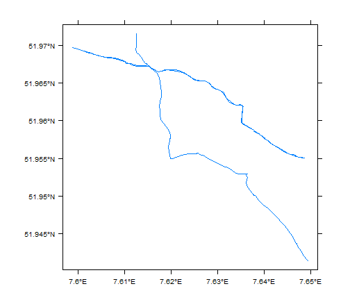
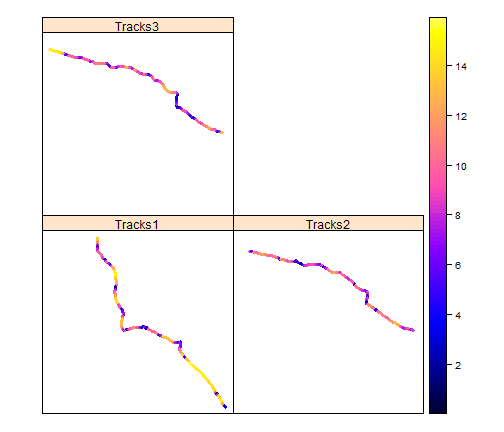
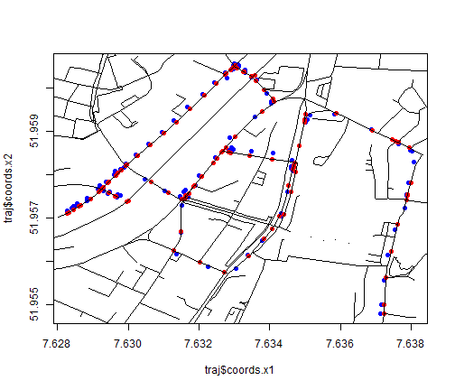
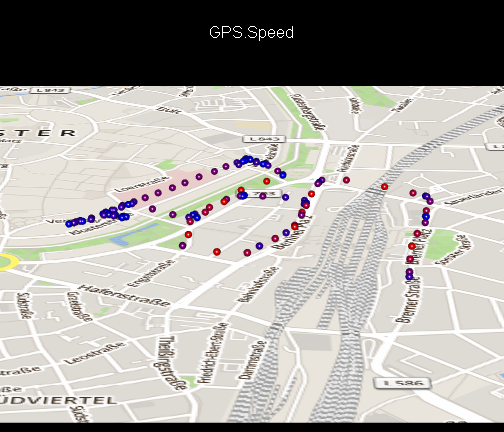

---
title: enviroCaR
author: Nikolai Gorte, Simon Schoemaker
framework: revealjs
revealjs: {theme: default, transition: default, trasition-speed: slow}
mode: selfcontained
highlighter : prettify
hitheme: desert
--- {background: titel.jpg}

## enviroCaR 
<br>
### Analysis of Car Trajectories 
#### provided by the enviroCar Project
Nikolai Gorte & Simon Schoemaker 

--- {background: titel.jpg}

## Agenda

--- {background: titel.jpg}

## EnviroCaR
* R package
* https://github.com/enviroCar/enviroCaR
* Basic functions to load and analyse measurements from the envirocar server
  * importEnviroCar()
  * importSingleTrack()

--- {background: titel.jpg}

## Import Single Track


```r
track <- importSingleTrack("https://envirocar.org/api/stable", "52af4fd3e4b0593cce13bfc7")
```

```
## OGR data source with driver: GeoJSON 
## Source: "{"type":"FeatureCollection","properties":{"id":"52af4fd3e4b0593cce13bfc7","sensor":{"type":"car","properties":{"id":"5268b7a8e4b000fe058134fd","model":"Fabia","fuelType":"gasoline","manufacturer":"Skoda","constructionYear":2008,"engineDisplacement":1200}},"appVersion":"Version 0.8.0 (20), 04.11.13 16:26","touVersion":"2013-10-01"},"features":[{"type":"Feature","geometry":{"type":"Point","coordinates":[7.634311756119132,51.95703847333789]},"properties":{"id":"52af4fd3e4b0593cce13bfc9","time":"2013-11-20T20:08:59Z","phenomenons":{"GPS Speed":{"value":45.9,"unit":"km/h"},"GPS Accuracy":{"value":9.0,"unit":"%"},"Speed":{"value":47.0,"unit":"km/h"},"Rpm":{"value":1856.0,"unit":"u/min"},"Consumption":{"value":1.6357642560566201,"unit":"l/h"},"GPS HDOP":{"value":1.6,"unit":"precision"},"Throttle Position":{"value":6.0,"unit":"%"},"GPS VDOP":{"value":1.6,"unit":"precision"},"Intake Temperature":{"value":14.0,"unit":"c"},"GPS PDOP":{"value":2.3,"unit":"precision"},"Intake Pressure":{"value":26.0,"unit":"kPa"},"GPS Bearing":{"value":21.030000686645508,"unit":"deg"},"Engine Load":{"value":40.7843132019043,"unit":"%"},"CO2":{"value":3.8440460017330573,"unit":"kg/h"},"Calculated MAF":{"value":4.976131180612243,"unit":"g/s"},"GPS Altitude":{"value":115.5,"unit":"m"},"Short-Term Fuel Trim 1":{"value":0.0,"unit":"%"},"Long-Term Fuel Trim 1":{"value":0.78125,"unit":"%"}}}},{"type":"Feature","geometry":{"type":"Point","coordinates":[7.634528428316116,51.95774355903268]},"properties":{"id":"52af4fd3e4b0593cce13bfcb","time":"2013-11-20T20:09:05Z","phenomenons":{"GPS HDOP":{"value":2.2,"unit":"precision"},"CO2":{"value":3.925218972467599,"unit":"kg/h"},"GPS Bearing":{"value":8.59000015258789,"unit":"deg"},"Engine Load":{"value":31.372549057006836,"unit":"%"},"GPS Altitude":{"value":113.70000000000005,"unit":"m"},"GPS Speed":{"value":42.975,"unit":"km/h"},"Speed":{"value":47.0,"unit":"km/h"},"Throttle Position":{"value":6.0,"unit":"%"},"GPS Accuracy":{"value":10.0,"unit":"%"},"Rpm":{"value":1825.0,"unit":"u/min"},"Calculated MAF":{"value":5.08120987907552,"unit":"g/s"},"Intake Pressure":{"value":27.0,"unit":"kPa"},"GPS VDOP":{"value":5.8,"unit":"precision"},"Intake Temperature":{"value":14.0,"unit":"c"},"Consumption":{"value":1.670305945730893,"unit":"l/h"},"GPS PDOP":{"value":6.2,"unit":"precision"},"Short-Term Fuel Trim 1":{"value":0.0,"unit":"%"},"Long-Term Fuel Trim 1":{"value":0.78125,"unit":"%"}}}},{"type":"Feature","geometry":{"type":"Point","coordinates":[7.634602524340153,51.958138179033995]},"properties":{"id":"52af4fd3e4b0593cce13bfcd","time":"2013-11-20T20:09:11Z","phenomenons":{"GPS Altitude":{"value":113.5,"unit":"m"},"GPS HDOP":{"value":2.2,"unit":"precision"},"GPS Accuracy":{"value":9.0,"unit":"%"},"Engine Load":{"value":20.784313201904297,"unit":"%"},"GPS Bearing":{"value":8.890000343322754,"unit":"deg"},"Short-Term Fuel Trim 1":{"value":-7.8125,"unit":"%"},"Consumption":{"value":0.9341849123977203,"unit":"l/h"},"GPS Speed":{"value":12.15,"unit":"km/h"},"CO2":{"value":2.1953345441346426,"unit":"kg/h"},"GPS VDOP":{"value":5.8,"unit":"precision"},"Intake Temperature":{"value":14.0,"unit":"c"},"Intake Pressure":{"value":31.0,"unit":"kPa"},"Calculated MAF":{"value":2.841868352256565,"unit":"g/s"},"Throttle Position":{"value":3.0,"unit":"%"},"GPS PDOP":{"value":6.2,"unit":"precision"},"Rpm":{"value":889.0,"unit":"u/min"},"Long-Term Fuel Trim 1":{"value":0.78125,"unit":"%"},"Speed":{"value":30.0,"unit":"km/h"}}}},{"type":"Feature","geometry":{"type":"Point","coordinates":[7.6346087269485,51.95818080101162]},"properties":{"id":"52af4fd3e4b0593cce13bfcf","time":"2013-11-20T20:09:17Z","phenomenons":{"Consumption":{"value":0.9320832590514937,"unit":"l/h"},"GPS VDOP":{"value":3.3,"unit":"precision"},"GPS Accuracy":{"value":10.0,"unit":"%"},"GPS PDOP":{"value":3.8,"unit":"precision"},"Intake Temperature":{"value":14.0,"unit":"c"},"Rpm":{"value":887.0,"unit":"u/min"},"Calculated MAF":{"value":2.8354749476395646,"unit":"g/s"},"Intake Pressure":{"value":31.0,"unit":"kPa"},"GPS HDOP":{"value":1.8,"unit":"precision"},"Engine Load":{"value":21.568628311157227,"unit":"%"},"Speed":{"value":0.0,"unit":"km/h"},"GPS Altitude":{"value":112.29999999999995,"unit":"m"},"GPS Bearing":{"value":9.770000457763672,"unit":"deg"},"Throttle Position":{"value":3.0,"unit":"%"},"GPS Speed":{"value":0.0,"unit":"km/h"},"Short-Term Fuel Trim 1":{"value":-6.25,"unit":"%"},"CO2":{"value":2.1903956587710103,"unit":"kg/h"},"Long-Term Fuel Trim 1":{"value":0.78125,"unit":"%"}}}},{"type":"Feature","geometry":{"type":"Point","coordinates":[7.6346087269485,51.95818080101162]},"properties":{"id":"52af4fd3e4b0593cce13bfd1","time":"2013-11-20T20:09:23Z","phenomenons":{"GPS HDOP":{"value":1.2,"unit":"precision"},"GPS VDOP":{"value":1.4,"unit":"precision"},"Intake Pressure":{"value":32.0,"unit":"kPa"},"CO2":{"value":2.2432098683853385,"unit":"kg/h"},"GPS Bearing":{"value":9.630000114440918,"unit":"deg"},"GPS Accuracy":{"value":10.0,"unit":"%"},"Calculated MAF":{"value":2.9038431292697444,"unit":"g/s"},"Intake Temperature":{"value":14.0,"unit":"c"},"Engine Load":{"value":20.0,"unit":"%"},"Speed":{"value":0.0,"unit":"km/h"},"GPS Altitude":{"value":112.29999999999995,"unit":"m"},"Throttle Position":{"value":3.0,"unit":"%"},"GPS PDOP":{"value":1.9,"unit":"precision"},"GPS Speed":{"value":0.0,"unit":"km/h"},"Consumption":{"value":0.9545573908022718,"unit":"l/h"},"Short-Term Fuel Trim 1":{"value":-6.25,"unit":"%"},"Long-Term Fuel Trim 1":{"value":0.78125,"unit":"%"},"Rpm":{"value":880.0,"unit":"u/min"}}}},{"type":"Feature","geometry":{"type":"Point","coordinates":[7.6346087269485,51.95818080101162]},"properties":{"id":"52af4fd3e4b0593cce13bfd3","time":"2013-11-20T20:09:29Z","phenomenons":{"GPS Accuracy":{"value":9.0,"unit":"%"},"Intake Pressure":{"value":32.0,"unit":"kPa"},"Short-Term Fuel Trim 1":{"value":-5.46875,"unit":"%"},"Engine Load":{"value":20.784313201904297,"unit":"%"},"Consumption":{"value":0.975167152649139,"unit":"l/h"},"Calculated MAF":{"value":2.966539742288068,"unit":"g/s"},"GPS Bearing":{"value":9.619999885559082,"unit":"deg"},"GPS PDOP":{"value":3.1,"unit":"precision"},"Rpm":{"value":899.0,"unit":"u/min"},"CO2":{"value":2.2916428087254768,"unit":"kg/h"},"Intake Temperature":{"value":14.0,"unit":"c"},"GPS HDOP":{"value":1.8,"unit":"precision"},"GPS VDOP":{"value":2.5,"unit":"precision"},"Speed":{"value":0.0,"unit":"km/h"},"GPS Altitude":{"value":112.29999999999995,"unit":"m"},"Throttle Position":{"value":3.0,"unit":"%"},"GPS Speed":{"value":0.0,"unit":"km/h"},"Long-Term Fuel Trim 1":{"value":0.78125,"unit":"%"}}}},{"type":"Feature","geometry":{"type":"Point","coordinates":[7.6346087269485,51.95818080101162]},"properties":{"id":"52af4fd3e4b0593cce13bfd5","time":"2013-11-20T20:09:35Z","phenomenons":{"Rpm":{"value":898.0,"unit":"u/min"},"GPS VDOP":{"value":2.6,"unit":"precision"},"GPS Accuracy":{"value":9.0,"unit":"%"},"Intake Pressure":{"value":32.0,"unit":"kPa"},"GPS PDOP":{"value":3.3,"unit":"precision"},"Consumption":{"value":0.974082428341409,"unit":"l/h"},"GPS Bearing":{"value":9.619999885559082,"unit":"deg"},"CO2":{"value":2.289093706602311,"unit":"kg/h"},"Intake Temperature":{"value":14.0,"unit":"c"},"Engine Load":{"value":20.0,"unit":"%"},"Short-Term Fuel Trim 1":{"value":0.78125,"unit":"%"},"Speed":{"value":0.0,"unit":"km/h"},"Calculated MAF":{"value":2.963239920550261,"unit":"g/s"},"GPS Altitude":{"value":112.29999999999995,"unit":"m"},"GPS HDOP":{"value":2.0,"unit":"precision"},"Throttle Position":{"value":3.0,"unit":"%"},"GPS Speed":{"value":0.0,"unit":"km/h"},"Long-Term Fuel Trim 1":{"value":0.78125,"unit":"%"}}}},{"type":"Feature","geometry":{"type":"Point","coordinates":[7.6346087269485,51.95818080101162]},"properties":{"id":"52af4fd3e4b0593cce13bfd7","time":"2013-11-20T20:09:41Z","phenomenons":{"GPS HDOP":{"value":1.2,"unit":"precision"},"CO2":{"value":2.3094865235876325,"unit":"kg/h"},"Engine Load":{"value":20.39215660095215,"unit":"%"},"GPS PDOP":{"value":2.0,"unit":"precision"},"GPS Accuracy":{"value":9.0,"unit":"%"},"Intake Pressure":{"value":32.0,"unit":"kPa"},"Consumption":{"value":0.9827602228032478,"unit":"l/h"},"GPS Bearing":{"value":9.619999885559082,"unit":"deg"},"Intake Temperature":{"value":14.0,"unit":"c"},"Short-Term Fuel Trim 1":{"value":-2.34375,"unit":"%"},"Rpm":{"value":906.0,"unit":"u/min"},"Speed":{"value":0.0,"unit":"km/h"},"GPS Altitude":{"value":112.29999999999995,"unit":"m"},"GPS VDOP":{"value":1.5,"unit":"precision"},"Throttle Position":{"value":3.0,"unit":"%"},"GPS Speed":{"value":0.0,"unit":"km/h"},"Long-Term Fuel Trim 1":{"value":0.78125,"unit":"%"},"Calculated MAF":{"value":2.9896384944527137,"unit":"g/s"}}}},{"type":"Feature","geometry":{"type":"Point","coordinates":[7.6346635445952415,51.95820259395987]},"properties":{"id":"52af4fd3e4b0593cce13bfd9","time":"2013-11-20T20:09:47Z","phenomenons":{"GPS HDOP":{"value":1.2,"unit":"precision"},"GPS VDOP":{"value":1.4,"unit":"precision"},"GPS Altitude":{"value":112.10000000000002,"unit":"m"},"GPS Accuracy":{"value":9.0,"unit":"%"},"Intake Temperature":{"value":15.0,"unit":"c"},"Intake Pressure":{"value":32.0,"unit":"kPa"},"Calculated MAF":{"value":2.975974839042463,"unit":"g/s"},"Engine Load":{"value":19.60784339904785,"unit":"%"},"Short-Term Fuel Trim 1":{"value":-2.34375,"unit":"%"},"CO2":{"value":2.2989313918914522,"unit":"kg/h"},"GPS Bearing":{"value":45.02000045776367,"unit":"deg"},"Rpm":{"value":905.0,"unit":"u/min"},"Speed":{"value":0.0,"unit":"km/h"},"GPS PDOP":{"value":1.9,"unit":"precision"},"Throttle Position":{"value":3.0,"unit":"%"},"GPS Speed":{"value":0.0,"unit":"km/h"},"Long-Term Fuel Trim 1":{"value":0.78125,"unit":"%"},"Consumption":{"value":0.9782686774006178,"unit":"l/h"}}}},{"type":"Feature","geometry":{"type":"Point","coordinates":[7.6346635445952415,51.95820259395987]},"properties":{"id":"52af4fd3e4b0593cce13bfdb","time":"2013-11-20T20:09:53Z","phenomenons":{"GPS Accuracy":{"value":8.0,"unit":"%"},"GPS HDOP":{"value":1.2,"unit":"precision"},"GPS VDOP":{"value":1.4,"unit":"precision"},"GPS Altitude":{"value":112.10000000000002,"unit":"m"},"Intake Temperature":{"value":15.0,"unit":"c"},"Intake Pressure":{"value":32.0,"unit":"kPa"},"CO2":{"value":2.304011903254748,"unit":"kg/h"},"Short-Term Fuel Trim 1":{"value":-3.125,"unit":"%"},"Calculated MAF":{"value":2.9825515790182466,"unit":"g/s"},"Engine Load":{"value":19.60784339904785,"unit":"%"},"Consumption":{"value":0.9804305971296798,"unit":"l/h"},"Rpm":{"value":907.0,"unit":"u/min"},"GPS Bearing":{"value":41.09000015258789,"unit":"deg"},"Speed":{"value":0.0,"unit":"km/h"},"GPS PDOP":{"value":1.9,"unit":"precision"},"Throttle Position":{"value":3.0,"unit":"%"},"GPS Speed":{"value":0.0,"unit":"km/h"},"Long-Term Fuel Trim 1":{"value":0.78125,"unit":"%"}}}},{"type":"Feature","geometry":{"type":"Point","coordinates":[7.634616522118449,51.958329202607274]},"properties":{"id":"52af4fd3e4b0593cce13bfdd","time":"2013-11-20T20:09:59Z","phenomenons":{"GPS HDOP":{"value":1.2,"unit":"precision"},"GPS VDOP":{"value":1.4,"unit":"precision"},"CO2":{"value":6.91394090152548,"unit":"kg/h"},"Intake Temperature":{"value":15.0,"unit":"c"},"Consumption":{"value":2.9421025112874384,"unit":"l/h"},"GPS Altitude":{"value":112.0,"unit":"m"},"Intake Pressure":{"value":57.0,"unit":"kPa"},"Calculated MAF":{"value":8.95012101454566,"unit":"g/s"},"Rpm":{"value":1528.0,"unit":"u/min"},"Speed":{"value":16.0,"unit":"km/h"},"GPS Speed":{"value":17.775000000000002,"unit":"km/h"},"Engine Load":{"value":27.058822631835938,"unit":"%"},"Short-Term Fuel Trim 1":{"value":5.46875,"unit":"%"},"GPS Accuracy":{"value":7.0,"unit":"%"},"GPS Bearing":{"value":339.6499938964844,"unit":"deg"},"Throttle Position":{"value":10.0,"unit":"%"},"GPS PDOP":{"value":1.9,"unit":"precision"},"Long-Term Fuel Trim 1":{"value":0.78125,"unit":"%"}}}},{"type":"Feature","geometry":{"type":"Point","coordinates":[7.634098855778575,51.95848799776286]},"properties":{"id":"52af4fd3e4b0593cce13bfdf","time":"2013-11-20T20:10:05Z","phenomenons":{"GPS HDOP":{"value":1.2,"unit":"precision"},"GPS PDOP":{"value":2.0,"unit":"precision"},"Short-Term Fuel Trim 1":{"value":-4.6875,"unit":"%"},"GPS Accuracy":{"value":9.0,"unit":"%"},"Intake Temperature":{"value":15.0,"unit":"c"},"Rpm":{"value":1270.0,"unit":"u/min"},"GPS Speed":{"value":18.0,"unit":"km/h"},"Speed":{"value":25.0,"unit":"km/h"},"Throttle Position":{"value":5.0,"unit":"%"},"GPS Bearing":{"value":277.7799987792969,"unit":"deg"},"Intake Pressure":{"value":31.0,"unit":"kPa"},"GPS Altitude":{"value":111.5,"unit":"m"},"Engine Load":{"value":9.019607543945312,"unit":"%"},"CO2":{"value":3.125308318327571,"unit":"kg/h"},"GPS VDOP":{"value":1.5,"unit":"precision"},"Calculated MAF":{"value":4.045722700728652,"unit":"g/s"},"Long-Term Fuel Trim 1":{"value":0.78125,"unit":"%"},"Consumption":{"value":1.3299184333308811,"unit":"l/h"}}}},{"type":"Feature","geometry":{"type":"Point","coordinates":[7.633468201383948,51.958547215908766]},"properties":{"id":"52af4fd3e4b0593cce13bfe1","time":"2013-11-20T20:10:11Z","phenomenons":{"GPS Accuracy":{"value":8.0,"unit":"%"},"Engine Load":{"value":30.58823585510254,"unit":"%"},"Intake Temperature":{"value":15.0,"unit":"c"},"Throttle Position":{"value":8.0,"unit":"%"},"GPS Speed":{"value":28.125,"unit":"km/h"},"Intake Pressure":{"value":60.0,"unit":"kPa"},"Calculated MAF":{"value":9.075901166582538,"unit":"g/s"},"Consumption":{"value":2.9834492261057513,"unit":"l/h"},"Speed":{"value":25.0,"unit":"km/h"},"GPS PDOP":{"value":3.1,"unit":"precision"},"GPS Altitude":{"value":111.39999999999998,"unit":"m"},"Rpm":{"value":1472.0,"unit":"u/min"},"Short-Term Fuel Trim 1":{"value":5.46875,"unit":"%"},"GPS HDOP":{"value":1.8,"unit":"precision"},"GPS Bearing":{"value":280.1000061035156,"unit":"deg"},"GPS VDOP":{"value":2.5,"unit":"precision"},"CO2":{"value":7.011105681348516,"unit":"kg/h"},"Long-Term Fuel Trim 1":{"value":0.78125,"unit":"%"}}}},{"type":"Feature","geometry":{"type":"Point","coordinates":[7.632845090702176,51.95855710655451]},"properties":{"id":"52af4fd3e4b0593cce13bfe3","time":"2013-11-20T20:10:17Z","phenomenons":{"GPS HDOP":{"value":1.2,"unit":"precision"},"GPS PDOP":{"value":2.0,"unit":"precision"},"Short-Term Fuel Trim 1":{"value":-4.6875,"unit":"%"},"Intake Temperature":{"value":15.0,"unit":"c"},"Engine Load":{"value":19.215686798095703,"unit":"%"},"GPS Accuracy":{"value":10.0,"unit":"%"},"CO2":{"value":2.2270897858948446,"unit":"kg/h"},"Intake Pressure":{"value":31.0,"unit":"kPa"},"GPS Bearing":{"value":265.55999755859375,"unit":"deg"},"Rpm":{"value":905.0,"unit":"u/min"},"Calculated MAF":{"value":2.882975625322386,"unit":"g/s"},"GPS VDOP":{"value":1.5,"unit":"precision"},"GPS Speed":{"value":20.475,"unit":"km/h"},"Consumption":{"value":0.9476977812318487,"unit":"l/h"},"GPS Altitude":{"value":110.60000000000002,"unit":"m"},"Throttle Position":{"value":3.0,"unit":"%"},"Speed":{"value":20.0,"unit":"km/h"},"Long-Term Fuel Trim 1":{"value":0.78125,"unit":"%"}}}},{"type":"Feature","geometry":{"type":"Point","coordinates":[7.632910888642073,51.95854092948139]},"properties":{"id":"52af4fd3e4b0593cce13bfe5","time":"2013-11-20T20:10:23Z","phenomenons":{"CO2":{"value":2.2938508805281557,"unit":"kg/h"},"GPS Altitude":{"value":111.10000000000002,"unit":"m"},"Intake Temperature":{"value":15.0,"unit":"c"},"Intake Pressure":{"value":32.0,"unit":"kPa"},"Rpm":{"value":903.0,"unit":"u/min"},"Calculated MAF":{"value":2.969398099066678,"unit":"g/s"},"GPS HDOP":{"value":1.6,"unit":"precision"},"GPS Accuracy":{"value":10.0,"unit":"%"},"GPS PDOP":{"value":2.3,"unit":"precision"},"Short-Term Fuel Trim 1":{"value":-2.34375,"unit":"%"},"Engine Load":{"value":20.0,"unit":"%"},"Speed":{"value":1.0,"unit":"km/h"},"GPS VDOP":{"value":1.5,"unit":"precision"},"Throttle Position":{"value":3.0,"unit":"%"},"GPS Speed":{"value":0.0,"unit":"km/h"},"Long-Term Fuel Trim 1":{"value":0.78125,"unit":"%"},"Consumption":{"value":0.9761067576715556,"unit":"l/h"},"GPS Bearing":{"value":219.8800048828125,"unit":"deg"}}}},{"type":"Feature","geometry":{"type":"Point","coordinates":[7.632910888642073,51.95854092948139]},"properties":{"id":"52af4fd3e4b0593cce13bfe7","time":"2013-11-20T20:10:29Z","phenomenons":{"GPS Bearing":{"value":224.9600067138672,"unit":"deg"},"GPS Altitude":{"value":111.10000000000002,"unit":"m"},"Intake Temperature":{"value":15.0,"unit":"c"},"Intake Pressure":{"value":32.0,"unit":"kPa"},"GPS PDOP":{"value":3.3,"unit":"precision"},"Engine Load":{"value":19.215686798095703,"unit":"%"},"GPS Accuracy":{"value":10.0,"unit":"%"},"Rpm":{"value":901.0,"unit":"u/min"},"CO2":{"value":2.2887703691648595,"unit":"kg/h"},"Calculated MAF":{"value":2.962821359090893,"unit":"g/s"},"GPS VDOP":{"value":2.5,"unit":"precision"},"Speed":{"value":0.0,"unit":"km/h"},"GPS HDOP":{"value":2.0,"unit":"precision"},"Throttle Position":{"value":3.0,"unit":"%"},"GPS Speed":{"value":0.0,"unit":"km/h"},"Short-Term Fuel Trim 1":{"value":0.0,"unit":"%"},"Long-Term Fuel Trim 1":{"value":0.78125,"unit":"%"},"Consumption":{"value":0.9739448379424933,"unit":"l/h"}}}},{"type":"Feature","geometry":{"type":"Point","coordinates":[7.632910888642073,51.95854092948139]},"properties":{"id":"52af4fd3e4b0593cce13bfe9","time":"2013-11-20T20:10:34Z","phenomenons":{"GPS Altitude":{"value":111.10000000000002,"unit":"m"},"Intake Temperature":{"value":15.0,"unit":"c"},"Intake Pressure":{"value":32.0,"unit":"kPa"},"GPS Bearing":{"value":225.07000732421875,"unit":"deg"},"GPS HDOP":{"value":1.6,"unit":"precision"},"Engine Load":{"value":19.215686798095703,"unit":"%"},"GPS Accuracy":{"value":10.0,"unit":"%"},"Rpm":{"value":901.0,"unit":"u/min"},"CO2":{"value":2.2887703691648595,"unit":"kg/h"},"Calculated MAF":{"value":2.962821359090893,"unit":"g/s"},"GPS PDOP":{"value":2.3,"unit":"precision"},"Short-Term Fuel Trim 1":{"value":-2.34375,"unit":"%"},"Speed":{"value":0.0,"unit":"km/h"},"GPS VDOP":{"value":1.5,"unit":"precision"},"Throttle Position":{"value":3.0,"unit":"%"},"GPS Speed":{"value":0.0,"unit":"km/h"},"Long-Term Fuel Trim 1":{"value":0.78125,"unit":"%"},"Consumption":{"value":0.9739448379424933,"unit":"l/h"}}}},{"type":"Feature","geometry":{"type":"Point","coordinates":[7.632910888642073,51.95854092948139]},"properties":{"id":"52af4fd3e4b0593cce13bfeb","time":"2013-11-20T20:10:40Z","phenomenons":{"Rpm":{"value":897.0,"unit":"u/min"},"GPS Accuracy":{"value":9.0,"unit":"%"},"GPS Altitude":{"value":111.10000000000002,"unit":"m"},"Intake Temperature":{"value":15.0,"unit":"c"},"Intake Pressure":{"value":32.0,"unit":"kPa"},"Consumption":{"value":0.9696209984843693,"unit":"l/h"},"GPS Bearing":{"value":225.07000732421875,"unit":"deg"},"GPS HDOP":{"value":1.6,"unit":"precision"},"Engine Load":{"value":19.215686798095703,"unit":"%"},"Short-Term Fuel Trim 1":{"value":-3.125,"unit":"%"},"Calculated MAF":{"value":2.9496678791393247,"unit":"g/s"},"CO2":{"value":2.278609346438268,"unit":"kg/h"},"GPS PDOP":{"value":2.3,"unit":"precision"},"Speed":{"value":0.0,"unit":"km/h"},"GPS VDOP":{"value":1.5,"unit":"precision"},"Throttle Position":{"value":3.0,"unit":"%"},"GPS Speed":{"value":0.0,"unit":"km/h"},"Long-Term Fuel Trim 1":{"value":0.78125,"unit":"%"}}}},{"type":"Feature","geometry":{"type":"Point","coordinates":[7.632918180897832,51.95861376821995]},"properties":{"id":"52af4fd3e4b0593cce13bfed","time":"2013-11-20T20:10:46Z","phenomenons":{"GPS Accuracy":{"value":9.0,"unit":"%"},"Intake Temperature":{"value":15.0,"unit":"c"},"Intake Pressure":{"value":32.0,"unit":"kPa"},"CO2":{"value":2.304011903254748,"unit":"kg/h"},"Short-Term Fuel Trim 1":{"value":-0.78125,"unit":"%"},"GPS HDOP":{"value":1.6,"unit":"precision"},"Engine Load":{"value":19.215686798095703,"unit":"%"},"GPS Altitude":{"value":116.5,"unit":"m"},"Calculated MAF":{"value":2.9825515790182466,"unit":"g/s"},"GPS PDOP":{"value":2.3,"unit":"precision"},"Consumption":{"value":0.9804305971296798,"unit":"l/h"},"Rpm":{"value":907.0,"unit":"u/min"},"GPS Bearing":{"value":213.7899932861328,"unit":"deg"},"GPS Speed":{"value":5.4,"unit":"km/h"},"Speed":{"value":0.0,"unit":"km/h"},"GPS VDOP":{"value":1.5,"unit":"precision"},"Throttle Position":{"value":3.0,"unit":"%"},"Long-Term Fuel Trim 1":{"value":0.78125,"unit":"%"}}}},{"type":"Feature","geometry":{"type":"Point","coordinates":[7.632933100685477,51.95861079264432]},"properties":{"id":"52af4fd3e4b0593cce13bfef","time":"2013-11-20T20:10:52Z","phenomenons":{"GPS Accuracy":{"value":8.0,"unit":"%"},"GPS HDOP":{"value":1.2,"unit":"precision"},"GPS VDOP":{"value":1.4,"unit":"precision"},"GPS PDOP":{"value":2.0,"unit":"precision"},"GPS Altitude":{"value":115.39999999999998,"unit":"m"},"Intake Temperature":{"value":15.0,"unit":"c"},"Rpm":{"value":895.0,"unit":"u/min"},"GPS Bearing":{"value":206.27000427246094,"unit":"deg"},"GPS Speed":{"value":5.8500000000000005,"unit":"km/h"},"Calculated MAF":{"value":2.8511195410646795,"unit":"g/s"},"Engine Load":{"value":18.823530197143555,"unit":"%"},"Intake Pressure":{"value":31.0,"unit":"kPa"},"Speed":{"value":0.0,"unit":"km/h"},"CO2":{"value":2.202481058978879,"unit":"kg/h"},"Consumption":{"value":0.9372259825442036,"unit":"l/h"},"Throttle Position":{"value":3.0,"unit":"%"},"Short-Term Fuel Trim 1":{"value":-3.90625,"unit":"%"},"Long-Term Fuel Trim 1":{"value":0.78125,"unit":"%"}}}},{"type":"Feature","geometry":{"type":"Point","coordinates":[7.6329604256898165,51.9585832580924]},"properties":{"id":"52af4fd3e4b0593cce13bff1","time":"2013-11-20T20:10:58Z","phenomenons":{"GPS HDOP":{"value":1.2,"unit":"precision"},"GPS VDOP":{"value":1.4,"unit":"precision"},"GPS PDOP":{"value":2.0,"unit":"precision"},"CO2":{"value":2.3116326702996917,"unit":"kg/h"},"Intake Temperature":{"value":15.0,"unit":"c"},"Intake Pressure":{"value":32.0,"unit":"kPa"},"Short-Term Fuel Trim 1":{"value":-0.78125,"unit":"%"},"Rpm":{"value":910.0,"unit":"u/min"},"Calculated MAF":{"value":2.9924166889819235,"unit":"g/s"},"GPS Bearing":{"value":168.3000030517578,"unit":"deg"},"Engine Load":{"value":19.60784339904785,"unit":"%"},"GPS Speed":{"value":1.575,"unit":"km/h"},"GPS Altitude":{"value":113.89999999999998,"unit":"m"},"Consumption":{"value":0.9836734767232731,"unit":"l/h"},"GPS Accuracy":{"value":11.0,"unit":"%"},"Speed":{"value":0.0,"unit":"km/h"},"Throttle Position":{"value":3.0,"unit":"%"},"Long-Term Fuel Trim 1":{"value":0.78125,"unit":"%"}}}},{"type":"Feature","geometry":{"type":"Point","coordinates":[7.632917677983642,51.95857152342796]},"properties":{"id":"52af4fd3e4b0593cce13bff3","time":"2013-11-20T20:11:04Z","phenomenons":{"GPS HDOP":{"value":1.2,"unit":"precision"},"GPS VDOP":{"value":1.4,"unit":"precision"},"GPS PDOP":{"value":2.0,"unit":"precision"},"GPS Accuracy":{"value":9.0,"unit":"%"},"Intake Temperature":{"value":15.0,"unit":"c"},"Intake Pressure":{"value":32.0,"unit":"kPa"},"Calculated MAF":{"value":2.975974839042463,"unit":"g/s"},"Engine Load":{"value":19.215686798095703,"unit":"%"},"GPS Altitude":{"value":113.10000000000002,"unit":"m"},"GPS Bearing":{"value":237.17999267578125,"unit":"deg"},"CO2":{"value":2.2989313918914522,"unit":"kg/h"},"Rpm":{"value":905.0,"unit":"u/min"},"GPS Speed":{"value":8.775,"unit":"km/h"},"Speed":{"value":0.0,"unit":"km/h"},"Throttle Position":{"value":3.0,"unit":"%"},"Short-Term Fuel Trim 1":{"value":0.0,"unit":"%"},"Long-Term Fuel Trim 1":{"value":0.78125,"unit":"%"},"Consumption":{"value":0.9782686774006178,"unit":"l/h"}}}},{"type":"Feature","geometry":{"type":"Point","coordinates":[7.6324662286788225,51.958385654725134]},"properties":{"id":"52af4fd3e4b0593cce13bff5","time":"2013-11-20T20:11:10Z","phenomenons":{"GPS Accuracy":{"value":8.0,"unit":"%"},"GPS HDOP":{"value":1.2,"unit":"precision"},"GPS VDOP":{"value":1.4,"unit":"precision"},"GPS PDOP":{"value":2.0,"unit":"precision"},"Intake Temperature":{"value":15.0,"unit":"c"},"Rpm":{"value":1911.0,"unit":"u/min"},"GPS Bearing":{"value":211.83999633789062,"unit":"deg"},"Speed":{"value":25.0,"unit":"km/h"},"CO2":{"value":10.467361685200792,"unit":"kg/h"},"Consumption":{"value":4.454196461787571,"unit":"l/h"},"GPS Speed":{"value":28.35,"unit":"km/h"},"Calculated MAF":{"value":13.550036819796272,"unit":"g/s"},"Engine Load":{"value":0.0,"unit":"%"},"Throttle Position":{"value":18.0,"unit":"%"},"Intake Pressure":{"value":69.0,"unit":"kPa"},"Short-Term Fuel Trim 1":{"value":0.0,"unit":"%"},"Long-Term Fuel Trim 1":{"value":0.78125,"unit":"%"},"GPS Altitude":{"value":112.79999999999995,"unit":"m"}}}},{"type":"Feature","geometry":{"type":"Point","coordinates":[7.632007570937276,51.95798416156322]},"properties":{"id":"52af4fd3e4b0593cce13bff7","time":"2013-11-20T20:11:16Z","phenomenons":{"GPS Speed":{"value":36.9,"unit":"km/h"},"Intake Temperature":{"value":15.0,"unit":"c"},"GPS PDOP":{"value":3.3,"unit":"precision"},"Short-Term Fuel Trim 1":{"value":-10.15625,"unit":"%"},"CO2":{"value":5.163228438929689,"unit":"kg/h"},"Speed":{"value":36.0,"unit":"km/h"},"Throttle Position":{"value":6.0,"unit":"%"},"Rpm":{"value":1913.0,"unit":"u/min"},"Calculated MAF":{"value":6.683817523515187,"unit":"g/s"},"Engine Load":{"value":15.686274528503418,"unit":"%"},"GPS Accuracy":{"value":7.0,"unit":"%"},"GPS VDOP":{"value":2.5,"unit":"precision"},"GPS HDOP":{"value":2.0,"unit":"precision"},"GPS Altitude":{"value":112.70000000000005,"unit":"m"},"Intake Pressure":{"value":34.0,"unit":"kPa"},"Long-Term Fuel Trim 1":{"value":0.78125,"unit":"%"},"GPS Bearing":{"value":214.6300048828125,"unit":"deg"},"Consumption":{"value":2.1971184846509315,"unit":"l/h"}}}},{"type":"Feature","geometry":{"type":"Point","coordinates":[7.631624098867178,51.95764917880297]},"properties":{"id":"52af4fd3e4b0593cce13bff9","time":"2013-11-20T20:11:22Z","phenomenons":{"GPS Accuracy":{"value":9.0,"unit":"%"},"Intake Temperature":{"value":15.0,"unit":"c"},"Intake Pressure":{"value":32.0,"unit":"kPa"},"Speed":{"value":31.0,"unit":"km/h"},"Calculated MAF":{"value":2.9200725492482946,"unit":"g/s"},"GPS Altitude":{"value":112.5,"unit":"m"},"GPS PDOP":{"value":3.1,"unit":"precision"},"Consumption":{"value":0.9598923597035894,"unit":"l/h"},"Rpm":{"value":888.0,"unit":"u/min"},"Engine Load":{"value":19.60784339904785,"unit":"%"},"Short-Term Fuel Trim 1":{"value":-2.34375,"unit":"%"},"GPS Bearing":{"value":213.83999633789062,"unit":"deg"},"GPS HDOP":{"value":1.8,"unit":"precision"},"GPS VDOP":{"value":2.5,"unit":"precision"},"Throttle Position":{"value":3.0,"unit":"%"},"GPS Speed":{"value":13.05,"unit":"km/h"},"CO2":{"value":2.255747045303435,"unit":"kg/h"},"Long-Term Fuel Trim 1":{"value":0.78125,"unit":"%"}}}},{"type":"Feature","geometry":{"type":"Point","coordinates":[7.631571963429451,51.957607604563236]},"properties":{"id":"52af4fd3e4b0593cce13bffb","time":"2013-11-20T20:11:28Z","phenomenons":{"GPS Altitude":{"value":111.60000000000002,"unit":"m"},"Intake Temperature":{"value":15.0,"unit":"c"},"Intake Pressure":{"value":32.0,"unit":"kPa"},"CO2":{"value":2.304011903254748,"unit":"kg/h"},"GPS Bearing":{"value":201.47000122070312,"unit":"deg"},"Calculated MAF":{"value":2.9825515790182466,"unit":"g/s"},"Short-Term Fuel Trim 1":{"value":-2.34375,"unit":"%"},"Engine Load":{"value":20.0,"unit":"%"},"Consumption":{"value":0.9804305971296798,"unit":"l/h"},"GPS Accuracy":{"value":7.0,"unit":"%"},"Rpm":{"value":907.0,"unit":"u/min"},"GPS PDOP":{"value":2.1,"unit":"precision"},"Speed":{"value":0.0,"unit":"km/h"},"GPS VDOP":{"value":1.5,"unit":"precision"},"Throttle Position":{"value":3.0,"unit":"%"},"GPS Speed":{"value":0.0,"unit":"km/h"},"GPS HDOP":{"value":1.4,"unit":"precision"},"Long-Term Fuel Trim 1":{"value":0.78125,"unit":"%"}}}},{"type":"Feature","geometry":{"type":"Point","coordinates":[7.631571963429451,51.957607604563236]},"properties":{"id":"52af4fd3e4b0593cce13bffd","time":"2013-11-20T20:11:34Z","phenomenons":{"GPS Altitude":{"value":111.60000000000002,"unit":"m"},"Consumption":{"value":0.9869163563168663,"unit":"l/h"},"Intake Temperature":{"value":15.0,"unit":"c"},"Intake Pressure":{"value":32.0,"unit":"kPa"},"Calculated MAF":{"value":3.0022817989456003,"unit":"g/s"},"Short-Term Fuel Trim 1":{"value":-1.5625,"unit":"%"},"Rpm":{"value":913.0,"unit":"u/min"},"CO2":{"value":2.319253437344636,"unit":"kg/h"},"Engine Load":{"value":19.60784339904785,"unit":"%"},"GPS Bearing":{"value":201.83999633789062,"unit":"deg"},"GPS Accuracy":{"value":7.0,"unit":"%"},"GPS PDOP":{"value":2.1,"unit":"precision"},"Speed":{"value":0.0,"unit":"km/h"},"GPS VDOP":{"value":1.5,"unit":"precision"},"Throttle Position":{"value":3.0,"unit":"%"},"GPS Speed":{"value":0.0,"unit":"km/h"},"GPS HDOP":{"value":1.4,"unit":"precision"},"Long-Term Fuel Trim 1":{"value":0.78125,"unit":"%"}}}},{"type":"Feature","geometry":{"type":"Point","coordinates":[7.631571963429451,51.957607604563236]},"properties":{"id":"52af4fd3e4b0593cce13bfff","time":"2013-11-20T20:11:40Z","phenomenons":{"GPS HDOP":{"value":1.2,"unit":"precision"},"GPS VDOP":{"value":1.4,"unit":"precision"},"GPS Altitude":{"value":111.60000000000002,"unit":"m"},"Engine Load":{"value":18.431371688842773,"unit":"%"},"Consumption":{"value":0.981511556994211,"unit":"l/h"},"Intake Temperature":{"value":15.0,"unit":"c"},"Intake Pressure":{"value":32.0,"unit":"kPa"},"CO2":{"value":2.306552158936396,"unit":"kg/h"},"Rpm":{"value":908.0,"unit":"u/min"},"Short-Term Fuel Trim 1":{"value":-2.34375,"unit":"%"},"GPS Accuracy":{"value":7.0,"unit":"%"},"Speed":{"value":0.0,"unit":"km/h"},"Calculated MAF":{"value":2.9858399490061394,"unit":"g/s"},"GPS Bearing":{"value":201.85000610351562,"unit":"deg"},"GPS PDOP":{"value":1.9,"unit":"precision"},"Throttle Position":{"value":3.0,"unit":"%"},"GPS Speed":{"value":0.0,"unit":"km/h"},"Long-Term Fuel Trim 1":{"value":0.78125,"unit":"%"}}}},{"type":"Feature","geometry":{"type":"Point","coordinates":[7.631571963429451,51.957607604563236]},"properties":{"id":"52af4fd3e4b0593cce13c001","time":"2013-11-20T20:11:46Z","phenomenons":{"GPS Accuracy":{"value":8.0,"unit":"%"},"GPS HDOP":{"value":1.2,"unit":"precision"},"GPS VDOP":{"value":1.4,"unit":"precision"},"GPS Altitude":{"value":111.60000000000002,"unit":"m"},"Intake Temperature":{"value":15.0,"unit":"c"},"Consumption":{"value":0.9246598241190301,"unit":"l/h"},"Calculated MAF":{"value":2.8128922399554326,"unit":"g/s"},"Engine Load":{"value":19.60784339904785,"unit":"%"},"Intake Pressure":{"value":31.0,"unit":"kPa"},"Rpm":{"value":883.0,"unit":"u/min"},"Short-Term Fuel Trim 1":{"value":-7.03125,"unit":"%"},"Speed":{"value":0.0,"unit":"km/h"},"GPS Bearing":{"value":201.85000610351562,"unit":"deg"},"GPS PDOP":{"value":1.9,"unit":"precision"},"Throttle Position":{"value":3.0,"unit":"%"},"GPS Speed":{"value":0.0,"unit":"km/h"},"Long-Term Fuel Trim 1":{"value":0.78125,"unit":"%"},"CO2":{"value":2.172950586679721,"unit":"kg/h"}}}},{"type":"Feature","geometry":{"type":"Point","coordinates":[7.631571963429451,51.957607604563236]},"properties":{"id":"52af4fd3e4b0593cce13c003","time":"2013-11-20T20:11:52Z","phenomenons":{"GPS HDOP":{"value":1.2,"unit":"precision"},"Engine Load":{"value":20.39215660095215,"unit":"%"},"GPS VDOP":{"value":1.4,"unit":"precision"},"Consumption":{"value":0.9847544365878041,"unit":"l/h"},"GPS Altitude":{"value":111.60000000000002,"unit":"m"},"CO2":{"value":2.3141729259813397,"unit":"kg/h"},"Calculated MAF":{"value":2.9957050589698158,"unit":"g/s"},"Intake Temperature":{"value":15.0,"unit":"c"},"Intake Pressure":{"value":32.0,"unit":"kPa"},"Short-Term Fuel Trim 1":{"value":-0.78125,"unit":"%"},"Rpm":{"value":911.0,"unit":"u/min"},"GPS Accuracy":{"value":7.0,"unit":"%"},"Speed":{"value":0.0,"unit":"km/h"},"GPS Bearing":{"value":201.85000610351562,"unit":"deg"},"GPS PDOP":{"value":1.9,"unit":"precision"},"Throttle Position":{"value":3.0,"unit":"%"},"GPS Speed":{"value":0.0,"unit":"km/h"},"Long-Term Fuel Trim 1":{"value":0.78125,"unit":"%"}}}},{"type":"Feature","geometry":{"type":"Point","coordinates":[7.631465764716268,51.95749532897025]},"properties":{"id":"52af4fd3e4b0593cce13c005","time":"2013-11-20T20:11:58Z","phenomenons":{"GPS HDOP":{"value":1.2,"unit":"precision"},"GPS VDOP":{"value":1.4,"unit":"precision"},"GPS PDOP":{"value":2.0,"unit":"precision"},"Calculated MAF":{"value":15.841722416670788,"unit":"g/s"},"CO2":{"value":12.237681746339304,"unit":"kg/h"},"Intake Temperature":{"value":15.0,"unit":"c"},"Engine Load":{"value":49.80392074584961,"unit":"%"},"Rpm":{"value":1640.0,"unit":"u/min"},"GPS Bearing":{"value":216.50999450683594,"unit":"deg"},"GPS Accuracy":{"value":7.0,"unit":"%"},"Speed":{"value":0.0,"unit":"km/h"},"Short-Term Fuel Trim 1":{"value":8.59375,"unit":"%"},"GPS Speed":{"value":11.700000000000001,"unit":"km/h"},"Throttle Position":{"value":20.0,"unit":"%"},"GPS Altitude":{"value":107.89999999999998,"unit":"m"},"Long-Term Fuel Trim 1":{"value":0.78125,"unit":"%"},"Intake Pressure":{"value":94.0,"unit":"kPa"},"Consumption":{"value":5.207524147378427,"unit":"l/h"}}}},{"type":"Feature","geometry":{"type":"Point","coordinates":[7.631024122238159,51.95762407500297]},"properties":{"id":"52af4fd3e4b0593cce13c007","time":"2013-11-20T20:12:04Z","phenomenons":{"GPS Altitude":{"value":107.5,"unit":"m"},"Intake Pressure":{"value":75.0,"unit":"kPa"},"Intake Temperature":{"value":15.0,"unit":"c"},"CO2":{"value":9.38306942408735,"unit":"kg/h"},"Rpm":{"value":1576.0,"unit":"u/min"},"GPS Bearing":{"value":306.0400085449219,"unit":"deg"},"Engine Load":{"value":49.80392074584961,"unit":"%"},"GPS PDOP":{"value":3.0,"unit":"precision"},"GPS HDOP":{"value":1.6,"unit":"precision"},"GPS Accuracy":{"value":10.0,"unit":"%"},"GPS Speed":{"value":26.1,"unit":"km/h"},"Speed":{"value":26.0,"unit":"km/h"},"GPS VDOP":{"value":2.4,"unit":"precision"},"Calculated MAF":{"value":12.146416642776902,"unit":"g/s"},"Throttle Position":{"value":16.0,"unit":"%"},"Consumption":{"value":3.992795499611638,"unit":"l/h"},"Short-Term Fuel Trim 1":{"value":0.0,"unit":"%"},"Long-Term Fuel Trim 1":{"value":0.78125,"unit":"%"}}}},{"type":"Feature","geometry":{"type":"Point","coordinates":[7.630454236641526,51.95790398865938]},"properties":{"id":"52af4fd3e4b0593cce13c009","time":"2013-11-20T20:12:10Z","phenomenons":{"GPS HDOP":{"value":1.2,"unit":"precision"},"GPS VDOP":{"value":1.4,"unit":"precision"},"GPS PDOP":{"value":2.0,"unit":"precision"},"GPS Accuracy":{"value":9.0,"unit":"%"},"GPS Speed":{"value":27.225,"unit":"km/h"},"Intake Temperature":{"value":15.0,"unit":"c"},"GPS Bearing":{"value":303.4800109863281,"unit":"deg"},"Rpm":{"value":1501.0,"unit":"u/min"},"CO2":{"value":6.19600113949971,"unit":"kg/h"},"Consumption":{"value":2.636596229574345,"unit":"l/h"},"Speed":{"value":26.0,"unit":"km/h"},"Engine Load":{"value":49.01960754394531,"unit":"%"},"GPS Altitude":{"value":107.60000000000002,"unit":"m"},"Throttle Position":{"value":11.0,"unit":"%"},"Calculated MAF":{"value":8.020745446717621,"unit":"g/s"},"Intake Pressure":{"value":52.0,"unit":"kPa"},"Short-Term Fuel Trim 1":{"value":0.0,"unit":"%"},"Long-Term Fuel Trim 1":{"value":0.78125,"unit":"%"}}}},{"type":"Feature","geometry":{"type":"Point","coordinates":[7.629872700199485,51.958165084943175]},"properties":{"id":"52af4fd3e4b0593cce13c00b","time":"2013-11-20T20:12:16Z","phenomenons":{"GPS HDOP":{"value":1.2,"unit":"precision"},"GPS VDOP":{"value":1.4,"unit":"precision"},"GPS PDOP":{"value":2.0,"unit":"precision"},"CO2":{"value":2.185254950137703,"unit":"kg/h"},"Intake Temperature":{"value":15.0,"unit":"c"},"Speed":{"value":31.0,"unit":"km/h"},"Short-Term Fuel Trim 1":{"value":-0.78125,"unit":"%"},"GPS Speed":{"value":15.525,"unit":"km/h"},"Engine Load":{"value":14.117647171020508,"unit":"%"},"Rpm":{"value":888.0,"unit":"u/min"},"Throttle Position":{"value":4.0,"unit":"%"},"Intake Pressure":{"value":31.0,"unit":"kPa"},"GPS Bearing":{"value":299.8800048828125,"unit":"deg"},"GPS Accuracy":{"value":11.0,"unit":"%"},"Calculated MAF":{"value":2.828820282084285,"unit":"g/s"},"Consumption":{"value":0.9298957234628524,"unit":"l/h"},"GPS Altitude":{"value":107.89999999999998,"unit":"m"},"Long-Term Fuel Trim 1":{"value":0.78125,"unit":"%"}}}},{"type":"Feature","geometry":{"type":"Point","coordinates":[7.629623590037227,51.958076362498105]},"properties":{"id":"52af4fd3e4b0593cce13c00d","time":"2013-11-20T20:12:22Z","phenomenons":{"GPS HDOP":{"value":1.2,"unit":"precision"},"GPS VDOP":{"value":1.4,"unit":"precision"},"GPS PDOP":{"value":2.0,"unit":"precision"},"Speed":{"value":13.0,"unit":"km/h"},"Intake Temperature":{"value":15.0,"unit":"c"},"Consumption":{"value":2.7703650128100645,"unit":"l/h"},"Throttle Position":{"value":8.0,"unit":"%"},"GPS Altitude":{"value":109.39999999999998,"unit":"m"},"GPS Accuracy":{"value":10.0,"unit":"%"},"Rpm":{"value":1414.0,"unit":"u/min"},"Engine Load":{"value":35.686275482177734,"unit":"%"},"GPS Bearing":{"value":221.16000366210938,"unit":"deg"},"Calculated MAF":{"value":8.427681232719284,"unit":"g/s"},"CO2":{"value":6.510357780103652,"unit":"kg/h"},"GPS Speed":{"value":18.45,"unit":"km/h"},"Intake Pressure":{"value":58.0,"unit":"kPa"},"Short-Term Fuel Trim 1":{"value":0.0,"unit":"%"},"Long-Term Fuel Trim 1":{"value":0.78125,"unit":"%"}}}},{"type":"Feature","geometry":{"type":"Point","coordinates":[7.62935989536345,51.95784158539027]},"properties":{"id":"52af4fd3e4b0593cce13c00f","time":"2013-11-20T20:12:28Z","phenomenons":{"GPS Accuracy":{"value":8.0,"unit":"%"},"Intake Temperature":{"value":15.0,"unit":"c"},"Calculated MAF":{"value":4.42162449496958,"unit":"g/s"},"Rpm":{"value":1388.0,"unit":"u/min"},"GPS Speed":{"value":18.0,"unit":"km/h"},"CO2":{"value":3.415691295935959,"unit":"kg/h"},"GPS PDOP":{"value":3.0,"unit":"precision"},"GPS HDOP":{"value":1.6,"unit":"precision"},"Throttle Position":{"value":6.0,"unit":"%"},"Consumption":{"value":1.453485657845089,"unit":"l/h"},"Speed":{"value":19.0,"unit":"km/h"},"Intake Pressure":{"value":31.0,"unit":"kPa"},"GPS VDOP":{"value":2.4,"unit":"precision"},"Engine Load":{"value":7.058823585510254,"unit":"%"},"Short-Term Fuel Trim 1":{"value":0.0,"unit":"%"},"GPS Bearing":{"value":215.80999755859375,"unit":"deg"},"Long-Term Fuel Trim 1":{"value":0.78125,"unit":"%"},"GPS Altitude":{"value":108.79999999999995,"unit":"m"}}}},{"type":"Feature","geometry":{"type":"Point","coordinates":[7.629193095490336,51.957747037522495]},"properties":{"id":"52af4fd3e4b0593cce13c011","time":"2013-11-20T20:12:34Z","phenomenons":{"GPS HDOP":{"value":1.2,"unit":"precision"},"GPS VDOP":{"value":1.4,"unit":"precision"},"GPS PDOP":{"value":2.0,"unit":"precision"},"CO2":{"value":2.2049419316704753,"unit":"kg/h"},"Calculated MAF":{"value":2.8543051494904503,"unit":"g/s"},"GPS Accuracy":{"value":9.0,"unit":"%"},"Rpm":{"value":896.0,"unit":"u/min"},"Intake Temperature":{"value":15.0,"unit":"c"},"Speed":{"value":9.0,"unit":"km/h"},"Short-Term Fuel Trim 1":{"value":-3.125,"unit":"%"},"GPS Altitude":{"value":109.29999999999995,"unit":"m"},"Consumption":{"value":0.9382731624129681,"unit":"l/h"},"Intake Pressure":{"value":31.0,"unit":"kPa"},"Engine Load":{"value":21.568628311157227,"unit":"%"},"GPS Bearing":{"value":230.22000122070312,"unit":"deg"},"GPS Speed":{"value":5.625,"unit":"km/h"},"Throttle Position":{"value":3.0,"unit":"%"},"Long-Term Fuel Trim 1":{"value":0.78125,"unit":"%"}}}},{"type":"Feature","geometry":{"type":"Point","coordinates":[7.629130901768804,51.95765818934888]},"properties":{"id":"52af4fd3e4b0593cce13c013","time":"2013-11-20T20:12:40Z","phenomenons":{"GPS Accuracy":{"value":8.0,"unit":"%"},"GPS HDOP":{"value":1.2,"unit":"precision"},"GPS VDOP":{"value":1.4,"unit":"precision"},"GPS PDOP":{"value":2.0,"unit":"precision"},"Speed":{"value":11.0,"unit":"km/h"},"Intake Temperature":{"value":15.0,"unit":"c"},"GPS Bearing":{"value":184.08999633789062,"unit":"deg"},"Calculated MAF":{"value":5.558989464531805,"unit":"g/s"},"Engine Load":{"value":40.39215850830078,"unit":"%"},"Consumption":{"value":1.8273626509897734,"unit":"l/h"},"GPS Altitude":{"value":108.70000000000005,"unit":"m"},"GPS Speed":{"value":3.825,"unit":"km/h"},"CO2":{"value":4.294302229825967,"unit":"kg/h"},"Rpm":{"value":1127.0,"unit":"u/min"},"Intake Pressure":{"value":48.0,"unit":"kPa"},"Throttle Position":{"value":7.0,"unit":"%"},"Short-Term Fuel Trim 1":{"value":10.15625,"unit":"%"},"Long-Term Fuel Trim 1":{"value":0.78125,"unit":"%"}}}},{"type":"Feature","geometry":{"type":"Point","coordinates":[7.628840133547783,51.957456059753895]},"properties":{"id":"52af4fd3e4b0593cce13c015","time":"2013-11-20T20:12:46Z","phenomenons":{"GPS Accuracy":{"value":8.0,"unit":"%"},"Calculated MAF":{"value":7.202763412229429,"unit":"g/s"},"GPS Altitude":{"value":108.29999999999995,"unit":"m"},"GPS Bearing":{"value":227.10000610351562,"unit":"deg"},"Short-Term Fuel Trim 1":{"value":2.34375,"unit":"%"},"Speed":{"value":13.0,"unit":"km/h"},"CO2":{"value":5.564112538689766,"unit":"kg/h"},"Intake Temperature":{"value":15.0,"unit":"c"},"GPS PDOP":{"value":3.0,"unit":"precision"},"GPS HDOP":{"value":1.6,"unit":"precision"},"Rpm":{"value":1298.0,"unit":"u/min"},"GPS VDOP":{"value":2.4,"unit":"precision"},"Throttle Position":{"value":7.0,"unit":"%"},"Consumption":{"value":2.367707463272241,"unit":"l/h"},"GPS Speed":{"value":15.75,"unit":"km/h"},"Engine Load":{"value":36.07843017578125,"unit":"%"},"Intake Pressure":{"value":54.0,"unit":"kPa"},"Long-Term Fuel Trim 1":{"value":0.78125,"unit":"%"}}}},{"type":"Feature","geometry":{"type":"Point","coordinates":[7.628558166325092,51.95730241946876]},"properties":{"id":"52af4fd3e4b0593cce13c017","time":"2013-11-20T20:12:52Z","phenomenons":{"GPS HDOP":{"value":1.2,"unit":"precision"},"CO2":{"value":2.1123813652704255,"unit":"kg/h"},"GPS VDOP":{"value":1.4,"unit":"precision"},"GPS PDOP":{"value":2.0,"unit":"precision"},"Intake Temperature":{"value":15.0,"unit":"c"},"Speed":{"value":14.0,"unit":"km/h"},"Intake Pressure":{"value":30.0,"unit":"kPa"},"Calculated MAF":{"value":2.734485168056627,"unit":"g/s"},"GPS Speed":{"value":12.375,"unit":"km/h"},"GPS Altitude":{"value":106.29999999999995,"unit":"m"},"GPS Bearing":{"value":235.22999572753906,"unit":"deg"},"Engine Load":{"value":18.039215087890625,"unit":"%"},"Rpm":{"value":887.0,"unit":"u/min"},"GPS Accuracy":{"value":7.0,"unit":"%"},"Throttle Position":{"value":3.0,"unit":"%"},"Consumption":{"value":0.8988856873491172,"unit":"l/h"},"Short-Term Fuel Trim 1":{"value":-3.90625,"unit":"%"},"Long-Term Fuel Trim 1":{"value":0.78125,"unit":"%"}}}},{"type":"Feature","geometry":{"type":"Point","coordinates":[7.628390863537788,51.95722551550716]},"properties":{"id":"52af4fd3e4b0593cce13c019","time":"2013-11-20T20:12:58Z","phenomenons":{"GPS Accuracy":{"value":8.0,"unit":"%"},"Intake Temperature":{"value":15.0,"unit":"c"},"CO2":{"value":4.096162286657421,"unit":"kg/h"},"Speed":{"value":8.0,"unit":"km/h"},"GPS Altitude":{"value":106.60000000000002,"unit":"m"},"Intake Pressure":{"value":50.0,"unit":"kPa"},"GPS HDOP":{"value":1.6,"unit":"precision"},"Rpm":{"value":1032.0,"unit":"u/min"},"Throttle Position":{"value":5.0,"unit":"%"},"GPS Speed":{"value":11.25,"unit":"km/h"},"Consumption":{"value":1.7430477815563494,"unit":"l/h"},"GPS Bearing":{"value":230.9600067138672,"unit":"deg"},"Short-Term Fuel Trim 1":{"value":4.6875,"unit":"%"},"GPS PDOP":{"value":2.3,"unit":"precision"},"Calculated MAF":{"value":5.302496605476211,"unit":"g/s"},"Engine Load":{"value":38.039215087890625,"unit":"%"},"GPS VDOP":{"value":1.5,"unit":"precision"},"Long-Term Fuel Trim 1":{"value":0.78125,"unit":"%"}}}},{"type":"Feature","geometry":{"type":"Point","coordinates":[7.628266140818596,51.95717103313655]},"properties":{"id":"52af4fd3e4b0593cce13c01b","time":"2013-11-20T20:13:04Z","phenomenons":{"Speed":{"value":3.0,"unit":"km/h"},"GPS Altitude":{"value":107.29999999999995,"unit":"m"},"GPS Accuracy":{"value":9.0,"unit":"%"},"Intake Temperature":{"value":15.0,"unit":"c"},"Short-Term Fuel Trim 1":{"value":-0.78125,"unit":"%"},"Rpm":{"value":908.0,"unit":"u/min"},"GPS Bearing":{"value":214.22999572753906,"unit":"deg"},"Engine Load":{"value":20.0,"unit":"%"},"Intake Pressure":{"value":31.0,"unit":"kPa"},"GPS PDOP":{"value":2.5,"unit":"precision"},"GPS Speed":{"value":5.4,"unit":"km/h"},"CO2":{"value":2.2344724039696335,"unit":"kg/h"},"Consumption":{"value":0.9508393208381418,"unit":"l/h"},"Throttle Position":{"value":3.0,"unit":"%"},"GPS HDOP":{"value":1.4,"unit":"precision"},"GPS VDOP":{"value":1.9,"unit":"precision"},"Calculated MAF":{"value":2.892532450599697,"unit":"g/s"},"Long-Term Fuel Trim 1":{"value":0.78125,"unit":"%"}}}},{"type":"Feature","geometry":{"type":"Point","coordinates":[7.628446854650974,51.95727471727878]},"properties":{"id":"52af4fd3e4b0593cce13c01d","time":"2013-11-20T20:13:10Z","phenomenons":{"GPS Accuracy":{"value":8.0,"unit":"%"},"GPS HDOP":{"value":1.2,"unit":"precision"},"GPS VDOP":{"value":1.4,"unit":"precision"},"GPS PDOP":{"value":2.0,"unit":"precision"},"GPS Bearing":{"value":55.7599983215332,"unit":"deg"},"Intake Temperature":{"value":15.0,"unit":"c"},"GPS Altitude":{"value":108.20000000000005,"unit":"m"},"GPS Speed":{"value":9.9,"unit":"km/h"},"Speed":{"value":6.0,"unit":"km/h"},"Engine Load":{"value":32.156864166259766,"unit":"%"},"Short-Term Fuel Trim 1":{"value":4.6875,"unit":"%"},"Consumption":{"value":2.1816472465898302,"unit":"l/h"},"Calculated MAF":{"value":6.636752728063479,"unit":"g/s"},"Rpm":{"value":1242.0,"unit":"u/min"},"CO2":{"value":5.126871029486101,"unit":"kg/h"},"Throttle Position":{"value":7.0,"unit":"%"},"Intake Pressure":{"value":52.0,"unit":"kPa"},"Long-Term Fuel Trim 1":{"value":0.78125,"unit":"%"}}}},{"type":"Feature","geometry":{"type":"Point","coordinates":[7.628547856584191,51.95733288768679]},"properties":{"id":"52af4fd3e4b0593cce13c01f","time":"2013-11-20T20:13:16Z","phenomenons":{"GPS Accuracy":{"value":8.0,"unit":"%"},"GPS HDOP":{"value":1.2,"unit":"precision"},"GPS VDOP":{"value":1.4,"unit":"precision"},"GPS Altitude":{"value":108.5,"unit":"m"},"GPS PDOP":{"value":2.0,"unit":"precision"},"Short-Term Fuel Trim 1":{"value":-4.6875,"unit":"%"},"Rpm":{"value":894.0,"unit":"u/min"},"GPS Speed":{"value":2.475,"unit":"km/h"},"Intake Temperature":{"value":15.0,"unit":"c"},"Consumption":{"value":0.9361788026754392,"unit":"l/h"},"Engine Load":{"value":18.039215087890625,"unit":"%"},"Speed":{"value":7.0,"unit":"km/h"},"CO2":{"value":2.2000201862872824,"unit":"kg/h"},"Intake Pressure":{"value":31.0,"unit":"kPa"},"GPS Bearing":{"value":0.8500000238418579,"unit":"deg"},"Throttle Position":{"value":3.0,"unit":"%"},"Calculated MAF":{"value":2.8479339326389086,"unit":"g/s"},"Long-Term Fuel Trim 1":{"value":0.78125,"unit":"%"}}}},{"type":"Feature","geometry":{"type":"Point","coordinates":[7.628616755828261,51.957302377559245]},"properties":{"id":"52af4fd3e4b0593cce13c021","time":"2013-11-20T20:13:22Z","phenomenons":{"GPS HDOP":{"value":1.2,"unit":"precision"},"GPS VDOP":{"value":1.4,"unit":"precision"},"Intake Temperature":{"value":15.0,"unit":"c"},"GPS Bearing":{"value":75.08999633789062,"unit":"deg"},"Short-Term Fuel Trim 1":{"value":6.25,"unit":"%"},"Rpm":{"value":1811.0,"unit":"u/min"},"Speed":{"value":1.0,"unit":"km/h"},"Consumption":{"value":5.750503799330689,"unit":"l/h"},"CO2":{"value":13.513683928427119,"unit":"kg/h"},"GPS Accuracy":{"value":6.0,"unit":"%"},"GPS Speed":{"value":6.525,"unit":"km/h"},"Engine Load":{"value":49.411766052246094,"unit":"%"},"Calculated MAF":{"value":17.4935117662139,"unit":"g/s"},"GPS PDOP":{"value":1.9,"unit":"precision"},"GPS Altitude":{"value":107.89999999999998,"unit":"m"},"Long-Term Fuel Trim 1":{"value":0.78125,"unit":"%"},"Throttle Position":{"value":12.0,"unit":"%"},"Intake Pressure":{"value":94.0,"unit":"kPa"}}}},{"type":"Feature","geometry":{"type":"Point","coordinates":[7.628834266215563,51.957392818294466]},"properties":{"id":"52af4fd3e4b0593cce13c023","time":"2013-11-20T20:13:28Z","phenomenons":{"GPS HDOP":{"value":1.2,"unit":"precision"},"GPS VDOP":{"value":1.4,"unit":"precision"},"GPS Altitude":{"value":108.10000000000002,"unit":"m"},"GPS PDOP":{"value":2.0,"unit":"precision"},"GPS Speed":{"value":13.5,"unit":"km/h"},"GPS Accuracy":{"value":9.0,"unit":"%"},"Speed":{"value":13.0,"unit":"km/h"},"Intake Temperature":{"value":15.0,"unit":"c"},"Consumption":{"value":1.9710289729851056,"unit":"l/h"},"CO2":{"value":4.6319180865149985,"unit":"kg/h"},"GPS Bearing":{"value":51.279998779296875,"unit":"deg"},"Calculated MAF":{"value":5.996034388235106,"unit":"g/s"},"Engine Load":{"value":34.509803771972656,"unit":"%"},"Intake Pressure":{"value":37.0,"unit":"kPa"},"Throttle Position":{"value":7.0,"unit":"%"},"Rpm":{"value":1577.0,"unit":"u/min"},"Short-Term Fuel Trim 1":{"value":0.0,"unit":"%"},"Long-Term Fuel Trim 1":{"value":0.78125,"unit":"%"}}}},{"type":"Feature","geometry":{"type":"Point","coordinates":[7.629161579534411,51.95759712718427]},"properties":{"id":"52af4fd3e4b0593cce13c025","time":"2013-11-20T20:13:34Z","phenomenons":{"Rpm":{"value":874.0,"unit":"u/min"},"GPS Accuracy":{"value":9.0,"unit":"%"},"Intake Temperature":{"value":15.0,"unit":"c"},"Speed":{"value":17.0,"unit":"km/h"},"Intake Pressure":{"value":30.0,"unit":"kPa"},"GPS PDOP":{"value":3.0,"unit":"precision"},"GPS HDOP":{"value":1.6,"unit":"precision"},"Calculated MAF":{"value":2.694408158829191,"unit":"g/s"},"GPS Speed":{"value":11.25,"unit":"km/h"},"Engine Load":{"value":18.823530197143555,"unit":"%"},"Consumption":{"value":0.8857114890001451,"unit":"l/h"},"GPS VDOP":{"value":2.4,"unit":"precision"},"GPS Bearing":{"value":48.59000015258789,"unit":"deg"},"CO2":{"value":2.081421999150341,"unit":"kg/h"},"GPS Altitude":{"value":107.60000000000002,"unit":"m"},"Throttle Position":{"value":3.0,"unit":"%"},"Short-Term Fuel Trim 1":{"value":-3.90625,"unit":"%"},"Long-Term Fuel Trim 1":{"value":0.78125,"unit":"%"}}}},{"type":"Feature","geometry":{"type":"Point","coordinates":[7.629294013604522,51.957621476612985]},"properties":{"id":"52af4fd3e4b0593cce13c027","time":"2013-11-20T20:13:39Z","phenomenons":{"Intake Pressure":{"value":51.0,"unit":"kPa"},"GPS HDOP":{"value":1.2,"unit":"precision"},"Speed":{"value":3.0,"unit":"km/h"},"GPS VDOP":{"value":1.4,"unit":"precision"},"GPS PDOP":{"value":2.0,"unit":"precision"},"GPS Accuracy":{"value":9.0,"unit":"%"},"Calculated MAF":{"value":6.870740805014436,"unit":"g/s"},"Intake Temperature":{"value":15.0,"unit":"c"},"Throttle Position":{"value":8.0,"unit":"%"},"GPS Bearing":{"value":72.51000213623047,"unit":"deg"},"Engine Load":{"value":27.45098114013672,"unit":"%"},"CO2":{"value":5.30762609783337,"unit":"kg/h"},"Rpm":{"value":1311.0,"unit":"u/min"},"Short-Term Fuel Trim 1":{"value":0.78125,"unit":"%"},"GPS Speed":{"value":5.4,"unit":"km/h"},"Consumption":{"value":2.25856429695037,"unit":"l/h"},"GPS Altitude":{"value":108.0,"unit":"m"},"Long-Term Fuel Trim 1":{"value":0.78125,"unit":"%"}}}},{"type":"Feature","geometry":{"type":"Point","coordinates":[7.629472799599171,51.957606095820665]},"properties":{"id":"52af4fd3e4b0593cce13c029","time":"2013-11-20T20:13:45Z","phenomenons":{"GPS Accuracy":{"value":8.0,"unit":"%"},"Intake Pressure":{"value":32.0,"unit":"kPa"},"GPS Altitude":{"value":109.20000000000005,"unit":"m"},"Rpm":{"value":1642.0,"unit":"u/min"},"Speed":{"value":10.0,"unit":"km/h"},"GPS Bearing":{"value":128.7100067138672,"unit":"deg"},"Engine Load":{"value":23.921567916870117,"unit":"%"},"CO2":{"value":4.156674445108106,"unit":"kg/h"},"Short-Term Fuel Trim 1":{"value":6.25,"unit":"%"},"Calculated MAF":{"value":5.380829809172744,"unit":"g/s"},"Intake Temperature":{"value":16.0,"unit":"c"},"Consumption":{"value":1.7687976362162152,"unit":"l/h"},"GPS PDOP":{"value":2.5,"unit":"precision"},"Throttle Position":{"value":7.0,"unit":"%"},"GPS Speed":{"value":9.0,"unit":"km/h"},"GPS HDOP":{"value":1.4,"unit":"precision"},"GPS VDOP":{"value":1.9,"unit":"precision"},"Long-Term Fuel Trim 1":{"value":0.78125,"unit":"%"}}}},{"type":"Feature","geometry":{"type":"Point","coordinates":[7.6296610571444035,51.957529904320836]},"properties":{"id":"52af4fd3e4b0593cce13c02b","time":"2013-11-20T20:13:51Z","phenomenons":{"GPS Altitude":{"value":109.20000000000005,"unit":"m"},"Consumption":{"value":1.2084404983421455,"unit":"l/h"},"Speed":{"value":10.0,"unit":"km/h"},"Throttle Position":{"value":6.0,"unit":"%"},"Intake Temperature":{"value":16.0,"unit":"c"},"Calculated MAF":{"value":3.676176699331668,"unit":"g/s"},"Intake Pressure":{"value":31.0,"unit":"kPa"},"GPS Accuracy":{"value":7.0,"unit":"%"},"GPS Speed":{"value":4.95,"unit":"km/h"},"GPS PDOP":{"value":2.5,"unit":"precision"},"Rpm":{"value":1158.0,"unit":"u/min"},"Short-Term Fuel Trim 1":{"value":7.8125,"unit":"%"},"Engine Load":{"value":9.019607543945312,"unit":"%"},"GPS HDOP":{"value":1.4,"unit":"precision"},"GPS VDOP":{"value":1.9,"unit":"precision"},"GPS Bearing":{"value":105.0,"unit":"deg"},"Long-Term Fuel Trim 1":{"value":0.78125,"unit":"%"},"CO2":{"value":2.839835171104042,"unit":"kg/h"}}}},{"type":"Feature","geometry":{"type":"Point","coordinates":[7.629769602790475,51.95751339197159]},"properties":{"id":"52af4fd3e4b0593cce13c02d","time":"2013-11-20T20:13:57Z","phenomenons":{"Intake Pressure":{"value":32.0,"unit":"kPa"},"Consumption":{"value":1.0061248430121468,"unit":"l/h"},"GPS Speed":{"value":2.025,"unit":"km/h"},"Calculated MAF":{"value":3.0607156161798676,"unit":"g/s"},"GPS Altitude":{"value":109.39999999999998,"unit":"m"},"GPS PDOP":{"value":3.0,"unit":"precision"},"GPS HDOP":{"value":1.6,"unit":"precision"},"Intake Temperature":{"value":16.0,"unit":"c"},"Throttle Position":{"value":5.0,"unit":"%"},"Engine Load":{"value":23.13725471496582,"unit":"%"},"Speed":{"value":7.0,"unit":"km/h"},"Short-Term Fuel Trim 1":{"value":-2.34375,"unit":"%"},"GPS VDOP":{"value":2.4,"unit":"precision"},"GPS Accuracy":{"value":7.0,"unit":"%"},"GPS Bearing":{"value":89.5999984741211,"unit":"deg"},"Rpm":{"value":934.0,"unit":"u/min"},"CO2":{"value":2.364393381078545,"unit":"kg/h"},"Long-Term Fuel Trim 1":{"value":0.78125,"unit":"%"}}}},{"type":"Feature","geometry":{"type":"Point","coordinates":[7.629703301936388,51.957540633156896]},"properties":{"id":"52af4fd3e4b0593cce13c02f","time":"2013-11-20T20:14:03Z","phenomenons":{"GPS Accuracy":{"value":8.0,"unit":"%"},"GPS HDOP":{"value":1.2,"unit":"precision"},"Speed":{"value":3.0,"unit":"km/h"},"GPS VDOP":{"value":1.4,"unit":"precision"},"GPS Bearing":{"value":6.119999885559082,"unit":"deg"},"Intake Pressure":{"value":32.0,"unit":"kPa"},"Rpm":{"value":856.0,"unit":"u/min"},"GPS Altitude":{"value":109.39999999999998,"unit":"m"},"Short-Term Fuel Trim 1":{"value":-3.125,"unit":"%"},"Intake Temperature":{"value":16.0,"unit":"c"},"Engine Load":{"value":18.823530197143555,"unit":"%"},"GPS Speed":{"value":0.9,"unit":"km/h"},"Consumption":{"value":0.9221015691845796,"unit":"l/h"},"Calculated MAF":{"value":2.805109815256923,"unit":"g/s"},"CO2":{"value":2.1669386875837624,"unit":"kg/h"},"GPS PDOP":{"value":1.9,"unit":"precision"},"Throttle Position":{"value":3.0,"unit":"%"},"Long-Term Fuel Trim 1":{"value":0.78125,"unit":"%"}}}},{"type":"Feature","geometry":{"type":"Point","coordinates":[7.629699781537056,51.95754126179963]},"properties":{"id":"52af4fd3e4b0593cce13c031","time":"2013-11-20T20:14:09Z","phenomenons":{"GPS HDOP":{"value":1.2,"unit":"precision"},"GPS VDOP":{"value":1.4,"unit":"precision"},"Throttle Position":{"value":14.0,"unit":"%"},"Intake Pressure":{"value":33.0,"unit":"kPa"},"GPS Altitude":{"value":109.39999999999998,"unit":"m"},"Calculated MAF":{"value":7.637452176615849,"unit":"g/s"},"Engine Load":{"value":49.80392074584961,"unit":"%"},"CO2":{"value":5.899908269567646,"unit":"kg/h"},"Intake Temperature":{"value":16.0,"unit":"c"},"Consumption":{"value":2.510599263645807,"unit":"l/h"},"Rpm":{"value":2260.0,"unit":"u/min"},"GPS Accuracy":{"value":7.0,"unit":"%"},"Speed":{"value":0.0,"unit":"km/h"},"GPS Bearing":{"value":14.9399995803833,"unit":"deg"},"GPS PDOP":{"value":1.9,"unit":"precision"},"GPS Speed":{"value":0.0,"unit":"km/h"},"Short-Term Fuel Trim 1":{"value":0.0,"unit":"%"},"Long-Term Fuel Trim 1":{"value":0.78125,"unit":"%"}}}},{"type":"Feature","geometry":{"type":"Point","coordinates":[7.629665248095989,51.95747307501733]},"properties":{"id":"52af4fd3e4b0593cce13c033","time":"2013-11-20T20:14:15Z","phenomenons":{"Engine Load":{"value":36.47058868408203,"unit":"%"},"Consumption":{"value":4.9343475471333145,"unit":"l/h"},"GPS Bearing":{"value":315.4700012207031,"unit":"deg"},"Rpm":{"value":1745.0,"unit":"u/min"},"Intake Temperature":{"value":16.0,"unit":"c"},"Short-Term Fuel Trim 1":{"value":4.6875,"unit":"%"},"Calculated MAF":{"value":15.010696434008468,"unit":"g/s"},"GPS Accuracy":{"value":7.0,"unit":"%"},"GPS PDOP":{"value":2.5,"unit":"precision"},"Speed":{"value":0.0,"unit":"km/h"},"Throttle Position":{"value":10.0,"unit":"%"},"GPS Altitude":{"value":110.10000000000002,"unit":"m"},"Intake Pressure":{"value":84.0,"unit":"kPa"},"GPS HDOP":{"value":1.4,"unit":"precision"},"GPS VDOP":{"value":1.9,"unit":"precision"},"CO2":{"value":11.59571673576329,"unit":"kg/h"},"Long-Term Fuel Trim 1":{"value":0.78125,"unit":"%"},"GPS Speed":{"value":0.675,"unit":"km/h"}}}},{"type":"Feature","geometry":{"type":"Point","coordinates":[7.629647394642234,51.95749947801232]},"properties":{"id":"52af4fd3e4b0593cce13c035","time":"2013-11-20T20:14:21Z","phenomenons":{"GPS HDOP":{"value":1.2,"unit":"precision"},"GPS VDOP":{"value":1.4,"unit":"precision"},"GPS PDOP":{"value":2.0,"unit":"precision"},"CO2":{"value":10.884689978899866,"unit":"kg/h"},"Engine Load":{"value":33.33333206176758,"unit":"%"},"Consumption":{"value":4.631782969744624,"unit":"l/h"},"Rpm":{"value":1764.0,"unit":"u/min"},"GPS Bearing":{"value":280.4200134277344,"unit":"deg"},"Short-Term Fuel Trim 1":{"value":6.25,"unit":"%"},"Intake Temperature":{"value":16.0,"unit":"c"},"Intake Pressure":{"value":78.0,"unit":"kPa"},"GPS Accuracy":{"value":7.0,"unit":"%"},"Calculated MAF":{"value":14.090269775877289,"unit":"g/s"},"Throttle Position":{"value":15.0,"unit":"%"},"Speed":{"value":0.0,"unit":"km/h"},"GPS Altitude":{"value":110.39999999999998,"unit":"m"},"Long-Term Fuel Trim 1":{"value":0.78125,"unit":"%"},"GPS Speed":{"value":9.225,"unit":"km/h"}}}},{"type":"Feature","geometry":{"type":"Point","coordinates":[7.629426531493664,51.957567245699465]},"properties":{"id":"52af4fd3e4b0593cce13c037","time":"2013-11-20T20:14:27Z","phenomenons":{"GPS HDOP":{"value":1.2,"unit":"precision"},"Engine Load":{"value":20.39215660095215,"unit":"%"},"GPS Accuracy":{"value":9.0,"unit":"%"},"GPS Speed":{"value":10.575000000000001,"unit":"km/h"},"Speed":{"value":14.0,"unit":"km/h"},"Consumption":{"value":1.1260330567035703,"unit":"l/h"},"Intake Pressure":{"value":30.0,"unit":"kPa"},"GPS PDOP":{"value":2.2,"unit":"precision"},"Calculated MAF":{"value":3.4254863945803193,"unit":"g/s"},"Intake Temperature":{"value":16.0,"unit":"c"},"Rpm":{"value":1115.0,"unit":"u/min"},"GPS Bearing":{"value":300.2900085449219,"unit":"deg"},"GPS VDOP":{"value":1.7,"unit":"precision"},"Throttle Position":{"value":4.0,"unit":"%"},"GPS Altitude":{"value":110.29999999999995,"unit":"m"},"Short-Term Fuel Trim 1":{"value":-3.90625,"unit":"%"},"CO2":{"value":2.6461776832533905,"unit":"kg/h"},"Long-Term Fuel Trim 1":{"value":0.78125,"unit":"%"}}}},{"type":"Feature","geometry":{"type":"Point","coordinates":[7.629284206777811,51.95767214521766]},"properties":{"id":"52af4fd3e4b0593cce13c039","time":"2013-11-20T20:14:32Z","phenomenons":{"GPS Accuracy":{"value":8.0,"unit":"%"},"GPS HDOP":{"value":1.2,"unit":"precision"},"GPS VDOP":{"value":1.4,"unit":"precision"},"Calculated MAF":{"value":2.8095132805773106,"unit":"g/s"},"Speed":{"value":11.0,"unit":"km/h"},"Intake Temperature":{"value":16.0,"unit":"c"},"GPS Bearing":{"value":25.290000915527344,"unit":"deg"},"CO2":{"value":2.1703403509732957,"unit":"kg/h"},"Rpm":{"value":885.0,"unit":"u/min"},"Intake Pressure":{"value":31.0,"unit":"kPa"},"Engine Load":{"value":21.960784912109375,"unit":"%"},"Short-Term Fuel Trim 1":{"value":1.5625,"unit":"%"},"GPS Altitude":{"value":110.10000000000002,"unit":"m"},"GPS PDOP":{"value":1.9,"unit":"precision"},"Throttle Position":{"value":3.0,"unit":"%"},"Long-Term Fuel Trim 1":{"value":0.78125,"unit":"%"},"Consumption":{"value":0.9235490855205513,"unit":"l/h"},"GPS Speed":{"value":8.55,"unit":"km/h"}}}},{"type":"Feature","geometry":{"type":"Point","coordinates":[7.629414042457938,51.95784070529044]},"properties":{"id":"52af4fd3e4b0593cce13c03b","time":"2013-11-20T20:14:38Z","phenomenons":{"GPS HDOP":{"value":1.2,"unit":"precision"},"GPS VDOP":{"value":1.4,"unit":"precision"},"GPS PDOP":{"value":2.0,"unit":"precision"},"GPS Accuracy":{"value":9.0,"unit":"%"},"GPS Speed":{"value":10.575000000000001,"unit":"km/h"},"GPS Bearing":{"value":29.219999313354492,"unit":"deg"},"Engine Load":{"value":49.80392074584961,"unit":"%"},"Intake Temperature":{"value":16.0,"unit":"c"},"Consumption":{"value":1.3597564502070947,"unit":"l/h"},"Speed":{"value":7.0,"unit":"km/h"},"Rpm":{"value":1303.0,"unit":"u/min"},"Intake Pressure":{"value":31.0,"unit":"kPa"},"Short-Term Fuel Trim 1":{"value":5.46875,"unit":"%"},"Calculated MAF":{"value":4.136492434567499,"unit":"g/s"},"CO2":{"value":3.1954276579866727,"unit":"kg/h"},"GPS Altitude":{"value":110.60000000000002,"unit":"m"},"Throttle Position":{"value":3.0,"unit":"%"},"Long-Term Fuel Trim 1":{"value":0.78125,"unit":"%"}}}},{"type":"Feature","geometry":{"type":"Point","coordinates":[7.629598947241902,51.957992082461715]},"properties":{"id":"52af4fd3e4b0593cce13c03d","time":"2013-11-20T20:14:44Z","phenomenons":{"GPS HDOP":{"value":1.2,"unit":"precision"},"GPS VDOP":{"value":1.4,"unit":"precision"},"GPS PDOP":{"value":2.0,"unit":"precision"},"Calculated MAF":{"value":2.8095132805773106,"unit":"g/s"},"GPS Accuracy":{"value":9.0,"unit":"%"},"Speed":{"value":13.0,"unit":"km/h"},"GPS Speed":{"value":13.275,"unit":"km/h"},"Intake Temperature":{"value":16.0,"unit":"c"},"CO2":{"value":2.1703403509732957,"unit":"kg/h"},"Rpm":{"value":885.0,"unit":"u/min"},"Intake Pressure":{"value":31.0,"unit":"kPa"},"GPS Bearing":{"value":36.16999816894531,"unit":"deg"},"Short-Term Fuel Trim 1":{"value":-7.03125,"unit":"%"},"Engine Load":{"value":17.254901885986328,"unit":"%"},"GPS Altitude":{"value":110.60000000000002,"unit":"m"},"Throttle Position":{"value":3.0,"unit":"%"},"Long-Term Fuel Trim 1":{"value":0.78125,"unit":"%"},"Consumption":{"value":0.9235490855205513,"unit":"l/h"}}}},{"type":"Feature","geometry":{"type":"Point","coordinates":[7.629777984693646,51.95812568999827]},"properties":{"id":"52af4fd3e4b0593cce13c03f","time":"2013-11-20T20:14:50Z","phenomenons":{"GPS Altitude":{"value":109.70000000000005,"unit":"m"},"CO2":{"value":2.1531738171237893,"unit":"kg/h"},"GPS Bearing":{"value":37.97999954223633,"unit":"deg"},"Speed":{"value":13.0,"unit":"km/h"},"GPS Speed":{"value":8.325000000000001,"unit":"km/h"},"GPS HDOP":{"value":1.6,"unit":"precision"},"GPS PDOP":{"value":2.9,"unit":"precision"},"GPS Accuracy":{"value":10.0,"unit":"%"},"Intake Temperature":{"value":16.0,"unit":"c"},"Engine Load":{"value":19.60784339904785,"unit":"%"},"Intake Pressure":{"value":31.0,"unit":"kPa"},"GPS VDOP":{"value":2.4,"unit":"precision"},"Short-Term Fuel Trim 1":{"value":-7.03125,"unit":"%"},"Rpm":{"value":878.0,"unit":"u/min"},"Calculated MAF":{"value":2.787291141634891,"unit":"g/s"},"Throttle Position":{"value":3.0,"unit":"%"},"Consumption":{"value":0.9162441774994848,"unit":"l/h"},"Long-Term Fuel Trim 1":{"value":0.78125,"unit":"%"}}}},{"type":"Feature","geometry":{"type":"Point","coordinates":[7.629920896142721,51.95825820788741]},"properties":{"id":"52af4fd3e4b0593cce13c041","time":"2013-11-20T20:14:56Z","phenomenons":{"GPS HDOP":{"value":1.2,"unit":"precision"},"GPS VDOP":{"value":1.4,"unit":"precision"},"Throttle Position":{"value":14.0,"unit":"%"},"GPS Accuracy":{"value":9.0,"unit":"%"},"GPS Bearing":{"value":27.649999618530273,"unit":"deg"},"Speed":{"value":9.0,"unit":"km/h"},"Engine Load":{"value":49.80392074584961,"unit":"%"},"Consumption":{"value":1.9966928634445196,"unit":"l/h"},"Calculated MAF":{"value":6.074106081670182,"unit":"g/s"},"Rpm":{"value":1123.0,"unit":"u/min"},"GPS Speed":{"value":12.825000000000001,"unit":"km/h"},"CO2":{"value":4.692228229094622,"unit":"kg/h"},"Intake Pressure":{"value":53.0,"unit":"kPa"},"GPS Altitude":{"value":110.39999999999998,"unit":"m"},"Intake Temperature":{"value":17.0,"unit":"c"},"GPS PDOP":{"value":1.9,"unit":"precision"},"Short-Term Fuel Trim 1":{"value":0.0,"unit":"%"},"Long-Term Fuel Trim 1":{"value":0.78125,"unit":"%"}}}},{"type":"Feature","geometry":{"type":"Point","coordinates":[7.63021451421082,51.95846549235284]},"properties":{"id":"52af4fd3e4b0593cce13c043","time":"2013-11-20T20:15:02Z","phenomenons":{"GPS Accuracy":{"value":8.0,"unit":"%"},"Intake Pressure":{"value":66.0,"unit":"kPa"},"Throttle Position":{"value":14.0,"unit":"%"},"Speed":{"value":17.0,"unit":"km/h"},"Rpm":{"value":1815.0,"unit":"u/min"},"Engine Load":{"value":47.45098114013672,"unit":"%"},"GPS Speed":{"value":21.6,"unit":"km/h"},"GPS Altitude":{"value":110.20000000000005,"unit":"m"},"Calculated MAF":{"value":12.224956190851172,"unit":"g/s"},"GPS PDOP":{"value":2.4,"unit":"precision"},"Consumption":{"value":4.0186131842272035,"unit":"l/h"},"CO2":{"value":9.443740982933928,"unit":"kg/h"},"GPS Bearing":{"value":34.34000015258789,"unit":"deg"},"Intake Temperature":{"value":17.0,"unit":"c"},"GPS HDOP":{"value":1.4,"unit":"precision"},"GPS VDOP":{"value":1.9,"unit":"precision"},"Short-Term Fuel Trim 1":{"value":0.0,"unit":"%"},"Long-Term Fuel Trim 1":{"value":0.78125,"unit":"%"}}}},{"type":"Feature","geometry":{"type":"Point","coordinates":[7.630557669326663,51.95871552452445]},"properties":{"id":"52af4fd3e4b0593cce13c045","time":"2013-11-20T20:15:08Z","phenomenons":{"GPS Accuracy":{"value":8.0,"unit":"%"},"CO2":{"value":4.049006902775578,"unit":"kg/h"},"Intake Pressure":{"value":30.0,"unit":"kPa"},"GPS Speed":{"value":21.150000000000002,"unit":"km/h"},"Speed":{"value":21.0,"unit":"km/h"},"GPS Bearing":{"value":41.130001068115234,"unit":"deg"},"Consumption":{"value":1.7229816607555652,"unit":"l/h"},"GPS PDOP":{"value":2.4,"unit":"precision"},"Short-Term Fuel Trim 1":{"value":0.78125,"unit":"%"},"Engine Load":{"value":21.568628311157227,"unit":"%"},"Throttle Position":{"value":7.0,"unit":"%"},"Intake Temperature":{"value":17.0,"unit":"c"},"GPS Altitude":{"value":110.5,"unit":"m"},"Calculated MAF":{"value":5.241453793823492,"unit":"g/s"},"Rpm":{"value":1712.0,"unit":"u/min"},"GPS HDOP":{"value":1.4,"unit":"precision"},"GPS VDOP":{"value":1.9,"unit":"precision"},"Long-Term Fuel Trim 1":{"value":0.78125,"unit":"%"}}}},{"type":"Feature","geometry":{"type":"Point","coordinates":[7.630941644310951,51.958977417089045]},"properties":{"id":"52af4fd3e4b0593cce13c047","time":"2013-11-20T20:15:14Z","phenomenons":{"GPS HDOP":{"value":1.2,"unit":"precision"},"GPS VDOP":{"value":1.4,"unit":"precision"},"GPS PDOP":{"value":2.0,"unit":"precision"},"GPS Accuracy":{"value":9.0,"unit":"%"},"Rpm":{"value":1352.0,"unit":"u/min"},"CO2":{"value":5.862230398956233,"unit":"kg/h"},"Calculated MAF":{"value":7.588678039499903,"unit":"g/s"},"GPS Bearing":{"value":44.93000030517578,"unit":"deg"},"Consumption":{"value":2.494566127215418,"unit":"l/h"},"GPS Speed":{"value":24.75,"unit":"km/h"},"Engine Load":{"value":20.0,"unit":"%"},"GPS Altitude":{"value":110.70000000000005,"unit":"m"},"Throttle Position":{"value":7.0,"unit":"%"},"Speed":{"value":23.0,"unit":"km/h"},"Intake Temperature":{"value":17.0,"unit":"c"},"Intake Pressure":{"value":55.0,"unit":"kPa"},"Short-Term Fuel Trim 1":{"value":0.0,"unit":"%"},"Long-Term Fuel Trim 1":{"value":0.78125,"unit":"%"}}}},{"type":"Feature","geometry":{"type":"Point","coordinates":[7.631280943751335,51.959240776486695]},"properties":{"id":"52af4fd3e4b0593cce13c049","time":"2013-11-20T20:15:20Z","phenomenons":{"GPS Bearing":{"value":43.06999969482422,"unit":"deg"},"GPS HDOP":{"value":1.2,"unit":"precision"},"GPS VDOP":{"value":1.4,"unit":"precision"},"Consumption":{"value":0.8645100739421908,"unit":"l/h"},"GPS Accuracy":{"value":9.0,"unit":"%"},"Engine Load":{"value":16.078432083129883,"unit":"%"},"Intake Pressure":{"value":30.0,"unit":"kPa"},"Speed":{"value":21.0,"unit":"km/h"},"Calculated MAF":{"value":2.629911687438306,"unit":"g/s"},"CO2":{"value":2.0315986737641487,"unit":"kg/h"},"Throttle Position":{"value":4.0,"unit":"%"},"Rpm":{"value":859.0,"unit":"u/min"},"GPS Altitude":{"value":110.70000000000005,"unit":"m"},"GPS Speed":{"value":23.85,"unit":"km/h"},"Intake Temperature":{"value":17.0,"unit":"c"},"GPS PDOP":{"value":1.9,"unit":"precision"},"Short-Term Fuel Trim 1":{"value":0.0,"unit":"%"},"Long-Term Fuel Trim 1":{"value":0.78125,"unit":"%"}}}},{"type":"Feature","geometry":{"type":"Point","coordinates":[7.631667936220765,51.959554930217564]},"properties":{"id":"52af4fd3e4b0593cce13c04b","time":"2013-11-20T20:15:26Z","phenomenons":{"GPS HDOP":{"value":1.2,"unit":"precision"},"CO2":{"value":3.2732625896269867,"unit":"kg/h"},"GPS VDOP":{"value":1.4,"unit":"precision"},"GPS Accuracy":{"value":9.0,"unit":"%"},"GPS Altitude":{"value":110.79999999999995,"unit":"m"},"Intake Pressure":{"value":30.0,"unit":"kPa"},"GPS Bearing":{"value":35.63999938964844,"unit":"deg"},"Calculated MAF":{"value":4.237250029586281,"unit":"g/s"},"GPS Speed":{"value":26.1,"unit":"km/h"},"Throttle Position":{"value":5.0,"unit":"%"},"Rpm":{"value":1384.0,"unit":"u/min"},"Speed":{"value":26.0,"unit":"km/h"},"Short-Term Fuel Trim 1":{"value":0.78125,"unit":"%"},"Consumption":{"value":1.3928776977136113,"unit":"l/h"},"Intake Temperature":{"value":17.0,"unit":"c"},"Engine Load":{"value":12.549019813537598,"unit":"%"},"GPS PDOP":{"value":1.9,"unit":"precision"},"Long-Term Fuel Trim 1":{"value":0.78125,"unit":"%"}}}},{"type":"Feature","geometry":{"type":"Point","coordinates":[7.632095664739609,51.95984921883792]},"properties":{"id":"52af4fd3e4b0593cce13c04d","time":"2013-11-20T20:15:32Z","phenomenons":{"GPS HDOP":{"value":1.2,"unit":"precision"},"GPS VDOP":{"value":1.4,"unit":"precision"},"Engine Load":{"value":8.627450942993164,"unit":"%"},"CO2":{"value":3.514342478814833,"unit":"kg/h"},"Consumption":{"value":1.4954648846020566,"unit":"l/h"},"Speed":{"value":27.0,"unit":"km/h"},"Rpm":{"value":1438.0,"unit":"u/min"},"Throttle Position":{"value":6.0,"unit":"%"},"GPS Bearing":{"value":38.349998474121094,"unit":"deg"},"GPS Speed":{"value":25.2,"unit":"km/h"},"Short-Term Fuel Trim 1":{"value":4.6875,"unit":"%"},"Calculated MAF":{"value":4.549328801033172,"unit":"g/s"},"Intake Pressure":{"value":31.0,"unit":"kPa"},"GPS Accuracy":{"value":7.0,"unit":"%"},"GPS Altitude":{"value":110.10000000000002,"unit":"m"},"Intake Temperature":{"value":17.0,"unit":"c"},"GPS PDOP":{"value":1.9,"unit":"precision"},"Long-Term Fuel Trim 1":{"value":0.78125,"unit":"%"}}}},{"type":"Feature","geometry":{"type":"Point","coordinates":[7.632420798763633,51.960121798329055]},"properties":{"id":"52af4fd3e4b0593cce13c04f","time":"2013-11-20T20:15:38Z","phenomenons":{"GPS Accuracy":{"value":8.0,"unit":"%"},"GPS HDOP":{"value":1.2,"unit":"precision"},"GPS VDOP":{"value":1.4,"unit":"precision"},"GPS Altitude":{"value":109.79999999999995,"unit":"m"},"Short-Term Fuel Trim 1":{"value":2.34375,"unit":"%"},"Intake Pressure":{"value":32.0,"unit":"kPa"},"Calculated MAF":{"value":4.193163035058796,"unit":"g/s"},"Engine Load":{"value":26.27450942993164,"unit":"%"},"Rpm":{"value":1284.0,"unit":"u/min"},"CO2":{"value":3.239205522220465,"unit":"kg/h"},"Speed":{"value":22.0,"unit":"km/h"},"Consumption":{"value":1.3783853286044532,"unit":"l/h"},"GPS Bearing":{"value":31.860000610351562,"unit":"deg"},"GPS Speed":{"value":20.025000000000002,"unit":"km/h"},"Intake Temperature":{"value":17.0,"unit":"c"},"GPS PDOP":{"value":1.9,"unit":"precision"},"Throttle Position":{"value":3.0,"unit":"%"},"Long-Term Fuel Trim 1":{"value":0.78125,"unit":"%"}}}},{"type":"Feature","geometry":{"type":"Point","coordinates":[7.632732102647424,51.96033956017345]},"properties":{"id":"52af4fd3e4b0593cce13c051","time":"2013-11-20T20:15:44Z","phenomenons":{"GPS Accuracy":{"value":8.0,"unit":"%"},"Rpm":{"value":1556.0,"unit":"u/min"},"GPS Bearing":{"value":33.5,"unit":"deg"},"Calculated MAF":{"value":4.922639509323793,"unit":"g/s"},"GPS Speed":{"value":18.0,"unit":"km/h"},"GPS HDOP":{"value":1.6,"unit":"precision"},"Engine Load":{"value":19.215686798095703,"unit":"%"},"CO2":{"value":3.8027238505117382,"unit":"kg/h"},"GPS Altitude":{"value":109.60000000000002,"unit":"m"},"GPS PDOP":{"value":2.3,"unit":"precision"},"Consumption":{"value":1.6181803619198885,"unit":"l/h"},"Intake Pressure":{"value":31.0,"unit":"kPa"},"Throttle Position":{"value":7.0,"unit":"%"},"Short-Term Fuel Trim 1":{"value":10.15625,"unit":"%"},"GPS VDOP":{"value":1.5,"unit":"precision"},"Intake Temperature":{"value":17.0,"unit":"c"},"Long-Term Fuel Trim 1":{"value":0.78125,"unit":"%"},"Speed":{"value":18.0,"unit":"km/h"}}}},{"type":"Feature","geometry":{"type":"Point","coordinates":[7.6329989824444056,51.960508078336716]},"properties":{"id":"52af4fd3e4b0593cce13c053","time":"2013-11-20T20:15:50Z","phenomenons":{"Consumption":{"value":0.8856447788930477,"unit":"l/h"},"GPS HDOP":{"value":1.2,"unit":"precision"},"GPS VDOP":{"value":1.4,"unit":"precision"},"GPS Speed":{"value":10.125,"unit":"km/h"},"GPS Bearing":{"value":44.5,"unit":"deg"},"Engine Load":{"value":20.784313201904297,"unit":"%"},"Intake Pressure":{"value":30.0,"unit":"kPa"},"CO2":{"value":2.081265230398662,"unit":"kg/h"},"Speed":{"value":16.0,"unit":"km/h"},"Short-Term Fuel Trim 1":{"value":-2.34375,"unit":"%"},"Calculated MAF":{"value":2.6942052211242253,"unit":"g/s"},"GPS Accuracy":{"value":7.0,"unit":"%"},"GPS Altitude":{"value":110.5,"unit":"m"},"Intake Temperature":{"value":17.0,"unit":"c"},"GPS PDOP":{"value":1.9,"unit":"precision"},"Throttle Position":{"value":3.0,"unit":"%"},"Long-Term Fuel Trim 1":{"value":0.78125,"unit":"%"},"Rpm":{"value":880.0,"unit":"u/min"}}}},{"type":"Feature","geometry":{"type":"Point","coordinates":[7.633123202249408,51.960494541563094]},"properties":{"id":"52af4fd3e4b0593cce13c055","time":"2013-11-20T20:15:56Z","phenomenons":{"GPS HDOP":{"value":1.2,"unit":"precision"},"GPS VDOP":{"value":1.4,"unit":"precision"},"Short-Term Fuel Trim 1":{"value":2.34375,"unit":"%"},"Intake Pressure":{"value":33.0,"unit":"kPa"},"CO2":{"value":2.6041831195363265,"unit":"kg/h"},"Consumption":{"value":1.108163029589926,"unit":"l/h"},"Rpm":{"value":1001.0,"unit":"u/min"},"Calculated MAF":{"value":3.3711242829316874,"unit":"g/s"},"Speed":{"value":5.0,"unit":"km/h"},"Engine Load":{"value":22.745098114013672,"unit":"%"},"GPS Speed":{"value":5.4,"unit":"km/h"},"Intake Temperature":{"value":17.0,"unit":"c"},"GPS Accuracy":{"value":6.0,"unit":"%"},"GPS PDOP":{"value":1.9,"unit":"precision"},"Throttle Position":{"value":3.0,"unit":"%"},"GPS Altitude":{"value":111.20000000000005,"unit":"m"},"GPS Bearing":{"value":122.61000061035156,"unit":"deg"},"Long-Term Fuel Trim 1":{"value":0.78125,"unit":"%"}}}},{"type":"Feature","geometry":{"type":"Point","coordinates":[7.633283380419016,51.96037082467228]},"properties":{"id":"52af4fd3e4b0593cce13c057","time":"2013-11-20T20:16:02Z","phenomenons":{"Rpm":{"value":2138.0,"unit":"u/min"},"GPS HDOP":{"value":1.2,"unit":"precision"},"GPS VDOP":{"value":1.4,"unit":"precision"},"CO2":{"value":5.225079429559187,"unit":"kg/h"},"GPS Altitude":{"value":114.0,"unit":"m"},"Consumption":{"value":2.223438055131569,"unit":"l/h"},"Speed":{"value":12.0,"unit":"km/h"},"Throttle Position":{"value":6.0,"unit":"%"},"Calculated MAF":{"value":6.763883850214826,"unit":"g/s"},"GPS Speed":{"value":12.825000000000001,"unit":"km/h"},"Intake Pressure":{"value":31.0,"unit":"kPa"},"Engine Load":{"value":46.66666793823242,"unit":"%"},"Intake Temperature":{"value":17.0,"unit":"c"},"GPS PDOP":{"value":1.9,"unit":"precision"},"GPS Accuracy":{"value":5.0,"unit":"%"},"Short-Term Fuel Trim 1":{"value":0.0,"unit":"%"},"Long-Term Fuel Trim 1":{"value":0.78125,"unit":"%"},"GPS Bearing":{"value":132.57000732421875,"unit":"deg"}}}},{"type":"Feature","geometry":{"type":"Point","coordinates":[7.633488401770592,51.960252723656595]},"properties":{"id":"52af4fd3e4b0593cce13c059","time":"2013-11-20T20:16:08Z","phenomenons":{"GPS HDOP":{"value":1.2,"unit":"precision"},"GPS VDOP":{"value":1.4,"unit":"precision"},"Short-Term Fuel Trim 1":{"value":-4.6875,"unit":"%"},"Speed":{"value":11.0,"unit":"km/h"},"GPS Altitude":{"value":113.70000000000005,"unit":"m"},"CO2":{"value":2.2288458558269313,"unit":"kg/h"},"GPS Bearing":{"value":124.20999908447266,"unit":"deg"},"Rpm":{"value":912.0,"unit":"u/min"},"Engine Load":{"value":18.039215087890625,"unit":"%"},"Consumption":{"value":0.9484450450327367,"unit":"l/h"},"Intake Pressure":{"value":31.0,"unit":"kPa"},"Calculated MAF":{"value":2.8852488640766705,"unit":"g/s"},"GPS Accuracy":{"value":6.0,"unit":"%"},"Intake Temperature":{"value":17.0,"unit":"c"},"GPS PDOP":{"value":1.9,"unit":"precision"},"Throttle Position":{"value":3.0,"unit":"%"},"Long-Term Fuel Trim 1":{"value":0.78125,"unit":"%"},"GPS Speed":{"value":6.9750000000000005,"unit":"km/h"}}}},{"type":"Feature","geometry":{"type":"Point","coordinates":[7.63357188552618,51.960284993983805]},"properties":{"id":"52af4fd3e4b0593cce13c05b","time":"2013-11-20T20:16:14Z","phenomenons":{"GPS HDOP":{"value":1.2,"unit":"precision"},"Consumption":{"value":0.8727626730182396,"unit":"l/h"},"GPS Bearing":{"value":15.1899995803833,"unit":"deg"},"Intake Pressure":{"value":32.0,"unit":"kPa"},"GPS Altitude":{"value":113.29999999999995,"unit":"m"},"GPS PDOP":{"value":2.2,"unit":"precision"},"CO2":{"value":2.050992281592863,"unit":"kg/h"},"Speed":{"value":6.0,"unit":"km/h"},"GPS VDOP":{"value":1.7,"unit":"precision"},"Rpm":{"value":813.0,"unit":"u/min"},"Short-Term Fuel Trim 1":{"value":-2.34375,"unit":"%"},"Engine Load":{"value":20.0,"unit":"%"},"Calculated MAF":{"value":2.6550167815442363,"unit":"g/s"},"GPS Accuracy":{"value":6.0,"unit":"%"},"Intake Temperature":{"value":17.0,"unit":"c"},"Throttle Position":{"value":3.0,"unit":"%"},"GPS Speed":{"value":0.0,"unit":"km/h"},"Long-Term Fuel Trim 1":{"value":0.78125,"unit":"%"}}}},{"type":"Feature","geometry":{"type":"Point","coordinates":[7.63357188552618,51.960284993983805]},"properties":{"id":"52af4fd3e4b0593cce13c05d","time":"2013-11-20T20:16:20Z","phenomenons":{"Speed":{"value":2.0,"unit":"km/h"},"GPS HDOP":{"value":1.2,"unit":"precision"},"GPS VDOP":{"value":1.4,"unit":"precision"},"CO2":{"value":5.747524303871759,"unit":"kg/h"},"Calculated MAF":{"value":7.440190592653851,"unit":"g/s"},"GPS Altitude":{"value":113.29999999999995,"unit":"m"},"Consumption":{"value":2.445755022924153,"unit":"l/h"},"Engine Load":{"value":49.80392074584961,"unit":"%"},"Rpm":{"value":2083.0,"unit":"u/min"},"Intake Pressure":{"value":35.0,"unit":"kPa"},"GPS Accuracy":{"value":4.0,"unit":"%"},"Throttle Position":{"value":16.0,"unit":"%"},"GPS Bearing":{"value":22.549999237060547,"unit":"deg"},"Intake Temperature":{"value":17.0,"unit":"c"},"GPS PDOP":{"value":1.9,"unit":"precision"},"Short-Term Fuel Trim 1":{"value":-3.90625,"unit":"%"},"GPS Speed":{"value":0.0,"unit":"km/h"},"Long-Term Fuel Trim 1":{"value":0.78125,"unit":"%"}}}},{"type":"Feature","geometry":{"type":"Point","coordinates":[7.633297126740217,51.9604094652459]},"properties":{"id":"52af4fd3e4b0593cce13c05f","time":"2013-11-20T20:16:26Z","phenomenons":{"CO2":{"value":2.743722492938054,"unit":"kg/h"},"GPS Speed":{"value":8.325000000000001,"unit":"km/h"},"GPS Bearing":{"value":303.80999755859375,"unit":"deg"},"Engine Load":{"value":8.235294342041016,"unit":"%"},"Calculated MAF":{"value":3.5517584966206974,"unit":"g/s"},"Consumption":{"value":1.1675414863566187,"unit":"l/h"},"Throttle Position":{"value":6.0,"unit":"%"},"Intake Pressure":{"value":27.0,"unit":"kPa"},"GPS PDOP":{"value":2.5,"unit":"precision"},"Rpm":{"value":1289.0,"unit":"u/min"},"Intake Temperature":{"value":17.0,"unit":"c"},"GPS Accuracy":{"value":6.0,"unit":"%"},"GPS Altitude":{"value":111.70000000000005,"unit":"m"},"GPS HDOP":{"value":1.4,"unit":"precision"},"GPS VDOP":{"value":1.9,"unit":"precision"},"Speed":{"value":20.0,"unit":"km/h"},"Short-Term Fuel Trim 1":{"value":0.0,"unit":"%"},"Long-Term Fuel Trim 1":{"value":0.78125,"unit":"%"}}}},{"type":"Feature","geometry":{"type":"Point","coordinates":[7.633114065974951,51.960522243753076]},"properties":{"id":"52af4fd3e4b0593cce13c061","time":"2013-11-20T20:16:32Z","phenomenons":{"GPS HDOP":{"value":1.2,"unit":"precision"},"GPS VDOP":{"value":1.4,"unit":"precision"},"Calculated MAF":{"value":2.7612541919681126,"unit":"g/s"},"Consumption":{"value":0.9076852569132271,"unit":"l/h"},"Speed":{"value":14.0,"unit":"km/h"},"GPS Bearing":{"value":326.8699951171875,"unit":"deg"},"CO2":{"value":2.133060353746084,"unit":"kg/h"},"Engine Load":{"value":7.450980186462402,"unit":"%"},"Throttle Position":{"value":5.0,"unit":"%"},"GPS Speed":{"value":6.75,"unit":"km/h"},"Intake Pressure":{"value":29.0,"unit":"kPa"},"Intake Temperature":{"value":17.0,"unit":"c"},"GPS Accuracy":{"value":6.0,"unit":"%"},"GPS Altitude":{"value":111.70000000000005,"unit":"m"},"GPS PDOP":{"value":1.9,"unit":"precision"},"Short-Term Fuel Trim 1":{"value":0.0,"unit":"%"},"Long-Term Fuel Trim 1":{"value":0.78125,"unit":"%"},"Rpm":{"value":933.0,"unit":"u/min"}}}},{"type":"Feature","geometry":{"type":"Point","coordinates":[7.633095122873783,51.96053293067962]},"properties":{"id":"52af4fd3e4b0593cce13c063","time":"2013-11-20T20:16:38Z","phenomenons":{"Speed":{"value":3.0,"unit":"km/h"},"Calculated MAF":{"value":4.405637855906545,"unit":"g/s"},"GPS Altitude":{"value":111.60000000000002,"unit":"m"},"Intake Pressure":{"value":30.0,"unit":"kPa"},"Consumption":{"value":1.4482304963944268,"unit":"l/h"},"Engine Load":{"value":8.235294342041016,"unit":"%"},"GPS PDOP":{"value":2.4,"unit":"precision"},"Rpm":{"value":1439.0,"unit":"u/min"},"CO2":{"value":3.403341666526903,"unit":"kg/h"},"GPS Accuracy":{"value":7.0,"unit":"%"},"GPS Bearing":{"value":329.7699890136719,"unit":"deg"},"Throttle Position":{"value":7.0,"unit":"%"},"Intake Temperature":{"value":17.0,"unit":"c"},"GPS Speed":{"value":0.0,"unit":"km/h"},"GPS HDOP":{"value":1.4,"unit":"precision"},"GPS VDOP":{"value":1.9,"unit":"precision"},"Short-Term Fuel Trim 1":{"value":0.0,"unit":"%"},"Long-Term Fuel Trim 1":{"value":0.78125,"unit":"%"}}}},{"type":"Feature","geometry":{"type":"Point","coordinates":[7.633095122873783,51.96053293067962]},"properties":{"id":"52af4fd3e4b0593cce13c065","time":"2013-11-20T20:16:44Z","phenomenons":{"GPS HDOP":{"value":1.2,"unit":"precision"},"GPS VDOP":{"value":1.4,"unit":"precision"},"GPS Altitude":{"value":111.60000000000002,"unit":"m"},"GPS Bearing":{"value":329.57000732421875,"unit":"deg"},"Intake Pressure":{"value":32.0,"unit":"kPa"},"Intake Temperature":{"value":18.0,"unit":"c"},"CO2":{"value":2.232503902126688,"unit":"kg/h"},"Throttle Position":{"value":5.0,"unit":"%"},"Rpm":{"value":888.0,"unit":"u/min"},"Calculated MAF":{"value":2.8899842179835007,"unit":"g/s"},"Short-Term Fuel Trim 1":{"value":-2.34375,"unit":"%"},"Consumption":{"value":0.9500016604794416,"unit":"l/h"},"Speed":{"value":0.0,"unit":"km/h"},"Engine Load":{"value":10.588234901428223,"unit":"%"},"GPS Accuracy":{"value":6.0,"unit":"%"},"GPS PDOP":{"value":1.9,"unit":"precision"},"GPS Speed":{"value":0.0,"unit":"km/h"},"Long-Term Fuel Trim 1":{"value":0.78125,"unit":"%"}}}},{"type":"Feature","geometry":{"type":"Point","coordinates":[7.633095122873783,51.96053293067962]},"properties":{"id":"52af4fd4e4b0593cce13c067","time":"2013-11-20T20:16:50Z","phenomenons":{"GPS HDOP":{"value":1.2,"unit":"precision"},"GPS VDOP":{"value":1.4,"unit":"precision"},"GPS Altitude":{"value":111.60000000000002,"unit":"m"},"GPS Bearing":{"value":329.57000732421875,"unit":"deg"},"Intake Pressure":{"value":33.0,"unit":"kPa"},"Rpm":{"value":692.0,"unit":"u/min"},"Intake Temperature":{"value":18.0,"unit":"c"},"Calculated MAF":{"value":2.3224830940973824,"unit":"g/s"},"Engine Load":{"value":17.647058486938477,"unit":"%"},"Speed":{"value":0.0,"unit":"km/h"},"GPS Accuracy":{"value":6.0,"unit":"%"},"Throttle Position":{"value":3.0,"unit":"%"},"GPS PDOP":{"value":1.9,"unit":"precision"},"GPS Speed":{"value":0.0,"unit":"km/h"},"Short-Term Fuel Trim 1":{"value":0.0,"unit":"%"},"CO2":{"value":1.7941110328323842,"unit":"kg/h"},"Long-Term Fuel Trim 1":{"value":0.78125,"unit":"%"},"Consumption":{"value":0.7634515033329294,"unit":"l/h"}}}},{"type":"Feature","geometry":{"type":"Point","coordinates":[7.633095122873783,51.96053293067962]},"properties":{"id":"52af4fd4e4b0593cce13c069","time":"2013-11-20T20:16:56Z","phenomenons":{"GPS Altitude":{"value":111.60000000000002,"unit":"m"},"GPS Bearing":{"value":329.57000732421875,"unit":"deg"},"Intake Pressure":{"value":33.0,"unit":"kPa"},"Calculated MAF":{"value":0.0,"unit":"g/s"},"Intake Temperature":{"value":18.0,"unit":"c"},"GPS PDOP":{"value":4.8,"unit":"precision"},"Rpm":{"value":0.0,"unit":"u/min"},"GPS VDOP":{"value":3.1,"unit":"precision"},"Consumption":{"value":0.0,"unit":"l/h"},"GPS HDOP":{"value":3.6,"unit":"precision"},"Engine Load":{"value":17.647058486938477,"unit":"%"},"GPS Accuracy":{"value":7.0,"unit":"%"},"CO2":{"value":0.0,"unit":"kg/h"},"Speed":{"value":0.0,"unit":"km/h"},"Throttle Position":{"value":0.0,"unit":"%"},"GPS Speed":{"value":0.0,"unit":"km/h"},"Short-Term Fuel Trim 1":{"value":0.0,"unit":"%"},"Long-Term Fuel Trim 1":{"value":0.78125,"unit":"%"}}}},{"type":"Feature","geometry":{"type":"Point","coordinates":[7.632931927219033,51.96044877637178]},"properties":{"id":"52af4fd4e4b0593cce13c06b","time":"2013-11-20T20:17:02Z","phenomenons":{"GPS Speed":{"value":11.925,"unit":"km/h"},"GPS Accuracy":{"value":16.0,"unit":"%"},"Intake Pressure":{"value":33.0,"unit":"kPa"},"Throttle Position":{"value":8.0,"unit":"%"},"Calculated MAF":{"value":0.0,"unit":"g/s"},"Intake Temperature":{"value":18.0,"unit":"c"},"GPS Bearing":{"value":327.75,"unit":"deg"},"GPS VDOP":{"value":3.2,"unit":"precision"},"Rpm":{"value":0.0,"unit":"u/min"},"Consumption":{"value":0.0,"unit":"l/h"},"GPS PDOP":{"value":9.1,"unit":"precision"},"Engine Load":{"value":17.647058486938477,"unit":"%"},"GPS HDOP":{"value":8.4,"unit":"precision"},"GPS Altitude":{"value":110.70000000000005,"unit":"m"},"CO2":{"value":0.0,"unit":"kg/h"},"Speed":{"value":0.0,"unit":"km/h"},"Short-Term Fuel Trim 1":{"value":0.0,"unit":"%"},"Long-Term Fuel Trim 1":{"value":0.78125,"unit":"%"}}}},{"type":"Feature","geometry":{"type":"Point","coordinates":[7.63278909958899,51.96021605283022]},"properties":{"id":"52af4fd4e4b0593cce13c06d","time":"2013-11-20T20:17:08Z","phenomenons":{"Intake Pressure":{"value":33.0,"unit":"kPa"},"Throttle Position":{"value":8.0,"unit":"%"},"Calculated MAF":{"value":0.0,"unit":"g/s"},"GPS HDOP":{"value":3.8,"unit":"precision"},"Intake Temperature":{"value":18.0,"unit":"c"},"GPS VDOP":{"value":3.2,"unit":"precision"},"Rpm":{"value":0.0,"unit":"u/min"},"GPS PDOP":{"value":5.0,"unit":"precision"},"Consumption":{"value":0.0,"unit":"l/h"},"GPS Accuracy":{"value":15.0,"unit":"%"},"Engine Load":{"value":17.647058486938477,"unit":"%"},"GPS Speed":{"value":16.650000000000002,"unit":"km/h"},"CO2":{"value":0.0,"unit":"kg/h"},"GPS Altitude":{"value":111.0,"unit":"m"},"Speed":{"value":0.0,"unit":"km/h"},"GPS Bearing":{"value":215.19000244140625,"unit":"deg"},"Short-Term Fuel Trim 1":{"value":0.0,"unit":"%"},"Long-Term Fuel Trim 1":{"value":0.78125,"unit":"%"}}}},{"type":"Feature","geometry":{"type":"Point","coordinates":[7.63300602324307,51.96051428094506]},"properties":{"id":"52af4fd4e4b0593cce13c06f","time":"2013-11-20T20:31:32Z","phenomenons":{"GPS Accuracy":{"value":14.0,"unit":"%"},"GPS Altitude":{"value":100.89999999999998,"unit":"m"},"GPS Bearing":{"value":102.5,"unit":"deg"},"GPS VDOP":{"value":3.6,"unit":"precision"},"GPS HDOP":{"value":3.4,"unit":"precision"},"GPS Speed":{"value":3.825,"unit":"km/h"},"GPS PDOP":{"value":5.1,"unit":"precision"}}}},{"type":"Feature","geometry":{"type":"Point","coordinates":[7.632997389882803,51.96056297980249]},"properties":{"id":"52af4fd4e4b0593cce13c071","time":"2013-11-20T20:31:40Z","phenomenons":{"GPS Accuracy":{"value":16.0,"unit":"%"},"GPS Speed":{"value":2.475,"unit":"km/h"},"Throttle Position":{"value":8.0,"unit":"%"},"GPS Bearing":{"value":4.75,"unit":"deg"},"Calculated MAF":{"value":0.0,"unit":"g/s"},"GPS VDOP":{"value":3.6,"unit":"precision"},"Rpm":{"value":0.0,"unit":"u/min"},"GPS PDOP":{"value":5.1,"unit":"precision"},"Intake Temperature":{"value":25.0,"unit":"c"},"GPS Altitude":{"value":105.20000000000005,"unit":"m"},"Consumption":{"value":0.0,"unit":"l/h"},"Intake Pressure":{"value":99.0,"unit":"kPa"},"Engine Load":{"value":0.0,"unit":"%"},"CO2":{"value":0.0,"unit":"kg/h"},"Speed":{"value":0.0,"unit":"km/h"},"Short-Term Fuel Trim 1":{"value":0.0,"unit":"%"},"Long-Term Fuel Trim 1":{"value":0.78125,"unit":"%"},"GPS HDOP":{"value":3.4,"unit":"precision"}}}},{"type":"Feature","geometry":{"type":"Point","coordinates":[7.632967466488481,51.96051947772503]},"properties":{"id":"52af4fd4e4b0593cce13c073","time":"2013-11-20T20:31:46Z","phenomenons":{"Throttle Position":{"value":8.0,"unit":"%"},"Calculated MAF":{"value":0.0,"unit":"g/s"},"GPS Accuracy":{"value":13.0,"unit":"%"},"Rpm":{"value":0.0,"unit":"u/min"},"GPS Altitude":{"value":107.79999999999995,"unit":"m"},"GPS Bearing":{"value":9.229999542236328,"unit":"deg"},"Intake Temperature":{"value":25.0,"unit":"c"},"Consumption":{"value":0.0,"unit":"l/h"},"GPS PDOP":{"value":2.5,"unit":"precision"},"Intake Pressure":{"value":99.0,"unit":"kPa"},"CO2":{"value":0.0,"unit":"kg/h"},"Engine Load":{"value":0.0,"unit":"%"},"Speed":{"value":0.0,"unit":"km/h"},"GPS Speed":{"value":0.0,"unit":"km/h"},"GPS HDOP":{"value":1.4,"unit":"precision"},"GPS VDOP":{"value":1.9,"unit":"precision"},"Short-Term Fuel Trim 1":{"value":0.0,"unit":"%"},"Long-Term Fuel Trim 1":{"value":0.78125,"unit":"%"}}}},{"type":"Feature","geometry":{"type":"Point","coordinates":[7.632937878370285,51.960446680895984]},"properties":{"id":"52af4fd4e4b0593cce13c075","time":"2013-11-20T20:31:52Z","phenomenons":{"Throttle Position":{"value":8.0,"unit":"%"},"Calculated MAF":{"value":0.0,"unit":"g/s"},"GPS Speed":{"value":2.025,"unit":"km/h"},"Rpm":{"value":0.0,"unit":"u/min"},"GPS Accuracy":{"value":10.0,"unit":"%"},"GPS Altitude":{"value":116.70000000000005,"unit":"m"},"GPS Bearing":{"value":348.1499938964844,"unit":"deg"},"Intake Temperature":{"value":25.0,"unit":"c"},"Consumption":{"value":0.0,"unit":"l/h"},"GPS PDOP":{"value":2.5,"unit":"precision"},"Intake Pressure":{"value":99.0,"unit":"kPa"},"CO2":{"value":0.0,"unit":"kg/h"},"Engine Load":{"value":0.0,"unit":"%"},"Speed":{"value":0.0,"unit":"km/h"},"GPS HDOP":{"value":1.4,"unit":"precision"},"GPS VDOP":{"value":1.9,"unit":"precision"},"Short-Term Fuel Trim 1":{"value":0.0,"unit":"%"},"Long-Term Fuel Trim 1":{"value":0.78125,"unit":"%"}}}},{"type":"Feature","geometry":{"type":"Point","coordinates":[7.632956486195326,51.96043205447495]},"properties":{"id":"52af4fd4e4b0593cce13c077","time":"2013-11-20T20:31:58Z","phenomenons":{"GPS Accuracy":{"value":8.0,"unit":"%"},"GPS VDOP":{"value":1.3,"unit":"precision"},"Throttle Position":{"value":8.0,"unit":"%"},"Calculated MAF":{"value":0.0,"unit":"g/s"},"GPS PDOP":{"value":1.8,"unit":"precision"},"GPS Altitude":{"value":120.39999999999998,"unit":"m"},"GPS Bearing":{"value":293.7799987792969,"unit":"deg"},"Rpm":{"value":0.0,"unit":"u/min"},"GPS HDOP":{"value":1.0,"unit":"precision"},"Intake Temperature":{"value":25.0,"unit":"c"},"Consumption":{"value":0.0,"unit":"l/h"},"Intake Pressure":{"value":99.0,"unit":"kPa"},"Engine Load":{"value":0.0,"unit":"%"},"CO2":{"value":0.0,"unit":"kg/h"},"Speed":{"value":0.0,"unit":"km/h"},"GPS Speed":{"value":0.0,"unit":"km/h"},"Short-Term Fuel Trim 1":{"value":0.0,"unit":"%"},"Long-Term Fuel Trim 1":{"value":0.78125,"unit":"%"}}}},{"type":"Feature","geometry":{"type":"Point","coordinates":[7.632956486195326,51.96043205447495]},"properties":{"id":"52af4fd4e4b0593cce13c079","time":"2013-11-20T20:32:04Z","phenomenons":{"GPS Accuracy":{"value":8.0,"unit":"%"},"GPS VDOP":{"value":1.3,"unit":"precision"},"CO2":{"value":2.5122118398841624,"unit":"kg/h"},"GPS PDOP":{"value":1.8,"unit":"precision"},"GPS Altitude":{"value":120.39999999999998,"unit":"m"},"GPS Bearing":{"value":294.4800109863281,"unit":"deg"},"GPS HDOP":{"value":1.0,"unit":"precision"},"Throttle Position":{"value":5.0,"unit":"%"},"Intake Temperature":{"value":25.0,"unit":"c"},"Consumption":{"value":1.0690263148443244,"unit":"l/h"},"Intake Pressure":{"value":37.0,"unit":"kPa"},"Engine Load":{"value":20.0,"unit":"%"},"Rpm":{"value":885.0,"unit":"u/min"},"Speed":{"value":0.0,"unit":"km/h"},"Calculated MAF":{"value":3.252067135282672,"unit":"g/s"},"GPS Speed":{"value":0.0,"unit":"km/h"},"Short-Term Fuel Trim 1":{"value":0.0,"unit":"%"},"Long-Term Fuel Trim 1":{"value":0.78125,"unit":"%"}}}},{"type":"Feature","geometry":{"type":"Point","coordinates":[7.632956486195326,51.96043205447495]},"properties":{"id":"52af4fd4e4b0593cce13c07b","time":"2013-11-20T20:32:10Z","phenomenons":{"GPS Accuracy":{"value":8.0,"unit":"%"},"Calculated MAF":{"value":3.7990937280796486,"unit":"g/s"},"Consumption":{"value":1.2488460412808051,"unit":"l/h"},"GPS VDOP":{"value":1.3,"unit":"precision"},"GPS PDOP":{"value":1.8,"unit":"precision"},"GPS Altitude":{"value":120.39999999999998,"unit":"m"},"Intake Pressure":{"value":41.0,"unit":"kPa"},"Engine Load":{"value":25.098039627075195,"unit":"%"},"GPS HDOP":{"value":1.0,"unit":"precision"},"Throttle Position":{"value":5.0,"unit":"%"},"Intake Temperature":{"value":25.0,"unit":"c"},"Speed":{"value":0.0,"unit":"km/h"},"GPS Bearing":{"value":294.5,"unit":"deg"},"CO2":{"value":2.934788197009892,"unit":"kg/h"},"GPS Speed":{"value":0.0,"unit":"km/h"},"Short-Term Fuel Trim 1":{"value":0.0,"unit":"%"},"Long-Term Fuel Trim 1":{"value":0.78125,"unit":"%"},"Rpm":{"value":933.0,"unit":"u/min"}}}},{"type":"Feature","geometry":{"type":"Point","coordinates":[7.632956486195326,51.96043205447495]},"properties":{"id":"52af4fd4e4b0593cce13c07d","time":"2013-11-20T20:32:16Z","phenomenons":{"GPS Accuracy":{"value":8.0,"unit":"%"},"GPS PDOP":{"value":1.4,"unit":"precision"},"Calculated MAF":{"value":3.3126492379707897,"unit":"g/s"},"GPS Altitude":{"value":120.39999999999998,"unit":"m"},"Engine Load":{"value":16.86274528503418,"unit":"%"},"Consumption":{"value":1.0889409904300638,"unit":"l/h"},"GPS HDOP":{"value":0.8,"unit":"precision"},"Intake Pressure":{"value":35.0,"unit":"kPa"},"Intake Temperature":{"value":25.0,"unit":"c"},"GPS VDOP":{"value":1.0,"unit":"precision"},"Throttle Position":{"value":4.0,"unit":"%"},"Speed":{"value":0.0,"unit":"km/h"},"CO2":{"value":2.55901132751065,"unit":"kg/h"},"GPS Bearing":{"value":294.5,"unit":"deg"},"Rpm":{"value":953.0,"unit":"u/min"},"GPS Speed":{"value":0.0,"unit":"km/h"},"Short-Term Fuel Trim 1":{"value":0.0,"unit":"%"},"Long-Term Fuel Trim 1":{"value":0.78125,"unit":"%"}}}},{"type":"Feature","geometry":{"type":"Point","coordinates":[7.632956486195326,51.96043205447495]},"properties":{"id":"52af4fd4e4b0593cce13c07f","time":"2013-11-20T20:32:22Z","phenomenons":{"GPS Accuracy":{"value":8.0,"unit":"%"},"GPS HDOP":{"value":1.2,"unit":"precision"},"Rpm":{"value":937.0,"unit":"u/min"},"Intake Pressure":{"value":33.0,"unit":"kPa"},"GPS VDOP":{"value":1.8,"unit":"precision"},"GPS Altitude":{"value":120.39999999999998,"unit":"m"},"Calculated MAF":{"value":3.0709167167529543,"unit":"g/s"},"Intake Temperature":{"value":25.0,"unit":"c"},"Throttle Position":{"value":4.0,"unit":"%"},"GPS PDOP":{"value":2.3,"unit":"precision"},"CO2":{"value":2.3722736998338125,"unit":"kg/h"},"Speed":{"value":0.0,"unit":"km/h"},"GPS Bearing":{"value":294.5,"unit":"deg"},"Engine Load":{"value":17.254901885986328,"unit":"%"},"Consumption":{"value":1.0094781701420479,"unit":"l/h"},"GPS Speed":{"value":0.0,"unit":"km/h"},"Short-Term Fuel Trim 1":{"value":0.0,"unit":"%"},"Long-Term Fuel Trim 1":{"value":0.78125,"unit":"%"}}}},{"type":"Feature","geometry":{"type":"Point","coordinates":[7.632956486195326,51.96043205447495]},"properties":{"id":"52af4fd4e4b0593cce13c081","time":"2013-11-20T20:32:28Z","phenomenons":{"Throttle Position":{"value":17.0,"unit":"%"},"Consumption":{"value":2.771339313315164,"unit":"l/h"},"Calculated MAF":{"value":8.430645136047504,"unit":"g/s"},"GPS VDOP":{"value":1.3,"unit":"precision"},"CO2":{"value":6.512647386290635,"unit":"kg/h"},"GPS PDOP":{"value":1.8,"unit":"precision"},"GPS Altitude":{"value":120.39999999999998,"unit":"m"},"Rpm":{"value":2358.0,"unit":"u/min"},"Intake Pressure":{"value":36.0,"unit":"kPa"},"GPS HDOP":{"value":1.0,"unit":"precision"},"Short-Term Fuel Trim 1":{"value":-3.125,"unit":"%"},"Intake Temperature":{"value":25.0,"unit":"c"},"GPS Accuracy":{"value":7.0,"unit":"%"},"Speed":{"value":0.0,"unit":"km/h"},"GPS Bearing":{"value":294.5,"unit":"deg"},"Engine Load":{"value":46.27450942993164,"unit":"%"},"GPS Speed":{"value":0.0,"unit":"km/h"},"Long-Term Fuel Trim 1":{"value":0.78125,"unit":"%"}}}},{"type":"Feature","geometry":{"type":"Point","coordinates":[7.632905608043075,51.96040066424757]},"properties":{"id":"52af4fd4e4b0593cce13c083","time":"2013-11-20T20:32:34Z","phenomenons":{"GPS Accuracy":{"value":8.0,"unit":"%"},"GPS HDOP":{"value":1.2,"unit":"precision"},"Calculated MAF":{"value":10.217916480269432,"unit":"g/s"},"CO2":{"value":7.893308991743542,"unit":"kg/h"},"GPS VDOP":{"value":1.3,"unit":"precision"},"GPS PDOP":{"value":1.8,"unit":"precision"},"Engine Load":{"value":47.45098114013672,"unit":"%"},"Rpm":{"value":1513.0,"unit":"u/min"},"GPS Altitude":{"value":126.29999999999995,"unit":"m"},"Intake Pressure":{"value":68.0,"unit":"kPa"},"Intake Temperature":{"value":25.0,"unit":"c"},"Speed":{"value":5.0,"unit":"km/h"},"GPS Speed":{"value":4.275,"unit":"km/h"},"Throttle Position":{"value":10.0,"unit":"%"},"Short-Term Fuel Trim 1":{"value":0.0,"unit":"%"},"GPS Bearing":{"value":239.3699951171875,"unit":"deg"},"Long-Term Fuel Trim 1":{"value":0.78125,"unit":"%"},"Consumption":{"value":3.358854890103635,"unit":"l/h"}}}},{"type":"Feature","geometry":{"type":"Point","coordinates":[7.6329880859702826,51.960463360883296]},"properties":{"id":"52af4fd4e4b0593cce13c085","time":"2013-11-20T20:32:40Z","phenomenons":{"GPS HDOP":{"value":1.2,"unit":"precision"},"GPS VDOP":{"value":1.3,"unit":"precision"},"GPS PDOP":{"value":1.8,"unit":"precision"},"Throttle Position":{"value":6.0,"unit":"%"},"Calculated MAF":{"value":2.9956360055437847,"unit":"g/s"},"GPS Bearing":{"value":351.1300048828125,"unit":"deg"},"Intake Temperature":{"value":25.0,"unit":"c"},"Rpm":{"value":973.0,"unit":"u/min"},"GPS Altitude":{"value":122.10000000000002,"unit":"m"},"Intake Pressure":{"value":31.0,"unit":"kPa"},"GPS Speed":{"value":1.125,"unit":"km/h"},"Consumption":{"value":0.9847317372010798,"unit":"l/h"},"GPS Accuracy":{"value":6.0,"unit":"%"},"CO2":{"value":2.3141195824225376,"unit":"kg/h"},"Speed":{"value":4.0,"unit":"km/h"},"Engine Load":{"value":12.549019813537598,"unit":"%"},"Short-Term Fuel Trim 1":{"value":0.0,"unit":"%"},"Long-Term Fuel Trim 1":{"value":0.78125,"unit":"%"}}}},{"type":"Feature","geometry":{"type":"Point","coordinates":[7.6333011500537395,51.960344170220196]},"properties":{"id":"52af4fd4e4b0593cce13c087","time":"2013-11-20T20:32:46Z","phenomenons":{"Consumption":{"value":4.986830648724097,"unit":"l/h"},"GPS VDOP":{"value":1.3,"unit":"precision"},"GPS Bearing":{"value":124.12000274658203,"unit":"deg"},"Intake Pressure":{"value":65.0,"unit":"kPa"},"GPS PDOP":{"value":1.8,"unit":"precision"},"Engine Load":{"value":49.80392074584961,"unit":"%"},"CO2":{"value":11.719052024501629,"unit":"kg/h"},"GPS HDOP":{"value":1.0,"unit":"precision"},"Rpm":{"value":2350.0,"unit":"u/min"},"Calculated MAF":{"value":15.170354402639429,"unit":"g/s"},"Intake Temperature":{"value":25.0,"unit":"c"},"Speed":{"value":7.0,"unit":"km/h"},"GPS Altitude":{"value":119.39999999999998,"unit":"m"},"Throttle Position":{"value":15.0,"unit":"%"},"GPS Speed":{"value":18.45,"unit":"km/h"},"GPS Accuracy":{"value":5.0,"unit":"%"},"Short-Term Fuel Trim 1":{"value":0.0,"unit":"%"},"Long-Term Fuel Trim 1":{"value":0.78125,"unit":"%"}}}},{"type":"Feature","geometry":{"type":"Point","coordinates":[7.633632570505142,51.96017493959516]},"properties":{"id":"52af4fd4e4b0593cce13c089","time":"2013-11-20T20:32:52Z","phenomenons":{"GPS Bearing":{"value":134.22999572753906,"unit":"deg"},"Engine Load":{"value":36.47058868408203,"unit":"%"},"GPS VDOP":{"value":1.3,"unit":"precision"},"Throttle Position":{"value":8.0,"unit":"%"},"GPS PDOP":{"value":1.8,"unit":"precision"},"Rpm":{"value":1486.0,"unit":"u/min"},"GPS HDOP":{"value":1.0,"unit":"precision"},"Intake Temperature":{"value":25.0,"unit":"c"},"Short-Term Fuel Trim 1":{"value":-2.34375,"unit":"%"},"GPS Altitude":{"value":118.0,"unit":"m"},"Intake Pressure":{"value":31.0,"unit":"kPa"},"Consumption":{"value":1.5039171238240543,"unit":"l/h"},"GPS Accuracy":{"value":6.0,"unit":"%"},"Calculated MAF":{"value":4.575041217099758,"unit":"g/s"},"CO2":{"value":3.5342052409865277,"unit":"kg/h"},"GPS Speed":{"value":18.45,"unit":"km/h"},"Long-Term Fuel Trim 1":{"value":0.78125,"unit":"%"},"Speed":{"value":18.0,"unit":"km/h"}}}},{"type":"Feature","geometry":{"type":"Point","coordinates":[7.633903892710805,51.959871598519385]},"properties":{"id":"52af4fd4e4b0593cce13c08b","time":"2013-11-20T20:32:58Z","phenomenons":{"GPS PDOP":{"value":1.4,"unit":"precision"},"Rpm":{"value":1776.0,"unit":"u/min"},"Calculated MAF":{"value":4.762349160820726,"unit":"g/s"},"CO2":{"value":3.6789000502710447,"unit":"kg/h"},"Short-Term Fuel Trim 1":{"value":-0.78125,"unit":"%"},"GPS HDOP":{"value":0.8,"unit":"precision"},"Throttle Position":{"value":6.0,"unit":"%"},"Engine Load":{"value":13.333333015441895,"unit":"%"},"GPS Altitude":{"value":114.39999999999998,"unit":"m"},"Intake Pressure":{"value":27.0,"unit":"kPa"},"Intake Temperature":{"value":25.0,"unit":"c"},"Consumption":{"value":1.5654893830940615,"unit":"l/h"},"GPS VDOP":{"value":1.0,"unit":"precision"},"GPS Bearing":{"value":150.86000061035156,"unit":"deg"},"Speed":{"value":23.0,"unit":"km/h"},"GPS Speed":{"value":20.025000000000002,"unit":"km/h"},"GPS Accuracy":{"value":5.0,"unit":"%"},"Long-Term Fuel Trim 1":{"value":0.78125,"unit":"%"}}}},{"type":"Feature","geometry":{"type":"Point","coordinates":[7.634051246568561,51.959680072031915]},"properties":{"id":"52af4fd4e4b0593cce13c08d","time":"2013-11-20T20:33:04Z","phenomenons":{"Intake Pressure":{"value":32.0,"unit":"kPa"},"Short-Term Fuel Trim 1":{"value":-5.46875,"unit":"%"},"Consumption":{"value":0.9527703152364256,"unit":"l/h"},"GPS HDOP":{"value":1.0,"unit":"precision"},"Rpm":{"value":912.0,"unit":"u/min"},"Calculated MAF":{"value":2.8984066964754764,"unit":"g/s"},"Engine Load":{"value":18.823530197143555,"unit":"%"},"Intake Temperature":{"value":25.0,"unit":"c"},"GPS VDOP":{"value":1.0,"unit":"precision"},"Throttle Position":{"value":4.0,"unit":"%"},"GPS Altitude":{"value":114.60000000000002,"unit":"m"},"GPS Bearing":{"value":154.24000549316406,"unit":"deg"},"GPS Speed":{"value":7.425,"unit":"km/h"},"GPS PDOP":{"value":1.5,"unit":"precision"},"GPS Accuracy":{"value":5.0,"unit":"%"},"Long-Term Fuel Trim 1":{"value":0.78125,"unit":"%"},"Speed":{"value":18.0,"unit":"km/h"},"CO2":{"value":2.2390102408056003,"unit":"kg/h"}}}},{"type":"Feature","geometry":{"type":"Point","coordinates":[7.634045295417309,51.95963904261589]},"properties":{"id":"52af4fd4e4b0593cce13c08f","time":"2013-11-20T20:33:10Z","phenomenons":{"GPS HDOP":{"value":1.2,"unit":"precision"},"GPS VDOP":{"value":1.4,"unit":"precision"},"GPS Altitude":{"value":113.0,"unit":"m"},"Rpm":{"value":916.0,"unit":"u/min"},"GPS Bearing":{"value":180.6999969482422,"unit":"deg"},"Intake Pressure":{"value":35.0,"unit":"kPa"},"Intake Temperature":{"value":25.0,"unit":"c"},"GPS Accuracy":{"value":4.0,"unit":"%"},"Throttle Position":{"value":4.0,"unit":"%"},"Calculated MAF":{"value":3.1840364134115893,"unit":"g/s"},"Engine Load":{"value":20.0,"unit":"%"},"Speed":{"value":1.0,"unit":"km/h"},"Consumption":{"value":1.046663113571814,"unit":"l/h"},"GPS Speed":{"value":7.425,"unit":"km/h"},"GPS PDOP":{"value":1.9,"unit":"precision"},"CO2":{"value":2.4596583168937634,"unit":"kg/h"},"Short-Term Fuel Trim 1":{"value":0.0,"unit":"%"},"Long-Term Fuel Trim 1":{"value":0.78125,"unit":"%"}}}},{"type":"Feature","geometry":{"type":"Point","coordinates":[7.63358554802835,51.95932367350906]},"properties":{"id":"52af4fd4e4b0593cce13c091","time":"2013-11-20T20:33:16Z","phenomenons":{"GPS PDOP":{"value":1.4,"unit":"precision"},"GPS Altitude":{"value":109.0,"unit":"m"},"Throttle Position":{"value":100.0,"unit":"%"},"Intake Pressure":{"value":98.0,"unit":"kPa"},"GPS HDOP":{"value":0.8,"unit":"precision"},"Engine Load":{"value":49.80392074584961,"unit":"%"},"GPS Bearing":{"value":225.02000427246094,"unit":"deg"},"Calculated MAF":{"value":27.09628891902404,"unit":"g/s"},"Intake Temperature":{"value":25.0,"unit":"c"},"GPS VDOP":{"value":1.0,"unit":"precision"},"Speed":{"value":23.0,"unit":"km/h"},"Rpm":{"value":2784.0,"unit":"u/min"},"CO2":{"value":20.93179968542605,"unit":"kg/h"},"GPS Accuracy":{"value":6.0,"unit":"%"},"GPS Speed":{"value":39.825,"unit":"km/h"},"Short-Term Fuel Trim 1":{"value":0.0,"unit":"%"},"Long-Term Fuel Trim 1":{"value":0.78125,"unit":"%"},"Consumption":{"value":8.907148802308956,"unit":"l/h"}}}},{"type":"Feature","geometry":{"type":"Point","coordinates":[7.6328664645552635,51.95885608904064]},"properties":{"id":"52af4fd4e4b0593cce13c093","time":"2013-11-20T20:33:22Z","phenomenons":{"GPS Accuracy":{"value":8.0,"unit":"%"},"GPS Altitude":{"value":106.70000000000005,"unit":"m"},"Rpm":{"value":1747.0,"unit":"u/min"},"GPS VDOP":{"value":1.1,"unit":"precision"},"Speed":{"value":44.0,"unit":"km/h"},"Short-Term Fuel Trim 1":{"value":-1.5625,"unit":"%"},"Throttle Position":{"value":6.0,"unit":"%"},"GPS HDOP":{"value":1.0,"unit":"precision"},"Engine Load":{"value":13.333333015441895,"unit":"%"},"GPS Bearing":{"value":219.75999450683594,"unit":"deg"},"CO2":{"value":3.886889248558599,"unit":"kg/h"},"Calculated MAF":{"value":5.031591915554314,"unit":"g/s"},"Intake Temperature":{"value":25.0,"unit":"c"},"GPS Speed":{"value":41.625,"unit":"km/h"},"Intake Pressure":{"value":29.0,"unit":"kPa"},"Consumption":{"value":1.6539954249185527,"unit":"l/h"},"GPS PDOP":{"value":1.5,"unit":"precision"},"Long-Term Fuel Trim 1":{"value":0.78125,"unit":"%"}}}},{"type":"Feature","geometry":{"type":"Point","coordinates":[7.632402190938592,51.95826671551913]},"properties":{"id":"52af4fd4e4b0593cce13c095","time":"2013-11-20T20:33:28Z","phenomenons":{"GPS PDOP":{"value":1.4,"unit":"precision"},"GPS Bearing":{"value":211.0,"unit":"deg"},"Rpm":{"value":1770.0,"unit":"u/min"},"Engine Load":{"value":33.33333206176758,"unit":"%"},"Speed":{"value":44.0,"unit":"km/h"},"Intake Pressure":{"value":45.0,"unit":"kPa"},"GPS HDOP":{"value":0.8,"unit":"precision"},"Short-Term Fuel Trim 1":{"value":-12.5,"unit":"%"},"Consumption":{"value":2.60033427935106,"unit":"l/h"},"Intake Temperature":{"value":25.0,"unit":"c"},"GPS VDOP":{"value":1.0,"unit":"precision"},"GPS Speed":{"value":42.75,"unit":"km/h"},"Calculated MAF":{"value":7.910433572309203,"unit":"g/s"},"Throttle Position":{"value":10.0,"unit":"%"},"CO2":{"value":6.110785556474991,"unit":"kg/h"},"GPS Altitude":{"value":104.89999999999998,"unit":"m"},"GPS Accuracy":{"value":5.0,"unit":"%"},"Long-Term Fuel Trim 1":{"value":0.78125,"unit":"%"}}}},{"type":"Feature","geometry":{"type":"Point","coordinates":[7.631898941472173,51.95774284657091]},"properties":{"id":"52af4fd4e4b0593cce13c097","time":"2013-11-20T20:33:34Z","phenomenons":{"GPS HDOP":{"value":1.2,"unit":"precision"},"CO2":{"value":2.1500144938437558,"unit":"kg/h"},"GPS VDOP":{"value":1.3,"unit":"precision"},"GPS PDOP":{"value":1.8,"unit":"precision"},"Rpm":{"value":904.0,"unit":"u/min"},"Throttle Position":{"value":5.0,"unit":"%"},"Intake Temperature":{"value":25.0,"unit":"c"},"GPS Bearing":{"value":211.24000549316406,"unit":"deg"},"GPS Speed":{"value":37.35,"unit":"km/h"},"Intake Pressure":{"value":31.0,"unit":"kPa"},"Speed":{"value":43.0,"unit":"km/h"},"Engine Load":{"value":10.196078300476074,"unit":"%"},"Consumption":{"value":0.914899784614364,"unit":"l/h"},"GPS Accuracy":{"value":6.0,"unit":"%"},"GPS Altitude":{"value":101.60000000000002,"unit":"m"},"Short-Term Fuel Trim 1":{"value":0.0,"unit":"%"},"Long-Term Fuel Trim 1":{"value":0.78125,"unit":"%"},"Calculated MAF":{"value":2.7832013864456133,"unit":"g/s"}}}},{"type":"Feature","geometry":{"type":"Point","coordinates":[7.6316875498741865,51.957489377819]},"properties":{"id":"52af4fd4e4b0593cce13c099","time":"2013-11-20T20:33:40Z","phenomenons":{"Consumption":{"value":0.9433679765992247,"unit":"l/h"},"GPS HDOP":{"value":1.2,"unit":"precision"},"GPS Bearing":{"value":200.8800048828125,"unit":"deg"},"GPS Speed":{"value":2.475,"unit":"km/h"},"GPS VDOP":{"value":1.3,"unit":"precision"},"Intake Pressure":{"value":32.0,"unit":"kPa"},"GPS PDOP":{"value":1.8,"unit":"precision"},"Calculated MAF":{"value":2.8698039988128907,"unit":"g/s"},"Rpm":{"value":903.0,"unit":"u/min"},"Short-Term Fuel Trim 1":{"value":-1.5625,"unit":"%"},"CO2":{"value":2.216914745008178,"unit":"kg/h"},"Speed":{"value":16.0,"unit":"km/h"},"Intake Temperature":{"value":25.0,"unit":"c"},"Engine Load":{"value":19.60784339904785,"unit":"%"},"GPS Altitude":{"value":103.0,"unit":"m"},"GPS Accuracy":{"value":6.0,"unit":"%"},"Throttle Position":{"value":3.0,"unit":"%"},"Long-Term Fuel Trim 1":{"value":0.78125,"unit":"%"}}}},{"type":"Feature","geometry":{"type":"Point","coordinates":[7.631689058616757,51.95747156627476]},"properties":{"id":"52af4fd4e4b0593cce13c09b","time":"2013-11-20T20:33:46Z","phenomenons":{"Intake Pressure":{"value":32.0,"unit":"kPa"},"Consumption":{"value":0.9465020894782916,"unit":"l/h"},"Short-Term Fuel Trim 1":{"value":-3.125,"unit":"%"},"GPS Altitude":{"value":103.70000000000005,"unit":"m"},"Intake Temperature":{"value":25.0,"unit":"c"},"GPS PDOP":{"value":2.4,"unit":"precision"},"Rpm":{"value":906.0,"unit":"u/min"},"Engine Load":{"value":21.568628311157227,"unit":"%"},"GPS Bearing":{"value":200.24000549316406,"unit":"deg"},"Speed":{"value":0.0,"unit":"km/h"},"Calculated MAF":{"value":2.879338231367086,"unit":"g/s"},"GPS Accuracy":{"value":6.0,"unit":"%"},"Throttle Position":{"value":3.0,"unit":"%"},"CO2":{"value":2.224279910273985,"unit":"kg/h"},"GPS Speed":{"value":0.0,"unit":"km/h"},"GPS HDOP":{"value":1.4,"unit":"precision"},"GPS VDOP":{"value":1.9,"unit":"precision"},"Long-Term Fuel Trim 1":{"value":0.78125,"unit":"%"}}}},{"type":"Feature","geometry":{"type":"Point","coordinates":[7.631689058616757,51.95747156627476]},"properties":{"id":"52af4fd4e4b0593cce13c09d","time":"2013-11-20T20:33:51Z","phenomenons":{"GPS HDOP":{"value":1.2,"unit":"precision"},"GPS VDOP":{"value":1.3,"unit":"precision"},"Intake Pressure":{"value":33.0,"unit":"kPa"},"GPS PDOP":{"value":1.8,"unit":"precision"},"Consumption":{"value":0.9717708745657709,"unit":"l/h"},"Short-Term Fuel Trim 1":{"value":-8.59375,"unit":"%"},"Engine Load":{"value":19.215686798095703,"unit":"%"},"GPS Altitude":{"value":103.70000000000005,"unit":"m"},"Rpm":{"value":902.0,"unit":"u/min"},"Calculated MAF":{"value":2.9562079813352886,"unit":"g/s"},"Intake Temperature":{"value":25.0,"unit":"c"},"GPS Bearing":{"value":200.30999755859375,"unit":"deg"},"CO2":{"value":2.283661555229562,"unit":"kg/h"},"Speed":{"value":0.0,"unit":"km/h"},"GPS Accuracy":{"value":5.0,"unit":"%"},"Throttle Position":{"value":3.0,"unit":"%"},"GPS Speed":{"value":0.0,"unit":"km/h"},"Long-Term Fuel Trim 1":{"value":0.78125,"unit":"%"}}}},{"type":"Feature","geometry":{"type":"Point","coordinates":[7.631689058616757,51.95747156627476]},"properties":{"id":"52af4fd4e4b0593cce13c09f","time":"2013-11-20T20:33:57Z","phenomenons":{"GPS PDOP":{"value":1.4,"unit":"precision"},"Engine Load":{"value":20.39215660095215,"unit":"%"},"Rpm":{"value":898.0,"unit":"u/min"},"Intake Pressure":{"value":32.0,"unit":"kPa"},"GPS HDOP":{"value":0.8,"unit":"precision"},"GPS Altitude":{"value":103.70000000000005,"unit":"m"},"Intake Temperature":{"value":25.0,"unit":"c"},"GPS VDOP":{"value":1.0,"unit":"precision"},"CO2":{"value":2.2046394695651643,"unit":"kg/h"},"GPS Bearing":{"value":200.30999755859375,"unit":"deg"},"Speed":{"value":0.0,"unit":"km/h"},"Throttle Position":{"value":3.0,"unit":"%"},"GPS Accuracy":{"value":5.0,"unit":"%"},"Short-Term Fuel Trim 1":{"value":-3.90625,"unit":"%"},"GPS Speed":{"value":0.0,"unit":"km/h"},"Calculated MAF":{"value":2.8539136112225645,"unit":"g/s"},"Long-Term Fuel Trim 1":{"value":0.78125,"unit":"%"},"Consumption":{"value":0.9381444551341125,"unit":"l/h"}}}},{"type":"Feature","geometry":{"type":"Point","coordinates":[7.631689058616757,51.95747156627476]},"properties":{"id":"52af4fd4e4b0593cce13c0a1","time":"2013-11-20T20:34:02Z","phenomenons":{"GPS PDOP":{"value":1.4,"unit":"precision"},"Intake Pressure":{"value":32.0,"unit":"kPa"},"CO2":{"value":2.2463754060714094,"unit":"kg/h"},"Rpm":{"value":915.0,"unit":"u/min"},"GPS HDOP":{"value":0.8,"unit":"precision"},"Engine Load":{"value":19.215686798095703,"unit":"%"},"GPS Altitude":{"value":103.70000000000005,"unit":"m"},"Intake Temperature":{"value":25.0,"unit":"c"},"GPS VDOP":{"value":1.0,"unit":"precision"},"Short-Term Fuel Trim 1":{"value":-2.34375,"unit":"%"},"GPS Bearing":{"value":200.30999755859375,"unit":"deg"},"Speed":{"value":0.0,"unit":"km/h"},"GPS Accuracy":{"value":6.0,"unit":"%"},"Calculated MAF":{"value":2.907940929029673,"unit":"g/s"},"Throttle Position":{"value":3.0,"unit":"%"},"Consumption":{"value":0.9559044281154933,"unit":"l/h"},"GPS Speed":{"value":0.0,"unit":"km/h"},"Long-Term Fuel Trim 1":{"value":0.78125,"unit":"%"}}}},{"type":"Feature","geometry":{"type":"Point","coordinates":[7.631689058616757,51.95747156627476]},"properties":{"id":"52af4fd4e4b0593cce13c0a3","time":"2013-11-20T20:34:08Z","phenomenons":{"GPS PDOP":{"value":1.4,"unit":"precision"},"CO2":{"value":2.3039157597105335,"unit":"kg/h"},"Consumption":{"value":0.9803896849832057,"unit":"l/h"},"Short-Term Fuel Trim 1":{"value":-4.6875,"unit":"%"},"Engine Load":{"value":18.431371688842773,"unit":"%"},"Intake Pressure":{"value":33.0,"unit":"kPa"},"GPS HDOP":{"value":0.8,"unit":"precision"},"Calculated MAF":{"value":2.9824271208593265,"unit":"g/s"},"Rpm":{"value":910.0,"unit":"u/min"},"GPS Altitude":{"value":103.70000000000005,"unit":"m"},"Intake Temperature":{"value":25.0,"unit":"c"},"GPS VDOP":{"value":1.0,"unit":"precision"},"GPS Bearing":{"value":200.30999755859375,"unit":"deg"},"Speed":{"value":0.0,"unit":"km/h"},"GPS Accuracy":{"value":5.0,"unit":"%"},"Throttle Position":{"value":3.0,"unit":"%"},"GPS Speed":{"value":0.0,"unit":"km/h"},"Long-Term Fuel Trim 1":{"value":0.78125,"unit":"%"}}}},{"type":"Feature","geometry":{"type":"Point","coordinates":[7.631689058616757,51.95747156627476]},"properties":{"id":"52af4fd4e4b0593cce13c0a5","time":"2013-11-20T20:34:14Z","phenomenons":{"GPS PDOP":{"value":1.4,"unit":"precision"},"Consumption":{"value":0.9444126808922466,"unit":"l/h"},"GPS VDOP":{"value":1.1,"unit":"precision"},"CO2":{"value":2.2193698000967794,"unit":"kg/h"},"Intake Pressure":{"value":32.0,"unit":"kPa"},"Calculated MAF":{"value":2.8729820763309553,"unit":"g/s"},"Rpm":{"value":904.0,"unit":"u/min"},"GPS HDOP":{"value":0.8,"unit":"precision"},"GPS Altitude":{"value":103.70000000000005,"unit":"m"},"Intake Temperature":{"value":25.0,"unit":"c"},"Engine Load":{"value":20.0,"unit":"%"},"GPS Bearing":{"value":200.30999755859375,"unit":"deg"},"Speed":{"value":0.0,"unit":"km/h"},"GPS Accuracy":{"value":5.0,"unit":"%"},"Throttle Position":{"value":3.0,"unit":"%"},"GPS Speed":{"value":0.0,"unit":"km/h"},"Short-Term Fuel Trim 1":{"value":-6.25,"unit":"%"},"Long-Term Fuel Trim 1":{"value":0.78125,"unit":"%"}}}},{"type":"Feature","geometry":{"type":"Point","coordinates":[7.631689058616757,51.95747156627476]},"properties":{"id":"52af4fd4e4b0593cce13c0a7","time":"2013-11-20T20:34:20Z","phenomenons":{"GPS PDOP":{"value":1.4,"unit":"precision"},"Intake Pressure":{"value":33.0,"unit":"kPa"},"Short-Term Fuel Trim 1":{"value":-5.46875,"unit":"%"},"GPS HDOP":{"value":0.8,"unit":"precision"},"Consumption":{"value":0.9750029284723087,"unit":"l/h"},"Engine Load":{"value":19.215686798095703,"unit":"%"},"GPS Altitude":{"value":103.70000000000005,"unit":"m"},"Calculated MAF":{"value":2.9660401586568024,"unit":"g/s"},"Intake Temperature":{"value":25.0,"unit":"c"},"CO2":{"value":2.2912568819099257,"unit":"kg/h"},"GPS VDOP":{"value":1.0,"unit":"precision"},"Rpm":{"value":905.0,"unit":"u/min"},"GPS Bearing":{"value":200.30999755859375,"unit":"deg"},"Speed":{"value":0.0,"unit":"km/h"},"GPS Accuracy":{"value":5.0,"unit":"%"},"Throttle Position":{"value":3.0,"unit":"%"},"GPS Speed":{"value":0.0,"unit":"km/h"},"Long-Term Fuel Trim 1":{"value":0.78125,"unit":"%"}}}},{"type":"Feature","geometry":{"type":"Point","coordinates":[7.631689058616757,51.95747156627476]},"properties":{"id":"52af4fd4e4b0593cce13c0a9","time":"2013-11-20T20:34:26Z","phenomenons":{"GPS PDOP":{"value":1.4,"unit":"precision"},"Engine Load":{"value":20.39215660095215,"unit":"%"},"Consumption":{"value":0.9793123336810263,"unit":"l/h"},"GPS VDOP":{"value":1.1,"unit":"precision"},"Intake Pressure":{"value":33.0,"unit":"kPa"},"CO2":{"value":2.301383984150412,"unit":"kg/h"},"Short-Term Fuel Trim 1":{"value":-1.5625,"unit":"%"},"Rpm":{"value":909.0,"unit":"u/min"},"GPS HDOP":{"value":0.8,"unit":"precision"},"GPS Altitude":{"value":103.70000000000005,"unit":"m"},"Intake Temperature":{"value":25.0,"unit":"c"},"Throttle Position":{"value":4.0,"unit":"%"},"GPS Bearing":{"value":200.30999755859375,"unit":"deg"},"Speed":{"value":0.0,"unit":"km/h"},"GPS Accuracy":{"value":6.0,"unit":"%"},"GPS Speed":{"value":0.0,"unit":"km/h"},"Long-Term Fuel Trim 1":{"value":0.78125,"unit":"%"},"Calculated MAF":{"value":2.9791497284188218,"unit":"g/s"}}}},{"type":"Feature","geometry":{"type":"Point","coordinates":[7.631508596241474,51.95728645194322]},"properties":{"id":"52af4fd4e4b0593cce13c0ab","time":"2013-11-20T20:34:32Z","phenomenons":{"Intake Pressure":{"value":66.0,"unit":"kPa"},"Calculated MAF":{"value":9.31434931591451,"unit":"g/s"},"Engine Load":{"value":49.80392074584961,"unit":"%"},"Speed":{"value":10.0,"unit":"km/h"},"GPS HDOP":{"value":1.6,"unit":"precision"},"Throttle Position":{"value":5.0,"unit":"%"},"Intake Temperature":{"value":25.0,"unit":"c"},"Consumption":{"value":3.061832400793703,"unit":"l/h"},"GPS Speed":{"value":29.7,"unit":"km/h"},"GPS Altitude":{"value":105.79999999999995,"unit":"m"},"Rpm":{"value":1421.0,"unit":"u/min"},"GPS Bearing":{"value":197.1300048828125,"unit":"deg"},"GPS Accuracy":{"value":7.0,"unit":"%"},"GPS PDOP":{"value":2.5,"unit":"precision"},"CO2":{"value":7.195306141865203,"unit":"kg/h"},"GPS VDOP":{"value":1.9,"unit":"precision"},"Short-Term Fuel Trim 1":{"value":0.0,"unit":"%"},"Long-Term Fuel Trim 1":{"value":0.78125,"unit":"%"}}}},{"type":"Feature","geometry":{"type":"Point","coordinates":[7.631486719474196,51.95666925050318]},"properties":{"id":"52af4fd4e4b0593cce13c0ad","time":"2013-11-20T20:34:38Z","phenomenons":{"Consumption":{"value":4.605676816816708,"unit":"l/h"},"Throttle Position":{"value":22.0,"unit":"%"},"Intake Pressure":{"value":75.0,"unit":"kPa"},"GPS Accuracy":{"value":9.0,"unit":"%"},"GPS Bearing":{"value":181.10000610351562,"unit":"deg"},"Calculated MAF":{"value":14.010852683157827,"unit":"g/s"},"GPS HDOP":{"value":1.6,"unit":"precision"},"GPS Altitude":{"value":106.5,"unit":"m"},"GPS Speed":{"value":47.25,"unit":"km/h"},"Speed":{"value":45.0,"unit":"km/h"},"Intake Temperature":{"value":25.0,"unit":"c"},"GPS PDOP":{"value":2.5,"unit":"precision"},"Engine Load":{"value":0.0,"unit":"%"},"CO2":{"value":10.823340519519265,"unit":"kg/h"},"Rpm":{"value":1881.0,"unit":"u/min"},"GPS VDOP":{"value":1.9,"unit":"precision"},"Short-Term Fuel Trim 1":{"value":0.0,"unit":"%"},"Long-Term Fuel Trim 1":{"value":0.78125,"unit":"%"}}}},{"type":"Feature","geometry":{"type":"Point","coordinates":[7.631356548517942,51.956162145361304]},"properties":{"id":"52af4fd4e4b0593cce13c0af","time":"2013-11-20T20:34:44Z","phenomenons":{"GPS HDOP":{"value":1.2,"unit":"precision"},"GPS Altitude":{"value":106.89999999999998,"unit":"m"},"Consumption":{"value":1.8018902492148574,"unit":"l/h"},"GPS Accuracy":{"value":9.0,"unit":"%"},"Intake Temperature":{"value":24.0,"unit":"c"},"GPS VDOP":{"value":1.3,"unit":"precision"},"Rpm":{"value":1719.0,"unit":"u/min"},"Intake Pressure":{"value":32.0,"unit":"kPa"},"CO2":{"value":4.234442085654915,"unit":"kg/h"},"Short-Term Fuel Trim 1":{"value":6.25,"unit":"%"},"Speed":{"value":28.0,"unit":"km/h"},"GPS Bearing":{"value":155.89999389648438,"unit":"deg"},"Calculated MAF":{"value":5.481500295632364,"unit":"g/s"},"Engine Load":{"value":29.019607543945312,"unit":"%"},"GPS PDOP":{"value":1.9,"unit":"precision"},"Throttle Position":{"value":3.0,"unit":"%"},"Long-Term Fuel Trim 1":{"value":0.78125,"unit":"%"},"GPS Speed":{"value":22.5,"unit":"km/h"}}}},{"type":"Feature","geometry":{"type":"Point","coordinates":[7.6322586089372635,51.95588164497167]},"properties":{"id":"52af4fd4e4b0593cce13c0b1","time":"2013-11-20T20:34:50Z","phenomenons":{"GPS Accuracy":{"value":8.0,"unit":"%"},"GPS HDOP":{"value":1.2,"unit":"precision"},"Intake Temperature":{"value":24.0,"unit":"c"},"Consumption":{"value":8.13137042109513,"unit":"l/h"},"GPS VDOP":{"value":1.8,"unit":"precision"},"Short-Term Fuel Trim 1":{"value":7.03125,"unit":"%"},"Speed":{"value":40.0,"unit":"km/h"},"Intake Pressure":{"value":98.0,"unit":"kPa"},"GPS Speed":{"value":47.7,"unit":"km/h"},"Engine Load":{"value":49.80392074584961,"unit":"%"},"Rpm":{"value":2533.0,"unit":"u/min"},"GPS PDOP":{"value":2.3,"unit":"precision"},"GPS Altitude":{"value":109.89999999999998,"unit":"m"},"Throttle Position":{"value":75.0,"unit":"%"},"Calculated MAF":{"value":24.736306435173145,"unit":"g/s"},"GPS Bearing":{"value":117.77999877929688,"unit":"deg"},"CO2":{"value":19.108720489573557,"unit":"kg/h"},"Long-Term Fuel Trim 1":{"value":0.78125,"unit":"%"}}}},{"type":"Feature","geometry":{"type":"Point","coordinates":[7.63304709456861,51.95584271103144]},"properties":{"id":"52af4fd4e4b0593cce13c0b3","time":"2013-11-20T20:34:56Z","phenomenons":{"GPS HDOP":{"value":1.2,"unit":"precision"},"GPS PDOP":{"value":2.0,"unit":"precision"},"Throttle Position":{"value":14.0,"unit":"%"},"Intake Temperature":{"value":24.0,"unit":"c"},"Engine Load":{"value":49.80392074584961,"unit":"%"},"Consumption":{"value":2.0301074061062168,"unit":"l/h"},"Speed":{"value":28.0,"unit":"km/h"},"Calculated MAF":{"value":6.175755904992288,"unit":"g/s"},"GPS Altitude":{"value":109.60000000000002,"unit":"m"},"Intake Pressure":{"value":37.0,"unit":"kPa"},"Rpm":{"value":1675.0,"unit":"u/min"},"GPS Bearing":{"value":57.0099983215332,"unit":"deg"},"CO2":{"value":4.77075240434961,"unit":"kg/h"},"GPS VDOP":{"value":1.5,"unit":"precision"},"GPS Accuracy":{"value":6.0,"unit":"%"},"GPS Speed":{"value":29.925,"unit":"km/h"},"Short-Term Fuel Trim 1":{"value":0.0,"unit":"%"},"Long-Term Fuel Trim 1":{"value":0.78125,"unit":"%"}}}},{"type":"Feature","geometry":{"type":"Point","coordinates":[7.633364601060748,51.956145130097866]},"properties":{"id":"52af4fd4e4b0593cce13c0b5","time":"2013-11-20T20:35:02Z","phenomenons":{"Rpm":{"value":920.0,"unit":"u/min"},"GPS Altitude":{"value":108.10000000000002,"unit":"m"},"Intake Temperature":{"value":24.0,"unit":"c"},"Intake Pressure":{"value":30.0,"unit":"kPa"},"GPS Bearing":{"value":35.119998931884766,"unit":"deg"},"GPS HDOP":{"value":1.0,"unit":"precision"},"GPS Speed":{"value":12.15,"unit":"km/h"},"Engine Load":{"value":20.0,"unit":"%"},"GPS Accuracy":{"value":7.0,"unit":"%"},"Consumption":{"value":0.9040897847282223,"unit":"l/h"},"Calculated MAF":{"value":2.7503164659586465,"unit":"g/s"},"GPS VDOP":{"value":1.5,"unit":"precision"},"CO2":{"value":2.1246109941113227,"unit":"kg/h"},"GPS PDOP":{"value":1.9,"unit":"precision"},"Throttle Position":{"value":3.0,"unit":"%"},"Short-Term Fuel Trim 1":{"value":0.0,"unit":"%"},"Long-Term Fuel Trim 1":{"value":0.78125,"unit":"%"},"Speed":{"value":18.0,"unit":"km/h"}}}},{"type":"Feature","geometry":{"type":"Point","coordinates":[7.633781097829342,51.95648392662406]},"properties":{"id":"52af4fd4e4b0593cce13c0b7","time":"2013-11-20T20:35:08Z","phenomenons":{"GPS VDOP":{"value":1.4,"unit":"precision"},"GPS Altitude":{"value":108.10000000000002,"unit":"m"},"Calculated MAF":{"value":11.421585967219137,"unit":"g/s"},"Intake Temperature":{"value":24.0,"unit":"c"},"Speed":{"value":31.0,"unit":"km/h"},"GPS PDOP":{"value":1.8,"unit":"precision"},"GPS HDOP":{"value":1.0,"unit":"precision"},"Engine Load":{"value":22.352941513061523,"unit":"%"},"GPS Speed":{"value":31.95,"unit":"km/h"},"Throttle Position":{"value":13.0,"unit":"%"},"Short-Term Fuel Trim 1":{"value":1.5625,"unit":"%"},"Consumption":{"value":3.754527642970268,"unit":"l/h"},"Intake Pressure":{"value":42.0,"unit":"kPa"},"CO2":{"value":8.82313996098013,"unit":"kg/h"},"Rpm":{"value":2729.0,"unit":"u/min"},"GPS Bearing":{"value":39.040000915527344,"unit":"deg"},"GPS Accuracy":{"value":5.0,"unit":"%"},"Long-Term Fuel Trim 1":{"value":0.78125,"unit":"%"}}}},{"type":"Feature","geometry":{"type":"Point","coordinates":[7.634075973182917,51.95675407536328]},"properties":{"id":"52af4fd4e4b0593cce13c0b9","time":"2013-11-20T20:35:14Z","phenomenons":{"GPS Altitude":{"value":109.79999999999995,"unit":"m"},"Calculated MAF":{"value":2.890522816234147,"unit":"g/s"},"GPS Bearing":{"value":27.309999465942383,"unit":"deg"},"Intake Temperature":{"value":24.0,"unit":"c"},"Speed":{"value":27.0,"unit":"km/h"},"GPS PDOP":{"value":1.3,"unit":"precision"},"Intake Pressure":{"value":33.0,"unit":"kPa"},"CO2":{"value":2.232919967615476,"unit":"kg/h"},"Engine Load":{"value":16.86274528503418,"unit":"%"},"GPS HDOP":{"value":0.8,"unit":"precision"},"Short-Term Fuel Trim 1":{"value":-3.125,"unit":"%"},"Consumption":{"value":0.9501787096236067,"unit":"l/h"},"GPS VDOP":{"value":1.0,"unit":"precision"},"GPS Speed":{"value":11.025,"unit":"km/h"},"Throttle Position":{"value":4.0,"unit":"%"},"GPS Accuracy":{"value":5.0,"unit":"%"},"Rpm":{"value":879.0,"unit":"u/min"},"Long-Term Fuel Trim 1":{"value":0.78125,"unit":"%"}}}},{"type":"Feature","geometry":{"type":"Point","coordinates":[7.634312342852354,51.95710971951485]},"properties":{"id":"52af4fd4e4b0593cce13c0bb","time":"2013-11-20T20:35:20Z","phenomenons":{"Consumption":{"value":4.198121261259747,"unit":"l/h"},"Intake Temperature":{"value":24.0,"unit":"c"},"GPS PDOP":{"value":1.3,"unit":"precision"},"Intake Pressure":{"value":96.0,"unit":"kPa"},"Speed":{"value":32.0,"unit":"km/h"},"GPS HDOP":{"value":0.8,"unit":"precision"},"Engine Load":{"value":49.80392074584961,"unit":"%"},"GPS Bearing":{"value":22.170000076293945,"unit":"deg"},"GPS VDOP":{"value":1.0,"unit":"precision"},"GPS Altitude":{"value":110.70000000000005,"unit":"m"},"Rpm":{"value":1335.0,"unit":"u/min"},"GPS Accuracy":{"value":6.0,"unit":"%"},"GPS Speed":{"value":33.525,"unit":"km/h"},"Throttle Position":{"value":3.0,"unit":"%"},"Calculated MAF":{"value":12.771034720190586,"unit":"g/s"},"Short-Term Fuel Trim 1":{"value":0.0,"unit":"%"},"Long-Term Fuel Trim 1":{"value":0.78125,"unit":"%"},"CO2":{"value":9.865584963960405,"unit":"kg/h"}}}},{"type":"Feature","geometry":{"type":"Point","coordinates":[7.6345115806907415,51.9576059281826]},"properties":{"id":"52af4fd4e4b0593cce13c0bd","time":"2013-11-20T20:35:26Z","phenomenons":{"GPS PDOP":{"value":1.4,"unit":"precision"},"Intake Temperature":{"value":24.0,"unit":"c"},"Consumption":{"value":1.2216021862996234,"unit":"l/h"},"Speed":{"value":32.0,"unit":"km/h"},"GPS HDOP":{"value":0.8,"unit":"precision"},"GPS Bearing":{"value":11.479999542236328,"unit":"deg"},"Rpm":{"value":1203.0,"unit":"u/min"},"GPS VDOP":{"value":1.0,"unit":"precision"},"CO2":{"value":2.870765137804115,"unit":"kg/h"},"Throttle Position":{"value":4.0,"unit":"%"},"Intake Pressure":{"value":31.0,"unit":"kPa"},"Calculated MAF":{"value":3.7162156509056454,"unit":"g/s"},"GPS Speed":{"value":28.35,"unit":"km/h"},"Engine Load":{"value":0.0,"unit":"%"},"GPS Altitude":{"value":112.29999999999995,"unit":"m"},"GPS Accuracy":{"value":5.0,"unit":"%"},"Short-Term Fuel Trim 1":{"value":0.0,"unit":"%"},"Long-Term Fuel Trim 1":{"value":0.78125,"unit":"%"}}}},{"type":"Feature","geometry":{"type":"Point","coordinates":[7.634653570130467,51.95807531476021]},"properties":{"id":"52af4fd4e4b0593cce13c0bf","time":"2013-11-20T20:35:32Z","phenomenons":{"Consumption":{"value":3.6788592588136675,"unit":"l/h"},"Throttle Position":{"value":17.0,"unit":"%"},"Intake Temperature":{"value":24.0,"unit":"c"},"GPS PDOP":{"value":1.3,"unit":"precision"},"GPS Altitude":{"value":113.29999999999995,"unit":"m"},"GPS Bearing":{"value":9.850000381469727,"unit":"deg"},"GPS HDOP":{"value":0.8,"unit":"precision"},"Engine Load":{"value":49.80392074584961,"unit":"%"},"CO2":{"value":8.645319258212119,"unit":"kg/h"},"GPS Accuracy":{"value":4.0,"unit":"%"},"GPS VDOP":{"value":1.0,"unit":"precision"},"GPS Speed":{"value":36.675000000000004,"unit":"km/h"},"Short-Term Fuel Trim 1":{"value":8.59375,"unit":"%"},"Rpm":{"value":1337.0,"unit":"u/min"},"Intake Pressure":{"value":84.0,"unit":"kPa"},"Calculated MAF":{"value":11.191396436916078,"unit":"g/s"},"Long-Term Fuel Trim 1":{"value":0.78125,"unit":"%"},"Speed":{"value":30.0,"unit":"km/h"}}}},{"type":"Feature","geometry":{"type":"Point","coordinates":[7.634822381660342,51.95866238325834]},"properties":{"id":"52af4fd4e4b0593cce13c0c1","time":"2013-11-20T20:35:38Z","phenomenons":{"GPS PDOP":{"value":1.4,"unit":"precision"},"Rpm":{"value":1622.0,"unit":"u/min"},"CO2":{"value":8.365578810654128,"unit":"kg/h"},"Intake Temperature":{"value":24.0,"unit":"c"},"Consumption":{"value":3.5598207704911182,"unit":"l/h"},"GPS Bearing":{"value":10.630000114440918,"unit":"deg"},"Speed":{"value":40.0,"unit":"km/h"},"GPS HDOP":{"value":0.8,"unit":"precision"},"Intake Pressure":{"value":67.0,"unit":"kPa"},"Throttle Position":{"value":5.0,"unit":"%"},"GPS Accuracy":{"value":4.0,"unit":"%"},"GPS VDOP":{"value":1.0,"unit":"precision"},"GPS Speed":{"value":43.2,"unit":"km/h"},"Calculated MAF":{"value":10.829271435564857,"unit":"g/s"},"Engine Load":{"value":46.66666793823242,"unit":"%"},"GPS Altitude":{"value":114.10000000000002,"unit":"m"},"Short-Term Fuel Trim 1":{"value":0.0,"unit":"%"},"Long-Term Fuel Trim 1":{"value":0.78125,"unit":"%"}}}},{"type":"Feature","geometry":{"type":"Point","coordinates":[7.635020865127444,51.9591948017478]},"properties":{"id":"52af4fd4e4b0593cce13c0c3","time":"2013-11-20T20:35:44Z","phenomenons":{"Rpm":{"value":874.0,"unit":"u/min"},"Engine Load":{"value":12.15686321258545,"unit":"%"},"Intake Temperature":{"value":24.0,"unit":"c"},"GPS VDOP":{"value":1.1,"unit":"precision"},"GPS Altitude":{"value":115.89999999999998,"unit":"m"},"Intake Pressure":{"value":32.0,"unit":"kPa"},"Calculated MAF":{"value":2.786987352171429,"unit":"g/s"},"GPS HDOP":{"value":1.0,"unit":"precision"},"Speed":{"value":34.0,"unit":"km/h"},"GPS Bearing":{"value":11.850000381469727,"unit":"deg"},"Throttle Position":{"value":4.0,"unit":"%"},"GPS Accuracy":{"value":6.0,"unit":"%"},"GPS Speed":{"value":24.525000000000002,"unit":"km/h"},"GPS PDOP":{"value":1.5,"unit":"precision"},"CO2":{"value":2.152939140699474,"unit":"kg/h"},"Short-Term Fuel Trim 1":{"value":0.0,"unit":"%"},"Long-Term Fuel Trim 1":{"value":0.78125,"unit":"%"},"Consumption":{"value":0.9161443151912654,"unit":"l/h"}}}},{"type":"Feature","geometry":{"type":"Point","coordinates":[7.635060092434287,51.95927367545664]},"properties":{"id":"52af4fd4e4b0593cce13c0c5","time":"2013-11-20T20:35:50Z","phenomenons":{"GPS HDOP":{"value":1.2,"unit":"precision"},"Speed":{"value":3.0,"unit":"km/h"},"GPS PDOP":{"value":2.0,"unit":"precision"},"Intake Temperature":{"value":24.0,"unit":"c"},"GPS Bearing":{"value":8.829999923706055,"unit":"deg"},"Short-Term Fuel Trim 1":{"value":-7.8125,"unit":"%"},"Consumption":{"value":0.9139168476057031,"unit":"l/h"},"Rpm":{"value":900.0,"unit":"u/min"},"CO2":{"value":2.1477045918734023,"unit":"kg/h"},"Engine Load":{"value":20.0,"unit":"%"},"Intake Pressure":{"value":31.0,"unit":"kPa"},"GPS Accuracy":{"value":7.0,"unit":"%"},"GPS Altitude":{"value":114.60000000000002,"unit":"m"},"GPS VDOP":{"value":1.5,"unit":"precision"},"Throttle Position":{"value":3.0,"unit":"%"},"GPS Speed":{"value":0.0,"unit":"km/h"},"Calculated MAF":{"value":2.7802112101538494,"unit":"g/s"},"Long-Term Fuel Trim 1":{"value":0.78125,"unit":"%"}}}},{"type":"Feature","geometry":{"type":"Point","coordinates":[7.6351462583988905,51.95938062854111]},"properties":{"id":"52af4fd4e4b0593cce13c0c7","time":"2013-11-20T20:35:56Z","phenomenons":{"Engine Load":{"value":12.15686321258545,"unit":"%"},"Intake Temperature":{"value":24.0,"unit":"c"},"Intake Pressure":{"value":25.0,"unit":"kPa"},"Speed":{"value":15.0,"unit":"km/h"},"GPS HDOP":{"value":1.0,"unit":"precision"},"Rpm":{"value":1027.0,"unit":"u/min"},"Throttle Position":{"value":5.0,"unit":"%"},"Consumption":{"value":0.841032797931055,"unit":"l/h"},"GPS VDOP":{"value":1.0,"unit":"precision"},"GPS Accuracy":{"value":7.0,"unit":"%"},"GPS Speed":{"value":19.125,"unit":"km/h"},"GPS Altitude":{"value":114.10000000000002,"unit":"m"},"CO2":{"value":1.9764270751379793,"unit":"kg/h"},"Calculated MAF":{"value":2.5584918573727635,"unit":"g/s"},"GPS Bearing":{"value":36.220001220703125,"unit":"deg"},"GPS PDOP":{"value":1.5,"unit":"precision"},"Short-Term Fuel Trim 1":{"value":0.0,"unit":"%"},"Long-Term Fuel Trim 1":{"value":0.78125,"unit":"%"}}}},{"type":"Feature","geometry":{"type":"Point","coordinates":[7.635837681591511,51.959384945221245]},"properties":{"id":"52af4fd4e4b0593cce13c0c9","time":"2013-11-20T20:36:02Z","phenomenons":{"CO2":{"value":6.721776521949302,"unit":"kg/h"},"Intake Temperature":{"value":24.0,"unit":"c"},"GPS PDOP":{"value":1.3,"unit":"precision"},"GPS Altitude":{"value":113.29999999999995,"unit":"m"},"GPS Speed":{"value":36.225,"unit":"km/h"},"GPS HDOP":{"value":0.8,"unit":"precision"},"Engine Load":{"value":49.80392074584961,"unit":"%"},"GPS Bearing":{"value":116.36000061035156,"unit":"deg"},"Speed":{"value":34.0,"unit":"km/h"},"GPS VDOP":{"value":1.0,"unit":"precision"},"Intake Pressure":{"value":59.0,"unit":"kPa"},"Throttle Position":{"value":16.0,"unit":"%"},"Rpm":{"value":1480.0,"unit":"u/min"},"Consumption":{"value":2.860330434872043,"unit":"l/h"},"Calculated MAF":{"value":8.701363543750327,"unit":"g/s"},"GPS Accuracy":{"value":6.0,"unit":"%"},"Short-Term Fuel Trim 1":{"value":14.0625,"unit":"%"},"Long-Term Fuel Trim 1":{"value":0.78125,"unit":"%"}}}},{"type":"Feature","geometry":{"type":"Point","coordinates":[7.636883994564414,51.95903961081058]},"properties":{"id":"52af4fd4e4b0593cce13c0cb","time":"2013-11-20T20:36:09Z","phenomenons":{"Rpm":{"value":1726.0,"unit":"u/min"},"GPS Bearing":{"value":118.16999816894531,"unit":"deg"},"Intake Temperature":{"value":24.0,"unit":"c"},"Speed":{"value":44.0,"unit":"km/h"},"GPS VDOP":{"value":1.8,"unit":"precision"},"Intake Pressure":{"value":30.0,"unit":"kPa"},"GPS HDOP":{"value":1.6,"unit":"precision"},"Calculated MAF":{"value":5.159832848091982,"unit":"g/s"},"GPS Speed":{"value":43.425000000000004,"unit":"km/h"},"Short-Term Fuel Trim 1":{"value":4.6875,"unit":"%"},"Consumption":{"value":1.696151052653165,"unit":"l/h"},"GPS PDOP":{"value":2.4,"unit":"precision"},"GPS Accuracy":{"value":7.0,"unit":"%"},"Throttle Position":{"value":7.0,"unit":"%"},"CO2":{"value":3.9859549737349376,"unit":"kg/h"},"Engine Load":{"value":36.07843017578125,"unit":"%"},"Long-Term Fuel Trim 1":{"value":0.78125,"unit":"%"},"GPS Altitude":{"value":112.79999999999995,"unit":"m"}}}},{"type":"Feature","geometry":{"type":"Point","coordinates":[7.637646412476897,51.958706765435636]},"properties":{"id":"52af4fd4e4b0593cce13c0cd","time":"2013-11-20T20:36:15Z","phenomenons":{"GPS Bearing":{"value":125.9000015258789,"unit":"deg"},"CO2":{"value":2.089970597468204,"unit":"kg/h"},"Intake Temperature":{"value":24.0,"unit":"c"},"GPS VDOP":{"value":1.3,"unit":"precision"},"Intake Pressure":{"value":30.0,"unit":"kPa"},"Consumption":{"value":0.8893491904120017,"unit":"l/h"},"GPS PDOP":{"value":1.8,"unit":"precision"},"GPS HDOP":{"value":1.0,"unit":"precision"},"Engine Load":{"value":18.823530197143555,"unit":"%"},"Short-Term Fuel Trim 1":{"value":-2.34375,"unit":"%"},"GPS Speed":{"value":34.2,"unit":"km/h"},"Rpm":{"value":905.0,"unit":"u/min"},"GPS Altitude":{"value":112.89999999999998,"unit":"m"},"GPS Accuracy":{"value":6.0,"unit":"%"},"Speed":{"value":38.0,"unit":"km/h"},"Throttle Position":{"value":3.0,"unit":"%"},"Calculated MAF":{"value":2.705474349665843,"unit":"g/s"},"Long-Term Fuel Trim 1":{"value":0.78125,"unit":"%"}}}},{"type":"Feature","geometry":{"type":"Point","coordinates":[7.637977246195078,51.95855731610209]},"properties":{"id":"52af4fd4e4b0593cce13c0cf","time":"2013-11-20T20:36:21Z","phenomenons":{"GPS VDOP":{"value":1.4,"unit":"precision"},"GPS Altitude":{"value":115.39999999999998,"unit":"m"},"Intake Temperature":{"value":24.0,"unit":"c"},"Speed":{"value":14.0,"unit":"km/h"},"Intake Pressure":{"value":32.0,"unit":"kPa"},"Short-Term Fuel Trim 1":{"value":-0.78125,"unit":"%"},"GPS PDOP":{"value":1.8,"unit":"precision"},"Rpm":{"value":908.0,"unit":"u/min"},"GPS HDOP":{"value":1.0,"unit":"precision"},"GPS Bearing":{"value":125.98999786376953,"unit":"deg"},"Engine Load":{"value":17.647058486938477,"unit":"%"},"CO2":{"value":2.236691921916616,"unit":"kg/h"},"Calculated MAF":{"value":2.8954056244526973,"unit":"g/s"},"Consumption":{"value":0.9517837965602621,"unit":"l/h"},"GPS Accuracy":{"value":6.0,"unit":"%"},"Throttle Position":{"value":3.0,"unit":"%"},"Long-Term Fuel Trim 1":{"value":0.78125,"unit":"%"},"GPS Speed":{"value":0.675,"unit":"km/h"}}}},{"type":"Feature","geometry":{"type":"Point","coordinates":[7.6379776652902365,51.958557441830635]},"properties":{"id":"52af4fd4e4b0593cce13c0d1","time":"2013-11-20T20:36:27Z","phenomenons":{"GPS HDOP":{"value":1.2,"unit":"precision"},"Consumption":{"value":0.939205156077087,"unit":"l/h"},"GPS Bearing":{"value":126.04000091552734,"unit":"deg"},"Intake Temperature":{"value":24.0,"unit":"c"},"Rpm":{"value":896.0,"unit":"u/min"},"Intake Pressure":{"value":32.0,"unit":"kPa"},"GPS PDOP":{"value":2.2,"unit":"precision"},"Calculated MAF":{"value":2.857140351882838,"unit":"g/s"},"GPS VDOP":{"value":1.7,"unit":"precision"},"Engine Load":{"value":19.60784339904785,"unit":"%"},"GPS Altitude":{"value":114.60000000000002,"unit":"m"},"Speed":{"value":0.0,"unit":"km/h"},"CO2":{"value":2.2071321167811546,"unit":"kg/h"},"GPS Accuracy":{"value":6.0,"unit":"%"},"Throttle Position":{"value":3.0,"unit":"%"},"GPS Speed":{"value":0.0,"unit":"km/h"},"Short-Term Fuel Trim 1":{"value":-6.25,"unit":"%"},"Long-Term Fuel Trim 1":{"value":0.78125,"unit":"%"}}}},{"type":"Feature","geometry":{"type":"Point","coordinates":[7.6379776652902365,51.958557441830635]},"properties":{"id":"52af4fd4e4b0593cce13c0d3","time":"2013-11-20T20:36:32Z","phenomenons":{"GPS VDOP":{"value":1.4,"unit":"precision"},"GPS Bearing":{"value":126.04000091552734,"unit":"deg"},"Calculated MAF":{"value":2.8922168517385427,"unit":"g/s"},"Intake Temperature":{"value":24.0,"unit":"c"},"Intake Pressure":{"value":32.0,"unit":"kPa"},"CO2":{"value":2.2342286048219946,"unit":"kg/h"},"GPS PDOP":{"value":1.8,"unit":"precision"},"GPS HDOP":{"value":1.0,"unit":"precision"},"Consumption":{"value":0.9507355765199976,"unit":"l/h"},"Engine Load":{"value":19.60784339904785,"unit":"%"},"GPS Altitude":{"value":114.60000000000002,"unit":"m"},"Rpm":{"value":907.0,"unit":"u/min"},"Speed":{"value":0.0,"unit":"km/h"},"GPS Accuracy":{"value":6.0,"unit":"%"},"Throttle Position":{"value":3.0,"unit":"%"},"Short-Term Fuel Trim 1":{"value":-3.90625,"unit":"%"},"GPS Speed":{"value":0.0,"unit":"km/h"},"Long-Term Fuel Trim 1":{"value":0.78125,"unit":"%"}}}},{"type":"Feature","geometry":{"type":"Point","coordinates":[7.6379776652902365,51.958557441830635]},"properties":{"id":"52af4fd4e4b0593cce13c0d5","time":"2013-11-20T20:36:38Z","phenomenons":{"GPS VDOP":{"value":1.4,"unit":"precision"},"Rpm":{"value":898.0,"unit":"u/min"},"GPS Bearing":{"value":126.04000091552734,"unit":"deg"},"Short-Term Fuel Trim 1":{"value":-4.6875,"unit":"%"},"Intake Temperature":{"value":24.0,"unit":"c"},"Intake Pressure":{"value":32.0,"unit":"kPa"},"GPS PDOP":{"value":1.8,"unit":"precision"},"Calculated MAF":{"value":2.8635178973111475,"unit":"g/s"},"GPS HDOP":{"value":1.0,"unit":"precision"},"CO2":{"value":2.2120587509703973,"unit":"kg/h"},"Engine Load":{"value":18.823530197143555,"unit":"%"},"GPS Altitude":{"value":114.60000000000002,"unit":"m"},"Speed":{"value":0.0,"unit":"km/h"},"Consumption":{"value":0.9413015961576159,"unit":"l/h"},"GPS Accuracy":{"value":6.0,"unit":"%"},"Throttle Position":{"value":3.0,"unit":"%"},"GPS Speed":{"value":0.0,"unit":"km/h"},"Long-Term Fuel Trim 1":{"value":0.78125,"unit":"%"}}}},{"type":"Feature","geometry":{"type":"Point","coordinates":[7.6379776652902365,51.958557441830635]},"properties":{"id":"52af4fd4e4b0593cce13c0d7","time":"2013-11-20T20:36:44Z","phenomenons":{"GPS VDOP":{"value":1.4,"unit":"precision"},"GPS Bearing":{"value":126.04000091552734,"unit":"deg"},"Engine Load":{"value":18.431371688842773,"unit":"%"},"Intake Temperature":{"value":24.0,"unit":"c"},"Intake Pressure":{"value":32.0,"unit":"kPa"},"GPS PDOP":{"value":1.8,"unit":"precision"},"GPS HDOP":{"value":1.0,"unit":"precision"},"Consumption":{"value":0.9423498161978808,"unit":"l/h"},"Rpm":{"value":899.0,"unit":"u/min"},"Short-Term Fuel Trim 1":{"value":-2.34375,"unit":"%"},"GPS Altitude":{"value":114.60000000000002,"unit":"m"},"Speed":{"value":0.0,"unit":"km/h"},"Calculated MAF":{"value":2.866706670025303,"unit":"g/s"},"CO2":{"value":2.21452206806502,"unit":"kg/h"},"GPS Accuracy":{"value":5.0,"unit":"%"},"Throttle Position":{"value":3.0,"unit":"%"},"GPS Speed":{"value":0.0,"unit":"km/h"},"Long-Term Fuel Trim 1":{"value":0.78125,"unit":"%"}}}},{"type":"Feature","geometry":{"type":"Point","coordinates":[7.638014126569033,51.9585298653692]},"properties":{"id":"52af4fd4e4b0593cce13c0d9","time":"2013-11-20T20:36:50Z","phenomenons":{"GPS HDOP":{"value":1.2,"unit":"precision"},"Intake Temperature":{"value":24.0,"unit":"c"},"GPS Bearing":{"value":124.6500015258789,"unit":"deg"},"CO2":{"value":13.30745477442075,"unit":"kg/h"},"Intake Pressure":{"value":98.0,"unit":"kPa"},"Calculated MAF":{"value":17.226547395043596,"unit":"g/s"},"GPS PDOP":{"value":2.2,"unit":"precision"},"Engine Load":{"value":47.45098114013672,"unit":"%"},"Rpm":{"value":1764.0,"unit":"u/min"},"Short-Term Fuel Trim 1":{"value":6.25,"unit":"%"},"GPS VDOP":{"value":1.7,"unit":"precision"},"GPS Speed":{"value":12.825000000000001,"unit":"km/h"},"Speed":{"value":0.0,"unit":"km/h"},"GPS Altitude":{"value":115.29999999999995,"unit":"m"},"Throttle Position":{"value":23.0,"unit":"%"},"GPS Accuracy":{"value":5.0,"unit":"%"},"Long-Term Fuel Trim 1":{"value":0.78125,"unit":"%"},"Consumption":{"value":5.662746712519468,"unit":"l/h"}}}},{"type":"Feature","geometry":{"type":"Point","coordinates":[7.638072716072202,51.958282641135156]},"properties":{"id":"52af4fd4e4b0593cce13c0db","time":"2013-11-20T20:36:56Z","phenomenons":{"GPS Bearing":{"value":201.72999572753906,"unit":"deg"},"Short-Term Fuel Trim 1":{"value":9.375,"unit":"%"},"Intake Temperature":{"value":24.0,"unit":"c"},"GPS Altitude":{"value":115.89999999999998,"unit":"m"},"Calculated MAF":{"value":17.612189595161706,"unit":"g/s"},"Engine Load":{"value":49.80392074584961,"unit":"%"},"GPS HDOP":{"value":1.0,"unit":"precision"},"Speed":{"value":19.0,"unit":"km/h"},"Intake Pressure":{"value":81.0,"unit":"kPa"},"CO2":{"value":13.605362185551572,"unit":"kg/h"},"Consumption":{"value":5.7895158236389666,"unit":"l/h"},"GPS Speed":{"value":26.55,"unit":"km/h"},"Throttle Position":{"value":20.0,"unit":"%"},"GPS VDOP":{"value":1.5,"unit":"precision"},"GPS Accuracy":{"value":6.0,"unit":"%"},"GPS PDOP":{"value":1.9,"unit":"precision"},"Rpm":{"value":2182.0,"unit":"u/min"},"Long-Term Fuel Trim 1":{"value":0.78125,"unit":"%"}}}},{"type":"Feature","geometry":{"type":"Point","coordinates":[7.637913124635816,51.95781618822366]},"properties":{"id":"52af4fd4e4b0593cce13c0dd","time":"2013-11-20T20:37:02Z","phenomenons":{"Engine Load":{"value":8.627450942993164,"unit":"%"},"Intake Temperature":{"value":24.0,"unit":"c"},"GPS VDOP":{"value":1.1,"unit":"precision"},"Consumption":{"value":1.1904503969780096,"unit":"l/h"},"Throttle Position":{"value":6.0,"unit":"%"},"GPS HDOP":{"value":1.0,"unit":"precision"},"GPS Speed":{"value":29.25,"unit":"km/h"},"Speed":{"value":34.0,"unit":"km/h"},"Intake Pressure":{"value":27.0,"unit":"kPa"},"GPS Bearing":{"value":188.80999755859375,"unit":"deg"},"GPS Accuracy":{"value":7.0,"unit":"%"},"Rpm":{"value":1346.0,"unit":"u/min"},"GPS PDOP":{"value":1.5,"unit":"precision"},"Calculated MAF":{"value":3.621449311806853,"unit":"g/s"},"GPS Altitude":{"value":115.0,"unit":"m"},"Short-Term Fuel Trim 1":{"value":0.0,"unit":"%"},"Long-Term Fuel Trim 1":{"value":0.78125,"unit":"%"},"CO2":{"value":2.7975584328983225,"unit":"kg/h"}}}},{"type":"Feature","geometry":{"type":"Point","coordinates":[7.637862330302596,51.957544572651386]},"properties":{"id":"52af4fd4e4b0593cce13c0df","time":"2013-11-20T20:37:08Z","phenomenons":{"Short-Term Fuel Trim 1":{"value":-4.6875,"unit":"%"},"GPS Speed":{"value":3.375,"unit":"km/h"},"Intake Temperature":{"value":24.0,"unit":"c"},"GPS Altitude":{"value":114.79999999999995,"unit":"m"},"Intake Pressure":{"value":32.0,"unit":"kPa"},"Speed":{"value":9.0,"unit":"km/h"},"GPS Bearing":{"value":191.3800048828125,"unit":"deg"},"Engine Load":{"value":19.215686798095703,"unit":"%"},"Consumption":{"value":0.9287229556744405,"unit":"l/h"},"GPS PDOP":{"value":2.4,"unit":"precision"},"GPS Accuracy":{"value":7.0,"unit":"%"},"Rpm":{"value":886.0,"unit":"u/min"},"CO2":{"value":2.182498945834935,"unit":"kg/h"},"Calculated MAF":{"value":2.825252624741288,"unit":"g/s"},"Throttle Position":{"value":3.0,"unit":"%"},"GPS HDOP":{"value":1.4,"unit":"precision"},"GPS VDOP":{"value":1.9,"unit":"precision"},"Long-Term Fuel Trim 1":{"value":0.78125,"unit":"%"}}}},{"type":"Feature","geometry":{"type":"Point","coordinates":[7.637880435213447,51.9575282279402]},"properties":{"id":"52af4fd4e4b0593cce13c0e1","time":"2013-11-20T20:37:14Z","phenomenons":{"GPS VDOP":{"value":1.4,"unit":"precision"},"Short-Term Fuel Trim 1":{"value":-4.6875,"unit":"%"},"Rpm":{"value":894.0,"unit":"u/min"},"Intake Temperature":{"value":24.0,"unit":"c"},"GPS Altitude":{"value":114.79999999999995,"unit":"m"},"Calculated MAF":{"value":2.850762806454528,"unit":"g/s"},"Intake Pressure":{"value":32.0,"unit":"kPa"},"GPS PDOP":{"value":1.8,"unit":"precision"},"Engine Load":{"value":19.215686798095703,"unit":"%"},"GPS HDOP":{"value":1.0,"unit":"precision"},"GPS Bearing":{"value":193.13999938964844,"unit":"deg"},"Consumption":{"value":0.9371087159965578,"unit":"l/h"},"CO2":{"value":2.2022054825919106,"unit":"kg/h"},"Speed":{"value":0.0,"unit":"km/h"},"GPS Accuracy":{"value":6.0,"unit":"%"},"Throttle Position":{"value":3.0,"unit":"%"},"GPS Speed":{"value":0.0,"unit":"km/h"},"Long-Term Fuel Trim 1":{"value":0.78125,"unit":"%"}}}},{"type":"Feature","geometry":{"type":"Point","coordinates":[7.637880435213447,51.9575282279402]},"properties":{"id":"52af4fd4e4b0593cce13c0e3","time":"2013-11-20T20:37:20Z","phenomenons":{"GPS VDOP":{"value":1.4,"unit":"precision"},"GPS Bearing":{"value":193.0399932861328,"unit":"deg"},"Intake Temperature":{"value":24.0,"unit":"c"},"GPS Altitude":{"value":114.79999999999995,"unit":"m"},"Consumption":{"value":0.8997003633096144,"unit":"l/h"},"GPS PDOP":{"value":1.8,"unit":"precision"},"Calculated MAF":{"value":2.736963480218123,"unit":"g/s"},"GPS HDOP":{"value":1.0,"unit":"precision"},"CO2":{"value":2.114295853777594,"unit":"kg/h"},"Engine Load":{"value":19.60784339904785,"unit":"%"},"Intake Pressure":{"value":31.0,"unit":"kPa"},"GPS Accuracy":{"value":7.0,"unit":"%"},"Rpm":{"value":886.0,"unit":"u/min"},"Speed":{"value":0.0,"unit":"km/h"},"Throttle Position":{"value":3.0,"unit":"%"},"GPS Speed":{"value":0.0,"unit":"km/h"},"Short-Term Fuel Trim 1":{"value":-6.25,"unit":"%"},"Long-Term Fuel Trim 1":{"value":0.78125,"unit":"%"}}}},{"type":"Feature","geometry":{"type":"Point","coordinates":[7.637880435213447,51.9575282279402]},"properties":{"id":"52af4fd4e4b0593cce13c0e5","time":"2013-11-20T20:37:26Z","phenomenons":{"GPS VDOP":{"value":1.4,"unit":"precision"},"GPS Bearing":{"value":193.0399932861328,"unit":"deg"},"Intake Temperature":{"value":24.0,"unit":"c"},"GPS Altitude":{"value":114.79999999999995,"unit":"m"},"Short-Term Fuel Trim 1":{"value":-5.46875,"unit":"%"},"GPS PDOP":{"value":1.8,"unit":"precision"},"Consumption":{"value":0.9200096265897411,"unit":"l/h"},"GPS HDOP":{"value":1.0,"unit":"precision"},"Engine Load":{"value":18.039215087890625,"unit":"%"},"Intake Pressure":{"value":31.0,"unit":"kPa"},"Calculated MAF":{"value":2.7987459515548747,"unit":"g/s"},"Rpm":{"value":906.0,"unit":"u/min"},"Speed":{"value":0.0,"unit":"km/h"},"GPS Accuracy":{"value":6.0,"unit":"%"},"Throttle Position":{"value":3.0,"unit":"%"},"CO2":{"value":2.1620226224858916,"unit":"kg/h"},"GPS Speed":{"value":0.0,"unit":"km/h"},"Long-Term Fuel Trim 1":{"value":0.78125,"unit":"%"}}}},{"type":"Feature","geometry":{"type":"Point","coordinates":[7.637880435213447,51.9575282279402]},"properties":{"id":"52af4fd4e4b0593cce13c0e7","time":"2013-11-20T20:37:32Z","phenomenons":{"Consumption":{"value":0.9486391364394683,"unit":"l/h"},"GPS VDOP":{"value":1.4,"unit":"precision"},"GPS Bearing":{"value":193.0399932861328,"unit":"deg"},"Engine Load":{"value":18.431371688842773,"unit":"%"},"Intake Temperature":{"value":24.0,"unit":"c"},"GPS Altitude":{"value":114.79999999999995,"unit":"m"},"Intake Pressure":{"value":32.0,"unit":"kPa"},"GPS PDOP":{"value":1.8,"unit":"precision"},"Calculated MAF":{"value":2.885839306310232,"unit":"g/s"},"GPS HDOP":{"value":1.0,"unit":"precision"},"Short-Term Fuel Trim 1":{"value":-2.34375,"unit":"%"},"Rpm":{"value":905.0,"unit":"u/min"},"Speed":{"value":0.0,"unit":"km/h"},"GPS Accuracy":{"value":6.0,"unit":"%"},"CO2":{"value":2.2293019706327506,"unit":"kg/h"},"Throttle Position":{"value":3.0,"unit":"%"},"GPS Speed":{"value":0.0,"unit":"km/h"},"Long-Term Fuel Trim 1":{"value":0.78125,"unit":"%"}}}},{"type":"Feature","geometry":{"type":"Point","coordinates":[7.637880435213447,51.9575282279402]},"properties":{"id":"52af4fd4e4b0593cce13c0e9","time":"2013-11-20T20:37:38Z","phenomenons":{"Calculated MAF":{"value":2.876272988167768,"unit":"g/s"},"GPS Bearing":{"value":193.0399932861328,"unit":"deg"},"Intake Temperature":{"value":24.0,"unit":"c"},"GPS Altitude":{"value":114.79999999999995,"unit":"m"},"GPS PDOP":{"value":1.3,"unit":"precision"},"Intake Pressure":{"value":32.0,"unit":"kPa"},"Short-Term Fuel Trim 1":{"value":-5.46875,"unit":"%"},"GPS HDOP":{"value":0.8,"unit":"precision"},"Engine Load":{"value":19.215686798095703,"unit":"%"},"Consumption":{"value":0.9454944763186747,"unit":"l/h"},"Rpm":{"value":902.0,"unit":"u/min"},"CO2":{"value":2.2219120193488857,"unit":"kg/h"},"GPS VDOP":{"value":1.0,"unit":"precision"},"Speed":{"value":0.0,"unit":"km/h"},"GPS Accuracy":{"value":6.0,"unit":"%"},"Throttle Position":{"value":3.0,"unit":"%"},"GPS Speed":{"value":0.0,"unit":"km/h"},"Long-Term Fuel Trim 1":{"value":0.78125,"unit":"%"}}}},{"type":"Feature","geometry":{"type":"Point","coordinates":[7.637880435213447,51.9575282279402]},"properties":{"id":"52af4fd4e4b0593cce13c0eb","time":"2013-11-20T20:37:44Z","phenomenons":{"GPS Bearing":{"value":193.0399932861328,"unit":"deg"},"Intake Temperature":{"value":24.0,"unit":"c"},"GPS Altitude":{"value":114.79999999999995,"unit":"m"},"GPS PDOP":{"value":1.3,"unit":"precision"},"Intake Pressure":{"value":32.0,"unit":"kPa"},"CO2":{"value":2.2194487022542635,"unit":"kg/h"},"GPS HDOP":{"value":0.8,"unit":"precision"},"Calculated MAF":{"value":2.8730842154536127,"unit":"g/s"},"Short-Term Fuel Trim 1":{"value":-3.125,"unit":"%"},"Engine Load":{"value":18.039215087890625,"unit":"%"},"Rpm":{"value":901.0,"unit":"u/min"},"Consumption":{"value":0.94444625627841,"unit":"l/h"},"GPS VDOP":{"value":1.0,"unit":"precision"},"Speed":{"value":0.0,"unit":"km/h"},"GPS Accuracy":{"value":6.0,"unit":"%"},"Throttle Position":{"value":3.0,"unit":"%"},"GPS Speed":{"value":0.0,"unit":"km/h"},"Long-Term Fuel Trim 1":{"value":0.78125,"unit":"%"}}}},{"type":"Feature","geometry":{"type":"Point","coordinates":[7.637880435213447,51.9575282279402]},"properties":{"id":"52af4fd4e4b0593cce13c0ed","time":"2013-11-20T20:37:50Z","phenomenons":{"Rpm":{"value":898.0,"unit":"u/min"},"GPS Bearing":{"value":193.0399932861328,"unit":"deg"},"Intake Temperature":{"value":24.0,"unit":"c"},"GPS Altitude":{"value":114.79999999999995,"unit":"m"},"GPS PDOP":{"value":1.3,"unit":"precision"},"Intake Pressure":{"value":32.0,"unit":"kPa"},"GPS HDOP":{"value":0.8,"unit":"precision"},"Calculated MAF":{"value":2.8635178973111475,"unit":"g/s"},"CO2":{"value":2.2120587509703973,"unit":"kg/h"},"Engine Load":{"value":18.823530197143555,"unit":"%"},"GPS VDOP":{"value":1.0,"unit":"precision"},"Consumption":{"value":0.9413015961576159,"unit":"l/h"},"Speed":{"value":0.0,"unit":"km/h"},"GPS Accuracy":{"value":6.0,"unit":"%"},"Throttle Position":{"value":3.0,"unit":"%"},"Short-Term Fuel Trim 1":{"value":-3.90625,"unit":"%"},"GPS Speed":{"value":0.0,"unit":"km/h"},"Long-Term Fuel Trim 1":{"value":0.78125,"unit":"%"}}}},{"type":"Feature","geometry":{"type":"Point","coordinates":[7.637880435213447,51.9575282279402]},"properties":{"id":"52af4fd4e4b0593cce13c0ef","time":"2013-11-20T20:37:56Z","phenomenons":{"Consumption":{"value":0.9465426963589392,"unit":"l/h"},"GPS Bearing":{"value":193.0399932861328,"unit":"deg"},"Engine Load":{"value":18.431371688842773,"unit":"%"},"Intake Temperature":{"value":24.0,"unit":"c"},"GPS Altitude":{"value":114.79999999999995,"unit":"m"},"GPS PDOP":{"value":1.3,"unit":"precision"},"Intake Pressure":{"value":32.0,"unit":"kPa"},"Rpm":{"value":903.0,"unit":"u/min"},"GPS HDOP":{"value":0.8,"unit":"precision"},"Short-Term Fuel Trim 1":{"value":-3.125,"unit":"%"},"CO2":{"value":2.224375336443507,"unit":"kg/h"},"Calculated MAF":{"value":2.879461760881923,"unit":"g/s"},"GPS VDOP":{"value":1.0,"unit":"precision"},"Speed":{"value":0.0,"unit":"km/h"},"GPS Accuracy":{"value":6.0,"unit":"%"},"Throttle Position":{"value":3.0,"unit":"%"},"GPS Speed":{"value":0.0,"unit":"km/h"},"Long-Term Fuel Trim 1":{"value":0.78125,"unit":"%"}}}},{"type":"Feature","geometry":{"type":"Point","coordinates":[7.637880435213447,51.9575282279402]},"properties":{"id":"52af4fd4e4b0593cce13c0f1","time":"2013-11-20T20:38:02Z","phenomenons":{"Consumption":{"value":0.9486391364394683,"unit":"l/h"},"GPS Bearing":{"value":193.0399932861328,"unit":"deg"},"Intake Temperature":{"value":24.0,"unit":"c"},"GPS Altitude":{"value":114.79999999999995,"unit":"m"},"GPS PDOP":{"value":1.3,"unit":"precision"},"Intake Pressure":{"value":32.0,"unit":"kPa"},"Short-Term Fuel Trim 1":{"value":-1.5625,"unit":"%"},"GPS HDOP":{"value":0.8,"unit":"precision"},"Calculated MAF":{"value":2.885839306310232,"unit":"g/s"},"Engine Load":{"value":18.039215087890625,"unit":"%"},"GPS VDOP":{"value":1.0,"unit":"precision"},"Rpm":{"value":905.0,"unit":"u/min"},"Speed":{"value":0.0,"unit":"km/h"},"GPS Accuracy":{"value":6.0,"unit":"%"},"CO2":{"value":2.2293019706327506,"unit":"kg/h"},"Throttle Position":{"value":3.0,"unit":"%"},"GPS Speed":{"value":0.0,"unit":"km/h"},"Long-Term Fuel Trim 1":{"value":0.78125,"unit":"%"}}}},{"type":"Feature","geometry":{"type":"Point","coordinates":[7.637880435213447,51.9575282279402]},"properties":{"id":"52af4fd4e4b0593cce13c0f3","time":"2013-11-20T20:38:08Z","phenomenons":{"Consumption":{"value":0.9486391364394683,"unit":"l/h"},"GPS Bearing":{"value":193.0399932861328,"unit":"deg"},"Intake Temperature":{"value":24.0,"unit":"c"},"GPS Altitude":{"value":114.79999999999995,"unit":"m"},"GPS PDOP":{"value":1.3,"unit":"precision"},"Intake Pressure":{"value":32.0,"unit":"kPa"},"GPS HDOP":{"value":0.8,"unit":"precision"},"Calculated MAF":{"value":2.885839306310232,"unit":"g/s"},"Short-Term Fuel Trim 1":{"value":-3.125,"unit":"%"},"Rpm":{"value":905.0,"unit":"u/min"},"Speed":{"value":0.0,"unit":"km/h"},"Engine Load":{"value":17.254901885986328,"unit":"%"},"GPS Accuracy":{"value":6.0,"unit":"%"},"GPS VDOP":{"value":0.9,"unit":"precision"},"CO2":{"value":2.2293019706327506,"unit":"kg/h"},"Throttle Position":{"value":3.0,"unit":"%"},"GPS Speed":{"value":0.0,"unit":"km/h"},"Long-Term Fuel Trim 1":{"value":0.78125,"unit":"%"}}}},{"type":"Feature","geometry":{"type":"Point","coordinates":[7.637819331139326,51.95723632816225]},"properties":{"id":"52af4fd4e4b0593cce13c0f5","time":"2013-11-20T20:38:14Z","phenomenons":{"Intake Temperature":{"value":24.0,"unit":"c"},"CO2":{"value":10.19813277173435,"unit":"kg/h"},"Calculated MAF":{"value":13.201519036601505,"unit":"g/s"},"Engine Load":{"value":49.80392074584961,"unit":"%"},"GPS HDOP":{"value":1.0,"unit":"precision"},"Speed":{"value":16.0,"unit":"km/h"},"GPS Altitude":{"value":115.20000000000005,"unit":"m"},"GPS PDOP":{"value":1.6,"unit":"precision"},"GPS Speed":{"value":24.75,"unit":"km/h"},"Rpm":{"value":1920.0,"unit":"u/min"},"GPS Accuracy":{"value":6.0,"unit":"%"},"GPS VDOP":{"value":1.2,"unit":"precision"},"Throttle Position":{"value":23.0,"unit":"%"},"Consumption":{"value":4.339630966695468,"unit":"l/h"},"GPS Bearing":{"value":195.88999938964844,"unit":"deg"},"Intake Pressure":{"value":69.0,"unit":"kPa"},"Short-Term Fuel Trim 1":{"value":0.0,"unit":"%"},"Long-Term Fuel Trim 1":{"value":0.78125,"unit":"%"}}}},{"type":"Feature","geometry":{"type":"Point","coordinates":[7.637546751648188,51.956721134483814]},"properties":{"id":"52af4fd4e4b0593cce13c0f7","time":"2013-11-20T20:38:20Z","phenomenons":{"Intake Temperature":{"value":24.0,"unit":"c"},"GPS Bearing":{"value":189.92999267578125,"unit":"deg"},"CO2":{"value":8.621301916539556,"unit":"kg/h"},"Speed":{"value":36.0,"unit":"km/h"},"GPS HDOP":{"value":1.0,"unit":"precision"},"GPS PDOP":{"value":1.6,"unit":"precision"},"GPS Speed":{"value":37.35,"unit":"km/h"},"Calculated MAF":{"value":11.160305902953066,"unit":"g/s"},"Throttle Position":{"value":13.0,"unit":"%"},"GPS Altitude":{"value":111.0,"unit":"m"},"GPS Accuracy":{"value":6.0,"unit":"%"},"GPS VDOP":{"value":1.2,"unit":"precision"},"Rpm":{"value":2074.0,"unit":"u/min"},"Consumption":{"value":3.6686391134210874,"unit":"l/h"},"Engine Load":{"value":45.09803771972656,"unit":"%"},"Short-Term Fuel Trim 1":{"value":0.0,"unit":"%"},"Intake Pressure":{"value":54.0,"unit":"kPa"},"Long-Term Fuel Trim 1":{"value":0.78125,"unit":"%"}}}},{"type":"Feature","geometry":{"type":"Point","coordinates":[7.637342652305961,51.95614093914628]},"properties":{"id":"52af4fd4e4b0593cce13c0f9","time":"2013-11-20T20:38:26Z","phenomenons":{"GPS Speed":{"value":39.15,"unit":"km/h"},"Engine Load":{"value":8.627450942993164,"unit":"%"},"CO2":{"value":3.6767316997006936,"unit":"kg/h"},"Intake Temperature":{"value":24.0,"unit":"c"},"GPS PDOP":{"value":1.3,"unit":"precision"},"GPS HDOP":{"value":0.8,"unit":"precision"},"Consumption":{"value":1.5645666807236993,"unit":"l/h"},"Calculated MAF":{"value":4.75954222331822,"unit":"g/s"},"Intake Pressure":{"value":29.0,"unit":"kPa"},"GPS Altitude":{"value":106.79999999999995,"unit":"m"},"Throttle Position":{"value":7.0,"unit":"%"},"GPS Accuracy":{"value":6.0,"unit":"%"},"GPS VDOP":{"value":0.9,"unit":"precision"},"Rpm":{"value":1647.0,"unit":"u/min"},"GPS Bearing":{"value":191.16000366210938,"unit":"deg"},"Speed":{"value":42.0,"unit":"km/h"},"Short-Term Fuel Trim 1":{"value":0.0,"unit":"%"},"Long-Term Fuel Trim 1":{"value":0.78125,"unit":"%"}}}},{"type":"Feature","geometry":{"type":"Point","coordinates":[7.637234358116984,51.95555952843279]},"properties":{"id":"52af4fd4e4b0593cce13c0fb","time":"2013-11-20T20:38:32Z","phenomenons":{"GPS Altitude":{"value":106.10000000000002,"unit":"m"},"Engine Load":{"value":30.58823585510254,"unit":"%"},"Intake Temperature":{"value":24.0,"unit":"c"},"Consumption":{"value":1.9704571344399098,"unit":"l/h"},"Throttle Position":{"value":8.0,"unit":"%"},"GPS Bearing":{"value":182.52000427246094,"unit":"deg"},"Intake Pressure":{"value":38.0,"unit":"kPa"},"GPS HDOP":{"value":1.0,"unit":"precision"},"Speed":{"value":39.0,"unit":"km/h"},"GPS Speed":{"value":38.025,"unit":"km/h"},"Short-Term Fuel Trim 1":{"value":4.6875,"unit":"%"},"Rpm":{"value":1583.0,"unit":"u/min"},"CO2":{"value":4.630574265933788,"unit":"kg/h"},"Calculated MAF":{"value":5.9942948077274085,"unit":"g/s"},"GPS VDOP":{"value":1.5,"unit":"precision"},"GPS Accuracy":{"value":6.0,"unit":"%"},"GPS PDOP":{"value":1.9,"unit":"precision"},"Long-Term Fuel Trim 1":{"value":0.78125,"unit":"%"}}}},{"type":"Feature","geometry":{"type":"Point","coordinates":[7.637162860482931,51.955001461319625]},"properties":{"id":"52af4fd4e4b0593cce13c0fd","time":"2013-11-20T20:38:38Z","phenomenons":{"Rpm":{"value":1536.0,"unit":"u/min"},"Calculated MAF":{"value":4.74489379866257,"unit":"g/s"},"Short-Term Fuel Trim 1":{"value":2.34375,"unit":"%"},"Intake Temperature":{"value":24.0,"unit":"c"},"Consumption":{"value":1.5597514199137337,"unit":"l/h"},"CO2":{"value":3.6654158367972745,"unit":"kg/h"},"GPS PDOP":{"value":2.2,"unit":"precision"},"Throttle Position":{"value":6.0,"unit":"%"},"GPS Speed":{"value":26.325,"unit":"km/h"},"Speed":{"value":39.0,"unit":"km/h"},"GPS VDOP":{"value":1.7,"unit":"precision"},"Intake Pressure":{"value":31.0,"unit":"kPa"},"GPS Bearing":{"value":188.55999755859375,"unit":"deg"},"Engine Load":{"value":9.019607543945312,"unit":"%"},"GPS Altitude":{"value":105.39999999999998,"unit":"m"},"GPS Accuracy":{"value":6.0,"unit":"%"},"GPS HDOP":{"value":1.4,"unit":"precision"},"Long-Term Fuel Trim 1":{"value":0.78125,"unit":"%"}}}},{"type":"Feature","geometry":{"type":"Point","coordinates":[7.63713788241148,51.95479853544384]},"properties":{"id":"52af4fd4e4b0593cce13c0ff","time":"2013-11-20T20:38:44Z","phenomenons":{"GPS Speed":{"value":15.075000000000001,"unit":"km/h"},"Intake Temperature":{"value":24.0,"unit":"c"},"GPS Altitude":{"value":105.60000000000002,"unit":"m"},"GPS PDOP":{"value":2.8,"unit":"precision"},"GPS Bearing":{"value":190.9499969482422,"unit":"deg"},"Intake Pressure":{"value":98.0,"unit":"kPa"},"Short-Term Fuel Trim 1":{"value":11.71875,"unit":"%"},"Engine Load":{"value":49.80392074584961,"unit":"%"},"Speed":{"value":12.0,"unit":"km/h"},"Consumption":{"value":6.176374532249123,"unit":"l/h"},"Calculated MAF":{"value":18.78904602497952,"unit":"g/s"},"GPS Accuracy":{"value":7.0,"unit":"%"},"GPS VDOP":{"value":2.4,"unit":"precision"},"Rpm":{"value":1924.0,"unit":"u/min"},"Throttle Position":{"value":88.0,"unit":"%"},"GPS HDOP":{"value":1.4,"unit":"precision"},"Long-Term Fuel Trim 1":{"value":0.78125,"unit":"%"},"CO2":{"value":14.51448015078544,"unit":"kg/h"}}}}]}", layer: "OGRGeoJSON"
## with 156 features and 3 fields
## Feature type: wkbPoint with 2 dimensions
```

--- {background: titel.jpg}
## Track Structure

```r
str(track)
```

```
## Formal class 'Tracks' [package "trajectories"] with 2 slots
##   ..@ tracks    :List of 1
##   .. ..$ Track1:Formal class 'Track' [package "trajectories"] with 5 slots
##   .. .. .. ..@ connections:'data.frame':	155 obs. of  4 variables:
##   .. .. .. .. ..$ distance : num [1:155] 79.81 44.18 4.76 0 0 ...
##   .. .. .. .. ..$ duration : num [1:155] 6 6 6 6 6 6 6 6 6 6 ...
##   .. .. .. .. ..$ speed    : num [1:155] 13.301 7.363 0.793 0 0 ...
##   .. .. .. .. ..$ direction: num [1:155] 10.72 6.6 5.12 0 0 ...
##   .. .. .. ..@ data       :'data.frame':	156 obs. of  27 variables:
##   .. .. .. .. ..$ id                     : Factor w/ 156 levels "52af4fd3e4b0593cce13bfc9",..: 1 2 3 4 5 6 7 8 9 10 ...
##   .. .. .. .. ..$ time                   : POSIXct[1:156], format: "2013-11-20 20:08:59" ...
##   .. .. .. .. ..$ CO2                    : num [1:156] 3.84 3.93 2.2 2.19 2.24 ...
##   .. .. .. .. ..$ Calculated.MAF         : num [1:156] 4.98 5.08 2.84 2.84 2.9 ...
##   .. .. .. .. ..$ Consumption            : num [1:156] 1.636 1.67 0.934 0.932 0.955 ...
##   .. .. .. .. ..$ Engine.Load            : num [1:156] 40.8 31.4 20.8 21.6 20 ...
##   .. .. .. .. ..$ GPS.Accuracy           : num [1:156] 9 10 9 10 10 9 9 9 9 8 ...
##   .. .. .. .. ..$ GPS.Altitude           : num [1:156] 116 114 114 112 112 ...
##   .. .. .. .. ..$ GPS.Bearing            : num [1:156] 21.03 8.59 8.89 9.77 9.63 ...
##   .. .. .. .. ..$ GPS.HDOP               : num [1:156] 1.6 2.2 2.2 1.8 1.2 1.8 2 1.2 1.2 1.2 ...
##   .. .. .. .. ..$ GPS.PDOP               : num [1:156] 2.3 6.2 6.2 3.8 1.9 3.1 3.3 2 1.9 1.9 ...
##   .. .. .. .. ..$ GPS.Speed              : num [1:156] 45.9 43 12.2 0 0 ...
##   .. .. .. .. ..$ GPS.VDOP               : num [1:156] 1.6 5.8 5.8 3.3 1.4 2.5 2.6 1.5 1.4 1.4 ...
##   .. .. .. .. ..$ Intake.Pressure        : num [1:156] 26 27 31 31 32 32 32 32 32 32 ...
##   .. .. .. .. ..$ Intake.Temperature     : num [1:156] 14 14 14 14 14 14 14 14 15 15 ...
##   .. .. .. .. ..$ MAF                    : num [1:156] NA NA NA NA NA NA NA NA NA NA ...
##   .. .. .. .. ..$ Rpm                    : num [1:156] 1856 1825 889 887 880 ...
##   .. .. .. .. ..$ Speed                  : num [1:156] 47 47 30 0 0 0 0 0 0 0 ...
##   .. .. .. .. ..$ Throttle.Position      : num [1:156] 6 6 3 3 3 3 3 3 3 3 ...
##   .. .. .. .. ..$ Fuel.System.Loop       : num [1:156] NA NA NA NA NA NA NA NA NA NA ...
##   .. .. .. .. ..$ Fuel.System.Status.Code: num [1:156] NA NA NA NA NA NA NA NA NA NA ...
##   .. .. .. .. ..$ Long.Term.Fuel.Trim.1  : num [1:156] 0.781 0.781 0.781 0.781 0.781 ...
##   .. .. .. .. ..$ O2.Lambda.Current      : num [1:156] NA NA NA NA NA NA NA NA NA NA ...
##   .. .. .. .. ..$ O2.Lambda.Current.ER   : num [1:156] NA NA NA NA NA NA NA NA NA NA ...
##   .. .. .. .. ..$ O2.Lambda.Voltage      : num [1:156] NA NA NA NA NA NA NA NA NA NA ...
##   .. .. .. .. ..$ O2.Lambda.Voltage.ER   : num [1:156] NA NA NA NA NA NA NA NA NA NA ...
##   .. .. .. .. ..$ Short.Term.Fuel.Trim.1 : num [1:156] 0 0 -7.81 -6.25 -6.25 ...
##   .. .. .. ..@ sp         :Formal class 'SpatialPoints' [package "sp"] with 3 slots
##   .. .. .. .. .. ..@ coords     : num [1:156, 1:2] 7.63 7.63 7.63 7.63 7.63 ...
##   .. .. .. .. .. .. ..- attr(*, "dimnames")=List of 2
##   .. .. .. .. .. .. .. ..$ : NULL
##   .. .. .. .. .. .. .. ..$ : chr [1:2] "coords.x1" "coords.x2"
##   .. .. .. .. .. ..@ bbox       : num [1:2, 1:2] 7.63 51.95 7.64 51.96
##   .. .. .. .. .. .. ..- attr(*, "dimnames")=List of 2
##   .. .. .. .. .. .. .. ..$ : chr [1:2] "coords.x1" "coords.x2"
##   .. .. .. .. .. .. .. ..$ : chr [1:2] "min" "max"
##   .. .. .. .. .. ..@ proj4string:Formal class 'CRS' [package "sp"] with 1 slots
##   .. .. .. .. .. .. .. ..@ projargs: chr "+proj=longlat +datum=WGS84 +no_defs +ellps=WGS84 +towgs84=0,0,0"
##   .. .. .. ..@ time       :An 'xts' object on 2013-11-20 20:08:59/2013-11-20 20:38:44 containing:
##   Data: int [1:156, 1] 1 2 3 4 5 6 7 8 9 10 ...
##  - attr(*, "dimnames")=List of 2
##   ..$ : NULL
##   ..$ : chr "timeIndex"
##   Indexed by objects of class: [POSIXct,POSIXt] TZ: 
##   xts Attributes:  
##  NULL
##   .. .. .. ..@ endTime    : POSIXct[1:156], format: "2013-11-20 20:08:59" ...
##   ..@ tracksData:'data.frame':	1 obs. of  9 variables:
##   .. ..$ xmin    : num 7.63
##   .. ..$ xmax    : num 7.64
##   .. ..$ ymin    : num 52
##   .. ..$ ymax    : num 52
##   .. ..$ tmin    : POSIXct[1:1], format: "2013-11-20 20:08:59"
##   .. ..$ tmax    : POSIXct[1:1], format: "2013-11-20 20:38:44"
##   .. ..$ n       : int 156
##   .. ..$ distance: num 3299
##   .. ..$ medspeed: num 2.41
```

--- {background: titel.jpg}
## Some Statistics

```r
summary(track)
```

```
## Object of class Tracks
##  with Dimensions (tracks, geometries): (1, 156)
## [[Spatial:]]
## Object of class SpatialPoints
## Coordinates:
##                 min       max
## coords.x1  7.628266  7.638073
## coords.x2 51.954799 51.960563
## Is projected: FALSE 
## proj4string :
## [+proj=longlat +datum=WGS84 +no_defs +ellps=WGS84 +towgs84=0,0,0]
## Number of points: 156
## [[Temporal:]]
##      Index                       timeIndex     
##  Min.   :2013-11-20 20:08:59   Min.   :  1.00  
##  1st Qu.:2013-11-20 20:12:50   1st Qu.: 39.75  
##  Median :2013-11-20 20:16:41   Median : 78.50  
##  Mean   :2013-11-20 20:23:23   Mean   : 78.50  
##  3rd Qu.:2013-11-20 20:34:51   3rd Qu.:117.25  
##  Max.   :2013-11-20 20:38:44   Max.   :156.00  
## [[Data attributes:]]
##                         id           time                    
##  52af4fd3e4b0593cce13bfc9:  1   Min.   :2013-11-20 20:08:59  
##  52af4fd3e4b0593cce13bfcb:  1   1st Qu.:2013-11-20 20:12:50  
##  52af4fd3e4b0593cce13bfcd:  1   Median :2013-11-20 20:16:41  
##  52af4fd3e4b0593cce13bfcf:  1   Mean   :2013-11-20 20:23:23  
##  52af4fd3e4b0593cce13bfd1:  1   3rd Qu.:2013-11-20 20:34:51  
##  52af4fd3e4b0593cce13bfd3:  1   Max.   :2013-11-20 20:38:44  
##  (Other)                 :150                                
##       CO2         Calculated.MAF    Consumption      Engine.Load   
##  Min.   : 0.000   Min.   : 0.000   Min.   :0.0000   Min.   : 0.00  
##  1st Qu.: 2.213   1st Qu.: 2.865   1st Qu.:0.9418   1st Qu.:18.04  
##  Median : 2.312   Median : 2.992   Median :0.9837   Median :19.61  
##  Mean   : 4.084   Mean   : 5.287   Mean   :1.7379   Mean   :24.10  
##  3rd Qu.: 4.662   3rd Qu.: 6.035   3rd Qu.:1.9839   3rd Qu.:30.98  
##  Max.   :20.932   Max.   :27.096   Max.   :8.9071   Max.   :49.80  
##  NA's   :1        NA's   :1        NA's   :1        NA's   :1      
##   GPS.Accuracy     GPS.Altitude    GPS.Bearing        GPS.HDOP    
##  Min.   : 4.000   Min.   :100.9   Min.   :  0.85   Min.   :0.800  
##  1st Qu.: 6.000   1st Qu.:108.8   1st Qu.: 44.82   1st Qu.:1.000  
##  Median : 7.000   Median :111.3   Median :191.06   Median :1.200  
##  Mean   : 7.487   Mean   :111.3   Mean   :156.87   Mean   :1.319  
##  3rd Qu.: 9.000   3rd Qu.:114.1   3rd Qu.:215.99   3rd Qu.:1.400  
##  Max.   :16.000   Max.   :126.3   Max.   :351.13   Max.   :8.400  
##                                                                   
##     GPS.PDOP       GPS.Speed         GPS.VDOP     Intake.Pressure
##  Min.   :1.300   Min.   : 0.000   Min.   :0.900   Min.   :25.00  
##  1st Qu.:1.800   1st Qu.: 0.000   1st Qu.:1.300   1st Qu.:31.00  
##  Median :1.900   Median : 7.425   Median :1.400   Median :32.00  
##  Mean   :2.184   Mean   :12.118   Mean   :1.612   Mean   :41.85  
##  3rd Qu.:2.300   3rd Qu.:20.137   3rd Qu.:1.700   3rd Qu.:41.50  
##  Max.   :9.100   Max.   :47.700   Max.   :5.800   Max.   :99.00  
##                                                   NA's   :1      
##  Intake.Temperature      MAF           Rpm             Speed      
##  Min.   :14.00      Min.   : NA   Min.   :   0.0   Min.   : 0.00  
##  1st Qu.:15.00      1st Qu.: NA   1st Qu.: 898.5   1st Qu.: 0.00  
##  Median :17.00      Median : NA   Median : 915.0   Median : 7.00  
##  Mean   :19.74      Mean   :NaN   Mean   :1184.8   Mean   :12.38  
##  3rd Qu.:24.00      3rd Qu.: NA   3rd Qu.:1520.5   3rd Qu.:21.50  
##  Max.   :25.00      Max.   : NA   Max.   :2784.0   Max.   :47.00  
##  NA's   :1          NA's   :156   NA's   :1        NA's   :1      
##  Throttle.Position Fuel.System.Loop Fuel.System.Status.Code
##  Min.   :  0.000   Min.   : NA      Min.   : NA            
##  1st Qu.:  3.000   1st Qu.: NA      1st Qu.: NA            
##  Median :  4.000   Median : NA      Median : NA            
##  Mean   :  7.723   Mean   :NaN      Mean   :NaN            
##  3rd Qu.:  7.500   3rd Qu.: NA      3rd Qu.: NA            
##  Max.   :100.000   Max.   : NA      Max.   : NA            
##  NA's   :1         NA's   :156      NA's   :156            
##  Long.Term.Fuel.Trim.1 O2.Lambda.Current O2.Lambda.Current.ER
##  Min.   :0.7812        Min.   : NA       Min.   : NA         
##  1st Qu.:0.7812        1st Qu.: NA       1st Qu.: NA         
##  Median :0.7812        Median : NA       Median : NA         
##  Mean   :0.7812        Mean   :NaN       Mean   :NaN         
##  3rd Qu.:0.7812        3rd Qu.: NA       3rd Qu.: NA         
##  Max.   :0.7812        Max.   : NA       Max.   : NA         
##  NA's   :1             NA's   :156       NA's   :156         
##  O2.Lambda.Voltage O2.Lambda.Voltage.ER Short.Term.Fuel.Trim.1
##  Min.   : NA       Min.   : NA          Min.   :-12.5000      
##  1st Qu.: NA       1st Qu.: NA          1st Qu.: -3.1250      
##  Median : NA       Median : NA          Median :  0.0000      
##  Mean   :NaN       Mean   :NaN          Mean   : -0.6351      
##  3rd Qu.: NA       3rd Qu.: NA          3rd Qu.:  0.0000      
##  Max.   : NA       Max.   : NA          Max.   : 14.0625      
##  NA's   :156       NA's   :156          NA's   :1             
## [[Connections:]]
##     distance        duration          speed          direction     
##  Min.   : 0.00   Min.   :  5.00   Min.   : 0.000   Min.   :  0.00  
##  1st Qu.: 0.00   1st Qu.:  6.00   1st Qu.: 0.000   1st Qu.:  0.00  
##  Median :14.46   Median :  6.00   Median : 2.407   Median : 89.42  
##  Mean   :21.28   Mean   : 11.52   Mean   : 3.499   Mean   :110.49  
##  3rd Qu.:36.87   3rd Qu.:  6.00   3rd Qu.: 6.146   3rd Qu.:201.84  
##  Max.   :81.53   Max.   :864.00   Max.   :13.301   Max.   :353.77
```

--- {background: titel.jpg}
## Import Several Tracks
* By ID, bbox or time interval

```r
ids <- getTrackIDs("https://envirocar.org/api/stable", bbox(track))
trcol <- importEnviroCar("https://envirocar.org/api/stable", ids[4:6])
```

```
## OGR data source with driver: GeoJSON 
## Source: "{"type":"FeatureCollection","properties":{"id":"53f8c0aae4b04c314e7ced82","sensor":{"type":"car","properties":{"id":"523c72d1e4b060b8865cf1d4","model":"525","fuelType":"diesel","manufacturer":"BMW","constructionYear":2012,"engineDisplacement":1995}}},"features":[{"type":"Feature","geometry":{"type":"Point","coordinates":[7.61243674,51.97156334]},"properties":{"id":"53f8c0aae4b04c314e7ced84","time":"2014-08-23T15:24:19Z","phenomenons":{"Calculated MAF":{"value":16.461399594329166,"unit":"g/s"},"GPS Altitude":{"value":102.0,"unit":"m"},"GPS HDOP":{"value":0.8,"unit":"precision"},"Speed":{"value":52.0,"unit":"km/h"},"GPS Speed":{"value":50.4,"unit":"km/h"},"Rpm":{"value":1574.0,"unit":"u/min"},"Intake Pressure":{"value":78.0,"unit":"kPa"},"GPS VDOP":{"value":0.7,"unit":"precision"},"GPS Bearing":{"value":178.10000610351562,"unit":"deg"},"GPS Accuracy":{"value":7.0,"unit":"%"},"GPS PDOP":{"value":1.1,"unit":"precision"},"MAF":{"value":51.220001220703125,"unit":"l/s"},"Intake Temperature":{"value":94.0,"unit":"c"}}}},{"type":"Feature","geometry":{"type":"Point","coordinates":[7.61246758,51.97082443]},"properties":{"id":"53f8c0aae4b04c314e7ced86","time":"2014-08-23T15:24:25Z","phenomenons":{"GPS Speed":{"value":45.9,"unit":"km/h"},"Rpm":{"value":1397.0,"unit":"u/min"},"Speed":{"value":47.0,"unit":"km/h"},"GPS HDOP":{"value":0.7,"unit":"precision"},"Intake Temperature":{"value":66.0,"unit":"c"},"Intake Pressure":{"value":79.0,"unit":"kPa"},"GPS VDOP":{"value":0.7,"unit":"precision"},"GPS PDOP":{"value":1.0,"unit":"precision"},"GPS Altitude":{"value":105.0,"unit":"m"},"GPS Bearing":{"value":179.39999389648438,"unit":"deg"},"Calculated MAF":{"value":16.01926682284707,"unit":"g/s"},"GPS Accuracy":{"value":6.0,"unit":"%"},"MAF":{"value":19.940000534057617,"unit":"l/s"}}}},{"type":"Feature","geometry":{"type":"Point","coordinates":[7.61247297,51.97031642]},"properties":{"id":"53f8c0aae4b04c314e7ced88","time":"2014-08-23T15:24:30Z","phenomenons":{"MAF":{"value":18.739999771118164,"unit":"l/s"},"GPS HDOP":{"value":0.7,"unit":"precision"},"GPS Speed":{"value":40.5,"unit":"km/h"},"Intake Pressure":{"value":79.0,"unit":"kPa"},"GPS Bearing":{"value":180.89999389648438,"unit":"deg"},"GPS Altitude":{"value":107.0,"unit":"m"},"GPS VDOP":{"value":0.7,"unit":"precision"},"Rpm":{"value":1203.0,"unit":"u/min"},"Calculated MAF":{"value":13.876518334485754,"unit":"g/s"},"GPS PDOP":{"value":1.0,"unit":"precision"},"Intake Temperature":{"value":64.0,"unit":"c"},"Speed":{"value":38.0,"unit":"km/h"},"GPS Accuracy":{"value":6.0,"unit":"%"}}}},{"type":"Feature","geometry":{"type":"Point","coordinates":[7.6124854299999996,51.96996334]},"properties":{"id":"53f8c0aae4b04c314e7ced8a","time":"2014-08-23T15:24:35Z","phenomenons":{"GPS Speed":{"value":17.1,"unit":"km/h"},"GPS Altitude":{"value":104.0,"unit":"m"},"MAF":{"value":12.4399995803833,"unit":"l/s"},"GPS HDOP":{"value":0.7,"unit":"precision"},"Intake Pressure":{"value":80.0,"unit":"kPa"},"Rpm":{"value":828.0,"unit":"u/min"},"Calculated MAF":{"value":9.67181807586873,"unit":"g/s"},"Speed":{"value":16.0,"unit":"km/h"},"GPS VDOP":{"value":0.7,"unit":"precision"},"GPS PDOP":{"value":1.0,"unit":"precision"},"GPS Bearing":{"value":180.3000030517578,"unit":"deg"},"Intake Temperature":{"value":64.0,"unit":"c"},"GPS Accuracy":{"value":5.0,"unit":"%"}}}},{"type":"Feature","geometry":{"type":"Point","coordinates":[7.61247262,51.96991362]},"properties":{"id":"53f8c0aae4b04c314e7ced8c","time":"2014-08-23T15:24:41Z","phenomenons":{"GPS Altitude":{"value":104.0,"unit":"m"},"Speed":{"value":2.0,"unit":"km/h"},"MAF":{"value":11.380000114440918,"unit":"l/s"},"Rpm":{"value":780.0,"unit":"u/min"},"GPS Bearing":{"value":182.8000030517578,"unit":"deg"},"GPS HDOP":{"value":0.8,"unit":"precision"},"Intake Temperature":{"value":66.0,"unit":"c"},"GPS VDOP":{"value":0.7,"unit":"precision"},"Intake Pressure":{"value":81.0,"unit":"kPa"},"GPS Speed":{"value":2.7,"unit":"km/h"},"Calculated MAF":{"value":9.170621293979666,"unit":"g/s"},"GPS PDOP":{"value":1.1,"unit":"precision"},"GPS Accuracy":{"value":5.0,"unit":"%"}}}},{"type":"Feature","geometry":{"type":"Point","coordinates":[7.61248014,51.96984972]},"properties":{"id":"53f8c0aae4b04c314e7ced8e","time":"2014-08-23T15:24:46Z","phenomenons":{"Speed":{"value":2.0,"unit":"km/h"},"Calculated MAF":{"value":9.202273982838511,"unit":"g/s"},"GPS Accuracy":{"value":10.0,"unit":"%"},"Rpm":{"value":785.0,"unit":"u/min"},"GPS VDOP":{"value":0.7,"unit":"precision"},"GPS Altitude":{"value":106.0,"unit":"m"},"Intake Pressure":{"value":81.0,"unit":"kPa"},"GPS HDOP":{"value":0.6,"unit":"precision"},"GPS Bearing":{"value":165.8000030517578,"unit":"deg"},"GPS Speed":{"value":5.4,"unit":"km/h"},"MAF":{"value":14.9399995803833,"unit":"l/s"},"GPS PDOP":{"value":0.9,"unit":"precision"},"Intake Temperature":{"value":67.0,"unit":"c"}}}},{"type":"Feature","geometry":{"type":"Point","coordinates":[7.6124716,51.96978272]},"properties":{"id":"53f8c0aae4b04c314e7ced90","time":"2014-08-23T15:24:52Z","phenomenons":{"Calculated MAF":{"value":17.44121728523544,"unit":"g/s"},"Intake Temperature":{"value":129.0,"unit":"c"},"GPS Bearing":{"value":178.3000030517578,"unit":"deg"},"Rpm":{"value":1781.0,"unit":"u/min"},"GPS HDOP":{"value":0.8,"unit":"precision"},"Intake Pressure":{"value":80.0,"unit":"kPa"},"GPS Speed":{"value":6.3,"unit":"km/h"},"MAF":{"value":49.61000061035156,"unit":"l/s"},"GPS Altitude":{"value":107.0,"unit":"m"},"Speed":{"value":16.0,"unit":"km/h"},"GPS VDOP":{"value":0.7,"unit":"precision"},"GPS PDOP":{"value":1.0,"unit":"precision"},"GPS Accuracy":{"value":11.0,"unit":"%"}}}},{"type":"Feature","geometry":{"type":"Point","coordinates":[7.61240249,51.96949907]},"properties":{"id":"53f8c0aae4b04c314e7ced92","time":"2014-08-23T15:24:57Z","phenomenons":{"GPS Bearing":{"value":188.10000610351562,"unit":"deg"},"GPS Speed":{"value":23.400000000000002,"unit":"km/h"},"MAF":{"value":31.049999237060547,"unit":"l/s"},"GPS HDOP":{"value":0.7,"unit":"precision"},"GPS Accuracy":{"value":10.0,"unit":"%"},"Intake Pressure":{"value":79.0,"unit":"kPa"},"GPS VDOP":{"value":0.7,"unit":"precision"},"GPS Altitude":{"value":106.0,"unit":"m"},"Calculated MAF":{"value":19.39299085598615,"unit":"g/s"},"Rpm":{"value":1771.0,"unit":"u/min"},"GPS PDOP":{"value":1.0,"unit":"precision"},"Intake Temperature":{"value":82.0,"unit":"c"},"Speed":{"value":24.0,"unit":"km/h"}}}},{"type":"Feature","geometry":{"type":"Point","coordinates":[7.61249336,51.96907385]},"properties":{"id":"53f8c0aae4b04c314e7ced94","time":"2014-08-23T15:25:03Z","phenomenons":{"GPS Accuracy":{"value":12.0,"unit":"%"},"Speed":{"value":31.0,"unit":"km/h"},"GPS Altitude":{"value":102.0,"unit":"m"},"MAF":{"value":34.90999984741211,"unit":"l/s"},"GPS HDOP":{"value":0.7,"unit":"precision"},"GPS Speed":{"value":31.5,"unit":"km/h"},"Intake Pressure":{"value":79.0,"unit":"kPa"},"Rpm":{"value":1531.0,"unit":"u/min"},"GPS VDOP":{"value":0.7,"unit":"precision"},"GPS PDOP":{"value":1.0,"unit":"precision"},"Intake Temperature":{"value":84.0,"unit":"c"},"GPS Bearing":{"value":165.3000030517578,"unit":"deg"},"Calculated MAF":{"value":16.67103590028251,"unit":"g/s"}}}},{"type":"Feature","geometry":{"type":"Point","coordinates":[7.61300885,51.96877356]},"properties":{"id":"53f8c0aae4b04c314e7ced96","time":"2014-08-23T15:25:08Z","phenomenons":{"Intake Temperature":{"value":88.0,"unit":"c"},"Rpm":{"value":1232.0,"unit":"u/min"},"GPS HDOP":{"value":0.7,"unit":"precision"},"Intake Pressure":{"value":77.0,"unit":"kPa"},"GPS Bearing":{"value":141.0,"unit":"deg"},"GPS VDOP":{"value":0.7,"unit":"precision"},"GPS Speed":{"value":41.4,"unit":"km/h"},"MAF":{"value":18.219999313354492,"unit":"l/s"},"GPS PDOP":{"value":1.0,"unit":"precision"},"GPS Altitude":{"value":100.0,"unit":"m"},"GPS Accuracy":{"value":11.0,"unit":"%"},"Calculated MAF":{"value":12.930781494241108,"unit":"g/s"},"Speed":{"value":42.0,"unit":"km/h"}}}},{"type":"Feature","geometry":{"type":"Point","coordinates":[7.61359407,51.96837127]},"properties":{"id":"53f8c0aae4b04c314e7ced98","time":"2014-08-23T15:25:14Z","phenomenons":{"GPS Altitude":{"value":99.0,"unit":"m"},"Rpm":{"value":1373.0,"unit":"u/min"},"Calculated MAF":{"value":15.363568316322985,"unit":"g/s"},"GPS Speed":{"value":33.300000000000004,"unit":"km/h"},"GPS HDOP":{"value":0.7,"unit":"precision"},"MAF":{"value":20.940000534057617,"unit":"l/s"},"GPS Accuracy":{"value":10.0,"unit":"%"},"Intake Pressure":{"value":78.0,"unit":"kPa"},"Speed":{"value":34.0,"unit":"km/h"},"GPS VDOP":{"value":0.7,"unit":"precision"},"GPS Bearing":{"value":140.39999389648438,"unit":"deg"},"GPS PDOP":{"value":1.0,"unit":"precision"},"Intake Temperature":{"value":70.0,"unit":"c"}}}},{"type":"Feature","geometry":{"type":"Point","coordinates":[7.61402129,51.96796277]},"properties":{"id":"53f8c0aae4b04c314e7ced9a","time":"2014-08-23T15:25:19Z","phenomenons":{"GPS Altitude":{"value":99.0,"unit":"m"},"Intake Temperature":{"value":69.0,"unit":"c"},"Rpm":{"value":1388.0,"unit":"u/min"},"GPS HDOP":{"value":0.7,"unit":"precision"},"GPS Accuracy":{"value":13.0,"unit":"%"},"Calculated MAF":{"value":15.576808605179114,"unit":"g/s"},"GPS Bearing":{"value":149.6999969482422,"unit":"deg"},"GPS Speed":{"value":42.300000000000004,"unit":"km/h"},"Intake Pressure":{"value":78.0,"unit":"kPa"},"GPS VDOP":{"value":0.7,"unit":"precision"},"MAF":{"value":21.90999984741211,"unit":"l/s"},"GPS PDOP":{"value":1.0,"unit":"precision"},"Speed":{"value":35.0,"unit":"km/h"}}}},{"type":"Feature","geometry":{"type":"Point","coordinates":[7.61449728,51.96760823]},"properties":{"id":"53f8c0aae4b04c314e7ced9c","time":"2014-08-23T15:25:25Z","phenomenons":{"GPS Speed":{"value":28.8,"unit":"km/h"},"GPS Bearing":{"value":144.89999389648438,"unit":"deg"},"GPS PDOP":{"value":1.3,"unit":"precision"},"GPS Altitude":{"value":102.0,"unit":"m"},"GPS HDOP":{"value":1.0,"unit":"precision"},"Intake Pressure":{"value":78.0,"unit":"kPa"},"Intake Temperature":{"value":63.0,"unit":"c"},"Rpm":{"value":1083.0,"unit":"u/min"},"Speed":{"value":26.0,"unit":"km/h"},"Calculated MAF":{"value":12.370888795004506,"unit":"g/s"},"GPS Accuracy":{"value":11.0,"unit":"%"},"GPS VDOP":{"value":0.8,"unit":"precision"},"MAF":{"value":13.40999984741211,"unit":"l/s"}}}},{"type":"Feature","geometry":{"type":"Point","coordinates":[7.6147038,51.96752891]},"properties":{"id":"53f8c0aae4b04c314e7ced9e","time":"2014-08-23T15:25:31Z","phenomenons":{"GPS PDOP":{"value":1.4,"unit":"precision"},"GPS Accuracy":{"value":12.0,"unit":"%"},"Rpm":{"value":781.0,"unit":"u/min"},"GPS Altitude":{"value":96.0,"unit":"m"},"Intake Temperature":{"value":66.0,"unit":"c"},"Intake Pressure":{"value":79.0,"unit":"kPa"},"GPS HDOP":{"value":1.1,"unit":"precision"},"Calculated MAF":{"value":8.955653105686157,"unit":"g/s"},"GPS Bearing":{"value":156.39999389648438,"unit":"deg"},"GPS Speed":{"value":0.9,"unit":"km/h"},"Speed":{"value":0.0,"unit":"km/h"},"MAF":{"value":15.40999984741211,"unit":"l/s"},"GPS VDOP":{"value":0.9,"unit":"precision"}}}},{"type":"Feature","geometry":{"type":"Point","coordinates":[7.61467745,51.96753017]},"properties":{"id":"53f8c0aae4b04c314e7ceda0","time":"2014-08-23T15:25:36Z","phenomenons":{"GPS PDOP":{"value":1.4,"unit":"precision"},"Intake Temperature":{"value":61.0,"unit":"c"},"GPS Accuracy":{"value":15.0,"unit":"%"},"Calculated MAF":{"value":0.0,"unit":"g/s"},"Speed":{"value":0.0,"unit":"km/h"},"MAF":{"value":0.8299999833106995,"unit":"l/s"},"GPS VDOP":{"value":0.9,"unit":"precision"},"Rpm":{"value":0.0,"unit":"u/min"},"GPS HDOP":{"value":1.0,"unit":"precision"},"Intake Pressure":{"value":84.0,"unit":"kPa"},"GPS Speed":{"value":0.0,"unit":"km/h"},"GPS Altitude":{"value":98.0,"unit":"m"}}}},{"type":"Feature","geometry":{"type":"Point","coordinates":[7.61466809,51.96753485]},"properties":{"id":"53f8c0aae4b04c314e7ceda2","time":"2014-08-23T15:25:42Z","phenomenons":{"GPS Altitude":{"value":99.0,"unit":"m"},"GPS Accuracy":{"value":12.0,"unit":"%"},"Rpm":{"value":536.0,"unit":"u/min"},"GPS PDOP":{"value":1.3,"unit":"precision"},"Intake Pressure":{"value":88.0,"unit":"kPa"},"Calculated MAF":{"value":7.011866867616883,"unit":"g/s"},"Speed":{"value":0.0,"unit":"km/h"},"GPS VDOP":{"value":0.9,"unit":"precision"},"GPS HDOP":{"value":1.0,"unit":"precision"},"GPS Speed":{"value":0.0,"unit":"km/h"},"MAF":{"value":16.90999984741211,"unit":"l/s"},"Intake Temperature":{"value":58.0,"unit":"c"}}}},{"type":"Feature","geometry":{"type":"Point","coordinates":[7.61466724,51.96753408]},"properties":{"id":"53f8c0aae4b04c314e7ceda4","time":"2014-08-23T15:25:47Z","phenomenons":{"Calculated MAF":{"value":8.89834877719264,"unit":"g/s"},"GPS Altitude":{"value":99.0,"unit":"m"},"Rpm":{"value":768.0,"unit":"u/min"},"Intake Pressure":{"value":81.0,"unit":"kPa"},"GPS PDOP":{"value":1.3,"unit":"precision"},"GPS Accuracy":{"value":11.0,"unit":"%"},"Speed":{"value":0.0,"unit":"km/h"},"MAF":{"value":19.8799991607666,"unit":"l/s"},"Intake Temperature":{"value":71.0,"unit":"c"},"GPS VDOP":{"value":0.9,"unit":"precision"},"GPS HDOP":{"value":1.0,"unit":"precision"},"GPS Speed":{"value":0.0,"unit":"km/h"}}}},{"type":"Feature","geometry":{"type":"Point","coordinates":[7.61466708,51.96753381]},"properties":{"id":"53f8c0aae4b04c314e7ceda6","time":"2014-08-23T15:25:53Z","phenomenons":{"GPS HDOP":{"value":0.9,"unit":"precision"},"GPS Altitude":{"value":99.0,"unit":"m"},"MAF":{"value":16.049999237060547,"unit":"l/s"},"Rpm":{"value":780.0,"unit":"u/min"},"Speed":{"value":0.0,"unit":"km/h"},"Calculated MAF":{"value":8.92581281662842,"unit":"g/s"},"Intake Temperature":{"value":71.0,"unit":"c"},"Intake Pressure":{"value":80.0,"unit":"kPa"},"GPS PDOP":{"value":1.2,"unit":"precision"},"GPS Speed":{"value":0.0,"unit":"km/h"},"GPS Accuracy":{"value":10.0,"unit":"%"},"GPS VDOP":{"value":0.8,"unit":"precision"}}}},{"type":"Feature","geometry":{"type":"Point","coordinates":[7.61466711,51.9675337]},"properties":{"id":"53f8c0aae4b04c314e7ceda8","time":"2014-08-23T15:25:58Z","phenomenons":{"GPS Altitude":{"value":99.0,"unit":"m"},"Rpm":{"value":779.0,"unit":"u/min"},"MAF":{"value":17.299999237060547,"unit":"l/s"},"GPS PDOP":{"value":1.3,"unit":"precision"},"Calculated MAF":{"value":8.91436946686351,"unit":"g/s"},"GPS Accuracy":{"value":11.0,"unit":"%"},"Speed":{"value":0.0,"unit":"km/h"},"Intake Temperature":{"value":71.0,"unit":"c"},"Intake Pressure":{"value":80.0,"unit":"kPa"},"GPS HDOP":{"value":1.0,"unit":"precision"},"GPS Speed":{"value":0.0,"unit":"km/h"},"GPS VDOP":{"value":0.8,"unit":"precision"}}}},{"type":"Feature","geometry":{"type":"Point","coordinates":[7.61468266,51.96748052]},"properties":{"id":"53f8c0aae4b04c314e7cedaa","time":"2014-08-23T15:26:04Z","phenomenons":{"GPS HDOP":{"value":0.9,"unit":"precision"},"Rpm":{"value":1772.0,"unit":"u/min"},"Intake Temperature":{"value":135.0,"unit":"c"},"Speed":{"value":15.0,"unit":"km/h"},"Intake Pressure":{"value":79.0,"unit":"kPa"},"MAF":{"value":71.47000122070312,"unit":"l/s"},"GPS Accuracy":{"value":11.0,"unit":"%"},"GPS Speed":{"value":10.8,"unit":"km/h"},"Calculated MAF":{"value":16.884257511857903,"unit":"g/s"},"GPS PDOP":{"value":1.2,"unit":"precision"},"GPS Bearing":{"value":147.3000030517578,"unit":"deg"},"GPS Altitude":{"value":95.0,"unit":"m"},"GPS VDOP":{"value":0.8,"unit":"precision"}}}},{"type":"Feature","geometry":{"type":"Point","coordinates":[7.61503994,51.96725548]},"properties":{"id":"53f8c0aae4b04c314e7cedac","time":"2014-08-23T15:26:09Z","phenomenons":{"GPS Altitude":{"value":96.0,"unit":"m"},"Speed":{"value":32.0,"unit":"km/h"},"Intake Pressure":{"value":76.0,"unit":"kPa"},"GPS HDOP":{"value":0.8,"unit":"precision"},"GPS Speed":{"value":31.5,"unit":"km/h"},"GPS Accuracy":{"value":10.0,"unit":"%"},"GPS VDOP":{"value":0.7,"unit":"precision"},"MAF":{"value":41.720001220703125,"unit":"l/s"},"Calculated MAF":{"value":15.379289767215912,"unit":"g/s"},"Rpm":{"value":1575.0,"unit":"u/min"},"GPS Bearing":{"value":137.39999389648438,"unit":"deg"},"GPS PDOP":{"value":1.1,"unit":"precision"},"Intake Temperature":{"value":110.0,"unit":"c"}}}},{"type":"Feature","geometry":{"type":"Point","coordinates":[7.61569202,51.96690614]},"properties":{"id":"53f8c0aae4b04c314e7cedae","time":"2014-08-23T15:26:15Z","phenomenons":{"Intake Pressure":{"value":76.0,"unit":"kPa"},"GPS HDOP":{"value":0.8,"unit":"precision"},"Intake Temperature":{"value":66.0,"unit":"c"},"Speed":{"value":36.0,"unit":"km/h"},"MAF":{"value":22.219999313354492,"unit":"l/s"},"GPS Accuracy":{"value":10.0,"unit":"%"},"Rpm":{"value":1409.0,"unit":"u/min"},"GPS Altitude":{"value":100.0,"unit":"m"},"GPS PDOP":{"value":1.1,"unit":"precision"},"GPS Bearing":{"value":125.69999694824219,"unit":"deg"},"GPS Speed":{"value":36.0,"unit":"km/h"},"GPS VDOP":{"value":0.8,"unit":"precision"},"Calculated MAF":{"value":15.54331767401897,"unit":"g/s"}}}},{"type":"Feature","geometry":{"type":"Point","coordinates":[7.61611714,51.96671929]},"properties":{"id":"53f8c0aae4b04c314e7cedb0","time":"2014-08-23T15:26:20Z","phenomenons":{"GPS HDOP":{"value":0.9,"unit":"precision"},"Calculated MAF":{"value":10.703245051833962,"unit":"g/s"},"MAF":{"value":14.470000267028809,"unit":"l/s"},"GPS Bearing":{"value":124.19999694824219,"unit":"deg"},"Intake Pressure":{"value":77.0,"unit":"kPa"},"GPS Altitude":{"value":101.0,"unit":"m"},"Speed":{"value":19.0,"unit":"km/h"},"Rpm":{"value":952.0,"unit":"u/min"},"GPS Accuracy":{"value":11.0,"unit":"%"},"Intake Temperature":{"value":64.0,"unit":"c"},"GPS PDOP":{"value":1.1,"unit":"precision"},"GPS Speed":{"value":19.8,"unit":"km/h"},"GPS VDOP":{"value":0.8,"unit":"precision"}}}},{"type":"Feature","geometry":{"type":"Point","coordinates":[7.61640848,51.96659766]},"properties":{"id":"53f8c0aae4b04c314e7cedb2","time":"2014-08-23T15:26:25Z","phenomenons":{"GPS HDOP":{"value":0.8,"unit":"precision"},"GPS Bearing":{"value":126.4000015258789,"unit":"deg"},"Intake Pressure":{"value":77.0,"unit":"kPa"},"Intake Temperature":{"value":102.0,"unit":"c"},"Speed":{"value":22.0,"unit":"km/h"},"GPS Altitude":{"value":100.0,"unit":"m"},"MAF":{"value":33.11000061035156,"unit":"l/s"},"GPS Accuracy":{"value":11.0,"unit":"%"},"Rpm":{"value":1663.0,"unit":"u/min"},"GPS PDOP":{"value":1.1,"unit":"precision"},"Calculated MAF":{"value":16.803083394436445,"unit":"g/s"},"GPS VDOP":{"value":0.8,"unit":"precision"},"GPS Speed":{"value":20.7,"unit":"km/h"}}}},{"type":"Feature","geometry":{"type":"Point","coordinates":[7.61688185,51.96635921]},"properties":{"id":"53f8c0aae4b04c314e7cedb4","time":"2014-08-23T15:26:30Z","phenomenons":{"GPS Altitude":{"value":99.0,"unit":"m"},"MAF":{"value":48.33000183105469,"unit":"l/s"},"Rpm":{"value":1544.0,"unit":"u/min"},"Intake Pressure":{"value":76.0,"unit":"kPa"},"GPS Accuracy":{"value":10.0,"unit":"%"},"Calculated MAF":{"value":14.545119062099602,"unit":"g/s"},"GPS VDOP":{"value":0.7,"unit":"precision"},"GPS HDOP":{"value":0.6,"unit":"precision"},"Speed":{"value":38.0,"unit":"km/h"},"GPS PDOP":{"value":0.9,"unit":"precision"},"Intake Temperature":{"value":124.0,"unit":"c"},"GPS Speed":{"value":36.0,"unit":"km/h"},"GPS Bearing":{"value":140.0,"unit":"deg"}}}},{"type":"Feature","geometry":{"type":"Point","coordinates":[7.61734022,51.96574634]},"properties":{"id":"53f8c0aae4b04c314e7cedb6","time":"2014-08-23T15:26:36Z","phenomenons":{"Intake Temperature":{"value":129.0,"unit":"c"},"GPS Bearing":{"value":162.8000030517578,"unit":"deg"},"GPS Altitude":{"value":96.0,"unit":"m"},"GPS HDOP":{"value":0.7,"unit":"precision"},"GPS Speed":{"value":50.4,"unit":"km/h"},"MAF":{"value":33.54999923706055,"unit":"l/s"},"Speed":{"value":53.0,"unit":"km/h"},"Intake Pressure":{"value":74.0,"unit":"kPa"},"GPS VDOP":{"value":0.7,"unit":"precision"},"GPS PDOP":{"value":1.0,"unit":"precision"},"Calculated MAF":{"value":14.285199149020249,"unit":"g/s"},"GPS Accuracy":{"value":11.0,"unit":"%"},"Rpm":{"value":1577.0,"unit":"u/min"}}}},{"type":"Feature","geometry":{"type":"Point","coordinates":[7.61758049,51.96509859]},"properties":{"id":"53f8c0aae4b04c314e7cedb8","time":"2014-08-23T15:26:41Z","phenomenons":{"GPS PDOP":{"value":1.4,"unit":"precision"},"Intake Pressure":{"value":75.0,"unit":"kPa"},"Intake Temperature":{"value":69.0,"unit":"c"},"Calculated MAF":{"value":13.520935755853351,"unit":"g/s"},"MAF":{"value":13.050000190734863,"unit":"l/s"},"GPS HDOP":{"value":1.1,"unit":"precision"},"GPS Accuracy":{"value":11.0,"unit":"%"},"GPS Altitude":{"value":97.0,"unit":"m"},"GPS VDOP":{"value":0.9,"unit":"precision"},"GPS Bearing":{"value":169.1999969482422,"unit":"deg"},"Speed":{"value":55.0,"unit":"km/h"},"Rpm":{"value":1253.0,"unit":"u/min"},"GPS Speed":{"value":53.1,"unit":"km/h"}}}},{"type":"Feature","geometry":{"type":"Point","coordinates":[7.61775783,51.96442793]},"properties":{"id":"53f8c0aae4b04c314e7cedba","time":"2014-08-23T15:26:46Z","phenomenons":{"GPS HDOP":{"value":1.2,"unit":"precision"},"GPS Bearing":{"value":169.5,"unit":"deg"},"Intake Pressure":{"value":76.0,"unit":"kPa"},"Speed":{"value":52.0,"unit":"km/h"},"MAF":{"value":10.239999771118164,"unit":"l/s"},"GPS Accuracy":{"value":10.0,"unit":"%"},"Calculated MAF":{"value":13.4096604027277,"unit":"g/s"},"GPS Speed":{"value":51.300000000000004,"unit":"km/h"},"Rpm":{"value":1212.0,"unit":"u/min"},"GPS Altitude":{"value":97.0,"unit":"m"},"GPS VDOP":{"value":0.9,"unit":"precision"},"GPS PDOP":{"value":1.5,"unit":"precision"},"Intake Temperature":{"value":65.0,"unit":"c"}}}},{"type":"Feature","geometry":{"type":"Point","coordinates":[7.6178362,51.96382622]},"properties":{"id":"53f8c0aae4b04c314e7cedbc","time":"2014-08-23T15:26:51Z","phenomenons":{"GPS Speed":{"value":48.6,"unit":"km/h"},"Intake Pressure":{"value":76.0,"unit":"kPa"},"MAF":{"value":20.1299991607666,"unit":"l/s"},"Rpm":{"value":1486.0,"unit":"u/min"},"GPS HDOP":{"value":0.8,"unit":"precision"},"GPS Accuracy":{"value":10.0,"unit":"%"},"GPS Bearing":{"value":177.5,"unit":"deg"},"GPS VDOP":{"value":0.7,"unit":"precision"},"Calculated MAF":{"value":16.344546898259807,"unit":"g/s"},"GPS Altitude":{"value":97.0,"unit":"m"},"GPS PDOP":{"value":1.1,"unit":"precision"},"Intake Temperature":{"value":67.0,"unit":"c"},"Speed":{"value":50.0,"unit":"km/h"}}}},{"type":"Feature","geometry":{"type":"Point","coordinates":[7.61780209,51.96322806]},"properties":{"id":"53f8c0aae4b04c314e7cedbe","time":"2014-08-23T15:26:56Z","phenomenons":{"MAF":{"value":20.579999923706055,"unit":"l/s"},"GPS Bearing":{"value":186.10000610351562,"unit":"deg"},"Intake Pressure":{"value":76.0,"unit":"kPa"},"GPS Speed":{"value":47.7,"unit":"km/h"},"GPS HDOP":{"value":0.8,"unit":"precision"},"GPS Accuracy":{"value":10.0,"unit":"%"},"Speed":{"value":45.0,"unit":"km/h"},"GPS VDOP":{"value":0.7,"unit":"precision"},"Rpm":{"value":1347.0,"unit":"u/min"},"Calculated MAF":{"value":14.9475144937022,"unit":"g/s"},"Intake Temperature":{"value":64.0,"unit":"c"},"GPS PDOP":{"value":1.1,"unit":"precision"},"GPS Altitude":{"value":98.0,"unit":"m"}}}},{"type":"Feature","geometry":{"type":"Point","coordinates":[7.61770927,51.962753]},"properties":{"id":"53f8c0aae4b04c314e7cedc0","time":"2014-08-23T15:27:01Z","phenomenons":{"GPS Accuracy":{"value":12.0,"unit":"%"},"Intake Pressure":{"value":76.0,"unit":"kPa"},"GPS Bearing":{"value":181.60000610351562,"unit":"deg"},"Calculated MAF":{"value":12.888429351880538,"unit":"g/s"},"GPS HDOP":{"value":0.7,"unit":"precision"},"MAF":{"value":13.6899995803833,"unit":"l/s"},"Intake Temperature":{"value":63.0,"unit":"c"},"GPS VDOP":{"value":0.7,"unit":"precision"},"GPS PDOP":{"value":1.0,"unit":"precision"},"GPS Speed":{"value":34.2,"unit":"km/h"},"Rpm":{"value":1158.0,"unit":"u/min"},"Speed":{"value":23.0,"unit":"km/h"},"GPS Altitude":{"value":95.0,"unit":"m"}}}},{"type":"Feature","geometry":{"type":"Point","coordinates":[7.61758323,51.9626235]},"properties":{"id":"53f8c0aae4b04c314e7cedc2","time":"2014-08-23T15:27:06Z","phenomenons":{"Rpm":{"value":777.0,"unit":"u/min"},"GPS Bearing":{"value":198.5,"unit":"deg"},"MAF":{"value":13.4399995803833,"unit":"l/s"},"GPS HDOP":{"value":0.7,"unit":"precision"},"Speed":{"value":10.0,"unit":"km/h"},"Intake Pressure":{"value":77.0,"unit":"kPa"},"Calculated MAF":{"value":8.761724385211126,"unit":"g/s"},"Intake Temperature":{"value":63.0,"unit":"c"},"GPS VDOP":{"value":0.7,"unit":"precision"},"GPS Accuracy":{"value":14.0,"unit":"%"},"GPS PDOP":{"value":1.0,"unit":"precision"},"GPS Altitude":{"value":100.0,"unit":"m"},"GPS Speed":{"value":16.2,"unit":"km/h"}}}},{"type":"Feature","geometry":{"type":"Point","coordinates":[7.61753985,51.9624997]},"properties":{"id":"53f8c0aae4b04c314e7cedc4","time":"2014-08-23T15:27:12Z","phenomenons":{"Rpm":{"value":779.0,"unit":"u/min"},"GPS HDOP":{"value":0.7,"unit":"precision"},"GPS Bearing":{"value":180.39999389648438,"unit":"deg"},"GPS Altitude":{"value":101.0,"unit":"m"},"Intake Pressure":{"value":78.0,"unit":"kPa"},"GPS VDOP":{"value":0.7,"unit":"precision"},"GPS PDOP":{"value":1.0,"unit":"precision"},"MAF":{"value":17.690000534057617,"unit":"l/s"},"Speed":{"value":1.0,"unit":"km/h"},"GPS Accuracy":{"value":6.0,"unit":"%"},"GPS Speed":{"value":0.0,"unit":"km/h"},"Calculated MAF":{"value":8.845728953779536,"unit":"g/s"},"Intake Temperature":{"value":65.0,"unit":"c"}}}},{"type":"Feature","geometry":{"type":"Point","coordinates":[7.61749255,51.96235632]},"properties":{"id":"53f8c0aae4b04c314e7cedc6","time":"2014-08-23T15:27:17Z","phenomenons":{"MAF":{"value":33.08000183105469,"unit":"l/s"},"Rpm":{"value":1518.0,"unit":"u/min"},"Intake Pressure":{"value":76.0,"unit":"kPa"},"Calculated MAF":{"value":15.639046629821024,"unit":"g/s"},"GPS HDOP":{"value":0.8,"unit":"precision"},"GPS Altitude":{"value":101.0,"unit":"m"},"Speed":{"value":19.0,"unit":"km/h"},"GPS VDOP":{"value":0.7,"unit":"precision"},"GPS PDOP":{"value":1.0,"unit":"precision"},"GPS Bearing":{"value":189.3000030517578,"unit":"deg"},"Intake Temperature":{"value":90.0,"unit":"c"},"GPS Accuracy":{"value":6.0,"unit":"%"},"GPS Speed":{"value":16.2,"unit":"km/h"}}}},{"type":"Feature","geometry":{"type":"Point","coordinates":[7.61739033,51.9619316]},"properties":{"id":"53f8c0aae4b04c314e7cedc8","time":"2014-08-23T15:27:23Z","phenomenons":{"Rpm":{"value":1697.0,"unit":"u/min"},"Intake Pressure":{"value":75.0,"unit":"kPa"},"GPS Bearing":{"value":178.3000030517578,"unit":"deg"},"GPS Speed":{"value":33.300000000000004,"unit":"km/h"},"GPS HDOP":{"value":0.7,"unit":"precision"},"MAF":{"value":32.33000183105469,"unit":"l/s"},"Speed":{"value":34.0,"unit":"km/h"},"GPS VDOP":{"value":0.7,"unit":"precision"},"GPS PDOP":{"value":1.0,"unit":"precision"},"GPS Altitude":{"value":100.0,"unit":"m"},"Calculated MAF":{"value":16.481588625156853,"unit":"g/s"},"GPS Accuracy":{"value":5.0,"unit":"%"},"Intake Temperature":{"value":107.0,"unit":"c"}}}},{"type":"Feature","geometry":{"type":"Point","coordinates":[7.61753298,51.96139191]},"properties":{"id":"53f8c0aae4b04c314e7cedca","time":"2014-08-23T15:27:29Z","phenomenons":{"GPS HDOP":{"value":0.8,"unit":"precision"},"Intake Pressure":{"value":74.0,"unit":"kPa"},"GPS Speed":{"value":41.4,"unit":"km/h"},"Rpm":{"value":1370.0,"unit":"u/min"},"GPS Bearing":{"value":172.0,"unit":"deg"},"GPS Altitude":{"value":100.0,"unit":"m"},"MAF":{"value":15.329999923706055,"unit":"l/s"},"Intake Temperature":{"value":75.0,"unit":"c"},"Calculated MAF":{"value":14.334971920620251,"unit":"g/s"},"GPS PDOP":{"value":1.1,"unit":"precision"},"GPS Accuracy":{"value":6.0,"unit":"%"},"Speed":{"value":42.0,"unit":"km/h"},"GPS VDOP":{"value":0.8,"unit":"precision"}}}},{"type":"Feature","geometry":{"type":"Point","coordinates":[7.61761456,51.96085532]},"properties":{"id":"53f8c0aae4b04c314e7cedcc","time":"2014-08-23T15:27:34Z","phenomenons":{"Intake Temperature":{"value":88.0,"unit":"c"},"Calculated MAF":{"value":14.938607554813844,"unit":"g/s"},"GPS Speed":{"value":47.7,"unit":"km/h"},"GPS Altitude":{"value":101.0,"unit":"m"},"Intake Pressure":{"value":74.0,"unit":"kPa"},"GPS PDOP":{"value":1.6,"unit":"precision"},"GPS Accuracy":{"value":7.0,"unit":"%"},"MAF":{"value":26.549999237060547,"unit":"l/s"},"Rpm":{"value":1481.0,"unit":"u/min"},"GPS Bearing":{"value":173.89999389648438,"unit":"deg"},"GPS VDOP":{"value":0.9,"unit":"precision"},"GPS HDOP":{"value":1.4,"unit":"precision"},"Speed":{"value":50.0,"unit":"km/h"}}}},{"type":"Feature","geometry":{"type":"Point","coordinates":[7.61777448,51.96009382]},"properties":{"id":"53f8c0aae4b04c314e7cedce","time":"2014-08-23T15:27:40Z","phenomenons":{"GPS Accuracy":{"value":12.0,"unit":"%"},"GPS PDOP":{"value":1.3,"unit":"precision"},"Intake Pressure":{"value":73.0,"unit":"kPa"},"Intake Temperature":{"value":140.0,"unit":"c"},"MAF":{"value":51.54999923706055,"unit":"l/s"},"Rpm":{"value":1591.0,"unit":"u/min"},"GPS HDOP":{"value":1.0,"unit":"precision"},"GPS Altitude":{"value":100.0,"unit":"m"},"Calculated MAF":{"value":13.838730183537917,"unit":"g/s"},"Speed":{"value":54.0,"unit":"km/h"},"GPS Speed":{"value":54.9,"unit":"km/h"},"GPS Bearing":{"value":171.6999969482422,"unit":"deg"},"GPS VDOP":{"value":0.8,"unit":"precision"}}}},{"type":"Feature","geometry":{"type":"Point","coordinates":[7.61844344,51.95959019]},"properties":{"id":"53f8c0aae4b04c314e7cedd0","time":"2014-08-23T15:27:45Z","phenomenons":{"Rpm":{"value":1151.0,"unit":"u/min"},"GPS HDOP":{"value":0.9,"unit":"precision"},"Intake Pressure":{"value":73.0,"unit":"kPa"},"Calculated MAF":{"value":12.232064182933708,"unit":"g/s"},"GPS Speed":{"value":42.300000000000004,"unit":"km/h"},"Speed":{"value":39.0,"unit":"km/h"},"GPS Bearing":{"value":142.10000610351562,"unit":"deg"},"GPS Altitude":{"value":100.0,"unit":"m"},"MAF":{"value":18.579999923706055,"unit":"l/s"},"GPS Accuracy":{"value":7.0,"unit":"%"},"GPS PDOP":{"value":1.2,"unit":"precision"},"GPS VDOP":{"value":0.8,"unit":"precision"},"Intake Temperature":{"value":65.0,"unit":"c"}}}},{"type":"Feature","geometry":{"type":"Point","coordinates":[7.61890644,51.95919475]},"properties":{"id":"53f8c0aae4b04c314e7cedd2","time":"2014-08-23T15:27:51Z","phenomenons":{"MAF":{"value":20.299999237060547,"unit":"l/s"},"GPS Bearing":{"value":143.10000610351562,"unit":"deg"},"GPS HDOP":{"value":0.8,"unit":"precision"},"GPS Speed":{"value":33.300000000000004,"unit":"km/h"},"Intake Temperature":{"value":71.0,"unit":"c"},"Intake Pressure":{"value":74.0,"unit":"kPa"},"Speed":{"value":34.0,"unit":"km/h"},"Rpm":{"value":1342.0,"unit":"u/min"},"GPS PDOP":{"value":1.1,"unit":"precision"},"GPS Accuracy":{"value":6.0,"unit":"%"},"Calculated MAF":{"value":14.205202230668833,"unit":"g/s"},"GPS VDOP":{"value":0.8,"unit":"precision"},"GPS Altitude":{"value":98.0,"unit":"m"}}}},{"type":"Feature","geometry":{"type":"Point","coordinates":[7.6193097,51.95886271]},"properties":{"id":"53f8c0aae4b04c314e7cedd4","time":"2014-08-23T15:27:56Z","phenomenons":{"GPS HDOP":{"value":0.9,"unit":"precision"},"GPS Speed":{"value":28.8,"unit":"km/h"},"Speed":{"value":29.0,"unit":"km/h"},"MAF":{"value":10.720000267028809,"unit":"l/s"},"Rpm":{"value":1100.0,"unit":"u/min"},"Intake Pressure":{"value":74.0,"unit":"kPa"},"GPS Bearing":{"value":144.10000610351562,"unit":"deg"},"GPS Altitude":{"value":97.0,"unit":"m"},"Intake Temperature":{"value":64.0,"unit":"c"},"GPS PDOP":{"value":1.2,"unit":"precision"},"GPS Accuracy":{"value":5.0,"unit":"%"},"Calculated MAF":{"value":11.885356149995692,"unit":"g/s"},"GPS VDOP":{"value":0.8,"unit":"precision"}}}},{"type":"Feature","geometry":{"type":"Point","coordinates":[7.61956382,51.95859772]},"properties":{"id":"53f8c0aae4b04c314e7cedd6","time":"2014-08-23T15:28:02Z","phenomenons":{"MAF":{"value":18.299999237060547,"unit":"l/s"},"Intake Pressure":{"value":75.0,"unit":"kPa"},"GPS HDOP":{"value":0.7,"unit":"precision"},"Calculated MAF":{"value":13.058521562062216,"unit":"g/s"},"Speed":{"value":16.0,"unit":"km/h"},"GPS VDOP":{"value":0.7,"unit":"precision"},"GPS Altitude":{"value":94.0,"unit":"m"},"GPS PDOP":{"value":1.0,"unit":"precision"},"Rpm":{"value":1196.0,"unit":"u/min"},"GPS Accuracy":{"value":5.0,"unit":"%"},"GPS Speed":{"value":16.2,"unit":"km/h"},"Intake Temperature":{"value":65.0,"unit":"c"},"GPS Bearing":{"value":156.60000610351562,"unit":"deg"}}}},{"type":"Feature","geometry":{"type":"Point","coordinates":[7.61964209,51.9584309]},"properties":{"id":"53f8c0aae4b04c314e7cedd8","time":"2014-08-23T15:28:07Z","phenomenons":{"GPS Speed":{"value":17.1,"unit":"km/h"},"GPS Accuracy":{"value":8.0,"unit":"%"},"Intake Pressure":{"value":75.0,"unit":"kPa"},"GPS Bearing":{"value":161.39999389648438,"unit":"deg"},"GPS Altitude":{"value":93.0,"unit":"m"},"MAF":{"value":25.579999923706055,"unit":"l/s"},"GPS HDOP":{"value":0.7,"unit":"precision"},"Calculated MAF":{"value":14.19665217808529,"unit":"g/s"},"GPS VDOP":{"value":0.7,"unit":"precision"},"Intake Temperature":{"value":73.0,"unit":"c"},"Rpm":{"value":1331.0,"unit":"u/min"},"GPS PDOP":{"value":0.9,"unit":"precision"},"Speed":{"value":18.0,"unit":"km/h"}}}},{"type":"Feature","geometry":{"type":"Point","coordinates":[7.61979145,51.95808127]},"properties":{"id":"53f8c0aae4b04c314e7cedda","time":"2014-08-23T15:28:13Z","phenomenons":{"Speed":{"value":27.0,"unit":"km/h"},"GPS Altitude":{"value":91.0,"unit":"m"},"GPS HDOP":{"value":0.7,"unit":"precision"},"GPS Speed":{"value":26.1,"unit":"km/h"},"Intake Pressure":{"value":74.0,"unit":"kPa"},"Rpm":{"value":1406.0,"unit":"u/min"},"GPS VDOP":{"value":0.7,"unit":"precision"},"GPS PDOP":{"value":1.0,"unit":"precision"},"GPS Accuracy":{"value":7.0,"unit":"%"},"Calculated MAF":{"value":13.367776311948305,"unit":"g/s"},"Intake Temperature":{"value":110.0,"unit":"c"},"GPS Bearing":{"value":169.8000030517578,"unit":"deg"},"MAF":{"value":50.77000045776367,"unit":"l/s"}}}},{"type":"Feature","geometry":{"type":"Point","coordinates":[7.61979731,51.95773271]},"properties":{"id":"53f8c0aae4b04c314e7ceddc","time":"2014-08-23T15:28:18Z","phenomenons":{"GPS Bearing":{"value":183.1999969482422,"unit":"deg"},"Speed":{"value":17.0,"unit":"km/h"},"Rpm":{"value":791.0,"unit":"u/min"},"GPS HDOP":{"value":0.7,"unit":"precision"},"GPS Speed":{"value":26.1,"unit":"km/h"},"Intake Pressure":{"value":74.0,"unit":"kPa"},"GPS VDOP":{"value":0.7,"unit":"precision"},"Calculated MAF":{"value":8.52137682401059,"unit":"g/s"},"GPS PDOP":{"value":1.0,"unit":"precision"},"GPS Accuracy":{"value":6.0,"unit":"%"},"MAF":{"value":13.609999656677246,"unit":"l/s"},"GPS Altitude":{"value":95.0,"unit":"m"},"Intake Temperature":{"value":65.0,"unit":"c"}}}},{"type":"Feature","geometry":{"type":"Point","coordinates":[7.61974971,51.95766978]},"properties":{"id":"53f8c0aae4b04c314e7cedde","time":"2014-08-23T15:28:24Z","phenomenons":{"GPS Accuracy":{"value":8.0,"unit":"%"},"Intake Pressure":{"value":76.0,"unit":"kPa"},"Intake Temperature":{"value":18.0,"unit":"c"},"Rpm":{"value":201.0,"unit":"u/min"},"GPS HDOP":{"value":0.8,"unit":"precision"},"GPS Bearing":{"value":203.3000030517578,"unit":"deg"},"MAF":{"value":2.240000009536743,"unit":"l/s"},"Speed":{"value":0.0,"unit":"km/h"},"GPS Altitude":{"value":97.0,"unit":"m"},"GPS PDOP":{"value":1.1,"unit":"precision"},"GPS Speed":{"value":0.0,"unit":"km/h"},"Calculated MAF":{"value":2.582877532142247,"unit":"g/s"},"GPS VDOP":{"value":0.8,"unit":"precision"}}}},{"type":"Feature","geometry":{"type":"Point","coordinates":[7.61974532,51.95768031]},"properties":{"id":"53f8c0aae4b04c314e7cede0","time":"2014-08-23T15:28:29Z","phenomenons":{"GPS HDOP":{"value":0.9,"unit":"precision"},"GPS Altitude":{"value":99.0,"unit":"m"},"Intake Temperature":{"value":61.0,"unit":"c"},"Calculated MAF":{"value":0.0,"unit":"g/s"},"Speed":{"value":0.0,"unit":"km/h"},"GPS Accuracy":{"value":6.0,"unit":"%"},"Intake Pressure":{"value":80.0,"unit":"kPa"},"Rpm":{"value":0.0,"unit":"u/min"},"GPS PDOP":{"value":1.2,"unit":"precision"},"GPS Speed":{"value":0.0,"unit":"km/h"},"GPS VDOP":{"value":0.8,"unit":"precision"},"MAF":{"value":0.9100000262260437,"unit":"l/s"}}}},{"type":"Feature","geometry":{"type":"Point","coordinates":[7.61974168,51.95768041]},"properties":{"id":"53f8c0aae4b04c314e7cede2","time":"2014-08-23T15:28:35Z","phenomenons":{"GPS Altitude":{"value":99.0,"unit":"m"},"Intake Temperature":{"value":61.0,"unit":"c"},"MAF":{"value":0.8799999952316284,"unit":"l/s"},"Calculated MAF":{"value":0.0,"unit":"g/s"},"Intake Pressure":{"value":82.0,"unit":"kPa"},"Speed":{"value":0.0,"unit":"km/h"},"Rpm":{"value":0.0,"unit":"u/min"},"GPS HDOP":{"value":1.0,"unit":"precision"},"GPS PDOP":{"value":1.2,"unit":"precision"},"GPS Accuracy":{"value":5.0,"unit":"%"},"GPS Speed":{"value":0.0,"unit":"km/h"},"GPS VDOP":{"value":0.8,"unit":"precision"}}}},{"type":"Feature","geometry":{"type":"Point","coordinates":[7.61974134,51.95768021]},"properties":{"id":"53f8c0aae4b04c314e7cede4","time":"2014-08-23T15:28:41Z","phenomenons":{"GPS PDOP":{"value":1.4,"unit":"precision"},"GPS Altitude":{"value":99.0,"unit":"m"},"Intake Temperature":{"value":61.0,"unit":"c"},"GPS HDOP":{"value":1.1,"unit":"precision"},"MAF":{"value":0.8799999952316284,"unit":"l/s"},"Calculated MAF":{"value":0.0,"unit":"g/s"},"Speed":{"value":0.0,"unit":"km/h"},"GPS Accuracy":{"value":6.0,"unit":"%"},"Rpm":{"value":0.0,"unit":"u/min"},"Intake Pressure":{"value":84.0,"unit":"kPa"},"GPS Speed":{"value":0.0,"unit":"km/h"},"GPS VDOP":{"value":0.8,"unit":"precision"}}}},{"type":"Feature","geometry":{"type":"Point","coordinates":[7.61974123,51.95768008]},"properties":{"id":"53f8c0aae4b04c314e7cede6","time":"2014-08-23T15:28:46Z","phenomenons":{"GPS HDOP":{"value":0.9,"unit":"precision"},"GPS VDOP":{"value":0.7,"unit":"precision"},"GPS Altitude":{"value":99.0,"unit":"m"},"Intake Temperature":{"value":61.0,"unit":"c"},"MAF":{"value":0.8799999952316284,"unit":"l/s"},"Calculated MAF":{"value":0.0,"unit":"g/s"},"Intake Pressure":{"value":85.0,"unit":"kPa"},"Speed":{"value":0.0,"unit":"km/h"},"GPS PDOP":{"value":1.1,"unit":"precision"},"GPS Accuracy":{"value":6.0,"unit":"%"},"Rpm":{"value":0.0,"unit":"u/min"},"GPS Speed":{"value":0.0,"unit":"km/h"}}}},{"type":"Feature","geometry":{"type":"Point","coordinates":[7.61974126,51.95768005]},"properties":{"id":"53f8c0aae4b04c314e7cede8","time":"2014-08-23T15:28:52Z","phenomenons":{"GPS VDOP":{"value":0.7,"unit":"precision"},"GPS Altitude":{"value":99.0,"unit":"m"},"Intake Temperature":{"value":61.0,"unit":"c"},"GPS Accuracy":{"value":4.0,"unit":"%"},"Calculated MAF":{"value":0.0,"unit":"g/s"},"Speed":{"value":0.0,"unit":"km/h"},"GPS HDOP":{"value":0.8,"unit":"precision"},"GPS PDOP":{"value":1.1,"unit":"precision"},"Rpm":{"value":0.0,"unit":"u/min"},"GPS Speed":{"value":0.0,"unit":"km/h"},"Intake Pressure":{"value":86.0,"unit":"kPa"},"MAF":{"value":0.9100000262260437,"unit":"l/s"}}}},{"type":"Feature","geometry":{"type":"Point","coordinates":[7.61974145,51.95768038]},"properties":{"id":"53f8c0aae4b04c314e7cedea","time":"2014-08-23T15:28:58Z","phenomenons":{"Intake Pressure":{"value":87.0,"unit":"kPa"},"GPS HDOP":{"value":0.9,"unit":"precision"},"GPS Altitude":{"value":99.0,"unit":"m"},"Intake Temperature":{"value":61.0,"unit":"c"},"GPS Accuracy":{"value":4.0,"unit":"%"},"MAF":{"value":0.8799999952316284,"unit":"l/s"},"Calculated MAF":{"value":0.0,"unit":"g/s"},"Speed":{"value":0.0,"unit":"km/h"},"Rpm":{"value":0.0,"unit":"u/min"},"GPS PDOP":{"value":1.2,"unit":"precision"},"GPS Speed":{"value":0.0,"unit":"km/h"},"GPS VDOP":{"value":0.8,"unit":"precision"}}}},{"type":"Feature","geometry":{"type":"Point","coordinates":[7.61974132,51.95768026]},"properties":{"id":"53f8c0aae4b04c314e7cedec","time":"2014-08-23T15:29:04Z","phenomenons":{"GPS HDOP":{"value":0.9,"unit":"precision"},"GPS Altitude":{"value":99.0,"unit":"m"},"Intake Temperature":{"value":61.0,"unit":"c"},"Intake Pressure":{"value":88.0,"unit":"kPa"},"Calculated MAF":{"value":0.0,"unit":"g/s"},"Speed":{"value":0.0,"unit":"km/h"},"Rpm":{"value":0.0,"unit":"u/min"},"GPS PDOP":{"value":1.2,"unit":"precision"},"GPS Speed":{"value":0.0,"unit":"km/h"},"GPS Accuracy":{"value":10.0,"unit":"%"},"GPS VDOP":{"value":0.8,"unit":"precision"},"MAF":{"value":0.9100000262260437,"unit":"l/s"}}}},{"type":"Feature","geometry":{"type":"Point","coordinates":[7.61974118,51.95768018]},"properties":{"id":"53f8c0aae4b04c314e7cedee","time":"2014-08-23T15:29:10Z","phenomenons":{"GPS Altitude":{"value":99.0,"unit":"m"},"Intake Temperature":{"value":61.0,"unit":"c"},"MAF":{"value":0.8799999952316284,"unit":"l/s"},"GPS PDOP":{"value":1.3,"unit":"precision"},"Intake Pressure":{"value":88.0,"unit":"kPa"},"Calculated MAF":{"value":0.0,"unit":"g/s"},"GPS Accuracy":{"value":11.0,"unit":"%"},"Speed":{"value":0.0,"unit":"km/h"},"Rpm":{"value":0.0,"unit":"u/min"},"GPS HDOP":{"value":1.0,"unit":"precision"},"GPS Speed":{"value":0.0,"unit":"km/h"},"GPS VDOP":{"value":0.8,"unit":"precision"}}}},{"type":"Feature","geometry":{"type":"Point","coordinates":[7.61974111,51.95768017]},"properties":{"id":"53f8c0aae4b04c314e7cedf0","time":"2014-08-23T15:29:15Z","phenomenons":{"GPS Altitude":{"value":99.0,"unit":"m"},"Intake Temperature":{"value":61.0,"unit":"c"},"MAF":{"value":0.8799999952316284,"unit":"l/s"},"Calculated MAF":{"value":0.0,"unit":"g/s"},"GPS Accuracy":{"value":11.0,"unit":"%"},"Speed":{"value":0.0,"unit":"km/h"},"Rpm":{"value":0.0,"unit":"u/min"},"GPS HDOP":{"value":1.0,"unit":"precision"},"GPS PDOP":{"value":1.2,"unit":"precision"},"GPS Speed":{"value":0.0,"unit":"km/h"},"Intake Pressure":{"value":89.0,"unit":"kPa"},"GPS VDOP":{"value":0.8,"unit":"precision"}}}},{"type":"Feature","geometry":{"type":"Point","coordinates":[7.61971585,51.95762036]},"properties":{"id":"53f8c0aae4b04c314e7cedf2","time":"2014-08-23T15:29:21Z","phenomenons":{"GPS HDOP":{"value":0.8,"unit":"precision"},"Intake Pressure":{"value":77.0,"unit":"kPa"},"Rpm":{"value":1990.0,"unit":"u/min"},"GPS Speed":{"value":15.3,"unit":"km/h"},"GPS Bearing":{"value":192.0,"unit":"deg"},"GPS Altitude":{"value":100.0,"unit":"m"},"GPS Accuracy":{"value":11.0,"unit":"%"},"Calculated MAF":{"value":16.869473396307757,"unit":"g/s"},"Intake Temperature":{"value":174.0,"unit":"c"},"GPS PDOP":{"value":1.1,"unit":"precision"},"Speed":{"value":24.0,"unit":"km/h"},"MAF":{"value":91.62999725341797,"unit":"l/s"},"GPS VDOP":{"value":0.8,"unit":"precision"}}}},{"type":"Feature","geometry":{"type":"Point","coordinates":[7.61958167,51.9572294]},"properties":{"id":"53f8c0aae4b04c314e7cedf4","time":"2014-08-23T15:29:26Z","phenomenons":{"Calculated MAF":{"value":15.174046755998443,"unit":"g/s"},"Intake Pressure":{"value":72.0,"unit":"kPa"},"GPS Altitude":{"value":102.0,"unit":"m"},"GPS HDOP":{"value":0.7,"unit":"precision"},"Speed":{"value":46.0,"unit":"km/h"},"Intake Temperature":{"value":116.0,"unit":"c"},"GPS Bearing":{"value":192.1999969482422,"unit":"deg"},"GPS VDOP":{"value":0.7,"unit":"precision"},"Rpm":{"value":1666.0,"unit":"u/min"},"GPS PDOP":{"value":1.0,"unit":"precision"},"MAF":{"value":41.470001220703125,"unit":"l/s"},"GPS Accuracy":{"value":11.0,"unit":"%"},"GPS Speed":{"value":38.7,"unit":"km/h"}}}},{"type":"Feature","geometry":{"type":"Point","coordinates":[7.61934312,51.95652054]},"properties":{"id":"53f8c0aae4b04c314e7cedf6","time":"2014-08-23T15:29:32Z","phenomenons":{"Calculated MAF":{"value":14.399816515301323,"unit":"g/s"},"Intake Temperature":{"value":68.0,"unit":"c"},"Intake Pressure":{"value":73.0,"unit":"kPa"},"GPS HDOP":{"value":0.7,"unit":"precision"},"GPS Bearing":{"value":186.0,"unit":"deg"},"Rpm":{"value":1367.0,"unit":"u/min"},"Speed":{"value":45.0,"unit":"km/h"},"GPS VDOP":{"value":0.7,"unit":"precision"},"GPS PDOP":{"value":1.0,"unit":"precision"},"MAF":{"value":14.65999984741211,"unit":"l/s"},"GPS Speed":{"value":44.1,"unit":"km/h"},"GPS Altitude":{"value":100.0,"unit":"m"},"GPS Accuracy":{"value":11.0,"unit":"%"}}}},{"type":"Feature","geometry":{"type":"Point","coordinates":[7.61944105,51.95592872]},"properties":{"id":"53f8c0aae4b04c314e7cedf8","time":"2014-08-23T15:29:37Z","phenomenons":{"Intake Pressure":{"value":73.0,"unit":"kPa"},"GPS Speed":{"value":47.7,"unit":"km/h"},"MAF":{"value":38.27000045776367,"unit":"l/s"},"GPS HDOP":{"value":0.7,"unit":"precision"},"GPS Bearing":{"value":166.8000030517578,"unit":"deg"},"GPS Accuracy":{"value":10.0,"unit":"%"},"GPS VDOP":{"value":0.7,"unit":"precision"},"GPS PDOP":{"value":1.0,"unit":"precision"},"Calculated MAF":{"value":13.53416044100883,"unit":"g/s"},"Rpm":{"value":1443.0,"unit":"u/min"},"Intake Temperature":{"value":110.0,"unit":"c"},"Speed":{"value":48.0,"unit":"km/h"},"GPS Altitude":{"value":98.0,"unit":"m"}}}},{"type":"Feature","geometry":{"type":"Point","coordinates":[7.61971991,51.95538973]},"properties":{"id":"53f8c0aae4b04c314e7cedfa","time":"2014-08-23T15:29:42Z","phenomenons":{"GPS Altitude":{"value":104.0,"unit":"m"},"Intake Pressure":{"value":73.0,"unit":"kPa"},"GPS HDOP":{"value":0.7,"unit":"precision"},"Rpm":{"value":1256.0,"unit":"u/min"},"GPS Accuracy":{"value":10.0,"unit":"%"},"GPS Speed":{"value":42.300000000000004,"unit":"km/h"},"GPS VDOP":{"value":0.7,"unit":"precision"},"GPS PDOP":{"value":1.0,"unit":"precision"},"GPS Bearing":{"value":165.8000030517578,"unit":"deg"},"MAF":{"value":20.15999984741211,"unit":"l/s"},"Speed":{"value":42.0,"unit":"km/h"},"Calculated MAF":{"value":13.347934503705247,"unit":"g/s"},"Intake Temperature":{"value":65.0,"unit":"c"}}}},{"type":"Feature","geometry":{"type":"Point","coordinates":[7.61984895,51.9549959]},"properties":{"id":"53f8c0aae4b04c314e7cedfc","time":"2014-08-23T15:29:47Z","phenomenons":{"MAF":{"value":6.96999979019165,"unit":"l/s"},"Rpm":{"value":784.0,"unit":"u/min"},"GPS HDOP":{"value":0.7,"unit":"precision"},"Speed":{"value":12.0,"unit":"km/h"},"GPS Bearing":{"value":174.3000030517578,"unit":"deg"},"Intake Pressure":{"value":74.0,"unit":"kPa"},"GPS VDOP":{"value":0.7,"unit":"precision"},"GPS Speed":{"value":29.7,"unit":"km/h"},"Calculated MAF":{"value":8.471017474178748,"unit":"g/s"},"GPS Altitude":{"value":105.0,"unit":"m"},"GPS Accuracy":{"value":11.0,"unit":"%"},"Intake Temperature":{"value":64.0,"unit":"c"},"GPS PDOP":{"value":1.1,"unit":"precision"}}}},{"type":"Feature","geometry":{"type":"Point","coordinates":[7.61980108,51.95497647]},"properties":{"id":"53f8c0aae4b04c314e7cedfe","time":"2014-08-23T15:29:52Z","phenomenons":{"GPS Bearing":{"value":177.1999969482422,"unit":"deg"},"Intake Pressure":{"value":75.0,"unit":"kPa"},"Rpm":{"value":781.0,"unit":"u/min"},"GPS HDOP":{"value":0.8,"unit":"precision"},"Calculated MAF":{"value":8.477206865530642,"unit":"g/s"},"GPS Accuracy":{"value":10.0,"unit":"%"},"MAF":{"value":14.90999984741211,"unit":"l/s"},"GPS Altitude":{"value":106.0,"unit":"m"},"Speed":{"value":0.0,"unit":"km/h"},"GPS PDOP":{"value":1.1,"unit":"precision"},"GPS Speed":{"value":0.0,"unit":"km/h"},"Intake Temperature":{"value":67.0,"unit":"c"},"GPS VDOP":{"value":0.8,"unit":"precision"}}}},{"type":"Feature","geometry":{"type":"Point","coordinates":[7.61980188,51.95495771]},"properties":{"id":"53f8c0aae4b04c314e7cee00","time":"2014-08-23T15:29:58Z","phenomenons":{"Calculated MAF":{"value":16.854128676710193,"unit":"g/s"},"GPS PDOP":{"value":1.3,"unit":"precision"},"Intake Pressure":{"value":76.0,"unit":"kPa"},"Speed":{"value":9.0,"unit":"km/h"},"GPS HDOP":{"value":1.0,"unit":"precision"},"GPS Speed":{"value":6.3,"unit":"km/h"},"GPS Bearing":{"value":164.5,"unit":"deg"},"GPS Accuracy":{"value":10.0,"unit":"%"},"GPS Altitude":{"value":107.0,"unit":"m"},"Intake Temperature":{"value":102.0,"unit":"c"},"MAF":{"value":49.36000061035156,"unit":"l/s"},"Rpm":{"value":1690.0,"unit":"u/min"},"GPS VDOP":{"value":0.8,"unit":"precision"}}}},{"type":"Feature","geometry":{"type":"Point","coordinates":[7.62028377,51.95500211]},"properties":{"id":"53f8c0aae4b04c314e7cee02","time":"2014-08-23T15:30:04Z","phenomenons":{"GPS Altitude":{"value":104.0,"unit":"m"},"GPS Speed":{"value":27.900000000000002,"unit":"km/h"},"Intake Temperature":{"value":68.0,"unit":"c"},"Intake Pressure":{"value":73.0,"unit":"kPa"},"GPS Bearing":{"value":64.4000015258789,"unit":"deg"},"Calculated MAF":{"value":12.72492929808632,"unit":"g/s"},"GPS HDOP":{"value":0.8,"unit":"precision"},"GPS VDOP":{"value":0.7,"unit":"precision"},"GPS PDOP":{"value":1.0,"unit":"precision"},"GPS Accuracy":{"value":11.0,"unit":"%"},"MAF":{"value":20.079999923706055,"unit":"l/s"},"Speed":{"value":24.0,"unit":"km/h"},"Rpm":{"value":1208.0,"unit":"u/min"}}}},{"type":"Feature","geometry":{"type":"Point","coordinates":[7.62092883,51.9551477]},"properties":{"id":"53f8c0aae4b04c314e7cee04","time":"2014-08-23T15:30:09Z","phenomenons":{"GPS Altitude":{"value":99.0,"unit":"m"},"MAF":{"value":14.470000267028809,"unit":"l/s"},"Rpm":{"value":846.0,"unit":"u/min"},"GPS HDOP":{"value":0.8,"unit":"precision"},"Speed":{"value":12.0,"unit":"km/h"},"GPS Accuracy":{"value":13.0,"unit":"%"},"GPS Speed":{"value":26.1,"unit":"km/h"},"Intake Pressure":{"value":74.0,"unit":"kPa"},"GPS VDOP":{"value":0.7,"unit":"precision"},"GPS Bearing":{"value":61.79999923706055,"unit":"deg"},"Calculated MAF":{"value":9.140919366269415,"unit":"g/s"},"Intake Temperature":{"value":64.0,"unit":"c"},"GPS PDOP":{"value":1.1,"unit":"precision"}}}},{"type":"Feature","geometry":{"type":"Point","coordinates":[7.62101073,51.95515941]},"properties":{"id":"53f8c0aae4b04c314e7cee06","time":"2014-08-23T15:30:14Z","phenomenons":{"GPS HDOP":{"value":0.9,"unit":"precision"},"Intake Pressure":{"value":75.0,"unit":"kPa"},"Rpm":{"value":782.0,"unit":"u/min"},"Calculated MAF":{"value":8.488061163693931,"unit":"g/s"},"GPS Altitude":{"value":94.0,"unit":"m"},"GPS Bearing":{"value":41.099998474121094,"unit":"deg"},"Speed":{"value":1.0,"unit":"km/h"},"GPS Speed":{"value":0.9,"unit":"km/h"},"GPS Accuracy":{"value":11.0,"unit":"%"},"MAF":{"value":8.720000267028809,"unit":"l/s"},"GPS PDOP":{"value":1.2,"unit":"precision"},"Intake Temperature":{"value":67.0,"unit":"c"},"GPS VDOP":{"value":0.8,"unit":"precision"}}}},{"type":"Feature","geometry":{"type":"Point","coordinates":[7.62108173,51.95517816]},"properties":{"id":"53f8c0aae4b04c314e7cee08","time":"2014-08-23T15:30:19Z","phenomenons":{"Intake Pressure":{"value":75.0,"unit":"kPa"},"Rpm":{"value":2055.0,"unit":"u/min"},"GPS Bearing":{"value":89.19999694824219,"unit":"deg"},"Speed":{"value":17.0,"unit":"km/h"},"GPS Altitude":{"value":92.0,"unit":"m"},"GPS HDOP":{"value":0.8,"unit":"precision"},"Calculated MAF":{"value":19.54719557928787,"unit":"g/s"},"GPS VDOP":{"value":0.7,"unit":"precision"},"MAF":{"value":62.939998626708984,"unit":"l/s"},"GPS PDOP":{"value":1.0,"unit":"precision"},"GPS Accuracy":{"value":11.0,"unit":"%"},"GPS Speed":{"value":11.700000000000001,"unit":"km/h"},"Intake Temperature":{"value":115.0,"unit":"c"}}}},{"type":"Feature","geometry":{"type":"Point","coordinates":[7.62146708,51.95522081]},"properties":{"id":"53f8c0aae4b04c314e7cee0a","time":"2014-08-23T15:30:24Z","phenomenons":{"Rpm":{"value":2001.0,"unit":"u/min"},"GPS Bearing":{"value":76.69999694824219,"unit":"deg"},"GPS Accuracy":{"value":12.0,"unit":"%"},"GPS Altitude":{"value":90.0,"unit":"m"},"GPS Speed":{"value":23.400000000000002,"unit":"km/h"},"GPS HDOP":{"value":0.8,"unit":"precision"},"MAF":{"value":47.380001068115234,"unit":"l/s"},"Intake Pressure":{"value":74.0,"unit":"kPa"},"Speed":{"value":28.0,"unit":"km/h"},"GPS VDOP":{"value":0.7,"unit":"precision"},"GPS PDOP":{"value":1.0,"unit":"precision"},"Intake Temperature":{"value":118.0,"unit":"c"},"Calculated MAF":{"value":18.635731002447482,"unit":"g/s"}}}},{"type":"Feature","geometry":{"type":"Point","coordinates":[7.62222381,51.95539055]},"properties":{"id":"53f8c0aae4b04c314e7cee0c","time":"2014-08-23T15:30:30Z","phenomenons":{"Calculated MAF":{"value":15.778932595836016,"unit":"g/s"},"GPS Accuracy":{"value":10.0,"unit":"%"},"Intake Pressure":{"value":74.0,"unit":"kPa"},"GPS VDOP":{"value":0.7,"unit":"precision"},"GPS Altitude":{"value":94.0,"unit":"m"},"MAF":{"value":27.020000457763672,"unit":"l/s"},"GPS HDOP":{"value":0.6,"unit":"precision"},"Intake Temperature":{"value":75.0,"unit":"c"},"Rpm":{"value":1508.0,"unit":"u/min"},"GPS Speed":{"value":37.800000000000004,"unit":"km/h"},"Speed":{"value":38.0,"unit":"km/h"},"GPS PDOP":{"value":0.9,"unit":"precision"},"GPS Bearing":{"value":67.4000015258789,"unit":"deg"}}}},{"type":"Feature","geometry":{"type":"Point","coordinates":[7.62295458,51.95556995]},"properties":{"id":"53f8c0aae4b04c314e7cee0e","time":"2014-08-23T15:30:35Z","phenomenons":{"Calculated MAF":{"value":16.39411448816683,"unit":"g/s"},"GPS Altitude":{"value":96.0,"unit":"m"},"Intake Pressure":{"value":73.0,"unit":"kPa"},"GPS HDOP":{"value":0.8,"unit":"precision"},"MAF":{"value":37.54999923706055,"unit":"l/s"},"Intake Temperature":{"value":87.0,"unit":"c"},"GPS VDOP":{"value":0.7,"unit":"precision"},"GPS Speed":{"value":41.4,"unit":"km/h"},"GPS PDOP":{"value":1.0,"unit":"precision"},"GPS Accuracy":{"value":11.0,"unit":"%"},"Rpm":{"value":1643.0,"unit":"u/min"},"GPS Bearing":{"value":70.0999984741211,"unit":"deg"},"Speed":{"value":42.0,"unit":"km/h"}}}},{"type":"Feature","geometry":{"type":"Point","coordinates":[7.62381603,51.95563442]},"properties":{"id":"53f8c0aae4b04c314e7cee10","time":"2014-08-23T15:30:40Z","phenomenons":{"Intake Temperature":{"value":68.0,"unit":"c"},"GPS Bearing":{"value":90.4000015258789,"unit":"deg"},"Speed":{"value":44.0,"unit":"km/h"},"Intake Pressure":{"value":73.0,"unit":"kPa"},"GPS HDOP":{"value":0.7,"unit":"precision"},"GPS Speed":{"value":42.300000000000004,"unit":"km/h"},"MAF":{"value":20.610000610351562,"unit":"l/s"},"Rpm":{"value":1315.0,"unit":"u/min"},"GPS VDOP":{"value":0.7,"unit":"precision"},"GPS PDOP":{"value":1.0,"unit":"precision"},"GPS Accuracy":{"value":11.0,"unit":"%"},"Calculated MAF":{"value":13.852054658098933,"unit":"g/s"},"GPS Altitude":{"value":98.0,"unit":"m"}}}},{"type":"Feature","geometry":{"type":"Point","coordinates":[7.62450322,51.95561845]},"properties":{"id":"53f8c0aae4b04c314e7cee12","time":"2014-08-23T15:30:45Z","phenomenons":{"GPS PDOP":{"value":1.4,"unit":"precision"},"Speed":{"value":32.0,"unit":"km/h"},"Intake Pressure":{"value":73.0,"unit":"kPa"},"GPS Speed":{"value":33.300000000000004,"unit":"km/h"},"GPS HDOP":{"value":1.0,"unit":"precision"},"Calculated MAF":{"value":13.344889566154867,"unit":"g/s"},"MAF":{"value":14.829999923706055,"unit":"l/s"},"GPS Accuracy":{"value":10.0,"unit":"%"},"GPS Bearing":{"value":90.30000305175781,"unit":"deg"},"GPS Altitude":{"value":100.0,"unit":"m"},"Rpm":{"value":1252.0,"unit":"u/min"},"Intake Temperature":{"value":64.0,"unit":"c"},"GPS VDOP":{"value":0.9,"unit":"precision"}}}},{"type":"Feature","geometry":{"type":"Point","coordinates":[7.62514068,51.95563758]},"properties":{"id":"53f8c0aae4b04c314e7cee14","time":"2014-08-23T15:30:51Z","phenomenons":{"Calculated MAF":{"value":12.63595625622285,"unit":"g/s"},"GPS HDOP":{"value":0.7,"unit":"precision"},"Intake Pressure":{"value":74.0,"unit":"kPa"},"Intake Temperature":{"value":63.0,"unit":"c"},"GPS VDOP":{"value":0.7,"unit":"precision"},"GPS PDOP":{"value":1.0,"unit":"precision"},"MAF":{"value":17.690000534057617,"unit":"l/s"},"GPS Altitude":{"value":100.0,"unit":"m"},"GPS Bearing":{"value":84.0,"unit":"deg"},"GPS Accuracy":{"value":5.0,"unit":"%"},"Rpm":{"value":1166.0,"unit":"u/min"},"Speed":{"value":18.0,"unit":"km/h"},"GPS Speed":{"value":22.5,"unit":"km/h"}}}},{"type":"Feature","geometry":{"type":"Point","coordinates":[7.62535748,51.95563902]},"properties":{"id":"53f8c0aae4b04c314e7cee16","time":"2014-08-23T15:30:57Z","phenomenons":{"Intake Temperature":{"value":106.0,"unit":"c"},"Calculated MAF":{"value":14.046851501731554,"unit":"g/s"},"GPS HDOP":{"value":0.8,"unit":"precision"},"MAF":{"value":30.239999771118164,"unit":"l/s"},"Speed":{"value":10.0,"unit":"km/h"},"GPS Speed":{"value":8.1,"unit":"km/h"},"Intake Pressure":{"value":74.0,"unit":"kPa"},"GPS VDOP":{"value":0.7,"unit":"precision"},"GPS Altitude":{"value":103.0,"unit":"m"},"GPS Bearing":{"value":74.5,"unit":"deg"},"Rpm":{"value":1462.0,"unit":"u/min"},"GPS PDOP":{"value":1.1,"unit":"precision"},"GPS Accuracy":{"value":6.0,"unit":"%"}}}},{"type":"Feature","geometry":{"type":"Point","coordinates":[7.62547152,51.95567275]},"properties":{"id":"53f8c0aae4b04c314e7cee18","time":"2014-08-23T15:31:02Z","phenomenons":{"GPS Bearing":{"value":86.30000305175781,"unit":"deg"},"Intake Pressure":{"value":75.0,"unit":"kPa"},"GPS Speed":{"value":1.8,"unit":"km/h"},"Rpm":{"value":780.0,"unit":"u/min"},"GPS Altitude":{"value":102.0,"unit":"m"},"GPS HDOP":{"value":0.8,"unit":"precision"},"Intake Temperature":{"value":66.0,"unit":"c"},"Calculated MAF":{"value":8.491316012944138,"unit":"g/s"},"GPS Accuracy":{"value":4.0,"unit":"%"},"Speed":{"value":0.0,"unit":"km/h"},"MAF":{"value":15.40999984741211,"unit":"l/s"},"GPS PDOP":{"value":1.1,"unit":"precision"},"GPS VDOP":{"value":0.8,"unit":"precision"}}}},{"type":"Feature","geometry":{"type":"Point","coordinates":[7.62547957,51.95565954]},"properties":{"id":"53f8c0aae4b04c314e7cee1a","time":"2014-08-23T15:31:07Z","phenomenons":{"Intake Pressure":{"value":78.0,"unit":"kPa"},"MAF":{"value":5.300000190734863,"unit":"l/s"},"GPS PDOP":{"value":1.3,"unit":"precision"},"Calculated MAF":{"value":0.0,"unit":"g/s"},"Speed":{"value":0.0,"unit":"km/h"},"Rpm":{"value":0.0,"unit":"u/min"},"GPS HDOP":{"value":1.0,"unit":"precision"},"GPS Speed":{"value":0.0,"unit":"km/h"},"GPS Altitude":{"value":101.0,"unit":"m"},"Intake Temperature":{"value":62.0,"unit":"c"},"GPS VDOP":{"value":0.8,"unit":"precision"},"GPS Accuracy":{"value":3.0,"unit":"%"}}}},{"type":"Feature","geometry":{"type":"Point","coordinates":[7.62548553,51.95565758]},"properties":{"id":"53f8c0aae4b04c314e7cee1c","time":"2014-08-23T15:31:12Z","phenomenons":{"Intake Temperature":{"value":61.0,"unit":"c"},"MAF":{"value":0.8799999952316284,"unit":"l/s"},"Intake Pressure":{"value":81.0,"unit":"kPa"},"Calculated MAF":{"value":0.0,"unit":"g/s"},"Speed":{"value":0.0,"unit":"km/h"},"GPS HDOP":{"value":0.8,"unit":"precision"},"GPS PDOP":{"value":1.1,"unit":"precision"},"Rpm":{"value":0.0,"unit":"u/min"},"GPS Speed":{"value":0.0,"unit":"km/h"},"GPS Altitude":{"value":101.0,"unit":"m"},"GPS VDOP":{"value":0.8,"unit":"precision"},"GPS Accuracy":{"value":3.0,"unit":"%"}}}},{"type":"Feature","geometry":{"type":"Point","coordinates":[7.62548514,51.9556572]},"properties":{"id":"53f8c0aae4b04c314e7cee1e","time":"2014-08-23T15:31:17Z","phenomenons":{"GPS Bearing":{"value":86.30000305175781,"unit":"deg"},"Speed":{"value":2.0,"unit":"km/h"},"Calculated MAF":{"value":14.305787779374311,"unit":"g/s"},"Rpm":{"value":1277.0,"unit":"u/min"},"GPS HDOP":{"value":0.7,"unit":"precision"},"Intake Temperature":{"value":74.0,"unit":"c"},"Intake Pressure":{"value":79.0,"unit":"kPa"},"GPS VDOP":{"value":0.7,"unit":"precision"},"MAF":{"value":27.299999237060547,"unit":"l/s"},"GPS PDOP":{"value":1.0,"unit":"precision"},"GPS Altitude":{"value":100.0,"unit":"m"},"GPS Speed":{"value":0.9,"unit":"km/h"},"GPS Accuracy":{"value":5.0,"unit":"%"}}}},{"type":"Feature","geometry":{"type":"Point","coordinates":[7.62570979,51.95567477]},"properties":{"id":"53f8c0aae4b04c314e7cee20","time":"2014-08-23T15:31:22Z","phenomenons":{"GPS Speed":{"value":12.6,"unit":"km/h"},"Intake Pressure":{"value":76.0,"unit":"kPa"},"GPS Altitude":{"value":102.0,"unit":"m"},"GPS HDOP":{"value":0.7,"unit":"precision"},"GPS Bearing":{"value":81.5999984741211,"unit":"deg"},"Speed":{"value":12.0,"unit":"km/h"},"Rpm":{"value":804.0,"unit":"u/min"},"GPS VDOP":{"value":0.7,"unit":"precision"},"GPS Accuracy":{"value":4.0,"unit":"%"},"GPS PDOP":{"value":1.0,"unit":"precision"},"Calculated MAF":{"value":8.895517296858971,"unit":"g/s"},"MAF":{"value":13.520000457763672,"unit":"l/s"},"Intake Temperature":{"value":65.0,"unit":"c"}}}},{"type":"Feature","geometry":{"type":"Point","coordinates":[7.6259734,51.95564193]},"properties":{"id":"53f8c0aae4b04c314e7cee22","time":"2014-08-23T15:31:28Z","phenomenons":{"GPS Speed":{"value":13.5,"unit":"km/h"},"Intake Pressure":{"value":73.0,"unit":"kPa"},"Rpm":{"value":1884.0,"unit":"u/min"},"Intake Temperature":{"value":162.0,"unit":"c"},"Calculated MAF":{"value":15.558786806025262,"unit":"g/s"},"Speed":{"value":25.0,"unit":"km/h"},"GPS VDOP":{"value":0.7,"unit":"precision"},"GPS HDOP":{"value":0.6,"unit":"precision"},"GPS Bearing":{"value":111.0999984741211,"unit":"deg"},"GPS Altitude":{"value":100.0,"unit":"m"},"GPS PDOP":{"value":0.9,"unit":"precision"},"MAF":{"value":90.12999725341797,"unit":"l/s"},"GPS Accuracy":{"value":5.0,"unit":"%"}}}},{"type":"Feature","geometry":{"type":"Point","coordinates":[7.62637776,51.95544264]},"properties":{"id":"53f8c0aae4b04c314e7cee24","time":"2014-08-23T15:31:33Z","phenomenons":{"GPS Speed":{"value":17.1,"unit":"km/h"},"Rpm":{"value":837.0,"unit":"u/min"},"Speed":{"value":14.0,"unit":"km/h"},"GPS Altitude":{"value":102.0,"unit":"m"},"MAF":{"value":11.800000190734863,"unit":"l/s"},"GPS Bearing":{"value":103.5,"unit":"deg"},"Intake Pressure":{"value":74.0,"unit":"kPa"},"GPS VDOP":{"value":0.7,"unit":"precision"},"GPS Accuracy":{"value":4.0,"unit":"%"},"GPS HDOP":{"value":0.6,"unit":"precision"},"Calculated MAF":{"value":9.016930975596537,"unit":"g/s"},"GPS PDOP":{"value":0.9,"unit":"precision"},"Intake Temperature":{"value":65.0,"unit":"c"}}}},{"type":"Feature","geometry":{"type":"Point","coordinates":[7.62641502,51.95542441]},"properties":{"id":"53f8c0aae4b04c314e7cee26","time":"2014-08-23T15:31:38Z","phenomenons":{"Intake Pressure":{"value":75.0,"unit":"kPa"},"Rpm":{"value":780.0,"unit":"u/min"},"GPS Bearing":{"value":102.4000015258789,"unit":"deg"},"GPS VDOP":{"value":0.7,"unit":"precision"},"GPS Altitude":{"value":106.0,"unit":"m"},"GPS Accuracy":{"value":4.0,"unit":"%"},"GPS HDOP":{"value":0.6,"unit":"precision"},"MAF":{"value":8.770000457763672,"unit":"l/s"},"Speed":{"value":0.0,"unit":"km/h"},"GPS PDOP":{"value":0.9,"unit":"precision"},"GPS Speed":{"value":0.0,"unit":"km/h"},"Intake Temperature":{"value":67.0,"unit":"c"},"Calculated MAF":{"value":8.466352567367348,"unit":"g/s"}}}},{"type":"Feature","geometry":{"type":"Point","coordinates":[7.62640399,51.95542906]},"properties":{"id":"53f8c0aae4b04c314e7cee28","time":"2014-08-23T15:31:43Z","phenomenons":{"Intake Pressure":{"value":78.0,"unit":"kPa"},"GPS VDOP":{"value":0.7,"unit":"precision"},"GPS Altitude":{"value":106.0,"unit":"m"},"MAF":{"value":20.770000457763672,"unit":"l/s"},"GPS HDOP":{"value":0.6,"unit":"precision"},"Speed":{"value":1.0,"unit":"km/h"},"Rpm":{"value":868.0,"unit":"u/min"},"GPS Accuracy":{"value":6.0,"unit":"%"},"Calculated MAF":{"value":9.944571241874673,"unit":"g/s"},"GPS PDOP":{"value":0.9,"unit":"precision"},"GPS Speed":{"value":0.0,"unit":"km/h"},"Intake Temperature":{"value":62.0,"unit":"c"}}}},{"type":"Feature","geometry":{"type":"Point","coordinates":[7.62661386,51.95547338]},"properties":{"id":"53f8c0aae4b04c314e7cee2a","time":"2014-08-23T15:31:48Z","phenomenons":{"GPS Speed":{"value":12.6,"unit":"km/h"},"Speed":{"value":14.0,"unit":"km/h"},"MAF":{"value":15.130000114440918,"unit":"l/s"},"Intake Pressure":{"value":76.0,"unit":"kPa"},"Calculated MAF":{"value":10.743218028917987,"unit":"g/s"},"GPS VDOP":{"value":0.7,"unit":"precision"},"GPS Altitude":{"value":106.0,"unit":"m"},"GPS Accuracy":{"value":4.0,"unit":"%"},"Rpm":{"value":971.0,"unit":"u/min"},"GPS HDOP":{"value":0.6,"unit":"precision"},"GPS Bearing":{"value":72.30000305175781,"unit":"deg"},"GPS PDOP":{"value":0.9,"unit":"precision"},"Intake Temperature":{"value":65.0,"unit":"c"}}}},{"type":"Feature","geometry":{"type":"Point","coordinates":[7.62680073,51.95546898]},"properties":{"id":"53f8c0aae4b04c314e7cee2c","time":"2014-08-23T15:31:54Z","phenomenons":{"Intake Pressure":{"value":76.0,"unit":"kPa"},"Rpm":{"value":780.0,"unit":"u/min"},"GPS HDOP":{"value":0.7,"unit":"precision"},"GPS VDOP":{"value":0.7,"unit":"precision"},"GPS Accuracy":{"value":4.0,"unit":"%"},"GPS PDOP":{"value":1.0,"unit":"precision"},"GPS Altitude":{"value":103.0,"unit":"m"},"GPS Bearing":{"value":95.0999984741211,"unit":"deg"},"MAF":{"value":11.15999984741211,"unit":"l/s"},"Speed":{"value":0.0,"unit":"km/h"},"GPS Speed":{"value":0.0,"unit":"km/h"},"Intake Temperature":{"value":67.0,"unit":"c"},"Calculated MAF":{"value":8.57923726826558,"unit":"g/s"}}}},{"type":"Feature","geometry":{"type":"Point","coordinates":[7.62706012,51.95538272]},"properties":{"id":"53f8c0aae4b04c314e7cee2e","time":"2014-08-23T15:32:00Z","phenomenons":{"Calculated MAF":{"value":17.099589074370968,"unit":"g/s"},"Intake Pressure":{"value":75.0,"unit":"kPa"},"Intake Temperature":{"value":106.0,"unit":"c"},"MAF":{"value":33.7400016784668,"unit":"l/s"},"GPS Altitude":{"value":102.0,"unit":"m"},"GPS HDOP":{"value":0.8,"unit":"precision"},"GPS Speed":{"value":15.3,"unit":"km/h"},"Speed":{"value":25.0,"unit":"km/h"},"Rpm":{"value":1756.0,"unit":"u/min"},"GPS Bearing":{"value":116.5,"unit":"deg"},"GPS VDOP":{"value":0.7,"unit":"precision"},"GPS PDOP":{"value":1.1,"unit":"precision"},"GPS Accuracy":{"value":6.0,"unit":"%"}}}},{"type":"Feature","geometry":{"type":"Point","coordinates":[7.62776683,51.95509835]},"properties":{"id":"53f8c0aae4b04c314e7cee30","time":"2014-08-23T15:32:06Z","phenomenons":{"GPS Altitude":{"value":104.0,"unit":"m"},"GPS Bearing":{"value":120.80000305175781,"unit":"deg"},"Calculated MAF":{"value":14.526094723710138,"unit":"g/s"},"Intake Temperature":{"value":92.0,"unit":"c"},"Intake Pressure":{"value":73.0,"unit":"kPa"},"GPS HDOP":{"value":0.7,"unit":"precision"},"GPS VDOP":{"value":0.7,"unit":"precision"},"GPS PDOP":{"value":1.0,"unit":"precision"},"Rpm":{"value":1476.0,"unit":"u/min"},"GPS Speed":{"value":37.800000000000004,"unit":"km/h"},"Speed":{"value":38.0,"unit":"km/h"},"GPS Accuracy":{"value":6.0,"unit":"%"},"MAF":{"value":29.440000534057617,"unit":"l/s"}}}},{"type":"Feature","geometry":{"type":"Point","coordinates":[7.62859179,51.95483158]},"properties":{"id":"53f8c0aae4b04c314e7cee32","time":"2014-08-23T15:32:12Z","phenomenons":{"GPS HDOP":{"value":0.9,"unit":"precision"},"Calculated MAF":{"value":15.474272465967552,"unit":"g/s"},"Intake Temperature":{"value":68.0,"unit":"c"},"Intake Pressure":{"value":73.0,"unit":"kPa"},"GPS Bearing":{"value":119.0,"unit":"deg"},"GPS Altitude":{"value":105.0,"unit":"m"},"Rpm":{"value":1469.0,"unit":"u/min"},"GPS Speed":{"value":37.800000000000004,"unit":"km/h"},"Speed":{"value":38.0,"unit":"km/h"},"GPS PDOP":{"value":1.2,"unit":"precision"},"GPS Accuracy":{"value":5.0,"unit":"%"},"MAF":{"value":18.239999771118164,"unit":"l/s"},"GPS VDOP":{"value":0.8,"unit":"precision"}}}},{"type":"Feature","geometry":{"type":"Point","coordinates":[7.62922956,51.95463915]},"properties":{"id":"53f8c0aae4b04c314e7cee34","time":"2014-08-23T15:32:17Z","phenomenons":{"MAF":{"value":44.130001068115234,"unit":"l/s"},"Rpm":{"value":1394.0,"unit":"u/min"},"Calculated MAF":{"value":13.681620966235283,"unit":"g/s"},"Intake Pressure":{"value":73.0,"unit":"kPa"},"GPS HDOP":{"value":0.8,"unit":"precision"},"GPS Speed":{"value":33.300000000000004,"unit":"km/h"},"Intake Temperature":{"value":93.0,"unit":"c"},"GPS Bearing":{"value":114.0,"unit":"deg"},"GPS Altitude":{"value":106.0,"unit":"m"},"GPS Accuracy":{"value":4.0,"unit":"%"},"Speed":{"value":35.0,"unit":"km/h"},"GPS PDOP":{"value":1.1,"unit":"precision"},"GPS VDOP":{"value":0.8,"unit":"precision"}}}},{"type":"Feature","geometry":{"type":"Point","coordinates":[7.62994503,51.95436898]},"properties":{"id":"53f8c0aae4b04c314e7cee36","time":"2014-08-23T15:32:22Z","phenomenons":{"Rpm":{"value":1272.0,"unit":"u/min"},"GPS HDOP":{"value":1.0,"unit":"precision"},"Intake Temperature":{"value":74.0,"unit":"c"},"GPS Speed":{"value":42.300000000000004,"unit":"km/h"},"MAF":{"value":15.550000190734863,"unit":"l/s"},"GPS Accuracy":{"value":4.0,"unit":"%"},"Intake Pressure":{"value":71.0,"unit":"kPa"},"Calculated MAF":{"value":12.806759374035794,"unit":"g/s"},"GPS Bearing":{"value":120.5999984741211,"unit":"deg"},"GPS Altitude":{"value":108.0,"unit":"m"},"GPS PDOP":{"value":1.2,"unit":"precision"},"Speed":{"value":42.0,"unit":"km/h"},"GPS VDOP":{"value":0.8,"unit":"precision"}}}},{"type":"Feature","geometry":{"type":"Point","coordinates":[7.63039093,51.95422025]},"properties":{"id":"53f8c0aae4b04c314e7cee38","time":"2014-08-23T15:32:27Z","phenomenons":{"GPS HDOP":{"value":0.9,"unit":"precision"},"GPS Altitude":{"value":109.0,"unit":"m"},"Intake Pressure":{"value":73.0,"unit":"kPa"},"MAF":{"value":14.770000457763672,"unit":"l/s"},"Speed":{"value":10.0,"unit":"km/h"},"Rpm":{"value":787.0,"unit":"u/min"},"GPS Accuracy":{"value":4.0,"unit":"%"},"Calculated MAF":{"value":8.388520837511086,"unit":"g/s"},"GPS Speed":{"value":14.4,"unit":"km/h"},"Intake Temperature":{"value":64.0,"unit":"c"},"GPS Bearing":{"value":117.9000015258789,"unit":"deg"},"GPS PDOP":{"value":1.1,"unit":"precision"},"GPS VDOP":{"value":0.8,"unit":"precision"}}}},{"type":"Feature","geometry":{"type":"Point","coordinates":[7.63062243,51.95415325]},"properties":{"id":"53f8c0aae4b04c314e7cee3a","time":"2014-08-23T15:32:33Z","phenomenons":{"GPS HDOP":{"value":0.9,"unit":"precision"},"MAF":{"value":29.40999984741211,"unit":"l/s"},"Speed":{"value":17.0,"unit":"km/h"},"Intake Pressure":{"value":73.0,"unit":"kPa"},"GPS Altitude":{"value":112.0,"unit":"m"},"Intake Temperature":{"value":74.0,"unit":"c"},"GPS Speed":{"value":15.3,"unit":"km/h"},"Calculated MAF":{"value":13.07434679252731,"unit":"g/s"},"GPS Bearing":{"value":127.0999984741211,"unit":"deg"},"GPS Accuracy":{"value":4.0,"unit":"%"},"Rpm":{"value":1263.0,"unit":"u/min"},"GPS PDOP":{"value":1.2,"unit":"precision"},"GPS VDOP":{"value":0.8,"unit":"precision"}}}},{"type":"Feature","geometry":{"type":"Point","coordinates":[7.6311943,51.95396763]},"properties":{"id":"53f8c0aae4b04c314e7cee3c","time":"2014-08-23T15:32:39Z","phenomenons":{"Speed":{"value":41.0,"unit":"km/h"},"GPS Altitude":{"value":109.0,"unit":"m"},"Intake Pressure":{"value":72.0,"unit":"kPa"},"GPS HDOP":{"value":0.7,"unit":"precision"},"Calculated MAF":{"value":16.36366370342215,"unit":"g/s"},"GPS Bearing":{"value":114.0,"unit":"deg"},"GPS VDOP":{"value":0.7,"unit":"precision"},"GPS Accuracy":{"value":4.0,"unit":"%"},"Rpm":{"value":2069.0,"unit":"u/min"},"Intake Temperature":{"value":175.0,"unit":"c"},"GPS PDOP":{"value":1.0,"unit":"precision"},"GPS Speed":{"value":37.800000000000004,"unit":"km/h"},"MAF":{"value":99.33000183105469,"unit":"l/s"}}}},{"type":"Feature","geometry":{"type":"Point","coordinates":[7.63212059,51.95377453]},"properties":{"id":"53f8c0aae4b04c314e7cee3e","time":"2014-08-23T15:32:44Z","phenomenons":{"MAF":{"value":19.15999984741211,"unit":"l/s"},"GPS Altitude":{"value":109.0,"unit":"m"},"GPS HDOP":{"value":0.7,"unit":"precision"},"GPS VDOP":{"value":0.7,"unit":"precision"},"GPS Accuracy":{"value":4.0,"unit":"%"},"GPS PDOP":{"value":1.0,"unit":"precision"},"GPS Bearing":{"value":107.0,"unit":"deg"},"Intake Pressure":{"value":71.0,"unit":"kPa"},"Calculated MAF":{"value":14.616291836223946,"unit":"g/s"},"Rpm":{"value":1435.0,"unit":"u/min"},"Speed":{"value":48.0,"unit":"km/h"},"GPS Speed":{"value":46.800000000000004,"unit":"km/h"},"Intake Temperature":{"value":70.0,"unit":"c"}}}},{"type":"Feature","geometry":{"type":"Point","coordinates":[7.63314801,51.95344945]},"properties":{"id":"53f8c0aae4b04c314e7cee40","time":"2014-08-23T15:32:50Z","phenomenons":{"GPS Speed":{"value":48.6,"unit":"km/h"},"Intake Pressure":{"value":72.0,"unit":"kPa"},"Calculated MAF":{"value":15.295151719219044,"unit":"g/s"},"GPS HDOP":{"value":0.7,"unit":"precision"},"GPS Bearing":{"value":127.9000015258789,"unit":"deg"},"Intake Temperature":{"value":77.0,"unit":"c"},"GPS Accuracy":{"value":10.0,"unit":"%"},"Rpm":{"value":1511.0,"unit":"u/min"},"GPS VDOP":{"value":0.7,"unit":"precision"},"GPS Altitude":{"value":106.0,"unit":"m"},"Speed":{"value":51.0,"unit":"km/h"},"GPS PDOP":{"value":1.0,"unit":"precision"},"MAF":{"value":17.360000610351562,"unit":"l/s"}}}},{"type":"Feature","geometry":{"type":"Point","coordinates":[7.63384898,51.9530376]},"properties":{"id":"53f8c0aae4b04c314e7cee42","time":"2014-08-23T15:32:55Z","phenomenons":{"Rpm":{"value":1381.0,"unit":"u/min"},"GPS Accuracy":{"value":12.0,"unit":"%"},"Intake Pressure":{"value":72.0,"unit":"kPa"},"MAF":{"value":17.770000457763672,"unit":"l/s"},"GPS HDOP":{"value":0.8,"unit":"precision"},"Intake Temperature":{"value":66.0,"unit":"c"},"Speed":{"value":46.0,"unit":"km/h"},"GPS VDOP":{"value":0.7,"unit":"precision"},"GPS Altitude":{"value":106.0,"unit":"m"},"GPS Speed":{"value":44.1,"unit":"km/h"},"Calculated MAF":{"value":14.432624509385663,"unit":"g/s"},"GPS Bearing":{"value":133.3000030517578,"unit":"deg"},"GPS PDOP":{"value":1.1,"unit":"precision"}}}},{"type":"Feature","geometry":{"type":"Point","coordinates":[7.63473808,51.95297956]},"properties":{"id":"53f8c0aae4b04c314e7cee44","time":"2014-08-23T15:33:00Z","phenomenons":{"Calculated MAF":{"value":13.035782699207191,"unit":"g/s"},"Speed":{"value":41.0,"unit":"km/h"},"Rpm":{"value":1223.0,"unit":"u/min"},"GPS Bearing":{"value":98.80000305175781,"unit":"deg"},"Intake Pressure":{"value":73.0,"unit":"kPa"},"GPS HDOP":{"value":0.8,"unit":"precision"},"GPS Speed":{"value":40.5,"unit":"km/h"},"GPS Accuracy":{"value":10.0,"unit":"%"},"GPS VDOP":{"value":0.7,"unit":"precision"},"GPS Altitude":{"value":103.0,"unit":"m"},"Intake Temperature":{"value":64.0,"unit":"c"},"GPS PDOP":{"value":1.1,"unit":"precision"},"MAF":{"value":14.989999771118164,"unit":"l/s"}}}},{"type":"Feature","geometry":{"type":"Point","coordinates":[7.63539729,51.95291389]},"properties":{"id":"53f8c0aae4b04c314e7cee46","time":"2014-08-23T15:33:06Z","phenomenons":{"Speed":{"value":13.0,"unit":"km/h"},"MAF":{"value":10.300000190734863,"unit":"l/s"},"GPS Altitude":{"value":102.0,"unit":"m"},"Intake Pressure":{"value":73.0,"unit":"kPa"},"GPS Speed":{"value":18.900000000000002,"unit":"km/h"},"GPS HDOP":{"value":0.8,"unit":"precision"},"Calculated MAF":{"value":9.230570578506484,"unit":"g/s"},"GPS Bearing":{"value":92.0,"unit":"deg"},"GPS VDOP":{"value":0.7,"unit":"precision"},"GPS Accuracy":{"value":11.0,"unit":"%"},"Rpm":{"value":866.0,"unit":"u/min"},"Intake Temperature":{"value":64.0,"unit":"c"},"GPS PDOP":{"value":1.1,"unit":"precision"}}}},{"type":"Feature","geometry":{"type":"Point","coordinates":[7.63622286,51.95297394]},"properties":{"id":"53f8c0aae4b04c314e7cee48","time":"2014-08-23T15:33:18Z","phenomenons":{"Intake Temperature":{"value":61.0,"unit":"c"},"GPS Accuracy":{"value":112.0,"unit":"%"},"MAF":{"value":0.8799999952316284,"unit":"l/s"},"GPS HDOP":{"value":29.5,"unit":"precision"},"Calculated MAF":{"value":0.0,"unit":"g/s"},"GPS Altitude":{"value":102.0,"unit":"m"},"GPS Speed":{"value":18.900000000000002,"unit":"km/h"},"GPS Bearing":{"value":83.9000015258789,"unit":"deg"},"Rpm":{"value":0.0,"unit":"u/min"},"Intake Pressure":{"value":79.0,"unit":"kPa"},"GPS VDOP":{"value":1.0,"unit":"precision"},"GPS PDOP":{"value":29.6,"unit":"precision"},"Speed":{"value":0.0,"unit":"km/h"}}}},{"type":"Feature","geometry":{"type":"Point","coordinates":[7.63633995,51.95298735]},"properties":{"id":"53f8c0aae4b04c314e7cee4a","time":"2014-08-23T15:33:24Z","phenomenons":{"Calculated MAF":{"value":16.99283821482429,"unit":"g/s"},"Intake Pressure":{"value":75.0,"unit":"kPa"},"GPS Speed":{"value":18.900000000000002,"unit":"km/h"},"Intake Temperature":{"value":91.0,"unit":"c"},"GPS Altitude":{"value":101.0,"unit":"m"},"MAF":{"value":33.279998779296875,"unit":"l/s"},"Speed":{"value":16.0,"unit":"km/h"},"GPS Accuracy":{"value":275.0,"unit":"%"},"GPS VDOP":{"value":1.0,"unit":"precision"},"Rpm":{"value":1676.0,"unit":"u/min"},"GPS HDOP":{"value":29.6,"unit":"precision"},"GPS PDOP":{"value":29.6,"unit":"precision"},"GPS Bearing":{"value":82.69999694824219,"unit":"deg"}}}},{"type":"Feature","geometry":{"type":"Point","coordinates":[7.63601158,51.95287064]},"properties":{"id":"53f8c0aae4b04c314e7cee4c","time":"2014-08-23T15:33:30Z","phenomenons":{"GPS Bearing":{"value":104.4000015258789,"unit":"deg"},"Speed":{"value":27.0,"unit":"km/h"},"GPS PDOP":{"value":1.3,"unit":"precision"},"GPS Altitude":{"value":102.0,"unit":"m"},"Intake Pressure":{"value":73.0,"unit":"kPa"},"Rpm":{"value":1701.0,"unit":"u/min"},"Calculated MAF":{"value":15.508743101093755,"unit":"g/s"},"GPS HDOP":{"value":1.0,"unit":"precision"},"GPS Accuracy":{"value":13.0,"unit":"%"},"GPS Speed":{"value":27.0,"unit":"km/h"},"MAF":{"value":35.15999984741211,"unit":"l/s"},"Intake Temperature":{"value":121.0,"unit":"c"},"GPS VDOP":{"value":0.8,"unit":"precision"}}}},{"type":"Feature","geometry":{"type":"Point","coordinates":[7.6363197,51.95252675]},"properties":{"id":"53f8c0aae4b04c314e7cee4e","time":"2014-08-23T15:33:36Z","phenomenons":{"Calculated MAF":{"value":15.001461967610728,"unit":"g/s"},"GPS Bearing":{"value":183.1999969482422,"unit":"deg"},"Rpm":{"value":1541.0,"unit":"u/min"},"Speed":{"value":31.0,"unit":"km/h"},"Intake Pressure":{"value":73.0,"unit":"kPa"},"GPS HDOP":{"value":0.7,"unit":"precision"},"GPS Speed":{"value":26.1,"unit":"km/h"},"GPS VDOP":{"value":0.7,"unit":"precision"},"Intake Temperature":{"value":96.0,"unit":"c"},"MAF":{"value":26.549999237060547,"unit":"l/s"},"GPS Accuracy":{"value":11.0,"unit":"%"},"GPS PDOP":{"value":0.9,"unit":"precision"},"GPS Altitude":{"value":98.0,"unit":"m"}}}},{"type":"Feature","geometry":{"type":"Point","coordinates":[7.6362148,51.95215217]},"properties":{"id":"53f8c0aae4b04c314e7cee50","time":"2014-08-23T15:33:42Z","phenomenons":{"GPS Accuracy":{"value":12.0,"unit":"%"},"GPS Bearing":{"value":194.39999389648438,"unit":"deg"},"Speed":{"value":17.0,"unit":"km/h"},"Calculated MAF":{"value":9.198594006063619,"unit":"g/s"},"Intake Pressure":{"value":73.0,"unit":"kPa"},"GPS HDOP":{"value":0.8,"unit":"precision"},"MAF":{"value":10.579999923706055,"unit":"l/s"},"Rpm":{"value":863.0,"unit":"u/min"},"GPS Altitude":{"value":100.0,"unit":"m"},"Intake Temperature":{"value":64.0,"unit":"c"},"GPS PDOP":{"value":1.1,"unit":"precision"},"GPS Speed":{"value":19.8,"unit":"km/h"},"GPS VDOP":{"value":0.8,"unit":"precision"}}}},{"type":"Feature","geometry":{"type":"Point","coordinates":[7.63605352,51.95180623]},"properties":{"id":"53f8c0aae4b04c314e7cee52","time":"2014-08-23T15:33:48Z","phenomenons":{"Intake Pressure":{"value":72.0,"unit":"kPa"},"Intake Temperature":{"value":109.0,"unit":"c"},"GPS Bearing":{"value":194.0,"unit":"deg"},"GPS Speed":{"value":32.4,"unit":"km/h"},"GPS HDOP":{"value":0.7,"unit":"precision"},"GPS Altitude":{"value":101.0,"unit":"m"},"MAF":{"value":31.8799991607666,"unit":"l/s"},"Speed":{"value":33.0,"unit":"km/h"},"GPS Accuracy":{"value":10.0,"unit":"%"},"GPS VDOP":{"value":0.7,"unit":"precision"},"GPS PDOP":{"value":1.0,"unit":"precision"},"Rpm":{"value":1653.0,"unit":"u/min"},"Calculated MAF":{"value":15.331422263205953,"unit":"g/s"}}}},{"type":"Feature","geometry":{"type":"Point","coordinates":[7.63622851,51.95137527]},"properties":{"id":"53f8c0aae4b04c314e7cee54","time":"2014-08-23T15:33:53Z","phenomenons":{"Intake Pressure":{"value":72.0,"unit":"kPa"},"Calculated MAF":{"value":14.261930737464256,"unit":"g/s"},"GPS Bearing":{"value":145.39999389648438,"unit":"deg"},"GPS HDOP":{"value":0.7,"unit":"precision"},"Speed":{"value":36.0,"unit":"km/h"},"Intake Temperature":{"value":80.0,"unit":"c"},"GPS Accuracy":{"value":10.0,"unit":"%"},"GPS VDOP":{"value":0.7,"unit":"precision"},"Rpm":{"value":1421.0,"unit":"u/min"},"GPS PDOP":{"value":1.0,"unit":"precision"},"GPS Altitude":{"value":100.0,"unit":"m"},"GPS Speed":{"value":35.1,"unit":"km/h"},"MAF":{"value":32.77000045776367,"unit":"l/s"}}}},{"type":"Feature","geometry":{"type":"Point","coordinates":[7.63683754,51.95083751]},"properties":{"id":"53f8c0aae4b04c314e7cee56","time":"2014-08-23T15:33:59Z","phenomenons":{"Calculated MAF":{"value":14.679454343401662,"unit":"g/s"},"Speed":{"value":47.0,"unit":"km/h"},"GPS HDOP":{"value":0.7,"unit":"precision"},"GPS Bearing":{"value":146.3000030517578,"unit":"deg"},"GPS VDOP":{"value":0.7,"unit":"precision"},"GPS Accuracy":{"value":4.0,"unit":"%"},"MAF":{"value":26.770000457763672,"unit":"l/s"},"Rpm":{"value":1500.0,"unit":"u/min"},"GPS PDOP":{"value":1.0,"unit":"precision"},"Intake Temperature":{"value":84.0,"unit":"c"},"GPS Altitude":{"value":100.0,"unit":"m"},"Intake Pressure":{"value":71.0,"unit":"kPa"},"GPS Speed":{"value":46.800000000000004,"unit":"km/h"}}}},{"type":"Feature","geometry":{"type":"Point","coordinates":[7.63737401,51.95032964]},"properties":{"id":"53f8c0aae4b04c314e7cee58","time":"2014-08-23T15:34:04Z","phenomenons":{"GPS Bearing":{"value":142.8000030517578,"unit":"deg"},"Calculated MAF":{"value":13.813580079541753,"unit":"g/s"},"GPS Speed":{"value":47.7,"unit":"km/h"},"MAF":{"value":17.520000457763672,"unit":"l/s"},"GPS HDOP":{"value":0.7,"unit":"precision"},"Speed":{"value":46.0,"unit":"km/h"},"Intake Temperature":{"value":74.0,"unit":"c"},"Rpm":{"value":1372.0,"unit":"u/min"},"GPS VDOP":{"value":0.7,"unit":"precision"},"GPS PDOP":{"value":1.0,"unit":"precision"},"Intake Pressure":{"value":71.0,"unit":"kPa"},"GPS Altitude":{"value":103.0,"unit":"m"},"GPS Accuracy":{"value":5.0,"unit":"%"}}}},{"type":"Feature","geometry":{"type":"Point","coordinates":[7.63769359,51.9500873]},"properties":{"id":"53f8c0aae4b04c314e7cee5a","time":"2014-08-23T15:34:10Z","phenomenons":{"MAF":{"value":15.90999984741211,"unit":"l/s"},"Intake Pressure":{"value":72.0,"unit":"kPa"},"Calculated MAF":{"value":8.214368475291186,"unit":"g/s"},"GPS HDOP":{"value":0.7,"unit":"precision"},"Intake Temperature":{"value":66.0,"unit":"c"},"GPS Speed":{"value":8.1,"unit":"km/h"},"Rpm":{"value":786.0,"unit":"u/min"},"GPS VDOP":{"value":0.7,"unit":"precision"},"GPS Altitude":{"value":106.0,"unit":"m"},"GPS PDOP":{"value":1.0,"unit":"precision"},"GPS Accuracy":{"value":7.0,"unit":"%"},"Speed":{"value":4.0,"unit":"km/h"},"GPS Bearing":{"value":137.6999969482422,"unit":"deg"}}}},{"type":"Feature","geometry":{"type":"Point","coordinates":[7.63771698,51.95014055]},"properties":{"id":"53f8c0aae4b04c314e7cee5c","time":"2014-08-23T15:34:16Z","phenomenons":{"Intake Temperature":{"value":61.0,"unit":"c"},"Calculated MAF":{"value":0.0,"unit":"g/s"},"GPS HDOP":{"value":0.8,"unit":"precision"},"GPS Altitude":{"value":112.0,"unit":"m"},"Intake Pressure":{"value":77.0,"unit":"kPa"},"Rpm":{"value":0.0,"unit":"u/min"},"GPS VDOP":{"value":0.7,"unit":"precision"},"MAF":{"value":0.7699999809265137,"unit":"l/s"},"GPS PDOP":{"value":1.0,"unit":"precision"},"GPS Accuracy":{"value":7.0,"unit":"%"},"Speed":{"value":0.0,"unit":"km/h"},"GPS Bearing":{"value":137.6999969482422,"unit":"deg"},"GPS Speed":{"value":0.0,"unit":"km/h"}}}},{"type":"Feature","geometry":{"type":"Point","coordinates":[7.63774084,51.95016204]},"properties":{"id":"53f8c0aae4b04c314e7cee5e","time":"2014-08-23T15:34:22Z","phenomenons":{"Intake Temperature":{"value":61.0,"unit":"c"},"MAF":{"value":0.8799999952316284,"unit":"l/s"},"Calculated MAF":{"value":0.0,"unit":"g/s"},"Speed":{"value":0.0,"unit":"km/h"},"GPS HDOP":{"value":0.8,"unit":"precision"},"GPS PDOP":{"value":1.1,"unit":"precision"},"GPS Accuracy":{"value":6.0,"unit":"%"},"Rpm":{"value":0.0,"unit":"u/min"},"GPS Speed":{"value":0.0,"unit":"km/h"},"GPS Altitude":{"value":115.0,"unit":"m"},"Intake Pressure":{"value":79.0,"unit":"kPa"},"GPS VDOP":{"value":0.8,"unit":"precision"}}}},{"type":"Feature","geometry":{"type":"Point","coordinates":[7.6377401,51.95016214]},"properties":{"id":"53f8c0aae4b04c314e7cee60","time":"2014-08-23T15:34:27Z","phenomenons":{"MAF":{"value":0.8600000143051147,"unit":"l/s"},"Intake Temperature":{"value":61.0,"unit":"c"},"GPS Accuracy":{"value":4.0,"unit":"%"},"Calculated MAF":{"value":0.0,"unit":"g/s"},"Speed":{"value":0.0,"unit":"km/h"},"GPS HDOP":{"value":0.8,"unit":"precision"},"GPS PDOP":{"value":1.1,"unit":"precision"},"Intake Pressure":{"value":80.0,"unit":"kPa"},"Rpm":{"value":0.0,"unit":"u/min"},"GPS Speed":{"value":0.0,"unit":"km/h"},"GPS Altitude":{"value":115.0,"unit":"m"},"GPS VDOP":{"value":0.8,"unit":"precision"}}}},{"type":"Feature","geometry":{"type":"Point","coordinates":[7.63773799,51.95016125]},"properties":{"id":"53f8c0aae4b04c314e7cee62","time":"2014-08-23T15:34:33Z","phenomenons":{"MAF":{"value":0.8600000143051147,"unit":"l/s"},"Intake Temperature":{"value":61.0,"unit":"c"},"Intake Pressure":{"value":81.0,"unit":"kPa"},"Calculated MAF":{"value":0.0,"unit":"g/s"},"Speed":{"value":0.0,"unit":"km/h"},"GPS HDOP":{"value":0.8,"unit":"precision"},"GPS PDOP":{"value":1.1,"unit":"precision"},"Rpm":{"value":0.0,"unit":"u/min"},"GPS Accuracy":{"value":5.0,"unit":"%"},"GPS Speed":{"value":0.0,"unit":"km/h"},"GPS Altitude":{"value":115.0,"unit":"m"},"GPS VDOP":{"value":0.8,"unit":"precision"}}}},{"type":"Feature","geometry":{"type":"Point","coordinates":[7.63773605,51.95016055]},"properties":{"id":"53f8c0aae4b04c314e7cee64","time":"2014-08-23T15:34:39Z","phenomenons":{"GPS VDOP":{"value":0.7,"unit":"precision"},"Intake Temperature":{"value":61.0,"unit":"c"},"GPS Accuracy":{"value":4.0,"unit":"%"},"GPS PDOP":{"value":1.0,"unit":"precision"},"Calculated MAF":{"value":0.0,"unit":"g/s"},"Speed":{"value":0.0,"unit":"km/h"},"Intake Pressure":{"value":83.0,"unit":"kPa"},"GPS HDOP":{"value":0.7,"unit":"precision"},"Rpm":{"value":0.0,"unit":"u/min"},"GPS Speed":{"value":0.0,"unit":"km/h"},"GPS Altitude":{"value":115.0,"unit":"m"},"MAF":{"value":0.9100000262260437,"unit":"l/s"}}}},{"type":"Feature","geometry":{"type":"Point","coordinates":[7.63773543,51.95016009]},"properties":{"id":"53f8c0aae4b04c314e7cee66","time":"2014-08-23T15:34:45Z","phenomenons":{"GPS HDOP":{"value":0.9,"unit":"precision"},"GPS Accuracy":{"value":4.0,"unit":"%"},"MAF":{"value":14.9399995803833,"unit":"l/s"},"Speed":{"value":0.0,"unit":"km/h"},"Rpm":{"value":752.0,"unit":"u/min"},"Intake Temperature":{"value":64.0,"unit":"c"},"Intake Pressure":{"value":77.0,"unit":"kPa"},"GPS PDOP":{"value":1.2,"unit":"precision"},"GPS Speed":{"value":0.0,"unit":"km/h"},"GPS Altitude":{"value":115.0,"unit":"m"},"Calculated MAF":{"value":8.454664158591529,"unit":"g/s"},"GPS VDOP":{"value":0.8,"unit":"precision"}}}},{"type":"Feature","geometry":{"type":"Point","coordinates":[7.63773274,51.95015892]},"properties":{"id":"53f8c0aae4b04c314e7cee68","time":"2014-08-23T15:34:51Z","phenomenons":{"GPS HDOP":{"value":0.9,"unit":"precision"},"MAF":{"value":11.359999656677246,"unit":"l/s"},"Calculated MAF":{"value":8.554089276859262,"unit":"g/s"},"Intake Temperature":{"value":68.0,"unit":"c"},"GPS Accuracy":{"value":7.0,"unit":"%"},"Intake Pressure":{"value":76.0,"unit":"kPa"},"Rpm":{"value":780.0,"unit":"u/min"},"Speed":{"value":0.0,"unit":"km/h"},"GPS Altitude":{"value":116.0,"unit":"m"},"GPS PDOP":{"value":1.2,"unit":"precision"},"GPS Speed":{"value":0.0,"unit":"km/h"},"GPS VDOP":{"value":0.8,"unit":"precision"}}}},{"type":"Feature","geometry":{"type":"Point","coordinates":[7.63773295,51.95015874]},"properties":{"id":"53f8c0aae4b04c314e7cee6a","time":"2014-08-23T15:34:56Z","phenomenons":{"MAF":{"value":15.630000114440918,"unit":"l/s"},"Rpm":{"value":777.0,"unit":"u/min"},"GPS PDOP":{"value":1.3,"unit":"precision"},"Intake Pressure":{"value":76.0,"unit":"kPa"},"Calculated MAF":{"value":8.546240201849173,"unit":"g/s"},"Speed":{"value":0.0,"unit":"km/h"},"GPS Altitude":{"value":116.0,"unit":"m"},"GPS HDOP":{"value":1.0,"unit":"precision"},"GPS Accuracy":{"value":5.0,"unit":"%"},"GPS Speed":{"value":0.0,"unit":"km/h"},"Intake Temperature":{"value":67.0,"unit":"c"},"GPS VDOP":{"value":0.8,"unit":"precision"}}}},{"type":"Feature","geometry":{"type":"Point","coordinates":[7.63773188,51.95015811]},"properties":{"id":"53f8c0aae4b04c314e7cee6c","time":"2014-08-23T15:35:01Z","phenomenons":{"GPS Accuracy":{"value":8.0,"unit":"%"},"Rpm":{"value":777.0,"unit":"u/min"},"Calculated MAF":{"value":8.57143919993807,"unit":"g/s"},"GPS PDOP":{"value":1.3,"unit":"precision"},"Intake Pressure":{"value":76.0,"unit":"kPa"},"MAF":{"value":8.65999984741211,"unit":"l/s"},"Speed":{"value":0.0,"unit":"km/h"},"GPS Altitude":{"value":116.0,"unit":"m"},"Intake Temperature":{"value":66.0,"unit":"c"},"GPS HDOP":{"value":1.0,"unit":"precision"},"GPS Speed":{"value":0.0,"unit":"km/h"},"GPS VDOP":{"value":0.8,"unit":"precision"}}}},{"type":"Feature","geometry":{"type":"Point","coordinates":[7.63772999,51.95015733]},"properties":{"id":"53f8c0aae4b04c314e7cee6e","time":"2014-08-23T15:35:06Z","phenomenons":{"GPS Accuracy":{"value":12.0,"unit":"%"},"GPS PDOP":{"value":1.3,"unit":"precision"},"Speed":{"value":0.0,"unit":"km/h"},"GPS Altitude":{"value":116.0,"unit":"m"},"Calculated MAF":{"value":8.561278650862752,"unit":"g/s"},"MAF":{"value":7.110000133514404,"unit":"l/s"},"Intake Pressure":{"value":77.0,"unit":"kPa"},"Intake Temperature":{"value":66.0,"unit":"c"},"GPS HDOP":{"value":1.0,"unit":"precision"},"GPS Speed":{"value":0.0,"unit":"km/h"},"GPS VDOP":{"value":0.8,"unit":"precision"},"Rpm":{"value":766.0,"unit":"u/min"}}}},{"type":"Feature","geometry":{"type":"Point","coordinates":[7.63812359,51.94999462]},"properties":{"id":"53f8c0aae4b04c314e7cee70","time":"2014-08-23T15:35:12Z","phenomenons":{"Calculated MAF":{"value":14.676395721419514,"unit":"g/s"},"Intake Temperature":{"value":184.0,"unit":"c"},"Intake Pressure":{"value":73.0,"unit":"kPa"},"GPS HDOP":{"value":0.7,"unit":"precision"},"GPS Altitude":{"value":122.0,"unit":"m"},"GPS Accuracy":{"value":10.0,"unit":"%"},"Rpm":{"value":1867.0,"unit":"u/min"},"GPS VDOP":{"value":0.7,"unit":"precision"},"GPS Bearing":{"value":138.89999389648438,"unit":"deg"},"GPS PDOP":{"value":1.0,"unit":"precision"},"GPS Speed":{"value":34.2,"unit":"km/h"},"Speed":{"value":38.0,"unit":"km/h"},"MAF":{"value":88.19000244140625,"unit":"l/s"}}}},{"type":"Feature","geometry":{"type":"Point","coordinates":[7.63878721,51.94941018]},"properties":{"id":"53f8c0aae4b04c314e7cee72","time":"2014-08-23T15:35:18Z","phenomenons":{"GPS Bearing":{"value":138.10000610351562,"unit":"deg"},"GPS HDOP":{"value":0.7,"unit":"precision"},"MAF":{"value":44.220001220703125,"unit":"l/s"},"Intake Temperature":{"value":131.0,"unit":"c"},"GPS VDOP":{"value":0.7,"unit":"precision"},"Calculated MAF":{"value":13.430685529980432,"unit":"g/s"},"GPS PDOP":{"value":1.0,"unit":"precision"},"GPS Altitude":{"value":118.0,"unit":"m"},"Intake Pressure":{"value":71.0,"unit":"kPa"},"GPS Accuracy":{"value":11.0,"unit":"%"},"Speed":{"value":55.0,"unit":"km/h"},"Rpm":{"value":1553.0,"unit":"u/min"},"GPS Speed":{"value":53.1,"unit":"km/h"}}}},{"type":"Feature","geometry":{"type":"Point","coordinates":[7.63982961,51.94884352]},"properties":{"id":"53f8c0aae4b04c314e7cee74","time":"2014-08-23T15:35:24Z","phenomenons":{"GPS Speed":{"value":54.0,"unit":"km/h"},"GPS Altitude":{"value":109.0,"unit":"m"},"Intake Pressure":{"value":72.0,"unit":"kPa"},"GPS HDOP":{"value":0.7,"unit":"precision"},"Rpm":{"value":1282.0,"unit":"u/min"},"Intake Temperature":{"value":66.0,"unit":"c"},"Calculated MAF":{"value":13.39799031211616,"unit":"g/s"},"GPS Bearing":{"value":124.30000305175781,"unit":"deg"},"GPS VDOP":{"value":0.7,"unit":"precision"},"MAF":{"value":17.299999237060547,"unit":"l/s"},"GPS PDOP":{"value":1.0,"unit":"precision"},"GPS Accuracy":{"value":11.0,"unit":"%"},"Speed":{"value":55.0,"unit":"km/h"}}}},{"type":"Feature","geometry":{"type":"Point","coordinates":[7.64073291,51.94847747]},"properties":{"id":"53f8c0aae4b04c314e7cee76","time":"2014-08-23T15:35:29Z","phenomenons":{"GPS Altitude":{"value":104.0,"unit":"m"},"Intake Temperature":{"value":68.0,"unit":"c"},"Intake Pressure":{"value":73.0,"unit":"kPa"},"MAF":{"value":18.719999313354492,"unit":"l/s"},"Speed":{"value":53.0,"unit":"km/h"},"GPS Accuracy":{"value":10.0,"unit":"%"},"GPS VDOP":{"value":0.7,"unit":"precision"},"GPS Bearing":{"value":130.10000610351562,"unit":"deg"},"GPS HDOP":{"value":0.6,"unit":"precision"},"Calculated MAF":{"value":13.198953982203776,"unit":"g/s"},"GPS PDOP":{"value":0.9,"unit":"precision"},"GPS Speed":{"value":52.2,"unit":"km/h"},"Rpm":{"value":1253.0,"unit":"u/min"}}}},{"type":"Feature","geometry":{"type":"Point","coordinates":[7.64148671,51.94799657]},"properties":{"id":"53f8c0aae4b04c314e7cee78","time":"2014-08-23T15:35:34Z","phenomenons":{"GPS Speed":{"value":54.0,"unit":"km/h"},"GPS Altitude":{"value":104.0,"unit":"m"},"GPS Accuracy":{"value":12.0,"unit":"%"},"Rpm":{"value":1245.0,"unit":"u/min"},"GPS Bearing":{"value":138.10000610351562,"unit":"deg"},"MAF":{"value":12.90999984741211,"unit":"l/s"},"Intake Pressure":{"value":73.0,"unit":"kPa"},"Speed":{"value":53.0,"unit":"km/h"},"GPS VDOP":{"value":0.7,"unit":"precision"},"GPS HDOP":{"value":0.6,"unit":"precision"},"Calculated MAF":{"value":13.153238514276604,"unit":"g/s"},"GPS PDOP":{"value":0.9,"unit":"precision"},"Intake Temperature":{"value":67.0,"unit":"c"}}}},{"type":"Feature","geometry":{"type":"Point","coordinates":[7.64224536,51.94752947]},"properties":{"id":"53f8c0aae4b04c314e7cee7a","time":"2014-08-23T15:35:39Z","phenomenons":{"GPS Altitude":{"value":104.0,"unit":"m"},"GPS Bearing":{"value":134.1999969482422,"unit":"deg"},"Intake Pressure":{"value":73.0,"unit":"kPa"},"GPS HDOP":{"value":0.7,"unit":"precision"},"Speed":{"value":53.0,"unit":"km/h"},"MAF":{"value":27.549999237060547,"unit":"l/s"},"GPS VDOP":{"value":0.7,"unit":"precision"},"Intake Temperature":{"value":113.0,"unit":"c"},"GPS PDOP":{"value":1.0,"unit":"precision"},"Calculated MAF":{"value":12.405318800997328,"unit":"g/s"},"Rpm":{"value":1333.0,"unit":"u/min"},"GPS Accuracy":{"value":11.0,"unit":"%"},"GPS Speed":{"value":52.2,"unit":"km/h"}}}},{"type":"Feature","geometry":{"type":"Point","coordinates":[7.64298505,51.94703235]},"properties":{"id":"53f8c0aae4b04c314e7cee7c","time":"2014-08-23T15:35:44Z","phenomenons":{"Intake Pressure":{"value":72.0,"unit":"kPa"},"Rpm":{"value":1312.0,"unit":"u/min"},"Calculated MAF":{"value":12.46217497665071,"unit":"g/s"},"Intake Temperature":{"value":100.0,"unit":"c"},"GPS HDOP":{"value":0.7,"unit":"precision"},"MAF":{"value":24.110000610351562,"unit":"l/s"},"Speed":{"value":53.0,"unit":"km/h"},"GPS Accuracy":{"value":10.0,"unit":"%"},"GPS VDOP":{"value":0.7,"unit":"precision"},"GPS PDOP":{"value":1.0,"unit":"precision"},"GPS Altitude":{"value":105.0,"unit":"m"},"GPS Bearing":{"value":135.60000610351562,"unit":"deg"},"GPS Speed":{"value":52.2,"unit":"km/h"}}}},{"type":"Feature","geometry":{"type":"Point","coordinates":[7.64372374,51.94653637]},"properties":{"id":"53f8c0aae4b04c314e7cee7e","time":"2014-08-23T15:35:49Z","phenomenons":{"Rpm":{"value":1268.0,"unit":"u/min"},"GPS HDOP":{"value":0.7,"unit":"precision"},"GPS Accuracy":{"value":10.0,"unit":"%"},"Intake Temperature":{"value":93.0,"unit":"c"},"GPS VDOP":{"value":0.7,"unit":"precision"},"Calculated MAF":{"value":12.104016944912933,"unit":"g/s"},"GPS PDOP":{"value":1.0,"unit":"precision"},"GPS Altitude":{"value":105.0,"unit":"m"},"Intake Pressure":{"value":71.0,"unit":"kPa"},"Speed":{"value":54.0,"unit":"km/h"},"MAF":{"value":24.15999984741211,"unit":"l/s"},"GPS Bearing":{"value":135.8000030517578,"unit":"deg"},"GPS Speed":{"value":53.1,"unit":"km/h"}}}},{"type":"Feature","geometry":{"type":"Point","coordinates":[7.64446323,51.94604739]},"properties":{"id":"53f8c0aae4b04c314e7cee80","time":"2014-08-23T15:35:54Z","phenomenons":{"Intake Pressure":{"value":72.0,"unit":"kPa"},"Rpm":{"value":1230.0,"unit":"u/min"},"MAF":{"value":17.440000534057617,"unit":"l/s"},"Intake Temperature":{"value":66.0,"unit":"c"},"Calculated MAF":{"value":12.854546087287735,"unit":"g/s"},"GPS VDOP":{"value":0.7,"unit":"precision"},"GPS Accuracy":{"value":4.0,"unit":"%"},"GPS HDOP":{"value":0.6,"unit":"precision"},"GPS Altitude":{"value":103.0,"unit":"m"},"Speed":{"value":54.0,"unit":"km/h"},"GPS PDOP":{"value":0.9,"unit":"precision"},"GPS Bearing":{"value":138.5,"unit":"deg"},"GPS Speed":{"value":53.1,"unit":"km/h"}}}},{"type":"Feature","geometry":{"type":"Point","coordinates":[7.64519579,51.94543641]},"properties":{"id":"53f8c0aae4b04c314e7cee82","time":"2014-08-23T15:36:00Z","phenomenons":{"GPS Altitude":{"value":104.0,"unit":"m"},"MAF":{"value":16.049999237060547,"unit":"l/s"},"Rpm":{"value":1239.0,"unit":"u/min"},"GPS Bearing":{"value":148.1999969482422,"unit":"deg"},"Intake Pressure":{"value":73.0,"unit":"kPa"},"GPS HDOP":{"value":0.7,"unit":"precision"},"Intake Temperature":{"value":63.0,"unit":"c"},"GPS VDOP":{"value":0.7,"unit":"precision"},"GPS Accuracy":{"value":4.0,"unit":"%"},"Calculated MAF":{"value":13.245611417025032,"unit":"g/s"},"Speed":{"value":54.0,"unit":"km/h"},"GPS PDOP":{"value":0.9,"unit":"precision"},"GPS Speed":{"value":53.1,"unit":"km/h"}}}},{"type":"Feature","geometry":{"type":"Point","coordinates":[7.64584381,51.94476899]},"properties":{"id":"53f8c0aae4b04c314e7cee84","time":"2014-08-23T15:36:06Z","phenomenons":{"Rpm":{"value":1227.0,"unit":"u/min"},"GPS Altitude":{"value":102.0,"unit":"m"},"Intake Pressure":{"value":73.0,"unit":"kPa"},"GPS HDOP":{"value":0.7,"unit":"precision"},"Speed":{"value":53.0,"unit":"km/h"},"GPS VDOP":{"value":0.7,"unit":"precision"},"GPS Accuracy":{"value":4.0,"unit":"%"},"GPS PDOP":{"value":1.0,"unit":"precision"},"GPS Bearing":{"value":149.0,"unit":"deg"},"Intake Temperature":{"value":64.0,"unit":"c"},"GPS Speed":{"value":52.2,"unit":"km/h"},"MAF":{"value":14.1899995803833,"unit":"l/s"},"Calculated MAF":{"value":13.07841812913101,"unit":"g/s"}}}},{"type":"Feature","geometry":{"type":"Point","coordinates":[7.6464458,51.94411422]},"properties":{"id":"53f8c0aae4b04c314e7cee86","time":"2014-08-23T15:36:12Z","phenomenons":{"GPS Bearing":{"value":149.10000610351562,"unit":"deg"},"Intake Pressure":{"value":73.0,"unit":"kPa"},"MAF":{"value":15.489999771118164,"unit":"l/s"},"GPS HDOP":{"value":0.7,"unit":"precision"},"Speed":{"value":46.0,"unit":"km/h"},"Calculated MAF":{"value":14.581932181454517,"unit":"g/s"},"Intake Temperature":{"value":63.0,"unit":"c"},"GPS VDOP":{"value":0.7,"unit":"precision"},"GPS Accuracy":{"value":4.0,"unit":"%"},"GPS PDOP":{"value":1.0,"unit":"precision"},"GPS Altitude":{"value":100.0,"unit":"m"},"GPS Speed":{"value":46.800000000000004,"unit":"km/h"},"Rpm":{"value":1364.0,"unit":"u/min"}}}},{"type":"Feature","geometry":{"type":"Point","coordinates":[7.64677925,51.94377553]},"properties":{"id":"53f8c0aae4b04c314e7cee88","time":"2014-08-23T15:36:17Z","phenomenons":{"GPS Altitude":{"value":99.0,"unit":"m"},"GPS Bearing":{"value":153.0,"unit":"deg"},"Intake Pressure":{"value":73.0,"unit":"kPa"},"MAF":{"value":10.239999771118164,"unit":"l/s"},"GPS Speed":{"value":21.6,"unit":"km/h"},"Calculated MAF":{"value":8.527085984763493,"unit":"g/s"},"GPS VDOP":{"value":0.7,"unit":"precision"},"GPS Accuracy":{"value":4.0,"unit":"%"},"Rpm":{"value":800.0,"unit":"u/min"},"GPS HDOP":{"value":0.6,"unit":"precision"},"Intake Temperature":{"value":64.0,"unit":"c"},"GPS PDOP":{"value":0.9,"unit":"precision"},"Speed":{"value":18.0,"unit":"km/h"}}}},{"type":"Feature","geometry":{"type":"Point","coordinates":[7.64683155,51.94372532]},"properties":{"id":"53f8c0aae4b04c314e7cee8a","time":"2014-08-23T15:36:22Z","phenomenons":{"GPS Altitude":{"value":99.0,"unit":"m"},"Rpm":{"value":779.0,"unit":"u/min"},"GPS Speed":{"value":1.8,"unit":"km/h"},"MAF":{"value":9.109999656677246,"unit":"l/s"},"Intake Pressure":{"value":73.0,"unit":"kPa"},"Intake Temperature":{"value":66.0,"unit":"c"},"GPS VDOP":{"value":0.6,"unit":"precision"},"GPS Accuracy":{"value":4.0,"unit":"%"},"GPS HDOP":{"value":0.6,"unit":"precision"},"GPS Bearing":{"value":165.3000030517578,"unit":"deg"},"Speed":{"value":1.0,"unit":"km/h"},"GPS PDOP":{"value":0.9,"unit":"precision"},"Calculated MAF":{"value":8.254284918087079,"unit":"g/s"}}}},{"type":"Feature","geometry":{"type":"Point","coordinates":[7.64686439,51.94375203]},"properties":{"id":"53f8c0aae4b04c314e7cee8c","time":"2014-08-23T15:36:28Z","phenomenons":{"MAF":{"value":0.8600000143051147,"unit":"l/s"},"Intake Pressure":{"value":78.0,"unit":"kPa"},"GPS VDOP":{"value":0.7,"unit":"precision"},"Intake Temperature":{"value":61.0,"unit":"c"},"GPS Accuracy":{"value":4.0,"unit":"%"},"GPS HDOP":{"value":0.6,"unit":"precision"},"Calculated MAF":{"value":0.0,"unit":"g/s"},"Speed":{"value":0.0,"unit":"km/h"},"GPS Altitude":{"value":97.0,"unit":"m"},"Rpm":{"value":0.0,"unit":"u/min"},"GPS PDOP":{"value":0.9,"unit":"precision"},"GPS Speed":{"value":0.0,"unit":"km/h"}}}},{"type":"Feature","geometry":{"type":"Point","coordinates":[7.64687986,51.94376047]},"properties":{"id":"53f8c0aae4b04c314e7cee8e","time":"2014-08-23T15:36:34Z","phenomenons":{"MAF":{"value":0.8600000143051147,"unit":"l/s"},"GPS VDOP":{"value":0.7,"unit":"precision"},"Intake Temperature":{"value":61.0,"unit":"c"},"GPS Accuracy":{"value":4.0,"unit":"%"},"GPS HDOP":{"value":0.6,"unit":"precision"},"Calculated MAF":{"value":0.0,"unit":"g/s"},"Speed":{"value":0.0,"unit":"km/h"},"Intake Pressure":{"value":80.0,"unit":"kPa"},"Rpm":{"value":0.0,"unit":"u/min"},"GPS PDOP":{"value":0.9,"unit":"precision"},"GPS Speed":{"value":0.0,"unit":"km/h"},"GPS Altitude":{"value":98.0,"unit":"m"}}}},{"type":"Feature","geometry":{"type":"Point","coordinates":[7.64688052,51.94375955]},"properties":{"id":"53f8c0aae4b04c314e7cee90","time":"2014-08-23T15:36:39Z","phenomenons":{"MAF":{"value":0.8600000143051147,"unit":"l/s"},"GPS Altitude":{"value":99.0,"unit":"m"},"Intake Temperature":{"value":61.0,"unit":"c"},"GPS Accuracy":{"value":4.0,"unit":"%"},"Intake Pressure":{"value":81.0,"unit":"kPa"},"GPS HDOP":{"value":0.6,"unit":"precision"},"Calculated MAF":{"value":0.0,"unit":"g/s"},"Speed":{"value":0.0,"unit":"km/h"},"Rpm":{"value":0.0,"unit":"u/min"},"GPS PDOP":{"value":0.9,"unit":"precision"},"GPS Speed":{"value":0.0,"unit":"km/h"},"GPS VDOP":{"value":0.6,"unit":"precision"}}}},{"type":"Feature","geometry":{"type":"Point","coordinates":[7.64688094,51.94375943]},"properties":{"id":"53f8c0aae4b04c314e7cee92","time":"2014-08-23T15:36:45Z","phenomenons":{"GPS VDOP":{"value":0.7,"unit":"precision"},"GPS Altitude":{"value":99.0,"unit":"m"},"Intake Temperature":{"value":61.0,"unit":"c"},"GPS HDOP":{"value":0.6,"unit":"precision"},"Calculated MAF":{"value":0.0,"unit":"g/s"},"Intake Pressure":{"value":82.0,"unit":"kPa"},"Speed":{"value":0.0,"unit":"km/h"},"MAF":{"value":0.8299999833106995,"unit":"l/s"},"Rpm":{"value":0.0,"unit":"u/min"},"GPS PDOP":{"value":0.9,"unit":"precision"},"GPS Speed":{"value":0.0,"unit":"km/h"},"GPS Accuracy":{"value":3.0,"unit":"%"}}}},{"type":"Feature","geometry":{"type":"Point","coordinates":[7.64689699,51.94374632]},"properties":{"id":"53f8c0aae4b04c314e7cee94","time":"2014-08-23T15:36:51Z","phenomenons":{"Intake Temperature":{"value":146.0,"unit":"c"},"GPS Altitude":{"value":99.0,"unit":"m"},"Speed":{"value":14.0,"unit":"km/h"},"GPS Bearing":{"value":145.8000030517578,"unit":"deg"},"Intake Pressure":{"value":77.0,"unit":"kPa"},"Calculated MAF":{"value":17.33621669231021,"unit":"g/s"},"GPS VDOP":{"value":0.7,"unit":"precision"},"GPS Accuracy":{"value":4.0,"unit":"%"},"GPS HDOP":{"value":0.6,"unit":"precision"},"Rpm":{"value":1917.0,"unit":"u/min"},"MAF":{"value":78.37999725341797,"unit":"l/s"},"GPS Speed":{"value":7.2,"unit":"km/h"},"GPS PDOP":{"value":0.9,"unit":"precision"}}}},{"type":"Feature","geometry":{"type":"Point","coordinates":[7.64717198,51.94342932]},"properties":{"id":"53f8c0aae4b04c314e7cee96","time":"2014-08-23T15:36:56Z","phenomenons":{"GPS Speed":{"value":36.9,"unit":"km/h"},"Speed":{"value":44.0,"unit":"km/h"},"GPS VDOP":{"value":0.7,"unit":"precision"},"MAF":{"value":72.98999786376953,"unit":"l/s"},"GPS Accuracy":{"value":4.0,"unit":"%"},"GPS HDOP":{"value":0.6,"unit":"precision"},"Intake Temperature":{"value":176.0,"unit":"c"},"GPS Altitude":{"value":100.0,"unit":"m"},"Intake Pressure":{"value":71.0,"unit":"kPa"},"GPS PDOP":{"value":0.9,"unit":"precision"},"GPS Bearing":{"value":150.5,"unit":"deg"},"Calculated MAF":{"value":13.656991047384409,"unit":"g/s"},"Rpm":{"value":1755.0,"unit":"u/min"}}}},{"type":"Feature","geometry":{"type":"Point","coordinates":[7.64778987,51.94277488]},"properties":{"id":"53f8c0aae4b04c314e7cee98","time":"2014-08-23T15:37:02Z","phenomenons":{"GPS Bearing":{"value":149.10000610351562,"unit":"deg"},"Rpm":{"value":1602.0,"unit":"u/min"},"Speed":{"value":53.0,"unit":"km/h"},"GPS Altitude":{"value":101.0,"unit":"m"},"GPS VDOP":{"value":0.7,"unit":"precision"},"Calculated MAF":{"value":16.222730067566637,"unit":"g/s"},"GPS HDOP":{"value":0.6,"unit":"precision"},"Intake Temperature":{"value":72.0,"unit":"c"},"Intake Pressure":{"value":71.0,"unit":"kPa"},"GPS PDOP":{"value":0.9,"unit":"precision"},"GPS Speed":{"value":52.2,"unit":"km/h"},"GPS Accuracy":{"value":5.0,"unit":"%"},"MAF":{"value":14.050000190734863,"unit":"l/s"}}}},{"type":"Feature","geometry":{"type":"Point","coordinates":[7.64850808,51.94209272]},"properties":{"id":"53f8c0aae4b04c314e7cee9a","time":"2014-08-23T15:37:08Z","phenomenons":{"MAF":{"value":22.239999771118164,"unit":"l/s"},"Intake Pressure":{"value":72.0,"unit":"kPa"},"Intake Temperature":{"value":71.0,"unit":"c"},"Speed":{"value":53.0,"unit":"km/h"},"Calculated MAF":{"value":16.468124646679435,"unit":"g/s"},"Rpm":{"value":1599.0,"unit":"u/min"},"GPS VDOP":{"value":0.7,"unit":"precision"},"GPS Accuracy":{"value":4.0,"unit":"%"},"GPS HDOP":{"value":0.6,"unit":"precision"},"GPS Altitude":{"value":100.0,"unit":"m"},"GPS Bearing":{"value":144.0,"unit":"deg"},"GPS PDOP":{"value":0.9,"unit":"precision"},"GPS Speed":{"value":52.2,"unit":"km/h"}}}},{"type":"Feature","geometry":{"type":"Point","coordinates":[7.64905954,51.94167274]},"properties":{"id":"53f8c0aae4b04c314e7cee9c","time":"2014-08-23T15:37:13Z","phenomenons":{"Calculated MAF":{"value":12.924005687777429,"unit":"g/s"},"Rpm":{"value":1233.0,"unit":"u/min"},"Intake Pressure":{"value":72.0,"unit":"kPa"},"Speed":{"value":32.0,"unit":"km/h"},"GPS Speed":{"value":33.300000000000004,"unit":"km/h"},"GPS HDOP":{"value":0.7,"unit":"precision"},"GPS VDOP":{"value":0.7,"unit":"precision"},"GPS Accuracy":{"value":4.0,"unit":"%"},"GPS Bearing":{"value":139.10000610351562,"unit":"deg"},"GPS PDOP":{"value":1.0,"unit":"precision"},"GPS Altitude":{"value":100.0,"unit":"m"},"MAF":{"value":17.049999237060547,"unit":"l/s"},"Intake Temperature":{"value":65.0,"unit":"c"}}}},{"type":"Feature","geometry":{"type":"Point","coordinates":[7.64922011,51.94155081]},"properties":{"id":"53f8c0aae4b04c314e7cee9e","time":"2014-08-23T15:37:18Z","phenomenons":{"Rpm":{"value":781.0,"unit":"u/min"},"GPS Speed":{"value":1.8,"unit":"km/h"},"Calculated MAF":{"value":8.27547692044417,"unit":"g/s"},"Intake Pressure":{"value":73.0,"unit":"kPa"},"GPS HDOP":{"value":0.7,"unit":"precision"},"Intake Temperature":{"value":66.0,"unit":"c"},"GPS VDOP":{"value":0.7,"unit":"precision"},"GPS Bearing":{"value":144.10000610351562,"unit":"deg"},"GPS Accuracy":{"value":4.0,"unit":"%"},"MAF":{"value":10.9399995803833,"unit":"l/s"},"GPS PDOP":{"value":1.0,"unit":"precision"},"Speed":{"value":1.0,"unit":"km/h"},"GPS Altitude":{"value":98.0,"unit":"m"}}}},{"type":"Feature","geometry":{"type":"Point","coordinates":[7.64922778,51.94154241]},"properties":{"id":"53f8c0aae4b04c314e7ceea0","time":"2014-08-23T15:37:23Z","phenomenons":{"GPS HDOP":{"value":0.9,"unit":"precision"},"Calculated MAF":{"value":0.0,"unit":"g/s"},"Intake Pressure":{"value":76.0,"unit":"kPa"},"GPS Bearing":{"value":124.0999984741211,"unit":"deg"},"MAF":{"value":0.0,"unit":"l/s"},"Rpm":{"value":0.0,"unit":"u/min"},"GPS Accuracy":{"value":3.0,"unit":"%"},"GPS VDOP":{"value":0.7,"unit":"precision"},"Speed":{"value":0.0,"unit":"km/h"},"Intake Temperature":{"value":36.0,"unit":"c"},"GPS PDOP":{"value":1.1,"unit":"precision"},"GPS Speed":{"value":0.0,"unit":"km/h"},"GPS Altitude":{"value":98.0,"unit":"m"}}}},{"type":"Feature","geometry":{"type":"Point","coordinates":[7.6492161,51.94153762]},"properties":{"id":"53f8c0aae4b04c314e7ceea2","time":"2014-08-23T15:37:29Z","phenomenons":{"MAF":{"value":0.8600000143051147,"unit":"l/s"},"GPS HDOP":{"value":0.9,"unit":"precision"},"GPS VDOP":{"value":0.7,"unit":"precision"},"Intake Temperature":{"value":61.0,"unit":"c"},"GPS Altitude":{"value":96.0,"unit":"m"},"Calculated MAF":{"value":0.0,"unit":"g/s"},"Speed":{"value":0.0,"unit":"km/h"},"GPS PDOP":{"value":1.1,"unit":"precision"},"Rpm":{"value":0.0,"unit":"u/min"},"GPS Speed":{"value":0.0,"unit":"km/h"},"Intake Pressure":{"value":79.0,"unit":"kPa"},"GPS Accuracy":{"value":3.0,"unit":"%"}}}},{"type":"Feature","geometry":{"type":"Point","coordinates":[7.64921732,51.94153616]},"properties":{"id":"53f8c0aae4b04c314e7ceea4","time":"2014-08-23T15:37:34Z","phenomenons":{"MAF":{"value":0.8600000143051147,"unit":"l/s"},"GPS HDOP":{"value":0.9,"unit":"precision"},"GPS VDOP":{"value":0.7,"unit":"precision"},"Intake Temperature":{"value":61.0,"unit":"c"},"Intake Pressure":{"value":81.0,"unit":"kPa"},"GPS Altitude":{"value":96.0,"unit":"m"},"Calculated MAF":{"value":0.0,"unit":"g/s"},"Speed":{"value":0.0,"unit":"km/h"},"GPS PDOP":{"value":1.1,"unit":"precision"},"Rpm":{"value":0.0,"unit":"u/min"},"GPS Speed":{"value":0.0,"unit":"km/h"},"GPS Accuracy":{"value":3.0,"unit":"%"}}}},{"type":"Feature","geometry":{"type":"Point","coordinates":[7.64942075,51.94141899]},"properties":{"id":"53f8c0aae4b04c314e7ceea6","time":"2014-08-23T15:37:40Z","phenomenons":{"Intake Temperature":{"value":88.0,"unit":"c"},"Intake Pressure":{"value":73.0,"unit":"kPa"},"GPS Speed":{"value":21.6,"unit":"km/h"},"MAF":{"value":29.270000457763672,"unit":"l/s"},"GPS VDOP":{"value":0.7,"unit":"precision"},"Rpm":{"value":1696.0,"unit":"u/min"},"GPS Accuracy":{"value":4.0,"unit":"%"},"GPS Bearing":{"value":134.60000610351562,"unit":"deg"},"GPS HDOP":{"value":0.6,"unit":"precision"},"Speed":{"value":23.0,"unit":"km/h"},"GPS PDOP":{"value":0.9,"unit":"precision"},"Calculated MAF":{"value":16.87609836438484,"unit":"g/s"},"GPS Altitude":{"value":95.0,"unit":"m"}}}}]}", layer: "OGRGeoJSON"
## with 146 features and 3 fields
## Feature type: wkbPoint with 2 dimensions
## OGR data source with driver: GeoJSON 
## Source: "{"type":"FeatureCollection","properties":{"id":"53f3de18e4b0d0547767017a","sensor":{"type":"car","properties":{"id":"523c72d1e4b060b8865cf1d4","model":"525","fuelType":"diesel","manufacturer":"BMW","constructionYear":2012,"engineDisplacement":1995}}},"features":[{"type":"Feature","geometry":{"type":"Point","coordinates":[7.6014478,51.96909119]},"properties":{"id":"53f3de18e4b0d0547767017c","time":"2014-08-19T13:33:29Z","phenomenons":{"GPS HDOP":{"value":0.9,"unit":"precision"},"Speed":{"value":41.0,"unit":"km/h"},"Intake Temperature":{"value":61.0,"unit":"c"},"GPS PDOP":{"value":1.3,"unit":"precision"},"GPS Bearing":{"value":107.69999694824219,"unit":"deg"},"Rpm":{"value":1230.0,"unit":"u/min"},"Intake Pressure":{"value":64.0,"unit":"kPa"},"MAF":{"value":14.829999923706055,"unit":"l/s"},"GPS Speed":{"value":41.4,"unit":"km/h"},"GPS Accuracy":{"value":4.0,"unit":"%"},"Calculated MAF":{"value":11.597238247636321,"unit":"g/s"},"GPS VDOP":{"value":0.9,"unit":"precision"},"GPS Altitude":{"value":98.0,"unit":"m"}}}},{"type":"Feature","geometry":{"type":"Point","coordinates":[7.60203305,51.96900992]},"properties":{"id":"53f3de18e4b0d0547767017e","time":"2014-08-19T13:33:34Z","phenomenons":{"GPS HDOP":{"value":0.9,"unit":"precision"},"GPS Altitude":{"value":99.0,"unit":"m"},"Intake Temperature":{"value":61.0,"unit":"c"},"Rpm":{"value":1141.0,"unit":"u/min"},"Intake Pressure":{"value":64.0,"unit":"kPa"},"Calculated MAF":{"value":10.758088488254506,"unit":"g/s"},"GPS Accuracy":{"value":3.0,"unit":"%"},"GPS Speed":{"value":24.3,"unit":"km/h"},"Speed":{"value":23.0,"unit":"km/h"},"GPS VDOP":{"value":0.9,"unit":"precision"},"GPS PDOP":{"value":1.2,"unit":"precision"},"GPS Bearing":{"value":106.9000015258789,"unit":"deg"},"MAF":{"value":11.1899995803833,"unit":"l/s"}}}},{"type":"Feature","geometry":{"type":"Point","coordinates":[7.60227035,51.96898044]},"properties":{"id":"53f3de18e4b0d05477670180","time":"2014-08-19T13:33:39Z","phenomenons":{"GPS HDOP":{"value":0.9,"unit":"precision"},"Intake Temperature":{"value":61.0,"unit":"c"},"Speed":{"value":3.0,"unit":"km/h"},"Intake Pressure":{"value":65.0,"unit":"kPa"},"Rpm":{"value":787.0,"unit":"u/min"},"GPS Accuracy":{"value":3.0,"unit":"%"},"MAF":{"value":10.380000114440918,"unit":"l/s"},"GPS Speed":{"value":5.4,"unit":"km/h"},"GPS Bearing":{"value":106.4000015258789,"unit":"deg"},"GPS VDOP":{"value":0.9,"unit":"precision"},"GPS PDOP":{"value":1.2,"unit":"precision"},"Calculated MAF":{"value":7.536289666639176,"unit":"g/s"},"GPS Altitude":{"value":98.0,"unit":"m"}}}},{"type":"Feature","geometry":{"type":"Point","coordinates":[7.60227613,51.96899777]},"properties":{"id":"53f3de18e4b0d05477670182","time":"2014-08-19T13:33:45Z","phenomenons":{"GPS HDOP":{"value":0.9,"unit":"precision"},"Intake Pressure":{"value":66.0,"unit":"kPa"},"Calculated MAF":{"value":0.0,"unit":"g/s"},"Intake Temperature":{"value":60.0,"unit":"c"},"Rpm":{"value":0.0,"unit":"u/min"},"GPS Accuracy":{"value":3.0,"unit":"%"},"MAF":{"value":1.690000057220459,"unit":"l/s"},"GPS Bearing":{"value":106.4000015258789,"unit":"deg"},"Speed":{"value":0.0,"unit":"km/h"},"GPS VDOP":{"value":0.9,"unit":"precision"},"GPS PDOP":{"value":1.2,"unit":"precision"},"GPS Speed":{"value":0.0,"unit":"km/h"},"GPS Altitude":{"value":98.0,"unit":"m"}}}},{"type":"Feature","geometry":{"type":"Point","coordinates":[7.60227267,51.96900534]},"properties":{"id":"53f3de18e4b0d05477670184","time":"2014-08-19T13:33:50Z","phenomenons":{"GPS HDOP":{"value":0.9,"unit":"precision"},"MAF":{"value":0.8799999952316284,"unit":"l/s"},"Calculated MAF":{"value":0.0,"unit":"g/s"},"Intake Temperature":{"value":60.0,"unit":"c"},"Speed":{"value":0.0,"unit":"km/h"},"GPS VDOP":{"value":0.9,"unit":"precision"},"Rpm":{"value":0.0,"unit":"u/min"},"GPS PDOP":{"value":1.2,"unit":"precision"},"Intake Pressure":{"value":67.0,"unit":"kPa"},"GPS Speed":{"value":0.0,"unit":"km/h"},"GPS Altitude":{"value":98.0,"unit":"m"},"GPS Accuracy":{"value":3.0,"unit":"%"}}}},{"type":"Feature","geometry":{"type":"Point","coordinates":[7.60226214,51.96900307]},"properties":{"id":"53f3de18e4b0d05477670186","time":"2014-08-19T13:33:56Z","phenomenons":{"MAF":{"value":0.8600000143051147,"unit":"l/s"},"Intake Pressure":{"value":68.0,"unit":"kPa"},"GPS HDOP":{"value":0.9,"unit":"precision"},"GPS Accuracy":{"value":4.0,"unit":"%"},"Calculated MAF":{"value":0.0,"unit":"g/s"},"Intake Temperature":{"value":60.0,"unit":"c"},"Speed":{"value":0.0,"unit":"km/h"},"GPS Altitude":{"value":97.0,"unit":"m"},"GPS VDOP":{"value":0.9,"unit":"precision"},"Rpm":{"value":0.0,"unit":"u/min"},"GPS PDOP":{"value":1.2,"unit":"precision"},"GPS Speed":{"value":0.0,"unit":"km/h"}}}},{"type":"Feature","geometry":{"type":"Point","coordinates":[7.60226186,51.96900318]},"properties":{"id":"53f3de18e4b0d05477670188","time":"2014-08-19T13:34:01Z","phenomenons":{"MAF":{"value":0.8799999952316284,"unit":"l/s"},"Calculated MAF":{"value":0.0,"unit":"g/s"},"Intake Temperature":{"value":60.0,"unit":"c"},"Speed":{"value":0.0,"unit":"km/h"},"GPS HDOP":{"value":0.8,"unit":"precision"},"GPS Altitude":{"value":97.0,"unit":"m"},"GPS VDOP":{"value":0.9,"unit":"precision"},"Rpm":{"value":0.0,"unit":"u/min"},"GPS PDOP":{"value":1.2,"unit":"precision"},"GPS Speed":{"value":0.0,"unit":"km/h"},"Intake Pressure":{"value":69.0,"unit":"kPa"},"GPS Accuracy":{"value":3.0,"unit":"%"}}}},{"type":"Feature","geometry":{"type":"Point","coordinates":[7.60226194,51.96900321]},"properties":{"id":"53f3de18e4b0d0547767018a","time":"2014-08-19T13:34:07Z","phenomenons":{"MAF":{"value":0.8799999952316284,"unit":"l/s"},"Calculated MAF":{"value":0.0,"unit":"g/s"},"Intake Temperature":{"value":60.0,"unit":"c"},"Speed":{"value":0.0,"unit":"km/h"},"GPS HDOP":{"value":0.8,"unit":"precision"},"GPS Altitude":{"value":97.0,"unit":"m"},"GPS VDOP":{"value":0.9,"unit":"precision"},"Rpm":{"value":0.0,"unit":"u/min"},"GPS PDOP":{"value":1.2,"unit":"precision"},"GPS Speed":{"value":0.0,"unit":"km/h"},"Intake Pressure":{"value":69.0,"unit":"kPa"},"GPS Accuracy":{"value":3.0,"unit":"%"}}}},{"type":"Feature","geometry":{"type":"Point","coordinates":[7.60226217,51.96900327]},"properties":{"id":"53f3de18e4b0d0547767018c","time":"2014-08-19T13:34:13Z","phenomenons":{"MAF":{"value":0.8799999952316284,"unit":"l/s"},"Calculated MAF":{"value":0.0,"unit":"g/s"},"Intake Temperature":{"value":60.0,"unit":"c"},"Speed":{"value":0.0,"unit":"km/h"},"GPS HDOP":{"value":0.8,"unit":"precision"},"GPS Altitude":{"value":97.0,"unit":"m"},"GPS VDOP":{"value":0.9,"unit":"precision"},"Rpm":{"value":0.0,"unit":"u/min"},"GPS PDOP":{"value":1.2,"unit":"precision"},"GPS Speed":{"value":0.0,"unit":"km/h"},"Intake Pressure":{"value":69.0,"unit":"kPa"},"GPS Accuracy":{"value":3.0,"unit":"%"}}}},{"type":"Feature","geometry":{"type":"Point","coordinates":[7.60226202,51.96900328]},"properties":{"id":"53f3de18e4b0d0547767018e","time":"2014-08-19T13:34:19Z","phenomenons":{"MAF":{"value":0.8799999952316284,"unit":"l/s"},"Calculated MAF":{"value":0.0,"unit":"g/s"},"Intake Pressure":{"value":70.0,"unit":"kPa"},"Intake Temperature":{"value":60.0,"unit":"c"},"Speed":{"value":0.0,"unit":"km/h"},"GPS HDOP":{"value":0.8,"unit":"precision"},"GPS Altitude":{"value":97.0,"unit":"m"},"Rpm":{"value":0.0,"unit":"u/min"},"GPS PDOP":{"value":1.2,"unit":"precision"},"GPS Speed":{"value":0.0,"unit":"km/h"},"GPS VDOP":{"value":0.8,"unit":"precision"},"GPS Accuracy":{"value":3.0,"unit":"%"}}}},{"type":"Feature","geometry":{"type":"Point","coordinates":[7.60226202,51.96900321]},"properties":{"id":"53f3de18e4b0d05477670190","time":"2014-08-19T13:34:24Z","phenomenons":{"MAF":{"value":0.8799999952316284,"unit":"l/s"},"Calculated MAF":{"value":0.0,"unit":"g/s"},"Intake Pressure":{"value":70.0,"unit":"kPa"},"Intake Temperature":{"value":60.0,"unit":"c"},"Speed":{"value":0.0,"unit":"km/h"},"GPS HDOP":{"value":0.8,"unit":"precision"},"GPS Altitude":{"value":97.0,"unit":"m"},"Rpm":{"value":0.0,"unit":"u/min"},"GPS PDOP":{"value":1.2,"unit":"precision"},"GPS Speed":{"value":0.0,"unit":"km/h"},"GPS VDOP":{"value":0.8,"unit":"precision"},"GPS Accuracy":{"value":3.0,"unit":"%"}}}},{"type":"Feature","geometry":{"type":"Point","coordinates":[7.60226232,51.96900302]},"properties":{"id":"53f3de18e4b0d05477670192","time":"2014-08-19T13:34:30Z","phenomenons":{"Intake Pressure":{"value":68.0,"unit":"kPa"},"Rpm":{"value":779.0,"unit":"u/min"},"GPS Accuracy":{"value":4.0,"unit":"%"},"Intake Temperature":{"value":60.0,"unit":"c"},"Speed":{"value":0.0,"unit":"km/h"},"GPS HDOP":{"value":0.8,"unit":"precision"},"GPS Altitude":{"value":97.0,"unit":"m"},"MAF":{"value":7.880000114440918,"unit":"l/s"},"Calculated MAF":{"value":7.827399712495618,"unit":"g/s"},"GPS PDOP":{"value":1.2,"unit":"precision"},"GPS Speed":{"value":0.0,"unit":"km/h"},"GPS VDOP":{"value":0.8,"unit":"precision"}}}},{"type":"Feature","geometry":{"type":"Point","coordinates":[7.60226238,51.96900316]},"properties":{"id":"53f3de18e4b0d05477670194","time":"2014-08-19T13:34:35Z","phenomenons":{"Intake Pressure":{"value":66.0,"unit":"kPa"},"Intake Temperature":{"value":61.0,"unit":"c"},"Speed":{"value":0.0,"unit":"km/h"},"GPS HDOP":{"value":0.8,"unit":"precision"},"GPS Altitude":{"value":97.0,"unit":"m"},"MAF":{"value":14.270000457763672,"unit":"l/s"},"Calculated MAF":{"value":7.545276347699971,"unit":"g/s"},"GPS PDOP":{"value":1.2,"unit":"precision"},"GPS Speed":{"value":0.0,"unit":"km/h"},"Rpm":{"value":776.0,"unit":"u/min"},"GPS VDOP":{"value":0.8,"unit":"precision"},"GPS Accuracy":{"value":3.0,"unit":"%"}}}},{"type":"Feature","geometry":{"type":"Point","coordinates":[7.60226206,51.9690023]},"properties":{"id":"53f3de18e4b0d05477670196","time":"2014-08-19T13:34:41Z","phenomenons":{"Calculated MAF":{"value":12.461685216634839,"unit":"g/s"},"Intake Pressure":{"value":66.0,"unit":"kPa"},"Speed":{"value":3.0,"unit":"km/h"},"GPS HDOP":{"value":0.8,"unit":"precision"},"Intake Temperature":{"value":77.0,"unit":"c"},"GPS Accuracy":{"value":4.0,"unit":"%"},"GPS Speed":{"value":0.9,"unit":"km/h"},"Rpm":{"value":1343.0,"unit":"u/min"},"GPS Bearing":{"value":106.4000015258789,"unit":"deg"},"GPS Altitude":{"value":97.0,"unit":"m"},"GPS PDOP":{"value":1.2,"unit":"precision"},"MAF":{"value":37.470001220703125,"unit":"l/s"},"GPS VDOP":{"value":0.8,"unit":"precision"}}}},{"type":"Feature","geometry":{"type":"Point","coordinates":[7.60267351,51.96891283]},"properties":{"id":"53f3de18e4b0d05477670198","time":"2014-08-19T13:34:46Z","phenomenons":{"Calculated MAF":{"value":11.701420890514877,"unit":"g/s"},"Speed":{"value":31.0,"unit":"km/h"},"GPS HDOP":{"value":0.8,"unit":"precision"},"Rpm":{"value":1589.0,"unit":"u/min"},"MAF":{"value":44.720001220703125,"unit":"l/s"},"GPS Accuracy":{"value":3.0,"unit":"%"},"GPS Bearing":{"value":104.80000305175781,"unit":"deg"},"GPS Speed":{"value":29.7,"unit":"km/h"},"GPS Altitude":{"value":100.0,"unit":"m"},"Intake Pressure":{"value":63.0,"unit":"kPa"},"GPS PDOP":{"value":1.2,"unit":"precision"},"Intake Temperature":{"value":148.0,"unit":"c"},"GPS VDOP":{"value":0.8,"unit":"precision"}}}},{"type":"Feature","geometry":{"type":"Point","coordinates":[7.60343581,51.96878773]},"properties":{"id":"53f3de18e4b0d0547767019a","time":"2014-08-19T13:34:51Z","phenomenons":{"Calculated MAF":{"value":9.795551179854876,"unit":"g/s"},"Rpm":{"value":1147.0,"unit":"u/min"},"GPS HDOP":{"value":0.8,"unit":"precision"},"GPS Accuracy":{"value":4.0,"unit":"%"},"GPS Speed":{"value":43.2,"unit":"km/h"},"GPS Altitude":{"value":100.0,"unit":"m"},"Intake Pressure":{"value":63.0,"unit":"kPa"},"Speed":{"value":43.0,"unit":"km/h"},"Intake Temperature":{"value":90.0,"unit":"c"},"MAF":{"value":22.65999984741211,"unit":"l/s"},"GPS PDOP":{"value":1.2,"unit":"precision"},"GPS Bearing":{"value":105.69999694824219,"unit":"deg"},"GPS VDOP":{"value":0.8,"unit":"precision"}}}},{"type":"Feature","geometry":{"type":"Point","coordinates":[7.60416891,51.96868637]},"properties":{"id":"53f3de18e4b0d0547767019c","time":"2014-08-19T13:34:56Z","phenomenons":{"GPS Altitude":{"value":102.0,"unit":"m"},"GPS HDOP":{"value":0.8,"unit":"precision"},"Calculated MAF":{"value":11.911792495106909,"unit":"g/s"},"GPS Accuracy":{"value":3.0,"unit":"%"},"Speed":{"value":39.0,"unit":"km/h"},"MAF":{"value":71.11000061035156,"unit":"l/s"},"Intake Temperature":{"value":139.0,"unit":"c"},"Intake Pressure":{"value":63.0,"unit":"kPa"},"Rpm":{"value":1583.0,"unit":"u/min"},"GPS PDOP":{"value":1.2,"unit":"precision"},"GPS Bearing":{"value":102.30000305175781,"unit":"deg"},"GPS Speed":{"value":36.0,"unit":"km/h"},"GPS VDOP":{"value":0.8,"unit":"precision"}}}},{"type":"Feature","geometry":{"type":"Point","coordinates":[7.60499641,51.96852203]},"properties":{"id":"53f3de18e4b0d0547767019e","time":"2014-08-19T13:35:01Z","phenomenons":{"GPS Bearing":{"value":107.0999984741211,"unit":"deg"},"MAF":{"value":24.440000534057617,"unit":"l/s"},"GPS Altitude":{"value":102.0,"unit":"m"},"GPS HDOP":{"value":0.8,"unit":"precision"},"GPS Accuracy":{"value":3.0,"unit":"%"},"Speed":{"value":45.0,"unit":"km/h"},"GPS Speed":{"value":43.2,"unit":"km/h"},"Intake Pressure":{"value":63.0,"unit":"kPa"},"Rpm":{"value":1334.0,"unit":"u/min"},"Calculated MAF":{"value":11.68207774334085,"unit":"g/s"},"Intake Temperature":{"value":81.0,"unit":"c"},"GPS PDOP":{"value":1.2,"unit":"precision"},"GPS VDOP":{"value":0.8,"unit":"precision"}}}},{"type":"Feature","geometry":{"type":"Point","coordinates":[7.6060345,51.96840851]},"properties":{"id":"53f3de18e4b0d054776701a0","time":"2014-08-19T13:35:07Z","phenomenons":{"GPS Altitude":{"value":104.0,"unit":"m"},"Speed":{"value":41.0,"unit":"km/h"},"Rpm":{"value":1232.0,"unit":"u/min"},"MAF":{"value":16.489999771118164,"unit":"l/s"},"GPS HDOP":{"value":0.8,"unit":"precision"},"GPS Speed":{"value":40.5,"unit":"km/h"},"GPS Accuracy":{"value":4.0,"unit":"%"},"Calculated MAF":{"value":11.332847701941839,"unit":"g/s"},"Intake Pressure":{"value":63.0,"unit":"kPa"},"GPS Bearing":{"value":95.80000305175781,"unit":"deg"},"Intake Temperature":{"value":64.0,"unit":"c"},"GPS PDOP":{"value":1.2,"unit":"precision"},"GPS VDOP":{"value":0.8,"unit":"precision"}}}},{"type":"Feature","geometry":{"type":"Point","coordinates":[7.60684095,51.96836743]},"properties":{"id":"53f3de18e4b0d054776701a2","time":"2014-08-19T13:35:12Z","phenomenons":{"Rpm":{"value":1560.0,"unit":"u/min"},"Calculated MAF":{"value":14.099123145351026,"unit":"g/s"},"Speed":{"value":40.0,"unit":"km/h"},"GPS HDOP":{"value":0.8,"unit":"precision"},"GPS Altitude":{"value":103.0,"unit":"m"},"Intake Pressure":{"value":63.0,"unit":"kPa"},"GPS Speed":{"value":39.6,"unit":"km/h"},"GPS PDOP":{"value":1.1,"unit":"precision"},"MAF":{"value":16.3799991607666,"unit":"l/s"},"GPS Accuracy":{"value":5.0,"unit":"%"},"GPS Bearing":{"value":94.69999694824219,"unit":"deg"},"Intake Temperature":{"value":70.0,"unit":"c"},"GPS VDOP":{"value":0.8,"unit":"precision"}}}},{"type":"Feature","geometry":{"type":"Point","coordinates":[7.6076985,51.96826981]},"properties":{"id":"53f3de18e4b0d054776701a4","time":"2014-08-19T13:35:18Z","phenomenons":{"GPS Bearing":{"value":104.4000015258789,"unit":"deg"},"GPS HDOP":{"value":0.8,"unit":"precision"},"MAF":{"value":24.110000610351562,"unit":"l/s"},"Intake Pressure":{"value":64.0,"unit":"kPa"},"Calculated MAF":{"value":12.707922841630632,"unit":"g/s"},"Rpm":{"value":1372.0,"unit":"u/min"},"GPS Accuracy":{"value":4.0,"unit":"%"},"GPS Speed":{"value":34.2,"unit":"km/h"},"GPS Altitude":{"value":105.0,"unit":"m"},"Speed":{"value":35.0,"unit":"km/h"},"GPS PDOP":{"value":1.1,"unit":"precision"},"Intake Temperature":{"value":67.0,"unit":"c"},"GPS VDOP":{"value":0.8,"unit":"precision"}}}},{"type":"Feature","geometry":{"type":"Point","coordinates":[7.608433,51.96820175]},"properties":{"id":"53f3de18e4b0d054776701a6","time":"2014-08-19T13:35:23Z","phenomenons":{"Rpm":{"value":1556.0,"unit":"u/min"},"Speed":{"value":40.0,"unit":"km/h"},"GPS HDOP":{"value":0.8,"unit":"precision"},"GPS Bearing":{"value":102.9000015258789,"unit":"deg"},"MAF":{"value":20.549999237060547,"unit":"l/s"},"GPS Accuracy":{"value":4.0,"unit":"%"},"Calculated MAF":{"value":13.587804270137088,"unit":"g/s"},"GPS Altitude":{"value":105.0,"unit":"m"},"Intake Pressure":{"value":63.0,"unit":"kPa"},"Intake Temperature":{"value":82.0,"unit":"c"},"GPS PDOP":{"value":1.1,"unit":"precision"},"GPS VDOP":{"value":0.8,"unit":"precision"},"GPS Speed":{"value":38.7,"unit":"km/h"}}}},{"type":"Feature","geometry":{"type":"Point","coordinates":[7.60934609,51.9680364]},"properties":{"id":"53f3de18e4b0d054776701a8","time":"2014-08-19T13:35:29Z","phenomenons":{"GPS Bearing":{"value":109.5,"unit":"deg"},"GPS HDOP":{"value":0.8,"unit":"precision"},"GPS Accuracy":{"value":4.0,"unit":"%"},"GPS Altitude":{"value":103.0,"unit":"m"},"MAF":{"value":20.489999771118164,"unit":"l/s"},"Intake Pressure":{"value":63.0,"unit":"kPa"},"Rpm":{"value":1466.0,"unit":"u/min"},"GPS Speed":{"value":37.800000000000004,"unit":"km/h"},"Calculated MAF":{"value":13.366416930203648,"unit":"g/s"},"Speed":{"value":38.0,"unit":"km/h"},"GPS PDOP":{"value":1.2,"unit":"precision"},"Intake Temperature":{"value":67.0,"unit":"c"},"GPS VDOP":{"value":0.8,"unit":"precision"}}}},{"type":"Feature","geometry":{"type":"Point","coordinates":[7.61002338,51.96783462]},"properties":{"id":"53f3de18e4b0d054776701aa","time":"2014-08-19T13:35:35Z","phenomenons":{"Calculated MAF":{"value":10.502873783679673,"unit":"g/s"},"MAF":{"value":10.220000267028809,"unit":"l/s"},"GPS HDOP":{"value":0.8,"unit":"precision"},"GPS Bearing":{"value":126.9000015258789,"unit":"deg"},"Intake Temperature":{"value":62.0,"unit":"c"},"GPS Accuracy":{"value":4.0,"unit":"%"},"GPS Speed":{"value":24.3,"unit":"km/h"},"Rpm":{"value":1135.0,"unit":"u/min"},"GPS Altitude":{"value":103.0,"unit":"m"},"Intake Pressure":{"value":63.0,"unit":"kPa"},"Speed":{"value":23.0,"unit":"km/h"},"GPS PDOP":{"value":1.2,"unit":"precision"},"GPS VDOP":{"value":0.8,"unit":"precision"}}}},{"type":"Feature","geometry":{"type":"Point","coordinates":[7.61013606,51.96766971]},"properties":{"id":"53f3de18e4b0d054776701ac","time":"2014-08-19T13:35:41Z","phenomenons":{"Intake Temperature":{"value":61.0,"unit":"c"},"GPS HDOP":{"value":0.8,"unit":"precision"},"MAF":{"value":17.440000534057617,"unit":"l/s"},"Intake Pressure":{"value":64.0,"unit":"kPa"},"GPS Altitude":{"value":101.0,"unit":"m"},"Calculated MAF":{"value":7.2412024180363375,"unit":"g/s"},"GPS Bearing":{"value":158.5,"unit":"deg"},"GPS Accuracy":{"value":3.0,"unit":"%"},"Rpm":{"value":768.0,"unit":"u/min"},"GPS VDOP":{"value":0.9,"unit":"precision"},"Speed":{"value":4.0,"unit":"km/h"},"GPS PDOP":{"value":1.2,"unit":"precision"},"GPS Speed":{"value":4.5,"unit":"km/h"}}}},{"type":"Feature","geometry":{"type":"Point","coordinates":[7.61036914,51.96755375]},"properties":{"id":"53f3de18e4b0d054776701ae","time":"2014-08-19T13:35:46Z","phenomenons":{"Calculated MAF":{"value":36.55996069578957,"unit":"g/s"},"Intake Temperature":{"value":150.0,"unit":"c"},"Speed":{"value":32.0,"unit":"km/h"},"MAF":{"value":48.08000183105469,"unit":"l/s"},"GPS Speed":{"value":18.900000000000002,"unit":"km/h"},"GPS HDOP":{"value":0.8,"unit":"precision"},"GPS Bearing":{"value":124.0999984741211,"unit":"deg"},"GPS Altitude":{"value":101.0,"unit":"m"},"Intake Pressure":{"value":190.0,"unit":"kPa"},"GPS PDOP":{"value":1.2,"unit":"precision"},"Rpm":{"value":1654.0,"unit":"u/min"},"GPS Accuracy":{"value":5.0,"unit":"%"},"GPS VDOP":{"value":0.8,"unit":"precision"}}}},{"type":"Feature","geometry":{"type":"Point","coordinates":[7.6112273,51.96753904]},"properties":{"id":"53f3de18e4b0d054776701b0","time":"2014-08-19T13:35:51Z","phenomenons":{"GPS HDOP":{"value":0.8,"unit":"precision"},"Calculated MAF":{"value":23.8959260719166,"unit":"g/s"},"GPS Bearing":{"value":97.0,"unit":"deg"},"GPS Speed":{"value":41.4,"unit":"km/h"},"Rpm":{"value":1330.0,"unit":"u/min"},"GPS Altitude":{"value":100.0,"unit":"m"},"Speed":{"value":43.0,"unit":"km/h"},"GPS PDOP":{"value":1.2,"unit":"precision"},"GPS Accuracy":{"value":5.0,"unit":"%"},"Intake Pressure":{"value":134.0,"unit":"kPa"},"Intake Temperature":{"value":94.0,"unit":"c"},"GPS VDOP":{"value":0.8,"unit":"precision"},"MAF":{"value":17.329999923706055,"unit":"l/s"}}}},{"type":"Feature","geometry":{"type":"Point","coordinates":[7.61200142,51.96735873]},"properties":{"id":"53f3de18e4b0d054776701b2","time":"2014-08-19T13:35:56Z","phenomenons":{"Calculated MAF":{"value":13.016217125201058,"unit":"g/s"},"GPS Bearing":{"value":108.19999694824219,"unit":"deg"},"GPS HDOP":{"value":0.8,"unit":"precision"},"Speed":{"value":36.0,"unit":"km/h"},"Rpm":{"value":1415.0,"unit":"u/min"},"GPS Altitude":{"value":100.0,"unit":"m"},"Intake Pressure":{"value":63.0,"unit":"kPa"},"GPS Speed":{"value":37.800000000000004,"unit":"km/h"},"Intake Temperature":{"value":64.0,"unit":"c"},"GPS Accuracy":{"value":6.0,"unit":"%"},"GPS PDOP":{"value":1.2,"unit":"precision"},"MAF":{"value":18.3799991607666,"unit":"l/s"},"GPS VDOP":{"value":0.8,"unit":"precision"}}}},{"type":"Feature","geometry":{"type":"Point","coordinates":[7.6128247,51.96732821]},"properties":{"id":"53f3de18e4b0d054776701b4","time":"2014-08-19T13:36:02Z","phenomenons":{"Rpm":{"value":1401.0,"unit":"u/min"},"GPS Bearing":{"value":93.0,"unit":"deg"},"GPS HDOP":{"value":0.8,"unit":"precision"},"Speed":{"value":36.0,"unit":"km/h"},"Intake Temperature":{"value":74.0,"unit":"c"},"Calculated MAF":{"value":12.516199426770765,"unit":"g/s"},"GPS Accuracy":{"value":4.0,"unit":"%"},"Intake Pressure":{"value":63.0,"unit":"kPa"},"GPS Speed":{"value":35.1,"unit":"km/h"},"GPS PDOP":{"value":1.2,"unit":"precision"},"MAF":{"value":24.219999313354492,"unit":"l/s"},"GPS VDOP":{"value":0.8,"unit":"precision"},"GPS Altitude":{"value":98.0,"unit":"m"}}}},{"type":"Feature","geometry":{"type":"Point","coordinates":[7.613742,51.96727295]},"properties":{"id":"53f3de18e4b0d054776701b6","time":"2014-08-19T13:36:08Z","phenomenons":{"GPS Altitude":{"value":102.0,"unit":"m"},"GPS HDOP":{"value":0.8,"unit":"precision"},"Calculated MAF":{"value":13.513588493051866,"unit":"g/s"},"GPS Accuracy":{"value":3.0,"unit":"%"},"Speed":{"value":39.0,"unit":"km/h"},"Rpm":{"value":1517.0,"unit":"u/min"},"Intake Pressure":{"value":63.0,"unit":"kPa"},"MAF":{"value":22.40999984741211,"unit":"l/s"},"Intake Temperature":{"value":75.0,"unit":"c"},"GPS PDOP":{"value":1.1,"unit":"precision"},"GPS VDOP":{"value":0.8,"unit":"precision"},"GPS Speed":{"value":38.7,"unit":"km/h"},"GPS Bearing":{"value":88.4000015258789,"unit":"deg"}}}},{"type":"Feature","geometry":{"type":"Point","coordinates":[7.61438023,51.96730109]},"properties":{"id":"53f3de18e4b0d054776701b8","time":"2014-08-19T13:36:13Z","phenomenons":{"GPS HDOP":{"value":0.9,"unit":"precision"},"Rpm":{"value":1152.0,"unit":"u/min"},"GPS Bearing":{"value":87.0999984741211,"unit":"deg"},"GPS Altitude":{"value":102.0,"unit":"m"},"Intake Temperature":{"value":62.0,"unit":"c"},"Calculated MAF":{"value":10.66018554960263,"unit":"g/s"},"GPS Accuracy":{"value":4.0,"unit":"%"},"GPS Speed":{"value":25.2,"unit":"km/h"},"MAF":{"value":17.829999923706055,"unit":"l/s"},"Intake Pressure":{"value":63.0,"unit":"kPa"},"Speed":{"value":24.0,"unit":"km/h"},"GPS PDOP":{"value":1.2,"unit":"precision"},"GPS VDOP":{"value":0.8,"unit":"precision"}}}},{"type":"Feature","geometry":{"type":"Point","coordinates":[7.6145855,51.96728429]},"properties":{"id":"53f3de18e4b0d054776701ba","time":"2014-08-19T13:36:19Z","phenomenons":{"GPS HDOP":{"value":0.9,"unit":"precision"},"Rpm":{"value":779.0,"unit":"u/min"},"Calculated MAF":{"value":7.323002242628261,"unit":"g/s"},"GPS Bearing":{"value":89.19999694824219,"unit":"deg"},"Intake Pressure":{"value":64.0,"unit":"kPa"},"Intake Temperature":{"value":62.0,"unit":"c"},"GPS Accuracy":{"value":4.0,"unit":"%"},"MAF":{"value":15.020000457763672,"unit":"l/s"},"GPS Altitude":{"value":100.0,"unit":"m"},"Speed":{"value":0.0,"unit":"km/h"},"GPS PDOP":{"value":1.2,"unit":"precision"},"GPS Speed":{"value":0.0,"unit":"km/h"},"GPS VDOP":{"value":0.8,"unit":"precision"}}}},{"type":"Feature","geometry":{"type":"Point","coordinates":[7.6145821,51.96729927]},"properties":{"id":"53f3de18e4b0d054776701bc","time":"2014-08-19T13:36:24Z","phenomenons":{"GPS HDOP":{"value":0.9,"unit":"precision"},"GPS Altitude":{"value":99.0,"unit":"m"},"Intake Pressure":{"value":66.0,"unit":"kPa"},"MAF":{"value":0.8799999952316284,"unit":"l/s"},"Calculated MAF":{"value":0.0,"unit":"g/s"},"Intake Temperature":{"value":60.0,"unit":"c"},"Speed":{"value":0.0,"unit":"km/h"},"Rpm":{"value":0.0,"unit":"u/min"},"GPS PDOP":{"value":1.2,"unit":"precision"},"GPS Accuracy":{"value":5.0,"unit":"%"},"GPS Speed":{"value":0.0,"unit":"km/h"},"GPS VDOP":{"value":0.8,"unit":"precision"}}}},{"type":"Feature","geometry":{"type":"Point","coordinates":[7.61458568,51.96731279]},"properties":{"id":"53f3de18e4b0d054776701be","time":"2014-08-19T13:36:30Z","phenomenons":{"MAF":{"value":0.8600000143051147,"unit":"l/s"},"GPS HDOP":{"value":0.9,"unit":"precision"},"GPS Altitude":{"value":99.0,"unit":"m"},"Calculated MAF":{"value":0.0,"unit":"g/s"},"Intake Temperature":{"value":60.0,"unit":"c"},"Speed":{"value":0.0,"unit":"km/h"},"Rpm":{"value":0.0,"unit":"u/min"},"GPS PDOP":{"value":1.2,"unit":"precision"},"Intake Pressure":{"value":67.0,"unit":"kPa"},"GPS Accuracy":{"value":5.0,"unit":"%"},"GPS Speed":{"value":0.0,"unit":"km/h"},"GPS VDOP":{"value":0.8,"unit":"precision"}}}},{"type":"Feature","geometry":{"type":"Point","coordinates":[7.61458582,51.96731276]},"properties":{"id":"53f3de18e4b0d054776701c0","time":"2014-08-19T13:36:36Z","phenomenons":{"Intake Pressure":{"value":68.0,"unit":"kPa"},"GPS Altitude":{"value":99.0,"unit":"m"},"MAF":{"value":0.8799999952316284,"unit":"l/s"},"Calculated MAF":{"value":0.0,"unit":"g/s"},"Intake Temperature":{"value":60.0,"unit":"c"},"Speed":{"value":0.0,"unit":"km/h"},"GPS HDOP":{"value":0.8,"unit":"precision"},"GPS PDOP":{"value":1.1,"unit":"precision"},"Rpm":{"value":0.0,"unit":"u/min"},"GPS Accuracy":{"value":5.0,"unit":"%"},"GPS Speed":{"value":0.0,"unit":"km/h"},"GPS VDOP":{"value":0.8,"unit":"precision"}}}},{"type":"Feature","geometry":{"type":"Point","coordinates":[7.61458599,51.96731298]},"properties":{"id":"53f3de18e4b0d054776701c2","time":"2014-08-19T13:36:41Z","phenomenons":{"MAF":{"value":0.8600000143051147,"unit":"l/s"},"GPS Altitude":{"value":99.0,"unit":"m"},"Calculated MAF":{"value":0.0,"unit":"g/s"},"Intake Temperature":{"value":60.0,"unit":"c"},"Speed":{"value":0.0,"unit":"km/h"},"GPS HDOP":{"value":0.8,"unit":"precision"},"GPS PDOP":{"value":1.1,"unit":"precision"},"Rpm":{"value":0.0,"unit":"u/min"},"GPS Accuracy":{"value":5.0,"unit":"%"},"GPS Speed":{"value":0.0,"unit":"km/h"},"Intake Pressure":{"value":69.0,"unit":"kPa"},"GPS VDOP":{"value":0.8,"unit":"precision"}}}},{"type":"Feature","geometry":{"type":"Point","coordinates":[7.6145863,51.96731314]},"properties":{"id":"53f3de18e4b0d054776701c4","time":"2014-08-19T13:36:47Z","phenomenons":{"MAF":{"value":0.8600000143051147,"unit":"l/s"},"GPS Altitude":{"value":99.0,"unit":"m"},"GPS Accuracy":{"value":4.0,"unit":"%"},"Calculated MAF":{"value":0.0,"unit":"g/s"},"Intake Pressure":{"value":70.0,"unit":"kPa"},"Intake Temperature":{"value":60.0,"unit":"c"},"Speed":{"value":0.0,"unit":"km/h"},"GPS HDOP":{"value":0.8,"unit":"precision"},"GPS PDOP":{"value":1.1,"unit":"precision"},"Rpm":{"value":0.0,"unit":"u/min"},"GPS Speed":{"value":0.0,"unit":"km/h"},"GPS VDOP":{"value":0.8,"unit":"precision"}}}},{"type":"Feature","geometry":{"type":"Point","coordinates":[7.61458638,51.96731306]},"properties":{"id":"53f3de18e4b0d054776701c6","time":"2014-08-19T13:36:52Z","phenomenons":{"GPS HDOP":{"value":0.9,"unit":"precision"},"GPS Altitude":{"value":99.0,"unit":"m"},"MAF":{"value":0.8799999952316284,"unit":"l/s"},"Calculated MAF":{"value":0.0,"unit":"g/s"},"Intake Pressure":{"value":70.0,"unit":"kPa"},"Intake Temperature":{"value":60.0,"unit":"c"},"Speed":{"value":0.0,"unit":"km/h"},"Rpm":{"value":0.0,"unit":"u/min"},"GPS PDOP":{"value":1.2,"unit":"precision"},"GPS Accuracy":{"value":5.0,"unit":"%"},"GPS Speed":{"value":0.0,"unit":"km/h"},"GPS VDOP":{"value":0.8,"unit":"precision"}}}},{"type":"Feature","geometry":{"type":"Point","coordinates":[7.61458634,51.96731318]},"properties":{"id":"53f3de18e4b0d054776701c8","time":"2014-08-19T13:36:58Z","phenomenons":{"MAF":{"value":0.8600000143051147,"unit":"l/s"},"GPS PDOP":{"value":1.4,"unit":"precision"},"GPS Altitude":{"value":99.0,"unit":"m"},"GPS HDOP":{"value":1.1,"unit":"precision"},"Calculated MAF":{"value":0.0,"unit":"g/s"},"Intake Pressure":{"value":70.0,"unit":"kPa"},"Intake Temperature":{"value":60.0,"unit":"c"},"Speed":{"value":0.0,"unit":"km/h"},"Rpm":{"value":0.0,"unit":"u/min"},"GPS Accuracy":{"value":5.0,"unit":"%"},"GPS Speed":{"value":0.0,"unit":"km/h"},"GPS VDOP":{"value":0.8,"unit":"precision"}}}},{"type":"Feature","geometry":{"type":"Point","coordinates":[7.6145909,51.96731326]},"properties":{"id":"53f3de18e4b0d054776701ca","time":"2014-08-19T13:37:04Z","phenomenons":{"GPS PDOP":{"value":1.4,"unit":"precision"},"GPS Altitude":{"value":99.0,"unit":"m"},"Speed":{"value":3.0,"unit":"km/h"},"GPS Bearing":{"value":89.19999694824219,"unit":"deg"},"GPS Speed":{"value":1.8,"unit":"km/h"},"Rpm":{"value":1405.0,"unit":"u/min"},"Calculated MAF":{"value":13.668609233472347,"unit":"g/s"},"GPS HDOP":{"value":1.1,"unit":"precision"},"MAF":{"value":38.689998626708984,"unit":"l/s"},"Intake Temperature":{"value":76.0,"unit":"c"},"GPS Accuracy":{"value":5.0,"unit":"%"},"Intake Pressure":{"value":69.0,"unit":"kPa"},"GPS VDOP":{"value":0.8,"unit":"precision"}}}},{"type":"Feature","geometry":{"type":"Point","coordinates":[7.61492024,51.96735072]},"properties":{"id":"53f3de18e4b0d054776701cc","time":"2014-08-19T13:37:10Z","phenomenons":{"GPS HDOP":{"value":0.9,"unit":"precision"},"MAF":{"value":16.829999923706055,"unit":"l/s"},"Intake Pressure":{"value":64.0,"unit":"kPa"},"Speed":{"value":15.0,"unit":"km/h"},"GPS Accuracy":{"value":4.0,"unit":"%"},"Calculated MAF":{"value":10.318240558000385,"unit":"g/s"},"GPS Altitude":{"value":100.0,"unit":"m"},"GPS Speed":{"value":14.4,"unit":"km/h"},"GPS Bearing":{"value":83.0999984741211,"unit":"deg"},"GPS PDOP":{"value":1.2,"unit":"precision"},"Intake Temperature":{"value":67.0,"unit":"c"},"Rpm":{"value":1114.0,"unit":"u/min"},"GPS VDOP":{"value":0.8,"unit":"precision"}}}},{"type":"Feature","geometry":{"type":"Point","coordinates":[7.61528944,51.96718205]},"properties":{"id":"53f3de18e4b0d054776701ce","time":"2014-08-19T13:37:15Z","phenomenons":{"Intake Temperature":{"value":68.0,"unit":"c"},"Calculated MAF":{"value":9.309065577407972,"unit":"g/s"},"GPS HDOP":{"value":0.8,"unit":"precision"},"MAF":{"value":16.190000534057617,"unit":"l/s"},"Intake Pressure":{"value":64.0,"unit":"kPa"},"GPS Accuracy":{"value":4.0,"unit":"%"},"GPS Speed":{"value":24.3,"unit":"km/h"},"Rpm":{"value":1008.0,"unit":"u/min"},"GPS Bearing":{"value":117.9000015258789,"unit":"deg"},"GPS PDOP":{"value":1.2,"unit":"precision"},"Speed":{"value":20.0,"unit":"km/h"},"GPS VDOP":{"value":0.8,"unit":"precision"},"GPS Altitude":{"value":98.0,"unit":"m"}}}},{"type":"Feature","geometry":{"type":"Point","coordinates":[7.61536701,51.96713908]},"properties":{"id":"53f3de18e4b0d054776701d0","time":"2014-08-19T13:37:20Z","phenomenons":{"Rpm":{"value":780.0,"unit":"u/min"},"GPS Bearing":{"value":129.3000030517578,"unit":"deg"},"Calculated MAF":{"value":7.288906376017015,"unit":"g/s"},"GPS HDOP":{"value":0.8,"unit":"precision"},"Intake Pressure":{"value":64.0,"unit":"kPa"},"GPS Accuracy":{"value":3.0,"unit":"%"},"MAF":{"value":15.15999984741211,"unit":"l/s"},"Speed":{"value":1.0,"unit":"km/h"},"GPS Speed":{"value":0.9,"unit":"km/h"},"Intake Temperature":{"value":64.0,"unit":"c"},"GPS PDOP":{"value":1.2,"unit":"precision"},"GPS VDOP":{"value":0.8,"unit":"precision"},"GPS Altitude":{"value":98.0,"unit":"m"}}}},{"type":"Feature","geometry":{"type":"Point","coordinates":[7.61537465,51.96713114]},"properties":{"id":"53f3de18e4b0d054776701d2","time":"2014-08-19T13:37:25Z","phenomenons":{"Intake Pressure":{"value":66.0,"unit":"kPa"},"Calculated MAF":{"value":0.0,"unit":"g/s"},"Intake Temperature":{"value":43.0,"unit":"c"},"GPS Bearing":{"value":129.3000030517578,"unit":"deg"},"GPS HDOP":{"value":0.8,"unit":"precision"},"Rpm":{"value":0.0,"unit":"u/min"},"MAF":{"value":0.9100000262260437,"unit":"l/s"},"GPS Accuracy":{"value":3.0,"unit":"%"},"Speed":{"value":0.0,"unit":"km/h"},"GPS PDOP":{"value":1.2,"unit":"precision"},"GPS Speed":{"value":0.0,"unit":"km/h"},"GPS VDOP":{"value":0.8,"unit":"precision"},"GPS Altitude":{"value":98.0,"unit":"m"}}}},{"type":"Feature","geometry":{"type":"Point","coordinates":[7.61538093,51.9671308]},"properties":{"id":"53f3de18e4b0d054776701d4","time":"2014-08-19T13:37:30Z","phenomenons":{"Intake Pressure":{"value":68.0,"unit":"kPa"},"MAF":{"value":0.8799999952316284,"unit":"l/s"},"Calculated MAF":{"value":0.0,"unit":"g/s"},"Intake Temperature":{"value":60.0,"unit":"c"},"Speed":{"value":0.0,"unit":"km/h"},"GPS HDOP":{"value":0.8,"unit":"precision"},"GPS Altitude":{"value":97.0,"unit":"m"},"Rpm":{"value":0.0,"unit":"u/min"},"GPS PDOP":{"value":1.2,"unit":"precision"},"GPS Speed":{"value":0.0,"unit":"km/h"},"GPS VDOP":{"value":0.8,"unit":"precision"},"GPS Accuracy":{"value":3.0,"unit":"%"}}}},{"type":"Feature","geometry":{"type":"Point","coordinates":[7.61546345,51.96710031]},"properties":{"id":"53f3de18e4b0d054776701d6","time":"2014-08-19T13:37:36Z","phenomenons":{"Intake Pressure":{"value":66.0,"unit":"kPa"},"Rpm":{"value":784.0,"unit":"u/min"},"GPS HDOP":{"value":0.8,"unit":"precision"},"GPS Bearing":{"value":128.1999969482422,"unit":"deg"},"Calculated MAF":{"value":7.6003174751796525,"unit":"g/s"},"GPS Speed":{"value":6.3,"unit":"km/h"},"Intake Temperature":{"value":62.0,"unit":"c"},"GPS Accuracy":{"value":3.0,"unit":"%"},"MAF":{"value":13.050000190734863,"unit":"l/s"},"Speed":{"value":6.0,"unit":"km/h"},"GPS Altitude":{"value":97.0,"unit":"m"},"GPS PDOP":{"value":1.2,"unit":"precision"},"GPS VDOP":{"value":0.8,"unit":"precision"}}}},{"type":"Feature","geometry":{"type":"Point","coordinates":[7.61549626,51.96708852]},"properties":{"id":"53f3de18e4b0d054776701d8","time":"2014-08-19T13:37:42Z","phenomenons":{"Calculated MAF":{"value":12.637579992148927,"unit":"g/s"},"GPS Speed":{"value":1.8,"unit":"km/h"},"Intake Pressure":{"value":65.0,"unit":"kPa"},"GPS HDOP":{"value":0.8,"unit":"precision"},"GPS Accuracy":{"value":3.0,"unit":"%"},"GPS Bearing":{"value":129.10000610351562,"unit":"deg"},"Rpm":{"value":1454.0,"unit":"u/min"},"MAF":{"value":42.130001068115234,"unit":"l/s"},"Speed":{"value":5.0,"unit":"km/h"},"GPS Altitude":{"value":97.0,"unit":"m"},"GPS PDOP":{"value":1.2,"unit":"precision"},"Intake Temperature":{"value":95.0,"unit":"c"},"GPS VDOP":{"value":0.8,"unit":"precision"}}}},{"type":"Feature","geometry":{"type":"Point","coordinates":[7.61582915,51.96694398]},"properties":{"id":"53f3de18e4b0d054776701da","time":"2014-08-19T13:37:47Z","phenomenons":{"Calculated MAF":{"value":13.6003294650173,"unit":"g/s"},"Intake Temperature":{"value":88.0,"unit":"c"},"GPS HDOP":{"value":0.8,"unit":"precision"},"Intake Pressure":{"value":64.0,"unit":"kPa"},"Speed":{"value":25.0,"unit":"km/h"},"MAF":{"value":18.190000534057617,"unit":"l/s"},"GPS Accuracy":{"value":3.0,"unit":"%"},"GPS Bearing":{"value":125.0,"unit":"deg"},"GPS Speed":{"value":24.3,"unit":"km/h"},"Rpm":{"value":1559.0,"unit":"u/min"},"GPS Altitude":{"value":97.0,"unit":"m"},"GPS PDOP":{"value":1.2,"unit":"precision"},"GPS VDOP":{"value":0.8,"unit":"precision"}}}},{"type":"Feature","geometry":{"type":"Point","coordinates":[7.6161473,51.96683788]},"properties":{"id":"53f3de18e4b0d054776701dc","time":"2014-08-19T13:37:52Z","phenomenons":{"Calculated MAF":{"value":7.819320129699847,"unit":"g/s"},"Intake Pressure":{"value":65.0,"unit":"kPa"},"GPS HDOP":{"value":0.8,"unit":"precision"},"Speed":{"value":10.0,"unit":"km/h"},"Intake Temperature":{"value":62.0,"unit":"c"},"GPS Bearing":{"value":115.30000305175781,"unit":"deg"},"GPS Accuracy":{"value":3.0,"unit":"%"},"GPS Speed":{"value":11.700000000000001,"unit":"km/h"},"GPS Altitude":{"value":97.0,"unit":"m"},"Rpm":{"value":819.0,"unit":"u/min"},"GPS PDOP":{"value":1.2,"unit":"precision"},"GPS VDOP":{"value":0.8,"unit":"precision"},"MAF":{"value":14.859999656677246,"unit":"l/s"}}}},{"type":"Feature","geometry":{"type":"Point","coordinates":[7.61622832,51.96681489]},"properties":{"id":"53f3de18e4b0d054776701de","time":"2014-08-19T13:37:58Z","phenomenons":{"Rpm":{"value":777.0,"unit":"u/min"},"Intake Pressure":{"value":65.0,"unit":"kPa"},"GPS HDOP":{"value":0.7,"unit":"precision"},"GPS Accuracy":{"value":3.0,"unit":"%"},"Intake Temperature":{"value":63.0,"unit":"c"},"GPS VDOP":{"value":0.7,"unit":"precision"},"GPS Bearing":{"value":117.0999984741211,"unit":"deg"},"GPS PDOP":{"value":1.0,"unit":"precision"},"Calculated MAF":{"value":7.396260844658742,"unit":"g/s"},"Speed":{"value":0.0,"unit":"km/h"},"GPS Speed":{"value":0.0,"unit":"km/h"},"MAF":{"value":14.880000114440918,"unit":"l/s"},"GPS Altitude":{"value":98.0,"unit":"m"}}}},{"type":"Feature","geometry":{"type":"Point","coordinates":[7.6162229,51.96682279]},"properties":{"id":"53f3de18e4b0d054776701e0","time":"2014-08-19T13:38:03Z","phenomenons":{"MAF":{"value":0.8600000143051147,"unit":"l/s"},"GPS VDOP":{"value":0.7,"unit":"precision"},"GPS PDOP":{"value":1.0,"unit":"precision"},"GPS Altitude":{"value":100.0,"unit":"m"},"Calculated MAF":{"value":0.0,"unit":"g/s"},"Intake Temperature":{"value":60.0,"unit":"c"},"Speed":{"value":0.0,"unit":"km/h"},"GPS HDOP":{"value":0.7,"unit":"precision"},"Rpm":{"value":0.0,"unit":"u/min"},"Intake Pressure":{"value":67.0,"unit":"kPa"},"GPS Speed":{"value":0.0,"unit":"km/h"},"GPS Accuracy":{"value":3.0,"unit":"%"}}}},{"type":"Feature","geometry":{"type":"Point","coordinates":[7.61621615,51.96682478]},"properties":{"id":"53f3de18e4b0d054776701e2","time":"2014-08-19T13:38:09Z","phenomenons":{"MAF":{"value":0.8600000143051147,"unit":"l/s"},"GPS VDOP":{"value":0.7,"unit":"precision"},"GPS PDOP":{"value":1.0,"unit":"precision"},"Calculated MAF":{"value":0.0,"unit":"g/s"},"Intake Temperature":{"value":60.0,"unit":"c"},"Speed":{"value":0.0,"unit":"km/h"},"GPS HDOP":{"value":0.7,"unit":"precision"},"Rpm":{"value":0.0,"unit":"u/min"},"GPS Speed":{"value":0.0,"unit":"km/h"},"GPS Altitude":{"value":101.0,"unit":"m"},"Intake Pressure":{"value":69.0,"unit":"kPa"},"GPS Accuracy":{"value":3.0,"unit":"%"}}}},{"type":"Feature","geometry":{"type":"Point","coordinates":[7.61621531,51.96682373]},"properties":{"id":"53f3de18e4b0d054776701e4","time":"2014-08-19T13:38:14Z","phenomenons":{"MAF":{"value":0.8600000143051147,"unit":"l/s"},"GPS VDOP":{"value":0.7,"unit":"precision"},"GPS PDOP":{"value":1.0,"unit":"precision"},"Calculated MAF":{"value":0.0,"unit":"g/s"},"Intake Pressure":{"value":70.0,"unit":"kPa"},"Intake Temperature":{"value":60.0,"unit":"c"},"Speed":{"value":0.0,"unit":"km/h"},"GPS HDOP":{"value":0.7,"unit":"precision"},"Rpm":{"value":0.0,"unit":"u/min"},"GPS Speed":{"value":0.0,"unit":"km/h"},"GPS Altitude":{"value":101.0,"unit":"m"},"GPS Accuracy":{"value":3.0,"unit":"%"}}}},{"type":"Feature","geometry":{"type":"Point","coordinates":[7.61621542,51.96682368]},"properties":{"id":"53f3de18e4b0d054776701e6","time":"2014-08-19T13:38:20Z","phenomenons":{"MAF":{"value":0.8600000143051147,"unit":"l/s"},"GPS VDOP":{"value":0.7,"unit":"precision"},"GPS PDOP":{"value":1.0,"unit":"precision"},"Calculated MAF":{"value":0.0,"unit":"g/s"},"Intake Pressure":{"value":70.0,"unit":"kPa"},"Intake Temperature":{"value":60.0,"unit":"c"},"Speed":{"value":0.0,"unit":"km/h"},"GPS HDOP":{"value":0.7,"unit":"precision"},"Rpm":{"value":0.0,"unit":"u/min"},"GPS Speed":{"value":0.0,"unit":"km/h"},"GPS Altitude":{"value":101.0,"unit":"m"},"GPS Accuracy":{"value":3.0,"unit":"%"}}}},{"type":"Feature","geometry":{"type":"Point","coordinates":[7.61621605,51.96681267]},"properties":{"id":"53f3de18e4b0d054776701e8","time":"2014-08-19T13:38:26Z","phenomenons":{"Intake Pressure":{"value":66.0,"unit":"kPa"},"Intake Temperature":{"value":106.0,"unit":"c"},"Calculated MAF":{"value":15.013361304841787,"unit":"g/s"},"GPS HDOP":{"value":0.7,"unit":"precision"},"GPS Altitude":{"value":101.0,"unit":"m"},"Rpm":{"value":1752.0,"unit":"u/min"},"MAF":{"value":26.860000610351562,"unit":"l/s"},"Speed":{"value":16.0,"unit":"km/h"},"GPS VDOP":{"value":0.7,"unit":"precision"},"GPS Accuracy":{"value":4.0,"unit":"%"},"GPS Bearing":{"value":117.0999984741211,"unit":"deg"},"GPS PDOP":{"value":1.0,"unit":"precision"},"GPS Speed":{"value":0.9,"unit":"km/h"}}}},{"type":"Feature","geometry":{"type":"Point","coordinates":[7.61643048,51.96673521]},"properties":{"id":"53f3de18e4b0d054776701ea","time":"2014-08-19T13:38:31Z","phenomenons":{"Intake Pressure":{"value":66.0,"unit":"kPa"},"Calculated MAF":{"value":7.328877565351808,"unit":"g/s"},"Rpm":{"value":756.0,"unit":"u/min"},"GPS Bearing":{"value":123.9000015258789,"unit":"deg"},"GPS HDOP":{"value":0.8,"unit":"precision"},"GPS Speed":{"value":8.1,"unit":"km/h"},"GPS Altitude":{"value":101.0,"unit":"m"},"Intake Temperature":{"value":62.0,"unit":"c"},"GPS Accuracy":{"value":3.0,"unit":"%"},"Speed":{"value":5.0,"unit":"km/h"},"GPS PDOP":{"value":1.1,"unit":"precision"},"MAF":{"value":10.020000457763672,"unit":"l/s"},"GPS VDOP":{"value":0.8,"unit":"precision"}}}},{"type":"Feature","geometry":{"type":"Point","coordinates":[7.6165195,51.9667119]},"properties":{"id":"53f3de18e4b0d054776701ec","time":"2014-08-19T13:38:37Z","phenomenons":{"GPS HDOP":{"value":0.9,"unit":"precision"},"Calculated MAF":{"value":0.0,"unit":"g/s"},"GPS Bearing":{"value":120.30000305175781,"unit":"deg"},"GPS Altitude":{"value":102.0,"unit":"m"},"Intake Temperature":{"value":60.0,"unit":"c"},"MAF":{"value":0.8299999833106995,"unit":"l/s"},"Rpm":{"value":0.0,"unit":"u/min"},"Intake Pressure":{"value":67.0,"unit":"kPa"},"GPS Accuracy":{"value":3.0,"unit":"%"},"Speed":{"value":0.0,"unit":"km/h"},"GPS VDOP":{"value":0.9,"unit":"precision"},"GPS PDOP":{"value":1.2,"unit":"precision"},"GPS Speed":{"value":0.0,"unit":"km/h"}}}},{"type":"Feature","geometry":{"type":"Point","coordinates":[7.61653635,51.96671655]},"properties":{"id":"53f3de18e4b0d054776701ee","time":"2014-08-19T13:38:43Z","phenomenons":{"MAF":{"value":0.8600000143051147,"unit":"l/s"},"GPS HDOP":{"value":0.9,"unit":"precision"},"GPS Altitude":{"value":103.0,"unit":"m"},"Calculated MAF":{"value":0.0,"unit":"g/s"},"Intake Temperature":{"value":60.0,"unit":"c"},"Speed":{"value":0.0,"unit":"km/h"},"GPS VDOP":{"value":0.9,"unit":"precision"},"Rpm":{"value":0.0,"unit":"u/min"},"GPS PDOP":{"value":1.2,"unit":"precision"},"GPS Speed":{"value":0.0,"unit":"km/h"},"Intake Pressure":{"value":69.0,"unit":"kPa"},"GPS Accuracy":{"value":3.0,"unit":"%"}}}},{"type":"Feature","geometry":{"type":"Point","coordinates":[7.61653585,51.9667183]},"properties":{"id":"53f3de18e4b0d054776701f0","time":"2014-08-19T13:38:49Z","phenomenons":{"MAF":{"value":0.8600000143051147,"unit":"l/s"},"GPS HDOP":{"value":0.9,"unit":"precision"},"GPS Altitude":{"value":103.0,"unit":"m"},"Calculated MAF":{"value":0.0,"unit":"g/s"},"Intake Pressure":{"value":70.0,"unit":"kPa"},"Intake Temperature":{"value":60.0,"unit":"c"},"Speed":{"value":0.0,"unit":"km/h"},"GPS VDOP":{"value":0.9,"unit":"precision"},"Rpm":{"value":0.0,"unit":"u/min"},"GPS PDOP":{"value":1.2,"unit":"precision"},"GPS Speed":{"value":0.0,"unit":"km/h"},"GPS Accuracy":{"value":3.0,"unit":"%"}}}},{"type":"Feature","geometry":{"type":"Point","coordinates":[7.61653583,51.96671837]},"properties":{"id":"53f3de18e4b0d054776701f2","time":"2014-08-19T13:38:54Z","phenomenons":{"GPS HDOP":{"value":0.9,"unit":"precision"},"MAF":{"value":23.239999771118164,"unit":"l/s"},"Intake Pressure":{"value":71.0,"unit":"kPa"},"GPS Altitude":{"value":103.0,"unit":"m"},"Intake Temperature":{"value":57.0,"unit":"c"},"Speed":{"value":0.0,"unit":"km/h"},"Rpm":{"value":877.0,"unit":"u/min"},"GPS VDOP":{"value":0.9,"unit":"precision"},"GPS PDOP":{"value":1.2,"unit":"precision"},"GPS Speed":{"value":0.0,"unit":"km/h"},"Calculated MAF":{"value":9.284480313272063,"unit":"g/s"},"GPS Accuracy":{"value":3.0,"unit":"%"}}}},{"type":"Feature","geometry":{"type":"Point","coordinates":[7.61680599,51.96657414]},"properties":{"id":"53f3de18e4b0d054776701f4","time":"2014-08-19T13:38:59Z","phenomenons":{"Intake Temperature":{"value":85.0,"unit":"c"},"Rpm":{"value":1717.0,"unit":"u/min"},"Intake Pressure":{"value":65.0,"unit":"kPa"},"GPS Altitude":{"value":102.0,"unit":"m"},"GPS HDOP":{"value":0.8,"unit":"precision"},"GPS Accuracy":{"value":3.0,"unit":"%"},"GPS Bearing":{"value":133.5,"unit":"deg"},"GPS Speed":{"value":24.3,"unit":"km/h"},"GPS PDOP":{"value":1.1,"unit":"precision"},"Speed":{"value":24.0,"unit":"km/h"},"Calculated MAF":{"value":15.340151739281913,"unit":"g/s"},"GPS VDOP":{"value":0.8,"unit":"precision"},"MAF":{"value":31.15999984741211,"unit":"l/s"}}}},{"type":"Feature","geometry":{"type":"Point","coordinates":[7.61727822,51.96646803]},"properties":{"id":"53f3de18e4b0d054776701f6","time":"2014-08-19T13:39:05Z","phenomenons":{"Intake Temperature":{"value":78.0,"unit":"c"},"GPS HDOP":{"value":0.7,"unit":"precision"},"Calculated MAF":{"value":11.852257492979234,"unit":"g/s"},"Intake Pressure":{"value":64.0,"unit":"kPa"},"GPS Altitude":{"value":101.0,"unit":"m"},"Rpm":{"value":1321.0,"unit":"u/min"},"GPS Accuracy":{"value":3.0,"unit":"%"},"GPS VDOP":{"value":0.7,"unit":"precision"},"MAF":{"value":29.860000610351562,"unit":"l/s"},"GPS Speed":{"value":25.2,"unit":"km/h"},"GPS PDOP":{"value":1.0,"unit":"precision"},"GPS Bearing":{"value":77.0,"unit":"deg"},"Speed":{"value":26.0,"unit":"km/h"}}}},{"type":"Feature","geometry":{"type":"Point","coordinates":[7.61784606,51.96659611]},"properties":{"id":"53f3de18e4b0d054776701f8","time":"2014-08-19T13:39:10Z","phenomenons":{"Speed":{"value":32.0,"unit":"km/h"},"Intake Temperature":{"value":71.0,"unit":"c"},"GPS HDOP":{"value":0.7,"unit":"precision"},"GPS Speed":{"value":31.5,"unit":"km/h"},"Intake Pressure":{"value":64.0,"unit":"kPa"},"GPS Bearing":{"value":72.5999984741211,"unit":"deg"},"GPS Accuracy":{"value":3.0,"unit":"%"},"GPS VDOP":{"value":0.7,"unit":"precision"},"GPS PDOP":{"value":1.0,"unit":"precision"},"GPS Altitude":{"value":103.0,"unit":"m"},"Calculated MAF":{"value":11.470813804344008,"unit":"g/s"},"Rpm":{"value":1253.0,"unit":"u/min"},"MAF":{"value":18.90999984741211,"unit":"l/s"}}}},{"type":"Feature","geometry":{"type":"Point","coordinates":[7.61857177,51.96671087]},"properties":{"id":"53f3de18e4b0d054776701fa","time":"2014-08-19T13:39:16Z","phenomenons":{"Rpm":{"value":1245.0,"unit":"u/min"},"Speed":{"value":32.0,"unit":"km/h"},"GPS HDOP":{"value":0.7,"unit":"precision"},"Intake Pressure":{"value":64.0,"unit":"kPa"},"GPS Altitude":{"value":101.0,"unit":"m"},"MAF":{"value":18.329999923706055,"unit":"l/s"},"GPS Bearing":{"value":80.80000305175781,"unit":"deg"},"GPS VDOP":{"value":0.7,"unit":"precision"},"GPS Accuracy":{"value":4.0,"unit":"%"},"Calculated MAF":{"value":11.364554270047208,"unit":"g/s"},"GPS PDOP":{"value":1.0,"unit":"precision"},"Intake Temperature":{"value":72.0,"unit":"c"},"GPS Speed":{"value":30.6,"unit":"km/h"}}}},{"type":"Feature","geometry":{"type":"Point","coordinates":[7.61934834,51.96678312]},"properties":{"id":"53f3de18e4b0d054776701fc","time":"2014-08-19T13:39:22Z","phenomenons":{"GPS Bearing":{"value":89.80000305175781,"unit":"deg"},"Speed":{"value":32.0,"unit":"km/h"},"GPS HDOP":{"value":0.7,"unit":"precision"},"GPS Speed":{"value":31.5,"unit":"km/h"},"Intake Pressure":{"value":64.0,"unit":"kPa"},"GPS Altitude":{"value":101.0,"unit":"m"},"Rpm":{"value":1302.0,"unit":"u/min"},"GPS Accuracy":{"value":3.0,"unit":"%"},"GPS VDOP":{"value":0.7,"unit":"precision"},"Calculated MAF":{"value":12.059559431343358,"unit":"g/s"},"GPS PDOP":{"value":1.0,"unit":"precision"},"Intake Temperature":{"value":67.0,"unit":"c"},"MAF":{"value":17.920000076293945,"unit":"l/s"}}}},{"type":"Feature","geometry":{"type":"Point","coordinates":[7.62019015,51.96672968]},"properties":{"id":"53f3de18e4b0d054776701fe","time":"2014-08-19T13:39:28Z","phenomenons":{"GPS Altitude":{"value":99.0,"unit":"m"},"MAF":{"value":18.690000534057617,"unit":"l/s"},"Rpm":{"value":1484.0,"unit":"u/min"},"GPS HDOP":{"value":0.7,"unit":"precision"},"Intake Pressure":{"value":64.0,"unit":"kPa"},"Intake Temperature":{"value":86.0,"unit":"c"},"Speed":{"value":39.0,"unit":"km/h"},"GPS VDOP":{"value":0.7,"unit":"precision"},"GPS Accuracy":{"value":4.0,"unit":"%"},"GPS PDOP":{"value":1.0,"unit":"precision"},"Calculated MAF":{"value":13.018140768468347,"unit":"g/s"},"GPS Speed":{"value":37.800000000000004,"unit":"km/h"},"GPS Bearing":{"value":94.0999984741211,"unit":"deg"}}}},{"type":"Feature","geometry":{"type":"Point","coordinates":[7.6209457,51.96671505]},"properties":{"id":"53f3de18e4b0d05477670200","time":"2014-08-19T13:39:34Z","phenomenons":{"MAF":{"value":15.359999656677246,"unit":"l/s"},"GPS HDOP":{"value":0.7,"unit":"precision"},"Intake Pressure":{"value":64.0,"unit":"kPa"},"Intake Temperature":{"value":66.0,"unit":"c"},"Calculated MAF":{"value":12.51315163835706,"unit":"g/s"},"Speed":{"value":25.0,"unit":"km/h"},"GPS VDOP":{"value":0.7,"unit":"precision"},"GPS Accuracy":{"value":4.0,"unit":"%"},"GPS Speed":{"value":25.2,"unit":"km/h"},"GPS PDOP":{"value":1.0,"unit":"precision"},"GPS Altitude":{"value":100.0,"unit":"m"},"Rpm":{"value":1347.0,"unit":"u/min"},"GPS Bearing":{"value":93.4000015258789,"unit":"deg"}}}},{"type":"Feature","geometry":{"type":"Point","coordinates":[7.62153862,51.96664518]},"properties":{"id":"53f3de18e4b0d05477670202","time":"2014-08-19T13:39:40Z","phenomenons":{"GPS Bearing":{"value":106.69999694824219,"unit":"deg"},"GPS Altitude":{"value":99.0,"unit":"m"},"Speed":{"value":13.0,"unit":"km/h"},"Intake Pressure":{"value":65.0,"unit":"kPa"},"MAF":{"value":6.409999847412109,"unit":"l/s"},"GPS HDOP":{"value":0.7,"unit":"precision"},"Intake Temperature":{"value":63.0,"unit":"c"},"GPS VDOP":{"value":0.7,"unit":"precision"},"GPS PDOP":{"value":1.0,"unit":"precision"},"GPS Accuracy":{"value":6.0,"unit":"%"},"Calculated MAF":{"value":7.586640789180202,"unit":"g/s"},"GPS Speed":{"value":16.2,"unit":"km/h"},"Rpm":{"value":797.0,"unit":"u/min"}}}},{"type":"Feature","geometry":{"type":"Point","coordinates":[7.62204294,51.96653717]},"properties":{"id":"53f3de18e4b0d05477670204","time":"2014-08-19T13:39:46Z","phenomenons":{"GPS Altitude":{"value":99.0,"unit":"m"},"Calculated MAF":{"value":13.644725817731834,"unit":"g/s"},"Rpm":{"value":1720.0,"unit":"u/min"},"GPS HDOP":{"value":0.8,"unit":"precision"},"GPS Bearing":{"value":107.30000305175781,"unit":"deg"},"GPS Speed":{"value":33.300000000000004,"unit":"km/h"},"Intake Pressure":{"value":64.0,"unit":"kPa"},"Speed":{"value":34.0,"unit":"km/h"},"GPS Accuracy":{"value":4.0,"unit":"%"},"MAF":{"value":37.77000045776367,"unit":"l/s"},"GPS PDOP":{"value":1.2,"unit":"precision"},"Intake Temperature":{"value":124.0,"unit":"c"},"GPS VDOP":{"value":0.8,"unit":"precision"}}}},{"type":"Feature","geometry":{"type":"Point","coordinates":[7.62266555,51.9663995]},"properties":{"id":"53f3de18e4b0d05477670206","time":"2014-08-19T13:39:51Z","phenomenons":{"MAF":{"value":10.40999984741211,"unit":"l/s"},"Rpm":{"value":1100.0,"unit":"u/min"},"GPS HDOP":{"value":0.8,"unit":"precision"},"GPS Speed":{"value":33.300000000000004,"unit":"km/h"},"Intake Pressure":{"value":64.0,"unit":"kPa"},"GPS Bearing":{"value":107.9000015258789,"unit":"deg"},"Intake Temperature":{"value":62.0,"unit":"c"},"Calculated MAF":{"value":10.340567993441704,"unit":"g/s"},"GPS Accuracy":{"value":4.0,"unit":"%"},"Speed":{"value":22.0,"unit":"km/h"},"GPS Altitude":{"value":97.0,"unit":"m"},"GPS PDOP":{"value":1.2,"unit":"precision"},"GPS VDOP":{"value":0.8,"unit":"precision"}}}},{"type":"Feature","geometry":{"type":"Point","coordinates":[7.62279559,51.96634215]},"properties":{"id":"53f3de18e4b0d05477670208","time":"2014-08-19T13:39:56Z","phenomenons":{"Rpm":{"value":778.0,"unit":"u/min"},"GPS Bearing":{"value":121.0999984741211,"unit":"deg"},"GPS PDOP":{"value":1.3,"unit":"precision"},"GPS Speed":{"value":1.8,"unit":"km/h"},"MAF":{"value":6.300000190734863,"unit":"l/s"},"Intake Pressure":{"value":65.0,"unit":"kPa"},"GPS HDOP":{"value":1.0,"unit":"precision"},"Intake Temperature":{"value":63.0,"unit":"c"},"Calculated MAF":{"value":7.405779841884816,"unit":"g/s"},"GPS Accuracy":{"value":4.0,"unit":"%"},"Speed":{"value":1.0,"unit":"km/h"},"GPS Altitude":{"value":97.0,"unit":"m"},"GPS VDOP":{"value":0.8,"unit":"precision"}}}},{"type":"Feature","geometry":{"type":"Point","coordinates":[7.62274527,51.96633877]},"properties":{"id":"53f3de18e4b0d0547767020a","time":"2014-08-19T13:40:02Z","phenomenons":{"Intake Temperature":{"value":61.0,"unit":"c"},"GPS Bearing":{"value":121.0999984741211,"unit":"deg"},"GPS Altitude":{"value":96.0,"unit":"m"},"Calculated MAF":{"value":0.0,"unit":"g/s"},"GPS HDOP":{"value":0.8,"unit":"precision"},"Rpm":{"value":0.0,"unit":"u/min"},"Intake Pressure":{"value":67.0,"unit":"kPa"},"GPS Accuracy":{"value":3.0,"unit":"%"},"GPS VDOP":{"value":0.7,"unit":"precision"},"MAF":{"value":0.9700000286102295,"unit":"l/s"},"Speed":{"value":0.0,"unit":"km/h"},"GPS PDOP":{"value":1.1,"unit":"precision"},"GPS Speed":{"value":0.0,"unit":"km/h"}}}},{"type":"Feature","geometry":{"type":"Point","coordinates":[7.62272194,51.96634564]},"properties":{"id":"53f3de18e4b0d0547767020c","time":"2014-08-19T13:40:07Z","phenomenons":{"MAF":{"value":0.8600000143051147,"unit":"l/s"},"GPS PDOP":{"value":1.3,"unit":"precision"},"Calculated MAF":{"value":0.0,"unit":"g/s"},"Intake Temperature":{"value":60.0,"unit":"c"},"Speed":{"value":0.0,"unit":"km/h"},"Rpm":{"value":0.0,"unit":"u/min"},"GPS HDOP":{"value":1.0,"unit":"precision"},"GPS Speed":{"value":0.0,"unit":"km/h"},"Intake Pressure":{"value":69.0,"unit":"kPa"},"GPS Altitude":{"value":95.0,"unit":"m"},"GPS VDOP":{"value":0.8,"unit":"precision"},"GPS Accuracy":{"value":3.0,"unit":"%"}}}},{"type":"Feature","geometry":{"type":"Point","coordinates":[7.62271643,51.96634375]},"properties":{"id":"53f3de18e4b0d0547767020e","time":"2014-08-19T13:40:13Z","phenomenons":{"GPS VDOP":{"value":0.7,"unit":"precision"},"MAF":{"value":0.8799999952316284,"unit":"l/s"},"Calculated MAF":{"value":0.0,"unit":"g/s"},"Intake Pressure":{"value":70.0,"unit":"kPa"},"Intake Temperature":{"value":60.0,"unit":"c"},"Speed":{"value":0.0,"unit":"km/h"},"GPS HDOP":{"value":0.8,"unit":"precision"},"GPS PDOP":{"value":1.1,"unit":"precision"},"Rpm":{"value":0.0,"unit":"u/min"},"GPS Speed":{"value":0.0,"unit":"km/h"},"GPS Altitude":{"value":95.0,"unit":"m"},"GPS Accuracy":{"value":3.0,"unit":"%"}}}},{"type":"Feature","geometry":{"type":"Point","coordinates":[7.62271667,51.96634352]},"properties":{"id":"53f3de18e4b0d05477670210","time":"2014-08-19T13:40:19Z","phenomenons":{"MAF":{"value":0.8600000143051147,"unit":"l/s"},"Intake Pressure":{"value":71.0,"unit":"kPa"},"Calculated MAF":{"value":0.0,"unit":"g/s"},"Intake Temperature":{"value":60.0,"unit":"c"},"Speed":{"value":0.0,"unit":"km/h"},"GPS HDOP":{"value":0.8,"unit":"precision"},"GPS PDOP":{"value":1.1,"unit":"precision"},"Rpm":{"value":0.0,"unit":"u/min"},"GPS Speed":{"value":0.0,"unit":"km/h"},"GPS Altitude":{"value":95.0,"unit":"m"},"GPS VDOP":{"value":0.8,"unit":"precision"},"GPS Accuracy":{"value":3.0,"unit":"%"}}}},{"type":"Feature","geometry":{"type":"Point","coordinates":[7.62272832,51.96634196]},"properties":{"id":"53f3de18e4b0d05477670212","time":"2014-08-19T13:40:25Z","phenomenons":{"MAF":{"value":7.269999980926514,"unit":"l/s"},"Rpm":{"value":779.0,"unit":"u/min"},"GPS Bearing":{"value":121.0999984741211,"unit":"deg"},"GPS HDOP":{"value":0.8,"unit":"precision"},"Intake Temperature":{"value":62.0,"unit":"c"},"GPS Accuracy":{"value":3.0,"unit":"%"},"GPS VDOP":{"value":0.7,"unit":"precision"},"GPS Speed":{"value":0.9,"unit":"km/h"},"Speed":{"value":0.0,"unit":"km/h"},"Calculated MAF":{"value":7.895111792833596,"unit":"g/s"},"GPS PDOP":{"value":1.1,"unit":"precision"},"Intake Pressure":{"value":69.0,"unit":"kPa"},"GPS Altitude":{"value":95.0,"unit":"m"}}}},{"type":"Feature","geometry":{"type":"Point","coordinates":[7.62276788,51.9663379]},"properties":{"id":"53f3de18e4b0d05477670214","time":"2014-08-19T13:40:31Z","phenomenons":{"Intake Pressure":{"value":66.0,"unit":"kPa"},"Speed":{"value":3.0,"unit":"km/h"},"Calculated MAF":{"value":8.950020093523614,"unit":"g/s"},"GPS Accuracy":{"value":9.0,"unit":"%"},"Rpm":{"value":937.0,"unit":"u/min"},"GPS Bearing":{"value":121.0999984741211,"unit":"deg"},"GPS PDOP":{"value":1.3,"unit":"precision"},"GPS Altitude":{"value":93.0,"unit":"m"},"GPS HDOP":{"value":1.0,"unit":"precision"},"MAF":{"value":24.610000610351562,"unit":"l/s"},"GPS Speed":{"value":2.7,"unit":"km/h"},"Intake Temperature":{"value":67.0,"unit":"c"},"GPS VDOP":{"value":0.8,"unit":"precision"}}}},{"type":"Feature","geometry":{"type":"Point","coordinates":[7.62293582,51.96627622]},"properties":{"id":"53f3de18e4b0d05477670216","time":"2014-08-19T13:40:36Z","phenomenons":{"GPS Speed":{"value":13.5,"unit":"km/h"},"GPS Accuracy":{"value":9.0,"unit":"%"},"GPS PDOP":{"value":1.3,"unit":"precision"},"GPS Altitude":{"value":93.0,"unit":"m"},"Intake Pressure":{"value":65.0,"unit":"kPa"},"Calculated MAF":{"value":15.731142514222098,"unit":"g/s"},"MAF":{"value":51.54999923706055,"unit":"l/s"},"GPS HDOP":{"value":1.0,"unit":"precision"},"GPS Bearing":{"value":121.9000015258789,"unit":"deg"},"Intake Temperature":{"value":118.0,"unit":"c"},"Rpm":{"value":1923.0,"unit":"u/min"},"Speed":{"value":18.0,"unit":"km/h"},"GPS VDOP":{"value":0.8,"unit":"precision"}}}},{"type":"Feature","geometry":{"type":"Point","coordinates":[7.62341033,51.96607907]},"properties":{"id":"53f3de18e4b0d05477670218","time":"2014-08-19T13:40:42Z","phenomenons":{"GPS Accuracy":{"value":9.0,"unit":"%"},"Intake Pressure":{"value":65.0,"unit":"kPa"},"GPS Altitude":{"value":92.0,"unit":"m"},"GPS HDOP":{"value":0.8,"unit":"precision"},"MAF":{"value":25.360000610351562,"unit":"l/s"},"Speed":{"value":25.0,"unit":"km/h"},"Intake Temperature":{"value":86.0,"unit":"c"},"GPS Speed":{"value":24.3,"unit":"km/h"},"GPS Bearing":{"value":120.4000015258789,"unit":"deg"},"Rpm":{"value":1466.0,"unit":"u/min"},"GPS PDOP":{"value":1.2,"unit":"precision"},"Calculated MAF":{"value":13.061180022609387,"unit":"g/s"},"GPS VDOP":{"value":0.8,"unit":"precision"}}}},{"type":"Feature","geometry":{"type":"Point","coordinates":[7.62403823,51.96582099]},"properties":{"id":"53f3de18e4b0d0547767021a","time":"2014-08-19T13:40:48Z","phenomenons":{"Intake Pressure":{"value":65.0,"unit":"kPa"},"Calculated MAF":{"value":12.009419623890663,"unit":"g/s"},"GPS Altitude":{"value":92.0,"unit":"m"},"GPS HDOP":{"value":0.8,"unit":"precision"},"Speed":{"value":36.0,"unit":"km/h"},"Rpm":{"value":1408.0,"unit":"u/min"},"GPS Accuracy":{"value":3.0,"unit":"%"},"GPS VDOP":{"value":0.7,"unit":"precision"},"Intake Temperature":{"value":102.0,"unit":"c"},"GPS Speed":{"value":35.1,"unit":"km/h"},"MAF":{"value":36.79999923706055,"unit":"l/s"},"GPS PDOP":{"value":1.1,"unit":"precision"},"GPS Bearing":{"value":127.5,"unit":"deg"}}}},{"type":"Feature","geometry":{"type":"Point","coordinates":[7.62468164,51.96555286]},"properties":{"id":"53f3de18e4b0d0547767021c","time":"2014-08-19T13:40:53Z","phenomenons":{"Rpm":{"value":1542.0,"unit":"u/min"},"GPS Altitude":{"value":92.0,"unit":"m"},"Speed":{"value":40.0,"unit":"km/h"},"GPS HDOP":{"value":0.8,"unit":"precision"},"MAF":{"value":19.440000534057617,"unit":"l/s"},"Intake Pressure":{"value":64.0,"unit":"kPa"},"GPS VDOP":{"value":0.7,"unit":"precision"},"GPS Accuracy":{"value":4.0,"unit":"%"},"GPS Bearing":{"value":121.0,"unit":"deg"},"Calculated MAF":{"value":13.602685354381437,"unit":"g/s"},"Intake Temperature":{"value":84.0,"unit":"c"},"GPS Speed":{"value":39.6,"unit":"km/h"},"GPS PDOP":{"value":1.1,"unit":"precision"}}}},{"type":"Feature","geometry":{"type":"Point","coordinates":[7.62546048,51.96536504]},"properties":{"id":"53f3de18e4b0d0547767021e","time":"2014-08-19T13:40:58Z","phenomenons":{"Rpm":{"value":1401.0,"unit":"u/min"},"Speed":{"value":47.0,"unit":"km/h"},"GPS Altitude":{"value":92.0,"unit":"m"},"GPS HDOP":{"value":0.8,"unit":"precision"},"Intake Pressure":{"value":64.0,"unit":"kPa"},"GPS Bearing":{"value":109.0,"unit":"deg"},"GPS Speed":{"value":45.0,"unit":"km/h"},"Calculated MAF":{"value":11.734592219172196,"unit":"g/s"},"GPS Accuracy":{"value":4.0,"unit":"%"},"Intake Temperature":{"value":103.0,"unit":"c"},"MAF":{"value":20.219999313354492,"unit":"l/s"},"GPS PDOP":{"value":1.2,"unit":"precision"},"GPS VDOP":{"value":0.8,"unit":"precision"}}}},{"type":"Feature","geometry":{"type":"Point","coordinates":[7.62653273,51.96526667]},"properties":{"id":"53f3de18e4b0d05477670220","time":"2014-08-19T13:41:04Z","phenomenons":{"GPS Altitude":{"value":93.0,"unit":"m"},"Intake Temperature":{"value":69.0,"unit":"c"},"GPS HDOP":{"value":0.8,"unit":"precision"},"Calculated MAF":{"value":12.053523957247886,"unit":"g/s"},"Intake Pressure":{"value":64.0,"unit":"kPa"},"GPS Speed":{"value":42.300000000000004,"unit":"km/h"},"GPS VDOP":{"value":0.7,"unit":"precision"},"GPS Accuracy":{"value":4.0,"unit":"%"},"Rpm":{"value":1309.0,"unit":"u/min"},"Speed":{"value":43.0,"unit":"km/h"},"GPS PDOP":{"value":1.1,"unit":"precision"},"MAF":{"value":14.720000267028809,"unit":"l/s"},"GPS Bearing":{"value":93.4000015258789,"unit":"deg"}}}},{"type":"Feature","geometry":{"type":"Point","coordinates":[7.62733161,51.96526009]},"properties":{"id":"53f3de18e4b0d05477670222","time":"2014-08-19T13:41:09Z","phenomenons":{"Speed":{"value":32.0,"unit":"km/h"},"Intake Pressure":{"value":65.0,"unit":"kPa"},"Rpm":{"value":1241.0,"unit":"u/min"},"GPS HDOP":{"value":0.7,"unit":"precision"},"MAF":{"value":18.190000534057617,"unit":"l/s"},"GPS VDOP":{"value":0.7,"unit":"precision"},"GPS Bearing":{"value":104.0999984741211,"unit":"deg"},"GPS Accuracy":{"value":4.0,"unit":"%"},"GPS PDOP":{"value":1.0,"unit":"precision"},"GPS Speed":{"value":34.2,"unit":"km/h"},"Calculated MAF":{"value":11.778037516454576,"unit":"g/s"},"Intake Temperature":{"value":64.0,"unit":"c"},"GPS Altitude":{"value":95.0,"unit":"m"}}}},{"type":"Feature","geometry":{"type":"Point","coordinates":[7.62794508,51.96504081]},"properties":{"id":"53f3de18e4b0d05477670224","time":"2014-08-19T13:41:15Z","phenomenons":{"GPS Bearing":{"value":123.69999694824219,"unit":"deg"},"GPS Altitude":{"value":93.0,"unit":"m"},"GPS Speed":{"value":33.300000000000004,"unit":"km/h"},"GPS HDOP":{"value":0.7,"unit":"precision"},"Intake Pressure":{"value":64.0,"unit":"kPa"},"Speed":{"value":36.0,"unit":"km/h"},"MAF":{"value":84.19000244140625,"unit":"l/s"},"Calculated MAF":{"value":12.723575500571268,"unit":"g/s"},"Intake Temperature":{"value":179.0,"unit":"c"},"GPS VDOP":{"value":0.7,"unit":"precision"},"GPS Accuracy":{"value":4.0,"unit":"%"},"GPS PDOP":{"value":1.0,"unit":"precision"},"Rpm":{"value":1826.0,"unit":"u/min"}}}},{"type":"Feature","geometry":{"type":"Point","coordinates":[7.62849818,51.96469788]},"properties":{"id":"53f3de18e4b0d05477670226","time":"2014-08-19T13:41:20Z","phenomenons":{"GPS Altitude":{"value":92.0,"unit":"m"},"Intake Temperature":{"value":71.0,"unit":"c"},"GPS HDOP":{"value":0.7,"unit":"precision"},"Intake Pressure":{"value":64.0,"unit":"kPa"},"GPS Accuracy":{"value":3.0,"unit":"%"},"Speed":{"value":39.0,"unit":"km/h"},"GPS VDOP":{"value":0.7,"unit":"precision"},"GPS PDOP":{"value":1.0,"unit":"precision"},"GPS Bearing":{"value":140.60000610351562,"unit":"deg"},"MAF":{"value":18.440000534057617,"unit":"l/s"},"Calculated MAF":{"value":13.841875875632994,"unit":"g/s"},"GPS Speed":{"value":38.7,"unit":"km/h"},"Rpm":{"value":1512.0,"unit":"u/min"}}}},{"type":"Feature","geometry":{"type":"Point","coordinates":[7.62920657,51.96437806]},"properties":{"id":"53f3de18e4b0d05477670228","time":"2014-08-19T13:41:26Z","phenomenons":{"Calculated MAF":{"value":12.422594308880024,"unit":"g/s"},"GPS Altitude":{"value":93.0,"unit":"m"},"Rpm":{"value":1562.0,"unit":"u/min"},"Speed":{"value":40.0,"unit":"km/h"},"GPS HDOP":{"value":0.8,"unit":"precision"},"Intake Pressure":{"value":64.0,"unit":"kPa"},"MAF":{"value":35.720001220703125,"unit":"l/s"},"GPS Accuracy":{"value":3.0,"unit":"%"},"Intake Temperature":{"value":123.0,"unit":"c"},"GPS VDOP":{"value":0.7,"unit":"precision"},"GPS Speed":{"value":39.6,"unit":"km/h"},"GPS Bearing":{"value":118.80000305175781,"unit":"deg"},"GPS PDOP":{"value":1.1,"unit":"precision"}}}},{"type":"Feature","geometry":{"type":"Point","coordinates":[7.62975958,51.9642079]},"properties":{"id":"53f3de18e4b0d0547767022a","time":"2014-08-19T13:41:31Z","phenomenons":{"Rpm":{"value":758.0,"unit":"u/min"},"GPS HDOP":{"value":0.8,"unit":"precision"},"Speed":{"value":10.0,"unit":"km/h"},"Intake Pressure":{"value":64.0,"unit":"kPa"},"GPS Accuracy":{"value":3.0,"unit":"%"},"Intake Temperature":{"value":63.0,"unit":"c"},"Calculated MAF":{"value":7.104393745096227,"unit":"g/s"},"GPS Bearing":{"value":115.0,"unit":"deg"},"GPS Speed":{"value":14.4,"unit":"km/h"},"MAF":{"value":7.300000190734863,"unit":"l/s"},"GPS PDOP":{"value":1.2,"unit":"precision"},"GPS Altitude":{"value":95.0,"unit":"m"},"GPS VDOP":{"value":0.8,"unit":"precision"}}}},{"type":"Feature","geometry":{"type":"Point","coordinates":[7.62978149,51.96418044]},"properties":{"id":"53f3de18e4b0d0547767022c","time":"2014-08-19T13:41:37Z","phenomenons":{"Intake Temperature":{"value":61.0,"unit":"c"},"MAF":{"value":0.8799999952316284,"unit":"l/s"},"Calculated MAF":{"value":0.0,"unit":"g/s"},"GPS HDOP":{"value":0.8,"unit":"precision"},"Rpm":{"value":0.0,"unit":"u/min"},"Intake Pressure":{"value":67.0,"unit":"kPa"},"GPS Accuracy":{"value":3.0,"unit":"%"},"GPS Altitude":{"value":94.0,"unit":"m"},"Speed":{"value":0.0,"unit":"km/h"},"GPS PDOP":{"value":1.2,"unit":"precision"},"GPS Speed":{"value":0.0,"unit":"km/h"},"GPS VDOP":{"value":0.8,"unit":"precision"},"GPS Bearing":{"value":116.9000015258789,"unit":"deg"}}}},{"type":"Feature","geometry":{"type":"Point","coordinates":[7.62976472,51.96417592]},"properties":{"id":"53f3de18e4b0d0547767022e","time":"2014-08-19T13:41:42Z","phenomenons":{"MAF":{"value":0.8600000143051147,"unit":"l/s"},"GPS Accuracy":{"value":4.0,"unit":"%"},"GPS Altitude":{"value":94.0,"unit":"m"},"Calculated MAF":{"value":0.0,"unit":"g/s"},"Intake Temperature":{"value":60.0,"unit":"c"},"Speed":{"value":0.0,"unit":"km/h"},"GPS HDOP":{"value":0.8,"unit":"precision"},"Rpm":{"value":0.0,"unit":"u/min"},"GPS PDOP":{"value":1.2,"unit":"precision"},"GPS Speed":{"value":0.0,"unit":"km/h"},"Intake Pressure":{"value":69.0,"unit":"kPa"},"GPS VDOP":{"value":0.8,"unit":"precision"}}}},{"type":"Feature","geometry":{"type":"Point","coordinates":[7.62976267,51.96417724]},"properties":{"id":"53f3de18e4b0d05477670230","time":"2014-08-19T13:41:48Z","phenomenons":{"GPS Altitude":{"value":94.0,"unit":"m"},"Calculated MAF":{"value":0.0,"unit":"g/s"},"Intake Pressure":{"value":70.0,"unit":"kPa"},"Intake Temperature":{"value":60.0,"unit":"c"},"Speed":{"value":0.0,"unit":"km/h"},"GPS HDOP":{"value":0.8,"unit":"precision"},"MAF":{"value":0.8299999833106995,"unit":"l/s"},"Rpm":{"value":0.0,"unit":"u/min"},"GPS PDOP":{"value":1.2,"unit":"precision"},"GPS Speed":{"value":0.0,"unit":"km/h"},"GPS VDOP":{"value":0.8,"unit":"precision"},"GPS Accuracy":{"value":3.0,"unit":"%"}}}},{"type":"Feature","geometry":{"type":"Point","coordinates":[7.62976269,51.96417736]},"properties":{"id":"53f3de18e4b0d05477670232","time":"2014-08-19T13:41:54Z","phenomenons":{"MAF":{"value":0.8600000143051147,"unit":"l/s"},"GPS Altitude":{"value":94.0,"unit":"m"},"Intake Pressure":{"value":71.0,"unit":"kPa"},"Calculated MAF":{"value":0.0,"unit":"g/s"},"Intake Temperature":{"value":60.0,"unit":"c"},"Speed":{"value":0.0,"unit":"km/h"},"GPS HDOP":{"value":0.8,"unit":"precision"},"Rpm":{"value":0.0,"unit":"u/min"},"GPS PDOP":{"value":1.2,"unit":"precision"},"GPS Speed":{"value":0.0,"unit":"km/h"},"GPS VDOP":{"value":0.8,"unit":"precision"},"GPS Accuracy":{"value":3.0,"unit":"%"}}}},{"type":"Feature","geometry":{"type":"Point","coordinates":[7.62976278,51.96417748]},"properties":{"id":"53f3de18e4b0d05477670234","time":"2014-08-19T13:42:00Z","phenomenons":{"MAF":{"value":0.8600000143051147,"unit":"l/s"},"GPS Altitude":{"value":94.0,"unit":"m"},"Intake Pressure":{"value":72.0,"unit":"kPa"},"Calculated MAF":{"value":0.0,"unit":"g/s"},"Intake Temperature":{"value":60.0,"unit":"c"},"Speed":{"value":0.0,"unit":"km/h"},"GPS HDOP":{"value":0.8,"unit":"precision"},"Rpm":{"value":0.0,"unit":"u/min"},"GPS PDOP":{"value":1.2,"unit":"precision"},"GPS Speed":{"value":0.0,"unit":"km/h"},"GPS VDOP":{"value":0.8,"unit":"precision"},"GPS Accuracy":{"value":3.0,"unit":"%"}}}},{"type":"Feature","geometry":{"type":"Point","coordinates":[7.62986388,51.9641543]},"properties":{"id":"53f3de18e4b0d05477670236","time":"2014-08-19T13:42:05Z","phenomenons":{"Intake Pressure":{"value":66.0,"unit":"kPa"},"GPS HDOP":{"value":0.8,"unit":"precision"},"GPS Bearing":{"value":114.5,"unit":"deg"},"MAF":{"value":63.54999923706055,"unit":"l/s"},"GPS Accuracy":{"value":3.0,"unit":"%"},"GPS PDOP":{"value":1.1,"unit":"precision"},"Rpm":{"value":2054.0,"unit":"u/min"},"GPS Speed":{"value":16.2,"unit":"km/h"},"Speed":{"value":20.0,"unit":"km/h"},"GPS Altitude":{"value":95.0,"unit":"m"},"Intake Temperature":{"value":148.0,"unit":"c"},"GPS VDOP":{"value":0.8,"unit":"precision"},"Calculated MAF":{"value":15.845959039844951,"unit":"g/s"}}}},{"type":"Feature","geometry":{"type":"Point","coordinates":[7.63050418,51.9639652]},"properties":{"id":"53f3de18e4b0d05477670238","time":"2014-08-19T13:42:11Z","phenomenons":{"Rpm":{"value":1314.0,"unit":"u/min"},"GPS Bearing":{"value":117.5,"unit":"deg"},"GPS Altitude":{"value":96.0,"unit":"m"},"GPS HDOP":{"value":0.8,"unit":"precision"},"GPS Speed":{"value":33.300000000000004,"unit":"km/h"},"Intake Pressure":{"value":64.0,"unit":"kPa"},"Intake Temperature":{"value":80.0,"unit":"c"},"Speed":{"value":33.0,"unit":"km/h"},"MAF":{"value":20.329999923706055,"unit":"l/s"},"GPS Accuracy":{"value":3.0,"unit":"%"},"GPS VDOP":{"value":0.7,"unit":"precision"},"Calculated MAF":{"value":11.722684800392857,"unit":"g/s"},"GPS PDOP":{"value":1.1,"unit":"precision"}}}},{"type":"Feature","geometry":{"type":"Point","coordinates":[7.63103683,51.9637296]},"properties":{"id":"53f3de18e4b0d0547767023a","time":"2014-08-19T13:42:16Z","phenomenons":{"GPS HDOP":{"value":0.9,"unit":"precision"},"GPS Accuracy":{"value":9.0,"unit":"%"},"GPS Altitude":{"value":96.0,"unit":"m"},"GPS Speed":{"value":33.300000000000004,"unit":"km/h"},"Intake Pressure":{"value":64.0,"unit":"kPa"},"GPS Bearing":{"value":130.89999389648438,"unit":"deg"},"Calculated MAF":{"value":11.280661991224672,"unit":"g/s"},"Intake Temperature":{"value":93.0,"unit":"c"},"Speed":{"value":34.0,"unit":"km/h"},"MAF":{"value":33.939998626708984,"unit":"l/s"},"Rpm":{"value":1311.0,"unit":"u/min"},"GPS VDOP":{"value":0.9,"unit":"precision"},"GPS PDOP":{"value":1.2,"unit":"precision"}}}},{"type":"Feature","geometry":{"type":"Point","coordinates":[7.63152895,51.96329529]},"properties":{"id":"53f3de18e4b0d0547767023c","time":"2014-08-19T13:42:22Z","phenomenons":{"GPS HDOP":{"value":0.9,"unit":"precision"},"Intake Temperature":{"value":85.0,"unit":"c"},"GPS Accuracy":{"value":9.0,"unit":"%"},"GPS Altitude":{"value":96.0,"unit":"m"},"MAF":{"value":25.299999237060547,"unit":"l/s"},"Calculated MAF":{"value":12.825771597113693,"unit":"g/s"},"Intake Pressure":{"value":64.0,"unit":"kPa"},"GPS Bearing":{"value":153.39999389648438,"unit":"deg"},"Speed":{"value":38.0,"unit":"km/h"},"GPS VDOP":{"value":0.9,"unit":"precision"},"GPS PDOP":{"value":1.2,"unit":"precision"},"GPS Speed":{"value":36.0,"unit":"km/h"},"Rpm":{"value":1458.0,"unit":"u/min"}}}},{"type":"Feature","geometry":{"type":"Point","coordinates":[7.63173606,51.96304177]},"properties":{"id":"53f3de18e4b0d0547767023e","time":"2014-08-19T13:42:27Z","phenomenons":{"GPS HDOP":{"value":0.9,"unit":"precision"},"GPS Speed":{"value":13.5,"unit":"km/h"},"MAF":{"value":5.239999771118164,"unit":"l/s"},"Rpm":{"value":851.0,"unit":"u/min"},"Speed":{"value":13.0,"unit":"km/h"},"Intake Pressure":{"value":65.0,"unit":"kPa"},"Calculated MAF":{"value":8.100666639388146,"unit":"g/s"},"GPS Accuracy":{"value":3.0,"unit":"%"},"Intake Temperature":{"value":63.0,"unit":"c"},"GPS Altitude":{"value":97.0,"unit":"m"},"GPS VDOP":{"value":0.9,"unit":"precision"},"GPS PDOP":{"value":1.2,"unit":"precision"},"GPS Bearing":{"value":150.5,"unit":"deg"}}}},{"type":"Feature","geometry":{"type":"Point","coordinates":[7.6317672,51.96304042]},"properties":{"id":"53f3de18e4b0d05477670240","time":"2014-08-19T13:42:33Z","phenomenons":{"GPS HDOP":{"value":0.9,"unit":"precision"},"Intake Pressure":{"value":66.0,"unit":"kPa"},"Calculated MAF":{"value":0.0,"unit":"g/s"},"MAF":{"value":2.609999895095825,"unit":"l/s"},"Rpm":{"value":0.0,"unit":"u/min"},"GPS Bearing":{"value":149.39999389648438,"unit":"deg"},"GPS Accuracy":{"value":4.0,"unit":"%"},"Speed":{"value":0.0,"unit":"km/h"},"Intake Temperature":{"value":36.0,"unit":"c"},"GPS PDOP":{"value":1.2,"unit":"precision"},"GPS Speed":{"value":0.0,"unit":"km/h"},"GPS VDOP":{"value":0.8,"unit":"precision"},"GPS Altitude":{"value":98.0,"unit":"m"}}}},{"type":"Feature","geometry":{"type":"Point","coordinates":[7.63178578,51.96305068]},"properties":{"id":"53f3de18e4b0d05477670242","time":"2014-08-19T13:42:38Z","phenomenons":{"MAF":{"value":0.8600000143051147,"unit":"l/s"},"GPS HDOP":{"value":0.9,"unit":"precision"},"GPS Accuracy":{"value":4.0,"unit":"%"},"GPS PDOP":{"value":1.3,"unit":"precision"},"GPS Altitude":{"value":100.0,"unit":"m"},"Calculated MAF":{"value":0.0,"unit":"g/s"},"Intake Temperature":{"value":60.0,"unit":"c"},"Speed":{"value":0.0,"unit":"km/h"},"GPS VDOP":{"value":0.9,"unit":"precision"},"Rpm":{"value":0.0,"unit":"u/min"},"GPS Speed":{"value":0.0,"unit":"km/h"},"Intake Pressure":{"value":69.0,"unit":"kPa"}}}},{"type":"Feature","geometry":{"type":"Point","coordinates":[7.63179876,51.96305211]},"properties":{"id":"53f3de18e4b0d05477670244","time":"2014-08-19T13:42:44Z","phenomenons":{"GPS Accuracy":{"value":4.0,"unit":"%"},"Calculated MAF":{"value":0.0,"unit":"g/s"},"Intake Pressure":{"value":70.0,"unit":"kPa"},"Intake Temperature":{"value":60.0,"unit":"c"},"Speed":{"value":0.0,"unit":"km/h"},"GPS HDOP":{"value":0.8,"unit":"precision"},"MAF":{"value":0.8299999833106995,"unit":"l/s"},"GPS PDOP":{"value":1.1,"unit":"precision"},"Rpm":{"value":0.0,"unit":"u/min"},"GPS Speed":{"value":0.0,"unit":"km/h"},"GPS Altitude":{"value":101.0,"unit":"m"},"GPS VDOP":{"value":0.8,"unit":"precision"}}}},{"type":"Feature","geometry":{"type":"Point","coordinates":[7.631799,51.9630524]},"properties":{"id":"53f3de18e4b0d05477670246","time":"2014-08-19T13:42:50Z","phenomenons":{"MAF":{"value":0.8600000143051147,"unit":"l/s"},"Intake Pressure":{"value":71.0,"unit":"kPa"},"Calculated MAF":{"value":0.0,"unit":"g/s"},"Intake Temperature":{"value":60.0,"unit":"c"},"Speed":{"value":0.0,"unit":"km/h"},"GPS HDOP":{"value":0.8,"unit":"precision"},"GPS PDOP":{"value":1.1,"unit":"precision"},"Rpm":{"value":0.0,"unit":"u/min"},"GPS Speed":{"value":0.0,"unit":"km/h"},"GPS Altitude":{"value":101.0,"unit":"m"},"GPS VDOP":{"value":0.8,"unit":"precision"},"GPS Accuracy":{"value":3.0,"unit":"%"}}}},{"type":"Feature","geometry":{"type":"Point","coordinates":[7.63179915,51.96305242]},"properties":{"id":"53f3de18e4b0d05477670248","time":"2014-08-19T13:42:55Z","phenomenons":{"Intake Pressure":{"value":68.0,"unit":"kPa"},"GPS HDOP":{"value":0.9,"unit":"precision"},"Rpm":{"value":774.0,"unit":"u/min"},"GPS PDOP":{"value":1.3,"unit":"precision"},"MAF":{"value":11.880000114440918,"unit":"l/s"},"Speed":{"value":0.0,"unit":"km/h"},"GPS VDOP":{"value":0.9,"unit":"precision"},"GPS Speed":{"value":0.0,"unit":"km/h"},"GPS Altitude":{"value":101.0,"unit":"m"},"Calculated MAF":{"value":7.730749639642384,"unit":"g/s"},"Intake Temperature":{"value":62.0,"unit":"c"},"GPS Accuracy":{"value":3.0,"unit":"%"}}}},{"type":"Feature","geometry":{"type":"Point","coordinates":[7.63179921,51.96305252]},"properties":{"id":"53f3de18e4b0d0547767024a","time":"2014-08-19T13:43:00Z","phenomenons":{"Intake Temperature":{"value":63.0,"unit":"c"},"GPS PDOP":{"value":1.3,"unit":"precision"},"Rpm":{"value":780.0,"unit":"u/min"},"Speed":{"value":0.0,"unit":"km/h"},"GPS VDOP":{"value":0.9,"unit":"precision"},"GPS HDOP":{"value":1.0,"unit":"precision"},"Intake Pressure":{"value":67.0,"unit":"kPa"},"GPS Speed":{"value":0.0,"unit":"km/h"},"GPS Altitude":{"value":101.0,"unit":"m"},"Calculated MAF":{"value":7.653273769762714,"unit":"g/s"},"MAF":{"value":14.800000190734863,"unit":"l/s"},"GPS Accuracy":{"value":3.0,"unit":"%"}}}},{"type":"Feature","geometry":{"type":"Point","coordinates":[7.63180909,51.96304948]},"properties":{"id":"53f3de18e4b0d0547767024c","time":"2014-08-19T13:43:06Z","phenomenons":{"Intake Pressure":{"value":66.0,"unit":"kPa"},"GPS PDOP":{"value":1.3,"unit":"precision"},"Calculated MAF":{"value":7.5552318012945605,"unit":"g/s"},"GPS Altitude":{"value":102.0,"unit":"m"},"Rpm":{"value":784.0,"unit":"u/min"},"GPS HDOP":{"value":1.0,"unit":"precision"},"GPS Bearing":{"value":149.39999389648438,"unit":"deg"},"GPS Accuracy":{"value":4.0,"unit":"%"},"Speed":{"value":1.0,"unit":"km/h"},"GPS Speed":{"value":0.9,"unit":"km/h"},"MAF":{"value":9.130000114440918,"unit":"l/s"},"Intake Temperature":{"value":64.0,"unit":"c"},"GPS VDOP":{"value":0.9,"unit":"precision"}}}},{"type":"Feature","geometry":{"type":"Point","coordinates":[7.63201783,51.96291652]},"properties":{"id":"53f3de18e4b0d0547767024e","time":"2014-08-19T13:43:12Z","phenomenons":{"GPS HDOP":{"value":0.9,"unit":"precision"},"Intake Temperature":{"value":166.0,"unit":"c"},"Speed":{"value":29.0,"unit":"km/h"},"Intake Pressure":{"value":65.0,"unit":"kPa"},"Rpm":{"value":1955.0,"unit":"u/min"},"GPS Speed":{"value":26.1,"unit":"km/h"},"GPS Bearing":{"value":141.60000610351562,"unit":"deg"},"GPS Accuracy":{"value":4.0,"unit":"%"},"Calculated MAF":{"value":14.24486017032767,"unit":"g/s"},"GPS Altitude":{"value":97.0,"unit":"m"},"MAF":{"value":58.630001068115234,"unit":"l/s"},"GPS PDOP":{"value":1.2,"unit":"precision"},"GPS VDOP":{"value":0.8,"unit":"precision"}}}},{"type":"Feature","geometry":{"type":"Point","coordinates":[7.63270658,51.96255172]},"properties":{"id":"53f3de18e4b0d05477670250","time":"2014-08-19T13:43:18Z","phenomenons":{"Speed":{"value":41.0,"unit":"km/h"},"Rpm":{"value":1603.0,"unit":"u/min"},"GPS HDOP":{"value":0.8,"unit":"precision"},"Intake Pressure":{"value":64.0,"unit":"kPa"},"GPS Speed":{"value":41.4,"unit":"km/h"},"GPS Accuracy":{"value":4.0,"unit":"%"},"MAF":{"value":17.049999237060547,"unit":"l/s"},"Intake Temperature":{"value":83.0,"unit":"c"},"GPS Altitude":{"value":97.0,"unit":"m"},"Calculated MAF":{"value":14.180498780881868,"unit":"g/s"},"GPS PDOP":{"value":1.1,"unit":"precision"},"GPS Bearing":{"value":130.3000030517578,"unit":"deg"},"GPS VDOP":{"value":0.8,"unit":"precision"}}}},{"type":"Feature","geometry":{"type":"Point","coordinates":[7.63330905,51.96226809]},"properties":{"id":"53f3de18e4b0d05477670252","time":"2014-08-19T13:43:23Z","phenomenons":{"MAF":{"value":14.15999984741211,"unit":"l/s"},"GPS Altitude":{"value":96.0,"unit":"m"},"Calculated MAF":{"value":12.409830342757175,"unit":"g/s"},"GPS HDOP":{"value":0.8,"unit":"precision"},"Intake Pressure":{"value":64.0,"unit":"kPa"},"Speed":{"value":34.0,"unit":"km/h"},"GPS Accuracy":{"value":4.0,"unit":"%"},"GPS Bearing":{"value":121.0,"unit":"deg"},"GPS Speed":{"value":34.2,"unit":"km/h"},"Rpm":{"value":1328.0,"unit":"u/min"},"Intake Temperature":{"value":64.0,"unit":"c"},"GPS PDOP":{"value":1.1,"unit":"precision"},"GPS VDOP":{"value":0.8,"unit":"precision"}}}},{"type":"Feature","geometry":{"type":"Point","coordinates":[7.63400182,51.96203974]},"properties":{"id":"53f3de18e4b0d05477670254","time":"2014-08-19T13:43:29Z","phenomenons":{"GPS Altitude":{"value":99.0,"unit":"m"},"GPS HDOP":{"value":0.7,"unit":"precision"},"Intake Pressure":{"value":64.0,"unit":"kPa"},"GPS Bearing":{"value":104.0,"unit":"deg"},"Speed":{"value":34.0,"unit":"km/h"},"GPS VDOP":{"value":0.7,"unit":"precision"},"GPS Accuracy":{"value":4.0,"unit":"%"},"GPS PDOP":{"value":1.0,"unit":"precision"},"Calculated MAF":{"value":12.266294519943981,"unit":"g/s"},"GPS Speed":{"value":35.1,"unit":"km/h"},"Rpm":{"value":1336.0,"unit":"u/min"},"Intake Temperature":{"value":70.0,"unit":"c"},"MAF":{"value":13.40999984741211,"unit":"l/s"}}}},{"type":"Feature","geometry":{"type":"Point","coordinates":[7.63459369,51.96202912]},"properties":{"id":"53f3de18e4b0d05477670256","time":"2014-08-19T13:43:34Z","phenomenons":{"Speed":{"value":27.0,"unit":"km/h"},"MAF":{"value":16.489999771118164,"unit":"l/s"},"Intake Pressure":{"value":65.0,"unit":"kPa"},"GPS HDOP":{"value":0.7,"unit":"precision"},"GPS Speed":{"value":27.0,"unit":"km/h"},"GPS VDOP":{"value":0.7,"unit":"precision"},"GPS Accuracy":{"value":4.0,"unit":"%"},"GPS PDOP":{"value":1.0,"unit":"precision"},"Intake Temperature":{"value":72.0,"unit":"c"},"GPS Altitude":{"value":100.0,"unit":"m"},"Calculated MAF":{"value":12.497016128784345,"unit":"g/s"},"Rpm":{"value":1348.0,"unit":"u/min"},"GPS Bearing":{"value":91.19999694824219,"unit":"deg"}}}},{"type":"Feature","geometry":{"type":"Point","coordinates":[7.63511275,51.96202233]},"properties":{"id":"53f3de18e4b0d05477670258","time":"2014-08-19T13:43:39Z","phenomenons":{"Intake Pressure":{"value":65.0,"unit":"kPa"},"Calculated MAF":{"value":7.624716778084497,"unit":"g/s"},"GPS HDOP":{"value":0.7,"unit":"precision"},"GPS Speed":{"value":21.6,"unit":"km/h"},"GPS Altitude":{"value":101.0,"unit":"m"},"MAF":{"value":12.270000457763672,"unit":"l/s"},"Intake Temperature":{"value":63.0,"unit":"c"},"GPS VDOP":{"value":0.7,"unit":"precision"},"GPS Accuracy":{"value":4.0,"unit":"%"},"GPS PDOP":{"value":1.0,"unit":"precision"},"Rpm":{"value":801.0,"unit":"u/min"},"GPS Bearing":{"value":94.19999694824219,"unit":"deg"},"Speed":{"value":20.0,"unit":"km/h"}}}},{"type":"Feature","geometry":{"type":"Point","coordinates":[7.63539087,51.96185091]},"properties":{"id":"53f3de18e4b0d0547767025a","time":"2014-08-19T13:43:45Z","phenomenons":{"GPS Speed":{"value":17.1,"unit":"km/h"},"Intake Pressure":{"value":65.0,"unit":"kPa"},"Rpm":{"value":1730.0,"unit":"u/min"},"GPS HDOP":{"value":0.7,"unit":"precision"},"GPS Bearing":{"value":155.1999969482422,"unit":"deg"},"Calculated MAF":{"value":15.11859316496489,"unit":"g/s"},"Intake Temperature":{"value":93.0,"unit":"c"},"GPS VDOP":{"value":0.7,"unit":"precision"},"GPS Accuracy":{"value":4.0,"unit":"%"},"Speed":{"value":22.0,"unit":"km/h"},"GPS PDOP":{"value":1.0,"unit":"precision"},"GPS Altitude":{"value":100.0,"unit":"m"},"MAF":{"value":34.08000183105469,"unit":"l/s"}}}},{"type":"Feature","geometry":{"type":"Point","coordinates":[7.63529021,51.96138594]},"properties":{"id":"53f3de18e4b0d0547767025c","time":"2014-08-19T13:43:51Z","phenomenons":{"GPS HDOP":{"value":0.9,"unit":"precision"},"Rpm":{"value":1221.0,"unit":"u/min"},"MAF":{"value":18.940000534057617,"unit":"l/s"},"Intake Pressure":{"value":65.0,"unit":"kPa"},"Speed":{"value":31.0,"unit":"km/h"},"GPS Speed":{"value":32.4,"unit":"km/h"},"GPS Accuracy":{"value":3.0,"unit":"%"},"GPS Bearing":{"value":188.3000030517578,"unit":"deg"},"GPS Altitude":{"value":103.0,"unit":"m"},"GPS VDOP":{"value":0.9,"unit":"precision"},"GPS PDOP":{"value":1.2,"unit":"precision"},"Calculated MAF":{"value":11.486018316395036,"unit":"g/s"},"Intake Temperature":{"value":67.0,"unit":"c"}}}},{"type":"Feature","geometry":{"type":"Point","coordinates":[7.63521352,51.96103157]},"properties":{"id":"53f3de18e4b0d0547767025e","time":"2014-08-19T13:43:57Z","phenomenons":{"GPS Speed":{"value":17.1,"unit":"km/h"},"MAF":{"value":11.65999984741211,"unit":"l/s"},"GPS Bearing":{"value":186.10000610351562,"unit":"deg"},"Intake Pressure":{"value":65.0,"unit":"kPa"},"GPS HDOP":{"value":0.7,"unit":"precision"},"Calculated MAF":{"value":8.258500503284942,"unit":"g/s"},"Intake Temperature":{"value":62.0,"unit":"c"},"Speed":{"value":16.0,"unit":"km/h"},"GPS VDOP":{"value":0.7,"unit":"precision"},"GPS Accuracy":{"value":4.0,"unit":"%"},"GPS PDOP":{"value":1.0,"unit":"precision"},"GPS Altitude":{"value":103.0,"unit":"m"},"Rpm":{"value":865.0,"unit":"u/min"}}}},{"type":"Feature","geometry":{"type":"Point","coordinates":[7.63520122,51.96096993]},"properties":{"id":"53f3de18e4b0d05477670260","time":"2014-08-19T13:44:03Z","phenomenons":{"Intake Pressure":{"value":66.0,"unit":"kPa"},"MAF":{"value":0.0,"unit":"l/s"},"GPS HDOP":{"value":0.7,"unit":"precision"},"GPS Bearing":{"value":192.5,"unit":"deg"},"GPS VDOP":{"value":0.7,"unit":"precision"},"GPS Accuracy":{"value":4.0,"unit":"%"},"Intake Temperature":{"value":14.0,"unit":"c"},"GPS PDOP":{"value":1.0,"unit":"precision"},"GPS Altitude":{"value":105.0,"unit":"m"},"Rpm":{"value":769.0,"unit":"u/min"},"Calculated MAF":{"value":8.701065018768048,"unit":"g/s"},"Speed":{"value":0.0,"unit":"km/h"},"GPS Speed":{"value":0.0,"unit":"km/h"}}}},{"type":"Feature","geometry":{"type":"Point","coordinates":[7.63521144,51.96098061]},"properties":{"id":"53f3de18e4b0d05477670262","time":"2014-08-19T13:44:09Z","phenomenons":{"GPS Altitude":{"value":104.0,"unit":"m"},"MAF":{"value":0.8600000143051147,"unit":"l/s"},"GPS VDOP":{"value":0.7,"unit":"precision"},"GPS Accuracy":{"value":4.0,"unit":"%"},"GPS PDOP":{"value":1.0,"unit":"precision"},"Calculated MAF":{"value":0.0,"unit":"g/s"},"Intake Temperature":{"value":60.0,"unit":"c"},"Speed":{"value":0.0,"unit":"km/h"},"GPS HDOP":{"value":0.7,"unit":"precision"},"Rpm":{"value":0.0,"unit":"u/min"},"GPS Speed":{"value":0.0,"unit":"km/h"},"Intake Pressure":{"value":69.0,"unit":"kPa"}}}},{"type":"Feature","geometry":{"type":"Point","coordinates":[7.63522271,51.9609809]},"properties":{"id":"53f3de18e4b0d05477670264","time":"2014-08-19T13:44:14Z","phenomenons":{"GPS Altitude":{"value":104.0,"unit":"m"},"GPS Accuracy":{"value":4.0,"unit":"%"},"GPS PDOP":{"value":1.0,"unit":"precision"},"Calculated MAF":{"value":0.0,"unit":"g/s"},"Intake Pressure":{"value":70.0,"unit":"kPa"},"Intake Temperature":{"value":60.0,"unit":"c"},"Speed":{"value":0.0,"unit":"km/h"},"MAF":{"value":0.8299999833106995,"unit":"l/s"},"GPS HDOP":{"value":0.7,"unit":"precision"},"Rpm":{"value":0.0,"unit":"u/min"},"GPS Speed":{"value":0.0,"unit":"km/h"},"GPS VDOP":{"value":0.8,"unit":"precision"}}}},{"type":"Feature","geometry":{"type":"Point","coordinates":[7.63522329,51.96098061]},"properties":{"id":"53f3de18e4b0d05477670266","time":"2014-08-19T13:44:20Z","phenomenons":{"GPS Altitude":{"value":104.0,"unit":"m"},"MAF":{"value":0.8600000143051147,"unit":"l/s"},"GPS VDOP":{"value":0.7,"unit":"precision"},"GPS Accuracy":{"value":4.0,"unit":"%"},"Intake Pressure":{"value":71.0,"unit":"kPa"},"Calculated MAF":{"value":0.0,"unit":"g/s"},"Intake Temperature":{"value":60.0,"unit":"c"},"Speed":{"value":0.0,"unit":"km/h"},"GPS HDOP":{"value":0.7,"unit":"precision"},"GPS PDOP":{"value":1.1,"unit":"precision"},"Rpm":{"value":0.0,"unit":"u/min"},"GPS Speed":{"value":0.0,"unit":"km/h"}}}},{"type":"Feature","geometry":{"type":"Point","coordinates":[7.63520811,51.96088606]},"properties":{"id":"53f3de18e4b0d05477670268","time":"2014-08-19T13:44:26Z","phenomenons":{"GPS Bearing":{"value":188.10000610351562,"unit":"deg"},"Intake Pressure":{"value":66.0,"unit":"kPa"},"Rpm":{"value":1609.0,"unit":"u/min"},"Speed":{"value":21.0,"unit":"km/h"},"GPS Speed":{"value":18.0,"unit":"km/h"},"GPS HDOP":{"value":0.7,"unit":"precision"},"Calculated MAF":{"value":13.296969079240265,"unit":"g/s"},"GPS Accuracy":{"value":4.0,"unit":"%"},"MAF":{"value":43.33000183105469,"unit":"l/s"},"GPS PDOP":{"value":1.0,"unit":"precision"},"GPS Altitude":{"value":103.0,"unit":"m"},"Intake Temperature":{"value":120.0,"unit":"c"},"GPS VDOP":{"value":0.8,"unit":"precision"}}}},{"type":"Feature","geometry":{"type":"Point","coordinates":[7.63512345,51.96052125]},"properties":{"id":"53f3de18e4b0d0547767026a","time":"2014-08-19T13:44:31Z","phenomenons":{"Rpm":{"value":1381.0,"unit":"u/min"},"GPS Bearing":{"value":186.10000610351562,"unit":"deg"},"Calculated MAF":{"value":12.134941307507574,"unit":"g/s"},"Intake Pressure":{"value":65.0,"unit":"kPa"},"GPS Altitude":{"value":102.0,"unit":"m"},"MAF":{"value":20.360000610351562,"unit":"l/s"},"GPS Speed":{"value":33.300000000000004,"unit":"km/h"},"GPS HDOP":{"value":0.7,"unit":"precision"},"Intake Temperature":{"value":91.0,"unit":"c"},"GPS Accuracy":{"value":3.0,"unit":"%"},"GPS VDOP":{"value":0.7,"unit":"precision"},"GPS PDOP":{"value":1.0,"unit":"precision"},"Speed":{"value":35.0,"unit":"km/h"}}}},{"type":"Feature","geometry":{"type":"Point","coordinates":[7.63503406,51.96009123]},"properties":{"id":"53f3de18e4b0d0547767026c","time":"2014-08-19T13:44:37Z","phenomenons":{"Intake Pressure":{"value":65.0,"unit":"kPa"},"GPS Altitude":{"value":102.0,"unit":"m"},"GPS HDOP":{"value":0.8,"unit":"precision"},"GPS Accuracy":{"value":3.0,"unit":"%"},"Intake Temperature":{"value":63.0,"unit":"c"},"Rpm":{"value":772.0,"unit":"u/min"},"MAF":{"value":7.519999980926514,"unit":"l/s"},"GPS PDOP":{"value":1.1,"unit":"precision"},"GPS Bearing":{"value":187.3000030517578,"unit":"deg"},"Speed":{"value":18.0,"unit":"km/h"},"GPS VDOP":{"value":0.8,"unit":"precision"},"GPS Speed":{"value":20.7,"unit":"km/h"},"Calculated MAF":{"value":7.348665858528377,"unit":"g/s"}}}},{"type":"Feature","geometry":{"type":"Point","coordinates":[7.63503132,51.95999876]},"properties":{"id":"53f3de18e4b0d0547767026e","time":"2014-08-19T13:44:42Z","phenomenons":{"GPS Bearing":{"value":188.10000610351562,"unit":"deg"},"Intake Pressure":{"value":66.0,"unit":"kPa"},"Calculated MAF":{"value":7.535958250781052,"unit":"g/s"},"Rpm":{"value":782.0,"unit":"u/min"},"GPS HDOP":{"value":0.8,"unit":"precision"},"MAF":{"value":15.359999656677246,"unit":"l/s"},"GPS Accuracy":{"value":3.0,"unit":"%"},"GPS Altitude":{"value":103.0,"unit":"m"},"GPS Speed":{"value":0.9,"unit":"km/h"},"Speed":{"value":0.0,"unit":"km/h"},"Intake Temperature":{"value":64.0,"unit":"c"},"GPS PDOP":{"value":1.1,"unit":"precision"},"GPS VDOP":{"value":0.8,"unit":"precision"}}}},{"type":"Feature","geometry":{"type":"Point","coordinates":[7.63501955,51.9599742]},"properties":{"id":"53f3de18e4b0d05477670270","time":"2014-08-19T13:44:48Z","phenomenons":{"MAF":{"value":0.8799999952316284,"unit":"l/s"},"GPS Altitude":{"value":103.0,"unit":"m"},"Calculated MAF":{"value":0.0,"unit":"g/s"},"Intake Temperature":{"value":60.0,"unit":"c"},"Speed":{"value":0.0,"unit":"km/h"},"GPS HDOP":{"value":0.8,"unit":"precision"},"GPS PDOP":{"value":1.1,"unit":"precision"},"Rpm":{"value":0.0,"unit":"u/min"},"GPS Speed":{"value":0.0,"unit":"km/h"},"Intake Pressure":{"value":69.0,"unit":"kPa"},"GPS VDOP":{"value":0.8,"unit":"precision"},"GPS Accuracy":{"value":3.0,"unit":"%"}}}},{"type":"Feature","geometry":{"type":"Point","coordinates":[7.63501675,51.95997617]},"properties":{"id":"53f3de18e4b0d05477670272","time":"2014-08-19T13:44:54Z","phenomenons":{"MAF":{"value":0.8600000143051147,"unit":"l/s"},"GPS Altitude":{"value":103.0,"unit":"m"},"Calculated MAF":{"value":0.0,"unit":"g/s"},"Intake Pressure":{"value":70.0,"unit":"kPa"},"Intake Temperature":{"value":60.0,"unit":"c"},"Speed":{"value":0.0,"unit":"km/h"},"GPS HDOP":{"value":0.8,"unit":"precision"},"GPS PDOP":{"value":1.1,"unit":"precision"},"Rpm":{"value":0.0,"unit":"u/min"},"GPS Speed":{"value":0.0,"unit":"km/h"},"GPS VDOP":{"value":0.8,"unit":"precision"},"GPS Accuracy":{"value":3.0,"unit":"%"}}}},{"type":"Feature","geometry":{"type":"Point","coordinates":[7.63501746,51.95997647]},"properties":{"id":"53f3de18e4b0d05477670274","time":"2014-08-19T13:44:59Z","phenomenons":{"MAF":{"value":0.8600000143051147,"unit":"l/s"},"Intake Pressure":{"value":72.0,"unit":"kPa"},"GPS Altitude":{"value":103.0,"unit":"m"},"Calculated MAF":{"value":0.0,"unit":"g/s"},"Intake Temperature":{"value":60.0,"unit":"c"},"Speed":{"value":0.0,"unit":"km/h"},"GPS HDOP":{"value":0.8,"unit":"precision"},"GPS PDOP":{"value":1.1,"unit":"precision"},"Rpm":{"value":0.0,"unit":"u/min"},"GPS Speed":{"value":0.0,"unit":"km/h"},"GPS VDOP":{"value":0.8,"unit":"precision"},"GPS Accuracy":{"value":3.0,"unit":"%"}}}},{"type":"Feature","geometry":{"type":"Point","coordinates":[7.63501763,51.95997664]},"properties":{"id":"53f3de18e4b0d05477670276","time":"2014-08-19T13:45:05Z","phenomenons":{"MAF":{"value":0.8600000143051147,"unit":"l/s"},"GPS Altitude":{"value":103.0,"unit":"m"},"Calculated MAF":{"value":0.0,"unit":"g/s"},"Intake Pressure":{"value":73.0,"unit":"kPa"},"Intake Temperature":{"value":60.0,"unit":"c"},"Speed":{"value":0.0,"unit":"km/h"},"GPS HDOP":{"value":0.8,"unit":"precision"},"GPS PDOP":{"value":1.1,"unit":"precision"},"Rpm":{"value":0.0,"unit":"u/min"},"GPS Speed":{"value":0.0,"unit":"km/h"},"GPS VDOP":{"value":0.8,"unit":"precision"},"GPS Accuracy":{"value":3.0,"unit":"%"}}}},{"type":"Feature","geometry":{"type":"Point","coordinates":[7.63501785,51.95997655]},"properties":{"id":"53f3de18e4b0d05477670278","time":"2014-08-19T13:45:10Z","phenomenons":{"GPS Altitude":{"value":103.0,"unit":"m"},"Calculated MAF":{"value":0.0,"unit":"g/s"},"Intake Pressure":{"value":73.0,"unit":"kPa"},"Intake Temperature":{"value":60.0,"unit":"c"},"Speed":{"value":0.0,"unit":"km/h"},"GPS HDOP":{"value":0.8,"unit":"precision"},"MAF":{"value":0.8299999833106995,"unit":"l/s"},"GPS PDOP":{"value":1.1,"unit":"precision"},"Rpm":{"value":0.0,"unit":"u/min"},"GPS Speed":{"value":0.0,"unit":"km/h"},"GPS VDOP":{"value":0.8,"unit":"precision"},"GPS Accuracy":{"value":3.0,"unit":"%"}}}},{"type":"Feature","geometry":{"type":"Point","coordinates":[7.63499288,51.95989317]},"properties":{"id":"53f3de18e4b0d0547767027a","time":"2014-08-19T13:45:16Z","phenomenons":{"Calculated MAF":{"value":15.311068993749858,"unit":"g/s"},"Rpm":{"value":1774.0,"unit":"u/min"},"Intake Temperature":{"value":109.0,"unit":"c"},"GPS Speed":{"value":18.0,"unit":"km/h"},"GPS HDOP":{"value":0.8,"unit":"precision"},"Intake Pressure":{"value":67.0,"unit":"kPa"},"GPS Bearing":{"value":189.1999969482422,"unit":"deg"},"GPS Accuracy":{"value":3.0,"unit":"%"},"GPS Altitude":{"value":103.0,"unit":"m"},"GPS PDOP":{"value":1.1,"unit":"precision"},"Speed":{"value":20.0,"unit":"km/h"},"MAF":{"value":41.86000061035156,"unit":"l/s"},"GPS VDOP":{"value":0.8,"unit":"precision"}}}},{"type":"Feature","geometry":{"type":"Point","coordinates":[7.63528909,51.95958037]},"properties":{"id":"53f3de18e4b0d0547767027c","time":"2014-08-19T13:45:22Z","phenomenons":{"Calculated MAF":{"value":13.366904791432425,"unit":"g/s"},"Intake Pressure":{"value":66.0,"unit":"kPa"},"GPS HDOP":{"value":0.7,"unit":"precision"},"GPS Bearing":{"value":124.19999694824219,"unit":"deg"},"MAF":{"value":40.880001068115234,"unit":"l/s"},"Rpm":{"value":1745.0,"unit":"u/min"},"Intake Temperature":{"value":151.0,"unit":"c"},"GPS VDOP":{"value":0.7,"unit":"precision"},"GPS Accuracy":{"value":4.0,"unit":"%"},"GPS PDOP":{"value":1.0,"unit":"precision"},"GPS Speed":{"value":34.2,"unit":"km/h"},"GPS Altitude":{"value":103.0,"unit":"m"},"Speed":{"value":35.0,"unit":"km/h"}}}},{"type":"Feature","geometry":{"type":"Point","coordinates":[7.63598155,51.95936706]},"properties":{"id":"53f3de18e4b0d0547767027e","time":"2014-08-19T13:45:27Z","phenomenons":{"Intake Pressure":{"value":65.0,"unit":"kPa"},"Speed":{"value":44.0,"unit":"km/h"},"GPS HDOP":{"value":0.7,"unit":"precision"},"Rpm":{"value":1411.0,"unit":"u/min"},"GPS VDOP":{"value":0.7,"unit":"precision"},"GPS Accuracy":{"value":4.0,"unit":"%"},"Intake Temperature":{"value":103.0,"unit":"c"},"GPS PDOP":{"value":1.0,"unit":"precision"},"GPS Altitude":{"value":100.0,"unit":"m"},"Calculated MAF":{"value":12.003012640316937,"unit":"g/s"},"GPS Bearing":{"value":119.30000305175781,"unit":"deg"},"GPS Speed":{"value":39.6,"unit":"km/h"},"MAF":{"value":24.219999313354492,"unit":"l/s"}}}},{"type":"Feature","geometry":{"type":"Point","coordinates":[7.63684741,51.95901859]},"properties":{"id":"53f3de18e4b0d05477670280","time":"2014-08-19T13:45:33Z","phenomenons":{"Speed":{"value":41.0,"unit":"km/h"},"GPS Altitude":{"value":99.0,"unit":"m"},"GPS Bearing":{"value":125.5999984741211,"unit":"deg"},"Intake Pressure":{"value":65.0,"unit":"kPa"},"GPS HDOP":{"value":0.7,"unit":"precision"},"Intake Temperature":{"value":66.0,"unit":"c"},"GPS Speed":{"value":42.300000000000004,"unit":"km/h"},"GPS VDOP":{"value":0.7,"unit":"precision"},"GPS PDOP":{"value":1.0,"unit":"precision"},"Calculated MAF":{"value":11.66140732444328,"unit":"g/s"},"GPS Accuracy":{"value":7.0,"unit":"%"},"MAF":{"value":17.829999923706055,"unit":"l/s"},"Rpm":{"value":1236.0,"unit":"u/min"}}}},{"type":"Feature","geometry":{"type":"Point","coordinates":[7.63749826,51.95879404]},"properties":{"id":"53f3de18e4b0d05477670282","time":"2014-08-19T13:45:38Z","phenomenons":{"GPS HDOP":{"value":0.9,"unit":"precision"},"GPS Altitude":{"value":99.0,"unit":"m"},"Intake Pressure":{"value":65.0,"unit":"kPa"},"Speed":{"value":31.0,"unit":"km/h"},"GPS Speed":{"value":32.4,"unit":"km/h"},"Calculated MAF":{"value":11.175302743409736,"unit":"g/s"},"Rpm":{"value":1174.0,"unit":"u/min"},"Intake Temperature":{"value":63.0,"unit":"c"},"GPS Bearing":{"value":124.30000305175781,"unit":"deg"},"MAF":{"value":16.989999771118164,"unit":"l/s"},"GPS PDOP":{"value":1.2,"unit":"precision"},"GPS Accuracy":{"value":5.0,"unit":"%"},"GPS VDOP":{"value":0.8,"unit":"precision"}}}},{"type":"Feature","geometry":{"type":"Point","coordinates":[7.63778912,51.95865966]},"properties":{"id":"53f3de18e4b0d05477670284","time":"2014-08-19T13:45:43Z","phenomenons":{"GPS Altitude":{"value":99.0,"unit":"m"},"Intake Pressure":{"value":66.0,"unit":"kPa"},"Speed":{"value":3.0,"unit":"km/h"},"Rpm":{"value":781.0,"unit":"u/min"},"Calculated MAF":{"value":7.5263214755242975,"unit":"g/s"},"GPS HDOP":{"value":0.8,"unit":"precision"},"MAF":{"value":14.6899995803833,"unit":"l/s"},"GPS Speed":{"value":5.4,"unit":"km/h"},"Intake Temperature":{"value":64.0,"unit":"c"},"GPS PDOP":{"value":1.1,"unit":"precision"},"GPS Bearing":{"value":123.5,"unit":"deg"},"GPS Accuracy":{"value":5.0,"unit":"%"},"GPS VDOP":{"value":0.8,"unit":"precision"}}}},{"type":"Feature","geometry":{"type":"Point","coordinates":[7.63779229,51.95863942]},"properties":{"id":"53f3de18e4b0d05477670286","time":"2014-08-19T13:45:49Z","phenomenons":{"MAF":{"value":0.6899999976158142,"unit":"l/s"},"Calculated MAF":{"value":0.0,"unit":"g/s"},"GPS HDOP":{"value":0.8,"unit":"precision"},"Rpm":{"value":0.0,"unit":"u/min"},"Intake Pressure":{"value":68.0,"unit":"kPa"},"Intake Temperature":{"value":47.0,"unit":"c"},"Speed":{"value":0.0,"unit":"km/h"},"GPS PDOP":{"value":1.1,"unit":"precision"},"GPS Accuracy":{"value":6.0,"unit":"%"},"GPS Bearing":{"value":120.69999694824219,"unit":"deg"},"GPS Speed":{"value":0.0,"unit":"km/h"},"GPS VDOP":{"value":0.8,"unit":"precision"},"GPS Altitude":{"value":98.0,"unit":"m"}}}},{"type":"Feature","geometry":{"type":"Point","coordinates":[7.63776539,51.95860307]},"properties":{"id":"53f3de18e4b0d05477670288","time":"2014-08-19T13:45:54Z","phenomenons":{"MAF":{"value":0.8600000143051147,"unit":"l/s"},"GPS VDOP":{"value":0.7,"unit":"precision"},"GPS PDOP":{"value":1.0,"unit":"precision"},"GPS Altitude":{"value":96.0,"unit":"m"},"Calculated MAF":{"value":0.0,"unit":"g/s"},"Intake Pressure":{"value":70.0,"unit":"kPa"},"Intake Temperature":{"value":60.0,"unit":"c"},"Speed":{"value":0.0,"unit":"km/h"},"GPS HDOP":{"value":0.7,"unit":"precision"},"Rpm":{"value":0.0,"unit":"u/min"},"GPS Accuracy":{"value":5.0,"unit":"%"},"GPS Speed":{"value":0.0,"unit":"km/h"}}}},{"type":"Feature","geometry":{"type":"Point","coordinates":[7.63774897,51.95858126]},"properties":{"id":"53f3de18e4b0d0547767028a","time":"2014-08-19T13:46:00Z","phenomenons":{"MAF":{"value":0.8600000143051147,"unit":"l/s"},"GPS VDOP":{"value":0.7,"unit":"precision"},"GPS Accuracy":{"value":4.0,"unit":"%"},"GPS PDOP":{"value":1.0,"unit":"precision"},"GPS Altitude":{"value":96.0,"unit":"m"},"Intake Pressure":{"value":72.0,"unit":"kPa"},"Calculated MAF":{"value":0.0,"unit":"g/s"},"Intake Temperature":{"value":60.0,"unit":"c"},"Speed":{"value":0.0,"unit":"km/h"},"GPS HDOP":{"value":0.7,"unit":"precision"},"Rpm":{"value":0.0,"unit":"u/min"},"GPS Speed":{"value":0.0,"unit":"km/h"}}}},{"type":"Feature","geometry":{"type":"Point","coordinates":[7.63774882,51.95858116]},"properties":{"id":"53f3de18e4b0d0547767028c","time":"2014-08-19T13:46:05Z","phenomenons":{"GPS VDOP":{"value":0.7,"unit":"precision"},"GPS Altitude":{"value":96.0,"unit":"m"},"Calculated MAF":{"value":0.0,"unit":"g/s"},"Intake Pressure":{"value":73.0,"unit":"kPa"},"Intake Temperature":{"value":60.0,"unit":"c"},"Speed":{"value":0.0,"unit":"km/h"},"MAF":{"value":0.8299999833106995,"unit":"l/s"},"GPS HDOP":{"value":0.7,"unit":"precision"},"GPS PDOP":{"value":1.1,"unit":"precision"},"Rpm":{"value":0.0,"unit":"u/min"},"GPS Accuracy":{"value":5.0,"unit":"%"},"GPS Speed":{"value":0.0,"unit":"km/h"}}}},{"type":"Feature","geometry":{"type":"Point","coordinates":[7.63774867,51.9585812]},"properties":{"id":"53f3de18e4b0d0547767028e","time":"2014-08-19T13:46:10Z","phenomenons":{"MAF":{"value":0.8600000143051147,"unit":"l/s"},"GPS VDOP":{"value":0.7,"unit":"precision"},"GPS Altitude":{"value":96.0,"unit":"m"},"Calculated MAF":{"value":0.0,"unit":"g/s"},"Intake Temperature":{"value":60.0,"unit":"c"},"Speed":{"value":0.0,"unit":"km/h"},"GPS HDOP":{"value":0.7,"unit":"precision"},"GPS PDOP":{"value":1.1,"unit":"precision"},"Rpm":{"value":0.0,"unit":"u/min"},"GPS Accuracy":{"value":5.0,"unit":"%"},"GPS Speed":{"value":0.0,"unit":"km/h"},"Intake Pressure":{"value":74.0,"unit":"kPa"}}}},{"type":"Feature","geometry":{"type":"Point","coordinates":[7.63786549,51.95855934]},"properties":{"id":"53f3de18e4b0d05477670290","time":"2014-08-19T13:46:16Z","phenomenons":{"GPS Altitude":{"value":96.0,"unit":"m"},"GPS HDOP":{"value":0.7,"unit":"precision"},"Intake Pressure":{"value":67.0,"unit":"kPa"},"GPS Speed":{"value":15.3,"unit":"km/h"},"MAF":{"value":17.239999771118164,"unit":"l/s"},"GPS Bearing":{"value":121.9000015258789,"unit":"deg"},"Speed":{"value":16.0,"unit":"km/h"},"GPS VDOP":{"value":0.7,"unit":"precision"},"GPS Accuracy":{"value":4.0,"unit":"%"},"Rpm":{"value":1667.0,"unit":"u/min"},"GPS PDOP":{"value":1.0,"unit":"precision"},"Intake Temperature":{"value":90.0,"unit":"c"},"Calculated MAF":{"value":15.140329025709736,"unit":"g/s"}}}},{"type":"Feature","geometry":{"type":"Point","coordinates":[7.63819576,51.9584436]},"properties":{"id":"53f3de18e4b0d05477670292","time":"2014-08-19T13:46:22Z","phenomenons":{"Intake Pressure":{"value":66.0,"unit":"kPa"},"Intake Temperature":{"value":126.0,"unit":"c"},"Speed":{"value":21.0,"unit":"km/h"},"GPS HDOP":{"value":0.8,"unit":"precision"},"MAF":{"value":57.54999923706055,"unit":"l/s"},"Rpm":{"value":1638.0,"unit":"u/min"},"GPS Bearing":{"value":123.0999984741211,"unit":"deg"},"GPS Accuracy":{"value":3.0,"unit":"%"},"GPS PDOP":{"value":1.1,"unit":"precision"},"Calculated MAF":{"value":13.333146731955221,"unit":"g/s"},"GPS Speed":{"value":16.2,"unit":"km/h"},"GPS Altitude":{"value":95.0,"unit":"m"},"GPS VDOP":{"value":0.8,"unit":"precision"}}}},{"type":"Feature","geometry":{"type":"Point","coordinates":[7.63880811,51.95827243]},"properties":{"id":"53f3de18e4b0d05477670294","time":"2014-08-19T13:46:27Z","phenomenons":{"Rpm":{"value":1536.0,"unit":"u/min"},"Intake Temperature":{"value":99.0,"unit":"c"},"Intake Pressure":{"value":65.0,"unit":"kPa"},"MAF":{"value":23.15999984741211,"unit":"l/s"},"GPS HDOP":{"value":0.8,"unit":"precision"},"Calculated MAF":{"value":13.206797176805782,"unit":"g/s"},"Speed":{"value":39.0,"unit":"km/h"},"GPS Accuracy":{"value":4.0,"unit":"%"},"GPS Bearing":{"value":124.0,"unit":"deg"},"GPS Speed":{"value":37.800000000000004,"unit":"km/h"},"GPS PDOP":{"value":1.1,"unit":"precision"},"GPS Altitude":{"value":95.0,"unit":"m"},"GPS VDOP":{"value":0.8,"unit":"precision"}}}},{"type":"Feature","geometry":{"type":"Point","coordinates":[7.63955333,51.95788049]},"properties":{"id":"53f3de18e4b0d05477670296","time":"2014-08-19T13:46:33Z","phenomenons":{"GPS HDOP":{"value":0.9,"unit":"precision"},"Speed":{"value":41.0,"unit":"km/h"},"Calculated MAF":{"value":14.707205459521065,"unit":"g/s"},"Intake Pressure":{"value":65.0,"unit":"kPa"},"GPS Altitude":{"value":92.0,"unit":"m"},"Rpm":{"value":1591.0,"unit":"u/min"},"GPS Speed":{"value":40.5,"unit":"km/h"},"MAF":{"value":13.989999771118164,"unit":"l/s"},"Intake Temperature":{"value":73.0,"unit":"c"},"GPS Accuracy":{"value":4.0,"unit":"%"},"GPS Bearing":{"value":129.60000610351562,"unit":"deg"},"GPS PDOP":{"value":1.2,"unit":"precision"},"GPS VDOP":{"value":0.8,"unit":"precision"}}}},{"type":"Feature","geometry":{"type":"Point","coordinates":[7.64017475,51.95757123]},"properties":{"id":"53f3de18e4b0d05477670298","time":"2014-08-19T13:46:38Z","phenomenons":{"GPS Bearing":{"value":127.80000305175781,"unit":"deg"},"GPS Altitude":{"value":93.0,"unit":"m"},"Intake Pressure":{"value":65.0,"unit":"kPa"},"Intake Temperature":{"value":69.0,"unit":"c"},"Rpm":{"value":1562.0,"unit":"u/min"},"Speed":{"value":40.0,"unit":"km/h"},"Calculated MAF":{"value":14.607934102599526,"unit":"g/s"},"GPS HDOP":{"value":0.8,"unit":"precision"},"GPS Accuracy":{"value":4.0,"unit":"%"},"GPS Speed":{"value":39.6,"unit":"km/h"},"MAF":{"value":22.329999923706055,"unit":"l/s"},"GPS PDOP":{"value":1.1,"unit":"precision"},"GPS VDOP":{"value":0.8,"unit":"precision"}}}},{"type":"Feature","geometry":{"type":"Point","coordinates":[7.64092794,51.95723722]},"properties":{"id":"53f3de18e4b0d0547767029a","time":"2014-08-19T13:46:44Z","phenomenons":{"Calculated MAF":{"value":14.201696131196835,"unit":"g/s"},"Intake Pressure":{"value":65.0,"unit":"kPa"},"GPS Altitude":{"value":91.0,"unit":"m"},"Rpm":{"value":1523.0,"unit":"u/min"},"GPS HDOP":{"value":0.8,"unit":"precision"},"MAF":{"value":20.8799991607666,"unit":"l/s"},"Speed":{"value":39.0,"unit":"km/h"},"GPS Accuracy":{"value":4.0,"unit":"%"},"GPS Bearing":{"value":126.69999694824219,"unit":"deg"},"GPS PDOP":{"value":1.1,"unit":"precision"},"Intake Temperature":{"value":70.0,"unit":"c"},"GPS VDOP":{"value":0.8,"unit":"precision"},"GPS Speed":{"value":38.7,"unit":"km/h"}}}},{"type":"Feature","geometry":{"type":"Point","coordinates":[7.64165084,51.95692961]},"properties":{"id":"53f3de18e4b0d0547767029c","time":"2014-08-19T13:46:50Z","phenomenons":{"GPS Speed":{"value":36.9,"unit":"km/h"},"GPS Altitude":{"value":90.0,"unit":"m"},"Rpm":{"value":1440.0,"unit":"u/min"},"Intake Pressure":{"value":65.0,"unit":"kPa"},"Intake Temperature":{"value":69.0,"unit":"c"},"Speed":{"value":37.0,"unit":"km/h"},"GPS HDOP":{"value":0.8,"unit":"precision"},"GPS Bearing":{"value":124.30000305175781,"unit":"deg"},"GPS Accuracy":{"value":4.0,"unit":"%"},"MAF":{"value":13.489999771118164,"unit":"l/s"},"GPS PDOP":{"value":1.1,"unit":"precision"},"GPS VDOP":{"value":0.8,"unit":"precision"},"Calculated MAF":{"value":13.466981503036694,"unit":"g/s"}}}},{"type":"Feature","geometry":{"type":"Point","coordinates":[7.64233865,51.95665929]},"properties":{"id":"53f3de18e4b0d0547767029e","time":"2014-08-19T13:46:55Z","phenomenons":{"Speed":{"value":41.0,"unit":"km/h"},"Intake Pressure":{"value":65.0,"unit":"kPa"},"Rpm":{"value":1606.0,"unit":"u/min"},"GPS HDOP":{"value":0.8,"unit":"precision"},"Calculated MAF":{"value":14.71830540906884,"unit":"g/s"},"GPS Speed":{"value":40.5,"unit":"km/h"},"GPS Accuracy":{"value":3.0,"unit":"%"},"GPS Altitude":{"value":89.0,"unit":"m"},"GPS Bearing":{"value":121.80000305175781,"unit":"deg"},"Intake Temperature":{"value":76.0,"unit":"c"},"GPS PDOP":{"value":1.1,"unit":"precision"},"MAF":{"value":26.360000610351562,"unit":"l/s"},"GPS VDOP":{"value":0.8,"unit":"precision"}}}},{"type":"Feature","geometry":{"type":"Point","coordinates":[7.6430455,51.95637043]},"properties":{"id":"53f3de18e4b0d054776702a0","time":"2014-08-19T13:47:00Z","phenomenons":{"GPS Bearing":{"value":121.4000015258789,"unit":"deg"},"Intake Pressure":{"value":65.0,"unit":"kPa"},"GPS Altitude":{"value":91.0,"unit":"m"},"GPS HDOP":{"value":0.8,"unit":"precision"},"Intake Temperature":{"value":87.0,"unit":"c"},"GPS Accuracy":{"value":3.0,"unit":"%"},"Speed":{"value":45.0,"unit":"km/h"},"Calculated MAF":{"value":11.9232160248359,"unit":"g/s"},"GPS Speed":{"value":43.2,"unit":"km/h"},"MAF":{"value":30.8799991607666,"unit":"l/s"},"Rpm":{"value":1342.0,"unit":"u/min"},"GPS PDOP":{"value":1.1,"unit":"precision"},"GPS VDOP":{"value":0.8,"unit":"precision"}}}},{"type":"Feature","geometry":{"type":"Point","coordinates":[7.64403072,51.95601454]},"properties":{"id":"53f3de18e4b0d054776702a2","time":"2014-08-19T13:47:06Z","phenomenons":{"GPS HDOP":{"value":0.9,"unit":"precision"},"GPS Altitude":{"value":90.0,"unit":"m"},"Intake Pressure":{"value":65.0,"unit":"kPa"},"Speed":{"value":49.0,"unit":"km/h"},"GPS Bearing":{"value":120.30000305175781,"unit":"deg"},"GPS Speed":{"value":47.7,"unit":"km/h"},"Rpm":{"value":1434.0,"unit":"u/min"},"Calculated MAF":{"value":13.179746821079242,"unit":"g/s"},"GPS Accuracy":{"value":3.0,"unit":"%"},"MAF":{"value":21.770000457763672,"unit":"l/s"},"Intake Temperature":{"value":75.0,"unit":"c"},"GPS VDOP":{"value":0.9,"unit":"precision"},"GPS PDOP":{"value":1.2,"unit":"precision"}}}},{"type":"Feature","geometry":{"type":"Point","coordinates":[7.64481181,51.95573805]},"properties":{"id":"53f3de18e4b0d054776702a4","time":"2014-08-19T13:47:11Z","phenomenons":{"Calculated MAF":{"value":11.882435915069403,"unit":"g/s"},"GPS Bearing":{"value":118.5999984741211,"unit":"deg"},"Intake Pressure":{"value":65.0,"unit":"kPa"},"GPS HDOP":{"value":0.7,"unit":"precision"},"GPS Speed":{"value":42.300000000000004,"unit":"km/h"},"GPS VDOP":{"value":0.7,"unit":"precision"},"GPS Accuracy":{"value":4.0,"unit":"%"},"GPS Altitude":{"value":89.0,"unit":"m"},"GPS PDOP":{"value":1.0,"unit":"precision"},"Rpm":{"value":1252.0,"unit":"u/min"},"Intake Temperature":{"value":64.0,"unit":"c"},"MAF":{"value":18.469999313354492,"unit":"l/s"},"Speed":{"value":42.0,"unit":"km/h"}}}},{"type":"Feature","geometry":{"type":"Point","coordinates":[7.64554594,51.95550356]},"properties":{"id":"53f3de18e4b0d054776702a6","time":"2014-08-19T13:47:17Z","phenomenons":{"Calculated MAF":{"value":10.508972937584623,"unit":"g/s"},"GPS Speed":{"value":28.8,"unit":"km/h"},"Speed":{"value":27.0,"unit":"km/h"},"Intake Pressure":{"value":65.0,"unit":"kPa"},"GPS Bearing":{"value":112.9000015258789,"unit":"deg"},"Rpm":{"value":1104.0,"unit":"u/min"},"GPS Altitude":{"value":91.0,"unit":"m"},"GPS HDOP":{"value":0.7,"unit":"precision"},"MAF":{"value":15.579999923706055,"unit":"l/s"},"Intake Temperature":{"value":63.0,"unit":"c"},"GPS VDOP":{"value":0.7,"unit":"precision"},"GPS Accuracy":{"value":4.0,"unit":"%"},"GPS PDOP":{"value":1.0,"unit":"precision"}}}},{"type":"Feature","geometry":{"type":"Point","coordinates":[7.6461799599999996,51.95539604]},"properties":{"id":"53f3de18e4b0d054776702a8","time":"2014-08-19T13:47:23Z","phenomenons":{"GPS PDOP":{"value":1.3,"unit":"precision"},"GPS Altitude":{"value":93.0,"unit":"m"},"Intake Pressure":{"value":65.0,"unit":"kPa"},"GPS HDOP":{"value":1.0,"unit":"precision"},"Rpm":{"value":1258.0,"unit":"u/min"},"GPS Speed":{"value":27.0,"unit":"km/h"},"Calculated MAF":{"value":11.904072554401644,"unit":"g/s"},"MAF":{"value":15.630000114440918,"unit":"l/s"},"GPS Accuracy":{"value":4.0,"unit":"%"},"Speed":{"value":26.0,"unit":"km/h"},"GPS Bearing":{"value":105.0,"unit":"deg"},"GPS VDOP":{"value":0.8,"unit":"precision"},"Intake Temperature":{"value":65.0,"unit":"c"}}}},{"type":"Feature","geometry":{"type":"Point","coordinates":[7.64675351,51.95528751]},"properties":{"id":"53f3de18e4b0d054776702aa","time":"2014-08-19T13:47:28Z","phenomenons":{"GPS Speed":{"value":36.9,"unit":"km/h"},"MAF":{"value":70.33000183105469,"unit":"l/s"},"GPS Bearing":{"value":106.5999984741211,"unit":"deg"},"Intake Temperature":{"value":167.0,"unit":"c"},"GPS HDOP":{"value":0.8,"unit":"precision"},"Rpm":{"value":1886.0,"unit":"u/min"},"Intake Pressure":{"value":64.0,"unit":"kPa"},"GPS Altitude":{"value":94.0,"unit":"m"},"Speed":{"value":38.0,"unit":"km/h"},"GPS PDOP":{"value":1.1,"unit":"precision"},"Calculated MAF":{"value":13.499942396955062,"unit":"g/s"},"GPS Accuracy":{"value":5.0,"unit":"%"},"GPS VDOP":{"value":0.8,"unit":"precision"}}}},{"type":"Feature","geometry":{"type":"Point","coordinates":[7.64757567,51.95517855]},"properties":{"id":"53f3de18e4b0d054776702ac","time":"2014-08-19T13:47:34Z","phenomenons":{"GPS Speed":{"value":27.900000000000002,"unit":"km/h"},"Intake Pressure":{"value":65.0,"unit":"kPa"},"GPS HDOP":{"value":0.7,"unit":"precision"},"GPS Bearing":{"value":102.19999694824219,"unit":"deg"},"MAF":{"value":13.630000114440918,"unit":"l/s"},"Intake Temperature":{"value":62.0,"unit":"c"},"Rpm":{"value":1172.0,"unit":"u/min"},"Speed":{"value":25.0,"unit":"km/h"},"Calculated MAF":{"value":11.189552126994162,"unit":"g/s"},"GPS VDOP":{"value":0.7,"unit":"precision"},"GPS Accuracy":{"value":4.0,"unit":"%"},"GPS PDOP":{"value":1.0,"unit":"precision"},"GPS Altitude":{"value":98.0,"unit":"m"}}}},{"type":"Feature","geometry":{"type":"Point","coordinates":[7.64805737,51.95511655]},"properties":{"id":"53f3de18e4b0d054776702ae","time":"2014-08-19T13:47:40Z","phenomenons":{"Calculated MAF":{"value":14.750690232678648,"unit":"g/s"},"MAF":{"value":39.27000045776367,"unit":"l/s"},"Intake Pressure":{"value":65.0,"unit":"kPa"},"Rpm":{"value":1734.0,"unit":"u/min"},"GPS HDOP":{"value":0.8,"unit":"precision"},"GPS Bearing":{"value":103.30000305175781,"unit":"deg"},"Intake Temperature":{"value":103.0,"unit":"c"},"Speed":{"value":22.0,"unit":"km/h"},"GPS PDOP":{"value":1.1,"unit":"precision"},"GPS Accuracy":{"value":5.0,"unit":"%"},"GPS VDOP":{"value":0.8,"unit":"precision"},"GPS Speed":{"value":20.7,"unit":"km/h"},"GPS Altitude":{"value":98.0,"unit":"m"}}}},{"type":"Feature","geometry":{"type":"Point","coordinates":[7.64867161,51.95506646]},"properties":{"id":"53f3de18e4b0d054776702b0","time":"2014-08-19T13:47:45Z","phenomenons":{"GPS Altitude":{"value":99.0,"unit":"m"},"Intake Temperature":{"value":106.0,"unit":"c"},"Speed":{"value":37.0,"unit":"km/h"},"GPS HDOP":{"value":0.7,"unit":"precision"},"MAF":{"value":23.610000610351562,"unit":"l/s"},"Intake Pressure":{"value":64.0,"unit":"kPa"},"GPS Bearing":{"value":98.5999984741211,"unit":"deg"},"GPS VDOP":{"value":0.7,"unit":"precision"},"GPS Accuracy":{"value":4.0,"unit":"%"},"GPS PDOP":{"value":1.0,"unit":"precision"},"Rpm":{"value":1445.0,"unit":"u/min"},"GPS Speed":{"value":36.0,"unit":"km/h"},"Calculated MAF":{"value":12.007365205754192,"unit":"g/s"}}}}]}", layer: "OGRGeoJSON"
## with 155 features and 3 fields
## Feature type: wkbPoint with 2 dimensions
## OGR data source with driver: GeoJSON 
## Source: "{"type":"FeatureCollection","properties":{"id":"53f3de14e4b0d0547767004b","sensor":{"type":"car","properties":{"id":"523c72d1e4b060b8865cf1d4","model":"525","fuelType":"diesel","manufacturer":"BMW","constructionYear":2012,"engineDisplacement":1995}}},"features":[{"type":"Feature","geometry":{"type":"Point","coordinates":[7.64847885,51.95504185]},"properties":{"id":"53f3de14e4b0d0547767004d","time":"2014-08-19T06:09:22Z","phenomenons":{"Intake Temperature":{"value":68.0,"unit":"c"},"GPS PDOP":{"value":1.3,"unit":"precision"},"GPS Bearing":{"value":277.79998779296875,"unit":"deg"},"GPS Altitude":{"value":112.0,"unit":"m"},"GPS HDOP":{"value":1.0,"unit":"precision"},"Speed":{"value":46.0,"unit":"km/h"},"Rpm":{"value":1372.0,"unit":"u/min"},"Intake Pressure":{"value":59.0,"unit":"kPa"},"GPS Accuracy":{"value":7.0,"unit":"%"},"Calculated MAF":{"value":11.680776295263215,"unit":"g/s"},"GPS VDOP":{"value":0.9,"unit":"precision"},"GPS Speed":{"value":48.73315086364746,"unit":"km/h"},"MAF":{"value":16.549999237060547,"unit":"l/s"}}}},{"type":"Feature","geometry":{"type":"Point","coordinates":[7.64754014,51.95511812]},"properties":{"id":"53f3de14e4b0d0547767004f","time":"2014-08-19T06:09:27Z","phenomenons":{"GPS HDOP":{"value":0.9,"unit":"precision"},"Rpm":{"value":1153.0,"unit":"u/min"},"GPS Altitude":{"value":114.0,"unit":"m"},"Speed":{"value":40.0,"unit":"km/h"},"GPS Speed":{"value":42.45291595458985,"unit":"km/h"},"Calculated MAF":{"value":9.992014472867313,"unit":"g/s"},"Intake Temperature":{"value":62.0,"unit":"c"},"Intake Pressure":{"value":59.0,"unit":"kPa"},"MAF":{"value":11.239999771118164,"unit":"l/s"},"GPS PDOP":{"value":1.2,"unit":"precision"},"GPS Accuracy":{"value":5.0,"unit":"%"},"GPS Bearing":{"value":281.1000061035156,"unit":"deg"},"GPS VDOP":{"value":0.8,"unit":"precision"}}}},{"type":"Feature","geometry":{"type":"Point","coordinates":[7.64693293,51.95527884]},"properties":{"id":"53f3de14e4b0d05477670051","time":"2014-08-19T06:09:33Z","phenomenons":{"GPS HDOP":{"value":0.9,"unit":"precision"},"GPS Speed":{"value":25.455844116210937,"unit":"km/h"},"Intake Temperature":{"value":61.0,"unit":"c"},"Rpm":{"value":950.0,"unit":"u/min"},"MAF":{"value":9.859999656677246,"unit":"l/s"},"Speed":{"value":21.0,"unit":"km/h"},"GPS Bearing":{"value":283.6000061035156,"unit":"deg"},"GPS Altitude":{"value":108.0,"unit":"m"},"GPS PDOP":{"value":1.2,"unit":"precision"},"GPS Accuracy":{"value":5.0,"unit":"%"},"GPS VDOP":{"value":0.8,"unit":"precision"}}}},{"type":"Feature","geometry":{"type":"Point","coordinates":[7.64668575,51.95531513]},"properties":{"id":"53f3de14e4b0d05477670053","time":"2014-08-19T06:09:39Z","phenomenons":{"Intake Temperature":{"value":61.0,"unit":"c"},"MAF":{"value":9.6899995803833,"unit":"l/s"},"GPS PDOP":{"value":1.3,"unit":"precision"},"GPS Bearing":{"value":295.70001220703125,"unit":"deg"},"GPS Altitude":{"value":110.0,"unit":"m"},"Speed":{"value":0.0,"unit":"km/h"},"GPS Speed":{"value":5.0911687374115,"unit":"km/h"},"GPS Accuracy":{"value":6.0,"unit":"%"},"GPS VDOP":{"value":0.9,"unit":"precision"},"GPS HDOP":{"value":1.0,"unit":"precision"},"Rpm":{"value":785.0,"unit":"u/min"}}}},{"type":"Feature","geometry":{"type":"Point","coordinates":[7.64679328,51.95534329]},"properties":{"id":"53f3de14e4b0d05477670055","time":"2014-08-19T06:09:45Z","phenomenons":{"GPS Speed":{"value":7.2560319900512695,"unit":"km/h"},"Intake Pressure":{"value":61.0,"unit":"kPa"},"Rpm":{"value":1860.0,"unit":"u/min"},"GPS PDOP":{"value":1.3,"unit":"precision"},"MAF":{"value":54.86000061035156,"unit":"l/s"},"GPS HDOP":{"value":1.0,"unit":"precision"},"Speed":{"value":15.0,"unit":"km/h"},"GPS Bearing":{"value":26.200000762939453,"unit":"deg"},"Calculated MAF":{"value":14.501864276838916,"unit":"g/s"},"GPS Accuracy":{"value":7.0,"unit":"%"},"Intake Temperature":{"value":112.0,"unit":"c"},"GPS VDOP":{"value":0.9,"unit":"precision"},"GPS Altitude":{"value":108.0,"unit":"m"}}}},{"type":"Feature","geometry":{"type":"Point","coordinates":[7.64632077,51.9554948]},"properties":{"id":"53f3de14e4b0d05477670057","time":"2014-08-19T06:09:51Z","phenomenons":{"GPS Speed":{"value":21.897945785522463,"unit":"km/h"},"GPS PDOP":{"value":1.4,"unit":"precision"},"Intake Temperature":{"value":78.0,"unit":"c"},"GPS Altitude":{"value":102.0,"unit":"m"},"Rpm":{"value":1896.0,"unit":"u/min"},"MAF":{"value":38.61000061035156,"unit":"l/s"},"GPS HDOP":{"value":1.1,"unit":"precision"},"GPS Bearing":{"value":293.70001220703125,"unit":"deg"},"Calculated MAF":{"value":15.682259322892566,"unit":"g/s"},"Intake Pressure":{"value":59.0,"unit":"kPa"},"GPS Accuracy":{"value":11.0,"unit":"%"},"GPS VDOP":{"value":0.9,"unit":"precision"},"Speed":{"value":24.0,"unit":"km/h"}}}},{"type":"Feature","geometry":{"type":"Point","coordinates":[7.64561424,51.95553362]},"properties":{"id":"53f3de14e4b0d05477670059","time":"2014-08-19T06:09:56Z","phenomenons":{"GPS HDOP":{"value":0.9,"unit":"precision"},"Calculated MAF":{"value":12.958482851001357,"unit":"g/s"},"GPS Speed":{"value":30.811037063598633,"unit":"km/h"},"GPS Bearing":{"value":284.8999938964844,"unit":"deg"},"Speed":{"value":31.0,"unit":"km/h"},"Rpm":{"value":1531.0,"unit":"u/min"},"GPS Altitude":{"value":106.0,"unit":"m"},"GPS Accuracy":{"value":4.0,"unit":"%"},"MAF":{"value":19.829999923706055,"unit":"l/s"},"Intake Pressure":{"value":59.0,"unit":"kPa"},"GPS VDOP":{"value":0.9,"unit":"precision"},"GPS PDOP":{"value":1.2,"unit":"precision"},"Intake Temperature":{"value":70.0,"unit":"c"}}}},{"type":"Feature","geometry":{"type":"Point","coordinates":[7.64479194,51.95577868]},"properties":{"id":"53f3de14e4b0d0547767005b","time":"2014-08-19T06:10:02Z","phenomenons":{"GPS Altitude":{"value":104.0,"unit":"m"},"GPS HDOP":{"value":0.9,"unit":"precision"},"Speed":{"value":41.0,"unit":"km/h"},"Intake Temperature":{"value":91.0,"unit":"c"},"Rpm":{"value":1623.0,"unit":"u/min"},"GPS Bearing":{"value":296.8999938964844,"unit":"deg"},"GPS Accuracy":{"value":4.0,"unit":"%"},"Calculated MAF":{"value":12.944973818113994,"unit":"g/s"},"Intake Pressure":{"value":59.0,"unit":"kPa"},"GPS Speed":{"value":40.65968627929688,"unit":"km/h"},"MAF":{"value":33.61000061035156,"unit":"l/s"},"GPS VDOP":{"value":0.9,"unit":"precision"},"GPS PDOP":{"value":1.2,"unit":"precision"}}}},{"type":"Feature","geometry":{"type":"Point","coordinates":[7.64398748,51.95603589]},"properties":{"id":"53f3de14e4b0d0547767005d","time":"2014-08-19T06:10:07Z","phenomenons":{"GPS Altitude":{"value":104.0,"unit":"m"},"GPS HDOP":{"value":0.9,"unit":"precision"},"Calculated MAF":{"value":11.266693052912458,"unit":"g/s"},"Intake Temperature":{"value":71.0,"unit":"c"},"MAF":{"value":19.469999313354492,"unit":"l/s"},"GPS Speed":{"value":45.14376983642578,"unit":"km/h"},"Speed":{"value":45.0,"unit":"km/h"},"GPS Accuracy":{"value":4.0,"unit":"%"},"Intake Pressure":{"value":59.0,"unit":"kPa"},"Rpm":{"value":1335.0,"unit":"u/min"},"GPS PDOP":{"value":1.2,"unit":"precision"},"GPS Bearing":{"value":300.3999938964844,"unit":"deg"},"GPS VDOP":{"value":0.8,"unit":"precision"}}}},{"type":"Feature","geometry":{"type":"Point","coordinates":[7.64329276,51.95632313]},"properties":{"id":"53f3de14e4b0d0547767005f","time":"2014-08-19T06:10:12Z","phenomenons":{"GPS HDOP":{"value":0.9,"unit":"precision"},"GPS Speed":{"value":41.556225585937504,"unit":"km/h"},"GPS Bearing":{"value":302.20001220703125,"unit":"deg"},"Calculated MAF":{"value":10.989325632442815,"unit":"g/s"},"GPS Accuracy":{"value":4.0,"unit":"%"},"Intake Pressure":{"value":59.0,"unit":"kPa"},"GPS Altitude":{"value":103.0,"unit":"m"},"Rpm":{"value":1287.0,"unit":"u/min"},"Speed":{"value":43.0,"unit":"km/h"},"GPS PDOP":{"value":1.2,"unit":"precision"},"MAF":{"value":14.880000114440918,"unit":"l/s"},"Intake Temperature":{"value":67.0,"unit":"c"},"GPS VDOP":{"value":0.8,"unit":"precision"}}}},{"type":"Feature","geometry":{"type":"Point","coordinates":[7.64244484,51.95660021]},"properties":{"id":"53f3de14e4b0d05477670061","time":"2014-08-19T06:10:18Z","phenomenons":{"GPS Altitude":{"value":104.0,"unit":"m"},"GPS Bearing":{"value":299.6000061035156,"unit":"deg"},"MAF":{"value":21.829999923706055,"unit":"l/s"},"Speed":{"value":37.0,"unit":"km/h"},"GPS HDOP":{"value":0.8,"unit":"precision"},"Intake Temperature":{"value":66.0,"unit":"c"},"Calculated MAF":{"value":12.057959039782823,"unit":"g/s"},"Rpm":{"value":1408.0,"unit":"u/min"},"GPS Accuracy":{"value":4.0,"unit":"%"},"Intake Pressure":{"value":59.0,"unit":"kPa"},"GPS PDOP":{"value":1.2,"unit":"precision"},"GPS Speed":{"value":36.179550933837895,"unit":"km/h"},"GPS VDOP":{"value":0.8,"unit":"precision"}}}},{"type":"Feature","geometry":{"type":"Point","coordinates":[7.64188876,51.95681474]},"properties":{"id":"53f3de14e4b0d05477670063","time":"2014-08-19T06:10:23Z","phenomenons":{"GPS Altitude":{"value":99.0,"unit":"m"},"Intake Temperature":{"value":69.0,"unit":"c"},"GPS HDOP":{"value":0.8,"unit":"precision"},"Speed":{"value":36.0,"unit":"km/h"},"GPS Bearing":{"value":304.79998779296875,"unit":"deg"},"GPS Speed":{"value":35.284130859375004,"unit":"km/h"},"MAF":{"value":18.219999313354492,"unit":"l/s"},"Rpm":{"value":1422.0,"unit":"u/min"},"GPS Accuracy":{"value":4.0,"unit":"%"},"Calculated MAF":{"value":12.07107707416424,"unit":"g/s"},"Intake Pressure":{"value":59.0,"unit":"kPa"},"GPS PDOP":{"value":1.2,"unit":"precision"},"GPS VDOP":{"value":0.8,"unit":"precision"}}}},{"type":"Feature","geometry":{"type":"Point","coordinates":[7.6411614,51.95712234]},"properties":{"id":"53f3de14e4b0d05477670065","time":"2014-08-19T06:10:29Z","phenomenons":{"Intake Temperature":{"value":68.0,"unit":"c"},"GPS HDOP":{"value":0.8,"unit":"precision"},"Speed":{"value":36.0,"unit":"km/h"},"Calculated MAF":{"value":12.251193213472133,"unit":"g/s"},"GPS Accuracy":{"value":4.0,"unit":"%"},"GPS Bearing":{"value":305.5,"unit":"deg"},"Rpm":{"value":1439.0,"unit":"u/min"},"MAF":{"value":15.329999923706055,"unit":"l/s"},"Intake Pressure":{"value":59.0,"unit":"kPa"},"GPS PDOP":{"value":1.1,"unit":"precision"},"GPS Speed":{"value":36.179550933837895,"unit":"km/h"},"GPS VDOP":{"value":0.8,"unit":"precision"},"GPS Altitude":{"value":98.0,"unit":"m"}}}},{"type":"Feature","geometry":{"type":"Point","coordinates":[7.6404722,51.95744028]},"properties":{"id":"53f3de14e4b0d05477670067","time":"2014-08-19T06:10:35Z","phenomenons":{"GPS HDOP":{"value":0.9,"unit":"precision"},"Rpm":{"value":1379.0,"unit":"u/min"},"MAF":{"value":16.329999923706055,"unit":"l/s"},"Intake Temperature":{"value":74.0,"unit":"c"},"GPS Bearing":{"value":305.3999938964844,"unit":"deg"},"GPS Speed":{"value":35.284130859375004,"unit":"km/h"},"GPS Altitude":{"value":100.0,"unit":"m"},"Calculated MAF":{"value":11.537456256432439,"unit":"g/s"},"Intake Pressure":{"value":59.0,"unit":"kPa"},"Speed":{"value":35.0,"unit":"km/h"},"GPS VDOP":{"value":0.9,"unit":"precision"},"GPS PDOP":{"value":1.2,"unit":"precision"},"GPS Accuracy":{"value":5.0,"unit":"%"}}}},{"type":"Feature","geometry":{"type":"Point","coordinates":[7.6399926,51.95767223]},"properties":{"id":"53f3de14e4b0d05477670069","time":"2014-08-19T06:10:41Z","phenomenons":{"GPS Speed":{"value":14.843179893493653,"unit":"km/h"},"Intake Temperature":{"value":61.0,"unit":"c"},"Speed":{"value":11.0,"unit":"km/h"},"MAF":{"value":3.690000057220459,"unit":"l/s"},"Rpm":{"value":782.0,"unit":"u/min"},"GPS HDOP":{"value":0.8,"unit":"precision"},"Calculated MAF":{"value":6.797171980048838,"unit":"g/s"},"GPS Accuracy":{"value":4.0,"unit":"%"},"GPS Altitude":{"value":100.0,"unit":"m"},"Intake Pressure":{"value":59.0,"unit":"kPa"},"GPS PDOP":{"value":1.1,"unit":"precision"},"GPS Bearing":{"value":307.20001220703125,"unit":"deg"},"GPS VDOP":{"value":0.8,"unit":"precision"}}}},{"type":"Feature","geometry":{"type":"Point","coordinates":[7.63998461,51.95769685]},"properties":{"id":"53f3de14e4b0d0547767006b","time":"2014-08-19T06:10:46Z","phenomenons":{"GPS HDOP":{"value":0.9,"unit":"precision"},"Intake Temperature":{"value":61.0,"unit":"c"},"Calculated MAF":{"value":6.7363277295880435,"unit":"g/s"},"MAF":{"value":9.329999923706055,"unit":"l/s"},"GPS Bearing":{"value":299.0,"unit":"deg"},"GPS Speed":{"value":3.6,"unit":"km/h"},"GPS Accuracy":{"value":3.0,"unit":"%"},"Intake Pressure":{"value":59.0,"unit":"kPa"},"Speed":{"value":0.0,"unit":"km/h"},"GPS PDOP":{"value":1.2,"unit":"precision"},"Rpm":{"value":775.0,"unit":"u/min"},"GPS VDOP":{"value":0.8,"unit":"precision"},"GPS Altitude":{"value":98.0,"unit":"m"}}}},{"type":"Feature","geometry":{"type":"Point","coordinates":[7.64000855,51.957702]},"properties":{"id":"53f3de14e4b0d0547767006d","time":"2014-08-19T06:10:52Z","phenomenons":{"GPS HDOP":{"value":0.9,"unit":"precision"},"GPS Accuracy":{"value":4.0,"unit":"%"},"Rpm":{"value":777.0,"unit":"u/min"},"Intake Temperature":{"value":60.0,"unit":"c"},"Speed":{"value":0.0,"unit":"km/h"},"MAF":{"value":2.799999952316284,"unit":"l/s"},"GPS VDOP":{"value":0.9,"unit":"precision"},"GPS PDOP":{"value":1.2,"unit":"precision"},"GPS Speed":{"value":3.6,"unit":"km/h"},"GPS Altitude":{"value":95.0,"unit":"m"}}}},{"type":"Feature","geometry":{"type":"Point","coordinates":[7.64002209,51.9577023]},"properties":{"id":"53f3de14e4b0d0547767006f","time":"2014-08-19T06:10:58Z","phenomenons":{"GPS HDOP":{"value":0.9,"unit":"precision"},"GPS Accuracy":{"value":4.0,"unit":"%"},"Intake Pressure":{"value":61.0,"unit":"kPa"},"GPS Altitude":{"value":94.0,"unit":"m"},"Rpm":{"value":780.0,"unit":"u/min"},"Intake Temperature":{"value":60.0,"unit":"c"},"Speed":{"value":0.0,"unit":"km/h"},"GPS VDOP":{"value":0.9,"unit":"precision"},"GPS PDOP":{"value":1.2,"unit":"precision"},"Calculated MAF":{"value":7.030651633325939,"unit":"g/s"},"MAF":{"value":8.220000267028809,"unit":"l/s"},"GPS Speed":{"value":3.6,"unit":"km/h"}}}},{"type":"Feature","geometry":{"type":"Point","coordinates":[7.64002023,51.95770255]},"properties":{"id":"53f3de14e4b0d05477670071","time":"2014-08-19T06:11:04Z","phenomenons":{"GPS HDOP":{"value":0.9,"unit":"precision"},"Intake Temperature":{"value":61.0,"unit":"c"},"Intake Pressure":{"value":61.0,"unit":"kPa"},"Calculated MAF":{"value":7.324145064548267,"unit":"g/s"},"GPS Bearing":{"value":299.0,"unit":"deg"},"Rpm":{"value":815.0,"unit":"u/min"},"GPS Accuracy":{"value":4.0,"unit":"%"},"GPS Altitude":{"value":94.0,"unit":"m"},"GPS Speed":{"value":3.7107949733734134,"unit":"km/h"},"Speed":{"value":0.0,"unit":"km/h"},"MAF":{"value":9.579999923706055,"unit":"l/s"},"GPS VDOP":{"value":0.9,"unit":"precision"},"GPS PDOP":{"value":1.2,"unit":"precision"}}}},{"type":"Feature","geometry":{"type":"Point","coordinates":[7.63989536,51.95774707]},"properties":{"id":"53f3de14e4b0d05477670073","time":"2014-08-19T06:11:09Z","phenomenons":{"GPS HDOP":{"value":0.9,"unit":"precision"},"Intake Pressure":{"value":61.0,"unit":"kPa"},"GPS Speed":{"value":8.863972091674805,"unit":"km/h"},"Calculated MAF":{"value":10.642739704292136,"unit":"g/s"},"Speed":{"value":8.0,"unit":"km/h"},"Intake Temperature":{"value":66.0,"unit":"c"},"Rpm":{"value":1202.0,"unit":"u/min"},"GPS Bearing":{"value":307.5,"unit":"deg"},"GPS Accuracy":{"value":4.0,"unit":"%"},"MAF":{"value":21.549999237060547,"unit":"l/s"},"GPS VDOP":{"value":0.9,"unit":"precision"},"GPS PDOP":{"value":1.2,"unit":"precision"},"GPS Altitude":{"value":95.0,"unit":"m"}}}},{"type":"Feature","geometry":{"type":"Point","coordinates":[7.63961539,51.95789824]},"properties":{"id":"53f3de14e4b0d05477670075","time":"2014-08-19T06:11:15Z","phenomenons":{"GPS HDOP":{"value":0.8,"unit":"precision"},"Intake Temperature":{"value":66.0,"unit":"c"},"Rpm":{"value":1372.0,"unit":"u/min"},"GPS Accuracy":{"value":4.0,"unit":"%"},"Intake Pressure":{"value":59.0,"unit":"kPa"},"Calculated MAF":{"value":11.749658950697466,"unit":"g/s"},"GPS Altitude":{"value":97.0,"unit":"m"},"MAF":{"value":16.520000457763672,"unit":"l/s"},"GPS PDOP":{"value":1.2,"unit":"precision"},"GPS Speed":{"value":17.474839782714845,"unit":"km/h"},"GPS Bearing":{"value":309.8999938964844,"unit":"deg"},"Speed":{"value":18.0,"unit":"km/h"},"GPS VDOP":{"value":0.8,"unit":"precision"}}}},{"type":"Feature","geometry":{"type":"Point","coordinates":[7.63915068,51.95808446]},"properties":{"id":"53f3de14e4b0d05477670077","time":"2014-08-19T06:11:21Z","phenomenons":{"MAF":{"value":16.940000534057617,"unit":"l/s"},"GPS HDOP":{"value":0.8,"unit":"precision"},"Rpm":{"value":1203.0,"unit":"u/min"},"GPS Altitude":{"value":100.0,"unit":"m"},"Intake Pressure":{"value":59.0,"unit":"kPa"},"GPS Speed":{"value":23.675303649902343,"unit":"km/h"},"Intake Temperature":{"value":64.0,"unit":"c"},"GPS PDOP":{"value":1.2,"unit":"precision"},"GPS Bearing":{"value":296.0,"unit":"deg"},"GPS Accuracy":{"value":5.0,"unit":"%"},"Calculated MAF":{"value":10.363475718160249,"unit":"g/s"},"Speed":{"value":18.0,"unit":"km/h"},"GPS VDOP":{"value":0.8,"unit":"precision"}}}},{"type":"Feature","geometry":{"type":"Point","coordinates":[7.63895874,51.95823806]},"properties":{"id":"53f3de14e4b0d05477670079","time":"2014-08-19T06:11:26Z","phenomenons":{"GPS Speed":{"value":14.843179893493653,"unit":"km/h"},"Intake Temperature":{"value":61.0,"unit":"c"},"GPS Bearing":{"value":311.79998779296875,"unit":"deg"},"Speed":{"value":13.0,"unit":"km/h"},"GPS HDOP":{"value":0.8,"unit":"precision"},"Calculated MAF":{"value":7.179621554373836,"unit":"g/s"},"Rpm":{"value":826.0,"unit":"u/min"},"GPS Accuracy":{"value":4.0,"unit":"%"},"GPS Altitude":{"value":100.0,"unit":"m"},"Intake Pressure":{"value":59.0,"unit":"kPa"},"MAF":{"value":5.329999923706055,"unit":"l/s"},"GPS PDOP":{"value":1.2,"unit":"precision"},"GPS VDOP":{"value":0.8,"unit":"precision"}}}},{"type":"Feature","geometry":{"type":"Point","coordinates":[7.63885877,51.95827695]},"properties":{"id":"53f3de14e4b0d0547767007b","time":"2014-08-19T06:11:31Z","phenomenons":{"Intake Temperature":{"value":61.0,"unit":"c"},"GPS Bearing":{"value":285.3999938964844,"unit":"deg"},"Rpm":{"value":781.0,"unit":"u/min"},"GPS PDOP":{"value":1.3,"unit":"precision"},"GPS Altitude":{"value":100.0,"unit":"m"},"MAF":{"value":6.239999771118164,"unit":"l/s"},"GPS Speed":{"value":3.7107949733734134,"unit":"km/h"},"GPS Accuracy":{"value":11.0,"unit":"%"},"Speed":{"value":0.0,"unit":"km/h"},"GPS VDOP":{"value":0.9,"unit":"precision"},"GPS HDOP":{"value":1.0,"unit":"precision"}}}},{"type":"Feature","geometry":{"type":"Point","coordinates":[7.63882303,51.95827119]},"properties":{"id":"53f3de14e4b0d0547767007d","time":"2014-08-19T06:11:36Z","phenomenons":{"GPS PDOP":{"value":1.4,"unit":"precision"},"Rpm":{"value":778.0,"unit":"u/min"},"GPS Accuracy":{"value":4.0,"unit":"%"},"Intake Pressure":{"value":61.0,"unit":"kPa"},"GPS HDOP":{"value":1.1,"unit":"precision"},"GPS Altitude":{"value":100.0,"unit":"m"},"Intake Temperature":{"value":60.0,"unit":"c"},"Speed":{"value":0.0,"unit":"km/h"},"Calculated MAF":{"value":7.012624321445614,"unit":"g/s"},"GPS VDOP":{"value":0.9,"unit":"precision"},"MAF":{"value":7.190000057220459,"unit":"l/s"},"GPS Speed":{"value":3.6,"unit":"km/h"}}}},{"type":"Feature","geometry":{"type":"Point","coordinates":[7.63878985,51.95825738]},"properties":{"id":"53f3de14e4b0d0547767007f","time":"2014-08-19T06:11:42Z","phenomenons":{"GPS PDOP":{"value":1.4,"unit":"precision"},"GPS Altitude":{"value":99.0,"unit":"m"},"Intake Pressure":{"value":61.0,"unit":"kPa"},"GPS HDOP":{"value":1.1,"unit":"precision"},"Calculated MAF":{"value":7.0396652892660985,"unit":"g/s"},"Rpm":{"value":781.0,"unit":"u/min"},"Intake Temperature":{"value":60.0,"unit":"c"},"Speed":{"value":0.0,"unit":"km/h"},"GPS VDOP":{"value":0.9,"unit":"precision"},"MAF":{"value":9.270000457763672,"unit":"l/s"},"GPS Speed":{"value":3.6,"unit":"km/h"},"GPS Accuracy":{"value":3.0,"unit":"%"}}}},{"type":"Feature","geometry":{"type":"Point","coordinates":[7.6387865,51.95825582]},"properties":{"id":"53f3de14e4b0d05477670081","time":"2014-08-19T06:11:48Z","phenomenons":{"GPS PDOP":{"value":1.4,"unit":"precision"},"GPS Altitude":{"value":99.0,"unit":"m"},"Intake Pressure":{"value":61.0,"unit":"kPa"},"GPS HDOP":{"value":1.1,"unit":"precision"},"MAF":{"value":8.470000267028809,"unit":"l/s"},"Rpm":{"value":780.0,"unit":"u/min"},"Intake Temperature":{"value":60.0,"unit":"c"},"Speed":{"value":0.0,"unit":"km/h"},"GPS VDOP":{"value":0.9,"unit":"precision"},"Calculated MAF":{"value":7.030651633325939,"unit":"g/s"},"GPS Speed":{"value":3.6,"unit":"km/h"},"GPS Accuracy":{"value":3.0,"unit":"%"}}}},{"type":"Feature","geometry":{"type":"Point","coordinates":[7.63878593,51.95825543]},"properties":{"id":"53f3de14e4b0d05477670083","time":"2014-08-19T06:11:53Z","phenomenons":{"GPS PDOP":{"value":1.4,"unit":"precision"},"GPS Altitude":{"value":99.0,"unit":"m"},"Intake Pressure":{"value":61.0,"unit":"kPa"},"GPS HDOP":{"value":1.1,"unit":"precision"},"Rpm":{"value":780.0,"unit":"u/min"},"Intake Temperature":{"value":60.0,"unit":"c"},"Speed":{"value":0.0,"unit":"km/h"},"MAF":{"value":9.579999923706055,"unit":"l/s"},"GPS VDOP":{"value":0.9,"unit":"precision"},"Calculated MAF":{"value":7.030651633325939,"unit":"g/s"},"GPS Speed":{"value":3.6,"unit":"km/h"},"GPS Accuracy":{"value":3.0,"unit":"%"}}}},{"type":"Feature","geometry":{"type":"Point","coordinates":[7.63878523,51.95825503]},"properties":{"id":"53f3de14e4b0d05477670085","time":"2014-08-19T06:11:58Z","phenomenons":{"GPS HDOP":{"value":1.2,"unit":"precision"},"GPS Altitude":{"value":99.0,"unit":"m"},"Intake Pressure":{"value":61.0,"unit":"kPa"},"Rpm":{"value":780.0,"unit":"u/min"},"MAF":{"value":0.6600000262260437,"unit":"l/s"},"Intake Temperature":{"value":60.0,"unit":"c"},"Speed":{"value":0.0,"unit":"km/h"},"GPS VDOP":{"value":0.9,"unit":"precision"},"GPS PDOP":{"value":1.5,"unit":"precision"},"Calculated MAF":{"value":7.030651633325939,"unit":"g/s"},"GPS Speed":{"value":3.6,"unit":"km/h"},"GPS Accuracy":{"value":3.0,"unit":"%"}}}},{"type":"Feature","geometry":{"type":"Point","coordinates":[7.63878477,51.9582547]},"properties":{"id":"53f3de14e4b0d05477670087","time":"2014-08-19T06:12:03Z","phenomenons":{"GPS PDOP":{"value":1.4,"unit":"precision"},"GPS Altitude":{"value":99.0,"unit":"m"},"Intake Pressure":{"value":61.0,"unit":"kPa"},"GPS HDOP":{"value":1.1,"unit":"precision"},"Calculated MAF":{"value":7.0396652892660985,"unit":"g/s"},"Rpm":{"value":781.0,"unit":"u/min"},"MAF":{"value":9.130000114440918,"unit":"l/s"},"Intake Temperature":{"value":60.0,"unit":"c"},"Speed":{"value":0.0,"unit":"km/h"},"GPS VDOP":{"value":0.9,"unit":"precision"},"GPS Speed":{"value":3.6,"unit":"km/h"},"GPS Accuracy":{"value":3.0,"unit":"%"}}}},{"type":"Feature","geometry":{"type":"Point","coordinates":[7.63878453,51.95825448]},"properties":{"id":"53f3de14e4b0d05477670089","time":"2014-08-19T06:12:09Z","phenomenons":{"Calculated MAF":{"value":7.04867894520626,"unit":"g/s"},"GPS PDOP":{"value":1.4,"unit":"precision"},"GPS Altitude":{"value":99.0,"unit":"m"},"Intake Pressure":{"value":61.0,"unit":"kPa"},"GPS HDOP":{"value":1.1,"unit":"precision"},"Rpm":{"value":782.0,"unit":"u/min"},"Intake Temperature":{"value":60.0,"unit":"c"},"Speed":{"value":0.0,"unit":"km/h"},"GPS VDOP":{"value":0.9,"unit":"precision"},"MAF":{"value":12.770000457763672,"unit":"l/s"},"GPS Speed":{"value":3.6,"unit":"km/h"},"GPS Accuracy":{"value":3.0,"unit":"%"}}}},{"type":"Feature","geometry":{"type":"Point","coordinates":[7.63878472,51.95825446]},"properties":{"id":"53f3de14e4b0d0547767008b","time":"2014-08-19T06:12:14Z","phenomenons":{"Calculated MAF":{"value":7.04867894520626,"unit":"g/s"},"GPS PDOP":{"value":1.4,"unit":"precision"},"GPS Altitude":{"value":99.0,"unit":"m"},"Intake Pressure":{"value":61.0,"unit":"kPa"},"GPS HDOP":{"value":1.1,"unit":"precision"},"Rpm":{"value":782.0,"unit":"u/min"},"MAF":{"value":8.050000190734863,"unit":"l/s"},"Intake Temperature":{"value":60.0,"unit":"c"},"Speed":{"value":0.0,"unit":"km/h"},"GPS VDOP":{"value":0.9,"unit":"precision"},"GPS Speed":{"value":3.6,"unit":"km/h"},"GPS Accuracy":{"value":3.0,"unit":"%"}}}},{"type":"Feature","geometry":{"type":"Point","coordinates":[7.6387847,51.95825441]},"properties":{"id":"53f3de14e4b0d0547767008d","time":"2014-08-19T06:12:19Z","phenomenons":{"MAF":{"value":2.5799999237060547,"unit":"l/s"},"GPS PDOP":{"value":1.4,"unit":"precision"},"GPS Altitude":{"value":99.0,"unit":"m"},"Intake Pressure":{"value":61.0,"unit":"kPa"},"GPS HDOP":{"value":1.1,"unit":"precision"},"Rpm":{"value":780.0,"unit":"u/min"},"Intake Temperature":{"value":60.0,"unit":"c"},"Speed":{"value":0.0,"unit":"km/h"},"GPS VDOP":{"value":0.9,"unit":"precision"},"Calculated MAF":{"value":7.030651633325939,"unit":"g/s"},"GPS Speed":{"value":3.6,"unit":"km/h"},"GPS Accuracy":{"value":3.0,"unit":"%"}}}},{"type":"Feature","geometry":{"type":"Point","coordinates":[7.63873288,51.95828617]},"properties":{"id":"53f3de14e4b0d0547767008f","time":"2014-08-19T06:12:25Z","phenomenons":{"GPS Speed":{"value":11.384199714660644,"unit":"km/h"},"GPS Bearing":{"value":311.79998779296875,"unit":"deg"},"Intake Pressure":{"value":61.0,"unit":"kPa"},"Calculated MAF":{"value":14.382029728808744,"unit":"g/s"},"Rpm":{"value":1768.0,"unit":"u/min"},"GPS PDOP":{"value":1.3,"unit":"precision"},"GPS HDOP":{"value":1.0,"unit":"precision"},"Speed":{"value":15.0,"unit":"km/h"},"Intake Temperature":{"value":96.0,"unit":"c"},"GPS Accuracy":{"value":4.0,"unit":"%"},"GPS VDOP":{"value":0.9,"unit":"precision"},"GPS Altitude":{"value":98.0,"unit":"m"},"MAF":{"value":36.220001220703125,"unit":"l/s"}}}},{"type":"Feature","geometry":{"type":"Point","coordinates":[7.63832945,51.95847844]},"properties":{"id":"53f3de14e4b0d05477670091","time":"2014-08-19T06:12:30Z","phenomenons":{"GPS Speed":{"value":29.91738510131836,"unit":"km/h"},"Calculated MAF":{"value":11.700953366152326,"unit":"g/s"},"GPS Bearing":{"value":304.1000061035156,"unit":"deg"},"MAF":{"value":18.1299991607666,"unit":"l/s"},"GPS HDOP":{"value":0.8,"unit":"precision"},"GPS Accuracy":{"value":4.0,"unit":"%"},"GPS Altitude":{"value":100.0,"unit":"m"},"Intake Pressure":{"value":59.0,"unit":"kPa"},"Intake Temperature":{"value":90.0,"unit":"c"},"Rpm":{"value":1463.0,"unit":"u/min"},"GPS PDOP":{"value":1.1,"unit":"precision"},"Speed":{"value":30.0,"unit":"km/h"},"GPS VDOP":{"value":0.8,"unit":"precision"}}}},{"type":"Feature","geometry":{"type":"Point","coordinates":[7.63776657,51.95871387]},"properties":{"id":"53f3de14e4b0d05477670093","time":"2014-08-19T06:12:36Z","phenomenons":{"Calculated MAF":{"value":12.638445277099073,"unit":"g/s"},"Intake Temperature":{"value":78.0,"unit":"c"},"GPS Speed":{"value":29.024127960205078,"unit":"km/h"},"Speed":{"value":31.0,"unit":"km/h"},"GPS HDOP":{"value":0.8,"unit":"precision"},"GPS Altitude":{"value":101.0,"unit":"m"},"MAF":{"value":34.65999984741211,"unit":"l/s"},"Rpm":{"value":1528.0,"unit":"u/min"},"Intake Pressure":{"value":59.0,"unit":"kPa"},"GPS Bearing":{"value":303.0,"unit":"deg"},"GPS PDOP":{"value":1.1,"unit":"precision"},"GPS Accuracy":{"value":5.0,"unit":"%"},"GPS VDOP":{"value":0.8,"unit":"precision"}}}},{"type":"Feature","geometry":{"type":"Point","coordinates":[7.63707787,51.95898134]},"properties":{"id":"53f3de14e4b0d05477670095","time":"2014-08-19T06:12:42Z","phenomenons":{"GPS Altitude":{"value":104.0,"unit":"m"},"GPS HDOP":{"value":0.9,"unit":"precision"},"Rpm":{"value":1360.0,"unit":"u/min"},"Calculated MAF":{"value":11.68133523009891,"unit":"g/s"},"MAF":{"value":23.15999984741211,"unit":"l/s"},"GPS Speed":{"value":34.38895111083985,"unit":"km/h"},"GPS Accuracy":{"value":4.0,"unit":"%"},"Intake Pressure":{"value":59.0,"unit":"kPa"},"Speed":{"value":35.0,"unit":"km/h"},"GPS VDOP":{"value":0.9,"unit":"precision"},"GPS PDOP":{"value":1.2,"unit":"precision"},"GPS Bearing":{"value":300.8999938964844,"unit":"deg"},"Intake Temperature":{"value":65.0,"unit":"c"}}}},{"type":"Feature","geometry":{"type":"Point","coordinates":[7.63652961,51.95923248]},"properties":{"id":"53f3de14e4b0d05477670097","time":"2014-08-19T06:12:47Z","phenomenons":{"GPS HDOP":{"value":0.9,"unit":"precision"},"Speed":{"value":33.0,"unit":"km/h"},"MAF":{"value":20.020000457763672,"unit":"l/s"},"Intake Pressure":{"value":59.0,"unit":"kPa"},"GPS Bearing":{"value":303.0,"unit":"deg"},"GPS Altitude":{"value":103.0,"unit":"m"},"Rpm":{"value":1292.0,"unit":"u/min"},"GPS Accuracy":{"value":11.0,"unit":"%"},"GPS VDOP":{"value":0.9,"unit":"precision"},"GPS PDOP":{"value":1.2,"unit":"precision"},"Calculated MAF":{"value":11.097268468593963,"unit":"g/s"},"GPS Speed":{"value":36.179550933837895,"unit":"km/h"},"Intake Temperature":{"value":65.0,"unit":"c"}}}},{"type":"Feature","geometry":{"type":"Point","coordinates":[7.63608799,51.95939121]},"properties":{"id":"53f3de14e4b0d05477670099","time":"2014-08-19T06:12:52Z","phenomenons":{"GPS Speed":{"value":24.56521854400635,"unit":"km/h"},"GPS Bearing":{"value":300.6000061035156,"unit":"deg"},"MAF":{"value":18.049999237060547,"unit":"l/s"},"GPS HDOP":{"value":0.8,"unit":"precision"},"Calculated MAF":{"value":9.970929925144741,"unit":"g/s"},"GPS Accuracy":{"value":3.0,"unit":"%"},"Intake Temperature":{"value":63.0,"unit":"c"},"Intake Pressure":{"value":59.0,"unit":"kPa"},"GPS Altitude":{"value":103.0,"unit":"m"},"Rpm":{"value":1154.0,"unit":"u/min"},"Speed":{"value":24.0,"unit":"km/h"},"GPS PDOP":{"value":1.2,"unit":"precision"},"GPS VDOP":{"value":0.8,"unit":"precision"}}}},{"type":"Feature","geometry":{"type":"Point","coordinates":[7.63578391,51.95950487]},"properties":{"id":"53f3de14e4b0d0547767009b","time":"2014-08-19T06:12:57Z","phenomenons":{"Rpm":{"value":779.0,"unit":"u/min"},"Intake Temperature":{"value":61.0,"unit":"c"},"Calculated MAF":{"value":6.771095872708497,"unit":"g/s"},"GPS Altitude":{"value":102.0,"unit":"m"},"MAF":{"value":7.440000057220459,"unit":"l/s"},"GPS HDOP":{"value":0.8,"unit":"precision"},"GPS Speed":{"value":15.717823791503907,"unit":"km/h"},"Intake Pressure":{"value":59.0,"unit":"kPa"},"GPS Bearing":{"value":316.1000061035156,"unit":"deg"},"Speed":{"value":4.0,"unit":"km/h"},"GPS PDOP":{"value":1.2,"unit":"precision"},"GPS Accuracy":{"value":5.0,"unit":"%"},"GPS VDOP":{"value":0.8,"unit":"precision"}}}},{"type":"Feature","geometry":{"type":"Point","coordinates":[7.63574698,51.95948995]},"properties":{"id":"53f3de14e4b0d0547767009d","time":"2014-08-19T06:13:03Z","phenomenons":{"GPS Altitude":{"value":104.0,"unit":"m"},"Intake Temperature":{"value":61.0,"unit":"c"},"Rpm":{"value":777.0,"unit":"u/min"},"GPS PDOP":{"value":1.0,"unit":"precision"},"GPS Bearing":{"value":309.29998779296875,"unit":"deg"},"Speed":{"value":0.0,"unit":"km/h"},"MAF":{"value":11.020000457763672,"unit":"l/s"},"GPS HDOP":{"value":0.7,"unit":"precision"},"GPS Speed":{"value":3.6,"unit":"km/h"},"GPS VDOP":{"value":0.8,"unit":"precision"},"GPS Accuracy":{"value":3.0,"unit":"%"}}}},{"type":"Feature","geometry":{"type":"Point","coordinates":[7.63571554,51.9594803]},"properties":{"id":"53f3de14e4b0d0547767009f","time":"2014-08-19T06:13:09Z","phenomenons":{"MAF":{"value":12.989999771118164,"unit":"l/s"},"Intake Temperature":{"value":61.0,"unit":"c"},"Intake Pressure":{"value":61.0,"unit":"kPa"},"GPS Altitude":{"value":103.0,"unit":"m"},"Rpm":{"value":782.0,"unit":"u/min"},"Speed":{"value":0.0,"unit":"km/h"},"GPS HDOP":{"value":0.8,"unit":"precision"},"GPS PDOP":{"value":1.1,"unit":"precision"},"GPS Speed":{"value":3.6,"unit":"km/h"},"GPS VDOP":{"value":0.8,"unit":"precision"},"Calculated MAF":{"value":7.027584589542019,"unit":"g/s"},"GPS Accuracy":{"value":3.0,"unit":"%"}}}},{"type":"Feature","geometry":{"type":"Point","coordinates":[7.63570254,51.95947948]},"properties":{"id":"53f3de14e4b0d054776700a1","time":"2014-08-19T06:13:15Z","phenomenons":{"GPS HDOP":{"value":0.9,"unit":"precision"},"Rpm":{"value":779.0,"unit":"u/min"},"Intake Temperature":{"value":61.0,"unit":"c"},"Intake Pressure":{"value":61.0,"unit":"kPa"},"MAF":{"value":12.720000267028809,"unit":"l/s"},"GPS Altitude":{"value":103.0,"unit":"m"},"Calculated MAF":{"value":7.000624546359632,"unit":"g/s"},"Speed":{"value":0.0,"unit":"km/h"},"GPS PDOP":{"value":1.2,"unit":"precision"},"GPS Speed":{"value":3.6,"unit":"km/h"},"GPS VDOP":{"value":0.8,"unit":"precision"},"GPS Accuracy":{"value":3.0,"unit":"%"}}}},{"type":"Feature","geometry":{"type":"Point","coordinates":[7.6357023,51.95947932]},"properties":{"id":"53f3de14e4b0d054776700a3","time":"2014-08-19T06:13:21Z","phenomenons":{"GPS HDOP":{"value":0.9,"unit":"precision"},"Rpm":{"value":778.0,"unit":"u/min"},"Intake Temperature":{"value":61.0,"unit":"c"},"Intake Pressure":{"value":61.0,"unit":"kPa"},"GPS Altitude":{"value":103.0,"unit":"m"},"Calculated MAF":{"value":6.991637865298836,"unit":"g/s"},"Speed":{"value":0.0,"unit":"km/h"},"MAF":{"value":1.8300000429153442,"unit":"l/s"},"GPS PDOP":{"value":1.2,"unit":"precision"},"GPS Speed":{"value":3.6,"unit":"km/h"},"GPS VDOP":{"value":0.8,"unit":"precision"},"GPS Accuracy":{"value":3.0,"unit":"%"}}}},{"type":"Feature","geometry":{"type":"Point","coordinates":[7.63570239,51.95947933]},"properties":{"id":"53f3de14e4b0d054776700a5","time":"2014-08-19T06:13:27Z","phenomenons":{"Intake Temperature":{"value":61.0,"unit":"c"},"Intake Pressure":{"value":61.0,"unit":"kPa"},"GPS Altitude":{"value":103.0,"unit":"m"},"MAF":{"value":7.909999847412109,"unit":"l/s"},"Speed":{"value":0.0,"unit":"km/h"},"Rpm":{"value":784.0,"unit":"u/min"},"GPS HDOP":{"value":0.8,"unit":"precision"},"GPS PDOP":{"value":1.1,"unit":"precision"},"GPS Speed":{"value":3.6,"unit":"km/h"},"Calculated MAF":{"value":7.045557951663609,"unit":"g/s"},"GPS VDOP":{"value":0.8,"unit":"precision"},"GPS Accuracy":{"value":3.0,"unit":"%"}}}},{"type":"Feature","geometry":{"type":"Point","coordinates":[7.63570258,51.95947948]},"properties":{"id":"53f3de14e4b0d054776700a7","time":"2014-08-19T06:13:32Z","phenomenons":{"Rpm":{"value":778.0,"unit":"u/min"},"Intake Temperature":{"value":61.0,"unit":"c"},"GPS Altitude":{"value":103.0,"unit":"m"},"Intake Pressure":{"value":101.0,"unit":"kPa"},"Calculated MAF":{"value":11.576318432707911,"unit":"g/s"},"Speed":{"value":0.0,"unit":"km/h"},"GPS HDOP":{"value":0.8,"unit":"precision"},"MAF":{"value":7.71999979019165,"unit":"l/s"},"GPS PDOP":{"value":1.1,"unit":"precision"},"GPS Speed":{"value":3.6,"unit":"km/h"},"GPS VDOP":{"value":0.8,"unit":"precision"},"GPS Accuracy":{"value":3.0,"unit":"%"}}}},{"type":"Feature","geometry":{"type":"Point","coordinates":[7.6357026,51.95947947]},"properties":{"id":"53f3de14e4b0d054776700a9","time":"2014-08-19T06:13:37Z","phenomenons":{"Intake Temperature":{"value":61.0,"unit":"c"},"GPS PDOP":{"value":1.0,"unit":"precision"},"GPS Altitude":{"value":103.0,"unit":"m"},"Rpm":{"value":780.0,"unit":"u/min"},"Intake Pressure":{"value":101.0,"unit":"kPa"},"Speed":{"value":0.0,"unit":"km/h"},"MAF":{"value":11.989999771118164,"unit":"l/s"},"GPS HDOP":{"value":0.7,"unit":"precision"},"Calculated MAF":{"value":11.606077606056774,"unit":"g/s"},"GPS Speed":{"value":3.6,"unit":"km/h"},"GPS VDOP":{"value":0.8,"unit":"precision"},"GPS Accuracy":{"value":3.0,"unit":"%"}}}},{"type":"Feature","geometry":{"type":"Point","coordinates":[7.63570335,51.95947917]},"properties":{"id":"53f3de14e4b0d054776700ab","time":"2014-08-19T06:13:43Z","phenomenons":{"Rpm":{"value":779.0,"unit":"u/min"},"Intake Temperature":{"value":61.0,"unit":"c"},"GPS PDOP":{"value":1.0,"unit":"precision"},"GPS Altitude":{"value":103.0,"unit":"m"},"Intake Pressure":{"value":101.0,"unit":"kPa"},"Speed":{"value":0.0,"unit":"km/h"},"Calculated MAF":{"value":11.591198019382345,"unit":"g/s"},"GPS HDOP":{"value":0.7,"unit":"precision"},"MAF":{"value":8.130000114440918,"unit":"l/s"},"GPS Speed":{"value":3.6,"unit":"km/h"},"GPS VDOP":{"value":0.8,"unit":"precision"},"GPS Accuracy":{"value":3.0,"unit":"%"}}}},{"type":"Feature","geometry":{"type":"Point","coordinates":[7.63569192,51.95948371]},"properties":{"id":"53f3de14e4b0d054776700ad","time":"2014-08-19T06:13:49Z","phenomenons":{"Speed":{"value":2.0,"unit":"km/h"},"Rpm":{"value":779.0,"unit":"u/min"},"Intake Temperature":{"value":61.0,"unit":"c"},"Intake Pressure":{"value":101.0,"unit":"kPa"},"GPS HDOP":{"value":0.7,"unit":"precision"},"GPS Accuracy":{"value":3.0,"unit":"%"},"GPS PDOP":{"value":1.0,"unit":"precision"},"GPS Altitude":{"value":103.0,"unit":"m"},"MAF":{"value":5.829999923706055,"unit":"l/s"},"GPS Bearing":{"value":309.29998779296875,"unit":"deg"},"Calculated MAF":{"value":11.591198019382345,"unit":"g/s"},"GPS Speed":{"value":4.02492241859436,"unit":"km/h"},"GPS VDOP":{"value":0.8,"unit":"precision"}}}},{"type":"Feature","geometry":{"type":"Point","coordinates":[7.63557578,51.95953828]},"properties":{"id":"53f3de14e4b0d054776700af","time":"2014-08-19T06:13:54Z","phenomenons":{"Rpm":{"value":1534.0,"unit":"u/min"},"Intake Pressure":{"value":61.0,"unit":"kPa"},"Speed":{"value":17.0,"unit":"km/h"},"GPS HDOP":{"value":0.7,"unit":"precision"},"GPS Speed":{"value":15.717823791503907,"unit":"km/h"},"GPS Bearing":{"value":305.29998779296875,"unit":"deg"},"GPS Accuracy":{"value":3.0,"unit":"%"},"Calculated MAF":{"value":11.960139677780056,"unit":"g/s"},"GPS Altitude":{"value":103.0,"unit":"m"},"MAF":{"value":35.08000183105469,"unit":"l/s"},"Intake Temperature":{"value":112.0,"unit":"c"},"GPS PDOP":{"value":1.1,"unit":"precision"},"GPS VDOP":{"value":0.8,"unit":"precision"}}}},{"type":"Feature","geometry":{"type":"Point","coordinates":[7.63518625,51.95970634]},"properties":{"id":"53f3de14e4b0d054776700b1","time":"2014-08-19T06:14:00Z","phenomenons":{"GPS Altitude":{"value":104.0,"unit":"m"},"GPS Accuracy":{"value":4.0,"unit":"%"},"Rpm":{"value":1040.0,"unit":"u/min"},"GPS Bearing":{"value":303.0,"unit":"deg"},"Speed":{"value":17.0,"unit":"km/h"},"MAF":{"value":13.020000457763672,"unit":"l/s"},"Intake Temperature":{"value":64.0,"unit":"c"},"GPS HDOP":{"value":0.7,"unit":"precision"},"GPS PDOP":{"value":1.1,"unit":"precision"},"GPS Speed":{"value":17.474839782714845,"unit":"km/h"},"GPS VDOP":{"value":0.8,"unit":"precision"}}}},{"type":"Feature","geometry":{"type":"Point","coordinates":[7.63509135,51.95981361]},"properties":{"id":"53f3de14e4b0d054776700b3","time":"2014-08-19T06:14:05Z","phenomenons":{"Speed":{"value":2.0,"unit":"km/h"},"Calculated MAF":{"value":6.946704459994861,"unit":"g/s"},"Intake Temperature":{"value":61.0,"unit":"c"},"Intake Pressure":{"value":61.0,"unit":"kPa"},"GPS HDOP":{"value":0.7,"unit":"precision"},"GPS Accuracy":{"value":3.0,"unit":"%"},"GPS Speed":{"value":5.762811899185181,"unit":"km/h"},"Rpm":{"value":773.0,"unit":"u/min"},"GPS Altitude":{"value":103.0,"unit":"m"},"GPS Bearing":{"value":346.0,"unit":"deg"},"GPS PDOP":{"value":1.1,"unit":"precision"},"MAF":{"value":10.470000267028809,"unit":"l/s"},"GPS VDOP":{"value":0.8,"unit":"precision"}}}},{"type":"Feature","geometry":{"type":"Point","coordinates":[7.63508642,51.95982272]},"properties":{"id":"53f3de15e4b0d054776700b5","time":"2014-08-19T06:14:11Z","phenomenons":{"Intake Temperature":{"value":61.0,"unit":"c"},"Intake Pressure":{"value":61.0,"unit":"kPa"},"MAF":{"value":8.40999984741211,"unit":"l/s"},"Rpm":{"value":780.0,"unit":"u/min"},"GPS HDOP":{"value":0.7,"unit":"precision"},"GPS Speed":{"value":3.6,"unit":"km/h"},"GPS Accuracy":{"value":3.0,"unit":"%"},"Calculated MAF":{"value":7.009611227420429,"unit":"g/s"},"GPS Altitude":{"value":103.0,"unit":"m"},"GPS Bearing":{"value":346.0,"unit":"deg"},"Speed":{"value":0.0,"unit":"km/h"},"GPS PDOP":{"value":1.1,"unit":"precision"},"GPS VDOP":{"value":0.8,"unit":"precision"}}}},{"type":"Feature","geometry":{"type":"Point","coordinates":[7.63510104,51.95983288]},"properties":{"id":"53f3de15e4b0d054776700b7","time":"2014-08-19T06:14:16Z","phenomenons":{"Intake Temperature":{"value":61.0,"unit":"c"},"Intake Pressure":{"value":61.0,"unit":"kPa"},"GPS Altitude":{"value":103.0,"unit":"m"},"Speed":{"value":0.0,"unit":"km/h"},"GPS HDOP":{"value":0.8,"unit":"precision"},"GPS PDOP":{"value":1.1,"unit":"precision"},"Calculated MAF":{"value":6.973664503177246,"unit":"g/s"},"GPS Speed":{"value":0.0,"unit":"km/h"},"Rpm":{"value":776.0,"unit":"u/min"},"GPS VDOP":{"value":0.8,"unit":"precision"},"MAF":{"value":4.269999980926514,"unit":"l/s"},"GPS Accuracy":{"value":3.0,"unit":"%"}}}},{"type":"Feature","geometry":{"type":"Point","coordinates":[7.63510231,51.9598347]},"properties":{"id":"53f3de15e4b0d054776700b9","time":"2014-08-19T06:14:21Z","phenomenons":{"GPS Altitude":{"value":104.0,"unit":"m"},"Intake Temperature":{"value":61.0,"unit":"c"},"Intake Pressure":{"value":61.0,"unit":"kPa"},"Speed":{"value":0.0,"unit":"km/h"},"GPS HDOP":{"value":0.7,"unit":"precision"},"GPS PDOP":{"value":1.1,"unit":"precision"},"MAF":{"value":8.720000267028809,"unit":"l/s"},"GPS Speed":{"value":0.0,"unit":"km/h"},"GPS VDOP":{"value":0.8,"unit":"precision"},"Calculated MAF":{"value":7.054544632724406,"unit":"g/s"},"Rpm":{"value":785.0,"unit":"u/min"},"GPS Accuracy":{"value":3.0,"unit":"%"}}}},{"type":"Feature","geometry":{"type":"Point","coordinates":[7.63510209,51.95983487]},"properties":{"id":"53f3de15e4b0d054776700bb","time":"2014-08-19T06:14:26Z","phenomenons":{"GPS Altitude":{"value":104.0,"unit":"m"},"Calculated MAF":{"value":6.9646778221164505,"unit":"g/s"},"Intake Temperature":{"value":61.0,"unit":"c"},"Intake Pressure":{"value":61.0,"unit":"kPa"},"Speed":{"value":0.0,"unit":"km/h"},"GPS HDOP":{"value":0.7,"unit":"precision"},"GPS PDOP":{"value":1.1,"unit":"precision"},"MAF":{"value":11.079999923706055,"unit":"l/s"},"Rpm":{"value":775.0,"unit":"u/min"},"GPS Speed":{"value":0.0,"unit":"km/h"},"GPS VDOP":{"value":0.8,"unit":"precision"},"GPS Accuracy":{"value":3.0,"unit":"%"}}}},{"type":"Feature","geometry":{"type":"Point","coordinates":[7.63511066,51.9599794]},"properties":{"id":"53f3de15e4b0d054776700bd","time":"2014-08-19T06:14:32Z","phenomenons":{"GPS Altitude":{"value":104.0,"unit":"m"},"Calculated MAF":{"value":13.788709549166507,"unit":"g/s"},"Intake Pressure":{"value":61.0,"unit":"kPa"},"GPS HDOP":{"value":0.7,"unit":"precision"},"Intake Temperature":{"value":128.0,"unit":"c"},"Speed":{"value":25.0,"unit":"km/h"},"GPS Accuracy":{"value":3.0,"unit":"%"},"MAF":{"value":36.189998626708984,"unit":"l/s"},"GPS Bearing":{"value":4.199999809265137,"unit":"deg"},"GPS PDOP":{"value":1.1,"unit":"precision"},"Rpm":{"value":1842.0,"unit":"u/min"},"GPS VDOP":{"value":0.8,"unit":"precision"},"GPS Speed":{"value":20.7,"unit":"km/h"}}}},{"type":"Feature","geometry":{"type":"Point","coordinates":[7.63515345,51.96034]},"properties":{"id":"53f3de15e4b0d054776700bf","time":"2014-08-19T06:14:37Z","phenomenons":{"GPS Speed":{"value":27.0,"unit":"km/h"},"Rpm":{"value":1317.0,"unit":"u/min"},"GPS Accuracy":{"value":4.0,"unit":"%"},"GPS PDOP":{"value":1.0,"unit":"precision"},"Speed":{"value":27.0,"unit":"km/h"},"GPS Altitude":{"value":103.0,"unit":"m"},"GPS HDOP":{"value":0.7,"unit":"precision"},"Intake Temperature":{"value":66.0,"unit":"c"},"GPS Bearing":{"value":5.400000095367432,"unit":"deg"},"GPS VDOP":{"value":0.8,"unit":"precision"},"MAF":{"value":17.1299991607666,"unit":"l/s"}}}},{"type":"Feature","geometry":{"type":"Point","coordinates":[7.63516656,51.96063502]},"properties":{"id":"53f3de15e4b0d054776700c1","time":"2014-08-19T06:14:42Z","phenomenons":{"MAF":{"value":13.9399995803833,"unit":"l/s"},"Intake Temperature":{"value":63.0,"unit":"c"},"GPS PDOP":{"value":1.0,"unit":"precision"},"GPS Altitude":{"value":105.0,"unit":"m"},"Rpm":{"value":1352.0,"unit":"u/min"},"GPS Bearing":{"value":6.0,"unit":"deg"},"Speed":{"value":21.0,"unit":"km/h"},"GPS HDOP":{"value":0.7,"unit":"precision"},"GPS VDOP":{"value":0.8,"unit":"precision"},"GPS Speed":{"value":20.7,"unit":"km/h"},"GPS Accuracy":{"value":3.0,"unit":"%"}}}},{"type":"Feature","geometry":{"type":"Point","coordinates":[7.6352163,51.9608643]},"properties":{"id":"53f3de15e4b0d054776700c3","time":"2014-08-19T06:14:47Z","phenomenons":{"GPS Altitude":{"value":104.0,"unit":"m"},"GPS Accuracy":{"value":4.0,"unit":"%"},"MAF":{"value":19.360000610351562,"unit":"l/s"},"Speed":{"value":17.0,"unit":"km/h"},"GPS Speed":{"value":18.0,"unit":"km/h"},"Rpm":{"value":1347.0,"unit":"u/min"},"Intake Temperature":{"value":64.0,"unit":"c"},"GPS HDOP":{"value":0.7,"unit":"precision"},"GPS Bearing":{"value":7.199999809265137,"unit":"deg"},"GPS PDOP":{"value":1.1,"unit":"precision"},"GPS VDOP":{"value":0.8,"unit":"precision"}}}},{"type":"Feature","geometry":{"type":"Point","coordinates":[7.63526485,51.96110863]},"properties":{"id":"53f3de15e4b0d054776700c5","time":"2014-08-19T06:14:53Z","phenomenons":{"Intake Temperature":{"value":61.0,"unit":"c"},"Intake Pressure":{"value":61.0,"unit":"kPa"},"Speed":{"value":10.0,"unit":"km/h"},"GPS Altitude":{"value":107.0,"unit":"m"},"Calculated MAF":{"value":7.054544632724406,"unit":"g/s"},"Rpm":{"value":785.0,"unit":"u/min"},"GPS Bearing":{"value":8.0,"unit":"deg"},"GPS VDOP":{"value":0.7,"unit":"precision"},"GPS Accuracy":{"value":4.0,"unit":"%"},"GPS HDOP":{"value":0.6,"unit":"precision"},"GPS PDOP":{"value":1.0,"unit":"precision"},"GPS Speed":{"value":11.700000000000001,"unit":"km/h"},"MAF":{"value":8.239999771118164,"unit":"l/s"}}}},{"type":"Feature","geometry":{"type":"Point","coordinates":[7.63525927,51.96114079]},"properties":{"id":"53f3de15e4b0d054776700c7","time":"2014-08-19T06:14:58Z","phenomenons":{"Intake Pressure":{"value":61.0,"unit":"kPa"},"GPS Altitude":{"value":109.0,"unit":"m"},"GPS Speed":{"value":1.8,"unit":"km/h"},"GPS HDOP":{"value":0.7,"unit":"precision"},"Calculated MAF":{"value":6.934937176738021,"unit":"g/s"},"Intake Temperature":{"value":62.0,"unit":"c"},"GPS Accuracy":{"value":3.0,"unit":"%"},"Rpm":{"value":774.0,"unit":"u/min"},"GPS PDOP":{"value":1.0,"unit":"precision"},"Speed":{"value":1.0,"unit":"km/h"},"MAF":{"value":12.40999984741211,"unit":"l/s"},"GPS VDOP":{"value":0.8,"unit":"precision"},"GPS Bearing":{"value":6.300000190734863,"unit":"deg"}}}},{"type":"Feature","geometry":{"type":"Point","coordinates":[7.63526773,51.96114369]},"properties":{"id":"53f3de15e4b0d054776700c9","time":"2014-08-19T06:15:04Z","phenomenons":{"Rpm":{"value":779.0,"unit":"u/min"},"Intake Temperature":{"value":61.0,"unit":"c"},"Intake Pressure":{"value":61.0,"unit":"kPa"},"GPS HDOP":{"value":0.8,"unit":"precision"},"GPS Accuracy":{"value":3.0,"unit":"%"},"MAF":{"value":12.829999923706055,"unit":"l/s"},"GPS Altitude":{"value":111.0,"unit":"m"},"Calculated MAF":{"value":7.000624546359632,"unit":"g/s"},"Speed":{"value":0.0,"unit":"km/h"},"GPS PDOP":{"value":1.1,"unit":"precision"},"GPS Speed":{"value":0.0,"unit":"km/h"},"GPS VDOP":{"value":0.8,"unit":"precision"},"GPS Bearing":{"value":6.300000190734863,"unit":"deg"}}}},{"type":"Feature","geometry":{"type":"Point","coordinates":[7.63527154,51.96116692]},"properties":{"id":"53f3de15e4b0d054776700cb","time":"2014-08-19T06:15:09Z","phenomenons":{"Rpm":{"value":1614.0,"unit":"u/min"},"Intake Pressure":{"value":61.0,"unit":"kPa"},"MAF":{"value":26.190000534057617,"unit":"l/s"},"Speed":{"value":14.0,"unit":"km/h"},"GPS HDOP":{"value":0.8,"unit":"precision"},"GPS Bearing":{"value":2.5,"unit":"deg"},"GPS Speed":{"value":3.6,"unit":"km/h"},"Calculated MAF":{"value":13.346219895399067,"unit":"g/s"},"GPS Accuracy":{"value":4.0,"unit":"%"},"GPS Altitude":{"value":111.0,"unit":"m"},"Intake Temperature":{"value":90.0,"unit":"c"},"GPS PDOP":{"value":1.1,"unit":"precision"},"GPS VDOP":{"value":0.8,"unit":"precision"}}}},{"type":"Feature","geometry":{"type":"Point","coordinates":[7.63531824,51.96141498]},"properties":{"id":"53f3de15e4b0d054776700cd","time":"2014-08-19T06:15:15Z","phenomenons":{"Rpm":{"value":778.0,"unit":"u/min"},"Intake Temperature":{"value":61.0,"unit":"c"},"Intake Pressure":{"value":61.0,"unit":"kPa"},"GPS HDOP":{"value":0.7,"unit":"precision"},"Speed":{"value":10.0,"unit":"km/h"},"GPS Accuracy":{"value":3.0,"unit":"%"},"MAF":{"value":9.720000267028809,"unit":"l/s"},"GPS PDOP":{"value":1.0,"unit":"precision"},"Calculated MAF":{"value":6.991637865298836,"unit":"g/s"},"GPS Speed":{"value":14.4,"unit":"km/h"},"GPS Altitude":{"value":111.0,"unit":"m"},"GPS Bearing":{"value":7.199999809265137,"unit":"deg"},"GPS VDOP":{"value":0.8,"unit":"precision"}}}},{"type":"Feature","geometry":{"type":"Point","coordinates":[7.63532477,51.9614526]},"properties":{"id":"53f3de15e4b0d054776700cf","time":"2014-08-19T06:15:21Z","phenomenons":{"Intake Pressure":{"value":61.0,"unit":"kPa"},"GPS HDOP":{"value":0.8,"unit":"precision"},"Speed":{"value":12.0,"unit":"km/h"},"Intake Temperature":{"value":117.0,"unit":"c"},"GPS Bearing":{"value":7.599999904632568,"unit":"deg"},"GPS Speed":{"value":3.6,"unit":"km/h"},"GPS Accuracy":{"value":3.0,"unit":"%"},"Calculated MAF":{"value":13.038348617535188,"unit":"g/s"},"Rpm":{"value":1694.0,"unit":"u/min"},"MAF":{"value":45.02000045776367,"unit":"l/s"},"GPS Altitude":{"value":111.0,"unit":"m"},"GPS PDOP":{"value":1.1,"unit":"precision"},"GPS VDOP":{"value":0.8,"unit":"precision"}}}},{"type":"Feature","geometry":{"type":"Point","coordinates":[7.63536543,51.96165563]},"properties":{"id":"53f3de15e4b0d054776700d1","time":"2014-08-19T06:15:26Z","phenomenons":{"Intake Pressure":{"value":61.0,"unit":"kPa"},"GPS Altitude":{"value":110.0,"unit":"m"},"Calculated MAF":{"value":6.952856911044837,"unit":"g/s"},"GPS HDOP":{"value":0.8,"unit":"precision"},"Speed":{"value":12.0,"unit":"km/h"},"Intake Temperature":{"value":62.0,"unit":"c"},"GPS Accuracy":{"value":3.0,"unit":"%"},"GPS Bearing":{"value":6.699999809265137,"unit":"deg"},"GPS Speed":{"value":14.4,"unit":"km/h"},"MAF":{"value":8.989999771118164,"unit":"l/s"},"GPS PDOP":{"value":1.1,"unit":"precision"},"Rpm":{"value":776.0,"unit":"u/min"},"GPS VDOP":{"value":0.8,"unit":"precision"}}}},{"type":"Feature","geometry":{"type":"Point","coordinates":[7.63538242,51.96171096]},"properties":{"id":"53f3de15e4b0d054776700d3","time":"2014-08-19T06:15:32Z","phenomenons":{"GPS Bearing":{"value":8.100000381469727,"unit":"deg"},"Intake Pressure":{"value":61.0,"unit":"kPa"},"Calculated MAF":{"value":7.489153121441995,"unit":"g/s"},"GPS HDOP":{"value":0.8,"unit":"precision"},"GPS Altitude":{"value":112.0,"unit":"m"},"GPS Accuracy":{"value":3.0,"unit":"%"},"MAF":{"value":3.380000114440918,"unit":"l/s"},"Intake Temperature":{"value":38.0,"unit":"c"},"Speed":{"value":0.0,"unit":"km/h"},"GPS PDOP":{"value":1.1,"unit":"precision"},"GPS Speed":{"value":0.0,"unit":"km/h"},"Rpm":{"value":776.0,"unit":"u/min"},"GPS VDOP":{"value":0.8,"unit":"precision"}}}},{"type":"Feature","geometry":{"type":"Point","coordinates":[7.63538277,51.96170789]},"properties":{"id":"53f3de15e4b0d054776700d5","time":"2014-08-19T06:15:37Z","phenomenons":{"MAF":{"value":0.8600000143051147,"unit":"l/s"},"Calculated MAF":{"value":0.0,"unit":"g/s"},"Intake Temperature":{"value":60.0,"unit":"c"},"Speed":{"value":0.0,"unit":"km/h"},"GPS HDOP":{"value":0.8,"unit":"precision"},"GPS Altitude":{"value":112.0,"unit":"m"},"GPS PDOP":{"value":1.1,"unit":"precision"},"Intake Pressure":{"value":64.0,"unit":"kPa"},"Rpm":{"value":0.0,"unit":"u/min"},"GPS Speed":{"value":0.0,"unit":"km/h"},"GPS VDOP":{"value":0.8,"unit":"precision"},"GPS Accuracy":{"value":3.0,"unit":"%"}}}},{"type":"Feature","geometry":{"type":"Point","coordinates":[7.63537989,51.96170836]},"properties":{"id":"53f3de15e4b0d054776700d7","time":"2014-08-19T06:15:42Z","phenomenons":{"MAF":{"value":0.8600000143051147,"unit":"l/s"},"Calculated MAF":{"value":0.0,"unit":"g/s"},"Intake Pressure":{"value":65.0,"unit":"kPa"},"Intake Temperature":{"value":60.0,"unit":"c"},"Speed":{"value":0.0,"unit":"km/h"},"GPS HDOP":{"value":0.8,"unit":"precision"},"GPS Altitude":{"value":112.0,"unit":"m"},"GPS PDOP":{"value":1.1,"unit":"precision"},"Rpm":{"value":0.0,"unit":"u/min"},"GPS Speed":{"value":0.0,"unit":"km/h"},"GPS VDOP":{"value":0.8,"unit":"precision"},"GPS Accuracy":{"value":3.0,"unit":"%"}}}},{"type":"Feature","geometry":{"type":"Point","coordinates":[7.63537963,51.96170851]},"properties":{"id":"53f3de15e4b0d054776700d9","time":"2014-08-19T06:15:48Z","phenomenons":{"Intake Pressure":{"value":66.0,"unit":"kPa"},"Calculated MAF":{"value":0.0,"unit":"g/s"},"Intake Temperature":{"value":60.0,"unit":"c"},"Speed":{"value":0.0,"unit":"km/h"},"GPS HDOP":{"value":0.8,"unit":"precision"},"GPS Altitude":{"value":112.0,"unit":"m"},"MAF":{"value":0.8299999833106995,"unit":"l/s"},"Rpm":{"value":0.0,"unit":"u/min"},"GPS PDOP":{"value":1.2,"unit":"precision"},"GPS Speed":{"value":0.0,"unit":"km/h"},"GPS VDOP":{"value":0.8,"unit":"precision"},"GPS Accuracy":{"value":3.0,"unit":"%"}}}},{"type":"Feature","geometry":{"type":"Point","coordinates":[7.63537973,51.96170851]},"properties":{"id":"53f3de15e4b0d054776700db","time":"2014-08-19T06:15:54Z","phenomenons":{"MAF":{"value":0.8600000143051147,"unit":"l/s"},"Calculated MAF":{"value":0.0,"unit":"g/s"},"Intake Temperature":{"value":60.0,"unit":"c"},"Speed":{"value":0.0,"unit":"km/h"},"GPS HDOP":{"value":0.8,"unit":"precision"},"GPS Altitude":{"value":112.0,"unit":"m"},"GPS PDOP":{"value":1.1,"unit":"precision"},"Rpm":{"value":0.0,"unit":"u/min"},"Intake Pressure":{"value":67.0,"unit":"kPa"},"GPS Speed":{"value":0.0,"unit":"km/h"},"GPS VDOP":{"value":0.8,"unit":"precision"},"GPS Accuracy":{"value":3.0,"unit":"%"}}}},{"type":"Feature","geometry":{"type":"Point","coordinates":[7.63537982,51.96170848]},"properties":{"id":"53f3de15e4b0d054776700dd","time":"2014-08-19T06:16:00Z","phenomenons":{"MAF":{"value":0.8600000143051147,"unit":"l/s"},"Intake Pressure":{"value":68.0,"unit":"kPa"},"Calculated MAF":{"value":0.0,"unit":"g/s"},"Intake Temperature":{"value":60.0,"unit":"c"},"Speed":{"value":0.0,"unit":"km/h"},"GPS HDOP":{"value":0.8,"unit":"precision"},"GPS Altitude":{"value":112.0,"unit":"m"},"GPS PDOP":{"value":1.1,"unit":"precision"},"Rpm":{"value":0.0,"unit":"u/min"},"GPS Speed":{"value":0.0,"unit":"km/h"},"GPS VDOP":{"value":0.8,"unit":"precision"},"GPS Accuracy":{"value":3.0,"unit":"%"}}}},{"type":"Feature","geometry":{"type":"Point","coordinates":[7.63537992,51.9617086]},"properties":{"id":"53f3de15e4b0d054776700df","time":"2014-08-19T06:16:06Z","phenomenons":{"Intake Pressure":{"value":68.0,"unit":"kPa"},"Calculated MAF":{"value":0.0,"unit":"g/s"},"Intake Temperature":{"value":60.0,"unit":"c"},"Speed":{"value":0.0,"unit":"km/h"},"GPS HDOP":{"value":0.8,"unit":"precision"},"GPS Altitude":{"value":112.0,"unit":"m"},"MAF":{"value":0.8299999833106995,"unit":"l/s"},"GPS PDOP":{"value":1.1,"unit":"precision"},"Rpm":{"value":0.0,"unit":"u/min"},"GPS Speed":{"value":0.0,"unit":"km/h"},"GPS VDOP":{"value":0.8,"unit":"precision"},"GPS Accuracy":{"value":3.0,"unit":"%"}}}},{"type":"Feature","geometry":{"type":"Point","coordinates":[7.63538013,51.96170873]},"properties":{"id":"53f3de15e4b0d054776700e1","time":"2014-08-19T06:16:11Z","phenomenons":{"MAF":{"value":0.800000011920929,"unit":"l/s"},"GPS PDOP":{"value":1.0,"unit":"precision"},"Calculated MAF":{"value":0.0,"unit":"g/s"},"Intake Temperature":{"value":60.0,"unit":"c"},"Speed":{"value":0.0,"unit":"km/h"},"GPS Altitude":{"value":112.0,"unit":"m"},"GPS HDOP":{"value":0.7,"unit":"precision"},"Rpm":{"value":0.0,"unit":"u/min"},"GPS Speed":{"value":0.0,"unit":"km/h"},"Intake Pressure":{"value":69.0,"unit":"kPa"},"GPS VDOP":{"value":0.8,"unit":"precision"},"GPS Accuracy":{"value":3.0,"unit":"%"}}}},{"type":"Feature","geometry":{"type":"Point","coordinates":[7.63538068,51.96170866]},"properties":{"id":"53f3de15e4b0d054776700e3","time":"2014-08-19T06:16:17Z","phenomenons":{"MAF":{"value":0.8600000143051147,"unit":"l/s"},"Calculated MAF":{"value":0.0,"unit":"g/s"},"Intake Temperature":{"value":60.0,"unit":"c"},"Speed":{"value":0.0,"unit":"km/h"},"GPS HDOP":{"value":0.8,"unit":"precision"},"GPS Altitude":{"value":112.0,"unit":"m"},"GPS PDOP":{"value":1.1,"unit":"precision"},"Rpm":{"value":0.0,"unit":"u/min"},"GPS Speed":{"value":0.0,"unit":"km/h"},"Intake Pressure":{"value":69.0,"unit":"kPa"},"GPS VDOP":{"value":0.8,"unit":"precision"},"GPS Accuracy":{"value":3.0,"unit":"%"}}}},{"type":"Feature","geometry":{"type":"Point","coordinates":[7.6353807399999996,51.96170868]},"properties":{"id":"53f3de15e4b0d054776700e5","time":"2014-08-19T06:16:23Z","phenomenons":{"Calculated MAF":{"value":0.0,"unit":"g/s"},"Intake Pressure":{"value":70.0,"unit":"kPa"},"Intake Temperature":{"value":60.0,"unit":"c"},"Speed":{"value":0.0,"unit":"km/h"},"GPS HDOP":{"value":0.8,"unit":"precision"},"GPS Altitude":{"value":112.0,"unit":"m"},"MAF":{"value":0.8299999833106995,"unit":"l/s"},"GPS PDOP":{"value":1.1,"unit":"precision"},"Rpm":{"value":0.0,"unit":"u/min"},"GPS Speed":{"value":0.0,"unit":"km/h"},"GPS VDOP":{"value":0.8,"unit":"precision"},"GPS Accuracy":{"value":3.0,"unit":"%"}}}},{"type":"Feature","geometry":{"type":"Point","coordinates":[7.6354116,51.96186059]},"properties":{"id":"53f3de15e4b0d054776700e7","time":"2014-08-19T06:16:28Z","phenomenons":{"Intake Pressure":{"value":61.0,"unit":"kPa"},"GPS Speed":{"value":23.400000000000002,"unit":"km/h"},"Rpm":{"value":1819.0,"unit":"u/min"},"GPS HDOP":{"value":0.8,"unit":"precision"},"Speed":{"value":25.0,"unit":"km/h"},"GPS Accuracy":{"value":3.0,"unit":"%"},"Intake Temperature":{"value":132.0,"unit":"c"},"Calculated MAF":{"value":13.482103289372954,"unit":"g/s"},"GPS Altitude":{"value":111.0,"unit":"m"},"GPS PDOP":{"value":1.1,"unit":"precision"},"GPS Bearing":{"value":4.5,"unit":"deg"},"GPS VDOP":{"value":0.8,"unit":"precision"},"MAF":{"value":47.52000045776367,"unit":"l/s"}}}},{"type":"Feature","geometry":{"type":"Point","coordinates":[7.63491632,51.96210707]},"properties":{"id":"53f3de15e4b0d054776700e9","time":"2014-08-19T06:16:34Z","phenomenons":{"MAF":{"value":56.689998626708984,"unit":"l/s"},"Intake Pressure":{"value":61.0,"unit":"kPa"},"GPS Altitude":{"value":110.0,"unit":"m"},"GPS Bearing":{"value":277.20001220703125,"unit":"deg"},"GPS HDOP":{"value":0.7,"unit":"precision"},"GPS Speed":{"value":31.5,"unit":"km/h"},"Rpm":{"value":1638.0,"unit":"u/min"},"Intake Temperature":{"value":114.0,"unit":"c"},"Speed":{"value":33.0,"unit":"km/h"},"GPS Accuracy":{"value":4.0,"unit":"%"},"GPS PDOP":{"value":1.0,"unit":"precision"},"Calculated MAF":{"value":12.705022194109068,"unit":"g/s"},"GPS VDOP":{"value":0.8,"unit":"precision"}}}},{"type":"Feature","geometry":{"type":"Point","coordinates":[7.63413326,51.96207009]},"properties":{"id":"53f3de15e4b0d054776700eb","time":"2014-08-19T06:16:39Z","phenomenons":{"GPS VDOP":{"value":0.7,"unit":"precision"},"GPS Bearing":{"value":265.79998779296875,"unit":"deg"},"GPS Accuracy":{"value":4.0,"unit":"%"},"GPS Altitude":{"value":109.0,"unit":"m"},"GPS HDOP":{"value":0.6,"unit":"precision"},"MAF":{"value":18.989999771118164,"unit":"l/s"},"GPS Speed":{"value":39.6,"unit":"km/h"},"Rpm":{"value":1179.0,"unit":"u/min"},"Intake Temperature":{"value":76.0,"unit":"c"},"GPS PDOP":{"value":0.9,"unit":"precision"},"Speed":{"value":42.0,"unit":"km/h"}}}},{"type":"Feature","geometry":{"type":"Point","coordinates":[7.63333813,51.96216328]},"properties":{"id":"53f3de15e4b0d054776700ed","time":"2014-08-19T06:16:44Z","phenomenons":{"GPS VDOP":{"value":0.7,"unit":"precision"},"GPS Speed":{"value":41.4,"unit":"km/h"},"GPS Accuracy":{"value":4.0,"unit":"%"},"GPS HDOP":{"value":0.6,"unit":"precision"},"GPS PDOP":{"value":1.0,"unit":"precision"},"GPS Bearing":{"value":287.5,"unit":"deg"},"GPS Altitude":{"value":110.0,"unit":"m"},"Intake Temperature":{"value":83.0,"unit":"c"},"Speed":{"value":42.0,"unit":"km/h"},"Rpm":{"value":1653.0,"unit":"u/min"},"MAF":{"value":21.989999771118164,"unit":"l/s"}}}},{"type":"Feature","geometry":{"type":"Point","coordinates":[7.6323943,51.96252177]},"properties":{"id":"53f3de15e4b0d054776700ef","time":"2014-08-19T06:16:50Z","phenomenons":{"GPS HDOP":{"value":0.9,"unit":"precision"},"Calculated MAF":{"value":11.266865660258823,"unit":"g/s"},"GPS Altitude":{"value":113.0,"unit":"m"},"Rpm":{"value":1432.0,"unit":"u/min"},"GPS Bearing":{"value":310.5,"unit":"deg"},"Intake Temperature":{"value":96.0,"unit":"c"},"Intake Pressure":{"value":59.0,"unit":"kPa"},"GPS VDOP":{"value":0.9,"unit":"precision"},"GPS PDOP":{"value":1.2,"unit":"precision"},"Speed":{"value":48.0,"unit":"km/h"},"GPS Accuracy":{"value":5.0,"unit":"%"},"GPS Speed":{"value":46.800000000000004,"unit":"km/h"},"MAF":{"value":26.940000534057617,"unit":"l/s"}}}},{"type":"Feature","geometry":{"type":"Point","coordinates":[7.63170844,51.96307766]},"properties":{"id":"53f3de15e4b0d054776700f1","time":"2014-08-19T06:16:56Z","phenomenons":{"Calculated MAF":{"value":11.61271134142887,"unit":"g/s"},"MAF":{"value":19.440000534057617,"unit":"l/s"},"Intake Temperature":{"value":71.0,"unit":"c"},"GPS HDOP":{"value":0.7,"unit":"precision"},"Speed":{"value":46.0,"unit":"km/h"},"GPS Speed":{"value":42.300000000000004,"unit":"km/h"},"Rpm":{"value":1376.0,"unit":"u/min"},"GPS PDOP":{"value":1.0,"unit":"precision"},"Intake Pressure":{"value":59.0,"unit":"kPa"},"GPS Bearing":{"value":328.29998779296875,"unit":"deg"},"GPS Altitude":{"value":111.0,"unit":"m"},"GPS Accuracy":{"value":5.0,"unit":"%"},"GPS VDOP":{"value":0.8,"unit":"precision"}}}},{"type":"Feature","geometry":{"type":"Point","coordinates":[7.631283,51.96368302]},"properties":{"id":"53f3de15e4b0d054776700f3","time":"2014-08-19T06:17:02Z","phenomenons":{"GPS Bearing":{"value":329.3999938964844,"unit":"deg"},"Speed":{"value":39.0,"unit":"km/h"},"GPS VDOP":{"value":0.7,"unit":"precision"},"Rpm":{"value":1220.0,"unit":"u/min"},"GPS Accuracy":{"value":4.0,"unit":"%"},"GPS Altitude":{"value":109.0,"unit":"m"},"GPS HDOP":{"value":0.6,"unit":"precision"},"GPS PDOP":{"value":0.9,"unit":"precision"},"GPS Speed":{"value":40.5,"unit":"km/h"},"MAF":{"value":16.860000610351562,"unit":"l/s"},"Intake Temperature":{"value":62.0,"unit":"c"}}}},{"type":"Feature","geometry":{"type":"Point","coordinates":[7.63052035,51.96399904]},"properties":{"id":"53f3de15e4b0d054776700f5","time":"2014-08-19T06:17:08Z","phenomenons":{"Speed":{"value":39.0,"unit":"km/h"},"GPS VDOP":{"value":0.7,"unit":"precision"},"GPS HDOP":{"value":0.6,"unit":"precision"},"Intake Temperature":{"value":69.0,"unit":"c"},"MAF":{"value":14.270000457763672,"unit":"l/s"},"GPS Altitude":{"value":108.0,"unit":"m"},"GPS PDOP":{"value":0.9,"unit":"precision"},"Rpm":{"value":1526.0,"unit":"u/min"},"GPS Bearing":{"value":298.0,"unit":"deg"},"GPS Speed":{"value":38.7,"unit":"km/h"},"GPS Accuracy":{"value":3.0,"unit":"%"}}}},{"type":"Feature","geometry":{"type":"Point","coordinates":[7.62975782,51.96415991]},"properties":{"id":"53f3de15e4b0d054776700f7","time":"2014-08-19T06:17:14Z","phenomenons":{"GPS Altitude":{"value":106.0,"unit":"m"},"GPS Speed":{"value":25.2,"unit":"km/h"},"Rpm":{"value":1340.0,"unit":"u/min"},"GPS HDOP":{"value":0.8,"unit":"precision"},"GPS Bearing":{"value":277.79998779296875,"unit":"deg"},"Intake Temperature":{"value":64.0,"unit":"c"},"Speed":{"value":35.0,"unit":"km/h"},"GPS PDOP":{"value":1.1,"unit":"precision"},"GPS Accuracy":{"value":6.0,"unit":"%"},"MAF":{"value":18.329999923706055,"unit":"l/s"},"GPS VDOP":{"value":0.8,"unit":"precision"}}}},{"type":"Feature","geometry":{"type":"Point","coordinates":[7.62923584,51.96422002]},"properties":{"id":"53f3de15e4b0d054776700f9","time":"2014-08-19T06:17:19Z","phenomenons":{"MAF":{"value":28.360000610351562,"unit":"l/s"},"GPS Bearing":{"value":296.29998779296875,"unit":"deg"},"GPS VDOP":{"value":0.7,"unit":"precision"},"Intake Temperature":{"value":73.0,"unit":"c"},"Rpm":{"value":1680.0,"unit":"u/min"},"GPS Altitude":{"value":102.0,"unit":"m"},"Speed":{"value":21.0,"unit":"km/h"},"GPS HDOP":{"value":0.8,"unit":"precision"},"GPS PDOP":{"value":1.1,"unit":"precision"},"GPS Accuracy":{"value":5.0,"unit":"%"},"GPS Speed":{"value":20.7,"unit":"km/h"}}}},{"type":"Feature","geometry":{"type":"Point","coordinates":[7.62870577,51.96448783]},"properties":{"id":"53f3de15e4b0d054776700fb","time":"2014-08-19T06:17:25Z","phenomenons":{"GPS Speed":{"value":27.0,"unit":"km/h"},"GPS Altitude":{"value":104.0,"unit":"m"},"Rpm":{"value":1395.0,"unit":"u/min"},"Speed":{"value":27.0,"unit":"km/h"},"GPS HDOP":{"value":0.8,"unit":"precision"},"GPS PDOP":{"value":1.1,"unit":"precision"},"Intake Temperature":{"value":66.0,"unit":"c"},"GPS Accuracy":{"value":5.0,"unit":"%"},"GPS Bearing":{"value":304.8999938964844,"unit":"deg"},"MAF":{"value":20.329999923706055,"unit":"l/s"},"GPS VDOP":{"value":0.8,"unit":"precision"}}}},{"type":"Feature","geometry":{"type":"Point","coordinates":[7.62833341,51.96489338]},"properties":{"id":"53f3de15e4b0d054776700fd","time":"2014-08-19T06:17:30Z","phenomenons":{"Intake Temperature":{"value":92.0,"unit":"c"},"Calculated MAF":{"value":12.06638690329499,"unit":"g/s"},"MAF":{"value":16.270000457763672,"unit":"l/s"},"GPS HDOP":{"value":0.7,"unit":"precision"},"Speed":{"value":39.0,"unit":"km/h"},"GPS Altitude":{"value":106.0,"unit":"m"},"GPS Bearing":{"value":320.1000061035156,"unit":"deg"},"GPS Accuracy":{"value":4.0,"unit":"%"},"Intake Pressure":{"value":59.0,"unit":"kPa"},"Rpm":{"value":1517.0,"unit":"u/min"},"GPS Speed":{"value":35.1,"unit":"km/h"},"GPS PDOP":{"value":1.1,"unit":"precision"},"GPS VDOP":{"value":0.8,"unit":"precision"}}}},{"type":"Feature","geometry":{"type":"Point","coordinates":[7.62763008,51.96520094]},"properties":{"id":"53f3de15e4b0d054776700ff","time":"2014-08-19T06:17:36Z","phenomenons":{"Rpm":{"value":1306.0,"unit":"u/min"},"GPS Bearing":{"value":299.1000061035156,"unit":"deg"},"GPS Altitude":{"value":102.0,"unit":"m"},"GPS HDOP":{"value":0.8,"unit":"precision"},"Calculated MAF":{"value":11.250789100513119,"unit":"g/s"},"Speed":{"value":33.0,"unit":"km/h"},"MAF":{"value":13.989999771118164,"unit":"l/s"},"GPS Accuracy":{"value":4.0,"unit":"%"},"GPS Speed":{"value":34.2,"unit":"km/h"},"Intake Pressure":{"value":59.0,"unit":"kPa"},"Intake Temperature":{"value":64.0,"unit":"c"},"GPS PDOP":{"value":1.1,"unit":"precision"},"GPS VDOP":{"value":0.8,"unit":"precision"}}}},{"type":"Feature","geometry":{"type":"Point","coordinates":[7.62711382,51.96529243]},"properties":{"id":"53f3de15e4b0d05477670101","time":"2014-08-19T06:17:41Z","phenomenons":{"GPS HDOP":{"value":0.9,"unit":"precision"},"GPS Accuracy":{"value":4.0,"unit":"%"},"MAF":{"value":6.690000057220459,"unit":"l/s"},"GPS Altitude":{"value":103.0,"unit":"m"},"Rpm":{"value":788.0,"unit":"u/min"},"GPS PDOP":{"value":1.2,"unit":"precision"},"Intake Temperature":{"value":62.0,"unit":"c"},"GPS Speed":{"value":19.8,"unit":"km/h"},"Speed":{"value":18.0,"unit":"km/h"},"GPS VDOP":{"value":0.8,"unit":"precision"},"GPS Bearing":{"value":281.6000061035156,"unit":"deg"}}}},{"type":"Feature","geometry":{"type":"Point","coordinates":[7.62689723,51.96530767]},"properties":{"id":"53f3de15e4b0d05477670103","time":"2014-08-19T06:17:46Z","phenomenons":{"Intake Pressure":{"value":61.0,"unit":"kPa"},"Calculated MAF":{"value":7.006616113965287,"unit":"g/s"},"GPS Bearing":{"value":268.0,"unit":"deg"},"MAF":{"value":14.4399995803833,"unit":"l/s"},"Rpm":{"value":782.0,"unit":"u/min"},"GPS HDOP":{"value":0.7,"unit":"precision"},"Intake Temperature":{"value":62.0,"unit":"c"},"GPS Speed":{"value":9.9,"unit":"km/h"},"GPS VDOP":{"value":0.7,"unit":"precision"},"GPS Accuracy":{"value":4.0,"unit":"%"},"GPS PDOP":{"value":1.0,"unit":"precision"},"GPS Altitude":{"value":103.0,"unit":"m"},"Speed":{"value":0.0,"unit":"km/h"}}}},{"type":"Feature","geometry":{"type":"Point","coordinates":[7.62689575,51.96530478]},"properties":{"id":"53f3de15e4b0d05477670105","time":"2014-08-19T06:17:52Z","phenomenons":{"MAF":{"value":0.8600000143051147,"unit":"l/s"},"GPS HDOP":{"value":0.9,"unit":"precision"},"GPS Altitude":{"value":103.0,"unit":"m"},"Calculated MAF":{"value":0.0,"unit":"g/s"},"Intake Pressure":{"value":63.0,"unit":"kPa"},"Intake Temperature":{"value":60.0,"unit":"c"},"Speed":{"value":0.0,"unit":"km/h"},"Rpm":{"value":0.0,"unit":"u/min"},"GPS PDOP":{"value":1.2,"unit":"precision"},"GPS Speed":{"value":0.0,"unit":"km/h"},"GPS VDOP":{"value":0.8,"unit":"precision"},"GPS Accuracy":{"value":3.0,"unit":"%"}}}},{"type":"Feature","geometry":{"type":"Point","coordinates":[7.626897,51.96529649]},"properties":{"id":"53f3de15e4b0d05477670107","time":"2014-08-19T06:17:57Z","phenomenons":{"GPS HDOP":{"value":0.9,"unit":"precision"},"GPS Altitude":{"value":103.0,"unit":"m"},"Calculated MAF":{"value":0.0,"unit":"g/s"},"Intake Pressure":{"value":65.0,"unit":"kPa"},"Intake Temperature":{"value":60.0,"unit":"c"},"Speed":{"value":0.0,"unit":"km/h"},"MAF":{"value":0.8299999833106995,"unit":"l/s"},"Rpm":{"value":0.0,"unit":"u/min"},"GPS PDOP":{"value":1.2,"unit":"precision"},"GPS Speed":{"value":0.0,"unit":"km/h"},"GPS VDOP":{"value":0.8,"unit":"precision"},"GPS Accuracy":{"value":3.0,"unit":"%"}}}},{"type":"Feature","geometry":{"type":"Point","coordinates":[7.62689834,51.96529562]},"properties":{"id":"53f3de15e4b0d05477670109","time":"2014-08-19T06:18:02Z","phenomenons":{"Intake Pressure":{"value":66.0,"unit":"kPa"},"GPS Altitude":{"value":103.0,"unit":"m"},"Calculated MAF":{"value":0.0,"unit":"g/s"},"Intake Temperature":{"value":60.0,"unit":"c"},"Speed":{"value":0.0,"unit":"km/h"},"GPS HDOP":{"value":0.8,"unit":"precision"},"MAF":{"value":0.8299999833106995,"unit":"l/s"},"Rpm":{"value":0.0,"unit":"u/min"},"GPS PDOP":{"value":1.2,"unit":"precision"},"GPS Speed":{"value":0.0,"unit":"km/h"},"GPS VDOP":{"value":0.8,"unit":"precision"},"GPS Accuracy":{"value":3.0,"unit":"%"}}}},{"type":"Feature","geometry":{"type":"Point","coordinates":[7.6268986,51.96529557]},"properties":{"id":"53f3de15e4b0d0547767010b","time":"2014-08-19T06:18:08Z","phenomenons":{"Calculated MAF":{"value":7.469257865284061,"unit":"g/s"},"Intake Temperature":{"value":61.0,"unit":"c"},"GPS Altitude":{"value":103.0,"unit":"m"},"Intake Pressure":{"value":65.0,"unit":"kPa"},"Rpm":{"value":780.0,"unit":"u/min"},"MAF":{"value":5.329999923706055,"unit":"l/s"},"Speed":{"value":0.0,"unit":"km/h"},"GPS HDOP":{"value":0.8,"unit":"precision"},"GPS PDOP":{"value":1.1,"unit":"precision"},"GPS Accuracy":{"value":6.0,"unit":"%"},"GPS Speed":{"value":0.0,"unit":"km/h"},"GPS VDOP":{"value":0.8,"unit":"precision"}}}},{"type":"Feature","geometry":{"type":"Point","coordinates":[7.62668203,51.96529677]},"properties":{"id":"53f3de15e4b0d0547767010d","time":"2014-08-19T06:18:13Z","phenomenons":{"Intake Pressure":{"value":61.0,"unit":"kPa"},"GPS Bearing":{"value":268.0,"unit":"deg"},"GPS Altitude":{"value":102.0,"unit":"m"},"GPS HDOP":{"value":0.8,"unit":"precision"},"GPS Speed":{"value":21.6,"unit":"km/h"},"GPS Accuracy":{"value":3.0,"unit":"%"},"Calculated MAF":{"value":12.809010357449962,"unit":"g/s"},"Rpm":{"value":1677.0,"unit":"u/min"},"Speed":{"value":23.0,"unit":"km/h"},"Intake Temperature":{"value":120.0,"unit":"c"},"GPS PDOP":{"value":1.1,"unit":"precision"},"MAF":{"value":37.90999984741211,"unit":"l/s"},"GPS VDOP":{"value":0.8,"unit":"precision"}}}},{"type":"Feature","geometry":{"type":"Point","coordinates":[7.62592894,51.96530424]},"properties":{"id":"53f3de15e4b0d0547767010f","time":"2014-08-19T06:18:19Z","phenomenons":{"Calculated MAF":{"value":11.62101885310755,"unit":"g/s"},"Intake Temperature":{"value":85.0,"unit":"c"},"MAF":{"value":22.489999771118164,"unit":"l/s"},"Speed":{"value":37.0,"unit":"km/h"},"GPS Bearing":{"value":277.29998779296875,"unit":"deg"},"GPS HDOP":{"value":0.7,"unit":"precision"},"GPS Accuracy":{"value":4.0,"unit":"%"},"Intake Pressure":{"value":59.0,"unit":"kPa"},"GPS Altitude":{"value":103.0,"unit":"m"},"Rpm":{"value":1433.0,"unit":"u/min"},"GPS PDOP":{"value":1.1,"unit":"precision"},"GPS Speed":{"value":36.0,"unit":"km/h"},"GPS VDOP":{"value":0.8,"unit":"precision"}}}},{"type":"Feature","geometry":{"type":"Point","coordinates":[7.62521061,51.96539364]},"properties":{"id":"53f3de15e4b0d05477670111","time":"2014-08-19T06:18:24Z","phenomenons":{"MAF":{"value":12.989999771118164,"unit":"l/s"},"GPS Altitude":{"value":106.0,"unit":"m"},"GPS Bearing":{"value":280.1000061035156,"unit":"deg"},"GPS Speed":{"value":35.1,"unit":"km/h"},"Rpm":{"value":1213.0,"unit":"u/min"},"GPS HDOP":{"value":0.8,"unit":"precision"},"Intake Temperature":{"value":64.0,"unit":"c"},"GPS PDOP":{"value":1.1,"unit":"precision"},"GPS Accuracy":{"value":5.0,"unit":"%"},"Speed":{"value":30.0,"unit":"km/h"},"GPS VDOP":{"value":0.8,"unit":"precision"}}}},{"type":"Feature","geometry":{"type":"Point","coordinates":[7.62469064,51.96549626]},"properties":{"id":"53f3de15e4b0d05477670113","time":"2014-08-19T06:18:29Z","phenomenons":{"GPS Altitude":{"value":104.0,"unit":"m"},"GPS Accuracy":{"value":4.0,"unit":"%"},"Rpm":{"value":1610.0,"unit":"u/min"},"Speed":{"value":32.0,"unit":"km/h"},"Intake Temperature":{"value":92.0,"unit":"c"},"GPS Speed":{"value":32.4,"unit":"km/h"},"MAF":{"value":30.049999237060547,"unit":"l/s"},"GPS HDOP":{"value":0.7,"unit":"precision"},"GPS Bearing":{"value":293.8999938964844,"unit":"deg"},"GPS PDOP":{"value":1.1,"unit":"precision"},"GPS VDOP":{"value":0.8,"unit":"precision"}}}},{"type":"Feature","geometry":{"type":"Point","coordinates":[7.62405077,51.96578431]},"properties":{"id":"53f3de15e4b0d05477670115","time":"2014-08-19T06:18:35Z","phenomenons":{"GPS HDOP":{"value":0.9,"unit":"precision"},"GPS Speed":{"value":28.8,"unit":"km/h"},"Speed":{"value":29.0,"unit":"km/h"},"GPS Bearing":{"value":306.70001220703125,"unit":"deg"},"GPS VDOP":{"value":0.9,"unit":"precision"},"GPS PDOP":{"value":1.2,"unit":"precision"},"GPS Altitude":{"value":101.0,"unit":"m"},"Rpm":{"value":1186.0,"unit":"u/min"},"MAF":{"value":19.690000534057617,"unit":"l/s"},"Intake Temperature":{"value":65.0,"unit":"c"},"GPS Accuracy":{"value":3.0,"unit":"%"}}}},{"type":"Feature","geometry":{"type":"Point","coordinates":[7.62340927,51.9660639]},"properties":{"id":"53f3de15e4b0d05477670117","time":"2014-08-19T06:18:41Z","phenomenons":{"Speed":{"value":41.0,"unit":"km/h"},"GPS Altitude":{"value":99.0,"unit":"m"},"GPS HDOP":{"value":0.7,"unit":"precision"},"Intake Temperature":{"value":128.0,"unit":"c"},"Rpm":{"value":1597.0,"unit":"u/min"},"GPS Accuracy":{"value":4.0,"unit":"%"},"GPS PDOP":{"value":1.0,"unit":"precision"},"Intake Pressure":{"value":59.0,"unit":"kPa"},"GPS Bearing":{"value":299.79998779296875,"unit":"deg"},"Calculated MAF":{"value":11.562748792751245,"unit":"g/s"},"MAF":{"value":46.54999923706055,"unit":"l/s"},"GPS VDOP":{"value":0.8,"unit":"precision"},"GPS Speed":{"value":38.7,"unit":"km/h"}}}},{"type":"Feature","geometry":{"type":"Point","coordinates":[7.62251271,51.96639053]},"properties":{"id":"53f3de15e4b0d05477670119","time":"2014-08-19T06:18:47Z","phenomenons":{"Speed":{"value":40.0,"unit":"km/h"},"GPS HDOP":{"value":0.7,"unit":"precision"},"Intake Temperature":{"value":66.0,"unit":"c"},"GPS Speed":{"value":42.300000000000004,"unit":"km/h"},"GPS Accuracy":{"value":4.0,"unit":"%"},"GPS Altitude":{"value":100.0,"unit":"m"},"Intake Pressure":{"value":59.0,"unit":"kPa"},"Calculated MAF":{"value":10.045444569364527,"unit":"g/s"},"GPS Bearing":{"value":295.0,"unit":"deg"},"GPS PDOP":{"value":1.1,"unit":"precision"},"MAF":{"value":12.770000457763672,"unit":"l/s"},"GPS VDOP":{"value":0.8,"unit":"precision"},"Rpm":{"value":1173.0,"unit":"u/min"}}}},{"type":"Feature","geometry":{"type":"Point","coordinates":[7.62188878,51.96651354]},"properties":{"id":"53f3de15e4b0d0547767011b","time":"2014-08-19T06:18:53Z","phenomenons":{"GPS Speed":{"value":18.900000000000002,"unit":"km/h"},"GPS HDOP":{"value":0.8,"unit":"precision"},"Calculated MAF":{"value":13.157538607517504,"unit":"g/s"},"Intake Temperature":{"value":86.0,"unit":"c"},"GPS Accuracy":{"value":4.0,"unit":"%"},"Intake Pressure":{"value":59.0,"unit":"kPa"},"Rpm":{"value":1627.0,"unit":"u/min"},"GPS Bearing":{"value":289.79998779296875,"unit":"deg"},"GPS Altitude":{"value":103.0,"unit":"m"},"MAF":{"value":43.02000045776367,"unit":"l/s"},"GPS VDOP":{"value":0.9,"unit":"precision"},"GPS PDOP":{"value":1.2,"unit":"precision"},"Speed":{"value":18.0,"unit":"km/h"}}}},{"type":"Feature","geometry":{"type":"Point","coordinates":[7.62113266,51.96660048]},"properties":{"id":"53f3de15e4b0d0547767011d","time":"2014-08-19T06:18:59Z","phenomenons":{"Speed":{"value":44.0,"unit":"km/h"},"Intake Temperature":{"value":162.0,"unit":"c"},"GPS HDOP":{"value":0.7,"unit":"precision"},"GPS VDOP":{"value":0.7,"unit":"precision"},"GPS Speed":{"value":41.4,"unit":"km/h"},"GPS Accuracy":{"value":4.0,"unit":"%"},"Rpm":{"value":1748.0,"unit":"u/min"},"GPS PDOP":{"value":1.0,"unit":"precision"},"GPS Altitude":{"value":105.0,"unit":"m"},"GPS Bearing":{"value":276.20001220703125,"unit":"deg"},"MAF":{"value":43.54999923706055,"unit":"l/s"},"Intake Pressure":{"value":58.0,"unit":"kPa"},"Calculated MAF":{"value":11.469418328404045,"unit":"g/s"}}}},{"type":"Feature","geometry":{"type":"Point","coordinates":[7.62004259,51.96666485]},"properties":{"id":"53f3de15e4b0d0547767011f","time":"2014-08-19T06:19:05Z","phenomenons":{"GPS HDOP":{"value":0.7,"unit":"precision"},"GPS Bearing":{"value":273.79998779296875,"unit":"deg"},"Rpm":{"value":1409.0,"unit":"u/min"},"Speed":{"value":39.0,"unit":"km/h"},"Calculated MAF":{"value":12.102206867065712,"unit":"g/s"},"GPS Altitude":{"value":105.0,"unit":"m"},"Intake Pressure":{"value":59.0,"unit":"kPa"},"GPS Speed":{"value":39.6,"unit":"km/h"},"GPS PDOP":{"value":1.1,"unit":"precision"},"GPS Accuracy":{"value":5.0,"unit":"%"},"MAF":{"value":14.880000114440918,"unit":"l/s"},"GPS VDOP":{"value":0.8,"unit":"precision"},"Intake Temperature":{"value":65.0,"unit":"c"}}}},{"type":"Feature","geometry":{"type":"Point","coordinates":[7.61927278,51.96673781]},"properties":{"id":"53f3de15e4b0d05477670121","time":"2014-08-19T06:19:11Z","phenomenons":{"GPS Altitude":{"value":104.0,"unit":"m"},"GPS Speed":{"value":32.4,"unit":"km/h"},"GPS HDOP":{"value":0.7,"unit":"precision"},"Calculated MAF":{"value":10.98343745921067,"unit":"g/s"},"GPS Accuracy":{"value":3.0,"unit":"%"},"Speed":{"value":34.0,"unit":"km/h"},"Intake Temperature":{"value":73.0,"unit":"c"},"Rpm":{"value":1309.0,"unit":"u/min"},"GPS PDOP":{"value":1.0,"unit":"precision"},"MAF":{"value":24.65999984741211,"unit":"l/s"},"Intake Pressure":{"value":59.0,"unit":"kPa"},"GPS Bearing":{"value":269.5,"unit":"deg"},"GPS VDOP":{"value":0.8,"unit":"precision"}}}},{"type":"Feature","geometry":{"type":"Point","coordinates":[7.61857063,51.96668435]},"properties":{"id":"53f3de15e4b0d05477670123","time":"2014-08-19T06:19:16Z","phenomenons":{"Intake Temperature":{"value":68.0,"unit":"c"},"GPS Altitude":{"value":107.0,"unit":"m"},"GPS Accuracy":{"value":3.0,"unit":"%"},"GPS HDOP":{"value":0.6,"unit":"precision"},"GPS PDOP":{"value":1.0,"unit":"precision"},"Intake Pressure":{"value":59.0,"unit":"kPa"},"Calculated MAF":{"value":11.467934161603175,"unit":"g/s"},"GPS Speed":{"value":35.1,"unit":"km/h"},"MAF":{"value":12.40999984741211,"unit":"l/s"},"GPS Bearing":{"value":265.70001220703125,"unit":"deg"},"Rpm":{"value":1347.0,"unit":"u/min"},"Speed":{"value":35.0,"unit":"km/h"},"GPS VDOP":{"value":0.8,"unit":"precision"}}}},{"type":"Feature","geometry":{"type":"Point","coordinates":[7.61786924,51.96659932]},"properties":{"id":"53f3de15e4b0d05477670125","time":"2014-08-19T06:19:22Z","phenomenons":{"MAF":{"value":16.110000610351562,"unit":"l/s"},"Speed":{"value":27.0,"unit":"km/h"},"GPS Bearing":{"value":261.6000061035156,"unit":"deg"},"GPS HDOP":{"value":0.7,"unit":"precision"},"GPS Accuracy":{"value":3.0,"unit":"%"},"GPS Speed":{"value":27.0,"unit":"km/h"},"Rpm":{"value":1315.0,"unit":"u/min"},"GPS VDOP":{"value":0.7,"unit":"precision"},"GPS Altitude":{"value":106.0,"unit":"m"},"Calculated MAF":{"value":11.328321337806091,"unit":"g/s"},"GPS PDOP":{"value":1.0,"unit":"precision"},"Intake Pressure":{"value":59.0,"unit":"kPa"},"Intake Temperature":{"value":64.0,"unit":"c"}}}},{"type":"Feature","geometry":{"type":"Point","coordinates":[7.61731758,51.96650839]},"properties":{"id":"53f3de15e4b0d05477670127","time":"2014-08-19T06:19:28Z","phenomenons":{"Speed":{"value":27.0,"unit":"km/h"},"GPS Speed":{"value":26.1,"unit":"km/h"},"GPS Altitude":{"value":107.0,"unit":"m"},"Rpm":{"value":1426.0,"unit":"u/min"},"GPS Accuracy":{"value":3.0,"unit":"%"},"GPS VDOP":{"value":0.7,"unit":"precision"},"MAF":{"value":25.440000534057617,"unit":"l/s"},"GPS HDOP":{"value":0.6,"unit":"precision"},"GPS PDOP":{"value":1.0,"unit":"precision"},"Intake Pressure":{"value":59.0,"unit":"kPa"},"Intake Temperature":{"value":90.0,"unit":"c"},"GPS Bearing":{"value":257.8999938964844,"unit":"deg"},"Calculated MAF":{"value":11.40503041704253,"unit":"g/s"}}}},{"type":"Feature","geometry":{"type":"Point","coordinates":[7.61667974,51.96661083]},"properties":{"id":"53f3de15e4b0d05477670129","time":"2014-08-19T06:19:33Z","phenomenons":{"Calculated MAF":{"value":10.843051327965915,"unit":"g/s"},"Speed":{"value":36.0,"unit":"km/h"},"Rpm":{"value":1408.0,"unit":"u/min"},"GPS VDOP":{"value":0.7,"unit":"precision"},"GPS Accuracy":{"value":4.0,"unit":"%"},"GPS HDOP":{"value":0.6,"unit":"precision"},"GPS Speed":{"value":34.2,"unit":"km/h"},"Intake Pressure":{"value":59.0,"unit":"kPa"},"GPS Bearing":{"value":297.20001220703125,"unit":"deg"},"GPS Altitude":{"value":108.0,"unit":"m"},"GPS PDOP":{"value":0.9,"unit":"precision"},"MAF":{"value":39.40999984741211,"unit":"l/s"},"Intake Temperature":{"value":104.0,"unit":"c"}}}},{"type":"Feature","geometry":{"type":"Point","coordinates":[7.61602596,51.96681024]},"properties":{"id":"53f3de15e4b0d0547767012b","time":"2014-08-19T06:19:38Z","phenomenons":{"Calculated MAF":{"value":11.251874376051154,"unit":"g/s"},"Rpm":{"value":1310.0,"unit":"u/min"},"GPS Bearing":{"value":297.1000061035156,"unit":"deg"},"Speed":{"value":34.0,"unit":"km/h"},"GPS VDOP":{"value":0.7,"unit":"precision"},"GPS Altitude":{"value":106.0,"unit":"m"},"GPS Accuracy":{"value":4.0,"unit":"%"},"GPS HDOP":{"value":0.6,"unit":"precision"},"GPS PDOP":{"value":1.0,"unit":"precision"},"GPS Speed":{"value":34.2,"unit":"km/h"},"MAF":{"value":17.690000534057617,"unit":"l/s"},"Intake Pressure":{"value":59.0,"unit":"kPa"},"Intake Temperature":{"value":65.0,"unit":"c"}}}},{"type":"Feature","geometry":{"type":"Point","coordinates":[7.61565681,51.96698965]},"properties":{"id":"53f3de15e4b0d0547767012d","time":"2014-08-19T06:19:44Z","phenomenons":{"GPS Altitude":{"value":104.0,"unit":"m"},"Calculated MAF":{"value":6.6728977832678495,"unit":"g/s"},"Speed":{"value":9.0,"unit":"km/h"},"Intake Temperature":{"value":62.0,"unit":"c"},"GPS Bearing":{"value":304.29998779296875,"unit":"deg"},"GPS Speed":{"value":9.9,"unit":"km/h"},"GPS Accuracy":{"value":3.0,"unit":"%"},"GPS VDOP":{"value":0.7,"unit":"precision"},"GPS HDOP":{"value":0.6,"unit":"precision"},"Rpm":{"value":770.0,"unit":"u/min"},"Intake Pressure":{"value":59.0,"unit":"kPa"},"MAF":{"value":4.440000057220459,"unit":"l/s"},"GPS PDOP":{"value":0.9,"unit":"precision"}}}},{"type":"Feature","geometry":{"type":"Point","coordinates":[7.61557211,51.96703284]},"properties":{"id":"53f3de15e4b0d0547767012f","time":"2014-08-19T06:19:49Z","phenomenons":{"Intake Pressure":{"value":61.0,"unit":"kPa"},"Intake Temperature":{"value":62.0,"unit":"c"},"Rpm":{"value":785.0,"unit":"u/min"},"GPS Accuracy":{"value":3.0,"unit":"%"},"GPS VDOP":{"value":0.7,"unit":"precision"},"GPS Bearing":{"value":307.5,"unit":"deg"},"Calculated MAF":{"value":7.03349571542551,"unit":"g/s"},"GPS HDOP":{"value":0.6,"unit":"precision"},"GPS PDOP":{"value":1.0,"unit":"precision"},"GPS Altitude":{"value":105.0,"unit":"m"},"Speed":{"value":1.0,"unit":"km/h"},"GPS Speed":{"value":2.7,"unit":"km/h"},"MAF":{"value":13.829999923706055,"unit":"l/s"}}}},{"type":"Feature","geometry":{"type":"Point","coordinates":[7.61557751,51.96704422]},"properties":{"id":"53f3de15e4b0d05477670131","time":"2014-08-19T06:19:55Z","phenomenons":{"Calculated MAF":{"value":0.0,"unit":"g/s"},"MAF":{"value":0.1599999964237213,"unit":"l/s"},"Intake Temperature":{"value":60.0,"unit":"c"},"Rpm":{"value":0.0,"unit":"u/min"},"GPS Accuracy":{"value":3.0,"unit":"%"},"GPS VDOP":{"value":0.7,"unit":"precision"},"GPS Bearing":{"value":307.5,"unit":"deg"},"Intake Pressure":{"value":100.0,"unit":"kPa"},"GPS HDOP":{"value":0.6,"unit":"precision"},"GPS Altitude":{"value":105.0,"unit":"m"},"Speed":{"value":0.0,"unit":"km/h"},"GPS PDOP":{"value":0.9,"unit":"precision"},"GPS Speed":{"value":0.0,"unit":"km/h"}}}},{"type":"Feature","geometry":{"type":"Point","coordinates":[7.61558696,51.96705072]},"properties":{"id":"53f3de15e4b0d05477670133","time":"2014-08-19T06:20:00Z","phenomenons":{"GPS VDOP":{"value":0.7,"unit":"precision"},"GPS HDOP":{"value":0.6,"unit":"precision"},"GPS PDOP":{"value":1.0,"unit":"precision"},"GPS Altitude":{"value":105.0,"unit":"m"},"Calculated MAF":{"value":0.0,"unit":"g/s"},"Intake Temperature":{"value":60.0,"unit":"c"},"Speed":{"value":0.0,"unit":"km/h"},"MAF":{"value":0.8299999833106995,"unit":"l/s"},"Intake Pressure":{"value":64.0,"unit":"kPa"},"Rpm":{"value":0.0,"unit":"u/min"},"GPS Speed":{"value":0.0,"unit":"km/h"},"GPS Accuracy":{"value":3.0,"unit":"%"}}}},{"type":"Feature","geometry":{"type":"Point","coordinates":[7.61558688,51.96705137]},"properties":{"id":"53f3de15e4b0d05477670135","time":"2014-08-19T06:20:06Z","phenomenons":{"MAF":{"value":0.8600000143051147,"unit":"l/s"},"GPS VDOP":{"value":0.7,"unit":"precision"},"GPS Altitude":{"value":106.0,"unit":"m"},"GPS PDOP":{"value":1.0,"unit":"precision"},"Calculated MAF":{"value":0.0,"unit":"g/s"},"Intake Pressure":{"value":65.0,"unit":"kPa"},"Intake Temperature":{"value":60.0,"unit":"c"},"Speed":{"value":0.0,"unit":"km/h"},"GPS HDOP":{"value":0.7,"unit":"precision"},"Rpm":{"value":0.0,"unit":"u/min"},"GPS Speed":{"value":0.0,"unit":"km/h"},"GPS Accuracy":{"value":3.0,"unit":"%"}}}},{"type":"Feature","geometry":{"type":"Point","coordinates":[7.61558677,51.9670515]},"properties":{"id":"53f3de15e4b0d05477670137","time":"2014-08-19T06:20:12Z","phenomenons":{"GPS VDOP":{"value":0.7,"unit":"precision"},"GPS Altitude":{"value":106.0,"unit":"m"},"GPS PDOP":{"value":1.0,"unit":"precision"},"Calculated MAF":{"value":0.0,"unit":"g/s"},"Intake Temperature":{"value":60.0,"unit":"c"},"Speed":{"value":0.0,"unit":"km/h"},"MAF":{"value":0.8299999833106995,"unit":"l/s"},"GPS HDOP":{"value":0.7,"unit":"precision"},"Rpm":{"value":0.0,"unit":"u/min"},"Intake Pressure":{"value":67.0,"unit":"kPa"},"GPS Speed":{"value":0.0,"unit":"km/h"},"GPS Accuracy":{"value":3.0,"unit":"%"}}}},{"type":"Feature","geometry":{"type":"Point","coordinates":[7.61558499,51.9670521]},"properties":{"id":"53f3de15e4b0d05477670139","time":"2014-08-19T06:20:18Z","phenomenons":{"Intake Pressure":{"value":65.0,"unit":"kPa"},"Rpm":{"value":782.0,"unit":"u/min"},"Intake Temperature":{"value":62.0,"unit":"c"},"GPS Accuracy":{"value":3.0,"unit":"%"},"Calculated MAF":{"value":7.466066350946616,"unit":"g/s"},"GPS VDOP":{"value":0.7,"unit":"precision"},"GPS Altitude":{"value":106.0,"unit":"m"},"GPS Bearing":{"value":307.5,"unit":"deg"},"GPS HDOP":{"value":0.6,"unit":"precision"},"GPS Speed":{"value":0.9,"unit":"km/h"},"Speed":{"value":0.0,"unit":"km/h"},"GPS PDOP":{"value":0.9,"unit":"precision"},"MAF":{"value":9.609999656677246,"unit":"l/s"}}}},{"type":"Feature","geometry":{"type":"Point","coordinates":[7.61558524,51.96705681]},"properties":{"id":"53f3de15e4b0d0547767013b","time":"2014-08-19T06:20:23Z","phenomenons":{"Intake Temperature":{"value":63.0,"unit":"c"},"GPS VDOP":{"value":0.7,"unit":"precision"},"GPS HDOP":{"value":0.6,"unit":"precision"},"Speed":{"value":0.0,"unit":"km/h"},"Rpm":{"value":790.0,"unit":"u/min"},"GPS Altitude":{"value":108.0,"unit":"m"},"GPS PDOP":{"value":0.9,"unit":"precision"},"GPS Speed":{"value":0.0,"unit":"km/h"},"Calculated MAF":{"value":11.916320065931727,"unit":"g/s"},"MAF":{"value":10.609999656677246,"unit":"l/s"},"Intake Pressure":{"value":103.0,"unit":"kPa"},"GPS Accuracy":{"value":3.0,"unit":"%"}}}},{"type":"Feature","geometry":{"type":"Point","coordinates":[7.61558501,51.96704925]},"properties":{"id":"53f3de15e4b0d0547767013d","time":"2014-08-19T06:20:29Z","phenomenons":{"Intake Temperature":{"value":63.0,"unit":"c"},"GPS VDOP":{"value":0.7,"unit":"precision"},"Calculated MAF":{"value":11.840900318678994,"unit":"g/s"},"GPS HDOP":{"value":0.6,"unit":"precision"},"GPS PDOP":{"value":1.0,"unit":"precision"},"Speed":{"value":1.0,"unit":"km/h"},"MAF":{"value":9.470000267028809,"unit":"l/s"},"GPS Altitude":{"value":108.0,"unit":"m"},"GPS Speed":{"value":0.0,"unit":"km/h"},"Intake Pressure":{"value":103.0,"unit":"kPa"},"Rpm":{"value":785.0,"unit":"u/min"},"GPS Accuracy":{"value":3.0,"unit":"%"}}}},{"type":"Feature","geometry":{"type":"Point","coordinates":[7.61556561,51.96702315]},"properties":{"id":"53f3de15e4b0d0547767013f","time":"2014-08-19T06:20:35Z","phenomenons":{"Rpm":{"value":777.0,"unit":"u/min"},"Intake Temperature":{"value":62.0,"unit":"c"},"GPS Accuracy":{"value":3.0,"unit":"%"},"GPS VDOP":{"value":0.7,"unit":"precision"},"Intake Pressure":{"value":102.0,"unit":"kPa"},"GPS Bearing":{"value":307.5,"unit":"deg"},"GPS HDOP":{"value":0.6,"unit":"precision"},"Calculated MAF":{"value":11.641070678298703,"unit":"g/s"},"GPS Altitude":{"value":111.0,"unit":"m"},"Speed":{"value":0.0,"unit":"km/h"},"MAF":{"value":7.71999979019165,"unit":"l/s"},"GPS PDOP":{"value":0.9,"unit":"precision"},"GPS Speed":{"value":0.0,"unit":"km/h"}}}},{"type":"Feature","geometry":{"type":"Point","coordinates":[7.61552589,51.96703968]},"properties":{"id":"53f3de15e4b0d05477670141","time":"2014-08-19T06:20:40Z","phenomenons":{"Intake Pressure":{"value":61.0,"unit":"kPa"},"Intake Temperature":{"value":109.0,"unit":"c"},"GPS Accuracy":{"value":3.0,"unit":"%"},"Speed":{"value":16.0,"unit":"km/h"},"GPS VDOP":{"value":0.7,"unit":"precision"},"MAF":{"value":56.52000045776367,"unit":"l/s"},"GPS HDOP":{"value":0.6,"unit":"precision"},"Rpm":{"value":1919.0,"unit":"u/min"},"GPS Speed":{"value":5.4,"unit":"km/h"},"GPS Altitude":{"value":111.0,"unit":"m"},"Calculated MAF":{"value":15.079325121904832,"unit":"g/s"},"GPS Bearing":{"value":308.20001220703125,"unit":"deg"},"GPS PDOP":{"value":0.9,"unit":"precision"}}}},{"type":"Feature","geometry":{"type":"Point","coordinates":[7.61514055,51.96724397]},"properties":{"id":"53f3de15e4b0d05477670143","time":"2014-08-19T06:20:46Z","phenomenons":{"Intake Pressure":{"value":61.0,"unit":"kPa"},"GPS Altitude":{"value":109.0,"unit":"m"},"Rpm":{"value":1576.0,"unit":"u/min"},"GPS Speed":{"value":18.900000000000002,"unit":"km/h"},"GPS HDOP":{"value":0.7,"unit":"precision"},"GPS VDOP":{"value":0.7,"unit":"precision"},"Calculated MAF":{"value":13.79154764653507,"unit":"g/s"},"GPS Accuracy":{"value":4.0,"unit":"%"},"GPS Bearing":{"value":306.5,"unit":"deg"},"GPS PDOP":{"value":1.0,"unit":"precision"},"MAF":{"value":17.049999237060547,"unit":"l/s"},"Speed":{"value":20.0,"unit":"km/h"},"Intake Temperature":{"value":70.0,"unit":"c"}}}},{"type":"Feature","geometry":{"type":"Point","coordinates":[7.61447373,51.967226]},"properties":{"id":"53f3de15e4b0d05477670145","time":"2014-08-19T06:20:52Z","phenomenons":{"Calculated MAF":{"value":12.037370613722288,"unit":"g/s"},"Intake Pressure":{"value":61.0,"unit":"kPa"},"MAF":{"value":29.989999771118164,"unit":"l/s"},"GPS HDOP":{"value":0.7,"unit":"precision"},"GPS Bearing":{"value":266.1000061035156,"unit":"deg"},"Rpm":{"value":1588.0,"unit":"u/min"},"Speed":{"value":36.0,"unit":"km/h"},"GPS Accuracy":{"value":3.0,"unit":"%"},"Intake Temperature":{"value":123.0,"unit":"c"},"GPS VDOP":{"value":0.7,"unit":"precision"},"GPS PDOP":{"value":1.0,"unit":"precision"},"GPS Speed":{"value":35.1,"unit":"km/h"},"GPS Altitude":{"value":108.0,"unit":"m"}}}},{"type":"Feature","geometry":{"type":"Point","coordinates":[7.61369993,51.96720547]},"properties":{"id":"53f3de15e4b0d05477670147","time":"2014-08-19T06:20:57Z","phenomenons":{"Intake Temperature":{"value":93.0,"unit":"c"},"Rpm":{"value":1556.0,"unit":"u/min"},"GPS PDOP":{"value":1.0,"unit":"precision"},"Speed":{"value":40.0,"unit":"km/h"},"MAF":{"value":31.690000534057617,"unit":"l/s"},"GPS HDOP":{"value":0.7,"unit":"precision"},"GPS Altitude":{"value":108.0,"unit":"m"},"GPS VDOP":{"value":0.8,"unit":"precision"},"GPS Speed":{"value":38.7,"unit":"km/h"},"GPS Bearing":{"value":267.1000061035156,"unit":"deg"},"GPS Accuracy":{"value":3.0,"unit":"%"}}}},{"type":"Feature","geometry":{"type":"Point","coordinates":[7.61274888,51.96719537]},"properties":{"id":"53f3de15e4b0d05477670149","time":"2014-08-19T06:21:03Z","phenomenons":{"GPS Altitude":{"value":106.0,"unit":"m"},"Intake Temperature":{"value":68.0,"unit":"c"},"GPS PDOP":{"value":1.0,"unit":"precision"},"Speed":{"value":37.0,"unit":"km/h"},"Rpm":{"value":1462.0,"unit":"u/min"},"GPS HDOP":{"value":0.7,"unit":"precision"},"MAF":{"value":21.739999771118164,"unit":"l/s"},"GPS Bearing":{"value":267.79998779296875,"unit":"deg"},"GPS Accuracy":{"value":5.0,"unit":"%"},"GPS Speed":{"value":40.5,"unit":"km/h"},"GPS VDOP":{"value":0.8,"unit":"precision"}}}},{"type":"Feature","geometry":{"type":"Point","coordinates":[7.61181452,51.96732091]},"properties":{"id":"53f3de15e4b0d0547767014b","time":"2014-08-19T06:21:09Z","phenomenons":{"GPS Speed":{"value":41.4,"unit":"km/h"},"Intake Temperature":{"value":78.0,"unit":"c"},"GPS Altitude":{"value":105.0,"unit":"m"},"GPS Bearing":{"value":290.79998779296875,"unit":"deg"},"Rpm":{"value":1630.0,"unit":"u/min"},"GPS HDOP":{"value":0.7,"unit":"precision"},"GPS PDOP":{"value":1.1,"unit":"precision"},"GPS Accuracy":{"value":6.0,"unit":"%"},"Speed":{"value":42.0,"unit":"km/h"},"MAF":{"value":19.1299991607666,"unit":"l/s"},"GPS VDOP":{"value":0.8,"unit":"precision"}}}},{"type":"Feature","geometry":{"type":"Point","coordinates":[7.61097559,51.96754365]},"properties":{"id":"53f3de15e4b0d0547767014d","time":"2014-08-19T06:21:15Z","phenomenons":{"Intake Temperature":{"value":68.0,"unit":"c"},"GPS PDOP":{"value":1.0,"unit":"precision"},"GPS Altitude":{"value":105.0,"unit":"m"},"GPS Bearing":{"value":288.29998779296875,"unit":"deg"},"MAF":{"value":17.520000457763672,"unit":"l/s"},"GPS HDOP":{"value":0.7,"unit":"precision"},"Speed":{"value":36.0,"unit":"km/h"},"GPS Accuracy":{"value":5.0,"unit":"%"},"GPS Speed":{"value":36.0,"unit":"km/h"},"GPS VDOP":{"value":0.8,"unit":"precision"},"Rpm":{"value":1413.0,"unit":"u/min"}}}},{"type":"Feature","geometry":{"type":"Point","coordinates":[7.61034964,51.96762975]},"properties":{"id":"53f3de15e4b0d0547767014f","time":"2014-08-19T06:21:20Z","phenomenons":{"Intake Temperature":{"value":63.0,"unit":"c"},"GPS HDOP":{"value":0.9,"unit":"precision"},"GPS Speed":{"value":25.2,"unit":"km/h"},"GPS Bearing":{"value":286.5,"unit":"deg"},"GPS Altitude":{"value":105.0,"unit":"m"},"MAF":{"value":12.579999923706055,"unit":"l/s"},"Speed":{"value":24.0,"unit":"km/h"},"GPS PDOP":{"value":1.2,"unit":"precision"},"Rpm":{"value":1186.0,"unit":"u/min"},"GPS VDOP":{"value":0.8,"unit":"precision"},"GPS Accuracy":{"value":3.0,"unit":"%"}}}},{"type":"Feature","geometry":{"type":"Point","coordinates":[7.60997426,51.96782221]},"properties":{"id":"53f3de15e4b0d05477670151","time":"2014-08-19T06:21:25Z","phenomenons":{"MAF":{"value":32.470001220703125,"unit":"l/s"},"Rpm":{"value":1545.0,"unit":"u/min"},"GPS PDOP":{"value":1.0,"unit":"precision"},"GPS Altitude":{"value":105.0,"unit":"m"},"Speed":{"value":31.0,"unit":"km/h"},"GPS Speed":{"value":30.6,"unit":"km/h"},"GPS Bearing":{"value":306.20001220703125,"unit":"deg"},"Intake Temperature":{"value":98.0,"unit":"c"},"GPS HDOP":{"value":0.7,"unit":"precision"},"GPS Accuracy":{"value":5.0,"unit":"%"},"GPS VDOP":{"value":0.8,"unit":"precision"}}}},{"type":"Feature","geometry":{"type":"Point","coordinates":[7.60927545,51.96796979]},"properties":{"id":"53f3de15e4b0d05477670153","time":"2014-08-19T06:21:30Z","phenomenons":{"MAF":{"value":17.219999313354492,"unit":"l/s"},"GPS Bearing":{"value":291.29998779296875,"unit":"deg"},"GPS HDOP":{"value":0.7,"unit":"precision"},"Speed":{"value":36.0,"unit":"km/h"},"GPS VDOP":{"value":0.7,"unit":"precision"},"GPS Accuracy":{"value":4.0,"unit":"%"},"Rpm":{"value":1454.0,"unit":"u/min"},"GPS PDOP":{"value":1.0,"unit":"precision"},"Intake Temperature":{"value":72.0,"unit":"c"},"Intake Pressure":{"value":59.0,"unit":"kPa"},"GPS Altitude":{"value":108.0,"unit":"m"},"GPS Speed":{"value":36.0,"unit":"km/h"},"Calculated MAF":{"value":12.235437407257402,"unit":"g/s"}}}},{"type":"Feature","geometry":{"type":"Point","coordinates":[7.60848185,51.96813687]},"properties":{"id":"53f3de15e4b0d05477670155","time":"2014-08-19T06:21:36Z","phenomenons":{"Rpm":{"value":1399.0,"unit":"u/min"},"GPS Accuracy":{"value":4.0,"unit":"%"},"GPS Altitude":{"value":109.0,"unit":"m"},"GPS Speed":{"value":34.2,"unit":"km/h"},"MAF":{"value":17.829999923706055,"unit":"l/s"},"GPS HDOP":{"value":0.8,"unit":"precision"},"GPS Bearing":{"value":284.6000061035156,"unit":"deg"},"Speed":{"value":35.0,"unit":"km/h"},"GPS PDOP":{"value":1.1,"unit":"precision"},"Intake Temperature":{"value":67.0,"unit":"c"},"GPS VDOP":{"value":0.8,"unit":"precision"}}}},{"type":"Feature","geometry":{"type":"Point","coordinates":[7.60779953,51.96824047]},"properties":{"id":"53f3de15e4b0d05477670157","time":"2014-08-19T06:21:41Z","phenomenons":{"GPS VDOP":{"value":0.7,"unit":"precision"},"GPS Accuracy":{"value":4.0,"unit":"%"},"GPS HDOP":{"value":0.6,"unit":"precision"},"Rpm":{"value":1478.0,"unit":"u/min"},"Intake Temperature":{"value":75.0,"unit":"c"},"GPS Speed":{"value":37.800000000000004,"unit":"km/h"},"GPS Bearing":{"value":280.3999938964844,"unit":"deg"},"Speed":{"value":38.0,"unit":"km/h"},"GPS Altitude":{"value":108.0,"unit":"m"},"GPS PDOP":{"value":0.9,"unit":"precision"},"MAF":{"value":18.3799991607666,"unit":"l/s"}}}},{"type":"Feature","geometry":{"type":"Point","coordinates":[7.60721599,51.96831401]},"properties":{"id":"53f3de15e4b0d05477670159","time":"2014-08-19T06:21:47Z","phenomenons":{"GPS VDOP":{"value":0.7,"unit":"precision"},"GPS Bearing":{"value":277.6000061035156,"unit":"deg"},"Speed":{"value":7.0,"unit":"km/h"},"GPS HDOP":{"value":0.6,"unit":"precision"},"Rpm":{"value":749.0,"unit":"u/min"},"GPS Speed":{"value":10.8,"unit":"km/h"},"MAF":{"value":12.90999984741211,"unit":"l/s"},"GPS PDOP":{"value":0.9,"unit":"precision"},"Intake Temperature":{"value":62.0,"unit":"c"},"GPS Altitude":{"value":107.0,"unit":"m"},"GPS Accuracy":{"value":3.0,"unit":"%"}}}},{"type":"Feature","geometry":{"type":"Point","coordinates":[7.60713259,51.96832147]},"properties":{"id":"53f3de15e4b0d0547767015b","time":"2014-08-19T06:21:52Z","phenomenons":{"MAF":{"value":30.65999984741211,"unit":"l/s"},"Intake Pressure":{"value":61.0,"unit":"kPa"},"Calculated MAF":{"value":13.336250560966809,"unit":"g/s"},"GPS HDOP":{"value":0.8,"unit":"precision"},"Speed":{"value":12.0,"unit":"km/h"},"GPS Bearing":{"value":268.8999938964844,"unit":"deg"},"GPS Speed":{"value":8.1,"unit":"km/h"},"GPS Accuracy":{"value":4.0,"unit":"%"},"GPS Altitude":{"value":108.0,"unit":"m"},"GPS PDOP":{"value":1.2,"unit":"precision"},"Intake Temperature":{"value":95.0,"unit":"c"},"Rpm":{"value":1635.0,"unit":"u/min"},"GPS VDOP":{"value":0.8,"unit":"precision"}}}},{"type":"Feature","geometry":{"type":"Point","coordinates":[7.60660477,51.96834056]},"properties":{"id":"53f3de15e4b0d0547767015d","time":"2014-08-19T06:21:58Z","phenomenons":{"GPS VDOP":{"value":0.7,"unit":"precision"},"GPS Altitude":{"value":106.0,"unit":"m"},"MAF":{"value":30.739999771118164,"unit":"l/s"},"GPS Accuracy":{"value":4.0,"unit":"%"},"GPS HDOP":{"value":0.6,"unit":"precision"},"GPS PDOP":{"value":1.0,"unit":"precision"},"Intake Temperature":{"value":84.0,"unit":"c"},"Speed":{"value":27.0,"unit":"km/h"},"Rpm":{"value":1429.0,"unit":"u/min"},"GPS Speed":{"value":26.1,"unit":"km/h"},"GPS Bearing":{"value":273.29998779296875,"unit":"deg"}}}},{"type":"Feature","geometry":{"type":"Point","coordinates":[7.6058372,51.96838042]},"properties":{"id":"53f3de15e4b0d0547767015f","time":"2014-08-19T06:22:04Z","phenomenons":{"GPS VDOP":{"value":0.7,"unit":"precision"},"GPS Altitude":{"value":106.0,"unit":"m"},"GPS Accuracy":{"value":4.0,"unit":"%"},"GPS HDOP":{"value":0.6,"unit":"precision"},"GPS PDOP":{"value":1.0,"unit":"precision"},"GPS Speed":{"value":34.2,"unit":"km/h"},"Intake Temperature":{"value":72.0,"unit":"c"},"GPS Bearing":{"value":277.29998779296875,"unit":"deg"},"MAF":{"value":19.8799991607666,"unit":"l/s"},"Speed":{"value":35.0,"unit":"km/h"},"Rpm":{"value":1362.0,"unit":"u/min"}}}},{"type":"Feature","geometry":{"type":"Point","coordinates":[7.60512012,51.96846456]},"properties":{"id":"53f3de15e4b0d05477670161","time":"2014-08-19T06:22:09Z","phenomenons":{"GPS Altitude":{"value":106.0,"unit":"m"},"GPS Accuracy":{"value":4.0,"unit":"%"},"Rpm":{"value":1442.0,"unit":"u/min"},"GPS PDOP":{"value":1.0,"unit":"precision"},"Intake Temperature":{"value":69.0,"unit":"c"},"GPS Bearing":{"value":283.0,"unit":"deg"},"Speed":{"value":37.0,"unit":"km/h"},"MAF":{"value":20.079999923706055,"unit":"l/s"},"GPS HDOP":{"value":0.7,"unit":"precision"},"GPS Speed":{"value":36.0,"unit":"km/h"},"GPS VDOP":{"value":0.8,"unit":"precision"}}}},{"type":"Feature","geometry":{"type":"Point","coordinates":[7.60441204,51.96860878]},"properties":{"id":"53f3de15e4b0d05477670163","time":"2014-08-19T06:22:14Z","phenomenons":{"Speed":{"value":39.0,"unit":"km/h"},"GPS VDOP":{"value":0.7,"unit":"precision"},"GPS PDOP":{"value":1.0,"unit":"precision"},"Intake Temperature":{"value":72.0,"unit":"c"},"GPS Altitude":{"value":103.0,"unit":"m"},"GPS Bearing":{"value":288.79998779296875,"unit":"deg"},"GPS HDOP":{"value":0.7,"unit":"precision"},"GPS Accuracy":{"value":5.0,"unit":"%"},"MAF":{"value":21.940000534057617,"unit":"l/s"},"GPS Speed":{"value":36.0,"unit":"km/h"},"Rpm":{"value":1529.0,"unit":"u/min"}}}},{"type":"Feature","geometry":{"type":"Point","coordinates":[7.60360415,51.96879525]},"properties":{"id":"53f3de15e4b0d05477670165","time":"2014-08-19T06:22:20Z","phenomenons":{"Intake Temperature":{"value":63.0,"unit":"c"},"GPS VDOP":{"value":0.7,"unit":"precision"},"GPS Bearing":{"value":290.8999938964844,"unit":"deg"},"GPS HDOP":{"value":0.6,"unit":"precision"},"GPS PDOP":{"value":1.0,"unit":"precision"},"Speed":{"value":32.0,"unit":"km/h"},"GPS Altitude":{"value":102.0,"unit":"m"},"Rpm":{"value":1217.0,"unit":"u/min"},"GPS Speed":{"value":31.5,"unit":"km/h"},"MAF":{"value":14.050000190734863,"unit":"l/s"},"GPS Accuracy":{"value":3.0,"unit":"%"}}}},{"type":"Feature","geometry":{"type":"Point","coordinates":[7.60324235,51.96887262]},"properties":{"id":"53f3de15e4b0d05477670167","time":"2014-08-19T06:22:25Z","phenomenons":{"Intake Pressure":{"value":61.0,"unit":"kPa"},"Calculated MAF":{"value":6.836378638050529,"unit":"g/s"},"Intake Temperature":{"value":62.0,"unit":"c"},"GPS Bearing":{"value":298.0,"unit":"deg"},"Speed":{"value":6.0,"unit":"km/h"},"GPS VDOP":{"value":0.7,"unit":"precision"},"GPS Accuracy":{"value":4.0,"unit":"%"},"GPS HDOP":{"value":0.6,"unit":"precision"},"GPS PDOP":{"value":1.0,"unit":"precision"},"GPS Altitude":{"value":103.0,"unit":"m"},"GPS Speed":{"value":7.2,"unit":"km/h"},"MAF":{"value":4.880000114440918,"unit":"l/s"},"Rpm":{"value":763.0,"unit":"u/min"}}}},{"type":"Feature","geometry":{"type":"Point","coordinates":[7.60320836,51.96886808]},"properties":{"id":"53f3de15e4b0d05477670169","time":"2014-08-19T06:22:30Z","phenomenons":{"Intake Pressure":{"value":61.0,"unit":"kPa"},"Intake Temperature":{"value":1.0,"unit":"c"},"Calculated MAF":{"value":4.2499543930999035,"unit":"g/s"},"GPS Accuracy":{"value":3.0,"unit":"%"},"GPS VDOP":{"value":0.7,"unit":"precision"},"Rpm":{"value":388.0,"unit":"u/min"},"GPS HDOP":{"value":0.6,"unit":"precision"},"GPS PDOP":{"value":1.0,"unit":"precision"},"MAF":{"value":5.190000057220459,"unit":"l/s"},"GPS Altitude":{"value":103.0,"unit":"m"},"GPS Bearing":{"value":300.79998779296875,"unit":"deg"},"Speed":{"value":0.0,"unit":"km/h"},"GPS Speed":{"value":0.0,"unit":"km/h"}}}},{"type":"Feature","geometry":{"type":"Point","coordinates":[7.60320148,51.96885265]},"properties":{"id":"53f3de15e4b0d0547767016b","time":"2014-08-19T06:22:36Z","phenomenons":{"GPS Altitude":{"value":104.0,"unit":"m"},"MAF":{"value":0.8600000143051147,"unit":"l/s"},"GPS VDOP":{"value":0.7,"unit":"precision"},"GPS PDOP":{"value":1.0,"unit":"precision"},"Calculated MAF":{"value":0.0,"unit":"g/s"},"Intake Temperature":{"value":60.0,"unit":"c"},"Speed":{"value":0.0,"unit":"km/h"},"GPS HDOP":{"value":0.7,"unit":"precision"},"Intake Pressure":{"value":64.0,"unit":"kPa"},"Rpm":{"value":0.0,"unit":"u/min"},"GPS Speed":{"value":0.0,"unit":"km/h"},"GPS Accuracy":{"value":3.0,"unit":"%"}}}},{"type":"Feature","geometry":{"type":"Point","coordinates":[7.60318146,51.96885764]},"properties":{"id":"53f3de15e4b0d0547767016d","time":"2014-08-19T06:22:41Z","phenomenons":{"GPS Altitude":{"value":104.0,"unit":"m"},"Speed":{"value":8.0,"unit":"km/h"},"GPS Bearing":{"value":297.1000061035156,"unit":"deg"},"Intake Pressure":{"value":141.0,"unit":"kPa"},"Rpm":{"value":1598.0,"unit":"u/min"},"GPS Accuracy":{"value":3.0,"unit":"%"},"GPS VDOP":{"value":0.7,"unit":"precision"},"GPS HDOP":{"value":0.6,"unit":"precision"},"GPS PDOP":{"value":1.0,"unit":"precision"},"Calculated MAF":{"value":29.645658212739846,"unit":"g/s"},"MAF":{"value":34.689998626708984,"unit":"l/s"},"Intake Temperature":{"value":101.0,"unit":"c"},"GPS Speed":{"value":4.5,"unit":"km/h"}}}},{"type":"Feature","geometry":{"type":"Point","coordinates":[7.60280621,51.96896559]},"properties":{"id":"53f3de15e4b0d0547767016f","time":"2014-08-19T06:22:46Z","phenomenons":{"Intake Pressure":{"value":61.0,"unit":"kPa"},"MAF":{"value":38.380001068115234,"unit":"l/s"},"Intake Temperature":{"value":135.0,"unit":"c"},"Speed":{"value":29.0,"unit":"km/h"},"GPS Accuracy":{"value":3.0,"unit":"%"},"GPS Speed":{"value":27.0,"unit":"km/h"},"GPS VDOP":{"value":0.7,"unit":"precision"},"Calculated MAF":{"value":10.79322193304875,"unit":"g/s"},"GPS HDOP":{"value":0.6,"unit":"precision"},"GPS Altitude":{"value":105.0,"unit":"m"},"Rpm":{"value":1467.0,"unit":"u/min"},"GPS Bearing":{"value":286.29998779296875,"unit":"deg"},"GPS PDOP":{"value":0.9,"unit":"precision"}}}},{"type":"Feature","geometry":{"type":"Point","coordinates":[7.60177232,51.96914422]},"properties":{"id":"53f3de15e4b0d05477670171","time":"2014-08-19T06:22:52Z","phenomenons":{"Rpm":{"value":1618.0,"unit":"u/min"},"Intake Temperature":{"value":91.0,"unit":"c"},"Speed":{"value":53.0,"unit":"km/h"},"MAF":{"value":21.15999984741211,"unit":"l/s"},"GPS Accuracy":{"value":3.0,"unit":"%"},"GPS VDOP":{"value":0.7,"unit":"precision"},"GPS HDOP":{"value":0.6,"unit":"precision"},"GPS PDOP":{"value":1.0,"unit":"precision"},"GPS Altitude":{"value":105.0,"unit":"m"},"Intake Pressure":{"value":59.0,"unit":"kPa"},"Calculated MAF":{"value":12.905094046647223,"unit":"g/s"},"GPS Speed":{"value":51.300000000000004,"unit":"km/h"},"GPS Bearing":{"value":286.8999938964844,"unit":"deg"}}}},{"type":"Feature","geometry":{"type":"Point","coordinates":[7.60074763,51.96933856]},"properties":{"id":"53f3de15e4b0d05477670173","time":"2014-08-19T06:22:57Z","phenomenons":{"Speed":{"value":53.0,"unit":"km/h"},"Rpm":{"value":1597.0,"unit":"u/min"},"GPS VDOP":{"value":0.7,"unit":"precision"},"Intake Temperature":{"value":73.0,"unit":"c"},"GPS Accuracy":{"value":4.0,"unit":"%"},"GPS HDOP":{"value":0.6,"unit":"precision"},"GPS Altitude":{"value":105.0,"unit":"m"},"Intake Pressure":{"value":59.0,"unit":"kPa"},"Calculated MAF":{"value":13.399961514407519,"unit":"g/s"},"MAF":{"value":16.65999984741211,"unit":"l/s"},"GPS PDOP":{"value":0.9,"unit":"precision"},"GPS Bearing":{"value":287.20001220703125,"unit":"deg"},"GPS Speed":{"value":53.1,"unit":"km/h"}}}},{"type":"Feature","geometry":{"type":"Point","coordinates":[7.59972859,51.96953632]},"properties":{"id":"53f3de15e4b0d05477670175","time":"2014-08-19T06:23:02Z","phenomenons":{"Rpm":{"value":1260.0,"unit":"u/min"},"GPS Altitude":{"value":107.0,"unit":"m"},"GPS VDOP":{"value":0.7,"unit":"precision"},"MAF":{"value":18.219999313354492,"unit":"l/s"},"GPS Accuracy":{"value":4.0,"unit":"%"},"GPS HDOP":{"value":0.6,"unit":"precision"},"GPS Bearing":{"value":287.1000061035156,"unit":"deg"},"GPS PDOP":{"value":1.0,"unit":"precision"},"Intake Pressure":{"value":59.0,"unit":"kPa"},"Intake Temperature":{"value":75.0,"unit":"c"},"Speed":{"value":54.0,"unit":"km/h"},"Calculated MAF":{"value":10.511558616876204,"unit":"g/s"},"GPS Speed":{"value":53.1,"unit":"km/h"}}}},{"type":"Feature","geometry":{"type":"Point","coordinates":[7.59868043,51.96967504]},"properties":{"id":"53f3de15e4b0d05477670177","time":"2014-08-19T06:23:07Z","phenomenons":{"Intake Temperature":{"value":66.0,"unit":"c"},"GPS Altitude":{"value":107.0,"unit":"m"},"Calculated MAF":{"value":10.208158505270685,"unit":"g/s"},"GPS VDOP":{"value":0.7,"unit":"precision"},"Speed":{"value":51.0,"unit":"km/h"},"GPS HDOP":{"value":0.6,"unit":"precision"},"Intake Pressure":{"value":59.0,"unit":"kPa"},"GPS Bearing":{"value":282.0,"unit":"deg"},"MAF":{"value":12.40999984741211,"unit":"l/s"},"GPS Speed":{"value":51.300000000000004,"unit":"km/h"},"Rpm":{"value":1192.0,"unit":"u/min"},"GPS PDOP":{"value":0.9,"unit":"precision"},"GPS Accuracy":{"value":5.0,"unit":"%"}}}}]}", layer: "OGRGeoJSON"
## with 150 features and 3 fields
## Feature type: wkbPoint with 2 dimensions
```

--- {background: titel.jpg}
## stplot
* Works only for TracksCollection

```r
stplot(trcol, scales = list(draw=TRUE))
```



--- {background: titel.jpg}
## stplot with Attributes

```r
stplot(trcol, attr = "speed", lwd = 3, by = "IDs")
```



--- {background: titel.jpg}
## Map Matching

Map matching is the process of associating a sorted list of user 
or vehicle positions to the road network on a digital map.


--- {background: titel.jpg}
## Map Matching


```r
par(bg = "white")
data <- track@tracks[[1]]@data
track_sp <- track@tracks[[1]]@sp
track_sp <- SpatialPointsDataFrame(track_sp, data, proj4string=proj4string(track_sp), bbox=bbox(track_sp))
matched_track <- mm(track_sp, plot = TRUE)
```



--- {background: titel.jpg}
## Map Matching


```r
par(bg = "white")
drn <- create_drn(bbox(track_sp))
plot(coordinates(track_sp)[1:20,], col="blue", pch=16)
lines(drn@sl)
points(coordinates(matched_track)[1:20,], col="red", pch=16)
```


--- {background: titel.jpg}
## 3D Plot


```r
par3d("zoom" = 0.35)
spplot3d(track@tracks[[1]]@sp, radius = 1, open3d = FALSE, type="skobbler")
```

```
## Warning in .local(obj, ...): No Attribute chosen or not found in 'obj'!
```


--- {background: titel.jpg}
## 3D Plot with Attributes


```r
par3d("zoom" = 0.35)
spplot3d(track_sp, att="GPS.Speed", radius = 1, open3d = FALSE, type="skobbler")
```




